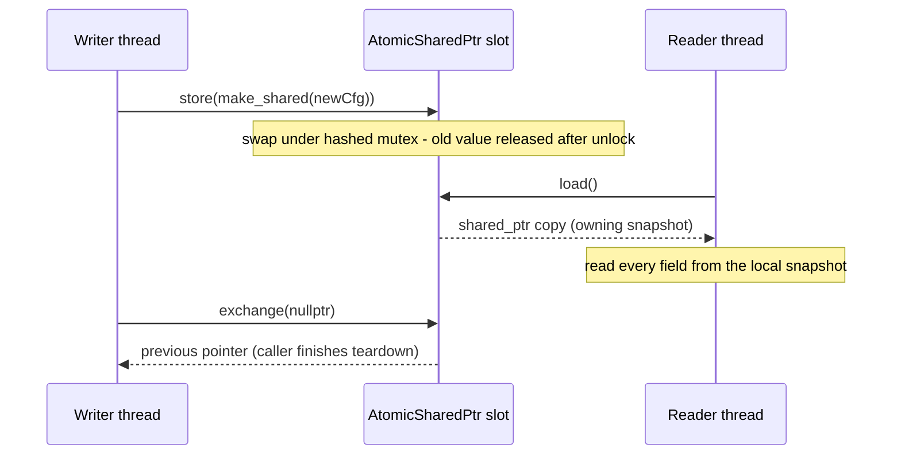
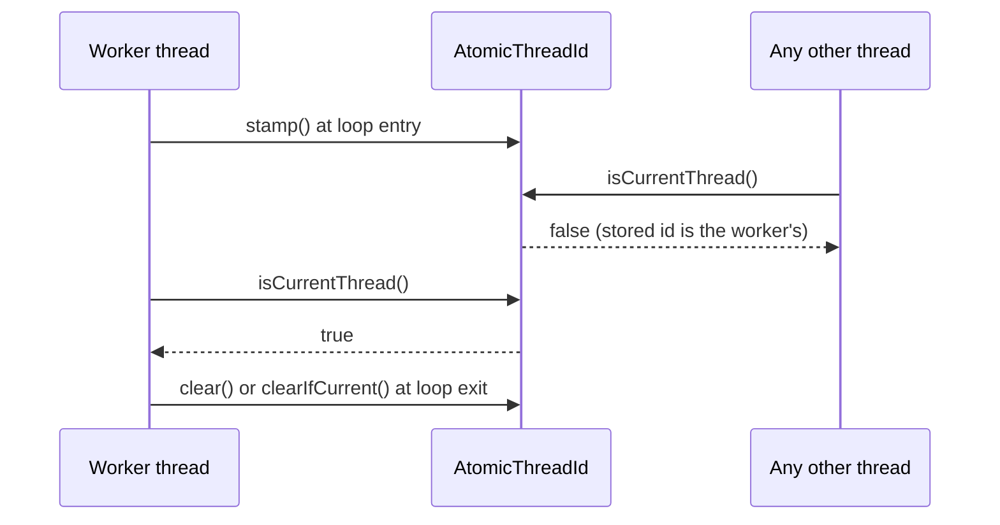

# Iora Atomic Primitives — Architecture & Programmer's Guide

[Back to index](../../README.md)

| | |
|---|---|
| **Version** | 1.2 |
| **Date** | 2026-09-24 |
| **Status** | IMPLEMENTED |
| **Headers** | `include/iora/core/atomic_shared_ptr.hpp` (`AtomicSharedPtr<T>`), `include/iora/core/atomic_thread_id.hpp` (`AtomicThreadId`) |
| **Namespace** | `iora::core` |
| **Dependencies** | Standard library only — `atomic_shared_ptr.hpp`: `<atomic>`, `<memory>`, `<utility>`; `atomic_thread_id.hpp`: `<atomic>`, `<thread>`. No intra-Iora headers. Header-only. |
| **Language level** | C++17 (the project sets `CMAKE_CXX_STANDARD 17`; see §9.4 for C++20 behavior) |

---

## Revision History

| Version | Date | Changes |
|---|---|---|
| 1.0 | 2026-09-24 | Initial guide (lite variant), authored against the implementation. Consolidates the two small concurrency primitives introduced together in commit `f31ccbc` (DnsTransport lifecycle-teardown restructure): `AtomicSharedPtr<T>`, a wrapper over the C++17 `std::atomic_load/store/exchange_explicit` free functions on a private `shared_ptr` member, and `AtomicThreadId`, a relaxed `std::atomic<std::thread::id>` "which thread am I?" stamp. Lock-freedom and memory-order behavior on the project toolchain (GCC 14.2 / libstdc++) were measured, not assumed. |
| 1.1 | 2026-09-24 | Doc-review round 1 fixes: mermaid `;` inside a `Note` removed; the EventLoop example no longer claims to mirror `TimerService` (whose `stop()` has no self-join guard — §9.7) and now has a destructor, a CAS-gated `stop()`, a single-controller rule and a stand-in-loop comment; forbidden memory orders corrected (load: release/acq_rel; store: acquire/acq_rel); cross-references to §9.x corrected; `AtomicThreadId` coherence wording (the stamper sees its own stamp only until another thread overwrites it); `clearIfCurrent()` resurrect-safety precondition stated and the detached-worker example serialized with a launch mutex + generation token; `_stateMutex` role corrected; replaced-value destruction on the calling thread (new anti-pattern + §5.1 note); `websocket_client.hpp` twin described as semantically different, not a drop-in; per-slot (not global) ordering and a weaker-than-default order warning; lock-free measurement context and 16-entry mutex pool; C++20 break scoped to non-system includes; `exchange(nullptr)`; `Worker::shutdown()` concurrency requirement; §9.2 recycled-id wording; detached-engine header-comment mismatch recorded (§9.8). |
| 1.2 | 2026-09-24 | Doc-review round 2 fixes: engine/`Transport` self-join guards correctly attributed to raw `getIoThreadId()` (not `isOnIoThread()`, which serves higher layers), and `DnsTransport`'s step-5 guard described as detaching; EventLoop CAS note no longer presents concurrent `stop()` as safe (the loser returns before the join completes); `Owner::start()` now `exchange()`s and shuts down a replaced worker; `Sweeper` gets a concrete generation loop that holds `_launchMutex` on every access, a `stopSweeper()`, the `shared_ptr`-ownership precondition and the newest-thread-only overlap caveat; deadlock mechanism restated (successor re-enters while being joined by another thread's teardown); `DnsTransport` stamp happens-before chain written out with line references; §9.7 now describes the ~5 s `drain(5000)` stall before the self-join throw; §9.5 hazard scoped to a later `reapWorker()` on the same stack, with the in-tree reap-before-teardown ordering; memory-order preconditions cited to the C++17 standard; coding_trackers paths prefixed and the test-gap tracker referenced. |

---

## 1. Executive Summary

### Problem

Two concurrency idioms were being hand-rolled across the network and timer layers:

1. **Atomically republished `shared_ptr` members.** `DnsTransport` holds its config and its UDP/TCP/timer handles in `shared_ptr` members that one thread replaces (`start()`, `stop()`, `updateConfig()`) while others read them. In C++17 the only race-free way to do that is the `std::atomic_load`/`std::atomic_store` free-function family (`std::atomic<std::shared_ptr<T>>` is C++20). The trap: the member's type stays a plain `std::shared_ptr<T>`, so a single stray `_config->x` or `_config = ...` compiles fine and is a silent data race (mixing atomic and non-atomic access to one `shared_ptr` is undefined behavior). No compiler or grep reliably catches it.
2. **"Am I the worker thread?" checks.** `EngineBase` (I/O thread), `TimerService` (run-loop thread) and `DnsTransport` (cleanup thread) each needed to ask, from any thread and concurrently with that worker starting or stopping, whether the caller *is* the worker — for re-entry refusal and teardown-deadlock exemption. Reading a raw `std::thread`'s `get_id()` while another thread moves, joins or detaches it is a data race.

### Solution

- **`AtomicSharedPtr<T>`** — a non-copyable slot holding a *private* `std::shared_ptr<T>` with only `load()`, `store()` and `exchange()`. Because there is no raw accessor, every access is forced through the atomic free functions: a bypass becomes a compile error rather than a latent race. When the project moves to C++20, only this wrapper needs to change.
- **`AtomicThreadId`** — a `std::atomic<std::thread::id>` that a worker `stamp()`s at loop entry and `clear()`s (or `clearIfCurrent()`s) at exit; any thread can then ask `isCurrentThread()` or `matches(id)` without a race. All operations are `noexcept` and relaxed.

### Technical Impact

- **Mechanical race prevention** — the `AtomicSharedPtr` API surface is the whole safety argument: no raw (non-atomic) access to the slot is expressible (§3.3 lists the misuses that remain possible).
- **Snapshot discipline made explicit** — `load()` returns an owning copy; a reader pins one snapshot into a local and reads every field from it, so a concurrent `store()` cannot tear a multi-field read or free the object mid-use.
- **Cheap, lock-free thread stamp** — `std::atomic<std::thread::id>` is lock-free on the project toolchain (`is_always_lock_free == true`, measured), so the stamp is safe to query from hot paths and destructors.
- **Honest cost model** — `AtomicSharedPtr` is **not** lock-free on libstdc++: each operation takes a process-wide hashed `pthread_mutex` (§5).

---

## 2. System Architecture

### 2.1 Where they sit

Both headers are leaf headers in `iora::core` with no Iora dependencies. Their consumers in the tree:

| Consumer | Member | Primitive | Purpose |
|---|---|---|---|
| `network/dns/dns_transport.hpp` | `_config` | `AtomicSharedPtr<const DnsConfig>` | Config hot-swap on `start()` / `updateConfig()`; readers snapshot via `loadConfig()` |
| `network/dns/dns_transport.hpp` | `_udpTransport`, `_tcpTransport` | `AtomicSharedPtr<Transport>` | Transport handles published on start, cleared on stop; read via `loadUdp()` / `loadTcp()` |
| `network/dns/dns_transport.hpp` | `_timerService` | `AtomicSharedPtr<core::TimerService>` | Retry-timer handle; read via `loadTimer()` |
| `network/dns/dns_transport.hpp` | `_cleanupThreadId` | `AtomicThreadId` | Detached cleanup thread's identity for the teardown-latch exemption (`isTeardownExemptLocked`); stamped at entry, `clearIfCurrent()` at exit |
| `network/detail/engine_base.hpp` | `_ioThreadId` | `AtomicThreadId` | `isOnIoThread()`; stamped by `stampIoThread()` / cleared by `clearIoThread()` in the UDP and TCP engine loop threads |
| `core/timer.hpp` | `_timerThreadId` | `AtomicThreadId` | `isOnTimerThread()`; stamped at `runLoop()` entry, cleared first thing in its exit guard |

(`network/websocket_client.hpp` still carries its own hand-rolled `std::atomic<std::thread::id> _ioThreadId` rather than `AtomicThreadId`. Its semantics differ — a lazy per-callback stamp plus a mid-callback reset — so it is not a drop-in migration; see §9.5.)

### 2.2 Data flow — publish and snapshot



### 2.3 Data flow — thread stamp



---

## 3. Component Deep Dive and Usage

### 3.1 `AtomicSharedPtr<T>`

```cpp
template <typename T> class AtomicSharedPtr
{
  // ...
private:
  std::shared_ptr<T> _p;
};
```

- **Construction.** Default-constructed holds an empty pointer; `explicit AtomicSharedPtr(std::shared_ptr<T> initial)` moves `initial` into `_p`. Construction is a plain (non-atomic) initialization — it is safe only because no other thread can see the object yet.
- **Not copyable, not movable.** The copy constructor and copy assignment are `= delete`; because they are user-declared, no move operations are implicitly generated either. The slot lives where it is declared (typically as a class member).
- **`load(order = std::memory_order_acquire) const`** returns `std::atomic_load_explicit(&_p, order)` — a new owning `shared_ptr` copy.
- **`store(value, order = std::memory_order_release)`** calls `std::atomic_store_explicit(&_p, std::move(value), order)`.
- **`exchange(value, order = std::memory_order_acq_rel)`** returns `std::atomic_exchange_explicit(&_p, std::move(value), order)` — the previous pointer.
- **No `noexcept`** on any method (matching the underlying free functions, which are not `noexcept` in libstdc++), and no compare-exchange, `operator->`, `get()` or implicit conversion.

`T` may be `const`-qualified: `DnsTransport` uses `AtomicSharedPtr<const DnsConfig>`, which makes the published configuration immutable — a writer replaces the whole object rather than mutating it in place.

#### Usage — configuration hot-swap (snapshot once per operation)

```cpp
#include <iora/core/atomic_shared_ptr.hpp>

#include <chrono>
#include <memory>
#include <string>

struct ServiceConfig
{
  std::string upstream;
  std::chrono::milliseconds timeout{1000};
};

class Service
{
public:
  explicit Service(ServiceConfig cfg)
    : _config(std::make_shared<const ServiceConfig>(std::move(cfg)))
  {
  }

  void updateConfig(ServiceConfig cfg)
  {
    _config.store(std::make_shared<const ServiceConfig>(std::move(cfg)));
  }

  std::string describe() const
  {
    auto cfg = _config.load();
    return cfg->upstream + " / " + std::to_string(cfg->timeout.count()) + "ms";
  }

private:
  iora::core::AtomicSharedPtr<const ServiceConfig> _config;
};
```

`describe()` reads `upstream` and `timeout` from the **same** snapshot. Calling `_config.load()` twice would take the lock twice and could observe two different configs.

#### Usage — publish on start, take ownership on stop

```cpp
#include <iora/core/atomic_shared_ptr.hpp>

#include <atomic>
#include <memory>

class Worker
{
public:
  // Must be safe to call while readers holding an older snapshot still call doWork().
  void shutdown() noexcept { _stopped.store(true, std::memory_order_release); }

  bool doWork() const noexcept { return !_stopped.load(std::memory_order_acquire); }

private:
  std::atomic<bool> _stopped{false};
};

class Owner
{
public:
  void start()
  {
    std::shared_ptr<Worker> old = _worker.exchange(std::make_shared<Worker>());
    if (old)
    {
      old->shutdown();
    }
  }

  void stop()
  {
    std::shared_ptr<Worker> old = _worker.exchange(nullptr);
    if (old)
    {
      old->shutdown();
    }
  }

  bool poll() const
  {
    auto w = _worker.load();
    return w && w->doWork();
  }

private:
  iora::core::AtomicSharedPtr<Worker> _worker;
};
```

`exchange()` makes the "take it out and tear it down" step atomic: exactly one `stop()` (or restarting `start()`) caller receives a given non-null handle. `start()` uses `exchange()` rather than `store()` so that a `start()` on a still-running owner shuts the replaced worker down instead of silently dropping a live one. Readers that loaded a snapshot before the exchange keep the object alive until they drop it — and may still be calling into it while `shutdown()` runs. So `shutdown()` (and every method a reader can reach) must be safe against that concurrent use; here the stop flag is itself atomic (see also §5.1, "Does NOT guarantee").

### 3.2 `AtomicThreadId`

```cpp
class AtomicThreadId
{
  // ...
private:
  std::atomic<std::thread::id> _id{};
};
```

The default value is `std::thread::id{}` ("no thread"), so `isCurrentThread()` is `false` for every caller until `stamp()` runs.

| Method | Implementation | Use |
|---|---|---|
| `stamp()` | `_id.store(std::this_thread::get_id(), relaxed)` | First thing in the worker's loop thread |
| `clear()` | `_id.store(std::thread::id{}, relaxed)` | Loop exit of a joined (or owned-and-dying) worker |
| `clearIfCurrent()` | `compare_exchange_strong(expected = this_thread id, std::thread::id{}, relaxed)` | Loop exit of a **detached** worker that may overlap a successor — does not wipe a successor's newer stamp |
| `isCurrentThread() const` | `_id.load(relaxed) == std::this_thread::get_id()` | "Am I the worker?" from any thread |
| `matches(std::thread::id t) const` | `_id.load(relaxed) == t` | Decide about a thread id the caller already holds (e.g. `DnsTransport::isTeardownExemptLocked(me)`) |

All five methods are `noexcept`. The class has no user-declared special members, so the implicit copy/move operations are deleted (because `std::atomic` is neither copyable nor movable); it is used as a member in place.

#### Usage — joined worker with a self-join guard

```cpp
#include <iora/core/atomic_thread_id.hpp>

#include <atomic>
#include <stdexcept>
#include <thread>

class EventLoop
{
public:
  ~EventLoop() { stop(); }

  void start()
  {
    _running.store(true, std::memory_order_release);
    _thread = std::thread(
      [this]
      {
        _loopThreadId.stamp();
        while (_running.load(std::memory_order_acquire))
        {
          // Stand-in for the real event-loop wait (condition variable, epoll_wait, ...).
          std::this_thread::yield();
        }
        _loopThreadId.clear();
      });
  }

  void stop()
  {
    if (_loopThreadId.isCurrentThread())
    {
      throw std::logic_error("stop() called from the loop thread would self-join");
    }
    bool expected = true;
    if (!_running.compare_exchange_strong(expected, false, std::memory_order_acq_rel))
    {
      return;
    }
    if (_thread.joinable())
    {
      _thread.join();
    }
  }

  bool isOnLoopThread() const noexcept
  {
    return _loopThreadId.isCurrentThread();
  }

private:
  std::atomic<bool> _running{false};
  std::thread _thread;
  iora::core::AtomicThreadId _loopThreadId;
};
```

Stamp before any callback can run, clear before the thread ends. The example shows the intended pattern; it is not a mirror of any in-tree class, whose guards differ:

- **Engines / `Transport`.** Their own self-join guards do **not** use `isOnIoThread()`. They compare `std::this_thread::get_id()` against `getIoThreadId()`, which returns the raw `_loop.get_id()` (`network/detail/udp_engine.hpp:321`; guards at `network/transport_impl.hpp:715, 780, 816, 876, 1025, 1134, 1270`). `engine_base.hpp:158-166` documents the two as deliberately distinct: `getIoThreadId()` becomes the default id immediately on `detachForTermination()`, and the drain and sync-operation deadlock guards rely on exactly that. `isOnIoThread()` (the `AtomicThreadId` read) is consumed by **higher layers** that must ask from any thread concurrently with start/stop — `Transport::isOnIoThread()`, `DnsTransport::isTeardownExemptLocked()` (`dns_transport.hpp:465, 472`) and iora_sip's transport-lifecycle refusal.
- **`DnsTransport`.** `isTeardownExemptLocked()` (the `AtomicThreadId` reads) makes a re-entrant `start()` / `stop()` return instead of parking on `_stateCv`. The self-join guard at `stop()` step 5 compares `cleanupLocal.get_id()` (the moved-out `std::thread`) with the caller's id and, on a match, **detaches** the cleanup thread rather than refusing the call.
- **`TimerService`** stamps `_timerThreadId` but its `stop()` does **not** consult it today (§9.7).

Notes on the example:

- `std::thread::join()` already throws `std::system_error` (`resource_deadlock_would_occur`) on a self-join; the guard's value is that it fails **before** mutating `_running`, so a refused call leaves the loop running and the object consistent.
- `stop()` is gated by `compare_exchange_strong(true, false)`, so a repeated `stop()` — e.g. the destructor after an explicit `stop()` — is a no-op. This is **not** a license for concurrent `stop()` calls: the losing caller returns immediately, **before** the winner's `join()` has completed, so it must not treat its return as "the thread is gone" (and must not destroy the object on it). That is one reason for the single-controller rule below.
- `start()` and `stop()` are **single-controller**: call them from one controlling thread (or serialize them externally). `start()` on an object whose previous thread was never joined would assign over a joinable `std::thread` and terminate.
- `~EventLoop()` calls `stop()`, so destroying a running loop joins it. Destroying it **on** the loop thread would throw out of the destructor and terminate.

#### Usage — detached worker with resurrect-safe clear

```cpp
#include <iora/core/atomic_thread_id.hpp>

#include <chrono>
#include <cstdint>
#include <memory>
#include <mutex>
#include <thread>

// Must be owned by a std::shared_ptr: weak_from_this() is empty otherwise.
class Sweeper : public std::enable_shared_from_this<Sweeper>
{
public:
  void launchDetached()
  {
    std::lock_guard<std::mutex> lock(_launchMutex);
    const std::uint64_t myGeneration = ++_generation;
    std::weak_ptr<Sweeper> weakSelf = weak_from_this();
    std::thread(
      [weakSelf, myGeneration]
      {
        {
          auto self = weakSelf.lock();
          if (!self)
          {
            return;
          }
          std::lock_guard<std::mutex> lock(self->_launchMutex);
          if (self->_generation != myGeneration)
          {
            return;
          }
          self->_sweeperId.stamp();
        }
        struct StampGuard
        {
          std::weak_ptr<Sweeper> w;
          ~StampGuard()
          {
            if (auto s = w.lock())
            {
              s->_sweeperId.clearIfCurrent();
            }
          }
        } guard{weakSelf};
        for (;;)
        {
          auto self = weakSelf.lock();
          if (!self)
          {
            return;
          }
          {
            std::lock_guard<std::mutex> lock(self->_launchMutex);
            if (self->_generation != myGeneration)
            {
              return;
            }
          }
          // One sweep pass here, with no lock held.
          std::this_thread::sleep_for(std::chrono::milliseconds(10));
        }
      })
      .detach();
  }

  void stopSweeper()
  {
    std::lock_guard<std::mutex> lock(_launchMutex);
    ++_generation;
  }

  bool isSweeper(std::thread::id who) const noexcept
  {
    return _sweeperId.matches(who);
  }

private:
  std::mutex _launchMutex;
  std::uint64_t _generation = 0;
  iora::core::AtomicThreadId _sweeperId;
};
```

`clearIfCurrent()` protects a successor's stamp **only if the predecessor's `stamp()` happens-before the successor's `stamp()`**. Without that ordering, two back-to-back launches can race: the successor stamps first, the predecessor stamps late (overwriting it), then the predecessor's exit `clearIfCurrent()` succeeds and erases the live successor's identity. The successor's `isSweeper()` / `isCurrentThread()` then returns `false`. In a `DnsTransport`-style teardown exemption that false negative deadlocks: while the successor is being joined by **another** thread's teardown, a callback on the successor re-enters `stop()` / `start()`, is not recognized as exempt, and parks on the state condition variable waiting for a settled state that the teardown publishes only **after** its join of that same successor returns.

Notes on the example:

- **Ownership.** `Sweeper` must be owned by a `std::shared_ptr` (`std::make_shared<Sweeper>()`). On a stack or `unique_ptr`-owned object, `weak_from_this()` is empty, `weakSelf.lock()` fails and the thread exits immediately without sweeping. `DnsTransport` has the same precondition (`weak_from_this()` at `dns_transport.hpp:2356`).
- **Generation is mutex-guarded.** `_generation` is a plain `std::uint64_t`, so **every** access — the bump in `launchDetached()` / `stopSweeper()`, the entry check-and-stamp, and the per-iteration check in the loop — holds `_launchMutex`. (The alternative is `std::atomic<std::uint64_t> _generation`, which lets the per-iteration check drop the lock; the entry check-and-stamp must still happen under `_launchMutex`, otherwise a superseded thread can pass the check, lose the CPU, and stamp after its successor.) The example uses the mutex throughout.
- **Stamp ordering.** The generation bump and the stamp both happen under `_launchMutex`, and a thread whose generation was superseded before it acquired the lock never stamps. So every stamp is ordered after the previous one by the mutex, which is the precondition above.
- **Overlap: only the newest thread is recognized.** A superseded thread keeps running until its next generation check (here, up to one sweep pass). During that overlap the stamp names only the newest thread; the superseded one gets `isSweeper() == false` and `isCurrentThread() == false`. An exemption keyed on the stamp is therefore safe only if nothing ever joins or waits on a superseded thread (which a detached thread guarantees, provided no teardown waits for it by other means).

`DnsTransport` satisfies the stamp-ordering precondition differently. A predecessor cleanup thread survives into a successor's lifetime only when `stop()` ran **on** that thread and detached it (`stop()` step 5); every other predecessor is joined by `stop()` before a new `start()` can launch. For the detached predecessor the happens-before chain is:

1. The predecessor stamps at lambda entry (`dns_transport.hpp:2370`), sequenced before everything else it does — including the sweep callback that calls `stop()`.
2. That `stop()`, running on the predecessor, publishes `Stopped` and releases `_stateMutex` at the end of step 8 (lock taken at `:923`, released at the block end `~:935`).
3. The successor's `start()` acquires `_stateMutex` (`:678`) and can only leave its wait loop after observing `Stopped`, so that acquisition synchronizes with the step-8 release.
4. Still under `_stateMutex`, `start()` calls `startCleanupTimer()`, which constructs the successor `std::thread` (`:2357`); thread construction synchronizes with the start of the new thread's function.
5. The successor stamps at its lambda entry (`:2370`).

The cleanup lambda stamps exactly once, before any callback it runs. The `_cleanupGeneration` token then makes the stale predecessor exit at its next loop check; until then the overlap note above applies.

### 3.3 Anti-patterns

- **Do NOT** call `load()` once per field. Snapshot into a local and read every field from it.
- **Do NOT** pass `memory_order_release` or `memory_order_acq_rel` to `load()`, or `memory_order_acquire` or `memory_order_acq_rel` to `store()` (the C++17 standard's preconditions on the `shared_ptr` overloads of `std::atomic_load_explicit` / `std::atomic_store_explicit`, [util.smartptr.shared.atomic]: "*Requires:* `mo` shall not be `memory_order_release` or `memory_order_acq_rel`" for load, and "shall not be `memory_order_acquire` or `memory_order_acq_rel`" for store — violating them is undefined behavior; libstdc++ documents the same. `atomic_shared_ptr.hpp:45-54` forwards the argument unchanged). `exchange()` accepts any order. The wrapper does not check this; libstdc++ happens to ignore the argument (§5.1).
- **Do NOT** pass an order weaker than the defaults for a slot that publishes data (e.g. `load(std::memory_order_relaxed)`). On libstdc++ today the internal mutex still publishes the pointee, but after a C++20 migration to `std::atomic<std::shared_ptr<T>>` a relaxed load loses the guarantee that the pointee's construction is visible.
- **Do NOT** replace-and-drop under a lock the old pointee needs. `store()` destroys the replaced value, and an ignored `exchange()` result is destroyed, **synchronously on the calling thread** (after the internal pool mutex is released). If that was the last reference, the old object's destructor — and any callbacks or joins it performs — runs right there, still under whatever locks the caller holds. Keep the old value in a local (`auto old = slot.exchange(nullptr);`) and let it go after unlocking. `DnsTransport::stop()` relies on this: its step-3 locals `udp` / `tcp` / `timer` (`dns_transport.hpp` ~799-801) pin the objects, so the step-8 `store()` of null handles under `_stateMutex` (~919-935) never runs a transport or timer destructor under that lock.
- **Do NOT** rely on `AtomicThreadId` to publish data. It carries no happens-before; if you need to see state the worker wrote, synchronize through a mutex or an acquire/release atomic you already have.
- **Do NOT** use `clear()` on a detached worker that can overlap a successor; use `clearIfCurrent()`.
- **Do NOT** make the stamp later than the first callback the worker can run — `isCurrentThread()` would be wrongly `false` for that callback.

---

## 4. Call Flow / Sequence Reference

Covered by the two diagrams in §2.2 and §2.3; neither type has internal state machines or multi-step call flows beyond a single atomic operation.

---

## 5. Thread Safety Model

### 5.1 `AtomicSharedPtr<T>` — what the toolchain actually does

| Method | Default order (source) | libstdc++ (GCC 14.2) behavior |
|---|---|---|
| `load` | `memory_order_acquire` | Takes `_Sp_locker` on `&_p`, copies `*__p`, unlocks. The `memory_order` argument is **ignored**. |
| `store` | `memory_order_release` | Takes `_Sp_locker`, `swap`s the new value in, unlocks; the previous value is destroyed **after** the lock is released, on the storing thread. Order ignored. |
| `exchange` | `memory_order_acq_rel` | Takes `_Sp_locker`, swaps, returns the previous value. Order ignored. |

Verified on the project toolchain:

- `std::atomic_is_lock_free(&sp)` returns `0` for a `std::shared_ptr` — **not lock-free** (measured with GCC 14.2 and glibc 2.41). libstdc++ implements it as `__gthread_active_p() == 0`; with glibc >= 2.34 (libpthread merged into libc) threads are always "active", so it reports `false`. On older glibc a program not linked with libpthread has inactive threads, so it reports lock-free and the gthread mutex wrappers skip locking (not reproducible on this host); such a program is single-threaded by construction.
- `_Sp_locker`'s constructor hashes the object's address (`std::_Hash_bytes`) and calls **`pthread_mutex_lock`** on one entry of a process-wide pool of **16** mutexes, each padded to its own 64-byte cache line (checked by disassembling `std::_Sp_locker::_Sp_locker(void const*)` in `libstdc++.so.6.0.33`: the hash is masked with `and $0xf`). It is a hashed *mutex* table, not a spinlock.
- Because every operation on a slot goes through that slot's mutex, operations on **one slot** are totally ordered, and each behaves at least as acquire (load) / release (store) — regardless of the `order` argument. This is per-slot: there is no global sequentially consistent order across different slots (two slots usually map to different pool mutexes). The source defaults document intent (safe publication) and become meaningful after a C++20 migration to `std::atomic<std::shared_ptr<T>>`; do not rely on the mutex to rescue a weaker order (§3.3).
- `store()` swaps under the lock and destroys the replaced value after the lock is released, **on the storing thread**; an `exchange()` result the caller drops is destroyed on the caller's thread too. See the replace-and-drop anti-pattern in §3.3.

**Guarantees:** concurrent `load` / `store` / `exchange` on the same slot are race-free; a `load` returns a fully-formed owning pointer whose object stays alive while the snapshot is held; the object pointed to is published safely (a reader that obtains the new pointer also sees the writes that constructed it).

**Does NOT guarantee:** lock-freedom; synchronization of the *pointee* (concurrent mutation of a non-`const` `T` still needs its own synchronization — prefer `AtomicSharedPtr<const T>`); consistency across two different slots (DnsTransport's `_udpTransport` and `_tcpTransport` are published by two separate `store()` calls, so a reader may see one updated and not the other); anything about the destructor of a replaced value, which runs on whichever thread drops the last reference (the storing thread, an `exchange` caller, or the last reader).

Construction and destruction of the `AtomicSharedPtr` object itself are not atomic; the owner must ensure no concurrent access at those points (the usual rule for any member).

### 5.2 `AtomicThreadId`

| Method | Order | Atomic operation |
|---|---|---|
| `stamp` | `relaxed` | store |
| `clear` | `relaxed` | store |
| `clearIfCurrent` | `relaxed` (success and failure) | `compare_exchange_strong` |
| `isCurrentThread` | `relaxed` | load |
| `matches` | `relaxed` | load |

`std::atomic<std::thread::id>` is lock-free on the project toolchain (`is_lock_free() == 1`, `is_always_lock_free == 1`, measured; `std::thread::id` wraps a `pthread_t`).

**Why relaxed is enough** (per the header's rationale): the stored value is only ever compared for equality against a thread's own id and publishes no companion data. By write-read coherence, a thread that stamped the slot sees its own stamp — **until another thread overwrites it**. After a successor re-stamps (or another thread clears), the stale thread's `isCurrentThread()` answer is unspecified until it synchronizes with that write; use the answer only where either result is safe. No other live thread can hold the stamper's id, so the answer is `false` for everyone else — unless the id has been recycled (§9.2).

**Guarantees:** race-free reads concurrent with stamp/clear; `clearIfCurrent()` clears iff the slot still holds the caller's id (atomic CAS). That protects a successor's stamp only when the predecessor's `stamp()` happens-before the successor's `stamp()` (§3.2, detached-worker example); the CAS alone cannot order two stamps that raced.

**Does NOT guarantee:** any happens-before edge — callers needing cross-thread ordering must synchronize through a mutex or atomic that also covers the stamp/clear writes. Merely holding a mutex around the *read* orders nothing if `stamp()` / `clear()` are not done under the same mutex. `DnsTransport` calls `isTeardownExemptLocked()` under `_stateMutex`, but that mutex guards `_stoppingThreadId`, not `_cleanupThreadId`; the `_cleanupThreadId` check relies only on the stamper's own program order (the cleanup thread asking about itself). Also not guaranteed: immunity to thread-id reuse (§9.2).

---

## 6. Configuration Reference

N/A. Neither type has configuration; the only tunables are the per-call `std::memory_order` arguments on `AtomicSharedPtr` (defaults in §5.1), which libstdc++ ignores.

---

## 7. API Reference

```cpp
namespace iora
{
namespace core
{

template <typename T> class AtomicSharedPtr
{
public:
  AtomicSharedPtr() = default;
  explicit AtomicSharedPtr(std::shared_ptr<T> initial);

  AtomicSharedPtr(const AtomicSharedPtr &) = delete;
  AtomicSharedPtr &operator=(const AtomicSharedPtr &) = delete;

  std::shared_ptr<T> load(std::memory_order order = std::memory_order_acquire) const;
  void store(std::shared_ptr<T> value, std::memory_order order = std::memory_order_release);
  std::shared_ptr<T> exchange(std::shared_ptr<T> value,
                              std::memory_order order = std::memory_order_acq_rel);
};

class AtomicThreadId
{
public:
  void stamp() noexcept;
  void clear() noexcept;
  void clearIfCurrent() noexcept;
  bool isCurrentThread() const noexcept;
  bool matches(std::thread::id t) const noexcept;
};

} // namespace core
} // namespace iora
```

---

## 8. Design Decisions

| Decision | Rationale |
|---|---|
| Wrap the C++17 free functions rather than use `std::atomic<std::shared_ptr<T>>` | The project is C++17; the atomic specialization is C++20. The wrapper confines the migration to one file. |
| Private member, no raw accessor, no `operator->` | Makes a non-atomic access to the slot a compile error — the whole point of the type. |
| Copy deleted (and therefore no move) | A copy or move of the slot would be a non-atomic read/write of the wrapped `shared_ptr`. |
| Defaults acquire / release / acq_rel | The intent-legible orders for safe publication, and the correct defaults once the backing becomes `std::atomic<std::shared_ptr<T>>`. |
| `AtomicThreadId` uses relaxed ordering throughout | The id is only equality-compared against a thread's own id and publishes nothing; stronger orders would add cost without adding a guarantee callers rely on. |
| Separate `clear()` and `clearIfCurrent()` | Joined workers can clear unconditionally; detached workers that may overlap a restarted successor need the CAS so a stale exit does not wipe a fresh stamp. |
| `matches(std::thread::id)` in addition to `isCurrentThread()` | Lets a caller that already holds its own id (e.g. `isTeardownExemptLocked(me)`) avoid repeated `get_id()` calls, or ask about a thread other than itself. |
| All `AtomicThreadId` methods `noexcept` | Called from destructors and exit guards (`TimerService`'s `ExitGuard`, `DnsTransport`'s `StampGuard`), where a throw would terminate. |

---

## 9. Known Limitations

### 9.1 `AtomicSharedPtr` is mutex-based, not lock-free

On libstdc++ every `load`/`store`/`exchange` locks a `pthread_mutex` chosen by hashing the slot's address into a process-wide pool of 16 cache-padded mutexes. Unrelated slots that hash to the same entry contend with each other: any two distinct slots share a mutex with probability about 1/16, and with N hot slots in the process the expected number of pool entries in use is only 16·(1 − (15/16)^N) (≈ 10 of 16 for N = 16), so false contention rises quickly with the number of concurrently hot slots. Every `shared_ptr` atomic free-function call in the process (not only `AtomicSharedPtr`) shares the same pool. The per-call `std::memory_order` argument has no effect on this implementation. The header comment calls it a "spinlock table" (§9.8).

### 9.2 `AtomicThreadId` can false-positive on a recycled thread id

If a stamped thread terminates without clearing its stamp, the OS may reuse its id for a new thread, which would then see `isCurrentThread()` / `matches()` return `true` for the stale stamp. The primitive itself does not prevent this; it depends on every consumer clearing before its thread ends. No current consumer can end a stamped thread without clearing it: `TimerService` clears in `runLoop()`'s exit guard, the UDP/TCP engines call `clearIoThread()` at loop exit, and `DnsTransport`'s cleanup thread runs `clearIfCurrent()` in its `StampGuard` (skipped only when the `DnsTransport` is already gone, in which case the slot is gone with it). `dns_transport.hpp:452`'s "a false positive is impossible" is therefore true for the current consumers, not a property of the primitive in general. The header describes a false positive as benign for current uses (it only takes an early-return "I am the worker" branch in the teardown-latch exemption or I/O-thread re-entry refusal) and suggests a monotonic epoch if a future use needs hardening.

### 9.3 No compare-exchange on `AtomicSharedPtr`

Only `load`, `store` and `exchange` are provided. A read-modify-write that must be conditional on the current value (CAS loop) needs an external mutex.

### 9.4 Deprecated under C++20

In C++20 mode libstdc++ marks `std::atomic_load_explicit` / `std::atomic_store_explicit` / `std::atomic_exchange_explicit` on `shared_ptr` as deprecated. `-Wdeprecated-declarations` is on by default, so instantiating `AtomicSharedPtr<T>::load()` with `-std=c++20 -Werror` fails with `-Werror=deprecated-declarations` — but only when the Iora headers are reached as a **non-system** include (`-I`). Reached through `-isystem`, the warning is suppressed and the build succeeds (both verified with GCC 14.2). CMake imported targets (e.g. via `find_package`) normally pass their include directories as `-isystem`, so a typical C++20 consumer is unaffected; a consumer that adds the Iora `include/` directory with plain `-I` and `-Werror` breaks until the wrapper is migrated to `std::atomic<std::shared_ptr<T>>`.

### 9.5 Not yet the single home of the thread-stamp idiom

The `AtomicThreadId` header describes itself as the single home of an idiom that was hand-rolled in three places. `network/websocket_client.hpp` still declares its own `std::atomic<std::thread::id> _ioThreadId` with hand-written relaxed `store`/`load` calls instead of using `AtomicThreadId`, and its semantics are different, so it is not a drop-in migration:

- **Lazy per-callback stamp.** The id is stored at the top of each transport callback (`onData`, `onClose`, `onError`; `websocket_client.hpp` ~568/578/588), not once at loop entry.
- **Unconditional mid-callback reset.** `teardownTransport()` resets `_ioThreadId` to `std::thread::id{}` (~1189) even when it is running **on** the I/O thread, still inside the callback stack — e.g. `onData` → `handleData` → `closeWithError()` (~958) → `teardownTransport()` (~993). If any later code on that same stack called `reapWorker()`, it would compute `onIo == false` (~1271) and could move and join `_reconnectWorker` from the I/O thread. No in-tree sequence does this today: every in-tree caller runs `reapWorker()` **before** `teardownTransport()` — `disconnect()` (~329-330), the destructor (~155/159) and the connect-failure path (~315-316) — and `closeWithError()` fires `_onError` before its teardown, so a user callback calling `disconnect()` from there reaps while the stamp is still set. The hazard is latent: it depends on that ordering holding, not on the stamp.

Migrating it (tracked in `coding_trackers: tasks/iora/backlog/2026-09-15-4_websocket-client-migrate-atomicthreadid_P2.json`) needs those semantics resolved, not a type substitution.

### 9.6 No dedicated unit tests

Neither header has its own test file under `tests/`; both are exercised only indirectly through their consumers (notably `iora_test_dns_transport_lifecycle_restructure`). The test gap, and the comment mismatches in §9.8, are tracked in `coding_trackers: tasks/iora/backlog/2026-09-24-20_atomic-primitives-tests-and-comment-accuracy_P1.json`.

### 9.7 `TimerService::stop()` has no self-join guard

`TimerService` stamps `_timerThreadId` and exposes `isOnTimerThread()`, but `stop()` (`core/timer.hpp` ~880-921) never consults it. Called from a timer callback while the service is `Running`, it:

1. **Stalls ~5 s in `drain(5000)` first** (`timer.hpp` ~895-901). The calling callback is itself counted in `_executingCallbacks`, and `drainDone` requires that count to be 0 (~800; the count is pre-announced before callbacks fire, ~1556-1557), so the drain cannot finish until its budget expires. For those ~5 s the timer thread — and therefore every other timer on the service — is blocked inside the callback, and the service sits in `Draining` with `_accepting == false`, so new timers are rejected. `drain(5000)` has also cancelled every periodic timer and every one-shot due after the 5 s deadline; that is not undone. On timeout it restores `Draining` → `Running` (~850-859).
2. **Then self-joins.** It CASes `_running` to `false` and calls `_thread.join()` on its own thread, which throws `std::system_error` (`resource_deadlock_would_occur`). `cleanup()` and `finalizeStoppedLocked()` are skipped, so the service is left `Running` in its lifecycle state with `_running == false`; the run loop exits once the callback returns.

`DnsTransport::stop()` catches that throw and leaves its timer handle intact — and, when `stop()` is driven from its own retry-timer callback (`timer->stop()` at `dns_transport.hpp:876`), it absorbs the ~5 s stall first. Tracked in `coding_trackers: tasks/iora/ongoing/2026-09-13-5_timerservice-stop-join-on-self_P0.json`.

### 9.8 Header comments that do not match the implementation

- `atomic_shared_ptr.hpp` (line 30) says `load()` takes "the shared_ptr atomic's internal spinlock table"; on libstdc++ it is a table of `pthread_mutex`es (§9.1).
- `atomic_thread_id.hpp:42-43` says a join-on-stop thread (engine/timer) has no recycled-id window because "its id is cleared before the thread is joinable-reused". The engines are not always joined: on I/O-thread teardown the transport schedules a self-destruct and calls `detachForTermination()` (`network/transport_impl.hpp:729-730`), so the engine loop thread is detached. The engines still call `clearIoThread()` at loop exit before the self-destruct deleter runs, so the window stays closed in practice (§9.2), but the stated reason (join-on-stop) does not hold for that path.

---

[Back to index](../../README.md)
