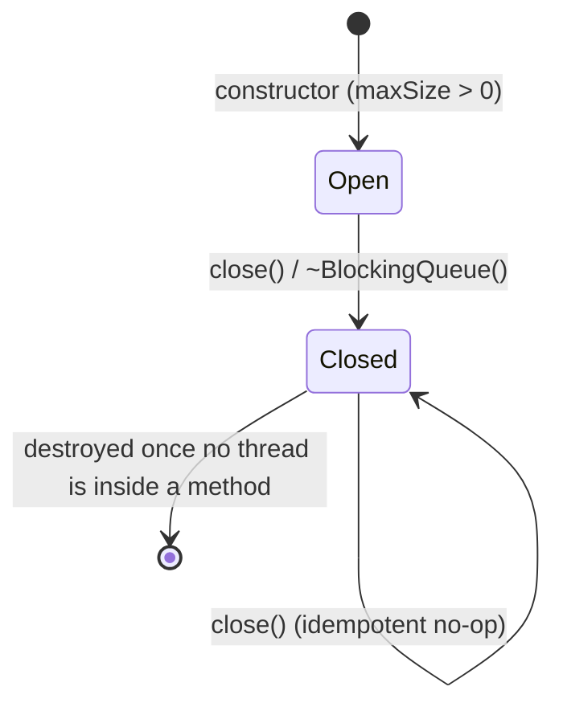

# Iora BlockingQueue -- Architecture & Programmer's Guide

[Back to index](../../README.md)

| | |
|---|---|
| **Version** | 1.1 |
| **Date** | 2026-09-10 |
| **Status** | IMPLEMENTED |
| **Header** | `include/iora/core/blocking_queue.hpp` |
| **Namespace** | `iora::core` |
| **Dependencies** | Standard library only -- `<atomic>`, `<chrono>`, `<condition_variable>`, `<deque>`, `<mutex>`, `<stdexcept>`. Header-only, single class template, no intra-Iora and no external/third-party dependencies. Portable (no OS-specific interfaces). |

---

## Revision History

| Version | Date | Changes |
|---|---|---|
| 1.0 | 2026-09-10 | Initial Architecture & Programmer's Guide. Authored directly against `include/iora/core/blocking_queue.hpp` (386 lines) and cross-checked against `tests/core/iora_test_blocking_queue.cpp` (22 `TEST_CASE`s). The README "Thread-Safe Blocking Queue" section describes the same API but omits the shutdown/wakeup hazard documented here; this guide documents the **actual** shipped behavior, including a lost-wakeup defect in `close()` (see Known Limitations, section 12). |
| 1.1 | 2026-09-10 | Synced with commit `eec6356`: the `close()` lost-wakeup hang is **fixed** (`_closed` is now mutated under `_mutex` before notifying) -- section 8.4 and Known Limitations flipped from defect to resolved. Reordered Thread Safety Model (now section 7) before Configuration Reference (now section 8) per the doc-writer template; sections renumbered contiguously. Escaped the template angle brackets in the section 3 heading. |

---

## 1. Executive Summary

### Problem

A threaded C++17 framework repeatedly needs to hand work from one set of threads to another with back-pressure: a dispatcher feeding a worker set, a network reader feeding a parser, a producer that must be throttled when consumers fall behind. Rolling this by hand each time -- a `std::deque` plus a `std::mutex` plus one or two `std::condition_variable`s plus a "we are shutting down" flag -- is repetitive and easy to get wrong. The subtle parts are the *predicate* each waiter blocks on, the *capacity* bound that turns an unbounded queue into a back-pressure signal, and the *shutdown* path that must wake every parked thread so a service can tear down cleanly.

### Solution

`iora::core::BlockingQueue<T, IdType>` is a single-header, bounded, multi-producer / multi-consumer FIFO queue:

- **A `std::deque<T>` behind one `std::mutex`** with **two condition variables** -- `_condNotEmpty` (consumers wait here) and `_condNotFull` (producers wait here). Splitting the wait predicates across two CVs means every waiter on a given CV is homogeneous, which avoids the heterogeneous-waiter lost-wakeup class that a single shared CV would invite.
- **Three producer flavors and three consumer flavors** -- blocking (`queue`/`dequeue`), timed (`tryQueue(item, timeout)`/`dequeue(out, timeout)`), and non-blocking (`tryQueue(item)`/`tryDequeue`). Each producer flavor has a `const T&` (copy) and a `T&&` (move) overload.
- **Bounded capacity fixed at construction** (`maxSize`, default `1024`, `const` for the object's lifetime); a zero capacity is rejected with `std::invalid_argument`.
- **Boolean results, never exceptions, on the transfer path** -- `dequeue`/`queue`/`tryQueue`/`tryDequeue` all return `bool`; only the constructor throws.
- **Graceful shutdown via `close()`** -- flips an `std::atomic<bool>` and broadcasts both CVs so parked producers and consumers unblock; queued items remain drainable after close, then dequeue returns `false`.

### Technical Impact

- **O(1) enqueue / dequeue** -- `std::deque::push_back` / `pop_front`, amortized constant time; no allocation after the deque's block growth stabilizes.
- **Back-pressure for free** -- a full queue blocks producers (`queue`), sheds load (`tryQueue`), or applies a deadline (`tryQueue(item, timeout)`); the choice is the caller's per call.
- **Move-through** -- both the enqueue (`T&&` overload) and the dequeue (`out = std::move(_queue.front())`) sides move, so large payloads are not copied through the queue.
- **No locks held across a copy/move of `T`** -- the item copy/move happens under `_mutex`, but the CV `notify_one` is issued after `lock.unlock()`, so a woken thread does not immediately contend on a still-held lock.
- **Shutdown wakeup is race-free (fixed 2026-09-10, commit `eec6356`):** `close()` mutates `_closed` under `_mutex` before notifying, so no waiter can be caught in the check-false-but-not-yet-parked window; both the untimed and timed `queue()`/`dequeue()` variants observe shutdown reliably. Full analysis in section 7.4.

---

## 2. System Architecture

### 2.1 Component relationships

```
iora::core
`-- BlockingQueue<T, IdType = std::size_t>          (public class template; non-copyable, non-movable)
    |-- _mutex        : std::mutex (mutable)         -- guards _queue and synchronizes _closed reads/writes
    |-- _condNotEmpty : std::condition_variable      -- CONSUMERS park here; producers notify_one it
    |-- _condNotFull  : std::condition_variable      -- PRODUCERS park here; consumers notify_one it
    |-- _queue        : std::deque<T>                -- the FIFO storage (guarded by _mutex)
    |-- _maxSize      : const std::size_t            -- capacity, fixed at construction
    `-- _closed       : std::atomic<bool>            -- shutdown flag (set by close())

Producer surface (6 methods):
  queue(const T&) / queue(T&&)                       blocking until space or closed
  tryQueue(const T&, ms) / tryQueue(T&&, ms)         blocking up to a deadline
  tryQueue(const T&) / tryQueue(T&&)                 non-blocking

Consumer surface (3 methods):
  dequeue(T&)                                        blocking until item or closed-and-empty
  dequeue(T&, ms)                                    blocking up to a deadline
  tryDequeue(T&)                                     non-blocking

Lifecycle / observers:
  close() / isClosed()                               shutdown + query
  size() / empty() / full() / capacity()             snapshots (all but capacity() lock _mutex)

Typical consumers (outside this component; shown for context):
  a dispatcher thread   --queue()-->   BlockingQueue<Task>   --dequeue()-->   worker threads
```

The `IdType` second template parameter is **declared but unused** -- the header comment states so explicitly (`"Optional type for item identification (unused in current implementation)"`). It defaults to `std::size_t` and has no effect on any member (see section 12).

### 2.2 Data flow -- produce then consume

```mermaid
sequenceDiagram
  participant P as Producer thread
  participant M as _mutex + _queue
  participant NE as _condNotEmpty
  participant NF as _condNotFull
  participant C as Consumer thread

  P->>M: lock _mutex
  P->>NF: wait(pred: size < maxSize || closed)
  Note over P: pred true (space) -> proceed
  P->>M: _queue.push_back(item)
  P->>M: lock.unlock()
  P->>NE: notify_one()
  P-->>P: return true

  C->>M: lock _mutex
  C->>NE: wait(pred: !empty || closed)
  Note over C: pred true (item present) -> proceed
  C->>M: out = move(front); pop_front()
  C->>M: lock.unlock()
  C->>NF: notify_one()
  C-->>C: return true
```

### 2.3 The two-condition-variable split

The queue keeps **one mutex and two condition variables**. Producers block on `_condNotFull` with the predicate `size() < maxSize || closed`; consumers block on `_condNotEmpty` with `!empty() || closed`. Every operation notifies the *opposite* CV: a successful `queue`/`tryQueue`/`tryDequeue`/`dequeue` that removed an item notifies `_condNotFull`, and one that added an item notifies `_condNotEmpty`.

This split is the load-bearing correctness choice. If a single CV served both producers and consumers, a `notify_one` intended to wake a consumer could instead wake a producer whose predicate is still false (queue full), which re-blocks -- and the wakeup is consumed, never reaching the consumer that could have used it (the classic heterogeneous-waiter lost-wakeup). With two CVs, every thread parked on a given CV can make progress from that CV's notification, so `notify_one` (rather than the more expensive `notify_all`) is sufficient on the steady-state paths. `close()` is the only path that must reach *all* waiters, and it uses `notify_all` on both CVs.

### 2.4 Threading model

| Thread | Responsibility |
|---|---|
| **Producer thread(s)** | Call `queue` / `tryQueue`. Take `_mutex`, wait on `_condNotFull` if the queue is full (blocking / timed variants only), `push_back` the item, release `_mutex`, then `notify_one` on `_condNotEmpty`. Any number of producers. |
| **Consumer thread(s)** | Call `dequeue` / `tryDequeue`. Take `_mutex`, wait on `_condNotEmpty` if the queue is empty (blocking / timed variants only), move out the front item, release `_mutex`, then `notify_one` on `_condNotFull`. Any number of consumers. |
| **Shutdown caller** | Calls `close()` (or lets `~BlockingQueue` call it). Flips `_closed` and `notify_all`s both CVs. May be any thread. |
| **Observer caller** | Calls `size` / `empty` / `full` / `capacity` / `isClosed`. Snapshots; may be any thread. |

There is no owned/background thread: `BlockingQueue` is a passive data structure. It does not create, own, or join any thread. Full synchronization detail is in section 7.

---

## 3. Component Deep Dive -- `BlockingQueue\<T, IdType\>`

### 3.1 Construction and capacity

```cpp
explicit BlockingQueue(std::size_t maxSize = 1024)
    : _maxSize(maxSize), _closed(false)
{
  if (maxSize == 0)
  {
    throw std::invalid_argument("BlockingQueue maxSize must be greater than 0");
  }
}
```

`maxSize` is stored in a `const std::size_t _maxSize`, so capacity is immutable for the object's lifetime -- there is no `resize`/`setCapacity`. A `maxSize` of `0` is rejected: a zero-capacity queue could never accept an item, so a blocking `queue()` would never make progress; the constructor turns that into a fail-fast `std::invalid_argument` (verified by `BlockingQueue constructor throws on zero capacity`). Because `_maxSize` is `const`, `capacity()` reads it with **no lock** (section 3.7).

Copy and move are all deleted:

```cpp
BlockingQueue(const BlockingQueue &) = delete;
BlockingQueue &operator=(const BlockingQueue &) = delete;
BlockingQueue(BlockingQueue &&) = delete;
BlockingQueue &operator=(BlockingQueue &&) = delete;
```

A queue holds a live `std::mutex` and two `std::condition_variable`s (none of which are movable), and other threads may be parked in it, so the object is pinned in place -- pass it by reference (`BlockingQueue<T>&`) or hold it behind a `std::shared_ptr`/`std::unique_ptr`.

### 3.2 Blocking producer -- `queue`

```cpp
bool queue(const T &item);   // copy
bool queue(T &&item);        // move
```

Both overloads:

1. Take `std::unique_lock<std::mutex> lock(_mutex)`.
2. `_condNotFull.wait(lock, pred)` with `pred = (_queue.size() < _maxSize || _closed.load(acquire))`. This blocks while the queue is full and open; it returns when space appears **or** the queue is closed. The predicate form (`wait(lock, pred)`) inherently absorbs spurious wakeups -- on any wake it re-evaluates the predicate under the lock and re-blocks if still false.
3. On return, **re-check `_closed`**: if closed, return `false` (a full-and-then-closed producer does not push).
4. Otherwise `_queue.push_back(item)` (copy) or `_queue.push_back(std::move(item))` (move).
5. `lock.unlock()`, then `_condNotEmpty.notify_one()`, return `true`.

The `notify_one` is deliberately issued **after** the unlock so the woken consumer does not immediately contend on a lock the producer still holds. `queue blocks when full` and `close wakes blocked queue` verify the block-then-unblock behavior.

### 3.3 Timed producer -- `tryQueue(item, timeout)`

```cpp
bool tryQueue(const T &item, std::chrono::milliseconds timeout);   // copy
bool tryQueue(T &&item, std::chrono::milliseconds timeout);        // move
```

Identical to `queue` except step 2 uses `_condNotFull.wait_for(lock, timeout, pred)`, which returns the final value of `pred()`. The guard is `if (!success || _closed.load(acquire)) { return false; }` -- so the method returns `false` on timeout (predicate still false) or on close, and only pushes when space genuinely became available within the deadline. `tryQueue with timeout` (fails after ~100 ms when full) and `tryQueue with timeout succeeds when space available` (a consumer frees a slot after 50 ms) verify both branches. The timeout type is `std::chrono::milliseconds`; coarser durations such as `std::chrono::seconds(1)` convert implicitly.

### 3.4 Non-blocking producer -- `tryQueue(item)`

```cpp
bool tryQueue(const T &item);   // copy
bool tryQueue(T &&item);        // move
```

Takes the lock and, without ever waiting, returns `false` immediately if `_closed || _queue.size() >= _maxSize`; otherwise pushes, unlocks, `notify_one`s `_condNotEmpty`, and returns `true`. This is the load-shedding primitive -- a producer that would rather drop or divert than block. `tryQueue non-blocking success` and `tryQueue fails when full` verify it.

### 3.5 Consumers -- `dequeue`, `dequeue(timeout)`, `tryDequeue`

```cpp
bool dequeue(T &out);
bool dequeue(T &out, std::chrono::milliseconds timeout);
bool tryDequeue(T &out);
```

All three write the result **into a caller-supplied `T& out`** and return `bool` -- there is no value-or-exception return, matching the header's "No exceptions thrown from dequeue operations" contract. The item is extracted with `out = std::move(_queue.front()); _queue.pop_front();`, so the stored element is moved into `out` (not copied) before removal.

- **`dequeue(out)`** waits on `_condNotEmpty` with `pred = (!_queue.empty() || _closed)`. After the wait it checks `if (_queue.empty()) { return false; }`. This ordering is the drain-after-close contract: as long as items remain, they are returned even on a closed queue; only when the queue is *both* empty *and* (typically) closed does it return `false`. `can dequeue existing items after close` verifies exactly this -- three items pushed, `close()`, then three successful `dequeue`s followed by a `false`.
- **`dequeue(out, timeout)`** uses `wait_for(lock, timeout, pred)` and guards with `if (!success || _queue.empty()) { return false; }` -- `false` on timeout or on closed-and-empty. `dequeue with timeout` (returns `false` after ~100 ms on an empty queue) and `dequeue with timeout succeeds when item available` verify both branches.
- **`tryDequeue(out)`** never waits: `if (_queue.empty()) { return false; }`, else move out, unlock, `notify_one` `_condNotFull`, return `true`.

Each successful consumer notifies `_condNotFull.notify_one()` after unlocking, waking one parked producer.

### 3.6 Shutdown -- `close` and `isClosed`

```cpp
void close()
{
  {
    std::lock_guard<std::mutex> lock(_mutex);
    if (_closed.exchange(true, std::memory_order_acq_rel))
    {
      return; // Already closed
    }
  }
  _condNotEmpty.notify_all();
  _condNotFull.notify_all();
}

bool isClosed() const { return _closed.load(std::memory_order_acquire); }
```

`close()` is **idempotent** -- the `exchange` returns the prior value, so a second call short-circuits and does not re-notify. On the first close it broadcasts both CVs so every parked producer and consumer re-evaluates its predicate (which now sees `_closed == true`) and unblocks. Post-close semantics:

- `queue` / `tryQueue` return `false` (`queue fails after close` verifies both).
- `dequeue` continues to return queued items until the deque empties, then returns `false`.
- The destructor `~BlockingQueue()` calls `close()`.

**Lost-wakeup hazard FIXED (commit `eec6356`, 2026-09-10):** the `_closed` publication now happens **while holding `_mutex`** (the `lock_guard` scope above); only the two `notify_all` calls are issued after the lock is released. Because the predicate mutation is serialized against every waiter through `_mutex`, no waiter can be caught in the check-false-but-not-yet-parked window when the broadcast fires -- both the untimed and timed `queue()`/`dequeue()` waiters now observe shutdown reliably. See section 7.4 for the full before/after analysis.

### 3.7 Observers -- `size`, `empty`, `full`, `capacity`

```cpp
std::size_t size() const;      // std::lock_guard<std::mutex>; returns _queue.size()
bool empty() const;            // std::lock_guard<std::mutex>; returns _queue.empty()
bool full() const;             // std::lock_guard<std::mutex>; returns _queue.size() >= _maxSize
std::size_t capacity() const;  // NO lock; returns _maxSize (const)
```

`size`, `empty`, and `full` each take `_mutex` (via `std::lock_guard`) and return a **point-in-time snapshot** -- by the time the caller acts on the value another thread may have changed it, so treat them as advisory (for metrics/logging), never as a substitute for the atomic check-and-act inside `tryQueue`/`tryDequeue`. `capacity()` is lock-free because `_maxSize` is `const` and never changes after construction. `_mutex` is declared `mutable` so these `const` methods may lock it.

---

## 4. Usage Guide

### 4.1 Blocking producer / consumer

```cpp
#include <iora/core/blocking_queue.hpp>
#include <string>

using namespace iora::core;

void basic()
{
  BlockingQueue<std::string> queue(100);   // capacity 100

  // Producer: blocks if the queue is full, returns false only if closed.
  if (queue.queue(std::string("hello")))
  {
    // enqueued
  }

  // Consumer: blocks until an item is available or the queue is closed+empty.
  std::string out;
  if (queue.dequeue(out))
  {
    // out == "hello"
  }
}
```

### 4.2 Move-through for large payloads

```cpp
#include <iora/core/blocking_queue.hpp>
#include <vector>

using namespace iora::core;

void moveThrough(BlockingQueue<std::vector<char>> &queue)
{
  std::vector<char> payload(1 << 20);      // 1 MiB

  // The T&& overload moves the buffer in; no copy of the megabyte.
  queue.queue(std::move(payload));

  std::vector<char> received;
  if (queue.dequeue(received))             // moved out of the queue's front
  {
    // received now owns the buffer
  }
}
```

### 4.3 Back-pressure: shed, or apply a deadline

```cpp
#include <iora/core/blocking_queue.hpp>
#include <chrono>

using namespace iora::core;

void backpressure(BlockingQueue<int> &queue, int item)
{
  // Option A -- shed immediately if full (never blocks).
  if (!queue.tryQueue(item))
  {
    // queue full or closed: drop / divert / count a metric
  }

  // Option B -- wait up to 100 ms for space, then give up.
  if (!queue.tryQueue(item, std::chrono::milliseconds(100)))
  {
    // still full after 100 ms, or closed: back off
  }
}
```

### 4.4 Multi-producer / multi-consumer with graceful shutdown

```cpp
#include <iora/core/blocking_queue.hpp>
#include <thread>
#include <vector>

using namespace iora::core;

void pipeline()
{
  BlockingQueue<int> queue(1000);

  std::vector<std::thread> producers;
  for (int p = 0; p < 4; ++p)
  {
    producers.emplace_back(
      [&queue, p]()
      {
        for (int i = 0; i < 1000; ++i)
        {
          queue.queue(p * 1000 + i);
        }
      });
  }

  std::vector<std::thread> consumers;
  for (int c = 0; c < 4; ++c)
  {
    consumers.emplace_back(
      [&queue]()
      {
        int value;
        // Timed dequeue for bounded, predictable shutdown latency; close()
        // (section 7.4) now wakes an untimed dequeue reliably too.
        while (queue.dequeue(value, std::chrono::milliseconds(100)))
        {
          // process(value)
        }
      });
  }

  for (auto &t : producers)
  {
    t.join();
  }

  queue.close();   // wake any parked consumers so their dequeue returns false

  for (auto &t : consumers)
  {
    t.join();
  }
}
```

### 4.5 Draining remaining items after close

```cpp
#include <iora/core/blocking_queue.hpp>

using namespace iora::core;

void drainAfterClose(BlockingQueue<int> &queue)
{
  queue.close();               // no new items may be queued

  int value;
  while (queue.dequeue(value)) // returns queued items first, then false when empty
  {
    // handle the leftover value
  }
  // loop exits once the queue is empty AND closed
}
```

### 4.6 Anti-patterns

| Do | Don't |
|---|---|
| Prefer the **timed** `dequeue(out, timeout)` / `tryQueue(item, timeout)` in consumers/producers where a bounded, predictable shutdown latency matters. | Assume an untimed `dequeue(out)` / `queue(item)` cannot make progress after `close()` -- since commit `eec6356` (section 7.4) `close()` reliably wakes both untimed and timed waiters; the timed forms remain useful for responsiveness, not as a hang workaround. |
| `close()` first, then `join()` the producer/consumer threads. | Destroy the `BlockingQueue` while producer/consumer threads may still be inside a method -- the queue owns no threads and joins none, so destroying it under an in-flight waiter races the destruction of `_mutex`/`_condNotEmpty`/`_condNotFull`/`_queue` against that thread (use-after-free). |
| Check the `bool` return of every `queue`/`tryQueue`/`dequeue`/`tryDequeue`. | Assume `queue()` always enqueues -- it returns `false` on a closed queue; assume `dequeue()` always yields an item -- it returns `false` when closed and empty. |
| Use `tryQueue(item)` (or the timed form) to apply back-pressure. | Use `size()`/`full()` to gate a subsequent `queue()` -- the snapshot is stale the instant it returns; use the atomic `tryQueue`. |
| Pass the queue by reference (`BlockingQueue<T>&`) or via a smart pointer. | Try to copy or move a `BlockingQueue` -- all four operations are deleted. |
| Size `maxSize` to your working set; catch the constructor's `std::invalid_argument` if `maxSize` is computed. | Construct with `maxSize == 0` -- it throws `std::invalid_argument`. |

---

## 5. Call Flow / Sequence Reference

### 5.1 `queue` (blocking producer, success)

| Step | Actor | Action | Lock state |
|---|---|---|---|
| 1 | Producer | `queue(item)`; acquire `_mutex`. | `_mutex` held |
| 2 | Producer | `_condNotFull.wait(lock, size < maxSize || closed)`; block while full+open. | releases `_mutex` while parked |
| 3 | Producer | Wake (space appeared); predicate re-checked true; re-check `_closed` (false). | `_mutex` held |
| 4 | Producer | `_queue.push_back(item)` (copy) or `push_back(std::move(item))` (move). | `_mutex` held |
| 5 | Producer | `lock.unlock()`. | `_mutex` released |
| 6 | Producer | `_condNotEmpty.notify_one()`; return `true`. | no lock |

### 5.2 `queue` (closed while blocked, rejection)

| Step | Actor | Action | Lock state |
|---|---|---|---|
| 1-2 | Producer | As 5.1: parked on `_condNotFull` (queue full, open). | parked |
| 3 | Shutdown caller | `close()`: acquire `_mutex`; `_closed.exchange(true)`; release `_mutex`; then `notify_all` both CVs. | `_mutex` held, then released before notify |
| 4 | Producer | Wake; predicate true via `_closed`; re-check `_closed` -> `true`. | `_mutex` held |
| 5 | Producer | Return `false` (no push). | `_mutex` released on scope exit |

### 5.3 `dequeue` (blocking consumer, success)

| Step | Actor | Action | Lock state |
|---|---|---|---|
| 1 | Consumer | `dequeue(out)`; acquire `_mutex`. | `_mutex` held |
| 2 | Consumer | `_condNotEmpty.wait(lock, !empty || closed)`; block while empty+open. | releases `_mutex` while parked |
| 3 | Consumer | Wake (item present); `_queue.empty()` is `false`. | `_mutex` held |
| 4 | Consumer | `out = std::move(_queue.front())`; `_queue.pop_front()`. | `_mutex` held |
| 5 | Consumer | `lock.unlock()`; `_condNotFull.notify_one()`; return `true`. | released, then no lock |

### 5.4 `dequeue` (drain-after-close, then rejection)

| Step | Actor | Action | Lock state |
|---|---|---|---|
| 1 | Consumer | `dequeue(out)` on a closed queue with items remaining; acquire `_mutex`. | `_mutex` held |
| 2 | Consumer | `wait` predicate `!empty || closed` is already true -> no block. | `_mutex` held |
| 3 | Consumer | `_queue.empty()` false -> move out front, `pop_front`, unlock, notify, return `true`. | released |
| 4 | Consumer | Next call: queue now empty; predicate true via `closed`; `_queue.empty()` true -> return `false`. | released |

### 5.5 `tryQueue(item, timeout)` (timed producer, timeout)

| Step | Actor | Action | Lock state |
|---|---|---|---|
| 1 | Producer | `tryQueue(item, timeout)`; acquire `_mutex`. | `_mutex` held |
| 2 | Producer | `success = _condNotFull.wait_for(lock, timeout, size < maxSize || closed)`. | releases `_mutex` while parked |
| 3 | Producer | Deadline elapsed, still full+open -> `success == false`. | `_mutex` held |
| 4 | Producer | `!success` -> return `false` (no push). | `_mutex` released on scope exit |

### 5.6 `close`

| Step | Actor | Action | Lock state |
|---|---|---|---|
| 1 | Caller | `close()`; acquire `_mutex`. | `_mutex` held |
| 2 | Caller | `_closed.exchange(true, acq_rel)`; if prior value was `true` -> release `_mutex` and return (idempotent). | `_mutex` held, then released on early return |
| 3 | Caller | Release `_mutex` (`lock_guard` scope ends). | `_mutex` released |
| 4 | Caller | `_condNotEmpty.notify_all()`; `_condNotFull.notify_all()`. | no lock |

Mutating `_closed` under `_mutex` (steps 1-2) before releasing and notifying (steps 3-4) is what closes the lost-wakeup hazard analyzed in section 7.4.

---

## 6. State and Lifecycle

`BlockingQueue` is not an `ILifecycleManaged` component and has no multi-state machine; it has exactly two lifecycle states driven by `_closed`:



| State | `queue` / `tryQueue` | `dequeue` / `tryDequeue` | Notes |
|---|---|---|---|
| **Open** | Enqueue subject to capacity (block / deadline / shed). | Dequeue subject to availability (block / deadline / immediate). | Normal operation. |
| **Closed** | Always return `false`. | Return queued items until empty, then `false`. | Reached by `close()` or the destructor; irreversible (no re-open). |

There is no re-open: once `_closed` is `true` it stays `true` for the object's lifetime. The destructor calls `close()` but does **not** join any thread (it owns none) -- ensuring no producer/consumer is still executing against the queue at destruction is the caller's responsibility (close, then join the threads you spawned). This ordering is now safe end-to-end: `close()` (section 7.4) wakes every parked waiter, so a caller that joins after closing will not itself hang on a missed wakeup.

---

## 7. Thread Safety Model

All mutable state is guarded by a single `std::mutex _mutex`; the shutdown flag is a `std::atomic<bool> _closed`; two `std::condition_variable`s serve the two waiter classes. The queue is safe for any number of concurrent producers and consumers.

### 7.1 Primitive inventory (from the header)

| Primitive | Name | Guards / role |
|---|---|---|
| `std::mutex` | `_mutex` (mutable) | `_queue` (all reads/writes); the read of `_closed` inside every wait predicate and observer; and (since commit `eec6356`) the write of `_closed` in `close()`. |
| `std::condition_variable` | `_condNotEmpty` | Consumers park here; notified by any producer that added an item, and by `close()`. |
| `std::condition_variable` | `_condNotFull` | Producers park here; notified by any consumer that removed an item, and by `close()`. |
| `std::deque<T>` | `_queue` | FIFO storage; `push_back` (enqueue) / `front` + `pop_front` (dequeue). |
| `const std::size_t` | `_maxSize` | Capacity bound; immutable, read without a lock in `capacity()`. |
| `std::atomic<bool>` | `_closed` | Shutdown flag; `exchange(acq_rel)` in `close()` (now under `_mutex`), `load(acquire)` elsewhere. |

### 7.2 Operation-by-operation

| Operation | Synchronization | Notes |
|---|---|---|
| `queue(const T&)` / `queue(T&&)` | `std::unique_lock<std::mutex>`; `_condNotFull.wait(pred)`; `push_back` under lock; **unlock, then** `_condNotEmpty.notify_one()`. | Any thread. Returns `false` if closed. Copy/move of `T` happens under `_mutex`. |
| `tryQueue(item, timeout)` (both) | As `queue` but `_condNotFull.wait_for(timeout, pred)`. | `false` on timeout or closed. |
| `tryQueue(item)` (both) | `std::unique_lock<std::mutex>`; no wait; check `closed || size >= maxSize`; `push_back`; unlock; `notify_one`. | Non-blocking; atomic check-and-push under the lock. |
| `dequeue(T&)` | `std::unique_lock<std::mutex>`; `_condNotEmpty.wait(pred)`; move out under lock; **unlock, then** `_condNotFull.notify_one()`. | `false` only when empty (i.e. closed-and-empty). Item moved into `out`. |
| `dequeue(T&, timeout)` | As `dequeue` but `wait_for(timeout, pred)`. | `false` on timeout or closed-and-empty. |
| `tryDequeue(T&)` | `std::unique_lock<std::mutex>`; no wait; check `empty`; move out; unlock; `notify_one`. | Non-blocking. |
| `close()` | `std::lock_guard<std::mutex>` around `_closed.exchange(true, acq_rel)`; lock released; then `notify_all` both CVs (no lock held during notify). | Idempotent. See 7.4 -- publishing `_closed` under `_mutex` before notifying closes the lost-wakeup hazard. |
| `isClosed()` | None (atomic `load(acquire)`). | Snapshot. |
| `size()` / `empty()` / `full()` | `std::lock_guard<std::mutex>`. | Point-in-time snapshots; advisory only. |
| `capacity()` | None (`_maxSize` is `const`). | Constant for the object's lifetime. |

### 7.3 What is correct

- **Copy/move-then-notify off-lock.** Every producer and consumer performs the `_queue` mutation under `_mutex`, releases the lock, and only then calls `notify_one`. A woken thread therefore never wakes into immediate contention on a still-held `_mutex`.
- **Predicate waits absorb spurious wakeups.** Every blocking site uses the `wait(lock, predicate)` / `wait_for(lock, timeout, predicate)` form, so a spurious wake re-tests the predicate under the lock and re-blocks -- there is no bare `wait()` that could return prematurely. The stress test (`rapid queue/dequeue`) and the 4x4 producer/consumer test exercise this under contention with a conserved-count assertion (`queuedCount == dequeuedCount`).
- **Two homogeneous CVs.** Because producers and consumers park on separate CVs, `notify_one` on the steady-state paths cannot be "stolen" by a thread that cannot use it (section 2.3).
- **Drain-after-close ordering.** `dequeue` checks emptiness *after* the wait, so a closed queue still yields its buffered items before reporting `false` (`can dequeue existing items after close`).
- **`_closed` reads and writes are lock-protected.** Although `_closed` is atomic, every predicate reads it *while holding `_mutex`*, and (since commit `eec6356`) `close()` writes it *while holding `_mutex`* too, so the read side and the write side are both correctly synchronized. `notify_all` is issued after releasing the lock, which is fine because the mutation already happened under the lock -- see 7.4.

### 7.4 The `close()` lost-wakeup hazard (fixed 2026-09-10, commit `eec6356`)

The condition-variable usage contract (ISO C++, and the cppreference guidance the Iora codebase follows -- see the internal note *"a CV that a releaser/destructor destroys after observing a completion counter MUST be notified under the lock"*) requires that the variable a waiter's predicate reads be modified **while owning the mutex the waiter uses**, *even if that variable is atomic*, before the CV is notified. Until commit `eec6356`, `close()` violated this: it modified `_closed` and called `notify_all` **without ever taking `_mutex`**, which opened a losing interleaving for an untimed consumer `dequeue(out)` on an empty, open queue:

1. Consumer acquires `_mutex`, enters `wait(lock, pred)`.
2. `wait` evaluates `pred()` under the lock: `!empty` is false, `_closed` is false -> predicate false. The consumer is now committed to blocking, but has **not yet** atomically released `_mutex` and registered on `_condNotEmpty`.
3. Another thread calls `close()`: (pre-fix) `_closed.exchange(true)` succeeds with no mutex held, then `notify_all()` runs. At this instant the consumer is **not** a registered waiter, so the broadcast reaches zero waiters for this consumer.
4. The consumer's `wait` now releases `_mutex` and blocks on `_condNotEmpty` -- **after** the broadcast already fired. The wakeup is lost, and with the queue empty and closed and no further producer or `close()` to notify again, the consumer parks **forever**. The symmetric case applied to an untimed `queue()` producer parked on a full queue.

**The fix:** `close()` now takes `_mutex` (via `std::lock_guard`) around the `_closed.exchange`, releasing it only before issuing `notify_all` on both CVs (section 3.6). This closes the window at step 3: the `close()` thread and the parked-or-parking waiter are now serialized through `_mutex`, so by the time `close()` reaches its notify calls, the waiter has either (a) already observed `_closed == true` inside its own lock-held predicate check and returned without blocking, or (b) is genuinely registered on the condition variable before `close()` can proceed past its own lock -- either way the broadcast cannot fire in the gap. Notifying *after* releasing the lock remains correct and is the usual efficiency optimization (it avoids the woken thread immediately contending on a lock the notifier still holds); what mattered was serializing the *store*, not the *notify*, with the waiters' mutex.

Impact of the fix: both the **untimed** `queue()`/`dequeue()` and the **timed** `tryQueue(item, timeout)`/`dequeue(out, timeout)` variants now observe `close()` reliably -- no lost wakeup, no permanent hang. Because `~BlockingQueue()` calls `close()`, the recommended teardown of "close, then join the threads" (section 4.4, section 6) is now sound; the timed-wait variants remain good practice for bounded responsiveness but are no longer required as a hang mitigation.

### 7.5 Lock ordering

There is exactly one lock (`_mutex`) and it is never held while acquiring another lock, so no lock-ordering cycle is possible. `_mutex` is a leaf. `notify_one`/`notify_all` are always issued with `_mutex` released, including on the `close()` path, where the `_closed` store now happens under the lock and only the subsequent `notify_all` calls are issued after release -- see 7.4.

---

## 8. Configuration Reference

`BlockingQueue` has no runtime, environment, or builder configuration. The only tunable is the constructor's capacity.

| Parameter | Type | Default | Units / Range | Effect | Enforced? |
|---|---|---|---|---|---|
| `maxSize` | `std::size_t` | `1024` | count; must be `>= 1` | Maximum number of items the queue may hold; producers block / shed / time-out at this bound. Stored `const`. | **Yes** -- `0` throws `std::invalid_argument` at construction; the bound is checked in every producer path (`_queue.size() < _maxSize` / `>= _maxSize`). |
| `T` | type | -- | must be assignable + constructible | Element type. Copyable `T` supports the `const T&` producer overloads; movable `T` supports the `T&&` overloads and is moved through on dequeue. | compile-time |
| `IdType` | type | `std::size_t` | -- | **Declared but unused** (header comment). No member reads it; supplying a different type has no runtime effect. | -- (dead parameter; section 12) |

The timeout arguments to `tryQueue`/`dequeue` are per-call `std::chrono::milliseconds` values, not object configuration.

---

## 9. Performance Characteristics

| Operation | Complexity | Allocation |
|---|---|---|
| `queue` / `tryQueue` | O(1) amortized (`std::deque::push_back`). | Amortized none once the deque's internal block map has grown; a `push_back` may allocate a new block. |
| `dequeue` / `tryDequeue` | O(1) (`front` + `pop_front`). | None (`std::deque` does not shrink on `pop_front`). |
| `size` / `empty` / `full` | O(1) plus one lock acquisition. | None. |
| `capacity` / `isClosed` | O(1), lock-free. | None. |

The README's "Zero Allocation -- No dynamic allocation after construction" claim is **approximately** true but not literal: `std::deque` allocates fixed-size element blocks on demand as it grows and does not release them on `pop_front`, so once the queue has reached its high-water mark no further allocation occurs, but reaching that mark does allocate. There is no pre-reservation of capacity blocks at construction. Contention is a single mutex; under heavy multi-producer/multi-consumer load that mutex is the throughput ceiling (there is no lock striping or lock-free fast path).

---

## 10. API Reference

```cpp
namespace iora
{
namespace core
{

template <typename T, typename IdType = std::size_t>
class BlockingQueue
{
public:
  explicit BlockingQueue(std::size_t maxSize = 1024);   // throws std::invalid_argument if maxSize == 0
  ~BlockingQueue();                                     // calls close()

  BlockingQueue(const BlockingQueue &) = delete;
  BlockingQueue &operator=(const BlockingQueue &) = delete;
  BlockingQueue(BlockingQueue &&) = delete;
  BlockingQueue &operator=(BlockingQueue &&) = delete;

  // Producers -- blocking
  bool queue(const T &item);
  bool queue(T &&item);

  // Producers -- timed
  bool tryQueue(const T &item, std::chrono::milliseconds timeout);
  bool tryQueue(T &&item, std::chrono::milliseconds timeout);

  // Producers -- non-blocking
  bool tryQueue(const T &item);
  bool tryQueue(T &&item);

  // Consumers
  bool dequeue(T &out);
  bool dequeue(T &out, std::chrono::milliseconds timeout);
  bool tryDequeue(T &out);

  // Lifecycle
  void close();
  bool isClosed() const;

  // Observers
  std::size_t size() const;
  bool empty() const;
  bool full() const;
  std::size_t capacity() const;
};

} // namespace core
} // namespace iora
```

Return-value contract, at a glance:

| Method | `true` means | `false` means |
|---|---|---|
| `queue` / `tryQueue(item, timeout)` | item enqueued | queue closed (blocking form); closed or timed out (timed form) |
| `tryQueue(item)` | item enqueued | queue full or closed |
| `dequeue` | item written to `out` | queue closed and empty |
| `dequeue(out, timeout)` | item written to `out` | timed out, or closed and empty |
| `tryDequeue` | item written to `out` | queue empty |
| `close` | (void) | -- |
| `isClosed` | queue is closed | queue is open |

---

## 11. Design Decisions

| ID | Decision | Rationale |
|---|---|---|
| D-1 | Two condition variables (`_condNotEmpty`, `_condNotFull`), one per waiter class. | Every thread parked on a CV is homogeneous, so a `notify_one` can always be consumed by a thread able to make progress -- avoids the heterogeneous-waiter lost-wakeup and lets the steady-state paths use `notify_one` instead of `notify_all`. |
| D-2 | Predicate-form waits everywhere (`wait(lock, pred)` / `wait_for(lock, timeout, pred)`). | Spurious wakeups and the closed condition are folded into one re-checked predicate; no bare `wait()` that could return early. |
| D-3 | `bool` results on the whole transfer surface; only the constructor throws. | Enqueue/dequeue are hot, expected-to-sometimes-fail operations (full / closed / empty); a `bool` is cheaper and clearer than exception control flow. Matches the header's "No exceptions thrown from dequeue" contract. |
| D-4 | Bounded capacity, `const` after construction. | Turns the queue into a back-pressure signal (full producers block/shed) and caps memory; immutability removes any resize race and lets `capacity()` be lock-free. |
| D-5 | Separate copy (`const T&`) and move (`T&&`) producer overloads; dequeue moves out of `front`. | Large payloads move through the queue without a copy; small/copyable types still work via the `const T&` overload. |
| D-6 | `close()` is idempotent (guarded by `exchange`) and drains before reporting empty. | A service may `close()` from multiple paths (explicit + destructor); buffered work is not discarded -- consumers drain first, then observe closure. |
| D-7 | Passive object: no owned thread, deleted copy/move. | The queue is a synchronization primitive, not a runtime; ownership and joining of producer/consumer threads stay with the caller. Copy/move are impossible because it holds a live mutex + CVs and may have parked threads. |
| D-8 | `_closed` is `std::atomic<bool>`, read under `_mutex` in predicates. | Lets `isClosed()` be a lock-free query while keeping the predicate reads correctly synchronized. (Since commit `eec6356` the write side in `close()` is synchronized under `_mutex` too -- see D-9 / section 7.4.) |
| D-9 | `close()` notifies both CVs to reach every parked thread. | Shutdown must wake all waiters, not one; hence `notify_all` rather than `notify_one`. (Since commit `eec6356` the `_closed` store is also serialized under `_mutex` before the notify, closing the lost-wakeup gap that previously existed here -- see section 7.4.) |

---

## 12. Known Limitations

- **`close()` lost-wakeup race -- RESOLVED 2026-09-10 (commit `eec6356`).** `close()` now mutates `_closed` under `_mutex` before releasing the lock and notifying, closing the check-false-but-not-yet-parked window that previously let an untimed `queue()`/`dequeue()` waiter miss the shutdown broadcast and hang permanently. Full before/after analysis in section 7.4.
- **Caller contract: no thread may be inside a queue method at destruction (by design, not a destructor defect).** `BlockingQueue` owns no threads, so `~BlockingQueue()` has none to join -- this is not a gap in the destructor. The caller must ensure every producer/consumer thread has exited every queue method (or been joined) before the queue is destroyed; destroying it while a thread is still inside a method races that thread against the destruction of `_mutex`/`_condNotEmpty`/`_condNotFull`/`_queue` -- undefined behavior. With the `close()` lost-wakeup fix (section 7.4), the standard "close(), then join()" teardown (section 4.4) now reliably satisfies this contract: `close()` wakes every parked waiter, so a caller that joins after closing can be confident no thread remains inside a queue method.
- **`IdType` template parameter is dead.** `template <typename T, typename IdType = std::size_t>` -- the header comment states `IdType` is "unused in current implementation." No member references it; it exists only in the class signature. Supplying a non-default `IdType` changes the type but nothing observable. Candidate for removal or for the intended item-identification feature to be implemented (tracked: iora backlog 2026-09-10-18).
- **Fixed capacity, no resize.** `maxSize` is `const`; there is no way to grow or shrink a live queue. A workload whose desired bound changes must construct a new queue.
- **Single mutex, no lock striping.** All producers and consumers serialize on one `_mutex`; under high concurrency the mutex is the throughput ceiling. There is no lock-free or sharded fast path.
- **`std::deque` does not shrink.** `pop_front` never releases the deque's internal blocks, so peak memory is retained for the object's lifetime; the README's "Zero Allocation" wording is only approximately true (see section 9).
- **Snapshots are advisory.** `size()`/`empty()`/`full()` are stale the instant they return; using them to gate a subsequent operation is a TOCTOU race. Use the atomic `tryQueue`/`tryDequeue` for check-and-act.
- **No batch or peek API.** Items move one at a time; there is no `dequeueAll`, no `peek`/`front`, and no bulk enqueue. High-fan-in workloads pay one lock round-trip per item.
