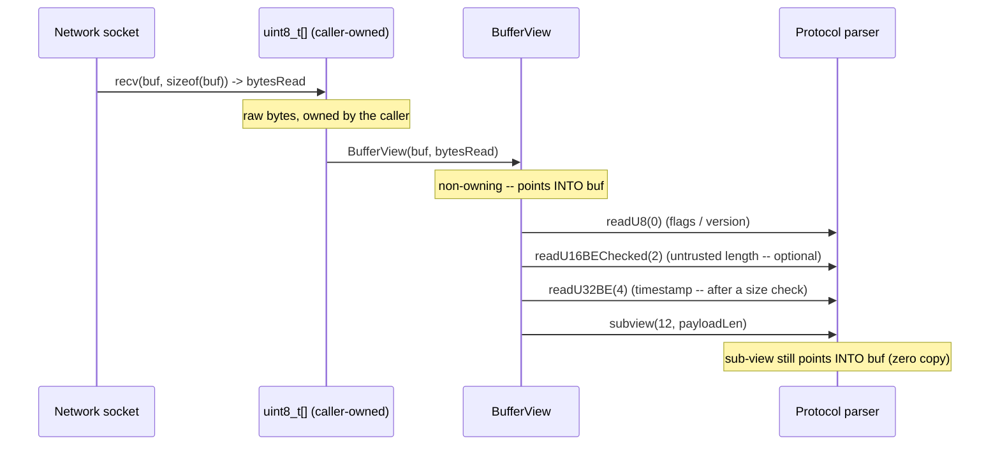
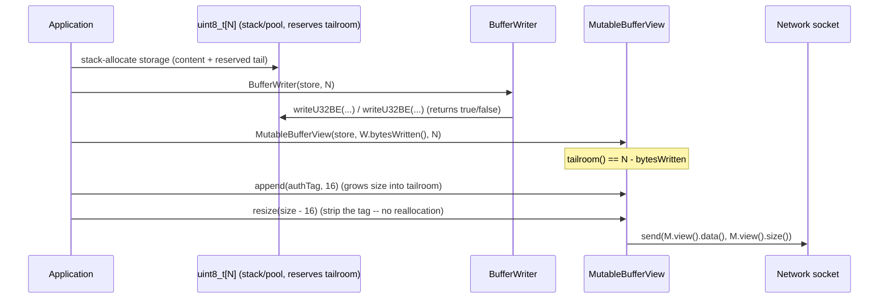

# Iora BufferView, BufferWriter & MutableBufferView -- Architecture & Programmer's Guide

[Back to index](../../README.md)

| | |
|---|---|
| **Version** | 2.1 |
| **Date** | 2026-09-10 |
| **Status** | IMPLEMENTED |
| **Header** | `include/iora/core/buffer_view.hpp` |
| **Namespace** | `iora::core` |
| **Dependencies** | Standard library only -- `<cassert>` (`assert`), `<cstdint>` (`std::uint8_t`/`std::uint16_t`/`std::uint32_t`/`std::uint64_t`/`std::size_t`), `<cstring>` (`std::memcmp`/`std::memcpy`), `<optional>` (`std::optional`, checked readers), `<string_view>` (`std::string_view`, `asStringView`), `<vector>` (`std::vector`, `toOwned`). No intra-Iora headers, no external/third-party dependencies. Header-only; portable (no Linux/POSIX syscalls). |

---

## Revision History

| Version | Date | Changes |
|---|---|---|
| 1.0 | 2026-03-20 | Initial implementation -- `BufferView` + `BufferWriter`. |
| 1.2 | 2026-03-20 | Added checked reader variants, little-endian readers/writers, 64-bit support. |
| 2.0 | 2026-03-20 | First full Architecture & Programmer's Guide (published as `coding_trackers/docs/iora/buffer_primitives.md`; documented `BufferView` + `BufferWriter` only). |
| 2.1 | 2026-09-10 | **Migrated to `docs/core/buffer_primitives.md` and re-verified against source.** Every signature, default, qualifier, and behavioral claim re-checked against `include/iora/core/buffer_view.hpp` (650 lines) and cross-checked against `tests/core/iora_test_buffer_view.cpp`. **Scope expanded** to document the third shipped, tested primitive in the header, `MutableBufferView` (the in-place mutable view with tailroom), which the 2.0 guide omitted. Stale claims corrected: the 2.0 guide's cross-reference to `unique_ptr<atomic[]>` in `metrics.hpp` (removed as off-topic), and the "No `ByteBuffer` constructor" anti-pattern (retained but re-verified). Restructured to the 12-section guide template with contiguous numbered sections; the Thread Safety Model section states the honest story for stateless value types rather than a fabricated mutex table. |

---

## 1. Executive Summary

### Problem

Network protocol code throughout the codebase passes raw `std::uint8_t*` + `size` pairs. Every call site independently computes offsets, casts bytes to wider integers, and checks bounds differently -- or not at all. RTP header parsing, SIP content-length extraction, SRTP MKI reading, and RTCP Sender-Report timestamp decoding each reimplement the same shift-and-mask patterns with inconsistent overflow checking. Packet **construction** uses ad-hoc pointer arithmetic with no overflow protection, and in-place packet **rewriting** (patching a length field, appending an SRTP authentication tag into reserved tailroom) is done with bare pointers past the end of the built content.

Two recurring hazards fall out of this:

1. **Addition-based bounds checks overflow.** The intuitive `offset + N > size` check silently wraps when `offset` is near `SIZE_MAX`, so a hostile offset passes the check and an out-of-bounds read follows -- a classic parser memory-safety bug on untrusted network input.
2. **Partial writes corrupt packets.** A hand-rolled writer that emits 2 of the 4 bytes of a `uint32` before noticing it is out of room puts a malformed frame on the wire.

### Solution

Three complementary, zero-dependency primitives in a single header (`include/iora/core/buffer_view.hpp`):

- **`iora::core::BufferView`** -- a non-owning, read-only view over a contiguous byte range, analogous to `std::string_view` but for `std::uint8_t`. Provides zero-copy slicing, iteration, conversion to `std::string_view`/`std::vector`, `memcmp` equality, and type-safe network byte-order readers in both **unchecked** (`assert`-guarded) and **checked** (`std::optional`-returning) variants.
- **`iora::core::BufferWriter`** -- a cursor-based writer into a caller-owned, pre-allocated buffer. Every write method returns `false` on overflow **without modifying the buffer or advancing the cursor** (all-or-nothing). `written()` hands back a `BufferView` over exactly the bytes emitted.
- **`iora::core::MutableBufferView`** -- a non-owning **mutable** view carrying an explicit `capacity` beyond its `size` (the difference is *tailroom*). It supports bounded offset writes *within* the current content, an `append` that grows the content into the tailroom, and a `resize` within capacity -- the in-place-transform primitive (e.g. append an SRTP auth tag to a built packet, then strip it, with no reallocation).

### Technical Impact

- **Zero-copy.** `BufferView` and `MutableBufferView` hold only a pointer plus one or two sizes (16 / 24 bytes on a 64-bit target). No ownership, no allocation, no reference counting; copying a view copies the descriptor, not the data.
- **Portable byte order without `htons`/`ntohs`.** All readers/writers are explicit shift-and-mask, correct on any endianness with no compile-time detection or `<arpa/inet.h>` dependency; modern compilers fold them to a single `bswap`/`movbe` where applicable.
- **Overflow-safe bounds arithmetic.** Every multi-byte check is subtraction-based (`offset > size || size - offset < N`) so it cannot wrap even for an adversarial `offset`.
- **Checked readers return `std::optional` and are `noexcept`** -- suitable for parsing untrusted, possibly-truncated input on a hot path without exceptions.
- **All-or-nothing writes.** `BufferWriter` and `MutableBufferView` never leave a half-written field behind on overflow.

---

## 2. System Architecture

### 2.1 Component relationships

```
iora::core (buffer_view.hpp)
|
|-- BufferView                 non-owning, READ-ONLY view          {const uint8_t* _data; size_t _size}
|   |-- static constexpr npos = size_t(-1)   sentinel: "to end" in subview()
|   |-- Accessors: data(), size(), empty(), operator[] (assert-checked)
|   |-- Iterators: begin(), end()            range-for compatible (raw pointers)
|   |-- Slicing:   subview(off,len=npos), first(n), last(n),
|   |              removePrefix(n), removeSuffix(n)   (clamp, never UB; last two mutate)
|   |-- Conversion: toOwned() -> vector<uint8_t>, asStringView() -> string_view
|   |-- Comparison: operator== / operator!=  (memcmp on content)
|   |-- Unchecked readers: readU8, readU16BE/LE, readU32BE/LE, readU64BE/LE   (assert; UB in release if OOB)
|   `-- Checked readers:   readU8Checked, readU16BEChecked/LEChecked, ...     (return optional; noexcept)
|
|-- BufferWriter               cursor-based writer, PRE-ALLOCATED   {uint8_t* _data; size_t _capacity; size_t _pos}
|   |-- Writes (return false on overflow, no partial write, cursor unchanged):
|   |     writeU8, writeU16BE/LE, writeU32BE/LE, writeU64BE/LE,
|   |     append(BufferView), append(const uint8_t*, size_t)
|   `-- Query: bytesWritten(), remaining(), written() -> BufferView over [_data, _data+_pos)
|
`-- MutableBufferView          non-owning MUTABLE view + tailroom   {uint8_t* _data; size_t _size; size_t _capacity}
    |-- Accessors: data() (mutable & const), size(), capacity(), tailroom()=capacity-size, empty(),
    |              operator[] (mutable & const, assert-checked), view() -> BufferView over content
    |-- Size:      resize(newSize)                 (fails if newSize > capacity; never touches bytes)
    |-- Bounded writes WITHIN content (return false on OOB, no partial write):
    |     writeU8, writeU16BE/LE, writeU32BE/LE, writeU64BE/LE,
    |     writeBytes(offset, const uint8_t*, len), writeBytes(offset, BufferView)
    `-- Append INTO tailroom (grows _size; return false if tailroom < len):
          append(const uint8_t*, len), append(BufferView)

Consumers (outside this component; shown for context -- these zero-copy primitives underpin the
RTP/SRTP/SDP/SIP parse-and-build paths in iora_media and iora_sip).
```

`MutableBufferView::view()` and `BufferWriter::written()` both return a read-only `BufferView`, so the three primitives compose: build with a `BufferWriter` (or a `MutableBufferView`), then hand a `BufferView` to a zero-copy parser.

### 2.2 Data flow -- parse an inbound packet



### 2.3 Data flow -- build then rewrite a packet in place



### 2.4 Threading model

| Actor | Responsibility |
|---|---|
| Owner of the underlying buffer | Allocates and frees the byte storage. A `BufferView` / `MutableBufferView` / `BufferWriter` is valid only for that storage's lifetime; none of the three own it. |
| Reader thread(s) | May hold and use any number of `BufferView`s over the *same* buffer concurrently **provided the buffer is not being modified**. `BufferView` reads are pure and touch no shared mutable state. |
| Writer thread | A single thread drives one `BufferWriter` or one `MutableBufferView` -- these carry mutable cursor / size state and must not be shared unsynchronized. Packet assembly is inherently single-threaded (one writer, one packet). |

These are stateless (`BufferView`) or single-owner-mutable (`BufferWriter`, `MutableBufferView`) value types; there are no locks, atomics, condition variables, or background threads anywhere in the header. The full story is in section 8.

---

## 3. Component Deep Dive

### 3.1 `BufferView` -- non-owning read-only view

`BufferView` is the byte-level equivalent of `std::string_view`. It holds two members and nothing else:

```cpp
const std::uint8_t* _data;
std::size_t         _size;
```

No ownership, no reference counting, no destructor side effects. The two constructors are `constexpr` and `noexcept`:

```cpp
constexpr BufferView() noexcept : _data(nullptr), _size(0) {}
constexpr BufferView(const std::uint8_t* data, std::size_t size) noexcept
  : _data(data), _size(size) {}
```

Default construction yields an empty view (`nullptr`, 0): `size()` is 0, `empty()` is `true`, `begin() == end()`, all slicing returns empty views, and all checked readers return `std::nullopt`. `data()`, `size()`, `empty()`, `begin()`, and `end()` are all `constexpr noexcept`.

`operator[]` performs a debug `assert(i < _size)` and is **not** `noexcept`:

```cpp
std::uint8_t operator[](std::size_t i) const
{
  assert(i < _size && "BufferView::operator[] index out of bounds");
  return _data[i];
}
```

Under `NDEBUG` the `assert` is compiled out, so an out-of-range index is an out-of-bounds read (undefined behavior). This is deliberate -- `operator[]` is an *unchecked* accessor for indices the caller has already validated; use `readU8Checked` for untrusted indices. See section 5 for the full bounds-checking model and section 7 for the memory-safety implications.

### 3.2 Slicing

All five slicing operations are `noexcept` and return valid (possibly empty) views -- they never invoke undefined behavior, even with out-of-range arguments.

| Method | Signature | Behavior on out-of-range |
|---|---|---|
| `subview` | `BufferView subview(std::size_t offset, std::size_t len = npos) const noexcept` | Returns an empty view when `offset >= _size`; otherwise clamps `len` to `_size - offset`. |
| `first` | `BufferView first(std::size_t n) const noexcept` | Returns the whole view when `n >= _size`. |
| `last` | `BufferView last(std::size_t n) const noexcept` | Returns the whole view (`*this`) when `n >= _size`; else the trailing `n` bytes. |
| `removePrefix` | `void removePrefix(std::size_t n) noexcept` | **Mutates in place.** When `n >= _size`, sets the view empty **and `_data = nullptr`**; else advances `_data += n`, `_size -= n`. |
| `removeSuffix` | `void removeSuffix(std::size_t n) noexcept` | **Mutates in place.** When `n >= _size`, sets `_size = 0` **but leaves `_data` unchanged**; else `_size -= n`. |

`removePrefix`/`removeSuffix` are modeled on `std::string_view::remove_prefix`/`remove_suffix` but **clamp** instead of the standard's undefined behavior on over-removal -- safer for incremental parsing where the remaining size may not be re-checked before each removal. Note the asymmetry on full removal: `removePrefix(size())` nulls `_data`, while `removeSuffix(size())` keeps the original pointer (see Known Limitations).

### 3.3 Conversion and comparison

`toOwned()` copies the viewed bytes into an owning `std::vector<std::uint8_t>` -- the escape hatch when the data must outlive the source buffer:

```cpp
std::vector<std::uint8_t> toOwned() const
{
  return std::vector<std::uint8_t>(_data, _data + _size);
}
```

For an empty view this constructs a vector from the range `[nullptr, nullptr)`, which is empty and well-defined.

`asStringView()` reinterprets the bytes as text with no copy and no encoding validation:

```cpp
std::string_view asStringView() const noexcept
{
  return std::string_view(reinterpret_cast<const char*>(_data), _size);
}
```

Use it only when the bytes are known to be text (a SIP body, SDP content). `operator==` / `operator!=` compare **content** via `std::memcmp` (with a size check first, and an early-out for two empty views), not pointers:

```cpp
bool operator==(const BufferView& other) const noexcept
{
  if (_size != other._size) { return false; }
  if (_size == 0)          { return true;  }
  return std::memcmp(_data, other._data, _size) == 0;
}
```

There is no `operator<` and no ordering (see Known Limitations).

### 3.4 `BufferWriter` -- cursor-based construction

`BufferWriter` holds three members over a caller-owned buffer:

```cpp
std::uint8_t* _data;      // pre-allocated buffer (NOT owned)
std::size_t   _capacity;  // total buffer capacity
std::size_t   _pos;       // current write cursor (0 at construction)
```

The single constructor is `noexcept` and does no validation of `data`/`capacity`:

```cpp
BufferWriter(std::uint8_t* data, std::size_t capacity) noexcept
  : _data(data), _capacity(capacity), _pos(0) {}
```

Every write first checks `remaining() < N` and, if so, returns `false` **without touching the buffer or `_pos`**; otherwise it writes `N` bytes big- or little-endian by explicit shift-and-mask and advances `_pos` by `N`. Because a write only advances `_pos` after confirming room, the invariant `_pos <= _capacity` always holds, so `remaining()` (`_capacity - _pos`) never underflows.

```cpp
bool writeU16BE(std::uint16_t value)
{
  if (remaining() < 2) { return false; }
  _data[_pos++] = static_cast<std::uint8_t>(value >> 8);
  _data[_pos++] = static_cast<std::uint8_t>(value);
  return true;
}
```

`append` bulk-copies via `std::memcpy` with the same all-or-nothing overflow semantics, and special-cases `len == 0` to avoid passing a possibly-null pointer to `memcpy` (an empty `BufferView` carries `nullptr`):

```cpp
bool append(const std::uint8_t* data, std::size_t len)
{
  if (remaining() < len) { return false; }
  if (len == 0)          { return true; }  // memcpy needs valid ptrs even for n==0
  std::memcpy(_data + _pos, data, len);
  _pos += len;
  return true;
}
```

`bytesWritten()` and `remaining()` are `noexcept` queries; `written()` returns a `BufferView` over `[_data, _data + _pos)` -- exactly the bytes emitted -- enabling the write-then-send idiom:

```cpp
BufferWriter w(buf, sizeof(buf));
// ... writes ...
send(w.written().data(), w.bytesWritten());
```

The write methods themselves are **not** `noexcept` (they contain no throwing operations, but the qualifier is absent in the source -- documented faithfully here and in section 10).

### 3.5 `MutableBufferView` -- in-place mutable view with tailroom

`MutableBufferView` is the mutable, growable sibling. It carries a `capacity` distinct from `size`; the difference is the **tailroom** -- reserved bytes past the current content that `append` can grow into without reallocating:

```cpp
std::uint8_t* _data;
std::size_t   _size;      // valid content bytes
std::size_t   _capacity;  // total writable bytes (>= _size)
```

Three constructors: a `constexpr` empty default (`nullptr`, 0, 0); the primary `(data, size, capacity)`; and a convenience `(data, size)` that delegates with `capacity == size` (no tailroom). The primary constructor asserts `size <= capacity` and, in release builds, **clamps** a violating `size` down to `capacity` rather than storing an invariant-breaking descriptor:

```cpp
MutableBufferView(std::uint8_t* data, std::size_t size, std::size_t capacity) noexcept
  : _data(data), _size(size), _capacity(capacity)
{
  assert(size <= capacity && "MutableBufferView: size exceeds capacity");
  if (_size > _capacity) { _size = _capacity; }
}
```

**Accessors.** `data()` has both a mutable and a `const` overload; `size()`, `capacity()`, `tailroom()` (`_capacity - _size`), and `empty()` are `constexpr noexcept`; `operator[]` has mutable (`std::uint8_t&`) and `const` overloads, both `assert(i < _size)`-guarded (unchecked in release, like `BufferView::operator[]`). `view()` returns a read-only `BufferView` over the current content.

**`resize(newSize)`** sets the content size, failing (returning `false`) only when `newSize > _capacity`. It never touches bytes: growing exposes previously-written or uninitialized tailroom as content; shrinking simply lowers `_size` (the bytes remain in the buffer). This is how an SRTP auth tag is stripped after verification -- `resize(size() - tagLen)`.

**Bounded offset writes.** `writeU8` / `writeU16BE` / `writeU16LE` / `writeU32BE` / `writeU32LE` / `writeU64BE` / `writeU64LE` and `writeBytes` overwrite *within the current content*. Each is `noexcept`, subtraction-bounds-checked against `_size` (not `_capacity`), and all-or-nothing on failure. `writeU8` uses the single-byte guard `offset >= _size`; the multi-byte writers use `offset > _size || _size - offset < N`. The 64-bit writers assemble bytes with a loop (`value >> (56 - i*8)` for BE, `value >> (i*8)` for LE):

```cpp
bool writeU16BE(std::size_t offset, std::uint16_t value) noexcept
{
  if (offset > _size || _size - offset < 2) { return false; }
  _data[offset]     = static_cast<std::uint8_t>(value >> 8);
  _data[offset + 1] = static_cast<std::uint8_t>(value);
  return true;
}
```

`writeBytes(offset, src, len)` and its `BufferView` overload copy `len` bytes at `offset` within the content (bounds-checked, `len == 0` short-circuited before `memcpy`).

**Append into tailroom.** `append(const std::uint8_t*, len)` and `append(BufferView)` copy after the current content and grow `_size` by `len`, failing when `tailroom() < len`:

```cpp
bool append(const std::uint8_t* src, std::size_t len) noexcept
{
  if (tailroom() < len) { return false; }
  if (len == 0)         { return true; }
  std::memcpy(_data + _size, src, len);
  _size += len;
  return true;
}
```

Because writes are checked against `_size` while `append` is checked against `tailroom()`, the boundary between "rewrite existing content" and "grow into reserved space" is explicit and cannot be crossed accidentally.

---

## 4. Usage Guide

### 4.1 Parse an RTP header (unchecked, after a length gate)

```cpp
#include <iora/core/buffer_view.hpp>

using namespace iora::core;

void parseRtp(const std::uint8_t* packet, std::size_t len)
{
  BufferView view(packet, len);

  // RTP minimum header is 12 bytes: gate the size ONCE, then read unchecked.
  if (view.size() < 12)
  {
    return; // truncated -- drop
  }

  const std::uint8_t firstByte = view.readU8(0);
  const std::uint8_t version   = (firstByte >> 6) & 0x03;
  const std::uint8_t csrcCount = firstByte & 0x0F;

  const std::uint8_t  payloadType = view.readU8(1) & 0x7F;
  const std::uint16_t seqNum      = view.readU16BE(2);
  const std::uint32_t timestamp   = view.readU32BE(4);
  const std::uint32_t ssrc        = view.readU32BE(8);

  const std::size_t headerLen = 12u + static_cast<std::size_t>(csrcCount) * 4u;
  BufferView payload = view.subview(headerLen); // zero-copy; empty if headerLen > size

  (void)version; (void)payloadType; (void)seqNum; (void)timestamp; (void)ssrc; (void)payload;
}
```

### 4.2 Parse untrusted input with checked readers

```cpp
#include <iora/core/buffer_view.hpp>

using namespace iora::core;

bool readMki(BufferView view, std::size_t mkiOffset, std::uint32_t& outMki)
{
  // The offset is attacker-influenced -- use the checked reader, never readU32BE.
  if (std::optional<std::uint32_t> mki = view.readU32BEChecked(mkiOffset))
  {
    outMki = *mki;
    return true;
  }
  return false; // truncated / malformed -- caller drops the packet
}
```

### 4.3 Build a packet with `BufferWriter`

```cpp
#include <iora/core/buffer_view.hpp>

using namespace iora::core;

std::size_t buildRtp(std::uint8_t* out, std::size_t cap,
                     std::uint16_t seq, std::uint32_t ts, std::uint32_t ssrc,
                     BufferView payload)
{
  BufferWriter w(out, cap);

  bool ok = true;
  ok = ok && w.writeU8(0x80);        // V=2, no padding/extension/CSRC
  ok = ok && w.writeU8(0x60);        // PT=96 (dynamic), no marker
  ok = ok && w.writeU16BE(seq);
  ok = ok && w.writeU32BE(ts);
  ok = ok && w.writeU32BE(ssrc);
  ok = ok && w.append(payload);

  if (!ok)
  {
    return 0; // buffer too small -- nothing partially written on the wire
  }
  return w.bytesWritten();
}
```

### 4.4 Build, append a tag, then strip it -- `MutableBufferView`

```cpp
#include <iora/core/buffer_view.hpp>

using namespace iora::core;

// Storage reserves tailroom for the auth tag; no heap allocation anywhere.
void srtpRoundTrip()
{
  std::uint8_t storage[64] = {};

  BufferWriter w(storage, sizeof(storage));
  w.writeU32BE(0xDEADBEEF);
  w.writeU32BE(0xCAFEBABE);

  MutableBufferView pkt(storage, w.bytesWritten(), sizeof(storage));
  // tailroom() == 64 - 8 == 56

  std::uint8_t tag[16];
  // ... compute the 16-byte auth tag ...
  pkt.append(tag, sizeof(tag)); // size() now 24, grown into tailroom

  // ... transmit / verify pkt.view() ...

  pkt.resize(pkt.size() - sizeof(tag)); // strip the tag; size() back to 8
  // pkt.view() == BufferView(storage, 8)
}
```

### 4.5 Incremental TLV parsing with `removePrefix`

```cpp
#include <iora/core/buffer_view.hpp>

using namespace iora::core;

void parseTlvStream(BufferView input)
{
  while (input.size() >= 4) // minimum TLV: 2-byte type + 2-byte length
  {
    const std::uint16_t type   = input.readU16BE(0);
    const std::uint16_t length = input.readU16BE(2);

    if (input.size() < 4u + length)
    {
      break; // truncated TLV
    }

    BufferView value = input.subview(4, length);
    // ... handle (type, value) ...
    (void)type;

    input.removePrefix(4u + length); // advance past this TLV (clamps, never UB)
  }
}
```

### 4.6 Anti-patterns

- **Do NOT store a `BufferView` / `MutableBufferView` beyond the lifetime of the underlying buffer.** All three primitives are non-owning; when the buffer is freed the view dangles. Use `BufferView::toOwned()` (or copy into your own storage) when deferred access is needed.
- **Do NOT use unchecked readers or `operator[]` on untrusted offsets.** `readU16BE`, `operator[]`, etc. are `assert`-guarded only -- the check vanishes under `NDEBUG` and an out-of-range access is an out-of-bounds read. Reach for the `*Checked` readers on any offset derived from network input.
- **Do NOT ignore a write's return value.** A `false` from `BufferWriter::writeU32BE` / `MutableBufferView::append` means nothing was written; ignoring it puts a truncated or unfinished frame on the wire (or silently drops the appended bytes).
- **Do NOT copy a `BufferWriter` to "fork" a buffer.** `BufferWriter` is implicitly copyable; a copy shares the same `_data` pointer but has its own `_pos`, so two writers will overwrite each other's bytes. Treat a writer as bound to one buffer for its lifetime.
- **Do NOT confuse `MutableBufferView`'s two write families.** Offset `writeU*`/`writeBytes` are bounded by `size()` (they rewrite existing content); `append` is bounded by `tailroom()` (it grows the content). A `writeU8(size(), v)` always fails -- use `append` to add bytes.

---

## 5. Byte-Order and Bounds-Checking Model

### 5.1 Shift-and-mask, not `htons`/`ntohs`

Every reader and writer assembles or disassembles a multi-byte integer with explicit per-byte shifts and masks:

```
readU16BE:  (d[o] << 8) | d[o+1]
readU16LE:   d[o]       | (d[o+1] << 8)
readU32BE:  (d[o] << 24) | (d[o+1] << 16) | (d[o+2] << 8) | d[o+3]
readU64BE:  (d[o] << 56) | ... | d[o+7]
```

This is correct on both big- and little-endian hosts with **no** `#ifdef`, no `<arpa/inet.h>`, and no compile-time endianness detection; the compiler folds the pattern to a single `bswap`/`movbe` where profitable. Each byte is `static_cast` to the target unsigned type **before** shifting, so the upper bytes of a 32-/64-bit read are not lost to implicit promotion to signed `int` and no left-shift is ever performed into a sign bit (which would be undefined). The writers mirror this: each emitted byte is `static_cast<std::uint8_t>(value >> k)`.

### 5.2 Subtraction-based bounds checks (overflow-safe)

Every multi-byte bounds check is expressed as:

```cpp
if (offset > _size || _size - offset < N) { /* out of range */ }
```

The first clause guarantees `offset <= _size`, so the subtraction `_size - offset` cannot underflow; the second clause then asks whether `N` bytes remain. The naive alternative, `offset + N > _size`, wraps around when `offset` is near `SIZE_MAX` -- the sum becomes small, the check passes, and an out-of-bounds read follows. The subtraction form is the security-critical pattern for parsing adversarial input and is used uniformly across `BufferView`'s checked readers, `BufferView`'s unchecked-reader `assert`s, and every `MutableBufferView` write. Single-byte operations use the simpler `offset >= _size` / `offset < _size` guard.

Because C++ `&&` short-circuits left to right, even the `assert` expressions are safe: in `assert(offset <= _size && _size - offset >= 2)`, an `offset > _size` makes the first operand `false` and `_size - offset` is never evaluated.

### 5.3 Unchecked vs. checked readers

| Family | Members | Guard | `noexcept` | On out-of-range |
|---|---|---|---|---|
| Unchecked | `readU8`, `readU16BE/LE`, `readU32BE/LE`, `readU64BE/LE`, `operator[]` | `assert` (compiled out under `NDEBUG`) | no | Debug: assertion failure. **Release: out-of-bounds read (UB).** |
| Checked | `readU8Checked`, `readU16BEChecked/LEChecked`, `readU32BEChecked/LEChecked`, `readU64BEChecked/LEChecked` | `if` returning `std::optional` | **yes** | `std::nullopt`, always. |

The checked readers validate, then delegate to the unchecked reader (whose `assert` is then guaranteed to pass):

```cpp
std::optional<std::uint16_t> readU16BEChecked(std::size_t offset) const noexcept
{
  if (offset > _size || _size - offset < 2)
  {
    return std::nullopt;
  }
  return readU16BE(offset); // validated: the assert inside cannot fire
}
```

Choose unchecked readers only after a single explicit length gate (section 4.1); choose checked readers for any offset that could exceed the buffer (section 4.2).

---

## 6. Call Flow / Sequence Reference

### 6.1 `BufferWriter::writeU32BE` -- success

| Step | Actor | Action | State |
|---|---|---|---|
| 1 | Caller | `w.writeU32BE(value)`. | -- |
| 2 | `writeU32BE` | Evaluate `remaining() == _capacity - _pos`; it is `>= 4`. | no change |
| 3 | `writeU32BE` | Emit 4 bytes big-endian at `_data[_pos..]`; `_pos += 4`. | `_pos` advanced |
| 4 | `writeU32BE` | `return true`. | -- |

### 6.2 `BufferWriter::writeU32BE` -- overflow (all-or-nothing)

| Step | Actor | Action | State |
|---|---|---|---|
| 1 | Caller | `w.writeU32BE(value)` with `remaining() < 4`. | -- |
| 2 | `writeU32BE` | `remaining() < 4` is `true`. | -- |
| 3 | `writeU32BE` | `return false` **before** any store; `_data` and `_pos` untouched. | unchanged |
| 4 | Caller | Observes `false`; `bytesWritten()` still reflects only the successful writes. | -- |

(Verified by `tests/core/iora_test_buffer_view.cpp`, e.g. `"BufferWriter: overflow returns false"` asserts `bytesWritten() == 1` and the buffer tail is untouched after a failed `writeU16BE`.)

### 6.3 `BufferView::readU16BEChecked` -- truncated input

| Step | Actor | Action | Result |
|---|---|---|---|
| 1 | Caller | `view.readU16BEChecked(offset)` on a 1-byte buffer at `offset == 0`. | -- |
| 2 | `readU16BEChecked` | `offset > _size`? No. `_size - offset < 2`? `1 - 0 == 1 < 2` -> `true`. | -- |
| 3 | `readU16BEChecked` | `return std::nullopt`; no read of `_data[1]`. | `nullopt` |
| 4 | Caller | `if (auto v = ...)` is false -> drop the packet. | -- |

### 6.4 `MutableBufferView` -- append tag then strip

| Step | Actor | Action | Size / tailroom |
|---|---|---|---|
| 1 | Caller | `MutableBufferView pkt(store, 8, 64)`. | size 8, tailroom 56 |
| 2 | `append(tag, 16)` | `tailroom() (56) < 16`? No. `memcpy(_data + 8, tag, 16)`; `_size += 16`. | size 24, tailroom 40 |
| 3 | Caller | Transmit / verify `pkt.view()` (24 bytes). | -- |
| 4 | `resize(8)` | `8 > _capacity (64)`? No. `_size = 8`. Bytes 8..23 remain in storage but are no longer content. | size 8, tailroom 56 |

---

## 7. Lifetime and Aliasing Model

These primitives trade ownership for zero copies; correct use is a lifetime and aliasing contract the caller must honor.

- **Non-owning; the buffer must outlive every view over it.** A `BufferView`, `MutableBufferView`, or `BufferWriter` is a descriptor (pointer + size(s)). Freeing, reallocating (`std::vector::push_back` that reallocates, `realloc`), or letting a stack buffer go out of scope while a view still refers to it leaves the view dangling. `BufferView::toOwned()` is the only operation here that produces independent, owning storage.
- **Read/write aliasing is the caller's responsibility.** A `BufferView` reading a buffer that another thread (or a `BufferWriter`/`MutableBufferView`) is concurrently mutating is a data race -- there is no internal synchronization (section 8). Multiple `BufferView`s over an unchanging buffer are fine.
- **`asStringView()` and `operator[]` return references into the underlying bytes.** The returned `std::string_view` and the byte read are valid only while the buffer is; neither copies.
- **`MutableBufferView::view()` and `BufferWriter::written()` return `BufferView`s that alias the same storage.** A subsequent write through the writer / mutable view changes what those views observe. Snapshot with `toOwned()` if you need a stable copy.
- **`memcpy` empty-range safety is handled internally.** `BufferWriter::append` and `MutableBufferView::append`/`writeBytes` short-circuit `len == 0` before calling `std::memcpy`, so passing an empty `BufferView` (which carries a `nullptr`) is well-defined.

---

## 8. Thread Safety Model

These are stateless (`BufferView`) or single-owner-mutable (`BufferWriter`, `MutableBufferView`) value types. The header contains **no** mutexes, atomics, condition variables, or threads, and none of the three primitives has any shared or hidden state -- so there is no lock table to present. The honest model:

| Operation | Concurrency property | Notes |
|---|---|---|
| `BufferView` reads (`data`/`size`/`operator[]`/readers/slicing that returns a new view/`toOwned`/`asStringView`/`==`) | Thread-safe **against other reads of the same buffer**; not against concurrent mutation of the underlying bytes. | Pure functions of `{_data, _size}` plus read-only access to the caller's bytes. Any number of threads may hold `BufferView`s over an unchanging buffer. |
| `BufferView::removePrefix` / `removeSuffix` | Mutates the view descriptor (`_data`/`_size`), not the bytes. | The `BufferView` object itself is then mutable state -- do not share that instance across threads without external synchronization; the underlying bytes are untouched. |
| `BufferWriter` writes / `append` / cursor queries | **Not** thread-safe. Single-owner. | Mutates `_pos` and the buffer. One thread assembles one packet; serialize externally if shared (which is not the intended use). |
| `MutableBufferView` writes / `append` / `resize` | **Not** thread-safe. Single-owner. | Mutates `_size` and the buffer. Same single-owner discipline as `BufferWriter`. |

There is no callback surface, no observer dispatch, and no lock ordering to reason about. The only concurrency hazard is the ordinary one for any non-owning view: a reader must not observe a buffer while another actor mutates it. That is the caller's responsibility, described in section 7.

---

## 9. Configuration Reference

Neither `BufferView`, `BufferWriter`, nor `MutableBufferView` has any runtime, compile-time, or environment configuration. Behavior is fully determined by the pointer and size(s) supplied at construction. There is exactly one named constant:

| Constant | Type | Value | Meaning |
|---|---|---|---|
| `BufferView::npos` | `static constexpr std::size_t` | `std::size_t(-1)` | Default `len` for `subview(offset, len = npos)` -- "take everything from `offset` to the end." |

Construction parameters (no defaults except where noted):

| Type | Constructor | Parameters |
|---|---|---|
| `BufferView` | `BufferView()` | none -- empty view (`nullptr`, 0). |
| `BufferView` | `BufferView(const std::uint8_t* data, std::size_t size)` | `data` (caller-owned, must outlive the view), `size` (byte count). |
| `BufferWriter` | `BufferWriter(std::uint8_t* data, std::size_t capacity)` | `data` (caller-owned, mutable), `capacity` (total writable bytes); cursor starts at 0. No validation of `data`/`capacity`. |
| `MutableBufferView` | `MutableBufferView()` | none -- empty (`nullptr`, 0, 0). |
| `MutableBufferView` | `MutableBufferView(std::uint8_t* data, std::size_t size, std::size_t capacity)` | `size <= capacity` required (asserted; clamped to `capacity` in release). tailroom = `capacity - size`. |
| `MutableBufferView` | `MutableBufferView(std::uint8_t* data, std::size_t size)` | Delegates with `capacity == size` (no tailroom). |

---

## 10. API Reference

```cpp
namespace iora
{
namespace core
{

class BufferView
{
public:
  static constexpr std::size_t npos = std::size_t(-1);

  constexpr BufferView() noexcept;
  constexpr BufferView(const std::uint8_t* data, std::size_t size) noexcept;

  // Accessors
  constexpr const std::uint8_t* data() const noexcept;
  constexpr std::size_t         size() const noexcept;
  constexpr bool                empty() const noexcept;
  std::uint8_t                  operator[](std::size_t i) const;   // assert-checked; NOT noexcept

  // Iterators
  constexpr const std::uint8_t* begin() const noexcept;
  constexpr const std::uint8_t* end() const noexcept;

  // Slicing (clamp on out-of-range; last two mutate in place)
  BufferView subview(std::size_t offset, std::size_t len = npos) const noexcept;
  BufferView first(std::size_t n) const noexcept;
  BufferView last(std::size_t n) const noexcept;
  void       removePrefix(std::size_t n) noexcept;
  void       removeSuffix(std::size_t n) noexcept;

  // Conversion
  std::vector<std::uint8_t> toOwned() const;
  std::string_view          asStringView() const noexcept;

  // Comparison (content, via memcmp)
  bool operator==(const BufferView& other) const noexcept;
  bool operator!=(const BufferView& other) const noexcept;

  // Unchecked network readers (assert-guarded; NOT noexcept; UB in release if OOB)
  std::uint8_t  readU8(std::size_t offset) const;
  std::uint16_t readU16BE(std::size_t offset) const;
  std::uint16_t readU16LE(std::size_t offset) const;
  std::uint32_t readU32BE(std::size_t offset) const;
  std::uint32_t readU32LE(std::size_t offset) const;
  std::uint64_t readU64BE(std::size_t offset) const;
  std::uint64_t readU64LE(std::size_t offset) const;

  // Checked network readers (noexcept; nullopt on out-of-range)
  std::optional<std::uint8_t>  readU8Checked(std::size_t offset) const noexcept;
  std::optional<std::uint16_t> readU16BEChecked(std::size_t offset) const noexcept;
  std::optional<std::uint16_t> readU16LEChecked(std::size_t offset) const noexcept;
  std::optional<std::uint32_t> readU32BEChecked(std::size_t offset) const noexcept;
  std::optional<std::uint32_t> readU32LEChecked(std::size_t offset) const noexcept;
  std::optional<std::uint64_t> readU64BEChecked(std::size_t offset) const noexcept;
  std::optional<std::uint64_t> readU64LEChecked(std::size_t offset) const noexcept;

private:
  const std::uint8_t* _data;
  std::size_t         _size;
};

class BufferWriter
{
public:
  BufferWriter(std::uint8_t* data, std::size_t capacity) noexcept;

  // Writes: return false on overflow; no partial write; cursor unchanged. NOT noexcept.
  bool writeU8(std::uint8_t value);
  bool writeU16BE(std::uint16_t value);
  bool writeU16LE(std::uint16_t value);
  bool writeU32BE(std::uint32_t value);
  bool writeU32LE(std::uint32_t value);
  bool writeU64BE(std::uint64_t value);
  bool writeU64LE(std::uint64_t value);
  bool append(BufferView data);
  bool append(const std::uint8_t* data, std::size_t len);

  // Query
  std::size_t bytesWritten() const noexcept;
  std::size_t remaining() const noexcept;
  BufferView  written() const noexcept;

private:
  std::uint8_t* _data;
  std::size_t   _capacity;
  std::size_t   _pos;
};

class MutableBufferView
{
public:
  constexpr MutableBufferView() noexcept;
  MutableBufferView(std::uint8_t* data, std::size_t size, std::size_t capacity) noexcept;
  MutableBufferView(std::uint8_t* data, std::size_t size) noexcept;

  // Accessors
  std::uint8_t*          data() noexcept;
  const std::uint8_t*    data() const noexcept;
  constexpr std::size_t  size() const noexcept;
  constexpr std::size_t  capacity() const noexcept;
  constexpr std::size_t  tailroom() const noexcept;    // capacity - size
  constexpr bool         empty() const noexcept;
  std::uint8_t&          operator[](std::size_t i);        // assert-checked
  std::uint8_t           operator[](std::size_t i) const;  // assert-checked
  BufferView             view() const noexcept;            // read-only view over content

  // Size adjustment within capacity (never touches bytes)
  bool resize(std::size_t newSize) noexcept;

  // Bounded offset writes WITHIN the current content (noexcept; all-or-nothing)
  bool writeU8(std::size_t offset, std::uint8_t value) noexcept;
  bool writeU16BE(std::size_t offset, std::uint16_t value) noexcept;
  bool writeU16LE(std::size_t offset, std::uint16_t value) noexcept;
  bool writeU32BE(std::size_t offset, std::uint32_t value) noexcept;
  bool writeU32LE(std::size_t offset, std::uint32_t value) noexcept;
  bool writeU64BE(std::size_t offset, std::uint64_t value) noexcept;
  bool writeU64LE(std::size_t offset, std::uint64_t value) noexcept;
  bool writeBytes(std::size_t offset, const std::uint8_t* src, std::size_t len) noexcept;
  bool writeBytes(std::size_t offset, BufferView src) noexcept;

  // Append INTO the tailroom (grows size; noexcept; all-or-nothing)
  bool append(const std::uint8_t* src, std::size_t len) noexcept;
  bool append(BufferView src) noexcept;

private:
  std::uint8_t* _data;
  std::size_t   _size;
  std::size_t   _capacity;
};

} // namespace core
} // namespace iora
```

---

## 11. Design Decisions

| Decision | Rationale |
|---|---|
| Non-owning `BufferView`/`MutableBufferView` (pointer + size(s)). | Network buffers are already owned by the socket layer, a pool, or the stack. Ownership or reference counting would add cost on every copy and complicate the API. `toOwned()` is the escape hatch when ownership is genuinely needed. |
| Shift-and-mask byte order, no `htons`/`ntohs`. | Correct on any endianness with no compile-time detection, no platform macros, and no `<arpa/inet.h>` dependency. Compilers fold it to a single `bswap`/`movbe`. |
| No bare `hostToNetwork`/`networkToHost` helpers. | The typed `readU16BE`/`writeU16BE` family covers every buffer use; a bare byte-swap would force the caller to know host endianness -- exactly what shift-and-mask avoids. |
| Subtraction-based bounds checks (`offset > size || size - offset < N`). | Avoids the unsigned wraparound of `offset + N > size` when `offset` is near `SIZE_MAX`. This is a security-critical invariant for parsing untrusted input; it is applied uniformly, including inside the unchecked readers' `assert`s. |
| Two reader families: `assert`-unchecked and `optional`-checked. | Unchecked = zero release overhead after a single explicit length gate; checked = `noexcept`, `nullopt`-on-truncation for adversarial input without exceptions on a hot path. |
| Writes return `false` on overflow, all-or-nothing (`BufferWriter` and `MutableBufferView`). | A partial multi-byte write would emit a corrupt frame. All-or-nothing lets the caller check one boolean after a sequence and keeps the cursor/size accurate. |
| `MutableBufferView` separates `size` from `capacity` (tailroom). | The in-place transform (append an SRTP tag, then strip it) needs to grow past the current content and shrink back with **no reallocation**. Offset writes are bounded by `size` (rewrite), `append` by `tailroom` (grow) -- an explicit, unmixable boundary. |
| `resize` never touches bytes; grows/shrinks `size` only. | Shrinking must not clear data another layer may still read; growing exposes reserved tailroom as content. Byte initialization is the caller's concern. |
| Release-build clamp of `size > capacity` in `MutableBufferView`. | A `size` exceeding `capacity` is a caller bug caught by `assert` in debug; in release the descriptor is clamped to a safe invariant rather than left able to read past the buffer. |
| `memcmp` equality, no ordering. | Byte-content equality is the natural definition; pointer equality would surprise. Lexicographic ordering is not needed (no `operator<`), keeping the type minimal. |
| `removePrefix`/`removeSuffix` clamp instead of UB. | `std::string_view::remove_prefix(n > size())` is undefined; clamping to empty is safe for incremental parsing that does not re-check the remaining size before each removal. |
| `len == 0` short-circuit before every `memcpy`. | `std::memcpy` requires valid pointers even for a zero count; an empty `BufferView` carries `nullptr`. Short-circuiting keeps zero-length `append`/`writeBytes` well-defined. |

---

## 12. Known Limitations

- **Unchecked readers and `operator[]` perform out-of-bounds reads in release builds.** `readU8`/`readU16BE`/.../`readU64LE` and both `operator[]` overloads (on `BufferView` and `MutableBufferView`) guard only with `assert`, which is compiled out under `NDEBUG`. An out-of-range index is then undefined behavior (an OOB read). This is the documented "unchecked" contract -- the checked readers exist precisely for untrusted offsets -- but it is a genuine memory-safety footgun if the unchecked family is pointed at attacker-controlled offsets without a prior length gate. There is no release-mode safety net on these paths. (tracked: iora backlog 2026-09-10-19)
- **`BufferWriter` is implicitly copyable and movable.** No copy/move constructor or assignment is declared or deleted, so the compiler generates them. A copied writer shares the same underlying `_data` pointer with an independent `_pos`, so two writers can silently overwrite each other's bytes. Treat a writer as bound to one buffer for its lifetime. (`MutableBufferView` is likewise implicitly copyable with the same aliasing caveat; `BufferView` copies are harmless since it is read-only.) (tracked: iora backlog 2026-09-10-19)
- **`removePrefix(size())` nulls `_data`; `removeSuffix(size())` does not.** After a full `removePrefix`, `data()` returns `nullptr` (matching a default-constructed view). After a full `removeSuffix`, `_size` is 0 but `data()` still returns the original pointer. Code that inspects `data()` after full removal must account for the asymmetry.
- **No signed-integer readers/writers.** `readI16BE`, `writeI32BE`, etc. are not provided; callers `static_cast` from/to the unsigned variant (well-defined for two's-complement, which C++20 mandates and every supported target already provides).
- **No `operator<` / ordering, and no search.** `BufferView` cannot be a `std::map`/`std::set` key, and there is no `find`/`contains` -- searching requires `std::search` over the iterator range or a manual loop.
- **`asStringView()` performs no encoding validation.** It reinterprets raw bytes as `char`; the result may be invalid UTF-8. The caller must know the bytes are text.
- **`BufferWriter` has no in-place patch / seek.** Once bytes are written the cursor only moves forward; there is no `patchAt`/`seek` to backfill a length field. Workaround: reserve the field with a placeholder, record the offset, and patch it via a `MutableBufferView` over the same storage (`writeU16BE(offset, len)`), or write the whole packet with a `MutableBufferView` from the start.
- **Constructors do not validate their pointers.** `BufferView`/`BufferWriter`/`MutableBufferView` accept any `data`/`capacity`; constructing a non-empty `BufferWriter` with a null `data` and then writing is undefined. Construction is the caller's contract. (tracked: iora backlog 2026-09-10-19)
- **This guide documents `buffer_view.hpp` in full** -- `BufferView`, `BufferWriter`, and `MutableBufferView`. There are no other primitives in the header. (The guide's filename, `buffer_primitives.md`, is historical; the source header is `buffer_view.hpp`.)
