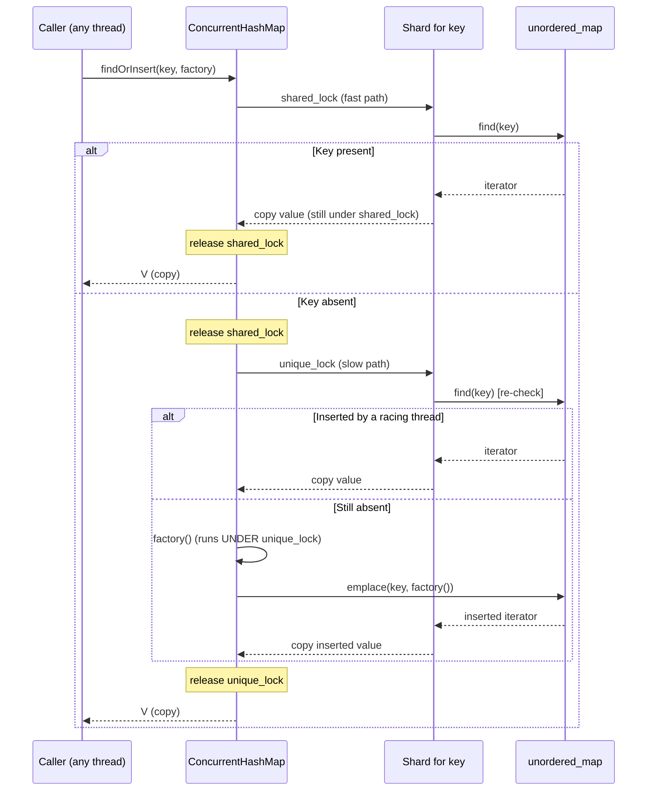

# Iora ConcurrentHashMap -- Architecture & Programmer's Guide

[Back to index](../../README.md)

| | |
|---|---|
| **Version** | 3.0 |
| **Date** | 2026-09-10 |
| **Status** | IMPLEMENTED |
| **Header** | `include/iora/core/concurrent_hash_map.hpp` |
| **Namespace** | `iora::core` |
| **Dependencies** | Standard library only -- `<cstddef>`, `<functional>`, `<mutex>`, `<optional>`, `<shared_mutex>`, `<unordered_map>`, `<utility>`. Header-only; no intra-Iora headers and no external/third-party dependencies. |

---

## Revision History

| Version | Date | Changes |
|---|---|---|
| 1.0 | 2026-03-20 | Initial implementation. |
| 1.1 | 2026-03-20 | Added `eraseIf`, `findAndDo`, and `findOrInsert` double-checked locking. |
| 2.0 | 2026-03-20 | First Architecture & Programmer's Guide, published as `coding_trackers/docs/iora/concurrent_hash_map.md`. |
| 3.0 | 2026-09-10 | **Migrated** to `iora/docs/core/concurrent_hash_map.md` and fully re-verified against the shipped `include/iora/core/concurrent_hash_map.hpp` (273 lines) and `tests/core/iora_test_concurrent_hash_map.cpp`. Corrected the problem statement to cite the actual in-tree consumers (`RateLimiterMap`, the web `Application` SSE/WS channel registries, `JsonRpcClient`). Restructured to the 12-section guide template with contiguous numbered sections. **Expanded the callback-under-lock analysis to cover all five callback-accepting methods** (`findAndDo` and `forEach` run the user callback under the lock too, not only `findOrInsert`/`findAndModify`/`eraseIf`). Added findings on stateful `Hash`/`KeyEqual` being silently unsupported and on low-bit shard selection with identity hashes (see Known Limitations). |

---

## 1. Executive Summary

### Problem

Multiple Iora subsystems need the same primitive: a keyed store shared across threads, read far more often than it is written, where distinct keys should not contend on a single lock. The naive choices are both poor. A `std::unordered_map` behind one `std::mutex` serializes every reader against every other reader and against writers -- fatal for a read-heavy hot path such as a per-request rate-limit check. Hand-rolling a bespoke sharded map per subsystem (its own shard count, its own locking discipline, its own compound-operation helpers) duplicates subtle concurrency code and multiplies the surface for lock-ordering and iterator-invalidation bugs.

The need is concrete and already present in the tree:

- [`iora::core::RateLimiterMap<K, Hash, KeyEqual>`](rate_limiter.md) stores a **non-copyable** `TokenBucket` per key and must refill/consume it in place under exclusive access (`include/iora/core/rate_limiter.hpp:236`, `:329`).
- The web `Application` keeps `ConcurrentHashMap<std::string, std::shared_ptr<SseChannel>>` and `...<WsChannel>>` channel registries, created on demand with a factory that must run exactly once (`include/iora/web/application.hpp:548-549`, `:312`).
- `JsonRpcClient` uses it as "the project's sharded-lock keyed-state primitive" (`include/iora/rpc/jsonrpc_client.hpp:349`).

### Solution

A single generic, header-only, lock-striped concurrent hash map -- `iora::core::ConcurrentHashMap<K, V, Hash, KeyEqual, ShardCount>`:

- **Lock-striped sharding.** A fixed, compile-time array of `ShardCount` shards (default 64), each a `std::shared_mutex` guarding its own `std::unordered_map`. Operations on keys in different shards never contend.
- **Reader/writer split.** Reads (`find`, `contains`, `findAndDo`, `forEach`, `size`, `empty`) take `std::shared_lock`; writes (`insert`, `insertOrAssign`, `erase`, `eraseIf`, `clear`) take `std::unique_lock`. Concurrent readers on the same shard proceed in parallel.
- **Compound operations.** `findOrInsert` (double-checked locking), `findAndModify` (in-place mutation under exclusive lock -- the only safe path for non-copyable values), and `eraseIf` (conditional erase with a `(key, value)` predicate).
- **Customizable hashing and equality.** Template parameters `Hash` and `KeyEqual` allow, e.g., a case-insensitive SIP-header map without wrapping keys in a normalizing type.

### Technical Impact

- **O(1) shard selection with no division.** `Hash{}(key) & kMask` (`ShardCount` is a `static_assert`-enforced power of two, `kMask == ShardCount - 1`), replacing a modulo.
- **Read-heavy scaling.** Up to `ShardCount` shards can each serve multiple concurrent readers; a read on one shard is independent of any operation on the other `ShardCount - 1` shards.
- **`findOrInsert` avoids the exclusive lock on the common path.** The fast path takes only `shared_lock`; the `unique_lock` slow path runs (and the factory runs) only on a miss.
- **`findAndModify` enables in-place mutation of non-copyable values.** `RateLimiterMap`'s `TokenBucket` is deliberately non-copyable (`rate_limiter.hpp:44`, commented "prevents `findOrInsert` copy bug at compile time") and is refilled/consumed in place under the shard lock.
- **`find` returns `std::optional<V>` by value** -- a copy taken under the lock, safe to use after release, but a snapshot rather than a live view (see the copy caveat in section 3.7).

---

## 2. System Architecture

### 2.1 Component relationships

```
iora::core
`-- ConcurrentHashMap<K, V, Hash, KeyEqual, ShardCount = 64>   (public; header-only)
    |-- static_assert: ShardCount > 0 && power-of-two
    |-- static constexpr std::size_t kMask = ShardCount - 1
    |-- Shard _shards[ShardCount]                              (private)
    |   |-- mutable std::shared_mutex mutex
    |   `-- std::unordered_map<K, V, Hash, KeyEqual> map
    |-- shardFor(key) -> _shards[Hash{}(key) & kMask]          (private; const + non-const)
    |
    |-- Write ops (std::unique_lock, exactly one shard, except clear):
    |   |-- insert(key, const V&) / insert(key, V&&)   -> bool  (false if key present)
    |   |-- insertOrAssign(key, const V&) / (key, V&&)  -> bool (true if inserted)
    |   |-- erase(key)                                  -> bool (true if erased)
    |   |-- eraseIf(key, predicate)                     -> bool (true if erased)
    |   `-- clear()                                     -> void (all shards, in index order)
    |
    |-- Read ops (std::shared_lock):
    |   |-- find(key)          -> std::optional<V>   (copy; one shard)
    |   |-- contains(key)      -> bool               (one shard)
    |   |-- findAndDo(key, cb) -> bool               (cb(const V&) under lock; one shard)
    |   |-- size()             -> std::size_t        (sum; all shards, index order)
    |   |-- empty()            -> bool               (early-exit scan; all shards)
    |   `-- forEach(fn)        -> void               (fn(const K&, const V&); all shards)
    |
    `-- Compound ops:
        |-- findOrInsert(key, factory) -> V     (shared_lock fast path, unique_lock slow path)
        `-- findAndModify(key, modifier) -> bool (modifier(V&) under unique_lock)

Consumers (outside this component; shown for context):
  core/rate_limiter.hpp   --uses--> ConcurrentHashMap<K, TokenBucket, Hash, KeyEqual>
  web/application.hpp     --uses--> ConcurrentHashMap<string, shared_ptr<SseChannel|WsChannel>>
  rpc/jsonrpc_client.hpp  --uses--> ConcurrentHashMap (keyed request/session state)
```

The map is **non-copyable and non-movable** (each of the four special members is `= deleted`): it holds an array of `std::shared_mutex`, which is itself non-movable, and a live concurrent container should never be relocated while other threads reference it.

### 2.2 Data flow -- `findOrInsert` (double-checked locking)



### 2.3 Threading model

| Thread | Responsibility |
|---|---|
| **Any caller thread** | Every public method is safe to call from any thread. Single-key operations acquire exactly one shard's lock; `size`/`empty`/`forEach`/`clear` acquire each shard's lock in turn (index order). There is no owning/background thread -- the map is passive. |
| **Callback (runs on the caller's thread)** | `findAndDo`, `forEach`, `findOrInsert` (factory), `findAndModify` (modifier), and `eraseIf` (predicate) invoke a user callable **while the relevant shard lock is held** (shared for the two read callbacks, exclusive for the three write callbacks). The callback therefore executes inline on the calling thread, under the lock. See section 5 (re-entrancy) and section 8. |

There is no cross-thread handoff and no condition variable: the map's only synchronization primitives are the per-shard `std::shared_mutex` instances.

---

## 3. Component Deep Dive

### 3.1 Lock-striped sharding

Each map owns `Shard _shards[ShardCount]`. A `Shard` is a `mutable std::shared_mutex mutex` plus a `std::unordered_map<K, V, Hash, KeyEqual> map`. The shard for a key is selected by:

```cpp
Shard& shardFor(const K& key)
{
  return _shards[Hash{}(key) & kMask];
}
```

**Power-of-two enforcement.** `ShardCount` must be a positive power of two:

```cpp
static_assert(ShardCount > 0 && (ShardCount & (ShardCount - 1)) == 0,
  "ShardCount must be a positive power of two");
static constexpr std::size_t kMask = ShardCount - 1;
```

This lets shard selection use a single bitwise AND (`& kMask`) instead of a modulo. `kMask` is a compile-time constant.

**Default of 64.** 64 independent shards give reasonable parallelism for machines with up to ~64 cores while keeping the per-map memory (64 `shared_mutex` + 64 empty `unordered_map`) modest. The count is a template parameter; tests use 4 and 16.

Two important properties of this specific formula are analyzed as findings in section 12: the functor is **default-constructed** each call (`Hash{}`), so a *stateful* `Hash` is silently unsupported; and shard selection consumes the **low** bits of the hash, which can skew badly for identity-style integer hashes.

### 3.2 `std::shared_mutex` per shard, not `std::mutex`

Each shard uses a reader/writer lock:

- **Read operations** (`find`, `contains`, `findAndDo`, `forEach`, `size`, `empty`) take `std::shared_lock` -- multiple readers on one shard run concurrently.
- **Write operations** (`insert`, `insertOrAssign`, `erase`, `eraseIf`, `clear`) take `std::unique_lock` -- exclusive; blocks all readers and writers on that shard.
- **Compound operations** -- `findAndModify` takes `unique_lock`; `findOrInsert` takes `shared_lock` on the fast path and, only on a miss, `unique_lock` on the slow path.

This matches the read-heavy consumers: a rate-limit lookup, an SSE-channel dispatch, or an RPC-session read happens far more often than a channel is created or torn down.

### 3.3 `findOrInsert` -- double-checked locking

```cpp
template<typename F>
V findOrInsert(const K& key, F&& factory);
```

The classic double-checked pattern, adapted to a `shared_mutex`:

1. **Fast path (`shared_lock`).** Look up the key; if present, return a copy of the value. Concurrent readers coexist on the shard.
2. **Release the `shared_lock`.** There is no lock *upgrade*: `std::shared_mutex` cannot promote a held `shared_lock` to a `unique_lock`, and attempting to take the `unique_lock` while still holding the `shared_lock` on the same mutex would deadlock. The fast-path `shared_lock` is scoped to a block and released before the slow path.
3. **Slow path (`unique_lock`).** Re-check the key -- a racing thread may have inserted it between steps 1 and 3. If present now, return a copy.
4. **Still absent.** Call `factory()`, `emplace(key, factory())`, and return a copy of the inserted value.

The concurrent test `CHM: findOrInsert concurrent -- factory called once` runs 16 threads racing on one key and asserts the factory ran exactly once and all threads observed the same value.

**The factory runs under the shard's exclusive lock.** A slow factory blocks every reader and writer on that shard; factories must be cheap. See the re-entrancy hazard in sections 5 and 6.

**Returns a copy.** The returned `V` is copied while the lock is held. Mutating it does not affect the stored entry, and the type must be `CopyConstructible` -- for a non-copyable `V` this method fails to instantiate (which is exactly why `RateLimiterMap` never calls it on its `TokenBucket`).

### 3.4 `findAndModify` -- in-place mutation

```cpp
template<typename F>
bool findAndModify(const K& key, F&& modifier);
```

Takes `unique_lock`, finds the key, and calls `modifier(it->second)` where `it->second` is a live non-const `V&` reference to the stored value. Returns `false` if the key is absent (the modifier is not called). This is the only safe way to mutate a stored value in place and the only mutation path available for a non-copyable value type.

**Load-bearing consumer.** `RateLimiterMap::tryConsume()` does exactly this: `_buckets.findAndModify(key, [&](TokenBucket& bucket){ ... })` to refill and consume tokens on the actual stored bucket under exclusive access (`rate_limiter.hpp:236`, `:251`).

### 3.5 `eraseIf` -- conditional erase with a `(key, value)` predicate

```cpp
template<typename P>
bool eraseIf(const K& key, P&& predicate);
```

Takes `unique_lock`, finds the key, and calls `predicate(it->first, it->second)` -- a `const K&` and a non-const `V&` (the entry is under exclusive lock). If the predicate returns `true` the entry is erased and the method returns `true`; if the key is absent, or the predicate returns `false`, nothing is erased and it returns `false`.

The predicate receives both the key and the value so composite conditions are expressible ("erase this session only if it is expired and belongs to tenant X"). A predicate written as `(const K&, const V&)` also compiles (a `const&` binds to the non-const `V&`).

### 3.6 `forEach` -- per-shard sequential iteration (not a snapshot)

```cpp
template<typename F>
void forEach(F&& fn) const;
```

Locks each shard in turn with `shared_lock` and calls `fn(key, value)` (`const K&`, `const V&`) for every entry in that shard, then moves to the next. It is **not** a global snapshot: while shard *i* is being iterated, another thread may freely mutate shard *i+1*, so the traversal can observe a state that never existed as a single instant. Because only a `shared_lock` is held, `fn` **cannot** erase or insert into this map on the same shard (that needs `unique_lock`); use the two-pass collect-then-erase pattern in section 6.

`size`, `empty`, and `clear` share this "one shard at a time, in index order" discipline. Because every multi-shard method acquires locks in the same ascending index order, no two of them can deadlock against each other.

### 3.7 `find` returns a copy -- caveats

```cpp
std::optional<V> find(const K& key) const;
```

`find` copies the value into an `std::optional<V>` while the `shared_lock` is held, then returns it. Consequences:

1. **Cost.** For a large `V` the copy may be expensive; use `findAndDo` to read the value in place without copying it out.
2. **Staleness.** The returned copy is a point-in-time snapshot; by the time the caller inspects it another thread may have changed or erased the original. This is inherent to a concurrent container.
3. **Copyable `V` required.** For a non-copyable `V` (e.g. `std::unique_ptr`, or `TokenBucket`), `find` fails to instantiate. Use `findAndDo` (read) or `findAndModify` (mutate). The test suite exercises both a `std::shared_ptr<int>` value with `find` and a `std::unique_ptr<int>` value with `findAndDo`.

### 3.8 `insert` vs `insertOrAssign`, and the move overloads

`insert(key, value)` uses `emplace` and returns the `inserted` flag: `false` when the key already exists (the existing value is left untouched -- verified by `CHM: insert duplicate returns false`). `insertOrAssign(key, value)` uses `insert_or_assign` and returns `true` only when a new key was inserted, `false` when an existing value was overwritten. Both provide a `const V&` overload and a `V&&` overload; the rvalue overload forwards with `std::move` so a value can be moved into the map without a copy (see `CHM: insert move overload avoids copy`).

### 3.9 `Hash` / `KeyEqual` for case-insensitive maps

`Hash` (default `std::hash<K>`) and `KeyEqual` (default `std::equal_to<K>`) are forwarded to the per-shard `std::unordered_map` *and* used for shard selection. Pairing `StringUtils::CaseInsensitiveHash` with `StringUtils::CaseInsensitiveEqual` yields a case-insensitive string map:

```cpp
ConcurrentHashMap<std::string, int,
  StringUtils::CaseInsensitiveHash,
  StringUtils::CaseInsensitiveEqual> headers;

headers.insert("Content-Type", 1);
assert(headers.contains("content-type"));  // true
```

Both traits are `is_transparent` and operate on `std::string_view` (`string_utils.hpp:170`, `:188`). The two must agree: keys that compare equal under `KeyEqual` **must** hash equal under `Hash`. Using `CaseInsensitiveEqual` with the default `std::hash<std::string>` violates that invariant -- two case-variant keys would land in different shards and different buckets, breaking the container.

---

## 4. Usage Guide

### 4.1 Keyed transaction store (insert / find / modify / conditional erase)

```cpp
#include "iora/core/concurrent_hash_map.hpp"
#include <string>

using namespace iora::core;

struct SipTransaction
{
  std::string callId;
  std::string method;
  int state; // 0 = TRYING ... 3 = TERMINATED
};

ConcurrentHashMap<std::string, SipTransaction> transactions;

// Insert on the network thread; false means the branch id already existed.
transactions.insert(branchId, SipTransaction{"call-1", "INVITE", 0});

// Read a snapshot on a worker thread.
auto tx = transactions.find(branchId);
if (tx)
{
  log("branch " + tx->callId + " state=" + std::to_string(tx->state));
}

// Mutate the stored entry in place under the shard's exclusive lock.
transactions.findAndModify(branchId, [](SipTransaction& t)
{
  t.state = 3; // TERMINATED
});

// Erase only if terminated.
transactions.eraseIf(branchId, [](const std::string&, SipTransaction& t)
{
  return t.state == 3;
});
```

### 4.2 Get-or-create with `findOrInsert` (create the channel once)

```cpp
ConcurrentHashMap<std::string, std::shared_ptr<SseChannel>> channels;

// Fast path (shared_lock) when the channel already exists; the factory runs
// under the shard's exclusive lock only on the first request for this id.
std::shared_ptr<SseChannel> channel =
  channels.findOrInsert(streamId, [&]()
  {
    return std::make_shared<SseChannel>(streamId);
  });
// 'channel' is a copy of the stored shared_ptr -- both point at the same
// SseChannel, so this shares the channel rather than duplicating it.
```

### 4.3 In-place mutation of a non-copyable value (rate limiting)

```cpp
#include "iora/core/rate_limiter.hpp"       // TokenBucket is non-copyable

ConcurrentHashMap<std::string, TokenBucket> buckets;

// Create the bucket once (move it in -- TokenBucket is move-constructible).
buckets.insert(clientIp, TokenBucket(/*rate*/ 100.0, /*burst*/ 200.0));

// Consume a token in place. find()/findOrInsert() would NOT compile here
// because TokenBucket is non-copyable -- findAndModify is the only path.
bool allowed = false;
buckets.findAndModify(clientIp, [&](TokenBucket& bucket)
{
  allowed = bucket.tryConsume(1.0);
});
```

### 4.4 Read without copying, via `findAndDo`

```cpp
ConcurrentHashMap<std::string, LargeObject> cache;

// The callback receives a const reference to the stored value and runs
// under shared_lock. Keep it short: the shard lock is held throughout.
cache.findAndDo("key", [](const LargeObject& obj)
{
  processReadOnly(obj); // valid only for the duration of this call
});
```

### 4.5 Two-pass cleanup (collect under `forEach`, erase afterwards)

```cpp
ConcurrentHashMap<std::string, SessionState> sessions;

std::vector<std::string> expired;
const auto now = std::chrono::steady_clock::now();

// forEach holds a shared_lock per shard -- it cannot erase. Only collect.
sessions.forEach([&](const std::string& key, const SessionState& s)
{
  if (now - s.lastActivity > std::chrono::seconds(300))
  {
    expired.push_back(key);
  }
});

// Erase in a second pass; each erase takes unique_lock on its own shard.
for (const auto& key : expired)
{
  sessions.erase(key);
}
```

### 4.6 Anti-patterns

- **Do NOT expect `find()` or `findOrInsert()` to hand back a mutable reference to the stored value** -- both return copies. Mutating the copy is silently lost. Use `findAndModify` for in-place mutation.
- **Do NOT re-enter the same map from inside any callback if the re-entrant call may hash to the same shard.** Every callback (`findAndDo`, `forEach`, `findOrInsert` factory, `findAndModify` modifier, `eraseIf` predicate) runs while the shard lock is held, and `std::shared_mutex` is **not** recursive -- a same-shard re-entry deadlocks (a write re-entry from a read callback, or *any* re-entry from a write callback). See section 5.
- **Do NOT run an expensive `findOrInsert` factory** -- it executes under the shard's exclusive lock and blocks every reader and writer on that shard.
- **Do NOT erase or insert during `forEach`** -- it holds only a `shared_lock`. Collect keys first, then erase in a second pass (section 4.5).
- **Do NOT pair a case-insensitive `KeyEqual` with a case-sensitive `Hash`** (or, more generally, any `Hash`/`KeyEqual` pair that disagrees). Equal keys must hash equal, or entries are lost across shards and buckets.
- **Do NOT supply a *stateful* `Hash` or `KeyEqual` and expect the state to be honored** -- shard selection default-constructs the functor (`Hash{}`), ignoring any instance state (section 12).

---

## 5. Call Flow / Sequence Reference

### 5.1 `insert` (success and duplicate paths)

| Step | Actor | Action | Lock state |
|---|---|---|---|
| 1 | Caller | `insert(key, value)`; compute `shardFor(key)` = `_shards[Hash{}(key) & kMask]`. | no lock |
| 2 | `insert` | Acquire `std::unique_lock` on `shard.mutex`. | shard `unique_lock` held |
| 3 | `insert` | `shard.map.emplace(key, value)` -> `{it, inserted}`. | held |
| 4a | `insert` | Key absent: `inserted == true`; return `true`. | held (released on scope exit) |
| 4b | `insert` | Key present: `inserted == false`; existing value untouched; return `false`. | held (released on scope exit) |

### 5.2 `findOrInsert` (fast path, then miss + slow path)

| Step | Actor | Action | Lock state |
|---|---|---|---|
| 1 | Caller | `findOrInsert(key, factory)`; select shard. | no lock |
| 2 | fast path | Acquire `shared_lock`; `shard.map.find(key)`. | shard `shared_lock` held |
| 3a | fast path | Present: copy `it->second`; return it. | released on block exit |
| 3b | fast path | Absent: exit the block, releasing the `shared_lock`. | released |
| 4 | slow path | Acquire `unique_lock`; `shard.map.find(key)` (re-check). | shard `unique_lock` held |
| 5a | slow path | Present now (racing insert): copy and return. | held |
| 5b | slow path | Absent: call `factory()`, `emplace(key, factory())`, copy inserted value, return. | held (factory runs under it) |

### 5.3 `findAndModify` (mutate) / miss path

| Step | Actor | Action | Lock state |
|---|---|---|---|
| 1 | Caller | `findAndModify(key, modifier)`; select shard. | no lock |
| 2 | method | Acquire `unique_lock`; `shard.map.find(key)`. | shard `unique_lock` held |
| 3a | method | Present: `modifier(it->second)` (user code runs UNDER the lock); return `true`. | held |
| 3b | method | Absent: modifier not called; return `false`. | held (released on exit) |

### 5.4 Multi-shard operation (`forEach` / `size` / `empty` / `clear`)

| Step | Actor | Action | Lock state |
|---|---|---|---|
| 1 | Caller | Enter the method; begin loop `i = 0 .. ShardCount-1`. | no lock |
| 2 | method | For shard `i`: acquire lock (`shared_lock` for read ops, `unique_lock` for `clear`). | one shard held |
| 3 | method | Operate on `_shards[i].map` (iterate / sum / test-empty / clear); for `forEach`, `fn` runs UNDER the shard `shared_lock`. | held |
| 4 | method | Release shard `i`'s lock; advance to `i+1`. | released, then next held |
| 5 | method | `empty` short-circuits on the first non-empty shard; the rest never lock. | -- |

**Re-entrancy hazard (all callbacks).** In 5.2 step 5b, 5.3 step 3a, `eraseIf`'s predicate, and 5.4 step 3 for `forEach`/`findAndDo`, the user callable runs while a shard lock is held. If it calls back into the *same* map on a key that hashes to the *same* shard, it deadlocks, because `std::shared_mutex` is non-recursive: a `unique_lock` re-entry always deadlocks against any held lock on that mutex, and even a `shared_lock` re-entry deadlocks against a held `unique_lock` (and may deadlock against a held `shared_lock` if a writer is queued between them) -- formally undefined behavior, since recursive acquisition of a `std::shared_mutex` a thread already holds (even in shared mode) is not permitted per [thread.sharedmutex.requirements]. Re-entry onto a *different* shard is safe but is still a fragile pattern to rely on.

---

## 6. Thread Safety Model

All synchronization is per-shard; there is no map-wide lock and no background thread.

| Operation | Synchronization | Callback under lock? | Notes |
|---|---|---|---|
| `insert` (both overloads) | `std::unique_lock` on one shard | -- | `emplace`; returns `false` if key present (existing value kept). |
| `insertOrAssign` (both) | `std::unique_lock` on one shard | -- | `insert_or_assign`; returns `true` only when a new key was inserted. |
| `erase` | `std::unique_lock` on one shard | -- | Returns `true` if an entry was removed. |
| `eraseIf` | `std::unique_lock` on one shard | **Yes** -- predicate `(const K&, V&)` under `unique_lock` | Erases only if predicate returns `true`. |
| `clear` | `std::unique_lock` per shard, index order | -- | Not an atomic whole-map operation. |
| `find` | `std::shared_lock` on one shard | -- | Returns a copy (`std::optional<V>`); requires copyable `V`. |
| `contains` | `std::shared_lock` on one shard | -- | Existence test only. |
| `findAndDo` | `std::shared_lock` on one shard | **Yes** -- callback `(const V&)` under `shared_lock` | Read-only in-place access; returns `false` if absent. |
| `size` | `std::shared_lock` per shard, index order | -- | Approximate: shards summed sequentially, not one instant. |
| `empty` | `std::shared_lock` per shard, index order | -- | Early-exit on first non-empty shard. |
| `forEach` | `std::shared_lock` per shard, index order | **Yes** -- `fn(const K&, const V&)` under each shard's `shared_lock` | Not a global snapshot; cannot mutate this map on the locked shard. |
| `findOrInsert` | `std::shared_lock` (fast), then `std::unique_lock` (slow) on one shard | **Yes** -- factory `V()` under `unique_lock` (slow path only) | No lock upgrade: shared released before unique acquired. |
| `findAndModify` | `std::unique_lock` on one shard | **Yes** -- modifier `(V&)` under `unique_lock` | Only safe mutation path; only path for non-copyable `V`. |

**Synchronization primitives (from the header):**

- `mutable std::shared_mutex Shard::mutex` -- one per shard (`ShardCount` total); `mutable` so read methods can lock it through a `const` map.
- No condition variables, no atomics, no map-level lock.

**Lock ordering.** Single-key operations hold exactly one shard lock, so they cannot self-deadlock. Multi-shard operations (`forEach`, `size`, `empty`, `clear`) always acquire shard locks in ascending index order (`0 .. ShardCount-1`), so no two multi-shard operations can form a lock cycle. `findOrInsert` releases the fast-path `shared_lock` before taking the slow-path `unique_lock` on the same mutex -- it never attempts an upgrade.

**Callbacks run under the lock (design property, and the sharp edge).** Unlike the copy-then-invoke schedulers elsewhere in `iora::core` (e.g. [`TimerService`](timer.md), [`ThreadPool`](thread_pool.md)), this container deliberately invokes user callbacks *while holding the shard lock* -- that is what makes `findAndModify`/`findAndDo` able to operate on the live stored value. The cost is the re-entrancy deadlock hazard analyzed in section 5: a callback must not call back into the same map on a key that maps to the same (or, defensively, any) shard, and must not block or run long work while the shard lock is held.

**Memory visibility.** A writer's `unique_lock` release happens-before a later reader's `shared_lock` acquisition on the same shard, so a value published by `insert`/`findAndModify` is visible to a subsequent `find`/`findAndDo` on that key without any additional fence.

---

## 7. Configuration Reference

`ConcurrentHashMap` has no runtime configuration object; all configuration is via template parameters, fixed at compile time.

### 7.1 Template parameters

| Parameter | Default | Constraints | Effect |
|---|---|---|---|
| `K` | -- | hashable by `Hash`, comparable by `KeyEqual` | Key type. |
| `V` | -- | copyable for `find`/`findOrInsert`; any type for `findAndDo`/`findAndModify`/`insert(V&&)` | Value type. |
| `Hash` | `std::hash<K>` | must agree with `KeyEqual`; **default-constructible** (used as `Hash{}` for shard selection); stateless in practice | Hash functor. |
| `KeyEqual` | `std::equal_to<K>` | must agree with `Hash` | Key-equality functor (forwarded to the per-shard `unordered_map`). |
| `ShardCount` | `64` | `> 0` and a power of two (`static_assert`) | Number of lock-striped shards; also the number of `std::shared_mutex` instances. |

### 7.2 Sizing guidance

- `ShardCount` is the ceiling on write parallelism (one exclusive lock per shard) and on the number of independently lockable reader groups. Higher values reduce contention at the cost of `ShardCount` `std::shared_mutex` + `ShardCount` `std::unordered_map` per instance. The default 64 suits general server use; the tests use 4 and 16.
- `ShardCount` cannot be changed without recompiling. There is no rehash-of-shards or runtime resize.

---

## 8. API Reference

```cpp
namespace iora
{
namespace core
{

template<
  typename K,
  typename V,
  typename Hash = std::hash<K>,
  typename KeyEqual = std::equal_to<K>,
  std::size_t ShardCount = 64>
class ConcurrentHashMap
{
public:
  ConcurrentHashMap() = default;

  // Non-copyable, non-movable (holds an array of std::shared_mutex).
  ConcurrentHashMap(const ConcurrentHashMap&) = delete;
  ConcurrentHashMap& operator=(const ConcurrentHashMap&) = delete;
  ConcurrentHashMap(ConcurrentHashMap&&) = delete;
  ConcurrentHashMap& operator=(ConcurrentHashMap&&) = delete;

  // Write operations (std::unique_lock)
  bool insert(const K& key, const V& value);
  bool insert(const K& key, V&& value);
  bool insertOrAssign(const K& key, const V& value);
  bool insertOrAssign(const K& key, V&& value);
  bool erase(const K& key);
  template<typename P>
  bool eraseIf(const K& key, P&& predicate);   // predicate(const K&, V&) -> bool
  void clear();

  // Read operations (std::shared_lock)
  std::optional<V> find(const K& key) const;
  bool contains(const K& key) const;
  template<typename F>
  bool findAndDo(const K& key, F&& readCallback) const; // readCallback(const V&)
  std::size_t size() const;
  bool empty() const;
  template<typename F>
  void forEach(F&& fn) const;                   // fn(const K&, const V&)

  // Compound operations
  template<typename F>
  V findOrInsert(const K& key, F&& factory);    // factory() -> V, under unique_lock
  template<typename F>
  bool findAndModify(const K& key, F&& modifier); // modifier(V&), under unique_lock
};

} // namespace core
} // namespace iora
```

### 8.1 Callback signatures and the lock held during each

| Method | Callback signature | Lock held during callback |
|---|---|---|
| `findAndDo` | `void(const V&)` | `shared_lock` (one shard) |
| `forEach` | `void(const K&, const V&)` | `shared_lock` (per shard, one at a time) |
| `findOrInsert` factory | `V()` | `unique_lock` (one shard; slow path only) |
| `findAndModify` modifier | `void(V&)` | `unique_lock` (one shard) |
| `eraseIf` predicate | `bool(const K&, V&)` | `unique_lock` (one shard) |

All five callables are accepted by template (`F` / `P`), not `std::function`, so they inline at the call site with no heap allocation or virtual dispatch.

---

## 9. Design Decisions

| Decision | Rationale |
|---|---|
| Lock striping, not one map-wide lock. | Read-heavy consumers (rate-limit checks, channel dispatch, RPC-session reads) must not serialize on a single mutex; keys in different shards proceed independently. |
| `std::shared_mutex` per shard. | Concurrent readers on the same shard run in parallel; writers still get exclusive access to just one shard. |
| Power-of-two `ShardCount` with `& kMask`. | Shard selection is a single bitwise AND instead of a modulo; enforced by `static_assert`. |
| `find` returns `std::optional<V>` by value. | A copy taken under the lock is safe to use after release and cannot dangle; the trade-off (cost, staleness, copyable-only) is documented, and `findAndDo`/`findAndModify` cover the in-place cases. |
| `findOrInsert` double-checked locking. | The common "key already present" path avoids the exclusive lock and the factory entirely; the `unique_lock` re-check prevents a duplicate insert under a race. |
| `findOrInsert` releases the shared lock before taking the unique lock. | `std::shared_mutex` supports no lock upgrade; taking `unique_lock` while holding `shared_lock` on the same mutex would deadlock. |
| `findAndModify` for in-place mutation. | The only correct way to mutate a stored value (avoids the copy-mutate-discard bug) and the only mutation path for non-copyable values such as `TokenBucket`. |
| `eraseIf` predicate takes `(const K&, V&)`. | Composite erase conditions need the key too; the value is non-const because the entry is under `unique_lock`, and a `(const K&, const V&)` predicate still binds and compiles. |
| Callbacks accepted by template, not `std::function`. | No per-call heap allocation or indirect call; the compiler can inline the callback. |
| Callbacks run under the shard lock. | Enables true in-place read/modify on the live stored value; the accepted cost is the re-entrancy/blocking hazard, documented in sections 5-6. |
| No iterators exposed. | Prevents iterator-invalidation data races; all access is via copy-out (`find`/`findOrInsert`) or in-place callbacks (`findAndDo`/`findAndModify`/`forEach`). |
| Non-copyable, non-movable. | Holds an array of non-movable `std::shared_mutex`; a live concurrent map must not be relocated while threads reference it. |
| Multi-shard ops lock in index order. | `forEach`/`size`/`empty`/`clear` acquire shards `0 .. N-1` in order, so no two can form a lock cycle. |

---

## 10. Known Limitations

- **Callbacks run while the shard lock is held (re-entrancy and blocking hazard).** `findAndDo`, `forEach`, the `findOrInsert` factory, the `findAndModify` modifier, and the `eraseIf` predicate all execute under the shard lock. Re-entering the same map from a callback deadlocks whenever the re-entrant key hashes to the same shard (`std::shared_mutex` is non-recursive), and any blocking or long-running callback stalls every other operation on that shard. This is by design (in-place operation), but it is a sharp edge the caller must respect. (`concurrent_hash_map.hpp:148-160`, `:190-201`, `:208-234`, `:238-250`, `:95-111`.)

- **A stateful `Hash` (or `KeyEqual`) is silently unsupported -- suspected latent defect.** `shardFor` selects the shard with a **default-constructed** functor, `Hash{}(key)` (`concurrent_hash_map.hpp:261`, `:266`), and the per-shard `std::unordered_map` is likewise default-constructed (`:256`) -- there is no constructor to inject a functor instance. A non-default-constructible `Hash`/`KeyEqual` fails to compile; a *default-constructible but stateful* one compiles and silently ignores its state, potentially routing equal keys inconsistently. Safe for the stateless functors used everywhere in-tree (`std::hash`, `StringUtils::CaseInsensitive*`), but a trap for a stateful custom functor. Reported for human disposition. (tracked: iora backlog 2026-09-10-21)

- **Shard selection uses the low bits of the hash -- skew risk with identity hashes.** `Hash{}(key) & kMask` (`concurrent_hash_map.hpp:261`) keeps the low `log2(ShardCount)` bits. `std::hash<int>` is effectively the identity on common implementations, so keys that share their low bits (e.g. all multiples of `ShardCount`) collide onto one shard, and *within* that shard `std::unordered_map` also buckets by low bits -- compounding the imbalance and defeating the striping. Sequential integer keys (as in the tests) spread well; structured or adversarial integer keys may not. A mixing step before the mask would harden this. Reported for human disposition. (tracked: iora backlog 2026-09-10-21)

- **`find` and `findOrInsert` require a copyable `V`.** Both copy the value out; for a non-copyable `V` they fail to instantiate. Use `findAndDo` (read) or `findAndModify` (mutate). This is intentional (and relied upon by `RateLimiterMap`'s non-copyable `TokenBucket`) but is a usage constraint.

- **`size`, `empty`, `forEach`, and `clear` are not atomic whole-map operations.** They lock one shard at a time, so `size`/`empty` can return a count/verdict that never held at a single instant, `forEach` is not a consistent snapshot, and a concurrent reader can observe `clear` partway through (some shards emptied, others not). If an atomic view is required, external synchronization is needed.

- **The hash is computed twice per single-key operation.** Once in `shardFor` (`Hash{}(key)`) and again inside the per-shard `std::unordered_map` lookup/emplace. Negligible for cheap hashes; a minor cost for expensive ones.

- **`ShardCount` is fixed at compile time.** No runtime resize or shard rebalancing; changing it requires recompilation.

- **This guide documents `iora::core::ConcurrentHashMap` only.** The consumers referenced for context (`RateLimiterMap`, the web `Application` channel registries, `JsonRpcClient`) are separate components with their own guides.
