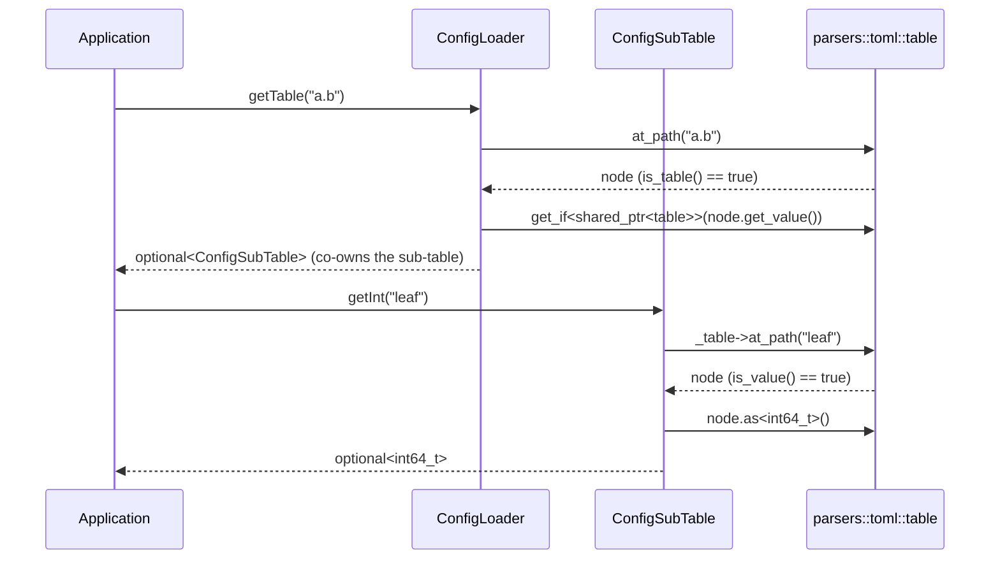

# Iora ConfigLoader -- Architecture & Programmer's Guide

[Back to index](../../README.md)

| | |
|---|---|
| **Version** | 1.1 |
| **Date** | 2026-09-10 |
| **Status** | IMPLEMENTED |
| **Header** | `include/iora/core/config_loader.hpp` |
| **Namespace** | `iora::core` |
| **Dependencies** | `iora/parsers/minimal_toml.hpp` (the TOML document-object-model, parser, and `parse_file` -- see [`docs/parsers/minimal_toml.md`](../parsers/minimal_toml.md)) and `iora/core/logger.hpp` (`IORA_LOG_WARN`). Standard library: `<memory>`, `<optional>`, `<stdexcept>`, `<string>`, `<vector>`. Header-only, two classes, no external/third-party dependencies. |

---

## Revision History

| Version | Date | Changes |
|---|---|---|
| 1.0 | 2026-09-10 | Initial Architecture & Programmer's Guide. Authored directly against `include/iora/core/config_loader.hpp` (290 lines) and cross-checked against `tests/core/iora_test_config_loader.cpp`, `tests/core/iora_test_config_loader_get_table.cpp`, and `tests/core/iora_test_config_loader_get_table_array.cpp`. Documents the two shipped classes (`ConfigLoader`, `ConfigSubTable`) layered over `iora::parsers::toml`; flags the `reload()`/`isLoaded()` staleness and the failed-reload data-loss behaviors as candidate defects (section 12). |
| 1.1 | 2026-09-10 | CP-3 doc-review + code-fix sync: `reload()` now updates `isLoaded()` + preserves last-known-good on failure; `load()` memoization fixed; dead comment removed; layering concern documented as tracked (2026-09-10-24). |

---

## 1. Executive Summary

### Problem

An Iora-based service needs to read its configuration from a TOML file at startup: flat scalars, `[section]` sub-tables, deeply nested `[a.b.c]` tables, and repeated `[[array-of-tables]]` blocks (for example, a list of `[[servers]]` each with a port, a name, and a list of tags). Done by hand at each consumer, that is the same fragile pattern repeated: open the file, split dotted keys, coerce `std::string` into `int64_t`/`bool`, decide what "missing" versus "wrong type" means, and remember to catch the parse failure. The awkward parts are *type-safe scalar access* (a key that is present but of the wrong type must not silently coerce), *nested table navigation* (resolving `a.b.c.leaf` either as a chain of lookups or as one dotted path), and *lifetime* (a sub-table handed to a subsystem must not dangle when the loader is reloaded or destroyed).

### Solution

`iora::core::ConfigLoader` and its companion `iora::core::ConfigSubTable` are a thin, read-only, typed facade over the dependency-free [`iora::parsers::toml`](../parsers/minimal_toml.md) parser:

- **`ConfigLoader`** loads a TOML file in its constructor (`parsers::toml::parse_file`) and exposes typed dotted-path getters -- `get<T>`, `getInt`, `getBool`, `getString`, `getStringArray`, plus the structural `getTable` and `getTableArray`.
- **`ConfigSubTable`** is a typed, copyable view over one nested `parsers::toml::table`. It carries the same scalar getters (`get<T>`, `getInt`, `getBool`, `getString`, `getStringArray`) and a nested `getTable`, so navigation composes: `loader.getTable("a")->getTable("b")->getInt("leaf")`.
- **Silent `std::nullopt` on absence and on type mismatch** for every scalar getter and for both structural getters -- a missing key and a present-but-wrong-type key are indistinguishable by design (the one exception is `ConfigLoader::getStringArray`, which *throws* on a non-string element; section 5.5).
- **Lifetime safety by shared ownership** -- the underlying `minimal_toml` DOM holds every sub-table by `std::shared_ptr`, so a `ConfigSubTable` obtained before `reload()` (or before the loader is destroyed) keeps its pre-reload data alive for as long as the view exists.

### Technical Impact

- **Zero-copy structural navigation** -- `getTable`/`getTableArray` return `ConfigSubTable` views that co-own the existing `shared_ptr<table>` nodes; no table is deep-copied.
- **Type safety without exceptions on the hot path** -- scalar getters return `std::optional<T>`; a wrong-typed key yields `std::nullopt` rather than a throw or a silent coercion.
- **Reload-safe handles** -- a `ConfigSubTable` survives `reload()` and even destruction of the owning `ConfigLoader`, because the shared-pointer DOM keeps the old sub-table alive.
- **Dependency-free** -- no third-party TOML library; the entire stack is `iora::parsers::toml` + the standard library.

---

## 2. System Architecture

### 2.1 Layering

`ConfigLoader` is the top of a two-layer stack and owns no parsing logic of its own -- it delegates entirely to `iora::parsers::toml`:

```
Application / service startup
        |
        v
iora::core::ConfigLoader                         (this component)
  |-- _filename : std::string                    -- path passed to the constructor
  |-- _table    : parsers::toml::table           -- the parsed root DOM (value member)
  |-- _isLoaded : bool                            -- written by load() (ctor + direct) and by reload(); never stale
  |
  |  typed getters (get<T>/getInt/getBool/getString/getStringArray)
  |  structural getters (getTable -> ConfigSubTable, getTableArray -> vector<ConfigSubTable>)
  |
  v
iora::parsers::toml   (documented separately: docs/parsers/minimal_toml.md)
  |-- parse_file(path) / parse(text)             -- recursive-descent reader
  |-- table                                       -- DOM node; at_path(dotted), contains(key)
  |-- node (view)                                 -- is_value()/is_table()/is_array(), as<T>(), as_array(), get_value()
  `-- value_type = std::variant< ..., shared_ptr<table>, shared_ptr<array> >
        ^
        | co-owns (shared_ptr<const table>)
        |
iora::core::ConfigSubTable                        (this component; returned by getTable/getTableArray)
  `-- _table : std::shared_ptr<const parsers::toml::table>
```

`ConfigLoader` stores the root `parsers::toml::table` **by value** (`_table`). Every structural getter reaches into that DOM via `at_path` and wraps the resulting `shared_ptr<table>` node in a `ConfigSubTable`. Because the DOM holds sub-tables by `shared_ptr`, handing out a `ConfigSubTable` is a pointer copy, not a table copy, and the handed-out view co-owns its node independently of `_table`. See [`docs/parsers/minimal_toml.md`](../parsers/minimal_toml.md) for the parser, the DOM node types, and the `[[array-of-tables]]` grammar; this guide does not re-document them.

### 2.2 Data flow -- resolve a nested scalar



### 2.3 Threading model

| Thread | Responsibility |
|---|---|
| **Startup / configuration thread** | Constructs the `ConfigLoader`, optionally calls `reload()` serially, and performs all `getXxx` / `getTable` / `getTableArray` queries. This is the only thread permitted to touch the loader while it may be mutated. |
| **Any thread (read-only, after startup)** | May read through `ConfigLoader` or a held `ConfigSubTable` **only once the loader is quiescent** -- i.e., no `reload()` will be called concurrently. `ConfigLoader` is single-threaded by contract (section 8); it contains no mutex, atomic, or condition variable. |

`ConfigLoader` owns no thread and creates none. The header states the contract explicitly: *"ConfigLoader is SINGLE-THREADED BY CONTRACT. Callers MUST NOT invoke reload() concurrently with ANY accessor."* The intended lifecycle is construct-once-at-startup, query during initialization, then leave untouched (mirroring the edge_proxy "no hot reload in v1 -- restart to apply configuration changes" decision, D-11).

---

## 3. Component Deep Dive -- `ConfigLoader`

### 3.1 Construction and loading

```cpp
explicit ConfigLoader(const std::string &filename)
    : _filename(filename), _isLoaded(false)
{
  load();
}
```

The constructor stores the filename and immediately calls `load()`. It never throws on a bad file or malformed TOML: `reload()` (below) swallows every exception, so a construction failure is reported only through `isLoaded()` returning `false` and a logged warning -- not through an exception. `ConfigLoader basic operations / load throws on missing file` verifies this: constructing on `"does_not_exist.toml"` succeeds, and `badLoader.isLoaded()` is `false`. (The test name is historical; the throw it once referred to has since been removed from `load()`.)

```cpp
const parsers::toml::table &load()
{
  if (!_isLoaded)
  {
    if (!reload())
    {
      IORA_LOG_WARN("ConfigLoader: Failed to load configuration file: " << _filename);
    }
  }
  return _table;
}
```

`load()` is **lazy and memoizing**: it delegates to `reload()` only when `!_isLoaded` is true, and returns the cached root table otherwise. Memoization keys on `_isLoaded` (not on `_table.empty()`), so a legitimately empty-but-valid config (an empty file, or one containing only comments/whitespace) is parsed exactly once -- its successful parse sets `_isLoaded = true` inside `reload()`, and subsequent `load()` calls are no-ops that return the cached table. `reload()` -- not `load()` -- is now the method that maintains `_isLoaded` (on every success), so a failed initial `load()` leaves `_isLoaded == false` and a logged warning.

### 3.2 Reloading

```cpp
bool reload()
{
  try
  {
    parsers::toml::table parsed = parsers::toml::parse_file(_filename);
    _table = std::move(parsed);
    _isLoaded = true;
    return true;
  }
  catch (...)
  {
    return false;
  }
}
```

`reload()` re-parses `_filename` unconditionally, but **commits atomically**: it parses into a *local* `parsed` table first, and only on a successful parse does it move that into `_table` and set `_isLoaded = true`. On any parse/IO exception the `catch` returns `false` **without mutating `_table` or `_isLoaded`**. Two behaviors follow, and both are the corrected post-CP-3 contract:

1. **`reload()` keeps `_isLoaded` current.** Every successful `reload()` sets `_isLoaded = true`; a failed one leaves it untouched. So `isLoaded()` reflects the most recent *successful* load rather than being frozen at the constructor's outcome -- it is never stale after a reload.
2. **A failed `reload()` preserves the last-known-good configuration.** Because the parse lands in a local table that is swapped in only on success, a loader that held valid config and then reloads a now-broken (or transiently unreadable) file still returns `false` but keeps its previous `_table` and `_isLoaded` intact. A transient edit error no longer wipes live config.

This preserved-config contract depends on `parsers::toml::parse_file` **throwing** on malformed input -- if a broken file parsed silently to a partial/empty table, the bad result would be committed. That dependency is pinned by a malformed-reload test (rewrites the file to invalid TOML, calls `reload()`, asserts it returns `false` and the prior values still resolve).

`reload()` is also verified indirectly throughout the `getTable`/`getTableArray` suites and directly by `ConfigSubTable survives serially-ordered reload()`, which rewrites the file, calls `reload()`, and confirms the fresh view sees the new value while a pre-reload view still sees the old one.

### 3.3 Scalar getters

```cpp
template <typename T> std::optional<T> get(const std::string &dottedKey) const;
std::optional<int64_t>     getInt(const std::string &key) const;    // get<int64_t>
std::optional<bool>        getBool(const std::string &key) const;   // get<bool>
std::optional<std::string> getString(const std::string &key) const; // get<std::string>
```

`get<T>` resolves the dotted key via `_table.at_path(dottedKey)`, checks `node.is_value()`, and returns `node.as<T>()`. It returns `std::nullopt` in three cases, indistinguishably: the key is absent, the key names a table/array rather than a scalar, or the scalar exists but is of a different TOML type than `T`. `T` must be a TOML native scalar type (`int64_t`, `double`, `bool`, `std::string`). `getInt`/`getBool`/`getString` are thin wrappers for the three common types. `ConfigLoader basic operations / get<T> returns correct values` and `/ getInt, getBool, getString work as expected` verify both the present and the missing-key paths.

### 3.4 `getStringArray` -- the one throwing getter

```cpp
std::optional<std::vector<std::string>> getStringArray(const std::string &key) const;
```

Resolves `key`, returns `std::nullopt` if the node is absent or is not an array, then iterates the array. For each element it uses `std::get_if<std::string>`; if an element is a string it is appended, **otherwise it throws `std::runtime_error`** (`"ConfigLoader: Array element at '<key>' is not a string"`). This is the deliberate exception to the silent-nullopt contract: a malformed *element* in an array that is otherwise present is treated as a hard error, whereas a missing or non-array key is a soft `std::nullopt`. `ConfigLoader extended functionality` verifies all three branches: all-strings returns the vector, a missing key returns `std::nullopt`, and a mixed `['x', 42, 'y']` array throws `std::runtime_error`.

Note the contrast with `ConfigSubTable::getStringArray` (section 4.3), which returns `std::nullopt` on a non-string element instead of throwing -- a deliberate divergence documented in the header.

### 3.5 Structural getter -- `getTable`

```cpp
std::optional<ConfigSubTable> getTable(const std::string &dottedKey) const;
```

Resolves the dotted key, returns `std::nullopt` if the node is absent or `!n.is_table()` (i.e. it is a scalar, a value-array, or an `[[array-of-tables]]`), and otherwise extracts the `std::shared_ptr<parsers::toml::table>` from the node's variant (`std::get_if<...>(&n.get_value())`) and wraps it in a `ConfigSubTable`. Because `is_table()` has already been checked, the `get_if` is guaranteed non-null (the header comment states this invariant). The returned view co-owns the sub-table. The regression test `getTable returns nullopt on array-of-tables key` confirms that an `[[a.b]]` key does *not* come back as a single table.

### 3.6 Structural getter -- `getTableArray`

```cpp
std::optional<std::vector<ConfigSubTable>> getTableArray(const std::string &dottedKey) const;
```

Resolves the dotted key; returns `std::nullopt` if absent or `!n.is_array()`. It then iterates the array and, for each element, attempts `std::get_if<std::shared_ptr<parsers::toml::table>>(&elem)`. If *any* element is not a `shared_ptr<table>` (for example, an array of strings), it returns `std::nullopt` -- the whole result is rejected, not partially filled. Otherwise it builds a `std::vector<ConfigSubTable>` preserving declaration order, one view per `[[dottedKey]]` block. A single `[[a.b]]` block yields a one-element vector (not a bare table and not `std::nullopt`), verified by `getTableArray single entry yields 1-element vector (N=1)`. Declaration order is verified by `getTableArray returns N entries in declaration order`.

---

## 4. Component Deep Dive -- `ConfigSubTable`

### 4.1 Ownership and lifetime

```cpp
class ConfigSubTable
{
public:
  ConfigSubTable() = default;
  explicit ConfigSubTable(std::shared_ptr<const parsers::toml::table> tbl);
  bool valid() const;
  // ... getters ...
private:
  std::shared_ptr<const parsers::toml::table> _table;
};
```

A `ConfigSubTable` holds a `std::shared_ptr<const parsers::toml::table>`. The `const` qualifier on the pointee is deliberate: the underlying DOM node is mutable, but the view exposes read-only access. Copies share the same underlying node (pointer copy), so all copies see the same data -- verified by `ConfigSubTable copy shares the same data`. The class is copyable and movable.

The **reload/destruction survival** guarantee flows directly from the `shared_ptr`: the sub-table memory is co-owned by every `ConfigSubTable` that wraps it, so it remains alive as long as any such view exists, even after the owning `ConfigLoader` is reloaded (which swaps `_table` for a fresh DOM) or destroyed. `ConfigSubTable survives serially-ordered reload()` proves the pre-reload view still returns the old value after the loader reloads a changed file.

### 4.2 Default construction and `valid()`

A default-constructed `ConfigSubTable` holds a null `shared_ptr`; `valid()` returns `false`, and every getter short-circuits to `std::nullopt`. The default constructor exists so the type can live inside `std::optional<ConfigSubTable>` and standard containers. The header guidance: prefer `std::optional::has_value()` (which already signals presence when you obtained the view from `getTable`) over `valid()`, except when you are holding a stand-alone `ConfigSubTable` by value.

### 4.3 Getters

```cpp
template <typename T> std::optional<T> get(const std::string &dottedKey) const;
std::optional<int64_t>     getInt(const std::string &key) const;
std::optional<bool>        getBool(const std::string &key) const;
std::optional<std::string> getString(const std::string &key) const;
std::optional<std::vector<std::string>> getStringArray(const std::string &key) const;
std::optional<ConfigSubTable>           getTable(const std::string &dottedKey) const;
```

The scalar getters mirror `ConfigLoader`'s (`at_path` -> `is_value()` -> `as<T>()`), and all short-circuit to `std::nullopt` when `_table` is null. `getTable` mirrors `ConfigLoader::getTable`, enabling chained navigation (`sub->getTable("inner")->getInt("leaf")`), verified by `ConfigSubTable nested getTable resolves [a.b.c] in both forms` and the 4-level `[a.b.c.d]` test.

The one behavioral divergence is **`getStringArray`**: where `ConfigLoader::getStringArray` throws on a non-string element, `ConfigSubTable::getStringArray` returns `std::nullopt` (the silent-nullopt contract shared with every other `ConfigSubTable` getter). This is documented in the header and verified by `ConfigSubTable getStringArray returns nullopt on mixed-type array` (which also asserts `REQUIRE_NOTHROW`). Callers that need strict element typing are directed to inspect the raw DOM via `ConfigLoader::table()`.

---

## 5. Usage Guide

### 5.1 Load a file and read scalars

```cpp
#include <iora/core/config_loader.hpp>
#include <cstdint>
#include <string>

using iora::core::ConfigLoader;

void readScalars()
{
  ConfigLoader loader("service.toml");
  if (!loader.isLoaded())
  {
    // file missing or malformed at construction; handle startup failure
    return;
  }

  std::optional<int64_t>     port    = loader.getInt("server.port");
  std::optional<bool>        tls      = loader.getBool("server.tls_enabled");
  std::optional<std::string> logLevel = loader.getString("logging.level");

  std::int64_t  effectivePort  = port.value_or(8080);
  bool          effectiveTls   = tls.value_or(false);
  std::string   effectiveLevel = logLevel.value_or(std::string("info"));
}
```

### 5.2 Navigate nested tables -- chained and dotted forms

```cpp
#include <iora/core/config_loader.hpp>

using iora::core::ConfigLoader;
using iora::core::ConfigSubTable;

void navigate(const ConfigLoader &loader)
{
  // Dotted form: resolve [outer.inner] in one call.
  if (auto inner = loader.getTable("outer.inner"))
  {
    std::optional<int64_t> leaf = inner->getInt("leaf");
    (void)leaf;
  }

  // Chained form: equivalent result.
  if (auto outer = loader.getTable("outer"))
  {
    if (auto inner = outer->getTable("inner"))
    {
      std::optional<int64_t> leaf = inner->getInt("leaf");
      (void)leaf;
    }
  }
}
```

### 5.3 Iterate an `[[array-of-tables]]`

```cpp
#include <iora/core/config_loader.hpp>
#include <string>
#include <vector>

using iora::core::ConfigLoader;

// service.toml:
//   [[servers]]
//   port = 8080
//   name = "alpha"
//   tags = ["api", "public"]
//
//   [[servers]]
//   port = 9090
//   name = "beta"
//   tags = ["internal"]
void iterateServers(const ConfigLoader &loader)
{
  auto servers = loader.getTableArray("servers");
  if (!servers)
  {
    return; // key absent, or not an array-of-tables
  }

  for (const auto &server : *servers)
  {
    std::int64_t  port = server.getInt("port").value_or(0);
    std::string   name = server.getString("name").value_or(std::string());
    std::vector<std::string> tags = server.getStringArray("tags").value_or(std::vector<std::string>{});
    (void)port;
    (void)name;
    (void)tags;
  }
}
```

### 5.4 String arrays: the two divergent behaviors

```cpp
#include <iora/core/config_loader.hpp>
#include <stdexcept>

using iora::core::ConfigLoader;

void stringArrays(const ConfigLoader &loader)
{
  // ConfigLoader::getStringArray THROWS if any element is not a string.
  try
  {
    auto names = loader.getStringArray("section.names");
    // names == std::nullopt only if the key is absent or not an array
  }
  catch (const std::runtime_error &e)
  {
    // an element of section.names was not a string
  }

  // ConfigSubTable::getStringArray returns std::nullopt instead of throwing.
  if (auto section = loader.getTable("section"))
  {
    auto names = section->getStringArray("names"); // std::nullopt on any non-string element
    (void)names;
  }
}
```

### 5.5 Hold a sub-table across a reload

```cpp
#include <iora/core/config_loader.hpp>

using iora::core::ConfigLoader;
using iora::core::ConfigSubTable;

void holdAcrossReload()
{
  ConfigLoader loader("service.toml");

  // Capture a view now.
  std::optional<ConfigSubTable> snapshot = loader.getTable("section");

  // Later, the loader reloads a changed file (serially, same thread).
  loader.reload();

  // The captured view still sees the PRE-reload data: the shared_ptr DOM
  // keeps the old sub-table alive for as long as 'snapshot' exists.
  if (snapshot)
  {
    std::optional<int64_t> old = snapshot->getInt("x");
    (void)old;
  }
}
```

### 5.6 Anti-patterns

| Do | Don't |
|---|---|
| Use `isLoaded()` to detect a missing/malformed file -- it is maintained on every successful `reload()`, so it stays accurate after construction and after any reload. | Assume `isLoaded()` reflects a *failed* reload's state -- a failed `reload()` leaves `isLoaded()` unchanged (it still reports the last success); branch on `reload()`'s `bool` return to detect the failure itself. |
| Treat `reload()` as all-or-nothing: on `false` the previous good config is still live. | Assume a `false` from `reload()` means the config is gone -- it preserves the last-known-good `_table` on failure; the only signal of failure is the `bool` return. |
| Use `ConfigLoader::getStringArray` when a non-string element should be a hard startup error. | Forget to wrap `ConfigLoader::getStringArray` in a `try`/`catch` -- it throws `std::runtime_error` on a non-string element. |
| Use `getTableArray` for `[[repeated]]` blocks and `getTable` for single `[section]` tables. | Call `getTable` on an `[[array-of-tables]]` key expecting the first element -- it returns `std::nullopt` by design. |
| Distinguish present-wrong-type from absent by other means if you must (e.g. `table()` + raw DOM). | Rely on a scalar getter to tell you *why* it returned `std::nullopt` -- absent and wrong-type are indistinguishable. |
| Query the loader only from the startup thread, or after it is quiescent. | Call `reload()` concurrently with any getter -- `ConfigLoader` has no internal synchronization (section 8). |

---

## 6. Call Flow / Sequence Reference

### 6.1 Construction (success)

| Step | Actor | Action |
|---|---|---|
| 1 | Caller | `ConfigLoader loader("service.toml")`; `_filename` set, `_isLoaded = false`. |
| 2 | Constructor | Calls `load()`. |
| 3 | `load()` | `!_isLoaded` is `true` -> calls `reload()`. |
| 4 | `reload()` | `parse_file("service.toml")` succeeds; result moved into `_table`; `_isLoaded = true`; returns `true`. |
| 5 | `load()` | `reload()` returned `true` (already set `_isLoaded`); returns `_table`. |

### 6.2 Construction (file missing or malformed)

| Step | Actor | Action |
|---|---|---|
| 1-3 | As 6.1 | `load()` calls `reload()`. |
| 4 | `reload()` | `parse_file` throws; `catch (...)` returns `false` without mutating `_table` or `_isLoaded` (both remain at their constructor defaults: empty `_table`, `_isLoaded == false`). |
| 5 | `load()` | `reload()` returned `false` -> `IORA_LOG_WARN(...)`; returns the empty `_table`. `_isLoaded` stays `false`. No exception propagates. |

### 6.3 `getTable` (success)

| Step | Actor | Action |
|---|---|---|
| 1 | Caller | `loader.getTable("a.b")`. |
| 2 | `getTable` | `n = _table.at_path("a.b")`. |
| 3 | `getTable` | `n` is truthy and `n.is_table()` -> proceed (else return `std::nullopt`). |
| 4 | `getTable` | `p = std::get_if<shared_ptr<table>>(&n.get_value())` (non-null by the `is_table()` invariant). |
| 5 | `getTable` | return `ConfigSubTable{*p}` -- a view co-owning the sub-table. |

### 6.4 `getTableArray` (wrong-type rejection)

| Step | Actor | Action |
|---|---|---|
| 1 | Caller | `loader.getTableArray("arr_of_strs")` where the key is an array of strings. |
| 2 | `getTableArray` | `n = _table.at_path("arr_of_strs")`; `n.is_array()` is `true` -> iterate. |
| 3 | `getTableArray` | First element: `std::get_if<shared_ptr<table>>(&elem)` is `nullptr` (it is a string). |
| 4 | `getTableArray` | Return `std::nullopt` immediately -- the whole result is rejected. |

### 6.5 `getStringArray` on `ConfigLoader` (throw path)

| Step | Actor | Action |
|---|---|---|
| 1 | Caller | `loader.getStringArray("section.mixed_array")` where an element is an int. |
| 2 | `getStringArray` | Node present and `is_array()` -> iterate. |
| 3 | `getStringArray` | Reach the non-string element; `std::get_if<std::string>` is `nullptr`. |
| 4 | `getStringArray` | `throw std::runtime_error("ConfigLoader: Array element at 'section.mixed_array' is not a string")`. |

### 6.6 `reload` after a successful load

| Step | Actor | Action |
|---|---|---|
| 1 | Caller | `loader.reload()` on an already-loaded loader. |
| 2 | `reload` | `parse_file(_filename)` re-reads the file unconditionally into a *local* table (no `_isLoaded` guard here -- that guard is in `load()`, not `reload()`). |
| 3a | success | Local table moved into `_table`; `_isLoaded = true`; returns `true`. Pre-existing `ConfigSubTable` handles keep their old nodes alive via `shared_ptr`. |
| 3b | failure | `catch (...)` returns `false` **without mutating `_table` or `_isLoaded`** -- the last-known-good config and its `isLoaded()` state are preserved. |

---

## 7. State and Lifecycle

`ConfigLoader` is a passive value object, not an `ILifecycleManaged` component. Its observable state is `(_table, _isLoaded)`:

```mermaid
stateDiagram-v2
  [*] --> Loaded : ctor load() succeeds (_isLoaded = true, _table non-empty)
  [*] --> NotLoaded : ctor load() fails (_isLoaded = false, _table empty)
  Loaded --> Loaded : reload() succeeds (new _table; _isLoaded stays true)
  Loaded --> Loaded : reload() fails (last-known-good _table + _isLoaded preserved)
  NotLoaded --> Loaded : reload() succeeds (new _table; _isLoaded set to true)
  NotLoaded --> NotLoaded : reload() fails (no mutation; _isLoaded stays false)
```



The diagram reflects the post-CP-3 atomic-commit contract: `_isLoaded` tracks the most recent *successful* load (never frozen at the constructor's outcome), and a failed `reload()` is a no-op that preserves the last-known-good `(_table, _isLoaded)`. A `ConfigSubTable` has a trivial lifecycle: valid while its `shared_ptr` is non-null; copies and the original independently co-own the node, which is destroyed only when the last owner goes away.

---

## 8. Thread Safety Model

`ConfigLoader` and `ConfigSubTable` contain **no synchronization primitives** -- no mutex, no atomic, no condition variable. The safety model is a contract, not a mechanism.

| Operation | Synchronization | Notes |
|---|---|---|
| `ConfigLoader(filename)` / `load()` / `reload()` | None | Mutate `_table` / `_isLoaded`. Must not run concurrently with any other access to the same loader. |
| `get<T>` / `getInt` / `getBool` / `getString` / `getStringArray` | None | Read `_table`. Safe only if no `reload()` runs concurrently. |
| `table()` / `isLoaded()` | None | Read accessors; same contract. |
| `getTable` / `getTableArray` | None | Read `_table`, hand out `shared_ptr`-co-owning views. |
| `ConfigSubTable` getters / copy / move | None | Read through the held `shared_ptr<const table>`. A copy is an ordinary `shared_ptr` copy -- **not** internally synchronized; do not share one `ConfigSubTable` instance across threads while it is being copied/destroyed unless the application provides external synchronization. |

The authoritative rule, from the header: *"Callers MUST NOT invoke reload() concurrently with ANY accessor."* The safe pattern is: construct and fully populate at startup on one thread, publish the loader (or extracted `ConfigSubTable` snapshots / plain values) to worker threads via a proper happens-before edge, and never call `reload()` afterward. A `ConfigSubTable` obtained before any reload is a stable read-only snapshot and is the recommended unit to hand to other subsystems.

---

## 9. Configuration Reference

`ConfigLoader` has no builder, environment, or compile-time configuration of its own. Its only input is the constructor argument and the contents of the TOML file.

| Parameter | Type | Default | Units / Range | Effect |
|---|---|---|---|---|
| `filename` | `const std::string &` | none (required) | filesystem path | File parsed by `parsers::toml::parse_file` in the constructor and re-parsed by `reload()`. A missing/unreadable/malformed file leaves `_isLoaded == false` and `_table` empty; no exception is thrown from the constructor. |
| `T` (for `get<T>`) | type | none | must be a TOML native scalar (`int64_t`, `double`, `bool`, `std::string`) | Requested scalar type; a present key of a different TOML type yields `std::nullopt`. |

There are no tunable thresholds, timeouts, or limits. The *grammar* accepted (supported TOML subset: bare keys, `[section]`, dotted `[a.b]`, `[[array-of-tables]]`, `#` comments, and the string/integer/float/boolean/array value kinds) is owned entirely by `iora::parsers::toml` and specified in [`docs/parsers/minimal_toml.md`](../parsers/minimal_toml.md) -- including everything the subset omits (inline tables `{...}`, dates/times, multi-line strings, non-decimal integer bases). `ConfigLoader` adds no grammar of its own.

---

## 10. API Reference

```cpp
namespace iora
{
namespace core
{

class ConfigSubTable
{
public:
  ConfigSubTable() = default;
  explicit ConfigSubTable(std::shared_ptr<const parsers::toml::table> tbl);

  bool valid() const;

  template <typename T> std::optional<T> get(const std::string &dottedKey) const;
  std::optional<int64_t>     getInt(const std::string &key) const;
  std::optional<bool>        getBool(const std::string &key) const;
  std::optional<std::string> getString(const std::string &key) const;
  std::optional<std::vector<std::string>> getStringArray(const std::string &key) const; // nullopt on non-string element
  std::optional<ConfigSubTable>           getTable(const std::string &dottedKey) const;

  // Copyable and movable (implicit); copies share the underlying sub-table.
};

class ConfigLoader
{
public:
  explicit ConfigLoader(const std::string &filename);   // loads in ctor; never throws

  bool reload();                                         // atomic re-parse; false on failure (preserves last-known-good _table/_isLoaded)
  const parsers::toml::table &load();                    // lazy/memoizing on !_isLoaded
  const parsers::toml::table &table() const;             // full parsed root table
  bool isLoaded() const;                                 // tracks the most recent successful load (ctor or reload)

  template <typename T> std::optional<T> get(const std::string &dottedKey) const;
  std::optional<int64_t>     getInt(const std::string &key) const;
  std::optional<bool>        getBool(const std::string &key) const;
  std::optional<std::string> getString(const std::string &key) const;
  std::optional<std::vector<std::string>> getStringArray(const std::string &key) const; // THROWS on non-string element

  std::optional<ConfigSubTable>              getTable(const std::string &dottedKey) const;
  std::optional<std::vector<ConfigSubTable>> getTableArray(const std::string &dottedKey) const;
};

} // namespace core
} // namespace iora
```

Return-value contract, at a glance:

| Method | Non-empty optional means | `std::nullopt` / `false` means |
|---|---|---|
| `get<T>` / `getInt` / `getBool` / `getString` | scalar present and of type `T` | absent, not a scalar, or wrong TOML type |
| `ConfigLoader::getStringArray` | array present, all elements strings | absent or not an array (**throws** on a non-string element) |
| `ConfigSubTable::getStringArray` | array present, all elements strings | absent, not an array, or any non-string element |
| `getTable` | key names a sub-table | absent, scalar, value-array, or array-of-tables |
| `getTableArray` | key is an `[[array-of-tables]]` | absent, or any element is not a table |
| `reload` | `true`: re-parse succeeded (`_table` swapped, `_isLoaded` set) | `false`: parse/IO failed (last-known-good `_table`/`_isLoaded` preserved) |
| `isLoaded` | most recent load (ctor or `reload`) succeeded | no load has yet succeeded (updated by both ctor `load` and `reload`) |

---

## 11. Design Decisions

| ID | Decision | Rationale |
|---|---|---|
| D-1 | Thin typed facade over `iora::parsers::toml`; no parsing logic in `ConfigLoader`. | Keeps the zero-dependency TOML reader as the single source of truth for grammar; the loader only adds dotted-key typing and structural views. |
| D-2 | Scalar getters return `std::optional<T>` and are silent on absence *and* type mismatch. | Configuration reads are expected-to-sometimes-miss; an optional with `value_or` defaulting is cleaner than exception control flow, and a wrong-typed key should not silently coerce. |
| D-3 | `ConfigLoader::getStringArray` throws on a non-string element, but `ConfigSubTable::getStringArray` returns `std::nullopt`. | A malformed element inside a present array is a likely author error worth surfacing loudly at the top-level loader; the sub-table view keeps the uniform silent-nullopt contract for composability. Divergence is documented in the header. |
| D-4 | Structural getters hand out `ConfigSubTable` views that co-own `shared_ptr<table>` nodes. | Zero-copy navigation; and the shared ownership is exactly what makes a handed-out view survive `reload()` / loader destruction. |
| D-5 | `ConfigSubTable` stores `shared_ptr<const table>` (const pointee). | Enforces read-only access through the wrapper even though the DOM node itself is mutable. |
| D-6 | `getTable` returns `std::nullopt` for an `[[array-of-tables]]` key; `getTableArray` returns `std::nullopt` for a single `[section]` / scalar / value-array. | The two structural shapes are kept distinct so a caller cannot accidentally read an array-of-tables as one table (or vice-versa). |
| D-7 | Single-threaded by contract; no internal locking. | Intended usage is load-at-startup then read-only. A mutex would add cost to the hot getter path for a concurrency pattern the design explicitly forbids (mirrors edge_proxy D-11: no hot reload in v1). |
| D-8 | Constructor never throws; failure surfaces via `isLoaded()` + a logged warning. | Lets a service construct its loader unconditionally and branch on `isLoaded()`, rather than wrapping construction in a `try`/`catch`. |
| D-9 | `load()` is lazy/memoizing on `!_isLoaded` (not `_table.empty()`). | Keys memoization on the load-success flag so a legitimately empty-but-valid config is parsed exactly once; an explicit `reload()` still forces an unconditional re-read. |
| D-10 | `reload()` commits atomically: parse into a local table, swap into `_table` + set `_isLoaded = true` only on success; on failure return `false` without mutating either. | Keeps `isLoaded()` accurate after every reload and preserves the last-known-good config when a reload hits a malformed/unreadable file (relies on `parse_file` throwing on malformed input). |

---

## 12. Known Limitations

- **RESOLVED (CP-3) -- `reload()` now updates `_isLoaded`.** Previously `_isLoaded` was written only by the constructor's `load()`, so `isLoaded()` went stale after any `reload()`. `reload()` now sets `_isLoaded = true` on every successful parse and leaves it untouched on failure, so `isLoaded()` reflects the most recent *successful* load at all times -- accurate both at construction and after any reload. To detect a *failed* reload specifically (as opposed to the resulting load state), branch on `reload()`'s `bool` return value.

- **RESOLVED (CP-3) -- a failed `reload()` preserves the last-known-good configuration.** Previously the `catch (...)` block reset `_table` to an empty table, so reloading a now-malformed (or temporarily unreadable) file wiped live config. `reload()` now parses into a local table and swaps it into `_table` only on success; on failure it returns `false` without mutating `_table` or `_isLoaded`, so a transient edit error leaves the running configuration intact. This contract depends on `parsers::toml::parse_file` throwing on malformed input; that dependency is pinned by a malformed-reload test.

- **RESOLVED (CP-3) -- `load()` memoization no longer re-parses a valid-but-empty config.** `load()` now guards on `!_isLoaded` rather than `_table.empty()`. A legitimately empty TOML file (empty, or only comments/whitespace) is parsed exactly once -- the first successful parse sets `_isLoaded = true` and subsequent `load()` calls are no-ops. The earlier latent re-read is gone.

- **Absent vs. present-wrong-type is indistinguishable on the scalar and structural getters.** Every scalar getter and both structural getters collapse "key missing" and "key present but wrong type/shape" into `std::nullopt`. A caller that must tell a typo'd key from a mistyped value has to drop to the raw DOM via `table()` and inspect node types itself. (By design; see D-2/D-6.)

- **No internal thread safety.** `ConfigLoader` has no mutex/atomic; concurrent `reload()` with any getter is undefined behavior. This is a documented contract (section 8), not a bug, but it is a hard constraint on usage. Hot reload is explicitly out of scope for v1 (restart to apply changes).

- **Two divergent `getStringArray` contracts.** `ConfigLoader::getStringArray` throws on a non-string element while `ConfigSubTable::getStringArray` returns `std::nullopt`. This is intentional and documented in the header, but it is an asymmetry a caller must be aware of when refactoring code between the top-level loader and a sub-table view.

- **Grammar limited to the `minimal_toml` subset.** Anything `iora::parsers::toml` does not parse -- inline tables `{...}`, TOML date/time types, multi-line strings, non-decimal integer bases -- is unavailable through `ConfigLoader`. See [`docs/parsers/minimal_toml.md`](../parsers/minimal_toml.md) section 12 for the authoritative omission list. This is a property of the underlying parser, not of `ConfigLoader`.

- **Layering concern -- `core/` component depends on `parsers/` and leaks a `parsers::` type through its public API (TRACKED: backlog `2026-09-10-24`).** `config_loader.hpp` lives in `core/` but `#include`s `iora/parsers/minimal_toml.hpp`, returns and exposes `parsers::toml::table` through its public surface (`load()`, `table()`, and the `ConfigSubTable` pointee type), and also pulls in `iora/core/logger.hpp`. That is a cross-layer coupling between `core` and `parsers` (a sibling layer reaching into `parsers` and re-exporting its types). This is **not fixed** -- relocation of `config_loader` (and the accompanying API/dependency cleanup) is tracked for follow-up in backlog `2026-09-10-24`, and is noted here so consumers are aware the include path and exposed types may move.
