# Iora EventQueue -- Architecture & Programmer's Guide

[Back to index](../../README.md)

| | |
|---|---|
| **Version** | 1.1 |
| **Date** | 2026-09-10 |
| **Status** | IMPLEMENTED |
| **Header** | `include/iora/core/event_queue.hpp` |
| **Namespace** | `iora::core` |
| **Dependencies** | Standard library -- `<condition_variable>`, `<functional>`, `<map>`, `<mutex>`, `<queue>`, `<regex>`, `<string>`, `<thread>`, `<vector>`. Two intra-Iora headers: `iora/core/logger.hpp` (`iora::core::Logger` lifecycle/error trace lines) and `iora/parsers/json.hpp` (`iora::parsers::Json`, the event payload type). No external/third-party dependencies. Portable (no OS-specific syscalls). |

---

## Revision History

| Version | Date | Changes |
|---|---|---|
| 1.0 | 2026-09-10 | Initial Architecture & Programmer's Guide. Authored directly against `include/iora/core/event_queue.hpp` (288 lines) and cross-checked against `tests/core/iora_test_event_queue.cpp` (6 test cases) and the sole in-tree consumer, `iora::IoraService` (`include/iora/iora.hpp`: `pushEvent`, `registerEventHandlerById/ByName`, `EventBuilder`). Documents the **actual** shipped behavior, including several defects surfaced during the write (see Known Limitations). |
| 1.1 | 2026-09-10 | Sync to commit `1902df7`: a trailing `catch (...)` was added to both the id-handler and name-handler dispatch loops (logging and swallowing), and the unused `<iostream>` include was dropped. The non-`std::exception` handler-throw -> `std::terminate` hazard is now RESOLVED for the handler-invocation path; the dispatch-setup/ingest throw path is unaffected and remains open (tracked: iora backlog 2026-09-10-17). |

---

## 1. Executive Summary

### Problem

A microservice framework needs a way to decouple event *producers* (an HTTP webhook handler, a plugin, a timer callback) from event *consumers* (business logic registered by name or id) so that producing an event does not block on the work it triggers, and so that many small handlers can fan out from one event without the producer knowing who is listening. Doing this ad hoc means each producer spins its own thread, or invokes handlers inline on the producing thread (coupling latency and failure of the handler to the producer), and every subsystem re-invents handler registration, matching, and exception isolation.

`iora::IoraService` needs exactly this: `pushEvent(json)` from anywhere in the process, plus a fluent `onEvent(...)` / `onEventName(...)` / `onEventNameMatches(...)` registration surface (see `EventBuilder` in `include/iora/iora.hpp`) that dispatches JSON events to application code on background threads.

### Solution

`iora::core::EventQueue` is a small, portable, thread-safe worker-pool dispatcher for JSON events:

- **A fixed set of worker threads** (spun up in the constructor, one `workerLoop` each) pull `iora::parsers::Json` events off a single FIFO `std::queue` guarded by one `std::mutex` + one `std::condition_variable`.
- **Three registration surfaces** -- `onEventId(id, handler)` (exact `eventId` match), `onEventName(name, handler)` (exact `eventName` match), and `onEventNameMatches(pattern, handler)` (`std::regex` match on `eventName`) -- all sharing the `Handler = std::function<void(const parsers::Json &)>` signature.
- **Validation on ingest.** `push()` drops (with an error log) any event lacking the string fields `eventId` and `eventName`; a valid event is queued and one worker is woken.
- **Exception-isolated fan-out.** A worker copies the matching handler lists under the lock, releases the lock, then invokes each handler; a throwing handler is caught, logged, and does not stop the other handlers or kill the worker.
- **Drain-on-destruction.** The destructor sets a shutdown flag, wakes every worker, and the workers keep processing until the queue is empty before exiting; `~EventQueue` then joins them.

### Technical Impact

- **Producer/consumer decoupling.** `push()` takes the lock only long enough to enqueue one event and returns; the actual handler work runs later on a worker thread.
- **Fan-out.** One event can match an id handler, an exact-name handler, and any number of regex handlers; all matching handlers run for that event.
- **Handlers never run under the queue lock.** `dispatch` uses copy-then-invoke: the matching `std::vector<Handler>` lists are copied while `_mutex` is held, then invoked after it is released, so a handler may freely re-enter `push()` / `onEventId()` / `onEventName()` without self-deadlock.
- **A worker thread cannot be killed by a handler throw.** `EventQueue` runs `threadCount` worker threads (not one, and not a timer thread). Each handler call is wrapped in `try/catch(const std::exception &)` followed by a trailing `catch (...)` (added in commit `1902df7`); either case is counted only as a log line and swallowed -- the worker survives.

**Relationship to `ThreadPool`.** `EventQueue` is **not** built on `iora::core::ThreadPool` (see [`docs/core/thread_pool.md`](thread_pool.md)); it is an independent, older, narrower design. `ThreadPool` is a general dynamic worker pool with an `ILifecycleManaged` lifecycle, back-pressure, and drain/stop/reset; `EventQueue` is a fixed-size, content-addressed *dispatcher* -- it owns the routing table (`eventId`/`eventName`/regex -> handlers) that a bare thread pool does not. `EventQueue` predates and does not use the `ILifecycleManaged` lifecycle machinery those components share; its only lifecycle transitions are construct (start) and destruct (drain + stop).

---

## 2. System Architecture

### 2.1 Component relationships

```
iora::core
`-- EventQueue                              (public; non-copyable in practice -- owns std::thread)
    |-- EventQueue::Handler                 (public: std::function<void(const parsers::Json &)>)
    |-- _mutex        : std::mutex          (guards ALL of _queue + the three handler maps)
    |-- _cv           : std::condition_variable  (worker wake: !_queue.empty() || _shutdown)
    |-- _queue        : std::queue<parsers::Json>                     (FIFO event backlog)
    |-- _handlersById : std::map<string, std::vector<Handler>>       (exact eventId  -> N handlers)
    |-- _handlersByName: std::map<string, std::vector<Handler>>      (exact eventName-> N handlers)
    |-- _compiledHandlersByName
    |                 : std::map<string, std::pair<std::regex, Handler>>  (pattern -> ONE handler)
    |-- _threads      : std::vector<std::thread>  (each runs workerLoop(i))
    `-- _shutdown     : bool                 (guarded by _mutex; drain-then-exit flag)

Private methods:
  isValidEvent(event)       -- contains("eventId") && contains("eventName")
  workerLoop(workerId)      -- wait -> pop -> dispatch loop, one per thread
  dispatch(event, workerId) -- collect matching handlers under lock, invoke off-lock
  eventNameMatches(pat,name)-- glob-style matcher, DEAD CODE (never called; see 12)

Consumer (outside this component; shown for context):
  iora::IoraService (include/iora/iora.hpp)
    |-- _eventQueue{4}                         member; 4 worker threads
    |-- pushEvent(json)               --> _eventQueue.push(json)
    |-- registerEventHandlerById(...) --> _eventQueue.onEventId(...)
    |-- registerEventHandlerByName(...)-->_eventQueue.onEventName(...)
    `-- EventBuilder::handle(h)       --> onEventId / onEventName / onEventNameMatches
```

### 2.2 Data flow -- push then dispatch

```mermaid
sequenceDiagram
  participant App as Producer (any thread)
  participant PQ as EventQueue::push
  participant Q as _queue + maps (under _mutex)
  participant CV as _cv
  participant W as workerLoop (worker thread)
  participant H as User handler(s)

  App->>PQ: push(event)
  Note over PQ: isValidEvent? contains eventId AND eventName
  PQ->>PQ: extract eventId/eventName as std::string (may throw if non-string)
  PQ->>Q: lock _mutex; _queue.push(event)
  PQ-->>Q: unlock _mutex
  PQ->>CV: notify_one()
  PQ-->>App: return (no handler ran yet)

  CV-->>W: wait predicate satisfied
  W->>Q: lock _mutex; front(); pop()
  W-->>Q: unlock _mutex
  W->>Q: dispatch: lock _mutex; COPY id + name handlers; regex_match every pattern
  W-->>Q: unlock _mutex
  W->>H: invoke each handler (NO _mutex held); catch std::exception
  H-->>W: returns (or throws -> logged + swallowed)
```

### 2.3 One mutex, four collections

Every mutable data structure in `EventQueue` -- the event `_queue`, `_handlersById`, `_handlersByName`, `_compiledHandlersByName`, and the `_shutdown` flag -- is guarded by the single `std::mutex _mutex`. There is no finer-grained locking and no separate lock for the routing table versus the backlog. This makes the invariants trivial (any access to any of these is serialized) at the cost of contention: a slow regex sweep during `dispatch` (2.4) blocks `push()` and every other worker's collect phase.

### 2.4 The three routing tables are not symmetric

The two exact-match tables and the regex table are shaped differently, and this asymmetry is load-bearing (and a defect -- see Known Limitations):

- **`_handlersById`** and **`_handlersByName`** are `std::map<std::string, std::vector<Handler>>`. Registering *N* handlers for the same id (or the same name) accumulates *N* entries; **all** of them fire for a matching event.
- **`_compiledHandlersByName`** is `std::map<std::string, std::pair<std::regex, Handler>>` -- one `std::pair` per pattern **string**, not a vector. Registering a second handler under an identical pattern string *overwrites* the first via `operator[]` assignment; only the last handler survives.

At dispatch, exact-match lookups are O(log n) map probes; the regex table is scanned **linearly** -- every stored `std::regex` is tested against the event's `eventName` with `std::regex_match`, under `_mutex`.

### 2.5 Threading model

| Thread | Responsibility |
|---|---|
| **Worker threads** (`_threads[i]`, each runs `workerLoop(i)`) | Wait on `_cv`, pop one event under `_mutex`, then `dispatch`: collect matching handlers under `_mutex`, release it, and invoke each handler. `threadCount` of them, fixed at construction. A single handler registered once may run **concurrently with itself** across different workers for different events. |
| **Any producer thread** | `push(event)` -- validate, take `_mutex` briefly to enqueue, `notify_one()`. Fully thread-safe and re-entrant from inside a running handler. |
| **Any registrar thread** | `onEventId` / `onEventName` / `onEventNameMatches` -- take `_mutex` to mutate a routing table. Safe to call at any time, including from inside a running handler (the dispatch that is running already copied its handler lists). |
| **Destroying thread** | `~EventQueue` sets `_shutdown` under `_mutex`, `notify_all()`, and `join()`s every worker after they drain the queue. |

A single `std::mutex _mutex` guards all state; a single `std::condition_variable _cv` wakes workers. Full detail in section 8.

---

## 3. Component Deep Dive -- `EventQueue`

### 3.1 Construction -- eager worker start

```cpp
EventQueue(std::size_t threadCount = std::thread::hardware_concurrency());
```

The constructor logs an init line, then spawns `threadCount` workers, each capturing `this` and its index and running `workerLoop(i)`. There is no lazy start and no `start()` method -- the queue is live the instant the constructor returns.

> **Defect (documented, not hypothetical).** The default argument is `std::thread::hardware_concurrency()`, which the C++ standard permits to return `0` when the value is "not computable or well-defined." With `threadCount == 0` the constructor spawns **no workers**, so nothing ever drains `_queue`: every `push()` silently accumulates and no handler ever runs, and `~EventQueue` joins an empty thread vector and discards the backlog. The in-tree consumer `IoraService` sidesteps this by constructing `_eventQueue{4}` with an explicit count, but any caller relying on the default is exposed. See Known Limitations and the sibling `ThreadPool` finding `tasks/iora/backlog/2026-09-06-10_threadpool-zero-worker-hardware-concurrency_P1.json`.

### 3.2 `push` -- validate, enqueue, wake

```cpp
void push(const parsers::Json &event);
```

1. `isValidEvent(event)` -- returns `event.contains("eventId") && event.contains("eventName")`. On failure, logs `"Dropping invalid event"` at error level and **returns** (the event is dropped, no exception).
2. Extracts `eventId` and `eventName` as `std::string` via `.get<std::string>()`. This is done **before** the lock and only for the debug log line -- but note it runs unconditionally, so a present-but-non-string field (e.g. `eventId` as a number) makes `.get<std::string>()` throw `Json::type_error` (a `std::exception`) out of `push()` at the producer's call site (see 12).
3. Under `_mutex`: `_queue.push(event)` (a copy of the JSON), plus a debug log of the new queue size.
4. Release `_mutex`; `_cv.notify_one()`.

Validation is *presence-only*: it does not check that a producer-supplied `eventId`/`eventName` is a string, nor that any handler exists for the event. An event with no matching handler is dispatched and discarded (with a debug log) by a worker.

### 3.3 `onEventId` / `onEventName` -- accumulating exact handlers

```cpp
void onEventId(const std::string &eventId, Handler handler);
void onEventName(const std::string &eventName, Handler handler);
```

Each takes `_mutex` and `emplace_back`s the moved handler onto the `std::vector<Handler>` for that key, then logs the running count. Multiple handlers per exact key accumulate and all fire. There is no unregister API -- once registered, a handler lives for the life of the queue.

### 3.4 `onEventNameMatches` -- compile-and-store (last-wins)

```cpp
void onEventNameMatches(const std::string &eventNamePattern, Handler handler);
```

Under `_mutex`, constructs a `std::regex(eventNamePattern)` and stores `std::make_pair(regex, std::move(handler))` into `_compiledHandlersByName[eventNamePattern]`. If the pattern fails to compile, the caught `std::exception` is logged **and re-thrown** to the caller (the only `EventQueue` method that propagates an exception by design). Because the key is the pattern *string* and the value is a single `std::pair` (not a vector), a second registration with the same pattern string silently replaces the first (see 2.4 and 12).

The `eventNamePattern` is a full `std::regex` (ECMAScript grammar), not a shell glob -- the tests register `"^test.*"`. (A private glob-to-regex helper, `eventNameMatches`, exists but is never called; see 12.)

### 3.5 `workerLoop` -- the wait/pop/dispatch loop

```cpp
void workerLoop(std::size_t workerId);   // private
```

Each worker runs:

1. Under `_mutex`: `_cv.wait(lock, [&]{ return !_queue.empty() || _shutdown; })`.
2. If `_shutdown && _queue.empty()`, log and `return` (thread exits).
3. Otherwise `event = _queue.front(); _queue.pop();`.
4. Release `_mutex`; call `dispatch(event, workerId)`.

The predicate `!_queue.empty() || _shutdown` is the correct condition-variable pattern: because both `push()` (which sets `!_queue.empty()`) and `~EventQueue` (which sets `_shutdown`) mutate the predicate variables under `_mutex` before notifying, there is no lost-wakeup window, and a spurious wake simply re-checks the predicate. The shutdown clause `_shutdown && _queue.empty()` means workers **drain** the backlog before exiting -- a shutdown with a non-empty queue keeps processing.

### 3.6 `dispatch` -- copy-then-invoke fan-out

```cpp
void dispatch(const parsers::Json &event, std::size_t workerId);   // private
```

1. Read `eventId` and `eventName` from the (already-validated) event into `const std::string`s.
2. Under `_mutex`:
   - Copy `_handlersById[eventId]` (if present) into a local `std::vector<Handler> idHandlers`.
   - Copy `_handlersByName[eventName]` (if present) into `std::vector<Handler> nameHandlers`.
   - Scan **every** entry of `_compiledHandlersByName`, running `std::regex_match(eventName, regex)`; on a match, append that handler to `nameHandlers`.
3. Release `_mutex`.
4. Invoke every handler in `idHandlers`, then every handler in `nameHandlers`, each inside a `try { handler(event); handled = true; } catch (const std::exception &e) { /* log */ } catch (...) { /* log */ }`. A throwing handler (`std::exception`-derived or not) is logged and swallowed; the remaining handlers still run.
5. If nothing handled the event, log a debug "no handlers found -- discarding" line.

The copy in step 2 is the load-bearing safety property: handler lists are snapshotted under the lock, so the lock can be released before any user code runs. This is why a handler may safely re-enter `push`/`onEventId`/`onEventName` -- those take `_mutex`, but `dispatch` no longer holds it while the handler executes. The trailing `catch (...)` (commit `1902df7`) means a handler throwing a non-`std::exception` type is now caught and logged, not just `std::exception`-derived throws -- the handler-invocation path no longer risks `std::terminate`. The dispatch-**setup** path (extracting `eventId`/`eventName` and the `regex_match` sweep, both outside any try) is a separate, still-open risk (see 12, tracked: iora backlog 2026-09-10-17).

---

## 4. Usage Guide

### 4.1 Direct use -- register handlers, push events

```cpp
#include "iora/core/event_queue.hpp"
#include "iora/parsers/json.hpp"
#include <atomic>
#include <chrono>
#include <thread>

using iora::core::EventQueue;
using iora::parsers::Json;

int main()
{
  EventQueue queue(4); // 4 worker threads; start immediately

  std::atomic<int> hits{0};

  // Exact eventId match.
  queue.onEventId("user.login",
                  [&hits](const Json &event)
                  {
                    (void)event;
                    hits.fetch_add(1);
                  });

  Json event = Json::object();
  event["eventId"] = "user.login";     // REQUIRED string field
  event["eventName"] = "UserLoggedIn"; // REQUIRED string field
  event["userId"] = "u-42";            // arbitrary extra payload

  queue.push(event); // returns immediately; handler runs on a worker

  std::this_thread::sleep_for(std::chrono::milliseconds(100));
  // hits == 1 by now
  return 0;
} // ~EventQueue drains the backlog, then joins the 4 workers
```

### 4.2 Fan-out -- exact name plus regex, and multiple handlers per key

```cpp
EventQueue queue(2);
std::atomic<int> exactCount{0};
std::atomic<int> regexCount{0};

// Two handlers under the SAME exact name -- both fire.
queue.onEventName("PaymentSettled", [&](const Json &) { exactCount.fetch_add(1); });
queue.onEventName("PaymentSettled", [&](const Json &) { exactCount.fetch_add(1); });

// Regex over eventName (full std::regex, not a glob).
queue.onEventNameMatches("^Payment.*", [&](const Json &) { regexCount.fetch_add(1); });

Json e = Json::object();
e["eventId"] = "evt-1";
e["eventName"] = "PaymentSettled";
queue.push(e);
// -> exactCount reaches 2 (both name handlers) AND regexCount reaches 1 (pattern match)
```

### 4.3 Invalid-regex registration throws

```cpp
EventQueue queue(1);
try
{
  queue.onEventNameMatches("(", [](const Json &) {}); // unbalanced group
}
catch (const std::exception &e)
{
  // onEventNameMatches is the only method that propagates an exception:
  // an invalid regex is logged AND re-thrown here.
}
```

### 4.4 Via `IoraService` (the intended integration path)

```cpp
#include "iora/iora.hpp"

using iora::IoraService;
using iora::parsers::Json;

void wireEvents(IoraService &service)
{
  // Fluent registration surface backed by EventQueue.
  service.onEvent("device.provisioned")
    .handle([](const Json &event) { /* handle by exact eventId */ });

  service.onEventName("DeviceProvisioned")
    .handle([](const Json &event) { /* handle by exact eventName */ });

  service.onEventNameMatches("^Device\\..*")
    .handle([](const Json &event) { /* handle by regex on eventName */ });

  Json e = Json::object();
  e["eventId"] = "device.provisioned";
  e["eventName"] = "DeviceProvisioned";
  service.pushEvent(e); // -> EventQueue::push under the hood
}
```

### 4.5 Anti-patterns

| Do | Don't |
|---|---|
| Pass an explicit `threadCount` (`EventQueue queue(4);`). | Rely on the default `hardware_concurrency()` count -- it can be `0`, giving a queue that accepts events but never processes them (see 12). |
| Always set both string fields: `event["eventId"]` and `event["eventName"]`. | Push an event missing either field -- it is silently dropped (error-logged, no throw); or with a non-string `eventId`/`eventName` -- `push` throws at your call site. |
| Make handlers thread-safe / reentrancy-tolerant. | Assume a handler runs on one thread at a time -- the *same* handler runs concurrently across workers for different events; guard shared state. |
| Register each regex handler under a **distinct** pattern string. | Register two handlers with the *identical* pattern string -- the second silently overwrites the first (the regex table keeps one handler per pattern; see 12). |
| Keep handlers short, or hand heavy work to a `ThreadPool`. | Block inside a handler -- there are only `threadCount` workers; a slow handler stalls the events queued behind it. |
| Rely on `std::exception`-derived handler throws being caught and logged (the common case). | Rely on a non-`std::exception` handler throw crashing the process to surface a bug -- since commit `1902df7` it is caught by the trailing `catch (...)` and only logged, same as `std::exception` (see 12). |

---

## 5. Call Flow / Sequence Reference

### 5.1 `push` (valid event)

| Step | Actor | Action | Lock state |
|---|---|---|---|
| 1 | Producer | `push(event)`; `isValidEvent` -> both fields present. | no lock |
| 2 | `push` | `event["eventId"].get<std::string>()`, `event["eventName"].get<std::string>()` (for the log; may throw if non-string). | no lock |
| 3 | `push` | Acquire `_mutex`; `_queue.push(event)`; debug-log queue size. | `_mutex` held |
| 4 | `push` | Release `_mutex`. | released |
| 5 | `push` | `_cv.notify_one()`; return. | no lock |

### 5.2 `push` (invalid event -- dropped)

| Step | Actor | Action | Lock state |
|---|---|---|---|
| 1 | `push` | `isValidEvent` -> missing `eventId` or `eventName`. | no lock |
| 2 | `push` | Error-log "Dropping invalid event"; `return` (no enqueue, no throw, no notify). | no lock |

### 5.3 Dispatch (worker fires handlers)

| Step | Actor | Action | Lock state |
|---|---|---|---|
| 1 | Worker | `_cv.wait` predicate satisfied; acquire `_mutex`. | `_mutex` held |
| 2 | Worker | `_shutdown && _queue.empty()`? -> if yes, return (exit). Else `event = _queue.front(); _queue.pop()`. | `_mutex` held |
| 3 | Worker | Release `_mutex`; call `dispatch`. | released |
| 4 | Worker | Acquire `_mutex`; copy `idHandlers` + `nameHandlers`; `regex_match` every compiled pattern, append matches. | `_mutex` held |
| 5 | Worker | Release `_mutex`. | released |
| 6 | Worker | For each handler: `try handler(event) catch(std::exception)` -- **no lock held**; exceptions logged + swallowed. | no lock |
| 7 | Worker | If none handled -> debug-log "no handlers found -- discarding". | no lock |

### 5.4 Shutdown (`~EventQueue`, drain then join)

| Step | Actor | Action | Lock state |
|---|---|---|---|
| 1 | Destroyer | Acquire `_mutex`; `_shutdown = true`. | `_mutex` held |
| 2 | Destroyer | Release `_mutex`; `_cv.notify_all()`. | released |
| 3 | Workers | Each wakes; keeps popping+dispatching while `_queue` non-empty; returns once `_shutdown && _queue.empty()`. | per 5.3 |
| 4 | Destroyer | For each worker: `if (joinable()) join()`. | no lock |

---

## 6. Lifecycle Model

`EventQueue` does **not** implement `iora::common::ILifecycleManaged` (unlike `TimerService` and `ThreadPool`). Its lifecycle is implicit and has exactly two transitions:

```mermaid
stateDiagram-v2
  [*] --> Running : constructor (spawns threadCount workers)
  Running --> Draining : ~EventQueue (_shutdown = true; notify_all)
  Draining --> [*] : workers drain _queue, then join
```



| Transition | Trigger | Effect |
|---|---|---|
| construct -> Running | `EventQueue(threadCount)` | Spawns `threadCount` worker threads; queue immediately accepts `push` and registrations. |
| Running -> Draining -> gone | `~EventQueue()` | Sets `_shutdown`, wakes all workers; workers finish the backlog (and any in-flight handler) before exiting; destructor joins them. |

There is no `start`, `stop`, `drain(timeoutMs)`, `pause`, or `reset`; there is no way to query in-flight count, backlog depth, or worker count from the public API; and there is no way to *unregister* a handler. The only externally observable "quiescent" point is the completion of the destructor. Callers that need bounded/observable drain must manage it externally (e.g. stop producing, sleep, then destroy -- as the tests do with a 100 ms sleep).

---

## 7. Handler Matching & Observability

### 7.1 Matching rules

For a dispatched event with fields `eventId` = *I* and `eventName` = *N*:

| Table | Match test | Multiplicity | Fires when |
|---|---|---|---|
| `_handlersById` | exact `key == I` | all handlers in the vector | an `onEventId(I, ...)` was registered |
| `_handlersByName` | exact `key == N` | all handlers in the vector | an `onEventName(N, ...)` was registered |
| `_compiledHandlersByName` | `std::regex_match(N, regex)` | one handler per pattern string | any registered pattern matches `N` |

All matching handlers across all three tables run for the event; id handlers run before name/regex handlers. `regex_match` requires the **whole** `eventName` to match the pattern (anchored), per `std::regex_match` semantics -- not a substring search.

### 7.2 Observability

`EventQueue` exposes no counters or accessors; all observability is via `iora::core::Logger` trace lines emitted internally:

| Event | Level | Message (abridged) |
|---|---|---|
| Construction | Info | "Initializing with N worker threads" / "All worker threads started successfully" |
| Worker start / stop | Debug | "Worker thread K started" / "shutting down" |
| Enqueue | Debug | "Enqueued event (id=..., name=...) - queue size: M" |
| Invalid event | Error | "Dropping invalid event - missing eventId or eventName fields" |
| Registration | Info | "Registered handler for event ID/name: ..." (with running count) |
| Dispatch | Debug | "Worker K dispatching event ... to T handlers" |
| Handler exception | Error | "Handler exception for event ID/name ...: <what()>" |
| Unmatched event | Debug | "No handlers found for event ... - discarding" |

The exception log is the *only* signal that a handler threw; there is no exception counter and no error-handler callback (contrast `TimerService::setErrorHandler`).

---

## 8. Thread Safety Model

| Operation | Synchronization | Notes |
|---|---|---|
| `push` | Lock-free `isValidEvent` + string extraction, then `std::unique_lock<std::mutex>` on `_mutex` for `_queue.push`, then `notify_one()` off-lock. | Any thread. Drops invalid events without locking; extraction may throw at the call site for a non-string field. |
| `onEventId` / `onEventName` | `std::unique_lock<std::mutex>` on `_mutex` for the vector `emplace_back` + log. | Any thread, including from inside a running handler. |
| `onEventNameMatches` | `std::unique_lock<std::mutex>` on `_mutex`; `std::regex` compiled **under the lock**; on failure logs and re-throws. | Compiling a pathological regex under the lock stalls all workers and producers for the compile duration. |
| `workerLoop` wait/pop | `std::unique_lock<std::mutex>` on `_mutex` around `_cv.wait(pred)` + `front()/pop()`. | Predicate `!_queue.empty() || _shutdown`. Both predicate variables mutated under `_mutex` before notify -> no lost wakeup. |
| `dispatch` collect | `std::unique_lock<std::mutex>` on `_mutex` around copying `idHandlers`/`nameHandlers` and the `regex_match` sweep of every compiled pattern. | Copy-then-invoke. The regex sweep runs **under the lock**, serializing all workers and `push`. |
| **Handler invocation** | **No `_mutex` held.** Handlers are invoked from the local snapshot vectors after the lock is released. | A handler may re-enter `push`/`onEventId`/`onEventName` without self-deadlock. Exceptions are caught and logged -- `std::exception`-derived via the typed `catch`, and any other thrown type via a trailing `catch (...)` (commit `1902df7`); the worker survives either way. |
| `~EventQueue` | `std::unique_lock<std::mutex>` to set `_shutdown`, then `notify_all()` off-lock, then `join()` each worker off-lock. | Joins all workers after they drain the queue. |

**Mutex/CV inventory (from the header):**

- `std::mutex _mutex` -- guards `_queue`, `_handlersById`, `_handlersByName`, `_compiledHandlersByName`, and `_shutdown`. The **only** lock; no lock-ordering concerns (single leaf mutex).
- `std::condition_variable _cv` -- worker wake source; notified by `push` (`notify_one`) and by `~EventQueue` (`notify_all`).
- `bool _shutdown` -- drain-then-exit flag; read in the wait predicate and the post-wait check, written only in `~EventQueue`, always under `_mutex`.

**Condition-variable correctness.** The predicate captures both wake reasons (`!_queue.empty()` for new work, `_shutdown` for teardown). Because `push` mutates `_queue` under `_mutex` before `notify_one`, and `~EventQueue` sets `_shutdown` under `_mutex` before `notify_all`, no notification can be lost: a worker either observes the change in its predicate before waiting (and does not block) or is woken by the notify. `notify_one` per `push` is sufficient even under bursts -- a woken worker processes one event and re-checks the predicate, so a still-non-empty queue re-arms itself without needing another notification.

**Callback-under-lock guarantee.** Confirmed by reading `dispatch`: user handlers are invoked only after `_mutex` is released, from copied snapshot vectors. This is the load-bearing property for re-entrant `push`/registration from within a handler.

**Handler concurrency caveat.** Copy-then-invoke prevents deadlock but does **not** serialize a handler with itself: a handler registered once is invoked by different workers for different events concurrently. Handlers must be thread-safe with respect to any state they share.

**Regex-under-lock caveat.** Both `onEventNameMatches` (compile) and `dispatch` (match) execute `std::regex` operations while holding `_mutex`. Regex compilation and matching are not O(1); a complex pattern or a large `_compiledHandlersByName` map lengthens the critical section that blocks `push` and the other workers' collect phase. This is a latency/contention concern, not a data race.

---

## 9. Configuration Reference

`EventQueue` has exactly one configuration point: the constructor's worker count. There is no runtime, env-var, or builder configuration, and no queue-size bound.

| Parameter | Type | Default | Units / Range | Effect |
|---|---|---|---|---|
| `threadCount` | `std::size_t` | `std::thread::hardware_concurrency()` | worker-thread count | Number of worker threads spawned at construction; fixed for the queue's lifetime. **`0` is accepted and produces a queue that never processes events** (see 12). The consumer `IoraService` passes `4` explicitly. |

Implicit, non-configurable limits:

| Aspect | Value | Note |
|---|---|---|
| Event backlog bound | unbounded | `_queue` grows without limit; no back-pressure and no `push` rejection (contrast `ThreadPool`'s `maxQueueSize`). |
| Handlers per exact id/name | unbounded | `std::vector<Handler>` accumulates. |
| Handlers per regex pattern string | **1** | last registration wins (see 12). |
| Unregister | none | handlers live until the queue is destroyed. |
| Event payload | `iora::parsers::Json` | must contain string fields `eventId` and `eventName`. |

---

## 10. API Reference

```cpp
namespace iora
{
namespace core
{

/// Thread-safe event queue dispatching JSON events to registered handlers
/// on worker threads.
class EventQueue
{
public:
  using Handler = std::function<void(const parsers::Json &)>;

  /// Construct and spin up worker threads (immediately live).
  EventQueue(std::size_t threadCount = std::thread::hardware_concurrency());

  /// Set _shutdown, wake workers; workers drain the queue, then join.
  ~EventQueue();

  /// Enqueue an event for asynchronous dispatch. Drops (error-logs) an event
  /// missing string fields "eventId"/"eventName"; may throw at the call site
  /// if a present eventId/eventName field is not a string.
  void push(const parsers::Json &event);

  /// Register a handler for an exact eventId (accumulates; all fire).
  void onEventId(const std::string &eventId, Handler handler);

  /// Register a handler for an exact eventName (accumulates; all fire).
  void onEventName(const std::string &eventName, Handler handler);

  /// Register a handler for an eventName via std::regex match. One handler per
  /// pattern STRING (re-registering the same pattern overwrites). Logs AND
  /// re-throws on invalid regex.
  void onEventNameMatches(const std::string &eventNamePattern, Handler handler);

private:
  bool isValidEvent(const parsers::Json &event) const;      // presence-only
  void workerLoop(std::size_t workerId);
  void dispatch(const parsers::Json &event, std::size_t workerId);
  bool eventNameMatches(const std::string &pattern,
                        const std::string &name) const;      // DEAD CODE (never called)

  std::mutex _mutex;
  std::condition_variable _cv;
  std::queue<parsers::Json> _queue;
  std::map<std::string, std::vector<Handler>> _handlersById;
  std::map<std::string, std::vector<Handler>> _handlersByName;
  std::map<std::string, std::pair<std::regex, Handler>> _compiledHandlersByName;
  std::vector<std::thread> _threads;
  bool _shutdown = false;
};

} // namespace core
} // namespace iora
```

> `EventQueue` declares no copy/move members, but the `std::mutex`/`std::condition_variable`/`std::thread` members make it non-copyable and non-movable in practice (their copy operations are deleted). Treat it as a pinned object; the intended usage is a long-lived member (as in `IoraService::_eventQueue`).

---

## 11. Design Decisions

| ID | Decision | Rationale |
|---|---|---|
| D-1 | Fixed worker pool spun up in the constructor (no lazy start, no `ILifecycleManaged`). | Simplicity and "usable immediately after construction" ergonomics for the `IoraService` embedding; the queue is a long-lived member, so start/stop churn is unnecessary. |
| D-2 | Single `std::mutex` guarding both the backlog and the routing tables. | Trivial invariants (all state serialized) for a low-throughput control-plane event bus; fine-grained locking was not warranted by the intended load. |
| D-3 | Content-addressed routing (`eventId` exact, `eventName` exact, `eventName` regex) with `std::function` handlers. | Producers stay decoupled from consumers; a single event can fan out to many handlers keyed different ways. |
| D-4 | Copy-then-invoke: snapshot matching handler vectors under the lock, invoke after releasing it. | Handlers may re-enter `push`/registration without self-deadlock; a slow handler does not hold the lock and stall producers. |
| D-5 | `try/catch(std::exception)` around each handler; log and continue. | One misbehaving handler must not stop the other handlers or kill the worker thread. |
| D-6 | Presence-only ingest validation (`eventId` + `eventName` required); unmatched events discarded. | Cheap gate that guarantees dispatch can always read the two routing keys; routing is best-effort (no handler == drop). |
| D-7 | Drain-on-destruction: workers finish the backlog before exiting. | Events already accepted are not silently lost at shutdown; the destructor is the single quiescence point. |
| D-8 | JSON (`iora::parsers::Json`) as the event payload. | Uniform, schema-light payload shared across Iora subsystems; producers attach arbitrary fields beyond the two required keys. |

---

## 12. Known Limitations

- **`threadCount == 0` produces a queue that never processes events.** The default constructor argument `std::thread::hardware_concurrency()` may return `0` (standard-permitted). With zero workers, `push()` accepts and enqueues events but nothing ever dispatches them, and `~EventQueue` discards the backlog. Always pass an explicit, clamped count (as `IoraService` does with `4`). This mirrors the sibling `ThreadPool` finding `tasks/iora/backlog/2026-09-06-10_threadpool-zero-worker-hardware-concurrency_P1.json`. **Candidate defect.** (tracked: iora backlog 2026-09-10-17)
- **The regex handler table keeps only one handler per pattern string.** `_compiledHandlersByName` is a `std::map<std::string, std::pair<std::regex, Handler>>`; `onEventNameMatches` uses `operator[]` assignment, so a second registration under the *same pattern string* silently overwrites the first. This is inconsistent with `_handlersById`/`_handlersByName`, which are `std::vector`-valued and accumulate. Registering two distinct behaviors under `"^foo.*"` loses the first with no warning. **Candidate defect.** (tracked: iora backlog 2026-09-10-17)
- **`eventNameMatches(pattern, name)` is dead code.** The private glob-style matcher (translating `*` to `.*`, escaping other non-alnum characters, then `std::regex_match`) is never called anywhere in the header; `onEventNameMatches`/`dispatch` use raw `std::regex` instead. Its presence suggests glob semantics were once intended; today it is unreachable. **Candidate defect (dead code).** (tracked: iora backlog 2026-09-10-17)
- **`push` can throw at the producer's call site for a non-string `eventId`/`eventName`.** `isValidEvent` checks *presence* only, but `push` then calls `.get<std::string>()` on both fields unconditionally (only to build a debug log line). A present-but-non-string field raises `Json::type_error` (a `std::exception`) that propagates out of `push`, unlike a *missing* field which is dropped gracefully. Inconsistent failure handling for malformed events. **Confirmed defect** (tracked: iora backlog 2026-09-10-17).
- **The dispatch-setup/ingest throw path is still open.** RESOLVED for the handler-**invocation** loops as of commit `1902df7` (2026-09-10): a trailing `catch (...)` was added after the existing `catch (const std::exception &)` in both the id-handler and name-handler loops in `dispatch`, so a handler throwing *any* type -- `std::exception`-derived or not -- is now logged and swallowed; the worker survives. What remains open is the dispatch **setup** path: `push`'s `event["eventId"]`/`event["eventName"]` string extraction (which can throw `Json::type_error`, see above) and `dispatch`'s `std::regex_match` sweep both run **outside any try/catch**. A throw from either still unwinds the calling thread uncaught -- at the producer's call site for `push`, or out of a worker's `dispatch`/`workerLoop` (-> `std::terminate`) for the `regex_match` case. **Candidate defect, still open** (tracked: iora backlog 2026-09-10-17).
- **`std::regex` operations run under `_mutex`.** Both compilation (`onEventNameMatches`) and matching (`dispatch`, once per stored pattern, on every event) hold `_mutex`. A large regex table or an expensive pattern lengthens the critical section that blocks `push` and every worker's collect phase -- a scalability ceiling, not a race. **Candidate defect (performance).** (tracked: iora backlog 2026-09-10-17)
- **Unbounded backlog / no back-pressure.** `_queue` has no size limit; if producers outpace `threadCount` workers, memory grows without bound and `push` never rejects (contrast `ThreadPool::tryEnqueue` / `maxQueueSize`). **Candidate defect.** (tracked: iora backlog 2026-09-10-17)
- **No observability and no unregistration.** There is no public accessor for backlog depth, in-flight count, worker count, or exception count, and no way to remove a handler once registered. Monitoring is limited to `Logger` trace lines (section 7.2).
- **No explicit/bounded drain.** `EventQueue` does not implement `ILifecycleManaged` and offers no `drain(timeoutMs)` / `stop()`; the only quiescence point is destruction, and it cannot be time-bounded. Callers needing a bounded shutdown must stop producing and rely on the (blocking, unbounded) destructor join.
- **`EventQueue` depends directly on `iora::parsers::Json`.** The event payload type couples this core dispatcher to the parsers layer rather than a narrower payload abstraction. (tracked: iora backlog 2026-09-10-22)
- **This guide documents `iora::core::EventQueue` only.** The `iora::IoraService` `EventBuilder` / `pushEvent` surface (`include/iora/iora.hpp`) is a thin wrapper over this class and is documented with `IoraService`, not here.
