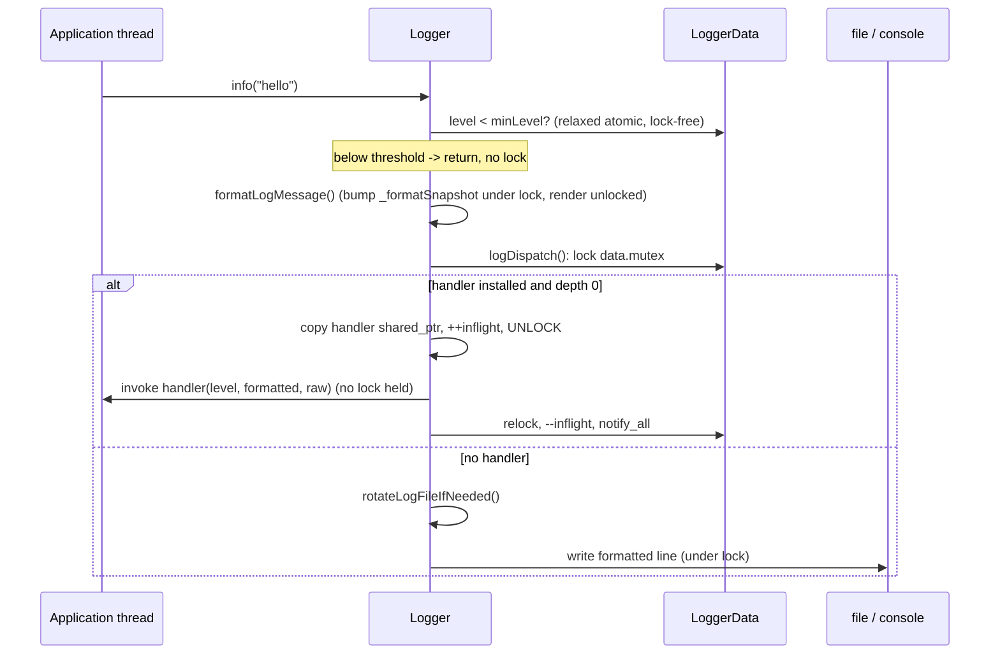

# Iora Logger -- Architecture & Programmer's Guide

[Back to index](../../README.md)

| | |
|---|---|
| **Version** | 1.0 |
| **Date** | 2026-09-10 |
| **Status** | IMPLEMENTED |
| **Header** | `include/iora/core/logger.hpp` |
| **Compiled unit** | `src/core/iora_core.cpp` (defines `Logger::getData()` and `Logger::handlerReentryDepth()` once into `libiora_core.so` when `IORA_CORE_SHARED`/`IORA_CORE_BUILDING` is set; otherwise a header-only fallback compiles one copy per image) |
| **Namespace** | `iora::core` (class `Logger`, plus `LoggerStream`, `LoggerProxy`, and the process-wide `iora::core::Logger` proxy object) |
| **Dependencies** | Standard library only -- `<atomic>`, `<condition_variable>`, `<mutex>`, `<thread>`, `<queue>`, `<deque>`, `<unordered_set>`, `<optional>`, `<functional>`, `<memory>`, `<fstream>`, `<filesystem>`, `<sstream>`, `<iomanip>`, `<iostream>`, `<chrono>`, `<ctime>`, `<cstdarg>`, `<cstdio>`, `<cstring>`, `<cstdint>`, plus platform `<unistd.h>`/`<fcntl.h>` (POSIX) or `<io.h>` (Windows) -- and one intra-Iora leaf header, `iora/util/gzip.hpp` (a dependency-free header-only codec compiled into `libiora_core`; the one blessed exception to the util->core layering, consumed only by the aged-file compressor). No third-party dependencies. |

---

## Revision History

| Version | Date | Changes |
|---|---|---|
| 1.0 | 2026-09-10 | Consolidated the two frozen source guides -- `coding_trackers/docs/iora/logger_external_handlers.md` (v3.8) and `coding_trackers/docs/iora/logger_gzip_compression.md` (v1.0) -- plus the README "Thread-Safe Logger" seed into one doc-wiki guide at `docs/core/logger.md`, restructured to the 12-section template. Every signature, default, mutex name, and threading claim was re-verified against the current `include/iora/core/logger.hpp` (3220 lines) and `src/core/iora_core.cpp`. Corrected stale claims: `init()` now takes a sixth `compressAfterDays` argument (the prior external-handlers guide's API reference showed the 5-argument form); there is no `setRetentionDays()` method (README stale) -- retention is an `init()` argument. |

Historical milestones carried from the frozen sources (behaviour, not tracking):

| Milestone | Change |
|---|---|
| v2.0 / v3.0 (2026-07) | Sync `log()` stopped holding the mutex across the callback; per-thread reentry depth added; the self-tear-out drain moved to **frozen-inflight accounting** after the earlier `inflight == depth` scheme deadlocked with two concurrent self-tearing invocations. |
| v3.5 (2026-07-24) | `LoggerData` became an **immortal, never-destroyed** singleton; the exit-time drain/flush moved from `~LoggerData` to a `std::atexit` reap-without-destroy (`atexitReapNoDestroy`). |
| v3.6 (2026-07-24) | `setExternalHandler({})` / `(nullptr)` became a lossless **uninstall** (the enable flag is derived from `static_cast<bool>(handler)`); a one-shot `fileReopenPending` reopens the same-day file after a handler cycle. |
| v3.7 (2026-07-25) | The handler is held as `std::shared_ptr<const ExternalHandler>`, so the dispatch copy, tear-out swap, and install swap run no user code under the mutex; the compiled format is an immutable `FormatSnapshot` published behind a `shared_ptr<const FormatSnapshot>`. |
| v3.8 (2026-09-03) | The `IORA_LOG_*F` macros forward to `Logger::logFixedBuffer`, which checks the `vsnprintf` return (no indeterminate-buffer read on an encoding error) and carries `format(printf, 5, 6)` for compile-time `-Wformat` checking. |
| gzip v1.0 (2026-09-04) | Aged-file gzip compression added (`compressAfterDays`): a dedicated compressor thread, a shared directory scan with retention, and an fsync-durable `.partial`->`.gz` publish. |

---

## 1. Executive Summary

### Problem

A production service needs one logging facility that is safe to call from every thread, cheap on the hot path, and able to (a) render structured lines through a configurable format, (b) roll its file sink daily and prune or compress old files, and (c) hand every record to an application callback (syslog, a metrics pipeline, a test harness) when asked. Each of those three concerns hides a hard sub-problem:

- **Concurrency.** In synchronous mode the log call renders and writes on the caller's own stack; in asynchronous mode a background worker drains a queue. Both must share one lock discipline without ever holding a user-facing lock across a user callback.
- **Exit-time safety.** Objects with static storage duration log from their destructors, and a handler may call `std::exit()` from inside itself. A logger whose state is destroyed at static-destruction time would then lock a destroyed mutex.
- **Handler teardown.** A handler almost always captures the object that owns it. Tearing the handler out while an invocation is running -- especially an invocation that is tearing *itself* out -- would destroy that object mid-callback (a use-after-free).

### Solution

`iora::core::Logger` is an **all-static** class whose entire state lives in one process-wide `LoggerData` singleton (`getData()`). Around it:

- A single non-recursive `data.mutex` orders all sink I/O and all state transitions; a strict-leaf `data.compressorMutex` handles the compressor's O(1) queue hand-off.
- The `LoggerData` singleton is **immortal** (heap-allocated, never deleted); a `std::atexit` reap flushes and joins the worker at process exit **without destroying** the object.
- External-handler tear-out uses **frozen-inflight accounting**: a tear-out issued from inside the handler registers the frame it cannot drain and waits `inflight == frozen`, while an outside (depth-0) caller waits a genuine full drain `inflight == 0` and is the only one permitted to destroy captured state.
- The handler and the compiled format are both held behind `std::shared_ptr<const ...>`, so copies and swaps under the lock are refcount bumps, never user code.
- Aged rotated files gzip **off** the hot path on a dedicated compressor thread, published atomically and fsync-durably.

### Technical Impact

- **Lock-free level gate** on the hot path (`minLevel` is a relaxed atomic); a filtered-out call returns before taking any lock.
- **No user callback, and no user capture destructor, ever runs while `data.mutex` is held** (copy-then-invoke; unlocked last-reference drop).
- **Deadlock-free handler teardown at any concurrency** (regression-tested at N=3), with no timeout in the correctness path.
- **Exit-time-safe:** a static sink whose destructor calls `clearExternalHandler()` reaches a live singleton regardless of static-destruction order.
- **Zero hot-path compression cost:** the enqueue is an O(1) strict-leaf op; the gzip runs entirely off `data.mutex`.

---

## 2. System Architecture

### 2.1 Component relationships

```
iora::core
|-- Logger                          (all-static; never instantiated as state)
|   |-- getData() -> LoggerData&    (ONE immortal instance process-wide -- section 3.9)
|   |   |-- mutex                   LOWEST lock: hot path, rotation, retention, sink I/O
|   |   |-- cv                      worker wakeup            (exactly ONE waiter -> notify_one)
|   |   |-- externalHandlerDone     drain + worker-exit      (MANY waiters -> notify_all)
|   |   |-- queue                   normal sink backlog (formatted strings)
|   |   |-- rawQueue                handler backlog ({Level, message}); filled only in async mode
|   |   |-- externalHandler / useExternalHandler          the handler "gate"
|   |   |-- externalHandlerInflight / externalHandlerFrozen   drain accounting
|   |   |-- _formatSnapshot         shared_ptr<const FormatSnapshot> (COW format config)
|   |   |-- fileStream / logBasePath / currentLogDate / fileReopenPending
|   |   |-- retentionDays / compressAfterDays / compressionEffective
|   |   |-- workerThread / workerRunning / workerGeneration / workerThreadId
|   |   |-- compressorMutex         STRICT LEAF (strictly below mutex on ONE edge)
|   |   |-- compressorCv / compressorThread / compressorQueue / compressorQueued
|   |   |-- compressorInFlight / compressorExit / compressorRunning
|   |   `-- exit, asyncMode, minLevel   (atomics)
|   |-- handlerReentryDepth() -> int&   (ONE thread_local instance process-wide -- section 3.9)
|   `-- RAII guards (private): HandlerInvocationScope, FrozenScope, FrozenReleaser, HandlerCopyDropper
|-- LoggerStream                    (ostream-style proxy; flushes on destruct / << endl)
|-- LoggerProxy                     (operator<< Level -> LoggerStream)
`-- Logger  (inline LoggerProxy object; enables the << streaming spelling)
```

Note that `iora::core::Logger` names **both** the class and the inline `LoggerProxy` variable. Qualified calls (`Logger::info(...)`) resolve to the class; `Logger << Level::Info << ...` resolves to the variable.

### 2.2 The two operating modes

| Mode | Selected by | Who renders/writes | Latency | Handler runs on |
|---|---|---|---|---|
| **Synchronous** | `init(async=false)` (default) | the calling thread, on its own stack | inline | the caller's thread |
| **Asynchronous** | `init(async=true)` | a background worker (`runWorker`) drains `queue`/`rawQueue` | queued | the worker (and any `flush()` caller) |

Both modes share the same lock, the same format snapshot, and the same file rotation/retention/compression logic.

### 2.3 Data flow -- a synchronous info() call



### 2.4 Threading model

| Thread | Responsibility |
|---|---|
| Application threads | `log()`/`trace..fatal`/`*f`/macros; `flush()`, `setExternalHandler`, `clearExternalHandler`, `shutdown()`, `init()`. In **sync** mode these threads render, write the sink, and invoke the handler directly. |
| Logger worker (`runWorker`) | Spawned by `init()` when `async == true`. Waits on `cv`, drains `rawQueue` to the handler then `queue` to the sink. Its **last action under the lock** clears `workerRunning`/`workerThreadId` and `notify_all`s `externalHandlerDone` -- the only wakeup for worker-exit waiters. |
| Compressor (`compressorLoop`) | Spawned by `init()` iff `compressionEffective`. The only thread that gzips. Runs off-lock, takes `data.mutex` only for the brief metadata-only publish, and **never calls any `Logger::` API** (diagnostics go straight to `std::cerr`). |
| Process-exit thread | The `std::atexit` reap `atexitReapNoDestroy` -> `teardownAndReapWorker`: reaps the worker, flushes buffered output, and joins the compressor **without destroying** the immortal singleton. May itself be at depth 1 if a handler called `std::exit()`. |
| Any thread inside a handler | Depth 1. May re-enter `Logger`; its nested logs are depth-gated to the normal sink; a tear-out from here takes the self-tearer branch. |

---

## 3. Component Deep Dive

### 3.1 State ownership -- the immortal `LoggerData` singleton

All mutable state is a single `LoggerData` returned by `getData()`. In the supported shared build (`IORA_CORE_SHARED` / `IORA_CORE_BUILDING`) `getData()` is defined once in `src/core/iora_core.cpp`; otherwise a byte-identical header-only fallback compiles one copy per image. The singleton is heap-allocated with `new LoggerData()` and **never deleted** -- deliberately leaked -- so its `mutex`, condition variables, queues, and worker bookkeeping outlive every static object that might log from its own destructor and every self-tearer still parked at process exit. The same magic-static initializer registers `std::atexit(&Logger::atexitReapNoDestroy)` exactly once (a failed registration is reported to `cerr`).

`~LoggerData` still exists in the source (delegating to `teardownAndReapWorker` with `report=false`) but is **never invoked in a normal build**; it is retained only for a test mutant that reverts to a destroyed singleton.

### 3.2 The format snapshot (COW)

The format configuration -- the original format string, the pre-compiled segment vector, and the strftime timestamp format -- is bundled into an immutable `FormatSnapshot` published behind `std::shared_ptr<const FormatSnapshot>` (`_formatSnapshot`, never null; initialized to the default snapshot). It is always read as a set, so a reader takes one refcount bump under the lock (`currentFormatSnapshot()`) and renders through the immutable pointee unlocked; a publisher (`setLogFormat`, `init`) clones-mutates-replaces the whole pointer under the lock (`republishFormatSnapshotLocked`). This guarantees a reader never sees a torn pair (segments from one publish, timestamp from another) and never deep-copies the segment vector per message.

The compiled format is a vector of `FormatSegment { FormatToken token; std::string literal; }`. `compileFormat` walks the format string once, emitting a `Literal` segment for runs of text and a token segment for each recognized placeholder. Placeholders:

| Token | Placeholder | Renders |
|---|---|---|
| `Timestamp` | `%T` | wall-clock time via `renderTimestamp` (see 3.3) |
| `ThreadId` | `%t` | `std::hash<std::thread::id>` as hex, width `sizeof(std::size_t)*2` (8 on 32-bit, 16 on 64-bit) |
| `Level` | `%L` | `TRACE`/`DEBUG`/`INFO`/`WARN`/`ERROR`/`FATAL` |
| `Message` | `%m` | the raw message text |
| `File` | `%F` | source file basename (path stripped); empty when no location |
| `Line` | `%l` | source line; **empty (not `0`)** when no location |
| `Function` | `%f` | enclosing function; empty when no location |
| (literal) | `%%` | a literal `%` |

An unrecognized `%x` is emitted literally. Every rendered line ends with a newline (`oss << std::endl`).

### 3.3 Timestamp rendering

`renderTimestamp(fmt)` reads the wall clock once, converts to local time via the reentrant `detail::localTimeReentrant` (POSIX `localtime_r` / Windows `localtime_s`), and formats with `std::put_time`. A **millisecond field (`.mmm`) is appended only when the format contains `%S`**. A conversion failure yields the sentinel string `[invalid-time]`. `currentDate()` (used for rotation) renders `%Y-%m-%d` from local time, returning `0000-00-00` on failure.

### 3.4 Direct level functions and source location

`trace/debug/info/warning/error/fatal` each take three defaulted trailing arguments -- `file`, `line`, `function` -- filled by the compiler builtins `__builtin_FILE()/__builtin_LINE()/__builtin_FUNCTION()` **evaluated at the call site** (the C++17 backport of `std::source_location`). This is why `%F/%l/%f` render for these functions without any macro. On a compiler lacking the builtins the location falls back to `""`, `0`, `""`. The backing macros (`IORA_SRC_FILE/LINE/FUNC`, `IORA_HAS_SRC_LOC`) are `#undef`'d right after the six declarations so they do not leak into consuming translation units.

Two properties are easy to miss:

- **The default format `"[%T] [%L] %m"` contains none of `%F/%l/%f`, so out of the box source location renders for nobody.** You must add the placeholders via `setLogFormat` to see it.
- **Source location reaches only a *synchronous* handler's `formattedMessage`.** In async mode the worker re-formats from a `rawQueue` holding only `{level, message}`, so `%F/%l/%f` render blank for the handler regardless of entry point. A record written to the file/console sink is formatted on the logging thread and can still carry location. The handler's third argument, `rawMessage`, never carries location in any mode.

### 3.5 Printf-style families, and the macro/function split

There are two printf-style paths, and they differ:

- **`tracef/debugf/infof/warningf/errorf/fatalf`** -- `vsnprintf` the size, allocate a `std::vector<char>` to fit, format, and log. **No length limit; no source location.** Each carries `__attribute__((format(printf, 1, 2)))` under GCC/Clang for `-Wformat` checking.
- **`IORA_LOG_TRACEF ... IORA_LOG_FATALF`** -- forward the call to `Logger::logFixedBuffer`, which formats into a fixed `char buf[4096]` (4095 payload bytes plus a NUL) **with** source location. **Truncates** an over-long payload. `logFixedBuffer` carries `__attribute__((format(printf, 5, 6)))`.

On an **encoding** error (`vsnprintf` returns negative -- e.g. `%ls` with a wide char not representable in the active locale) both paths substitute the diagnostic `[Logger] Invalid format string` rather than reading indeterminate bytes. So the two paths are at parity on the encoding-error case and differ only on the length limit.

Traps: the macro is spelled `IORA_LOG_WARN`, but the function is `Logger::warning`. The macros are fully variadic forwarders (`(...)`), so a format-only call `IORA_LOG_INFOF("plain message")` is well-formed under `-pedantic -Werror`. `IORA_LOG_CONTEXT_PREFIX` is a separate, **deprecated** helper that inserts a `[file:line func]` prefix into the message stream; the `IORA_LOG_*` macros do **not** use it -- prefer the `%F/%l/%f` placeholders.

### 3.6 External handlers -- the gate and the tear-out drain

`setExternalHandler(handler)` installs a callback `void(Level, const std::string &formatted, const std::string &raw)`. **While a non-empty handler is installed it is the sole sink: file and console output are suppressed and every record is delivered to the handler.** There is exactly one handler slot process-wide; installing replaces whatever was there (no chaining, no query API). Passing an **empty/null** handler is a lossless **uninstall** identical to `clearExternalHandler()`: the enable flag goes false, any queued backlog is rerouted (not dropped) to the file/console, and file logging resumes on the next log call.

The "gate" is the pair `externalHandler` (a `shared_ptr<const ExternalHandler>`) and `useExternalHandler` (a bool). They are written together under the lock; dispatch reads both (`useExternalHandler && externalHandler`) while `rotateLogFileIfNeeded` keys on `useExternalHandler` alone. Because the flag is derived from `static_cast<bool>(handler)`, that flag-alone read is honest.

The hard part is **removing** a handler safely, because it captures the object that owns it. The one place the drain protocol is argued is `tearOutGateAndDrainInflightLocked`:

```cpp
data.externalHandler.swap(doomed);   // pointer/refcount exchange -- no user code under the lock
data.useExternalHandler = false;
const int depth = handlerReentryDepth();
if (depth > 0)                       // self-tearer: called from inside the handler
{
  frozenSlot.emplace(data, depth);   // register the frame we cannot drain
  data.externalHandlerDone.notify_all();
  waitWithStallDiagnosticLocked(lock, data, "...",
    [&] { return data.externalHandlerInflight == data.externalHandlerFrozen; });
}
else                                 // external caller (depth 0)
{
  waitWithStallDiagnosticLocked(lock, data, "...",
    [&] { return data.externalHandlerInflight == 0; });
}
```

Design points:

- **Nulling the gate here, not at the call site,** prevents any *new* invocation of the torn-out handler from starting (every dispatch site tests `useExternalHandler` under the same lock). So observing the predicate is a genuine quiescent point for the torn-out handler, which now lives in `doomed`.
- **`swap`, not move-assign.** The displaced handler rides out on a caller-owned `doomed` local (declared **before** the lock) and is destroyed after the lock releases, so the last-reference capture destructors never run under the mutex. Because the handler is a `shared_ptr`, the swap runs no user code on any platform.
- **The predicate is live** (re-read on every wakeup), which is what lets a peer's registration satisfy a parked waiter.
- **`frozen` accounting.** A tear-out issued *from inside the handler* is pinned in its own invocation and can never satisfy `inflight == 0`. It instead registers its depth in `externalHandlerFrozen` (invariant `0 <= frozen <= inflight`) and waits `inflight == frozen`, draining every non-frozen invocation. The earlier scheme (wait for `inflight == own depth`) deadlocked when two self-tearing invocations ran concurrently -- each waited on the other, which was equally pinned.

The two caller classes receive **different guarantees**:

| Caller | Waits | On return |
|---|---|---|
| **Depth 0** (any tear-out from an ordinary thread, incl. `shutdown()`) | `inflight == 0` | No invocation of the torn-out handler is running. **The only safe basis for destroying an object the handler captured.** |
| **Depth 1** (`clear`/`set`/teardown *by* the handler) | `inflight == frozen` | Only non-self-tearing invocations have exited; peer self-tearers may still be running handler code. **Never** destroy captured state on this basis. |

**Why the registration site notifies.** For `clear`/`set` the incrementer observes the gap and promptly drives a notifying `--inflight`. But a **teardown** caller (`shutdown()`/atexit reap) keeps its registration across `worker.join()` without decrementing, so the peer it just satisfied would have no wakeup -- hence the `notify_all` at the frozen registration. The `FrozenScope` **destructor** needs no notify: since `frozen <= inflight`, a frozen decrement can only falsify `inflight == frozen` and never affects `inflight == 0`.

### 3.7 The dispatch bracket and the RAII guards

`runHandlerUnlocked` is the one in-flight bracket: given the lock held and the handler already copied under it, it `++inflight`, unlocks, runs the callback, then relocks, `--inflight`, and `notify_all`s -- **on every path, including the exception path** (which relocks, decrements, notifies, and rethrows). Four private RAII guards keep the window correct:

- **`HandlerInvocationScope`** -- `++/--handlerReentryDepth()` around the callback (declared first, destroyed last).
- **`HandlerCopyDropper`** -- resets the dispatch site's handler `shared_ptr` copy inside the unlocked window and while depth is still `>= 1` (declared second, destroyed first). Both properties are required: unlocked so the last-reference capture destructors do not run under the mutex, and at depth `>= 1` so a destructor that re-enters `clear`/`set` takes the self-tearer branch rather than waiting `inflight == 0` on its own pinned frame. Its `reset()` is wrapped in a swallow (a throwing capture destructor inside a `noexcept` destructor would `std::terminate`).
- **`FrozenScope`** -- `+=/-=` `externalHandlerFrozen`, constructed and destroyed under the mutex; never notifies.
- **`FrozenReleaser`** -- releases a caller-owned `FrozenScope` under the mutex on every exit path, including a throw. Teardown holds its frozen registration across the join, so it cannot ride the `unique_lock`'s scope the way `clear`/`set` do.

`formatAndInvokeRawHandler` (the async drain step) orders the guards deliberately and does the throwable formatting **inside** both guards: a throw before the dropper existed would unwind through `runHandlerUnlocked`'s catch (which relocks) and leave the caller destroying the handler copy under the lock. Rule: everything throwable belongs inside the guards.

### 3.8 Backlog policy on tear-out

| Path | `rawQueue` policy | Why |
|---|---|---|
| `clearExternalHandler` | **Reroute** to the normal queue, then wake the worker -- **skipped** if a racing `set` reinstalled a handler | No handler after a clear, so the normal sink is correct and nothing is lost. |
| `setExternalHandler(real)` | **Drop** | Rerouting would print while the new handler is active; delivering to the new handler would be misdelivery. |
| `setExternalHandler({})` (uninstall) | **Reroute**, then wake the worker -- skipped under the same `!useExternalHandler` race guard as clear | An empty handler is an uninstall; there is no new handler to misdeliver to. |
| `teardownAndReapWorker` | **Reroute, unguarded** | Nothing will drain them afterwards; printing a racing reinstall's entries beats losing them. |

All paths also prevent an **orphaned `rawQueue`** (a non-empty raw queue with the drain gated off), which would keep the worker's CV predicate satisfied and busy-spin -- hence the predicate's `&& data.useExternalHandler` term.

### 3.9 File rotation, retention, and one-instance-process-wide

`rotateLogFileIfNeeded` (under `data.mutex`, skipped when console-only or a handler is installed) opens `<basename>.<date>.log` in the base path's directory. It reopens when the local date rolls over **or** when `fileReopenPending` is set (a one-shot armed when `setExternalHandler(real)` closes the stream, so a same-day handler cycle still reopens). On a genuine **date rollover** and only when there is work (`retentionDays > 0 || compressionEffective`), it runs one shared directory scan feeding retention then compression (section 4). All filesystem calls use the `error_code` overloads, because on the sync path a thrown `std::filesystem_error` would escape the caller's own log statement.

The tear-out drain branches on `handlerReentryDepth()`, so correctness requires **one instance process-wide**, including across `dlopen`'d plugins (loaded `RTLD_LOCAL`). Both `getData()` and `handlerReentryDepth()` are therefore defined once in `libiora_core.so` under `IORA_CORE_SHARED`/`IORA_CORE_BUILDING`; the header-only fallback (used only when the `iora_core` target is absent, e.g. a vendored `include/`) compiles one copy per image and is **not** plugin-safe. Build against the compiled core (link `iora_lib`/`iora_core`) whenever you `dlopen` plugins, and run `iora_test_plugin_isolation` to verify a single instance.

### 3.10 The stall diagnostic

`waitWithStallDiagnosticLocked` wraps every drain and worker-exit wait in a `wait_for(kStallReportInterval)` with `kStallReportInterval = std::chrono::seconds(5)`, printing `inflight`, `frozen`, and `workerRunning` each time it fires and repeating for as long as the wait lasts. **It never gives up and proceeds** -- proceeding early would be a use-after-free, strictly worse than a hang. No correctness property may depend on this constant; every satisfying state change notifies (with the two documented exceptions in the notify-sites table of section 6).

---

## 4. The Aged-File Gzip Compressor

The compressor is a self-contained subsystem inside `Logger`, gated by the `compressAfterDays` init argument. It gzips a rotated `<base>.<date>.log` to `<base>.<date>.log.gz` once the file's date is older than N days -- **not** when it rotates -- entirely off the hot path.

### 4.1 The derived enable predicate

Raw `compressAfterDays > 0` is not the gate. A file must age into compression *before* retention deletes it, so `init()` computes one derived bool under `data.mutex`:

```cpp
data.compressionEffective = !filePath.empty() && (compressAfterDays > 0) &&
                            (retentionDays <= 0 || retentionDays > compressAfterDays);
```

`compressionEffective` gates all three of the compressor spawn, the sweep's early return, and the enqueue. When `0 < retentionDays <= compressAfterDays` compression is disabled with a **one-time** `std::cerr` warning naming both values (never per-rotation, because `init()` is start-up/quiescent-only). Console-only logging (`filePath.empty()`) also disables it.

### 4.2 The shared directory scan

Retention and compression share ONE non-throwing directory pass, `collectLogFiles(datesWithGz&)`, which classifies each entry most-specific-suffix-first (`classifyLogFileKind`: `.gz.partial` -> `PARTIAL_GZ`, then `.log.gz` -> `LOG_GZ`, then `.log` -> `LOG`), parses its date positionally (`parseLogFileDate`), and returns `std::vector<LogFileEntry>` plus, by side effect, the set of dates that already have a `.log.gz`:

```cpp
struct LogFileEntry { std::string path; std::string date; long fileDays; LogFileKind kind; };
```

`date` is the 10-char local `YYYY-MM-DD` (matching `currentLogDate`); `fileDays` is UTC-midnight based (`detail::timeGmReentrant`, avoiding TZ-global contention).

### 4.3 UTC-vs-local skew -- the active-file guard

The active file is named from the **local** date, but `fileDays` is computed from **UTC** midnight. West of UTC near midnight the just-opened active file can read `fileDays == 1`, so there is no structural "the active file is 0 days old" guarantee. The only correct exclusion is the positive identity check `entry.date == data.currentLogDate`, applied on **every** delete-capable path: the age sweep (criterion (f)), retention (`deleteOldLogFiles`), and the compressor's spawn-time orphan reclaim. Adding this guard to `deleteOldLogFiles` fixed a west-of-UTC bug in which retention could delete the open active file at `retentionDays == 1`.

### 4.4 The age sweep

`compressOldLogFiles` enqueues a `LogFileEntry` iff it passes all of:

| Criterion | Meaning |
|---|---|
| (a) | `kind == LOG` -- only uncompressed logs |
| (b) | `fileDays >= compressAfterDays` -- old enough |
| (c) | `retentionDays <= 0 || fileDays < retentionDays` -- retention will not delete it |
| (d) | `datesWithGz.count(date) == 0` -- no sibling `.log.gz` already exists |
| (e) | not already in `compressorQueued` and `!= compressorInFlight` -- dedup |
| (f) | `date != currentLogDate` -- not the active file (4.3) |

The enqueue is a strict-leaf op: acquire `compressorMutex`, check the `compressorExit` gate, dedup, bounds-check against `COMPRESSOR_QUEUE_MAX == 256` (over-limit **drops**; the file stays `.log`, retried next sweep), `push_back` + insert into `compressorQueued`, release, then -- only if pushed -- `compressorCv.notify_one()`. The push/skip gate is **`compressorExit`, not `compressorRunning`**: at the boot sweep the thread has not spawned yet (`compressorRunning == false`) but the enqueue must still seed the startup backlog; a post-reap sweep also sees `compressorRunning == false` but must skip. Only `compressorExit` (reset before the boot rotate, set at teardown) distinguishes the two.

### 4.5 The compressor thread

`compressorLoop` contains every throwing piece of work in try/catch -> `std::cerr` (a throw escaping a raw `std::thread`'s top-level function is `std::terminate`), in **two sibling regions**: a one-time `compressorStartupCleanup` (remove stray `.gz.partial` from a prior crash; reclaim a crash-orphan `.log` whose `.gz` sibling already exists), and a **per-iteration** try/catch. The per-iteration containment is the zombie fix: a dead thread strands `compressorRunning == true` (cleared only at the teardown join), so a later `init()` would refuse to respawn and compression would be silently, permanently dead until a full `shutdown()` + `init()`. On any throw it reports, clears `compressorInFlight`, applies a 1 ms backoff (bounding a persistent-cause busy-spin), and continues -- only `compressorExit` ends the loop.

CV discipline is **break-before-pop**: on `compressorExit`, break before popping, so only the in-flight file completes at teardown; otherwise the throwable copies (`front() -> src`, `src -> compressorInFlight`) run before the `noexcept` removals (`pop_front`, `erase`) so a throw retries the item rather than stranding it.

### 4.6 Durable atomic publish

`compressOneFile` streams the source through `iora::util::Gzip::Encoder(Level::DEFAULT)` (a 64 KB read buffer feeds `enc.update()`, `enc.finish()` flushes the trailer) into `<src>.gz.partial` via an fsync-capable `FILE*` (an `std::ofstream` exposes no descriptor), then `fflush` + `fsync` (POSIX) / `_commit` (Windows), folding a close error into durability. On any non-durable result the `.partial` is removed and the file abandoned as `.log`. Only after a durable `.partial` does it take `data.mutex` for one uninterrupted metadata-only critical section: re-check the source still exists (else abandon -- retention pruned it); **only when `retentionDays > 0`**, re-parse the source date and abandon if it aged past retention while queued; `fs::rename(.partial, .gz)`; `fs::remove(src)` -- the source is unlinked **only after** the durable rename. The compressor acquires `data.mutex` only with `compressorMutex` released (ABBA guard) and calls no `Logger::` API on any path.

---

## 5. Usage Guide

### 5.1 Quick start (console)

```cpp
#include "iora/core/logger.hpp"

int main()
{
  iora::core::Logger::setLevel(iora::core::Logger::Level::Debug);
  iora::core::Logger::setConsoleColors(true);

  iora::core::Logger::info("service starting");
  iora::core::Logger::warningf("retrying %d of %d", 2, 5);
  IORA_LOG_ERROR("could not bind port");        // carries source location if the format asks for it
  return 0;
}
```

Without an `init()` call the logger is console-only at `Level::Info` with the default format `"[%T] [%L] %m"`.

### 5.2 Async mode, file rotation, retention, and compression

```cpp
#include "iora/core/logger.hpp"

int main()
{
  // Compress rotated logs older than 3 days; keep 30 days total.
  // retentionDays (30) MUST exceed compressAfterDays (3) or compression is disabled.
  iora::core::Logger::init(iora::core::Logger::Level::Info,
                           "/var/log/myservice/app",       // base: files are app.<date>.log
                           /*async=*/true,
                           /*retentionDays=*/30,
                           /*timeFormat=*/"%Y-%m-%d %H:%M:%S",
                           /*compressAfterDays=*/3);

  IORA_LOG_INFO("service started");
  // ... run ...
  iora::core::Logger::shutdown();                          // joins the worker; complete final flush
  return 0;
}
```

Produced files are standard gzip: `gunzip -c /var/log/myservice/app.2026-08-20.log.gz`, `zgrep ERROR /var/log/myservice/app.2026-08-*.log.gz`.

### 5.3 Custom format with source location

```cpp
iora::core::Logger::setLogFormat("[%T] [%t] [%L] [%F:%l %f] %m");
// %F/%l/%f render for trace/debug/.../fatal and the IORA_LOG_* macros; blank for the
// bare *f functions and the << stream path, and blank for any ASYNC handler.
IORA_LOG_INFO("processing request");
// -> [2026-09-10 14:30:45.123] [d4bb52008fe71a22] [INFO] [server.cpp:142 handleRequest] processing request
```

### 5.4 Stream-style logging

```cpp
iora::core::Logger << iora::core::Logger::Level::Info
                   << "connected " << 3 << " peers"
                   << iora::core::Logger::endl;   // flushes; << endl always flushes (even if empty)
```

`~LoggerStream` flushes a non-empty pending statement automatically; the stream path carries no source location.

### 5.5 Object-bound external handler

```cpp
#include "iora/core/logger.hpp"
#include <array>
#include <mutex>
#include <string>
#include <vector>

class MetricsSink
{
public:
  MetricsSink()
  {
    iora::core::Logger::setExternalHandler(
      [this](iora::core::Logger::Level level, const std::string &formatted,
             const std::string & /*raw*/)
      {
        // May be invoked concurrently on several threads (worker + flush(), or every
        // logging thread in sync mode). Be thread-safe and return promptly.
        std::lock_guard<std::mutex> lock(_mutex);
        ++_counts[static_cast<std::size_t>(level)];
        _lines.push_back(formatted);
      });
  }

  ~MetricsSink()
  {
    // Depth 0 -> waits inflight == 0. On return no invocation is running, so *this
    // (and _mutex/_lines) is safe to destroy. Call WITHOUT holding _mutex -- holding
    // it here deadlocks permanently (an in-flight invocation blocked on _mutex can
    // never leave, and the drain never times out). See anti-patterns.
    iora::core::Logger::clearExternalHandler();
  }

  MetricsSink(const MetricsSink &) = delete;
  MetricsSink &operator=(const MetricsSink &) = delete;

private:
  std::mutex _mutex;
  std::vector<std::string> _lines;
  std::array<int, 6> _counts{};
};
```

### 5.6 Config-file form (via `IoraService`)

```jsonc
{
  "log": {
    "level": "info",
    "file": "/var/log/myservice/app",
    "async": true,
    "retentionDays": 30,
    "compressAfterDays": 3
  }
}
```

`IoraService::applyConfig` reads these (defaults: `retentionDays` 7, `compressAfterDays` 0) and passes them to `Logger::init`.

### 5.7 Anti-patterns

| Do | Don't |
|---|---|
| Clear the handler from a depth-0 thread before destroying its captured object. | Destroy captured state on the strength of a self-tear-out (depth-1 clear returns while peers may still run -- section 3.6). |
| Return promptly from the handler. | Tear the handler out (or log) while holding a lock the handler also acquires -- permanent hang; the drain never times out. |
| Prefer `clearExternalHandler()` to `setExternalHandler({})` for clarity. | Assume `clearExternalHandler()` returns with no handler installed -- a racing `set` may reinstall one. |
| Write the sink to a real file or stdout. | Install a logging `std::streambuf` on `cout`/`cerr` -- sink I/O runs under `data.mutex`, so it self-deadlocks. |
| Log from ordinary threads. | Install or invoke the handler from a signal handler -- it takes a mutex, allocates, and writes streams (not async-signal-safe). |
| Call `init()` once at startup / while quiescent. | Call `init()` as live reconfiguration -- it clears the queues without draining and does not uninstall an active handler (section 9). |
| Set `retentionDays > compressAfterDays`. | Set `compressAfterDays >= retentionDays` -- compression is disabled at init with a one-time warning. |

---

## 6. Call Flow / Sequence Reference

### 6.1 Async delivery to a handler (success)

| # | Thread | Action | Lock |
|---|---|---|---|
| 1 | App | `info("x")`: level gate on relaxed atomic `minLevel` | none |
| 2 | App | `log()` renders `output` via `formatLogMessage` (brief lock to bump `_formatSnapshot`) | brief |
| 3 | App | `logDispatch` async branch: acquire lock; gate true, depth 0 -> `rawQueue.push({level, message})` | held |
| 4 | App | release, `cv.notify_one()` | release |
| 5 | Worker | wakes on `!queue.empty() || (!rawQueue.empty() && useExternalHandler) || exit` | held |
| 6 | Worker | `deliverOneRawEntryLocked`: re-test gate + depth; pop; copy snapshot + handler shared_ptr (one indivisible critical section) | held |
| 7 | Worker | `runHandlerUnlocked`: `++inflight`, unlock | release |
| 8 | Worker | `HandlerInvocationScope` (depth 1) -> `HandlerCopyDropper` -> format -> invoke handler | none |
| 9 | Worker | `~HandlerCopyDropper` (copy dies unlocked, depth 1), then `~HandlerInvocationScope` (depth -> 0) | none |
| 10 | Worker | relock, `--inflight`, `externalHandlerDone.notify_all()` | acquire |
| 11 | Worker | loop until drain returns false; then `drainNormalQueueLocked` | held |

### 6.2 Depth-0 tear-out racing an in-flight invocation

| # | Thread | Action | Lock |
|---|---|---|---|
| 1 | App | `clearExternalHandler`; `doomed` declared **before** the lock | none |
| 2 | App | acquire; `frozen` slot declared after it | acquire |
| 3 | App | `tearOutGateAndDrainInflightLocked`: `swap` into `doomed`, `useExternalHandler = false` | held |
| 4 | App | depth 0 -> wait `inflight == 0`; no frozen registration | released in wait |
| 5 | Worker | finishes 6.1 steps 8-10 -> `--inflight` -> `notify_all` | -- |
| 6 | App | predicate true; gate still null -> reroute `rawQueue`, wake the worker | held |
| 7 | App | end of locked scope; lock released | release |
| 8 | App | `~doomed` -- user capture destructors run **unlocked** | none |

### 6.3 A handler that throws

| Invoker | Disposition |
|---|---|
| **Worker** | Catches; the drain continues; `reportAndReleaseUnlocked` unlocks -> `what()` -> releases the user exception object **unlocked** -> relocks. |
| **`flush()`** | Stashes the exception in a pre-lock `exception_ptr`, still drains the normal queue and flushes the sink, then unlocks and rethrows to its caller. |
| **`shutdown()` / atexit reap** | The internal `flush()` is swallowed. The final drain/flush stash into `exception_ptr`s declared **above** the locked scope; after it closes they are reported/released via `reportAndReleaseNoLock`. |
| **Sync `log()`** | **Propagates out of the application's own log statement** -- `Logger::info("x")` throws. In a `noexcept` function or destructor that is `std::terminate`. |

### 6.4 Teardown (shutdown / atexit reap)

| Step | Action | Lock |
|---|---|---|
| 1 | `flush()` (drains `rawQueue` through the handler, then the sink) -- swallowed if it throws | as flush |
| 2 | Depth-branched drain of the handler (section 3.6) | `data.mutex` |
| 3 | Reroute `rawQueue` (unguarded), set `exit = true`, snapshot generation + `selfIsWorker`, move `workerThread` out, unlock, `cv.notify_one()` | -- |
| 4 | If joinable: detach when `selfIsWorker`, else `join()` (detach on a throwing join) | none |
| 5 | Relock; if not self-worker, wait for the worker's exit publication by **generation** | `data.mutex` |
| 6 | Final `drainNormalQueueLocked` + `flushSinkLocked`, each stashing throws above the lock | `data.mutex` |
| 7 | Set `compressorExit = true`, `compressorCv.notify_one()`, `join()` the compressor with `data.mutex` **released**; clear `compressorRunning` after the join | `compressorMutex` then `data.mutex` |

The compressor finishes only its in-flight file and abandons the rest of the queue (bounded atexit). Teardown is idempotent across `shutdown()` + the atexit reap (gated on `workerRunning`/`compressorRunning`).

### 6.5 Startup backlog compression (init first-open)

| Step | Action | Lock |
|---|---|---|
| 1 | `init()` computes `compressionEffective`; resets `compressorExit = false`, clears the compressor queue/dedup | `data.mutex` -> `compressorMutex` |
| 2 | Clears `currentLogDate`, calls `rotateLogFileIfNeeded` (`dateChanged == true`) | `data.mutex` |
| 3 | Shared scan; `deleteOldLogFiles` prunes; `compressOldLogFiles` enqueues aged files (gate `compressorExit == false`, so it pushes despite `compressorRunning == false`) | `data.mutex` -> `compressorMutex` per push |
| 4 | Spawns the worker (if async) and then the compressor (`compressionEffective && !compressorRunning`), publishing `*Running = true` **after** a successful construct | `data.mutex` |
| 5 | The compressor's first `cv.wait` sees the non-empty queue and drains the backlog | `compressorMutex`, then off-lock |

---

## 7. Thread Safety Model

### 7.1 Locks, condition variables, atomics

| Primitive | Role |
|---|---|
| `std::mutex data.mutex` | The **lowest** logger lock. Guards all queues, gate fields, drain counters, worker/compressor bookkeeping, format publish, and **all sink and diagnostic I/O**. Non-recursive. |
| `std::mutex data.compressorMutex` | **Strict leaf**, strictly below `data.mutex` on the single edge `mutex -> compressorMutex`. Held only for O(1) queue/dedup ops -- never across file I/O and never across any call into the logger. |
| `std::condition_variable data.cv` | Worker wakeup. Exactly **one** waiter -> `notify_one`. |
| `std::condition_variable data.externalHandlerDone` | Drain + worker-exit wakeup. **Many** waiters -> `notify_all`. |
| `std::condition_variable data.compressorCv` | Compressor wakeup on enqueue/exit. |
| `std::atomic<bool> data.exit` | Worker-stop predicate. Atomic as defense in depth, but written **and** read only under `mutex` -- an unlocked write can be lost between the worker's predicate check and its park, hanging `join()`. |
| `std::atomic<bool> data.asyncMode` | Read on the hot `logDispatch` branch without the lock; written only by `init()`. Relaxed. |
| `std::atomic<Level> data.minLevel` | Read on the lock-free hot-path level gate; written by `init()`/`setLevel()`. Relaxed. |
| `thread_local int handlerReentryDepth()` | Per-thread handler reentry depth. Owning thread only, no lock; **one instance process-wide** (section 3.9). Never assign to it. |

All other `LoggerData` members (`queue`, `rawQueue`, `externalHandler`/`useExternalHandler`, `externalHandlerInflight`/`externalHandlerFrozen`, `_formatSnapshot`, `fileStream`/`logBasePath`/`currentLogDate`/`fileReopenPending`, `retentionDays`/`compressAfterDays`/`compressionEffective`, `workerRunning`/`workerGeneration`/`workerThreadId`, and the `compressor*` members) are plain scalars mutated **and read only under** their owning mutex.

### 7.2 Lock ordering

`data.mutex` is the lowest logger-owned lock. There is exactly one edge below it: `data.mutex -> data.compressorMutex` (the age-sweep enqueue and `init`'s reset take the leaf while holding `mutex`). The compressor acquires `data.mutex` **only** with `compressorMutex` released (ABBA guard). The only other locks acquired beneath `data.mutex` are the sink's stream/stdio locks (sink I/O and stall diagnostics run under `mutex` by design -- line ordering is prioritized over the latency of holding the lock across file I/O), which orders those stream locks below `mutex`. **No code may take `mutex` while holding a stream lock or `compressorMutex`.**

The converse -- that `mutex` is never held while another lock is held -- is **not** true and cannot be. In **sync** mode `logDispatch` invokes the handler on the caller's stack; although the copy-then-invoke pattern releases `data.mutex` before the callback, it cannot see the caller's own locks. A handler (or a log call under a lock) that acquires a lock a logging site also holds is an ABBA the logger cannot prevent -- hence the anti-patterns.

### 7.3 Copy-then-invoke and unlocked destruction

**No user callback, and no user capture destructor, ever runs while `data.mutex` is held.** Every dispatch site copies the handler `shared_ptr` under the lock, unlocks (via `runHandlerUnlocked`), then invokes. The removed handler's last-reference destruction runs on a caller-owned `doomed` local declared before the lock; the dispatch copy's destruction runs on `HandlerCopyDropper` in the unlocked window at depth `>= 1`. Because the handler is a `shared_ptr<const ExternalHandler>`, the under-lock copy, the tear-out swap, and the install swap are pure refcount/pointer exchanges -- no `std::function` copy or move constructor runs under the lock on any platform (the install `make_shared`, which does move-construct the `std::function`, is built **before** the lock). Caught exception objects are likewise reported and released unlocked (`reportAndReleaseUnlocked` on the worker path; `exception_ptr` declared above the lock in `flush()` and `teardownAndReapWorker`), because `what()` and the exception's destructor are user code.

The **one** user-code path that remains under `mutex` is sink/diagnostic I/O through a user `std::streambuf` on `cout`/`cerr` -- the reason a logging streambuf self-deadlocks (anti-pattern).

### 7.4 Worker liveness by generation

`workerThread.joinable()` is the wrong liveness signal: teardown moves the thread object out (and detaches it on the self-teardown path), so `joinable()` goes false while the worker still runs. `workerRunning` is the true signal, but it is level-triggered -- a racing `init()` can spawn a new worker that re-asserts it. Every exit wait is therefore stamped with `workerGeneration` (incremented under the mutex on each spawn), and `workerThreadId` answers only "am I the worker?" on the teardown paths. `workerRunning`/`compressorRunning` are published **after** a successful `std::thread` construct, so an `EAGAIN` throw cannot leave a running flag set with no thread.

### 7.5 Notify sites

Every state change that can satisfy a waiting predicate notifies. `externalHandlerDone` (many waiters, `notify_all`): the two `--inflight` sites in `runHandlerUnlocked` (normal + throw), the frozen registration in `tearOutGateAndDrainInflightLocked`, the frozen registration in `init()` at depth > 0, and the worker's exit publication. `cv` (one waiter, `notify_one`): the `logDispatch` enqueue, the reroute in `clearExternalHandler` and in `setExternalHandler`'s empty-uninstall, and the `exit` publication in `teardownAndReapWorker`. `compressorCv` (`notify_one`): the age-sweep enqueue (after releasing the leaf) and the teardown `compressorExit` set.

Two predicate terms deliberately do **not** notify, safe only under local arguments: `++workerGeneration` (reachable only after `workerRunning` first goes false, which does notify), and `setExternalHandler(real)`'s `useExternalHandler = true` (safe because `rawQueue = {}` executes earlier under the same uninterrupted lock hold, so the worker's predicate cannot flip). A future change to either site silently reintroduces a stall.

### 7.6 Sanitizer status

The concurrency logger suites that exercise the reused teardown path are TSan-clean and ASan-clean under `setarch $(uname -m) -R`; the gzip compressor path is likewise TSan/ASan-clean. The immortal-singleton probes deterministically fail against the two non-vacuity mutants (`IORA_LOGGER_TEST_MUTANT_DESTROY`, `IORA_LOGGER_TEST_MUTANT_NOREAP`).

---

## 8. Configuration Reference

`init()` configures the logger; several setters adjust individual facets afterward. Defaults are the `init()` default arguments.

| Parameter | Set by | Type | Default | Units / Range | Meaning |
|---|---|---|---|---|---|
| level | `init` / `setLevel` | `Logger::Level` | `Level::Info` | Trace < Debug < Info < Warning < Error < Fatal | Messages below it never render or reach the handler (lock-free relaxed atomic). |
| filePath | `init` | `const std::string&` | `""` | -- | `""` = console-only (no file). Otherwise files are `<basename>.<date>.log` in the base path's directory. |
| async | `init` | `bool` | `false` | -- | `true` spawns the worker; `false` renders/writes/invokes inline. |
| retentionDays | `init` | `int` | `7` | days; `<= 0` = no deletion | Deletes `LOG` and `LOG_GZ` files at this age (never `PARTIAL_GZ`, never the active file). MUST exceed `compressAfterDays` for compression to be effective. |
| timeFormat | `init` | `const std::string&` | `"%Y-%m-%d %H:%M:%S"` | strftime | The `%T` timestamp format; `.mmm` is appended only if it contains `%S`. |
| compressAfterDays | `init` | `int` | `0` | days; `<= 0` = OFF | Compress `<base>.<date>.log` once older than N days, off the hot path. |
| format string | `setLogFormat` | `const std::string&` | `"[%T] [%L] %m"` | placeholders `%T %t %L %m %F %l %f %%` | Pre-compiled once per call; empty strings are ignored. Contains no `%F/%l/%f` by default. |
| console colors | `setConsoleColors` | `bool` | `false` | -- | Applies only in console-only mode; honors `NO_COLOR` and requires stdout to be a TTY (both re-checked on the call). |
| `COMPRESSOR_QUEUE_MAX` | compile-time | `static constexpr std::size_t` | `256` | entries | Bounded compressor queue; over-limit pushes drop (retried next sweep). |
| Gzip level | compile-time | `iora::util::Gzip::Level` | `Level::DEFAULT` | FAST/DEFAULT/BEST | Compression effort in `compressOneFile`. |
| Read buffer | compile-time | `std::vector<char>` | `64 * 1024` | bytes | Streaming chunk feeding the encoder. |
| `kStallReportInterval` | compile-time | `std::chrono::seconds` | `5` | seconds | Stall-diagnostic period. **Diagnostic only** -- no correctness property depends on it. |

**Effective-compression rule:** compression runs iff `!filePath.empty() && compressAfterDays > 0 && (retentionDays <= 0 || retentionDays > compressAfterDays)`. Otherwise the compressor is not spawned and no `.gz` is produced (a `0 < retentionDays <= compressAfterDays` config emits a one-time `cerr` warning).

Tests are gated behind their CMake targets in `tests/CMakeLists.txt`; the test-only fault-injection seams (`Logger::TestHooks`, `Logger::testHooks()`) exist only when `IORA_ENABLE_TEST_HOOKS` is defined (the `iora_test_logger` target alone). A shipped build has no such symbol.

---

## 9. API Reference

All members are `static` on `iora::core::Logger` unless noted.

```cpp
namespace iora { namespace core {

class Logger
{
public:
  enum class Level { Trace, Debug, Info, Warning, Error, Fatal };

  using ExternalHandler = std::function<void(Level level,
                                             const std::string &formattedMessage,
                                             const std::string &rawMessage)>;

  struct Endl {};
  static inline constexpr Endl endl{};

  // Lifecycle. init() is start-up / quiescent-only (see Known Limitations).
  static void init(Level level = Level::Info, const std::string &filePath = "",
                   bool async = false, int retentionDays = 7,
                   const std::string &timeFormat = "%Y-%m-%d %H:%M:%S",
                   int compressAfterDays = 0);
  static void flush();      // drain rawQueue through the handler, then queue to the sink
  static void shutdown();   // flush(), then reap the worker and join the compressor

  // Level.
  static void  setLevel(Level level);
  static Level getLevel();

  // External handler. Empty/null handler == lossless uninstall (== clearExternalHandler).
  static void setExternalHandler(ExternalHandler handler);
  static void clearExternalHandler();

  // Format / color.
  static void        setLogFormat(const std::string &format);   // empty is ignored
  static std::string getLogFormat();
  static void        setConsoleColors(bool enable);             // console-only; NO_COLOR + TTY aware

  // Direct level functions -- capture source location at the call site (three
  // defaulted trailing args). %F/%l/%f render for these without a macro.
  static void trace  (const std::string &message /*, file, line, function defaulted */);
  static void debug  (const std::string &message /*, ... */);
  static void info   (const std::string &message /*, ... */);
  static void warning(const std::string &message /*, ... */);
  static void error  (const std::string &message /*, ... */);
  static void fatal  (const std::string &message /*, ... */);

  // Printf-style, heap-sized (no length limit, no source location).
  // Each carries __attribute__((format(printf, 1, 2))) under GCC/Clang.
  static void tracef(const char *fmt, ...);
  static void debugf(const char *fmt, ...);
  static void infof(const char *fmt, ...);
  static void warningf(const char *fmt, ...);
  static void errorf(const char *fmt, ...);
  static void fatalf(const char *fmt, ...);

  // Core log entry points.
  static void log(Level level, const std::string &message);
  static void log(Level level, const std::string &message,
                  const char *file, int line, const char *function);

  // Printf-style fixed-buffer backend for the IORA_LOG_*F macros (4095 payload
  // bytes + NUL, with source location). format(printf, 5, 6) under GCC/Clang.
  static void logFixedBuffer(Level level, const char *file, int line,
                             const char *function, const char *fmt, ...);

  static LoggerStream stream(Level level);

  // Not part of the public API despite being public -- implementation detail
  // reachable only because the class is all-static; both are taken by address
  // across the plugin ABI boundary and MUST be one instance process-wide.
  static LoggerData &getData();
  static int &handlerReentryDepth();   // never assign to it
};

// ostream-style proxy. ~LoggerStream flushes a non-empty pending statement;
// << Logger::endl always flushes. No source location on this path.
class LoggerStream { /* operator<<(const T&), operator<<(Logger::Endl) */ };
class LoggerProxy  { /* operator<<(Logger::Level) -> LoggerStream */ };

// Enables:  iora::core::Logger << iora::core::Logger::Level::Info << "msg"
//                              << iora::core::Logger::endl;
inline LoggerProxy Logger;

}} // namespace iora::core
```

**Macros** (in `logger.hpp`, global namespace):

```
IORA_LOG_TRACE   IORA_LOG_DEBUG   IORA_LOG_INFO   IORA_LOG_WARN   IORA_LOG_ERROR   IORA_LOG_FATAL
IORA_LOG_TRACEF  IORA_LOG_DEBUGF  IORA_LOG_INFOF  IORA_LOG_WARNF  IORA_LOG_ERRORF  IORA_LOG_FATALF
IORA_LOG_CONTEXT_PREFIX   (deprecated -- prefer %F/%l/%f placeholders)
```

The `IORA_LOG_*` (non-`F`) macros reach the 5-argument `log()` with `__FILE__/__LINE__/__func__` via a `std::ostringstream`; the `*F` macros forward to `logFixedBuffer`. Note `WARN`, not `WARNING`. The `*F` macros are fully variadic, so a format-only call is well-formed under `-pedantic -Werror`; a format/argument mismatch is a compile-time `-Wformat` diagnostic (an error under `-Werror`).

The `TestHooks` struct and `testHooks()` accessor are compiled in **only** under `IORA_ENABLE_TEST_HOOKS`.

---

## 10. Design Decisions

| ID | Decision | Rationale |
|---|---|---|
| D-1 | The tear-out drain never times out; the 5 s interval is diagnostic only. | A bounded-wait-then-tear-out would destroy live captured state -- a use-after-free, strictly worse than a hang. |
| D-2 | Depth-0 waits `inflight == 0` and never subtracts `frozen`; depth-1 waits `inflight == frozen`. | Skipping is UAF-safe only for a self-tearer, whose captured object is provably alive on its own stack; an external caller may destroy that object. |
| D-3 | The frozen registration is caller-owned and the **registration site** notifies, while the `FrozenScope` destructor does not. | A teardown caller stays pinned across `join()` without decrementing, so a peer it satisfied needs the registration-site wakeup; a frozen decrement can only falsify `inflight == frozen`, never `inflight == 0`. |
| D-4 | Sink and diagnostic I/O run **under** `data.mutex`. | Ordering of log lines is prioritized over the latency of holding the lock across file I/O; this orders the stream locks below `mutex` and is why the logging-streambuf anti-pattern exists. |
| D-5 | `setExternalHandler(real)` **drops** the previous backlog while `clear`/empty-uninstall **reroute** it. | After a clear the normal sink is correct; after a real set, rerouting would print while the new handler is active and delivering would be misdelivery. |
| D-6 | The handler and the format config are held behind `shared_ptr<const ...>`. | Makes the under-lock copy/swap a refcount bump -- no user copy/move constructor and no segment-vector deep copy run under the mutex. |
| D-7 | `LoggerData` is an immortal, never-destroyed singleton; the exit-time flush is a `std::atexit` reap-without-destroy. | Static objects (and self-tearers at `std::exit`) may touch the logger during static destruction; destroying it first would lock a destroyed mutex. |
| D-8 | Every dispatch site refuses to invoke the handler at depth > 0. | A handler that logs would otherwise re-invoke itself: unbounded recursion (sync) or a `rawQueue` livelock (async). Nested logs take the normal sink. |
| D-9 | Two condition variables: `cv` (worker) and `externalHandlerDone` (drain + worker-exit). | Keeps drain waiters from consuming the worker's wakeups; `cv` has one waiter (`notify_one`), `externalHandlerDone` many (`notify_all`). |
| D-10 | `getData()` and `handlerReentryDepth()` are defined once in `libiora_core.so`. | Vague-linkage merging is not guaranteed under `RTLD_LOCAL`; a plugin with its own copy would branch the drain wrong and self-deadlock silently in Release. |
| D-11 | Age-threshold compression (`compressAfterDays`), not compress-on-rotation, on a dedicated off-lock thread. | Operators want *old* logs compressed, not yesterday's file the instant it rotates; and a full gzip pass under `data.mutex` would stall every logging thread. |
| D-12 | The enqueue push/skip gate is `compressorExit`, not `compressorRunning`. | Both are false at boot (thread not spawned) and post-reap; only `compressorExit` distinguishes "seed the backlog" from "skip". |
| D-13 | Active-file safety via `date != currentLogDate` on all three delete-capable paths. | The local-date filename vs UTC `fileDays` skew makes a structural "0 days old" claim false west of UTC; applying it to retention fixed a data-loss bug. |
| D-14 | The compressor never calls any `Logger::` API (diagnostics to `std::cerr`). | `data.mutex` is non-recursive; a `Logger::` call from the under-lock re-check would self-deadlock and hang teardown via the off-lock join. |
| D-15 | `gzip.hpp`/`crc32.hpp` are blessed core-safe util leaves. | Header-only, dependency-free; `core/logger.hpp` including `util/gzip.hpp` is a documented one-way exception, not a relocation of the codec placement. |

---

## 11. Known Limitations

**Open defect (tracked):**

- **`init()` does not reset sink state** (`tasks/iora/backlog/2026-07-24-1_logger-init-with-active-handler-suppresses-file-open_P2.json`, P2). Calling `init(filePath)` while a real handler is still installed suppresses the file open (the rotate gate keys on `useExternalHandler`), and `init("")` does not close a previously-open stream, so console-only output goes to the stale file. Correct use installs/clears handlers around a single `init()`.
- **Console-only colorization colors the first level-substring occurrence** (`tasks/iora/backlog/2026-09-10-11_logger-colorize-first-occurrence_P2.json`, P2). `colorizeOutput` wraps the **first** occurrence of the level substring in the rendered line, so a custom format placing `%m` before `%L` (or a message that itself contains the level word) mis-colors the wrong span. Place `%L` before `%m` for correct coloring. Cosmetic, console-only -- no crash or data impact.

**Accepted limitations (design around them):**

- **`init()` is not concurrency-safe against active logging.** It clears both queues under the lock without draining in-flight handler invocations, so queued raw entries can be silently dropped. Call it once at startup or while quiescent. It also does **not** uninstall an active handler.
- **A self-tear-out drains only non-tearing invocations.** A depth-1 `clear`/`set` returns while peer self-tearing invocations may still be running handler code -- the price of deadlock freedom. Never destroy captured state on this basis; route lifetime-critical teardown through a depth-0 call.
- **`clearExternalHandler()` may return with a handler installed.** A racing `set` can reinstall one while a depth-0 clear is parked. The guarantee for the *previous* handler is intact (not a UAF); the set's handler winning is intended.
- **Drain starvation under self-swap plus sustained logging.** A repeatedly self-reinstalling handler under concurrent logging can hold `inflight` above a waiter's target -- starvation, not deadlock, self-resolving once traffic stops. The looping 5 s stall diagnostic makes it visible.
- **A `lock()` that throws `std::system_error`** in `runHandlerUnlocked` leaves `inflight` un-decremented and hangs a drain-waiter. Treated as a terminal condition, consistent with every other lock site.
- **Async logs issued after the exit-time atexit reap are dropped.** A late async `log()` (e.g. from a static destructed after the logger's atexit position) is enqueued with no drainer and dropped at `_exit`. Only `Logger::shutdown()` -- which joins the worker -- guarantees a complete final flush; the atexit path is best-effort. A sync `log()` still writes directly.
- **Sink/diagnostic I/O runs under `data.mutex` (D-4).** A user `std::streambuf` on `cout`/`cerr` that logs self-deadlocks. Do not install one, and do not log from a signal handler (the path takes a mutex, allocates, and writes streams -- not async-signal-safe).
- **Compression is rollover-driven.** A process that never restarts and never crosses a midnight boundary after startup won't sweep again (the same idle limitation as retention). Startup coverage handles restart-heavy / short-lived / dev deployments.
- **No sweep during a handler window.** `rotateLogFileIfNeeded` early-returns while a real handler is installed, so aged files compress at the next rollover once the handler is removed.
- **Over-limit compressor pushes drop.** Files dropped on `COMPRESSOR_QUEUE_MAX` (256) overflow stay `.log` and are re-swept later; enabling over a large aged backlog may take several rollovers/restarts to fully compress.
- **Compression does not extend retention.** A `.log.gz` is retention-eligible at the same age as the `.log` it replaced; a queued-but-not-in-flight file at teardown stays uncompressed `.log` (bounded atexit; retention prunes it by date).

**Scope note.** This guide documents `iora::core::Logger`, `LoggerStream`, `LoggerProxy`, the `IORA_LOG_*` macros, and the aged-file compressor -- the full surface of `include/iora/core/logger.hpp`. Vendored copies elsewhere in the workspace (`karoo_sbc/libs/iora`, `iora_media/libs/iora`) may lag this implementation.
