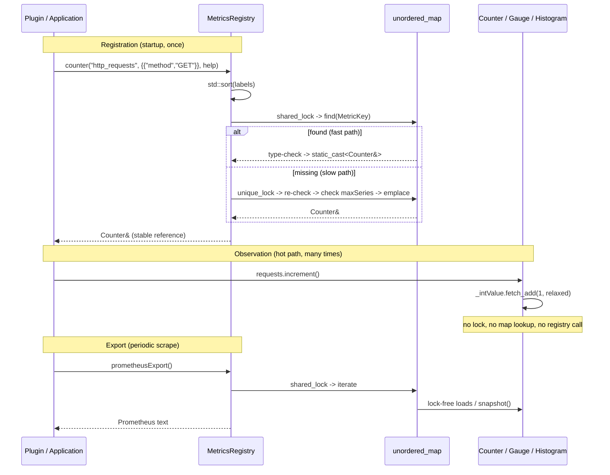

# Iora Metrics -- Architecture & Programmer's Guide

[Back to index](../../README.md)

| | |
|---|---|
| **Version** | 2.1 |
| **Date** | 2026-09-10 |
| **Status** | IMPLEMENTED |
| **Header** | `include/iora/core/metrics.hpp` (927 lines) |
| **Singleton anchor** | `src/core/iora_core.cpp` (`MetricsRegistry::instance`, `MetricBase::~MetricBase`) |
| **Namespace** | `iora::core` |
| **Dependencies** | Standard library only -- `<algorithm>`, `<atomic>`, `<cassert>`, `<cmath>`, `<cstdint>`, `<functional>`, `<iomanip>`, `<limits>`, `<memory>`, `<mutex>`, `<shared_mutex>`, `<sstream>`, `<string>`, `<unordered_map>`, `<unordered_set>`, `<utility>`, `<vector>`. No intra-Iora headers, no external/third-party dependencies. Header-only except the singleton/vtable anchor in `iora_core.so`. |

---

## Revision History

| Version | Date | Changes |
|---|---|---|
| 1.0 | 2026-03-20 | Initial implementation. |
| 1.1 | 2026-03-20 | Fixed histogram bucket indexing (`upper_bound` -> `lower_bound`), added JSON escaping for label values, added label-name sanitization. |
| 2.0 | 2026-09-10 | Migrated from `coding_trackers/docs/iora/metrics.md` to `docs/core/metrics.md`. Fully re-verified every signature, default, ordering, and behavioral claim against `include/iora/core/metrics.hpp` (858 lines) and `tests/core/iora_test_metrics.cpp`. Reformatted to the 12-section template with contiguous numbered sections and an added Memory Ordering Model (section 4). **Drift corrected:** the metadata dependency list now enumerates the 15 standard headers the file actually includes (the prior draft claimed "None / zero deps"); the Prometheus name-sanitization character class is corrected to `[a-zA-Z_:]` / digit-prefix handling as actually coded; the JSON export is documented as emitting metric **names unescaped** (labels are escaped, names are not -- see candidate defect CD-1 in section 12). Added candidate defects: unescaped JSON names (CD-1), unescaped Prometheus `# HELP` text (CD-2), `formatDouble` default-precision truncation of large counter/gauge values (CD-3), and NaN/Inf poisoning of histogram `_sum` (CD-4). None of these are code edits -- they are flagged for human disposition. |
| 2.1 | 2026-09-10 | CP-3 doc-review + code-fix sync: name/HELP escaping, integer `formatDouble`, non-finite guards, `_maxSeries` atomic, export-name header dedup all resolved; value-sample collision + large-fractional precision documented as tracked (2026-09-10-25). |

---

## 1. Executive Summary

### Problem

Iora subsystems accumulated a family of one-off `Stats` structs -- `TimerService` (atomic counters exposed via a custom struct), the transport layer (a wide `Stats` struct duplicated across classes with field-by-field copying), `ObjectPool`, `ThreadPool`, `CircuitBreaker`, and `ConnectionHealth`, each with its own incompatible shape. None shared a common interface, none supported dimensional labels, and none could be exported to Prometheus or JSON. Every new subsystem that needed telemetry invented yet another struct, and there was no single place to scrape the process's metrics from.

### Solution

`metrics.hpp` provides a unified telemetry primitive set in `iora::core`, backed by a central registry singleton:

- **`Counter`** -- a monotonically increasing value with **dual atomic storage**: `std::atomic<std::uint64_t>` for the common integer-increment case (single `fetch_add`) and `std::atomic<double>` for fractional increments (CAS loop).
- **`Gauge`** -- an arbitrary up-and-down value (`std::atomic<double>`); `set` / `increment` / `decrement`.
- **`Histogram`** -- a bucketed distribution with per-bucket `std::atomic<std::uint64_t>` counters, an atomic `_sum` and `_count`, Prometheus `le` (less-than-or-equal) bucket semantics, and a `HistogramSnapshot` with linear-interpolation `percentile` estimation.
- **`MetricsRegistry`** -- a `shared_mutex`-guarded, double-checked-locking registry keyed on `MetricKey{name, sorted labels}`, with built-in `snapshotJson()` and `prometheusExport()` emitters and a `maxSeries` cardinality cap.

### Technical Impact

- **The observation hot path is lock-free and registry-free.** A metric is registered once (returning a stable reference), then observed many times directly on that reference -- no map lookup, no lock. `Counter::increment(std::uint64_t)` is a single `fetch_add`; `Gauge::set` is a single relaxed `store`.
- **Double-checked locking on registration** -- a `shared_lock` fast path after startup, a `unique_lock` slow path only for first creation.
- **Dimensional labels** enable Prometheus-style filtering/aggregation, with label order normalized at registration so identity is order-independent.
- **`maxSeries` (default 10,000)** caps label-cardinality explosion, the primary production metrics failure mode.
- **Cross-plugin unification** -- the registry singleton is anchored in `iora_core.so`, so every `dlopen()`-loaded plugin shares one registry instance.
- **Built-in JSON and Prometheus text exposition** with no external library dependency.

---

## 2. System Architecture

### 2.1 Component relationships

```
iora::core  (metrics.hpp)
|
|-- Labels = std::vector<std::pair<std::string,std::string>>   (sorted at registration)
|-- enum class MetricType { COUNTER, GAUGE, HISTOGRAM }
|-- struct MetricKey { std::string name; Labels labels; operator== }
|-- struct MetricKeyHash                         (boost-style hash_combine over name + each k/v)
|
|-- class MetricBase  (abstract; vtable anchored in iora_core.so)
|     virtual type() / name() / labels() / help()
|   |
|   |-- class Counter : MetricBase
|   |     std::atomic<std::uint64_t> _intValue    (fetch_add path, always lock-free)
|   |     std::atomic<double>        _doubleValue (CAS-loop path, fractional increments)
|   |
|   |-- class Gauge : MetricBase
|   |     std::atomic<double>        _value       (store / CAS loop)
|   |
|   `-- class Histogram : MetricBase
|         std::vector<double>                         _boundaries   (sorted, immutable)
|         std::size_t                                 _numBuckets   (= _boundaries.size() + 1)
|         std::unique_ptr<std::atomic<std::uint64_t>[]> _bucketCounts (exclusive per-bucket counts)
|         std::atomic<double>                         _sum          (CAS loop)
|         std::atomic<std::uint64_t>                  _count        (fetch_add)
|
|-- struct HistogramSnapshot
|     std::vector<std::pair<double,std::uint64_t>> bucketCounts   (cumulative; last le = +Inf)
|     double sum; std::uint64_t count;
|     double percentile(double p) const               (linear interpolation)
|
`-- class MetricsRegistry   (singleton in iora_core.so; also default-constructible)
      mutable std::shared_mutex _mutex
      std::unordered_map<MetricKey, std::unique_ptr<MetricBase>, MetricKeyHash> _metrics
      std::unordered_map<std::string,std::string> _helpTexts    (per family; first-writer-wins)
      std::atomic<std::size_t> _maxSeries = 10000
      counter() / gauge() / histogram()      (get-or-create; double-checked locking)
      snapshotJson() / prometheusExport()    (shared_lock, iterate, lock-free per-metric reads)
      size() / helpText() / setMaxSeries()

IoraService::metrics()  -> returns core::MetricsRegistry::instance()   (iora.hpp:402)

Singleton location:
  IORA_CORE_SHARED or IORA_CORE_BUILDING defined  -> instance() defined out-of-line in iora_core.so
  neither defined                                 -> header-inline function-local static (per-TU)
```

All four metric classes derive from `MetricBase` and are owned by the registry's map as `std::unique_ptr<MetricBase>`. The registry never erases an entry, so references handed back from `counter()`/`gauge()`/`histogram()` stay valid for the process lifetime.

### 2.2 Data flow -- register once, observe many



### 2.3 Threading model

| Thread | Responsibility |
|---|---|
| **Any application/plugin thread** | Observes via the cached reference (`increment` / `set` / `observe`). All observation is lock-free (section 7). |
| **Any thread** | May register (`counter`/`gauge`/`histogram`). Registration takes the registry `shared_mutex` -- a `shared_lock` fast path, a `unique_lock` only to create. Concurrent registration of the same key is de-duplicated by the slow-path re-check. |
| **Scrape/export thread** | Calls `snapshotJson` / `prometheusExport` / `size` / `helpText` under a `shared_lock`; reads each metric via its lock-free accessors. |
| **Startup thread (single)** | Normally calls `setMaxSeries` before concurrent registration begins. `_maxSeries` is a `std::atomic<std::size_t>` (relaxed store/load), so a concurrent call is race-free; setting it at startup is a semantic convention, not a data-race requirement (section 7). |

---

## 3. Component Deep Dive

### 3.1 `Counter` -- dual atomic storage

A `Counter` is monotonically increasing. It has no `reset()` and no decrement by contract; the test `Counter: no reset method exists` documents this deliberately. Use `Gauge::set(0.0)` if reset semantics are required.

**Why two atomics.** The overwhelmingly common increment is an integer (requests, errors, packets). An integer `fetch_add` on `std::atomic<std::uint64_t>` is a single always-lock-free instruction on x86-64 and ARMv8. There is no hardware `fetch_add` for floating point, so fractional increments require a CAS loop. Splitting storage lets the 99% integer case skip the CAS entirely:

```cpp
void increment(std::uint64_t amount = 1)
{
  _intValue.fetch_add(amount, std::memory_order_relaxed);
}

void increment(double amount)
{
  if (!std::isfinite(amount))
  {
    return;  // reject NaN/Inf: one poisoned value would corrupt the accumulator
  }
  assert(amount >= 0.0 && "Counter::increment amount must be non-negative");
  double current = _doubleValue.load(std::memory_order_relaxed);
  double desired;
  do
  {
    desired = current + amount;
  } while (!_doubleValue.compare_exchange_weak(
    current, desired,
    std::memory_order_relaxed,
    std::memory_order_relaxed));
}
```

`value()` merges both components:

```cpp
double value() const
{
  return static_cast<double>(_intValue.load(std::memory_order_relaxed))
       + _doubleValue.load(std::memory_order_relaxed);
}
```

The two loads are independent -- not an atomic pair -- so under concurrent writes the sum may reflect two slightly different instants. This is acceptable by the eventually-consistent metrics contract (section 4). `intValue()` exposes just the integer component.

**Overload ambiguity.** A literal `increment(5)` is ambiguous between the `std::uint64_t` and `double` overloads. Callers must write `increment(std::uint64_t(5))` or `increment(5.0)`; the test suite consistently uses `uint64_t(...)` casts. See section 12.

### 3.2 `Gauge` -- arbitrary value

A single `std::atomic<double> _value`. `set` is an unconditional relaxed `store` (no CAS needed); `increment`/`decrement` use CAS loops, and `decrement` delegates to `increment(-amount)`:

```cpp
void set(double value)
{
  if (!std::isfinite(value)) { return; }      // reject NaN/Inf
  _value.store(value, std::memory_order_relaxed);
}
void increment(double amount = 1.0)
{
  if (!std::isfinite(amount)) { return; }      // reject NaN/Inf
  double current = _value.load(std::memory_order_relaxed);
  double desired;
  do
  {
    desired = current + amount;
  } while (!_value.compare_exchange_weak(
    current, desired,
    std::memory_order_relaxed,
    std::memory_order_relaxed));
}
void decrement(double amount = 1.0) { increment(-amount); }
```

Both `set` and `increment` reject non-finite (`NaN`/`Inf`) inputs without mutation. Unlike `Counter::increment(double)`, `Gauge::increment` does **not** assert non-negativity -- gauges are allowed to go down.

### 3.3 `Histogram` -- `le` bucket semantics

**Boundaries.** Sorted in the constructor and immutable thereafter. An empty `boundaries` argument selects `DEFAULT_BUCKETS` (12 latency-oriented boundaries in seconds: `0.001 .. 10.0`). The bucket array is sized `_boundaries.size() + 1`; the extra slot is the `+Inf` overflow bucket:

```cpp
_boundaries(boundaries.empty() ? DEFAULT_BUCKETS : std::move(boundaries))
// ...
std::sort(_boundaries.begin(), _boundaries.end());
_numBuckets = _boundaries.size() + 1;
_bucketCounts = std::make_unique<std::atomic<std::uint64_t>[]>(_numBuckets);
```

`std::unique_ptr<std::atomic<std::uint64_t>[]>` is used because `std::vector<std::atomic<T>>` is neither copyable nor movable. Each element is explicitly stored `0` (relaxed) in the constructor.

**`observe(value)` -- lower-bound lookup.** Non-finite inputs (`NaN`/`Inf`) are rejected up front (`if (!std::isfinite(value)) return;`) -- a single poisoned value would otherwise permanently corrupt `_sum` and the bucket counts. Otherwise `std::lower_bound` returns the first boundary `>= value`, which yields correct Prometheus `le` semantics (a value exactly on a boundary falls into that boundary's bucket):

```cpp
if (!std::isfinite(value)) { return; }  // reject NaN/Inf
auto it = std::lower_bound(_boundaries.begin(), _boundaries.end(), value);
std::size_t idx = static_cast<std::size_t>(std::distance(_boundaries.begin(), it));
_bucketCounts[idx].fetch_add(1, std::memory_order_relaxed);
// _sum via CAS loop, then _count.fetch_add(1, relaxed)
```

With boundaries `{1.0, 5.0, 10.0}`: `observe(1.0)` -> `idx 0` (le=1.0 bucket); `observe(1.001)` -> `idx 1` (le=5.0); `observe(99.0)` -> `it == end()` -> `idx 3` (the `+Inf` bucket). The tests `boundary-exact values use le semantics` and `observe and bucket distribution` pin this behavior.

**Exclusive internal counts, cumulative on export.** Each `_bucketCounts[i]` counts only the observations that land exactly in bucket `i`. `snapshot()` runs a prefix sum to produce cumulative counts, then appends the `+Inf` bucket and copies `_sum`/`_count`:

```cpp
std::uint64_t cumulative = 0;
for (std::size_t i = 0; i < _boundaries.size(); ++i)
{
  cumulative += _bucketCounts[i].load(std::memory_order_relaxed);
  s.bucketCounts.emplace_back(_boundaries[i], cumulative);
}
cumulative += _bucketCounts[_numBuckets - 1].load(std::memory_order_relaxed);
s.bucketCounts.emplace_back(std::numeric_limits<double>::infinity(), cumulative);
s.sum   = _sum.load(std::memory_order_relaxed);
s.count = _count.load(std::memory_order_relaxed);
```

Computing cumulative counts only on `snapshot()` avoids a cascade of CAS operations across many buckets on every `observe()`.

**`HistogramSnapshot::percentile(p)`.** Estimates the `p`-th percentile (`p` in `0.0 .. 1.0`) by linear interpolation between the cumulative bucket boundaries. It returns `0.0` when `count == 0` or `bucketCounts` is empty. When the target count falls in the `+Inf` bucket it returns the last finite boundary (`prevBound`) -- there is no upper bound to interpolate against. When two adjacent cumulative counts are equal it avoids a divide-by-zero by using a `0.0` fraction.

### 3.4 `MetricsRegistry` -- singleton with double-checked locking

**Singleton anchor.** When compiled with `IORA_CORE_SHARED` or `IORA_CORE_BUILDING`, `instance()` is declared in the header and defined out-of-line in `src/core/iora_core.cpp`:

```cpp
MetricsRegistry& MetricsRegistry::instance()
{
  static MetricsRegistry registry;
  return registry;
}
```

This function-local static (thread-safe initialization guaranteed since C++11) yields one registry shared across all `dlopen()`-loaded plugins. It is available before `IoraService::init()` and during shutdown, and is never null -- the test `MetricsRegistry available before IoraService::init()` confirms. When neither macro is defined (standalone/test builds), a header-inline function-local static is used, giving each binary its own registry. `MetricBase::~MetricBase() = default;` is likewise anchored in `iora_core.cpp` so the vtable is not duplicated across shared objects.

**Get-or-create (double-checked locking).** `counter()` and `gauge()` delegate to the private `getOrCreate<T>`; `histogram()` inlines the same pattern (it needs the extra `buckets` argument):

1. Sort labels; build `MetricKey{name, sortedLabels}`.
2. **Fast path** -- `shared_lock`, `find(key)`. If present, type-check (`throw std::logic_error` on mismatch) and `static_cast<T&>`.
3. **Slow path** -- `unique_lock`, `find(key)` again (another thread may have inserted), same type-check, then the `maxSeries` check (`throw std::runtime_error` if `_metrics.size() >= _maxSeries`), `updateHelpText`, `make_unique<T>`, `emplace`, return the reference.

The tests `same name+labels returns same reference`, `different labels returns different metric`, `label ordering normalization`, `type conflict throws logic_error`, `maxSeries limit`, and `concurrent registration -- no duplicates` cover each branch.

**Help text -- per family, first-writer-wins.** `_helpTexts` is keyed on the bare metric **name** (not the full `MetricKey`), so all label permutations of one metric family share one help string. `updateHelpText` uses `emplace`, which is a no-op if the name is already present, so the first non-empty help wins (test `help text first-writer-wins`).

**No removal.** There is no `remove()`/`unregister()`. References are stable for process lifetime (test `metrics cannot be removed -- references stay valid`).

---

## 4. Memory Ordering Model

Every atomic operation in this header uses `std::memory_order_relaxed`. The design is explicitly **eventually consistent**: a metric observation establishes **no** happens-before relationship with a later readback. This is intentional and correct -- metrics are statistical aggregates, not synchronization primitives, and no code relies on a metric write to publish other memory.

| Site | Atomic | Operation | Ordering (actual) | Notes |
|---|---|---|---|---|
| `Counter::increment(std::uint64_t)` | `_intValue` | `fetch_add` | relaxed | Always lock-free; single instruction on x86-64/ARMv8. |
| `Counter::increment(double)` | `_doubleValue` | CAS loop (`compare_exchange_weak`) | relaxed / relaxed | Success and failure orderings both relaxed. |
| `Counter::value()` | `_intValue`, `_doubleValue` | two `load`s | relaxed | Not an atomic pair; sum may straddle two instants. |
| `Counter::intValue()` | `_intValue` | `load` | relaxed | |
| `Gauge::set` | `_value` | `store` | relaxed | No CAS; unconditional overwrite. |
| `Gauge::increment` / `decrement` | `_value` | CAS loop | relaxed / relaxed | `decrement` = `increment(-amount)`. |
| `Gauge::value` | `_value` | `load` | relaxed | |
| `Histogram::observe` | `_bucketCounts[idx]` | `fetch_add` | relaxed | Bucket chosen by `lower_bound` over immutable `_boundaries` (no atomic). |
| `Histogram::observe` | `_sum` | CAS loop | relaxed / relaxed | |
| `Histogram::observe` | `_count` | `fetch_add` | relaxed | Three independent atomics -- not a consistent triple. |
| `Histogram::snapshot` | buckets, `_sum`, `_count` | `load`s | relaxed | Prefix-summed to cumulative; may straddle concurrent `observe` calls. |
| constructor init of `_bucketCounts[i]` | `_bucketCounts[i]` | `store 0` | relaxed | Before the object is published; no race. |

**Why relaxed is sufficient.** No reader uses a metric value to gate access to other shared state. The only cross-thread ordering the registry needs is on the **map** (who created the entry), and that is provided by the `shared_mutex`, not by the metric atomics. The `static_assert(std::atomic<double>::is_always_lock_free, ...)` guarantees the `double` CAS path never degrades to a hidden mutex (which would defeat the lock-free claim) -- it fires at compile time on a platform such as 32-bit ARM without 64-bit atomics.

**`compare_exchange_weak` vs `strong`.** All CAS loops use `weak`: spurious failures are harmless inside a retry loop, and `weak` is cheaper on LL/SC architectures (ARM/POWER) because it does not force an inner retry.

**Snapshot consistency.** `Histogram::snapshot()` reads buckets, then `_sum`, then `_count`, each relaxed and independent. Under a concurrent `observe()` the resulting triple can be internally inconsistent (e.g. `_count` reflecting an observation whose bucket increment was read a moment earlier as not-yet-applied, or vice versa). Likewise `Counter::value()` sums two atomics that are not read as a pair. Callers must not assert cross-field equalities on a live snapshot (section 12).

---

## 5. Usage Guide

Except where noted, these examples compile against the real API with `using namespace iora::core;`. The exception is the scrape-endpoint example in section 5.4, which is **illustrative pseudocode** -- it uses a fictional HTTP-server handler API, not Iora's actual HTTP server type, to keep the focus on the `prometheusExport()` call.

### 5.1 Basic registration and observation

```cpp
#include <iora/core/metrics.hpp>
#include <string>

using namespace iora::core;

void setupMetrics()
{
  auto& registry = MetricsRegistry::instance();

  // Register once, at startup.
  auto& requests = registry.counter("http_requests",
    {{"method", "GET"}, {"endpoint", "/api/health"}},
    "Total HTTP requests received");

  auto& activeConns = registry.gauge("active_connections",
    {}, "Number of active connections");

  auto& latency = registry.histogram("request_latency_seconds",
    {{"service", "api"}},
    {0.001, 0.005, 0.01, 0.05, 0.1, 0.5, 1.0},
    "Request latency in seconds");

  // Observe (hot path -- no lock, no map lookup).
  requests.increment();                    // integer fetch_add
  requests.increment(std::uint64_t(5));    // explicit cast avoids overload ambiguity
  activeConns.set(42.0);
  activeConns.increment();
  activeConns.decrement();
  latency.observe(0.023);

  std::string json = registry.snapshotJson();
  std::string prom = registry.prometheusExport();
}
```

### 5.2 Dynamic label values (pre-register combinations)

Labels are bound at registration. For a small, known set of dynamic values (e.g. HTTP status codes) pre-register each combination and select the cached reference on the hot path:

```cpp
#include <iora/core/metrics.hpp>

using namespace iora::core;

struct ResponseCounters
{
  Counter& ok;
  Counter& notFound;
  Counter& serverError;

  static ResponseCounters create(MetricsRegistry& r)
  {
    return ResponseCounters{
      r.counter("responses", {{"status", "200"}}),
      r.counter("responses", {{"status", "404"}}),
      r.counter("responses", {{"status", "500"}})};
  }

  void record(int statusCode)
  {
    switch (statusCode)
    {
    case 200: ok.increment();          break;
    case 404: notFound.increment();    break;
    case 500: serverError.increment(); break;
    default:  break;
    }
  }
};
```

Calling `registry.counter(...)` on every observation is safe (idempotent) but takes the `shared_mutex` each time -- avoid it on a hot path.

### 5.3 Plugin integration via `IoraService`

```cpp
#include <iora/iora.hpp>

void recordPluginEvent()
{
  auto& registry = iora::IoraService::instanceRef().metrics();
  auto& events = registry.counter("my_plugin_events");
  events.increment();
}
```

`IoraService::metrics()` returns `MetricsRegistry::instance()`; because the singleton lives in `iora_core.so`, all plugins share one registry.

### 5.4 Prometheus scrape endpoint (illustrative pseudocode)

> **Note:** This snippet does **not** compile as-is. The HTTP-server handler API
> (`server.get(...)`, `res.set_content(...)`) is fictional and stands in for
> whatever real server you wire the endpoint into; only the
> `MetricsRegistry::instance().prometheusExport()` call and its content type are real.

```cpp
#include <iora/core/metrics.hpp>

// server is a stand-in HTTP server; the handler API below is illustrative only.
void registerScrapeEndpoint(/* http server */ auto& server)
{
  server.get("/metrics", [](const auto& /*req*/, auto& res)
  {
    res.set_content(
      iora::core::MetricsRegistry::instance().prometheusExport(),
      "text/plain; version=0.0.4; charset=utf-8");
  });
}
```

### 5.5 Percentile estimation from a histogram

```cpp
#include <iora/core/metrics.hpp>

using namespace iora::core;

void report(Histogram& latency)
{
  HistogramSnapshot snap = latency.snapshot();
  double p50 = snap.percentile(0.5);
  double p99 = snap.percentile(0.99);
  (void)p50; (void)p99; // estimates via linear interpolation between boundaries
}
```

### 5.6 Anti-patterns

- **Do NOT call `registry.counter()`/`gauge()`/`histogram()` on every observation.** Cache the reference once at init; each registry call takes the `shared_mutex`.
- **Do NOT write `increment(5)` on a Counter.** It is ambiguous between the `std::uint64_t` and `double` overloads. Use `increment(std::uint64_t(5))` or `increment(5.0)`.
- **Do NOT expect `Counter::reset()`.** Counters are monotonic by Prometheus convention; use `Gauge::set(0.0)` for reset semantics.
- **Do NOT assert cross-field equality on a live `HistogramSnapshot`** (e.g. `sum` vs `count`, or that cumulative bucket totals equal `count`). The fields are independent relaxed loads (section 4).
- **Prefer calling `setMaxSeries()` during single-threaded startup.** `_maxSeries` is now a `std::atomic<std::size_t>`, so a concurrent call is race-free, but a late change only affects registrations that run after the store lands -- set it at startup so the cap is in force before any series is created.

---

## 6. Call Flow / Sequence Reference

### 6.1 Registration -- first creation (slow path)

| Step | Actor | Action | Synchronization |
|---|---|---|---|
| 1 | Caller | `counter(name, labels, help)` -> `getOrCreate<Counter>(..., COUNTER)` | -- |
| 2 | Registry | `std::sort(labels)`; build `MetricKey` | -- |
| 3 | Registry | `find(key)` -- not found | `shared_lock` acquired & released |
| 4 | Registry | `find(key)` again -- still not found | `unique_lock` acquired |
| 5 | Registry | `if (_metrics.size() >= _maxSeries) throw std::runtime_error` | under `unique_lock` |
| 6 | Registry | `updateHelpText(name, help)` (emplace; first-writer-wins) | under `unique_lock` |
| 7 | Registry | `make_unique<Counter>`, `emplace(key, metric)` | under `unique_lock` |
| 8 | Registry | return `Counter&` | `unique_lock` released |

### 6.2 Registration -- already present (fast path)

| Step | Actor | Action | Synchronization |
|---|---|---|---|
| 1-2 | Registry | sort labels, build key | -- |
| 3 | Registry | `find(key)` -- found | `shared_lock` |
| 4 | Registry | `it->second->type() != expectedType` ? `throw std::logic_error` : `static_cast<T&>` | `shared_lock` |
| 5 | Registry | return reference | `shared_lock` released |

### 6.3 Observation (hot path)

| Call | Steps | Synchronization |
|---|---|---|
| `counter.increment()` | `_intValue.fetch_add(1, relaxed)` | lock-free, single instruction |
| `counter.increment(0.5)` | load `_doubleValue` (relaxed); CAS loop `current+0.5` (weak) | lock-free |
| `gauge.set(42.0)` | `_value.store(42.0, relaxed)` | lock-free, single instruction |
| `gauge.increment(1.0)` | load `_value`; CAS loop (weak) | lock-free |
| `histogram.observe(0.023)` | `lower_bound` -> `idx`; `_bucketCounts[idx].fetch_add(1)`; CAS loop on `_sum`; `_count.fetch_add(1)` | lock-free, three independent atomics |

### 6.4 Export -- `prometheusExport()` (scrape)

| Step | Actor | Action | Synchronization |
|---|---|---|---|
| 1 | Registry | acquire `shared_lock` | `shared_lock` |
| 2 | Registry | iterate `_metrics` (unordered order) | under lock |
| 3 | Registry | per family, emit `# HELP` (if help non-empty, escaped via `escapePrometheusHelp`) and `# TYPE` once, tracked in a local `emittedFamilies` set keyed on the final export name | under lock |
| 4 | Counter | `sName = sanitizeName(name)`; `counterExportName` appends `_total` (no double-suffix); emit `name_total{labels} value` | lock-free read |
| 5 | Gauge | emit `name{labels} value` | lock-free read |
| 6 | Histogram | `snapshot()`; emit `name_bucket{labels,le="..."} count` per cumulative bucket, then `name_sum` and `name_count` | lock-free reads |
| 7 | Registry | return string; release lock | `shared_lock` released |

### 6.5 Failure path -- type conflict

| Step | Actor | Action |
|---|---|---|
| 1 | Caller | `registry.gauge("conflict_metric")` after it was registered as a counter |
| 2 | Registry | fast-path `find` hits; `type() == COUNTER != GAUGE` |
| 3 | Registry | `throw std::logic_error("Metric 'conflict_metric' already registered as a different type")` |

---

## 7. Thread Safety Model

All observation is lock-free; all registry structure changes and whole-registry reads take the `shared_mutex _mutex`.

| Operation | Synchronization | Notes |
|---|---|---|
| `Counter::increment(std::uint64_t)` | Lock-free | `fetch_add`, relaxed. |
| `Counter::increment(double)` | Lock-free | `compare_exchange_weak` CAS loop, both orderings relaxed. Rejects non-finite inputs; asserts `amount >= 0.0` (debug only). |
| `Counter::value()` | Lock-free | Two independent relaxed loads; not an atomic pair. |
| `Counter::intValue()` | Lock-free | Relaxed load. |
| `Gauge::set()` | Lock-free | Relaxed store. Rejects non-finite inputs. |
| `Gauge::increment()` / `decrement()` | Lock-free | CAS loop, relaxed. Rejects non-finite inputs. No non-negativity assert. |
| `Gauge::value()` | Lock-free | Relaxed load. |
| `Histogram::observe()` | Lock-free | Rejects non-finite inputs; `lower_bound` over immutable boundaries + bucket `fetch_add` + `_sum` CAS + `_count` `fetch_add`. Three independent atomics. |
| `Histogram::snapshot()` | Lock-free | Relaxed per-bucket loads -> cumulative; may straddle concurrent `observe()`. |
| `Histogram::boundaries()` | Lock-free (read-only) | Returns reference to the immutable vector. |
| `HistogramSnapshot::percentile()` | N/A | Operates on a caller-owned snapshot; no shared state. |
| `MetricsRegistry::counter/gauge/histogram()` | Blocking | Double-checked locking: `shared_lock` fast path, `unique_lock` slow path with re-check. |
| `MetricsRegistry::snapshotJson()` | Blocking | `shared_lock`; per-metric reads are lock-free. |
| `MetricsRegistry::prometheusExport()` | Blocking | `shared_lock`; per-metric reads are lock-free. |
| `MetricsRegistry::size()` | Blocking | `shared_lock`. |
| `MetricsRegistry::helpText()` | Blocking | `shared_lock`. |
| `MetricsRegistry::setMaxSeries()` | Lock-free | `_maxSeries.store(max, relaxed)` on a `std::atomic<std::size_t>`; registration reads it with a relaxed `load`. Race-free, but best set at single-threaded startup so the cap is in force before any series is created (section 12). |

**Lock inventory.** One `mutable std::shared_mutex _mutex` on the registry. No condition variables. All metric-object state is in `std::atomic` members; metric objects themselves carry no lock.

**Callback / observer dispatch.** None. The registry invokes no user callbacks and dispatches to no observers while holding `_mutex`; export iterates the map under the `shared_lock` and only calls the metrics' own lock-free accessors, so there is no copy-then-invoke concern.

**Lock ordering.** There is a single lock; no ordering hazard exists. The `shared_lock`/`unique_lock` fast/slow transition in `getOrCreate` fully releases the `shared_lock` before acquiring the `unique_lock` (they are in separate nested scopes), so there is no lock upgrade.

---

## 8. Configuration Reference

### 8.1 `MetricsRegistry`

| Parameter | Default | Units / Range | Description |
|---|---|---|---|
| `_maxSeries` | `10000` | count, `> 0` | Maximum number of distinct series (name + sorted labels). Exceeding it on creation throws `std::runtime_error`. Stored as `std::atomic<std::size_t>`; set via `setMaxSeries()` (race-free; set at startup). |

### 8.2 Constructor parameters

| Class | Parameter | Default | Description |
|---|---|---|---|
| `Counter` | `name`, `labels`, `help` | (all required in the ctor) | Via the registry, `labels` defaults to `{}` and `help` to `{}`. |
| `Gauge` | `name`, `labels`, `help` | same | same |
| `Histogram` | `name`, `labels`, `boundaries`, `help` | `boundaries` empty -> `DEFAULT_BUCKETS` | Boundaries sorted internally; `_numBuckets = size + 1`. |

### 8.3 `Histogram::DEFAULT_BUCKETS`

```
{0.001, 0.005, 0.01, 0.025, 0.05, 0.1, 0.25, 0.5, 1.0, 2.5, 5.0, 10.0}
```

Twelve boundaries tuned for latency in seconds. Override with a domain-appropriate set (byte sizes, queue depths, etc.) by passing a non-empty `boundaries` vector.

### 8.4 Singleton build macros

| Macro | Effect |
|---|---|
| `IORA_CORE_SHARED` | `instance()` declared in header, defined in `iora_core.so`. |
| `IORA_CORE_BUILDING` | Same; used when compiling `iora_core.so` itself. |
| neither | Header-inline function-local static; each binary/TU sees its own registry (test/standalone only). |

---

## 9. Export Formats Reference

Both exporters run under a `shared_lock` and iterate `_metrics` in the unordered map's arbitrary order. Shared numeric formatting is `formatDouble`: `+Inf` / `-Inf` / `NaN` become those literal strings; an **integer-valued** double below `1e16` (`std::floor(v) == v && std::fabs(v) < 1e16`) is printed exactly via `std::fixed << std::setprecision(0)` -- so large integer counters/gauges (e.g. `16000000`) render as `16000000`, not `1.6e+07`. All other (fractional) values go through `std::ostringstream` at its default precision (6 significant digits), which remains lossy for large fractional magnitudes -- see the `formatDouble` limitation (CD-3) in section 12.

### 9.1 JSON -- `snapshotJson()`

Output shape (metrics grouped by kind):

```json
{
  "counters": [
    {"name": "http_requests", "labels": {"method": "GET"}, "value": 42}
  ],
  "gauges": [
    {"name": "active_connections", "labels": {}, "value": 5}
  ],
  "histograms": [
    {
      "name": "latency",
      "labels": {},
      "buckets": [{"le": "0.01", "count": 3}, {"le": "+Inf", "count": 10}],
      "sum": 1.23,
      "count": 10
    }
  ]
}
```

- Three arrays (`counters`, `gauges`, `histograms`) are always present (the test `JSON export` asserts all three keys).
- **Label keys and values** are escaped via `escapeJson` (`\\`, `\"`, `\n`, `\r`, `\t`).
- **Metric names are escaped** via `escapeJson` (`<< escapeJson(c.name())` for counters, and likewise for gauges and histograms). A name containing `"`, `\`, or a control character no longer produces malformed or injectable JSON (CD-1, section 12, resolved).
- Histogram `le` values are strings; `+Inf` is the string `"+Inf"`.

### 9.2 Prometheus text exposition -- `prometheusExport()`

```
# HELP http_requests_total Total HTTP requests received
# TYPE http_requests_total counter
http_requests_total{method="GET",endpoint="/api/health"} 42
# HELP active_connections Number of active connections
# TYPE active_connections gauge
active_connections 5
# HELP latency Request latency in seconds
# TYPE latency histogram
latency_bucket{le="0.1"} 3
latency_bucket{le="+Inf"} 10
latency_sum 1.23
latency_count 10
```

- **Metric names** are sanitized by `sanitizeName` to the character class `[a-zA-Z_:]` for letters/underscore/colon, digits allowed after position 0 (a leading digit is prefixed with `_`); every other character becomes `_`.
- **Label names** are sanitized by `sanitizeLabelName` to `[a-zA-Z_]` plus digits after position 0 (no colon, unlike metric names).
- **Counter names** are auto-suffixed with `_total` by `counterExportName`, skipping the suffix if the sanitized name already ends in `_total` (tests `counter with _total suffix`, `no double _total suffix`).
- **Label values** are escaped by `escapeLabel` (`\\`, `\"`, `\n` only -- no `\r`/`\t`, per the Prometheus text-format spec) (test `label escaping`).
- **Histogram** emits `_bucket{...,le="..."}` per cumulative bucket (including `le="+Inf"`), then `_sum` and `_count`.
- `# HELP` and `# TYPE` are emitted once per family via a local `emittedFamilies` set **keyed on the final export name** (the counter `_total`-suffixed name, or the sanitized name otherwise). Keying on the export name -- not the raw name -- means two raw names that sanitize to the same export name no longer emit duplicate `# HELP`/`# TYPE` lines (which Prometheus rejects). `# HELP` is emitted only if the family's help text is non-empty.
- **`# HELP` text is escaped** via `escapePrometheusHelp`, which escapes backslash (`\` -> `\\`) and newline (-> `\n`) but **not** double quotes, per the Prometheus text-format spec for HELP (this is why `escapeLabel`, which also escapes quotes, is not reused here). A help string with a newline or backslash no longer breaks the single-line `# HELP` record (CD-2, section 12, resolved).
- No timestamps are emitted (Prometheus assigns scrape time).

---

## 10. API Reference

```cpp
namespace iora
{
namespace core
{

using Labels = std::vector<std::pair<std::string, std::string>>;

enum class MetricType
{
  COUNTER,
  GAUGE,
  HISTOGRAM
};

struct MetricKey
{
  std::string name;
  Labels labels;                                   // sorted by key at registration
  bool operator==(const MetricKey& other) const;
};

struct MetricKeyHash
{
  std::size_t operator()(const MetricKey& key) const; // boost-style hash_combine
};

class MetricBase
{
public:
  virtual ~MetricBase();                           // vtable anchor in iora_core.so
  virtual MetricType type() const = 0;
  virtual const std::string& name() const = 0;
  virtual const Labels& labels() const = 0;
  virtual const std::string& help() const = 0;
};

class Counter : public MetricBase
{
public:
  Counter(std::string name, Labels labels, std::string help);

  MetricType type() const override;                // COUNTER
  const std::string& name() const override;
  const Labels& labels() const override;
  const std::string& help() const override;

  void increment(std::uint64_t amount = 1);        // fetch_add, always lock-free
  void increment(double amount);                   // CAS loop; rejects non-finite; asserts amount >= 0.0
  double value() const;                            // intValue + doubleValue
  std::uint64_t intValue() const;                  // integer component only
};

class Gauge : public MetricBase
{
public:
  Gauge(std::string name, Labels labels, std::string help);

  MetricType type() const override;                // GAUGE
  const std::string& name() const override;
  const Labels& labels() const override;
  const std::string& help() const override;

  void set(double value);                          // relaxed store; rejects non-finite
  void increment(double amount = 1.0);             // CAS loop; rejects non-finite
  void decrement(double amount = 1.0);             // increment(-amount)
  double value() const;                            // relaxed load
};

struct HistogramSnapshot
{
  std::vector<std::pair<double, std::uint64_t>> bucketCounts; // cumulative; last le = +Inf
  double sum = 0.0;
  std::uint64_t count = 0;

  double percentile(double p) const;               // linear interpolation, p in [0,1]
};

class Histogram : public MetricBase
{
public:
  static inline const std::vector<double> DEFAULT_BUCKETS = {
    0.001, 0.005, 0.01, 0.025, 0.05, 0.1, 0.25, 0.5, 1.0, 2.5, 5.0, 10.0
  };

  Histogram(std::string name, Labels labels, std::vector<double> boundaries,
            std::string help);

  MetricType type() const override;                // HISTOGRAM
  const std::string& name() const override;
  const Labels& labels() const override;
  const std::string& help() const override;

  void observe(double value);                      // rejects non-finite; lower_bound bucket + atomics
  HistogramSnapshot snapshot() const;              // cumulative counts, sum, count
  const std::vector<double>& boundaries() const;
};

class MetricsRegistry
{
public:
  MetricsRegistry() = default;                     // public: non-singleton instances allowed
  ~MetricsRegistry() = default;
  MetricsRegistry(const MetricsRegistry&) = delete;
  MetricsRegistry& operator=(const MetricsRegistry&) = delete;

  static MetricsRegistry& instance();              // singleton in iora_core.so

  void setMaxSeries(std::size_t max);              // default 10000; atomic store (race-free)

  Counter& counter(const std::string& name, Labels labels = {},
                   const std::string& help = {});
  Gauge& gauge(const std::string& name, Labels labels = {},
               const std::string& help = {});
  Histogram& histogram(const std::string& name, Labels labels = {},
                       std::vector<double> buckets = {},
                       const std::string& help = {});

  std::string snapshotJson() const;                // JSON export
  std::string prometheusExport() const;            // Prometheus text exposition
  std::size_t size() const;                        // number of registered series
  std::string helpText(const std::string& name) const;
};

} // namespace core
} // namespace iora
```

`IoraService::metrics()` (in `iora/iora.hpp`) returns `core::MetricsRegistry&` by forwarding to `core::MetricsRegistry::instance()`.

---

## 11. Design Decisions

| ID | Decision | Rationale |
|---|---|---|
| D-1 | Header-only except the singleton/vtable anchor. | Follows Iora convention. Only `MetricsRegistry::instance()` and `MetricBase::~MetricBase()` live in `iora_core.cpp`; all logic is inline. |
| D-2 | Dual Counter storage (`uint64_t` + `double`). | Integer `fetch_add` is always lock-free and skips CAS for the 99% integer case; a separate `double` atomic handles fractional increments. |
| D-3 | `memory_order_relaxed` everywhere. | Metrics are eventually-consistent aggregates, not synchronization primitives; no reader uses a metric to publish other memory. Avoids fences on ARM/POWER. |
| D-4 | `static_assert(std::atomic<double>::is_always_lock_free)`. | Fails the build on platforms where `atomic<double>` would silently use a mutex, which would defeat the lock-free observation guarantee. |
| D-5 | `compare_exchange_weak` (not `strong`). | Spurious failures are harmless in a retry loop; `weak` is cheaper on LL/SC architectures. |
| D-6 | `lower_bound` for histogram buckets. | Correct Prometheus `le` (<=) semantics: exact-boundary values land in that boundary's bucket. `upper_bound` would place them one bucket too high. |
| D-7 | `std::unique_ptr<std::atomic<uint64_t>[]>` for bucket counts. | `std::vector<std::atomic<T>>` is neither copyable nor movable; a raw atomic array behind a `unique_ptr` sidesteps that. |
| D-8 | Exclusive per-bucket counts; cumulative only on `snapshot()`. | Avoids cascading CAS across all buckets on every `observe()`; the prefix sum is paid once per scrape. |
| D-9 | Labels sorted at registration. | Makes series identity independent of label argument order (`{b,a}` == `{a,b}`). |
| D-10 | Double-checked locking on registration. | Amortizes to a `shared_lock` after startup; the `unique_lock` slow path re-checks to de-duplicate concurrent first-creates. |
| D-11 | Help text per family, first-writer-wins. | One family may be registered with many label sets; the first non-empty help is authoritative, subsequent ones are ignored silently. |
| D-12 | `maxSeries` cap (default 10,000), thrown as `std::runtime_error`. | Bounds label-cardinality explosion, the top production metrics failure mode, and fails loudly rather than silently growing. |
| D-13 | No metric removal. | Prometheus convention; references stay stable for process lifetime so callers can cache `Counter&` safely. |
| D-14 | Singleton anchored in `iora_core.so`. | A function-local static in one shared object unifies metrics across all `dlopen()`-loaded plugins. |
| D-15 | `snapshotJson()`/`prometheusExport()` return `std::string`, no `parsers::Json`. | Keeps the header self-contained with zero intra-Iora and zero external dependencies. |
| D-16 | `MetricKeyHash` uses boost-style `hash_combine`. | `h ^= hash(x) + 0x9e3779b9 + (h<<6) + (h>>2)` gives good compound-key distribution without pulling in Boost. |

---

## 12. Known Limitations

The candidate defects raised in the 2.0 draft (CD-1 through CD-4) were **all fixed this session** and are recorded below as RESOLVED, with the remaining partial/tracked edges noted.

- **CD-1 (RESOLVED) -- `snapshotJson()` now escapes metric names.** Counter, gauge, and histogram name emission now route through `escapeJson(...)` (`metrics.hpp:525`/`534`/`544`), matching the label-key/value escaping. A name containing `"`, `\`, or a control character can no longer produce malformed or injectable JSON.
- **CD-2 (RESOLVED) -- `prometheusExport()` now escapes `# HELP` text.** Help text is emitted via the new `escapePrometheusHelp` helper (`metrics.hpp:610`, helper `:801`), which escapes backslash (`\` -> `\\`) and newline (-> `\n`) but deliberately **not** double quotes, per the Prometheus text-format spec for HELP records (`escapeLabel` is not reused because it also escapes quotes). A help string with a newline or backslash no longer breaks the single-line `# HELP` record.
- **CD-3 (PARTIAL -- integer values fixed; large fractional values still lossy).** `formatDouble` (`metrics.hpp:732-751`) now prints integer-valued doubles exactly: when `std::floor(v) == v && std::fabs(v) < 1e16` it uses `std::fixed << std::setprecision(0)`, so large integer counters/gauges (e.g. `16000000`) render as `16000000` rather than `1.6e+07` -- integer fidelity is preserved up to `1e16`. **Remaining limitation:** large *fractional* values still go through the default-precision (6-sig-fig) path and are exported lossily / in scientific form. Tracked in backlog **2026-09-10-25**.
- **CD-4 (RESOLVED) -- non-finite inputs are now rejected.** `Counter::increment(double)` (`metrics.hpp:132`), `Gauge::set` (`:197`), `Gauge::increment` (`:208`), and `Histogram::observe` (`:329`) all begin with `if (!std::isfinite(x)) { return; }`, so a single `NaN`/`Inf` can no longer permanently poison a counter's `_doubleValue`, a gauge's `_value`, or a histogram's `_sum`/buckets.
- **Prometheus export: value-sample-level name collision (tracked, `MET-EXPORT-COLLISION-SAMPLES`).** The `# HELP`/`# TYPE` *header* dedup (CD-5) is fixed -- it is keyed on the final export name, so two raw names sanitizing alike no longer duplicate headers. However, the per-metric **value sample lines** are still emitted per registered series (counters under their `_total` export name, gauges/histograms under the sanitized name), so two raw names that sanitize to the same export name, or a counter-vs-gauge export-name collision, still emit duplicate series lines -- which Prometheus rejects on scrape. Tracked in backlog **2026-09-10-25** (finding `MET-EXPORT-COLLISION-SAMPLES`).
- **Tracked DRY cleanups.** Several behavior-preserving de-duplication opportunities (the histogram vs `getOrCreate` registration duplication, a shared CAS-add helper for the `double` accumulators, and the `sanitizeName`/`sanitizeLabelName` near-duplication) are tracked in backlog **2026-09-10-25**; they are not defects and do not affect exported values.
- **Histogram snapshot is not globally consistent.** Bucket counts, `_sum`, and `_count` are independent relaxed loads; a concurrent `observe()` can leave them mutually inconsistent (and the cumulative bucket total need not equal `count`). By design (section 4) -- do not assert cross-field equalities on a live snapshot.
- **`Counter::value()` sums two independent atomics.** The `uint64_t` and `double` loads are not an atomic pair; under heavy concurrent writes the sum may straddle two instants. By design.
- **`Counter::value()` beyond 2^53.** Because `value()` returns `double`, integer counts above 2^53 (~9.0e15) can no longer be represented exactly in the `double` itself -- this is a representation limit independent of `formatDouble` (which now prints integer-valued doubles exactly up to `1e16`). `intValue()` returns the exact `std::uint64_t`. Practically unreachable at realistic rates, but noted.
- **`increment(5)` is ambiguous on `Counter`.** Matches both the `std::uint64_t` and `double` overloads. Callers must cast: `increment(std::uint64_t(5))` or `increment(5.0)`. Not fixable without changing the overload set.
- **`setMaxSeries()` takes effect only for later registrations.** `_maxSeries` is now a `std::atomic<std::size_t>` (relaxed store/load), so a concurrent call is race-free -- the earlier data-race concern is resolved. Semantically, though, a late change only bounds series created after the store is observed; set it during single-threaded startup so the cap is in force before any series is created.
- **No metric removal.** There is no `remove()`/`unregister()`. Stale series (obsolete label combinations) accumulate for the process lifetime and count against `maxSeries`; staleness is the scraper's concern.
- **`percentile()` in the `+Inf` bucket returns the last finite boundary.** There is no upper bound to interpolate against; the estimate saturates at the highest configured boundary. With `count == 0` or no buckets it returns `0.0`.
- **Header-inline singleton fallback does not unify across shared objects.** When neither `IORA_CORE_SHARED` nor `IORA_CORE_BUILDING` is defined, each binary/TU gets its own registry; only the `iora_core.so`-anchored `instance()` unifies metrics across plugins. Intended for test/standalone builds.
- **32-bit platforms without lock-free `atomic<double>` are unsupported.** The `static_assert` fails the build; the header's comment suggests a fixed-point `std::atomic<uint64_t>` encoding, which is not implemented.
