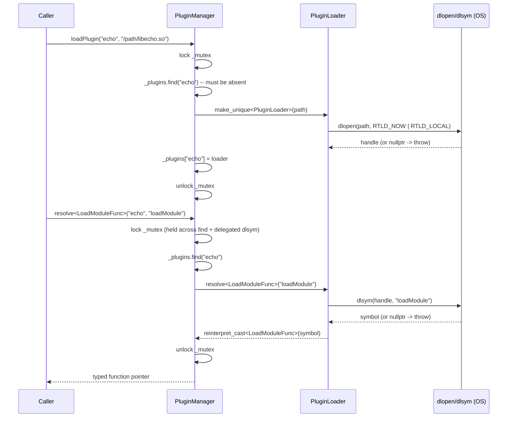

# Iora PluginLoader / PluginManager — Architecture & Programmer's Guide

[Back to index](../../README.md)

| | |
|---|---|
| **Version** | 1.1 |
| **Date** | 2026-09-10 |
| **Status** | IMPLEMENTED |
| **Header** | `include/iora/core/plugin_loader.hpp` |
| **Namespace** | `iora::core` |
| **Dependencies** | `<dlfcn.h>` (POSIX) / `<windows.h>` (Win32) for dynamic loading; `<mutex>`, `<map>`, `<memory>`, `<string>`, `<stdexcept>` |

## Revision History

| Version | Date | Changes |
|---------|------|---------|
| 1.0 | 2026-09-09 | Initial Architecture & Programmer's Guide for the pre-existing, already-implemented `PluginLoader`/`PluginManager` pair. |
| 1.1 | 2026-09-10 | Re-synced to hardened header (commit e8e1fa9): `PluginManager::resolve()` now locks `_mutex` across find + delegated `dlsym`; `PluginLoader` copy operations `= delete` (non-copyable, non-movable); `_symbolCache` removed; unreachable constructor check removed. Added re-entrancy caller contract. |

---

## 1. Executive Summary

### Problem

Iora's plugin architecture (see `CLAUDE.md`: "Plugin-based architecture with dynamic loading") needs a portable way to:

1. Open a shared object (`.so` on POSIX, `.dll` on Windows) at runtime and resolve a well-known C entry symbol out of it (`loadModule`, see `IORA_DECLARE_PLUGIN` in `iora.hpp`).
2. Track a *set* of such libraries by a caller-chosen name, so a host component can ask "is plugin X loaded?", "resolve symbol Y out of plugin X", or "unload plugin X" without re-implementing `dlopen`/`dlsym`/`dlclose` bookkeeping at every call site.

Hand-rolling `dlopen`/`dlsym`/`dlclose` directly at each call site is exactly the kind of duplicated, easy-to-leak pattern this header exists to remove: a raw `void*` handle with no RAII around it silently leaks on every early-return or thrown exception between `dlopen` and the matching `dlclose`.

### Solution

Two small, tightly-scoped classes:

- **`PluginLoader`** — RAII wrapper around a *single* dynamic-library handle. Opens the library in the constructor (throws on failure), closes it in the destructor, and exposes a templated `resolve<T>()` for pulling a typed symbol (function pointer or object pointer) out of the library.
- **`PluginManager`** — a name-keyed registry of `PluginLoader` instances (`std::map<std::string, std::unique_ptr<PluginLoader>>`), guarded by a single `std::mutex`. Gives `loadPlugin`/`unloadPlugin`/`resolve`/`isLoaded`/`unloadAll` as one-call operations instead of manual map bookkeeping around a raw `PluginLoader`.

`iora::IoraService` (`include/iora/iora.hpp`) is the sole in-tree consumer: it **privately inherits** `PluginManager` and layers the actual plugin lifecycle (host-side object teardown ordering, in-flight-call draining before `dlclose`) on top of the primitives this header provides — see [docs/iora_service.md](../iora_service.md) for that layer. This document covers only the `PluginLoader`/`PluginManager` primitives themselves.

### Technical Impact

- RAII: the dynamic-library handle cannot outlive its `PluginLoader`/`PluginManager` entry — `dlclose`/`FreeLibrary` runs on destruction (normal or exception-driven unwind) or on `std::map::erase`.
- `O(log n)` lookup by plugin name (`std::map`, not hashed) for `loadPlugin`/`unloadPlugin`/`resolve`/`isLoaded`.
- Cross-platform behind a single `#ifdef _WIN32` split; the public API (`resolve<T>`, `isValid`, `loadPlugin`, `unloadPlugin`, `isLoaded`, `unloadAll`) is identical on both platforms.
- Zero external dependencies beyond the platform's own dynamic-loading API.

---

## 2. System Architecture

### Component Relationships

```
PluginManager
├── std::map<std::string, std::unique_ptr<PluginLoader>> _plugins   (name -> owned loader)
├── mutable std::mutex _mutex                                        (guards _plugins)
└── (owns, 0..N)
    PluginLoader                                                     (one per loaded name)
    └── void* _handle                                                (dlopen handle / HMODULE)

Consumer (in-tree):
IoraService : private core::PluginManager                            (see docs/iora_service.md)
```

### Data Flow: Load a Plugin and Resolve Its Entry Symbol



### Threading Model

| Thread | Responsibility |
|---|---|
| Any thread calling `loadPlugin`, `unloadPlugin`, `isLoaded`, `unloadAll`, `resolve` | Serialized against every other such call via `PluginManager::_mutex`. `resolve<T>()` now holds `_mutex` across both the `_plugins` lookup and the delegated `PluginLoader::resolve` (`dlsym`). |
| Any thread that has obtained a raw symbol (function pointer) via `resolve<T>()` and invokes it | Entirely outside this header's scope. Nothing in `PluginLoader`/`PluginManager` prevents `unloadPlugin` from `dlclose`-ing the library concurrently with an in-flight call through a previously resolved pointer; that coordination is built by the consumer — see `IoraService`'s drain-gate / `SafeApiFunction` model in [docs/iora_service.md](../iora_service.md). |

---

## 3. Component Deep Dive

### 3.1 `PluginLoader`

**Construction.** The constructor takes the library path and opens it immediately:

- Windows: `LoadLibraryA(path.c_str())`; throws `std::runtime_error` with `GetLastError()` on failure.
- POSIX: `dlopen(path.c_str(), RTLD_NOW | RTLD_LOCAL)`; throws `std::runtime_error` with `dlerror()` on failure.

`RTLD_NOW | RTLD_LOCAL` is a deliberate choice documented in the header: `RTLD_LOCAL` gives each plugin symbol isolation from every other plugin, while shared state (`Logger`, `IoraService`, `JsonFileStore`, etc.) is unified across plugins because every plugin links against the same `libiora-core.so` at build time — the isolation is between *plugins*, not between a plugin and the core library it links.

**Destruction.** `~PluginLoader()` calls `FreeLibrary`/`dlclose` on `_handle` if non-null. No return-value checking (a `dlclose` failure is not surfaced) — consistent with destructors not throwing.

**`resolve<T>(name)`.** Requires `isValid()` (throws `std::runtime_error` otherwise). Looks up the symbol via `GetProcAddress`/`dlsym`, throws `std::runtime_error` if not found, otherwise returns `reinterpret_cast<T>(symbol)`. There is no symbol caching — every call performs a fresh `dlsym`/`GetProcAddress`, including a repeated lookup of the same name.

**`isValid()`.** Returns `_handle != nullptr`. `const`, no locking (see §6 — `PluginLoader` has no synchronization of its own).

**Copy/move semantics.** `PluginLoader` owns a raw `_handle` that is closed exactly once in the destructor, so it is deliberately non-copyable. The copy constructor and copy assignment operator are `= delete`. Because the class has a user-declared destructor, the compiler does not implicitly declare move operations either — and with copy deleted, none is generated. The net effect is that `PluginLoader` is **non-copyable and non-movable**: it can only be constructed in place and is held exclusively via `std::unique_ptr` inside `PluginManager`. A double-`dlclose` from a shallow copy is therefore impossible to write — the copy fails to compile.

### 3.2 `PluginManager`

**State.** `std::map<std::string, std::unique_ptr<PluginLoader>> _plugins` (ordered, unique ownership) and `mutable std::mutex _mutex` protecting it.

**`loadPlugin(name, path)`.** Locks `_mutex`, throws `std::runtime_error("Plugin already loaded: " + name)` if `name` is already a key, otherwise constructs a new `PluginLoader` and assigns it into `_plugins[name]`. Since C++17, the right-hand operand of an assignment (`make_unique<PluginLoader>(path)`) is sequenced *before* evaluation of the left-hand operand (`_plugins[name]`); if the `PluginLoader` constructor throws (bad path, `dlopen`/`LoadLibraryA` failure), the exception propagates out of `loadPlugin` and no entry is left behind in `_plugins` for that name.

**`unloadPlugin(name)`.** Locks `_mutex`, erases the entry if present. **Idempotent / non-throwing when the name is absent** — unlike `loadPlugin`, calling `unloadPlugin` for a name that was never loaded (or already unloaded) is a silent no-op, not an error. Erasing the map entry destroys the owned `PluginLoader`, which runs `dlclose`/`FreeLibrary` synchronously, under the lock.

**`resolve<T>(name, symbol)`.** Locks `_mutex`, looks up `name` in `_plugins` (`std::runtime_error("Plugin not loaded: " + name)` if absent), then forwards to `PluginLoader::resolve<T>(symbol)` — **all under the same lock.** Every public method that touches `_plugins` (`loadPlugin`, `unloadPlugin`, `isLoaded`, `unloadAll`, and now `resolve`) is serialized on `_mutex`, so there is no unsynchronized read/write of the `std::map`. Holding the lock across the delegated `dlsym` additionally prevents a concurrent `unloadPlugin`/`unloadAll` from destroying the `PluginLoader` (and `dlclose`-ing the library) mid-resolve — closing the earlier unload-mid-resolve use-after-free. `_mutex` is a leaf lock: no `PluginManager` method acquires any other lock while holding it, so the only possible nesting is `<outer>->_mutex`. (A raw pointer **already returned** from `resolve<T>()` and invoked later is a separate matter — see the drain note in §6.)

**`isLoaded(name)`.** `const`, locks `_mutex` (mutable), returns whether `name` is a key in `_plugins`.

**`unloadAll()`.** Locks `_mutex`, calls `_plugins.clear()`. Every owned `PluginLoader` is destroyed (and thus every library `dlclose`d) while the lock is held, in `std::map`'s iteration order (ascending by name), with no ordering guarantee beyond that and no coordination with in-flight calls into any of the libraries being closed.

---

## 4. Usage Guide

### Loading a Plugin and Resolving Its Entry Point

```cpp
#include <iora/core/plugin_loader.hpp>

using namespace iora::core;

PluginManager manager;

// Matches the convention IORA_DECLARE_PLUGIN() generates in iora.hpp:
// extern "C" iora::IoraPlugin *loadModule(iora::IoraService *service)
using LoadModuleFunc = void *(*)(void *);

// loadPlugin throws on failure, so if it returns the plugin is loaded --
// no isLoaded() re-check is needed here.
manager.loadPlugin("echo", "/usr/local/karoo/lib/libecho_plugin.so");

auto loadModule = manager.resolve<LoadModuleFunc>("echo", "loadModule");
void *pluginInstance = loadModule(nullptr /* service pointer in real use */);
```

### Using `PluginLoader` Directly (Single Library, No Registry)

```cpp
#include <iora/core/plugin_loader.hpp>

using namespace iora::core;

try
{
  PluginLoader loader("/usr/local/karoo/lib/libecho_plugin.so");
  using LoadModuleFunc = void *(*)(void *);
  auto loadModule = loader.resolve<LoadModuleFunc>("loadModule");
  void *pluginInstance = loadModule(nullptr);
}
catch (const std::runtime_error &e)
{
  // Failed to open the library or resolve the symbol.
}
// loader goes out of scope here -- dlclose runs automatically.
```

### Checking Load State Before Use

```cpp
if (!manager.isLoaded("echo"))
{
  manager.loadPlugin("echo", pathToLibrary);
}
```

### Unloading a Single Plugin

```cpp
manager.unloadPlugin("echo"); // no-op if "echo" was never loaded
```

### Unloading Everything at Shutdown

```cpp
manager.unloadAll(); // dlcloses every currently-loaded plugin
```

### Anti-Patterns

- **Do NOT keep calling a function pointer obtained from `resolve<T>()` after the owning plugin has been unloaded.** `resolve<T>()` itself is now serialized on `_mutex`, but a raw pointer it *already returned* is not tracked once it leaves the call: `unloadPlugin`/`unloadAll` `dlclose` the library synchronously, and nothing in this header waits for in-flight calls through previously resolved pointers. If you need that guarantee, use `IoraService`'s higher-level module lifecycle (drain gate / `SafeApiFunction`; see [docs/iora_service.md](../iora_service.md)), not `PluginManager` directly.
- **Do NOT assume `resolve<T>()` caches the resolved symbol.** There is no symbol cache; every call re-invokes `dlsym`/`GetProcAddress`.
- **Do NOT call back into `PluginManager` from a plugin's static/global destructor or `atexit` handler.** `unloadPlugin`/`unloadAll` run `dlclose` under the non-recursive `_mutex`, so any `resolve`/`loadPlugin`/`unloadPlugin`/`isLoaded` re-entry from that destructor self-deadlocks (§6).
- **Do NOT call `loadPlugin` twice for the same name expecting a reload.** The second call throws `std::runtime_error("Plugin already loaded: " + name)`; call `unloadPlugin` first.

---

## 5. Call Flow / Sequence Reference

### Successful Load

| Step | Actor | Action |
|---|---|---|
| 1 | Caller | `manager.loadPlugin("echo", path)` |
| 2 | `PluginManager` | `std::lock_guard<std::mutex> lock(_mutex)` |
| 3 | `PluginManager` | `_plugins.find("echo")` — not found, proceed |
| 4 | `PluginManager` | `std::make_unique<PluginLoader>(path)` |
| 5 | `PluginLoader` ctor | `dlopen(path, RTLD_NOW \| RTLD_LOCAL)` (or `LoadLibraryA` on Windows) |
| 6 | `PluginManager` | `_plugins["echo"] = <loader>` |
| 7 | `PluginManager` | lock released (end of scope) |

### Load Failure (Bad Path / Missing Library)

| Step | Actor | Action |
|---|---|---|
| 1 | Caller | `manager.loadPlugin("echo", badPath)` |
| 2 | `PluginManager` | lock acquired, name not found, proceeds to construct |
| 3 | `PluginLoader` ctor | `dlopen` returns `nullptr`; constructor throws `std::runtime_error` |
| 4 | `PluginManager` | exception propagates out of `loadPlugin`; `lock_guard` releases `_mutex` during unwind; `_plugins["echo"]` was never assigned (C++17 evaluation order — see §3.2) |
| 5 | Caller | catches `std::runtime_error`, `isLoaded("echo")` is `false` |

### Unload

| Step | Actor | Action |
|---|---|---|
| 1 | Caller | `manager.unloadPlugin("echo")` |
| 2 | `PluginManager` | `std::lock_guard<std::mutex> lock(_mutex)` |
| 3 | `PluginManager` | `_plugins.find("echo")` |
| 4a | `PluginManager` | found: `_plugins.erase(it)` → `~PluginLoader()` → `dlclose(_handle)` |
| 4b | `PluginManager` | not found: no-op, no exception |
| 5 | `PluginManager` | lock released |

---

## 6. Thread Safety Model

| Operation | Synchronization | Notes |
|---|---|---|
| `PluginLoader::PluginLoader(path)` | None | Not intended for concurrent construction of the *same* object (construction always happens before any other thread can see the instance). |
| `PluginLoader::~PluginLoader()` | None | Caller must ensure no concurrent `resolve()` call is in flight when the object is destroyed; nothing in the class enforces this. |
| `PluginLoader::resolve<T>()` | None (of its own) | No internal locking; `dlsym`/`GetProcAddress` are themselves thread-safe. In practice this is always reached through `PluginManager::resolve<T>()`, which holds `_mutex` across the delegated call. There is no per-loader mutable state to race (no symbol cache). |
| `PluginLoader::isValid()` | None | Reads `_handle` without synchronization. |
| `PluginManager::loadPlugin` | `std::lock_guard<std::mutex>(_mutex)` | Serialized against every other locking method. |
| `PluginManager::unloadPlugin` | `std::lock_guard<std::mutex>(_mutex)` | Serialized; erase runs (and thus `dlclose` runs) under the lock. |
| `PluginManager::isLoaded` | `std::lock_guard<std::mutex>(_mutex)` | `const`, uses `mutable _mutex`. |
| `PluginManager::unloadAll` | `std::lock_guard<std::mutex>(_mutex)` | `_plugins.clear()` under the lock — every `PluginLoader` destroyed while holding `_mutex`. |
| `PluginManager::resolve<T>()` | `std::lock_guard<std::mutex>(_mutex)` | Holds `_mutex` across **both** `_plugins.find(name)` and the delegated `it->second->resolve<T>(...)` (`dlsym`). Serialized against every other locking method, so the `std::map` is never read while another thread mutates it, and `unloadPlugin`/`unloadAll` cannot destroy the `PluginLoader` mid-`dlsym`. `_mutex` is a leaf lock (nesting only ever `<outer>->_mutex`). This closes the former unsynchronized-map race and the unload-mid-resolve use-after-free. |
| dlclose-during-in-flight-call ordering | **Not provided by this header** | `PluginManager` has no notion of "a call is currently executing inside this plugin" and performs no drain/wait before `dlclose` in `unloadPlugin`/`unloadAll`. A caller that resolves a function pointer and later unloads the same plugin from another thread can `dlclose` the library while that pointer is still being called. `IoraService` builds exactly this guarantee on top of `PluginManager` (host-side teardown before `dlclose`, drain of in-flight `callExportedApi` invocations via a per-module gate / `SafeApiFunction`) — see [docs/iora_service.md](../iora_service.md). |
| Re-entrancy from a plugin destructor (**caller contract**) | **Not re-entrant** | `unloadPlugin`/`unloadAll` run `dlclose` **under** `_mutex`, and `_mutex` is a plain (non-recursive) `std::mutex`. If a plugin's static/global destructor or `atexit` handler — invoked synchronously during that `dlclose` — calls back into the *same* `PluginManager` (`resolve`, `loadPlugin`, `unloadPlugin`, `isLoaded`), it re-enters the held non-recursive lock and self-deadlocks. This is a pre-existing caller contract, unchanged by the locking fix (the fix widened where the lock is held during `resolve`, but the `dlclose`-under-lock behavior of unload was already present): a plugin must not call back into its manager from teardown. |

---

## 7. Configuration Reference

`PluginLoader`/`PluginManager` expose no tunable configuration (no cache size limit, no load timeout, no dlopen flag override). The only inputs are per-call arguments:

| Parameter | Method | Type | Required | Notes |
|---|---|---|---|---|
| `path` | `PluginLoader::PluginLoader`, `PluginManager::loadPlugin` | `const std::string&` | Yes, no default | Filesystem path to the `.so`/`.dll`. No validation beyond what `dlopen`/`LoadLibraryA` itself performs (path traversal / canonicalization, if desired, is the caller's responsibility — `IoraService` implements its own `validateModulePath` before calling `loadPlugin`). |
| `name` | `PluginManager::loadPlugin`, `unloadPlugin`, `resolve`, `isLoaded` | `const std::string&` | Yes, no default | Caller-chosen registry key; need not match the library's filename. |
| `symbol` / template argument `T` | `PluginLoader::resolve<T>`, `PluginManager::resolve<T>` | symbol: `const std::string&`; `T`: template type parameter | Yes, no default | `T` is `reinterpret_cast` from the raw resolved pointer with no signature checking — a mismatched `T` compiles and resolves successfully, then misbehaves at the call site. |

`RTLD_NOW | RTLD_LOCAL` (POSIX) is a fixed compile-time constant, not configurable.

---

## 8. API Reference

```cpp
namespace iora
{
namespace core
{

class PluginLoader
{
public:
  PluginLoader(const std::string &path);
  ~PluginLoader();

  template <typename T> T resolve(const std::string &name);

  bool isValid() const;
};

class PluginManager
{
public:
  void loadPlugin(const std::string &name, const std::string &path);
  void unloadPlugin(const std::string &name);

  template <typename T> T resolve(const std::string &name, const std::string &symbol);

  bool isLoaded(const std::string &name) const;
  void unloadAll();
};

} // namespace core
} // namespace iora
```

---

## 9. Design Decisions

| Decision | Rationale |
|---|---|
| `RTLD_NOW \| RTLD_LOCAL` on POSIX | Resolve all symbols eagerly at `dlopen` time (fail fast on a broken plugin rather than at first use) and keep each plugin's symbols local so plugins do not collide with each other. Shared state (`Logger`, `IoraService`, `JsonFileStore`) stays unified because every plugin links against the same `libiora-core.so`, not through global symbol visibility. |
| `PluginLoader` is non-copyable and non-movable | It owns a single `dlopen` handle that must be `dlclose`d exactly once. Copy ctor/assignment are `= delete`; move members are not implicitly declared (suppressed by the user-declared destructor), so with copy deleted the type is neither copyable nor movable. Ownership is therefore always single-owner via `PluginManager`'s `std::unique_ptr`, and a double-`dlclose` from a shallow copy cannot be written (it fails to compile). |
| `PluginManager` stores `std::unique_ptr<PluginLoader>` in a `std::map` | Gives clear single ownership per name and automatic `dlclose` on `erase`/`clear`/destruction, without needing a custom deleter or manual `dlclose` call anywhere in `PluginManager`. |
| Single `std::mutex` guarding all of `_plugins` | Simplicity over throughput — load/unload/query are not hot-path operations (plugins are loaded at startup/reconfiguration, not per-request), so a single coarse lock is an intentional tradeoff rather than sharding. |
| `unloadPlugin` is a silent no-op for an unknown name; `loadPlugin` throws for a duplicate name | Asymmetric by design: unloading something already gone is treated as reaching the desired end state, while loading a duplicate name is treated as a caller bug (ambiguous which `PluginLoader` a subsequent `resolve` should use). |
| No drain/gate around `dlclose` in this header | `PluginLoader`/`PluginManager` are the low-level primitive; the "don't `dlclose` while a call is in flight" guarantee is a policy decision that belongs to the consumer, which is why `IoraService` implements it on top rather than in this header. |

---

## 10. Known Limitations

| Item | Impact |
|---|---|
| No drain/gate before `dlclose` | `unloadPlugin`/`unloadAll` can `dlclose` a library while a function pointer previously obtained via `resolve<T>()` is still being called on another thread. Not addressed at this layer — `IoraService` addresses it for its own module lifecycle (see [docs/iora_service.md](../iora_service.md)); a caller using `PluginManager` directly gets no such protection. |
| `resolve<T>()` performs an unchecked `reinterpret_cast` | Neither `PluginLoader::resolve` nor `PluginManager::resolve` verify that `T` matches the actual symbol's signature. A wrong `T` compiles, resolves successfully, and produces undefined behavior when called. |
| No path validation | Neither class validates or canonicalizes `path` (traversal, symlink checks, etc.); that is left entirely to the caller. `IoraService` layers its own `validateModulePath` in front of `loadPlugin` for this reason. |
| Not re-entrant from a plugin's teardown | `unloadPlugin`/`unloadAll` run `dlclose` under the non-recursive `_mutex`, so a plugin static/global destructor or `atexit` handler that calls back into the same `PluginManager` self-deadlocks. Caller contract, not enforced by the type — see §6. |
| Raw pointer returned by `resolve<T>()` is not drain-protected here | `resolve<T>()` is now fully locked, but once it returns a function pointer, this layer no longer tracks calls through it; `unloadPlugin`/`unloadAll` can `dlclose` the library while such a call is in flight. Addressed by `IoraService`'s drain gate / `SafeApiFunction`, not by `PluginManager` (see [docs/iora_service.md](../iora_service.md)). |
