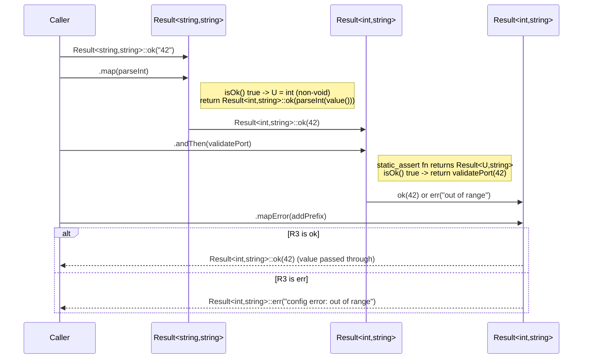

# Iora Result -- Architecture & Programmer's Guide

[Back to index](../../README.md)

| | |
|---|---|
| **Version** | 2.0 |
| **Date** | 2026-09-10 |
| **Status** | IMPLEMENTED |
| **Header** | `include/iora/core/result.hpp` |
| **Namespace** | `iora::core` (internals in `iora::core::detail`) |
| **Dependencies** | Standard library only -- `<string>`, `<type_traits>`, `<utility>`, `<variant>`. Header-only, single header, no intra-Iora and no external/third-party dependencies. |

---

## Revision History

| Version | Date | Changes |
|---|---|---|
| 1.0 | 2026-03-20 | Initial implementation. |
| 1.1 | 2026-03-20 | Fixed non-default-constructible type support (tag-dispatch constructors); added rvalue tests. |
| 2.0 | 2026-09-10 | Migrated to `docs/core/result.md` and fully re-verified against `include/iora/core/result.hpp` (464 lines) and `tests/core/iora_test_result.cpp` (37 `TEST_CASE`s). Reformatted to the 12-section template with contiguous numbered sections, `[Back to index]` link, and `--`-style title. **Drift corrections vs the prior draft:** removed the claim that a `ProcessResult` type motivates this component -- no such type exists anywhere in the tree (verified by `grep`); corrected the `IoResult` field list to the actual members (`ok`, `code`, `message`, `sysErrno`, `tlsError` in `network/transport_types.hpp:75`) and the `LifecycleResult` field list (`success`, `newState`, `message`, `std::optional<DrainStats> drainStats` in `common/i_lifecycle_managed.hpp:46`); moved the `std::expected` migration content into a numbered section (§9) and added an Error-Handling-Semantics section (§8); API Reference moved to §10 (last substantive section) per the template. No API signature, qualifier, or default changed -- the prior draft's API tables matched the header and were preserved. |
| 2.1 | 2026-09-10 | CP-3 doc-review: re-verified against the header; `result.hpp` confirmed free of code defects (no change). Added regression tests: a non-equality-comparable `T` compiles and is confirmed not equality-comparable (locks the `operator==` SFINAE guard, D-9 / R-TPL-4), and the `value() const&&` / `error() const&&` / `inspect(...) const&` overloads are now exercised. |

---

## 1. Executive Summary

### Problem

Before `Result<T, E>`, the Iora tree carried several incompatible, independently-invented success-or-error representations, each with its own idea of how a failure is reported:

- **`IoResult`** (`include/iora/network/transport_types.hpp:75`) -- a bespoke struct with `bool ok`, a `TransportError code`, a `std::string message`, and two integer error fields (`sysErrno`, `tlsError`), constructed through its own `success()` / `failure()` factories.
- **`LifecycleResult`** (`include/iora/common/i_lifecycle_managed.hpp:46`) -- a different struct with a `bool success`, a `LifecycleState newState`, a `std::string message`, and an `std::optional<DrainStats> drainStats`.
- **`bool` + out-parameter** -- e.g. `iora::core::BlockingQueue::dequeue(T& out)` returns `false` to mean "closed and empty," but a bare `bool` carries no error detail and forces the real payload through a reference parameter.

Each type encodes "did it work, and if not, why" differently, so propagating an error across a layer boundary means hand-translating one struct into another, and there is no uniform way to *chain* fallible steps -- callers fall back on nested `if (result.ok) { ... }` pyramids.

### Solution

A single generic value type, `iora::core::Result<T, E>` (with `E` defaulting to `std::string`), that unifies the pattern:

- **`ok()` / `err()` static factories** -- the only way to construct a `Result`; there are no implicit conversions, so construction is unambiguous even when `T == E` (e.g. `Result<std::string, std::string>`).
- **Ref-qualified `value()` / `error()` accessors** (four overloads each) plus `valueOr(fallback)` -- full support for move-only value types such as `std::unique_ptr`.
- **Monadic combinators** -- `map`, `andThen`, `mapError`, `inspect`, each with `const&` and (except `inspect`) `&&` overloads -- so fallible steps compose without nested branching.
- **A `Result<void, E>` partial specialization** for operations that succeed with no value.
- **SFINAE-guarded `operator==` / `operator!=`** that simply do not participate when `T` or `E` is not equality-comparable, rather than hard-erroring.

### Technical Impact

- **Zero allocation and no exceptions on the happy path** -- storage is a single `std::variant`; success and error both live inline.
- **Works with move-only, non-default-constructible, and `T == E` types** -- the internal `OkWrapper<T>` / `ErrWrapper<E>` make the two alternatives structurally distinct, and `std::in_place_index` construction never default-constructs `T` or `E`.
- **`constexpr`, `noexcept` observers** (`isOk`, `isErr`, `operator bool`) -- compile-time-friendly branching with no overhead beyond a `std::variant::index()` read.
- **Monadic chains collapse `if (r.isOk())` pyramids** into a single expression, and `mapError` gives a one-line idiom for translating a low-level error type into a layer's own error type.
- **A clear forward path to C++23 `std::expected<T, E>`** -- the naming map is documented in §9.

---

## 2. System Architecture

### 2.1 Component relationships

```
iora::core  (result.hpp)
|
|-- Result<T, E = std::string>                 (primary template; copyable/movable value type)
|   |-- std::variant<detail::OkWrapper<T>, detail::ErrWrapper<E>> _storage
|   |     |-- OkWrapper<T>  { T value; }        -- alternative index 0 (success)
|   |     `-- ErrWrapper<E> { E error; }        -- alternative index 1 (error)
|   |-- using value_type = T;  using error_type = E;
|   |-- static ok(T) / static err(E)            -- private tag-dispatch ctors + in_place_index
|   |-- isOk() / isErr() / operator bool        -- constexpr noexcept observers
|   |-- value() / error()                       -- 4 ref-qualified overloads each
|   |-- valueOr(T)                              -- const& (copy) and && (move) overloads
|   |-- map / andThen / mapError                -- const& and && overloads
|   |-- inspect                                 -- const& and & overloads (NO &&)
|   `-- operator== / operator!=                 -- SFINAE-guarded on equality-comparability
|
|-- Result<void, E>                             (partial specialization)
|   |-- std::variant<std::monostate, E> _storage  (no wrapper needed -- always distinct)
|   |-- ok() (no argument) / err(E)
|   |-- isOk() / isErr() / operator bool
|   |-- error() only -- NO value(), NO valueOr(), NO map()
|   |-- andThen (fn takes no args) / mapError / inspect
|   `-- operator== / operator!=  (two ok results compare equal)
|
`-- detail  (implementation helpers; not public API)
    |-- OkWrapper<T>  { T value; }
    |-- ErrWrapper<E> { E error; }
    |-- IsResult<T>                : std::false_type
    |-- IsResult<Result<T, E>>     : std::true_type
    `-- is_result_v<T>             -- constexpr bool; used by andThen's static_assert
```

`Result` owns its payload by value; there are no pointers, no heap, and no shared state. The forward declaration (`result.hpp:19`) carries the default `E = std::string`; the primary-template definition (`result.hpp:60`) repeats the parameters without the default, as C++ requires.

### 2.2 Why `OkWrapper` / `ErrWrapper`?

`std::variant` requires its alternative types to be distinct for type-based access. Without wrappers, `Result<std::string, std::string>` would instantiate `std::variant<std::string, std::string>` -- legal, but `std::get<std::string>(v)` is then ambiguous, and the code could no longer tell "ok" from "err" by type. Wrapping makes the alternatives structurally distinct:

```cpp
std::variant<detail::OkWrapper<std::string>, detail::ErrWrapper<std::string>>
```

Now `std::get<0>` is always the success value and `std::get<1>` is always the error, regardless of whether `T == E`. The `Result<std::string, std::string>` case is exercised directly by the `T == E works` test (`iora_test_result.cpp:73`).

The `Result<void, E>` specialization needs no wrapper: `std::monostate` (the success marker) and `E` are always distinct types, so `std::variant<std::monostate, E>` is unambiguous on its own.

### 2.3 Data flow -- a monadic chain



### 2.4 Threading model

`Result` is a passive value type -- it owns no thread, no lock, and no background activity. There is no threading model beyond "it behaves exactly like the `std::variant` it wraps." See §6 for the per-operation thread-safety table.

---

## 3. Component Deep Dive

### 3.1 `detail::OkWrapper\<T\>` / `detail::ErrWrapper\<E\>` -- variant disambiguation

```cpp
namespace detail {

template<typename T>
struct OkWrapper
{
  T value;
};

template<typename E>
struct ErrWrapper
{
  E error;
};

} // namespace detail
```

Plain aggregates with a single member each. Their only job is to occupy distinct variant positions (§2.2); they add no behavior and no storage overhead beyond `T` / `E` themselves.

### 3.2 Tag-dispatch constructors -- non-default-constructible and `T == E` support

Construction is private and goes through empty tag types:

```cpp
private:
  struct OkTag {};
  struct ErrTag {};
  Result(OkTag, T value)
    : _storage(std::in_place_index<0>, detail::OkWrapper<T>{std::move(value)})
  {
  }
  Result(ErrTag, E error)
    : _storage(std::in_place_index<1>, detail::ErrWrapper<E>{std::move(error)})
  {
  }
  std::variant<detail::OkWrapper<T>, detail::ErrWrapper<E>> _storage;
```

`std::in_place_index<N>` constructs the Nth alternative directly, which gives three properties:

1. **No default construction of `T` or `E`.** The variant holds the final value immediately; there is never an intermediate default-constructed state. The `non-default-constructible type` test (`iora_test_result.cpp:179`) confirms a type with only an `explicit NoDflt(int)` constructor works.
2. **No implicit conversions.** The only public entry points are the `ok()` / `err()` factories, which call these constructors. This removes all ambiguity when `T == E`.
3. **Move-in.** The factories take `T value` / `E error` by value and `std::move` them into the wrapper, so callers may pass an lvalue (copied into the parameter) or an rvalue (moved).

### 3.3 Ref-qualified accessors -- move-only support

`value()` and `error()` each have four overloads selected by the value category and const-ness of the `Result`:

```cpp
T& value() &;                // lvalue Result
const T& value() const&;     // const lvalue Result
T&& value() &&;              // rvalue Result: std::move(r).value()
const T&& value() const&&;   // const rvalue Result
```

The rvalue overload is what lets a move-only value be extracted idiomatically:

```cpp
auto r = Result<std::unique_ptr<int>, std::string>::ok(std::make_unique<int>(42));
auto ptr = std::move(r).value();   // invokes T&& value() && -- moves the unique_ptr out
```

This is verified by the `move-only type (unique_ptr)` test (`iora_test_result.cpp:195`). Internally, every accessor is implemented with `std::get<0>` / `std::get<1>` on `_storage`; calling `value()` on an error (or `error()` on a success) therefore throws `std::bad_variant_access` -- see §8.

### 3.4 `valueOr` -- safe fallback

```cpp
T valueOr(T fallback) const&
{
  return isOk() ? value() : std::move(fallback);
}

T valueOr(T fallback) &&
{
  return isOk() ? std::move(std::get<0>(_storage).value) : std::move(fallback);
}
```

The `const&` overload copies the stored value out on success; the `&&` overload moves it. In both, the (by-value) `fallback` is moved into the return value on the error path. This mirrors `std::optional::value_or`. The `valueOr on rvalue moves value out` test (`iora_test_result.cpp:62`) confirms the move overload.

### 3.5 Monadic operations

#### `map(fn)` -- transform the value

```cpp
template<typename F>
auto map(F&& fn) const& -> Result<std::invoke_result_t<F, const T&>, E>;
template<typename F>
auto map(F&& fn) && -> Result<std::invoke_result_t<F, T&&>, E>;
```

On success, applies `fn` to the value and re-wraps the result in `ok()`; on error, propagates the error unchanged into the new `Result` type. **Void-returning `fn` is special-cased** via `if constexpr (std::is_void_v<U>)`: `fn` is called for its side effect and `map` returns `Result<void, E>::ok()`. The `map with void-returning fn` test (`iora_test_result.cpp:104`) confirms both the ok path (side effect runs) and the err path (`fn` not called). The `const&` overload passes `const T&`; the `&&` overload passes `T&&` (moving the value out) and moves the error on the err path.

#### `andThen(fn)` -- chain fallible operations

```cpp
template<typename F>
auto andThen(F&& fn) const& -> std::invoke_result_t<F, const T&>;
template<typename F>
auto andThen(F&& fn) && -> std::invoke_result_t<F, T&&>;
```

Here `fn` must itself return a `Result<U, E>`, enforced by two `static_assert`s:

```cpp
static_assert(detail::is_result_v<ReturnType>,
  "andThen() callback must return a Result<U, E>");
static_assert(std::is_same_v<typename ReturnType::error_type, E>,
  "andThen() callback must return a Result with the same error type E");
```

On success, `andThen` returns `fn(value())` directly (the callback's own `Result`); on error it re-wraps the current error as `ReturnType::err(error())`. The `&&` overload moves the value into `fn` and moves the error when propagating.

#### `mapError(fn)` -- transform the error

```cpp
template<typename F>
auto mapError(F&& fn) const& -> Result<T, std::invoke_result_t<F, const E&>>;
template<typename F>
auto mapError(F&& fn) && -> Result<T, std::invoke_result_t<F, E&&>>;
```

The symmetric counterpart of `map`: on error, applies `fn` to the error and re-wraps in `err()`; on success, propagates the value unchanged. This is the one-liner for translating a low-level error type into a layer's own error type (e.g. an `int` code into a `std::string`). Verified on both lvalue and rvalue paths (`iora_test_result.cpp:142`, `:389`).

#### `inspect(fn)` -- side effects, returns `*this`

```cpp
template<typename F>
const Result& inspect(F&& fn) const&;
template<typename F>
Result& inspect(F&& fn) &;
```

On success, calls `fn(value())` for its side effect (e.g. logging) and returns `*this` unchanged; on error it does nothing and still returns `*this`. There is deliberately **no `&&` overload** -- an rvalue-qualified `inspect` returning `Result&` would hand back a reference into a temporary, a dangling-reference hazard. The `inspect calls fn on ok, returns self` test (`iora_test_result.cpp:158`) asserts both the side effect and `&ref == &r`.

### 3.6 The `Result\<void, E\>` specialization

For operations that succeed with no value. Storage is `std::variant<std::monostate, E>`.

| Feature | Primary `Result\<T, E\>` | `Result\<void, E\>` |
|---|---|---|
| `ok()` factory | `ok(T value)` | `ok()` -- no argument |
| `value()` | present (4 overloads) | **absent** -- void has no value |
| `valueOr()` | present (2 overloads) | **absent** |
| `map(fn)` | present | **absent** -- nothing to transform |
| `andThen(fn)` | `fn` takes `const T&` / `T&&` | `fn` takes **no arguments** (`std::invoke_result_t<F>`) |
| `mapError(fn)` | present | present |
| `inspect(fn)` | `fn` takes the value | `fn` takes **no arguments** |
| `error()` | present (4 overloads) | present (4 overloads) |
| `operator==` ok vs ok | compares values | **always `true`** (no value to compare) |

The `andThen` / `inspect` callbacks take no arguments:

```cpp
auto r = Result<void, std::string>::ok();
auto next = r.andThen([]() -> Result<int, std::string>
{
  return Result<int, std::string>::ok(42);
});
```

Confirmed by the void-specialization tests (`iora_test_result.cpp:298`-`409`), including the ok-vs-ok equality always holding (`:397`).

### 3.7 `detail::IsResult` / `is_result_v`

```cpp
template<typename T>
struct IsResult : std::false_type {};

template<typename T, typename E>
struct IsResult<Result<T, E>> : std::true_type {};

template<typename T>
inline constexpr bool is_result_v = IsResult<T>::value;
```

Used by `andThen`'s first `static_assert`. Without it, a callback that returns a non-`Result` (say `int`) would fail deep inside template instantiation; with it, the diagnostic is the actionable message `"andThen() callback must return a Result<U, E>"`.

### 3.8 Comparison operators

```cpp
template<typename T2 = T, typename E2 = E,
         std::enable_if_t<
           std::is_same_v<T2, T> && std::is_same_v<E2, E> &&
           std::is_invocable_r_v<bool, std::equal_to<>, const T2&, const T2&> &&
           std::is_invocable_r_v<bool, std::equal_to<>, const E2&, const E2&>,
         int> = 0>
bool operator==(const Result& other) const;
```

The defaulted template parameters (`T2 = T`, `E2 = E`) defer the `enable_if_t` evaluation to the point of use, so the operator simply does not participate in overload resolution unless **both** `T` and `E` are equality-comparable via `std::equal_to<>`. Semantics:

- ok vs err -> `false`
- ok vs ok -> `value() == other.value()` (for `Result<void, E>`: always `true`)
- err vs err -> `error() == other.error()`

`operator!=` is defined as `!(*this == other)` under the same guard. The `operator== and operator!=` tests (`iora_test_result.cpp:248`, `:397`) exercise every branch.

---

## 4. Usage Guide

All examples compile against the real API with `#include <iora/core/result.hpp>` and `using namespace iora::core;`.

### 4.1 Basic success / error

```cpp
#include <iora/core/result.hpp>
#include <string>

using namespace iora::core;

void basic()
{
  auto r = Result<int, std::string>::ok(42);
  if (r)                       // explicit operator bool == isOk()
  {
    int v = r.value();         // 42
    (void)v;
  }

  auto e = Result<int, std::string>::err("not found");
  if (e.isErr())
  {
    std::string msg = e.error();   // "not found"
    (void)msg;
  }

  int port = Result<int, std::string>::err("bad config").valueOr(8080);  // 8080
  (void)port;
}
```

### 4.2 Monadic chaining

```cpp
#include <iora/core/result.hpp>
#include <string>

using namespace iora::core;

Result<int, std::string> parsePort(const std::string& text)
{
  return Result<std::string, std::string>::ok(text)
    .map([](const std::string& s)
    {
      return std::stoi(s);
    })
    .andThen([](int port) -> Result<int, std::string>
    {
      if (port < 1 || port > 65535)
      {
        return Result<int, std::string>::err("port out of range");
      }
      return Result<int, std::string>::ok(port);
    })
    .mapError([](const std::string& err)
    {
      return "config error: " + err;
    });
}
```

### 4.3 Void result for side-effecting operations

```cpp
#include <iora/core/result.hpp>
#include <string>

using namespace iora::core;

Result<void, std::string> reloadConfig();   // declared elsewhere

Result<void, std::string> applyThenReload(bool valid)
{
  if (!valid)
  {
    return Result<void, std::string>::err("invalid config");
  }
  return Result<void, std::string>::ok()
    .inspect([]() { /* log("applied"); */ })
    .andThen([]() -> Result<void, std::string>
    {
      return reloadConfig();
    });
}
```

### 4.4 Move-only value types

```cpp
#include <iora/core/result.hpp>
#include <memory>
#include <string>

using namespace iora::core;

void moveOnly()
{
  auto r = Result<std::unique_ptr<int>, std::string>::ok(std::make_unique<int>(42));
  auto ptr = std::move(r).value();        // T&& value() && -- moves the unique_ptr out
  // *ptr == 42

  auto r2 = Result<std::unique_ptr<int>, std::string>::ok(std::make_unique<int>(21));
  auto doubled = std::move(r2).map([](std::unique_ptr<int> p)  // && map overload
  {
    return std::make_unique<int>(*p * 2);
  });
  // *doubled.value() == 42
}
```

### 4.5 Error-type translation between layers

```cpp
#include <iora/core/result.hpp>
#include <string>

using namespace iora::core;

struct Data {};

Result<Data, int> fetchFromDb(int id);    // low level: integer error codes

Result<Data, std::string> getData(int id) // high level: string errors
{
  return fetchFromDb(id).mapError([](int code)
  {
    return "database error: " + std::to_string(code);
  });
}
```

### 4.6 Anti-patterns

| Do | Don't |
|---|---|
| Construct with `Result<T, E>::ok(v)` / `::err(e)`. | Expect implicit construction from `T` or `E` -- there is none (by design, to keep `T == E` unambiguous). |
| Check `if (r)` / `r.isOk()` / `r.isErr()` before reading. | Call `value()` on an error (or `error()` on a success) -- it throws `std::bad_variant_access` (§8). Use `valueOr()` or an `isOk()` check. |
| Use `std::move(r).map(...)` / `.andThen(...)` when `T` is move-only. | Call `map` / `andThen` on a **non-const lvalue** holding a move-only value -- only the `const&` and `&&` overloads exist, so an lvalue binds to `const&`, which cannot move the value into the callback. |
| Call `inspect` on an lvalue (or a `const&`), then `std::move` afterward if needed. | Write `std::move(r).inspect(fn)` -- there is no `&&` overload and it will not compile. |
| Use `std::move(r).valueOr(fallback)` for large value types. | Call `valueOr` on an lvalue for a large `T` expecting a move -- the `const&` overload copies the stored value out. |

---

## 5. Call Flow / Sequence Reference

### 5.1 Construction via factory

| Step | Action |
|---|---|
| 1 | `Result<int, std::string>::ok(42)` -> private `Result(OkTag{}, 42)`. |
| 2 | `_storage(std::in_place_index<0>, OkWrapper<int>{42})` -- variant holds `OkWrapper<int>{ .value = 42 }` at index 0. |
| 3 | `Result<int, std::string>::err("fail")` -> `Result(ErrTag{}, "fail")` -> `ErrWrapper<std::string>{ .error = "fail" }` at index 1. |

### 5.2 `map` on a success (non-void `fn`)

| Step | Action |
|---|---|
| 1 | `isOk()` -> `true` (`_storage.index() == 0`). |
| 2 | `U = std::invoke_result_t<F, const T&>`; `if constexpr (std::is_void_v<U>)` is `false`. |
| 3 | `return Result<U, E>::ok(fn(value()))` -- callback applied, result re-wrapped. |

### 5.3 `map` on an error

| Step | Action |
|---|---|
| 1 | `isOk()` -> `false`. |
| 2 | `return Result<U, E>::err(error())` -- error copied (`const&` overload) or moved (`&&` overload) into the new `Result`; `fn` is never called. |

### 5.4 `andThen` on a success

| Step | Action |
|---|---|
| 1 | `static_assert detail::is_result_v<ReturnType>` and `error_type == E` (compile time). |
| 2 | `isOk()` -> `true`. |
| 3 | `return fn(value())` -- the callback's own `Result<U, E>` is returned directly (no re-wrap). |

### 5.5 `value()` on the wrong alternative (failure path)

| Step | Action |
|---|---|
| 1 | Caller invokes `value()` on a `Result` holding an error. |
| 2 | `std::get<0>(_storage)` is called while the active index is 1. |
| 3 | `std::get` throws `std::bad_variant_access`; no value is returned (see §8). |

### 5.6 `Result\<void, E\>::andThen` on a success

| Step | Action |
|---|---|
| 1 | `static_assert`s check `fn`'s return type (as in 5.4). |
| 2 | `isOk()` -> `true` (active alternative is `std::monostate`, index 0). |
| 3 | `return fn()` -- callback takes no arguments; its `Result<U, E>` is returned. |

---

## 6. Thread Safety Model

`Result<T, E>` has **no internal synchronization** -- it is a value type in the same category as `std::variant` and `std::optional`. There are no mutexes, atomics, or condition variables in the header.

| Operation | Thread safety | Notes |
|---|---|---|
| Construction (`ok` / `err`) | N/A -- produces a new object | No shared state. |
| `isOk()` / `isErr()` / `operator bool` | Safe to call concurrently on a shared **const** `Result` | Read-only; `constexpr noexcept`; only reads `std::variant::index()`. |
| `value()` / `error()` `const&` / `const&&` | Safe concurrently on a shared **const** `Result` | Read-only. |
| `value()` / `error()` `&` / `&&` | **Not** safe concurrently | Return mutable / movable access; a concurrent move mutates the object. |
| `valueOr()` `const&` | Safe concurrently on a shared const `Result` | Copies the value out. |
| `valueOr()` `&&` | **Not** safe | Moves the value out. |
| `map` / `andThen` / `mapError` (`const&`) | Safe concurrently on a shared const `Result` | Reads the value/error and produces a new `Result`; the source is unmodified. |
| `map` / `andThen` / `mapError` (`&&`) | **Not** safe | Moves the value/error out of the source. |
| `inspect` (`const&`) | Safe concurrently on a shared const `Result` | Reads only; thread safety of `fn` itself is the caller's concern. |
| `inspect` (`&`) | Read-only on `Result`, but non-const | No mutation of `_storage`; still not a `const` method. |
| `operator==` / `operator!=` | Safe concurrently on shared const `Result`s | Read-only comparison. |

**Recommendation.** A `Result` meant to cross threads should be passed by value (moved) into the consuming thread, or protected by external synchronization if genuinely shared mutably. The const-qualified read operations are safe to call concurrently precisely because a const `Result` never mutates `_storage`.

---

## 7. Configuration Reference

`Result<T, E>` has no runtime, environment, or builder configuration. Its only "configuration" is its two template parameters.

| Template parameter | Default | Constraints / notes |
|---|---|---|
| `T` | (required) | The success value type. May be `void` (selects the specialization), may equal `E`, may be non-default-constructible, and may be move-only. |
| `E` | `std::string` | The error type. The default is supplied on the forward declaration (`result.hpp:19`). In the `Result<void, E>` specialization, `E` must differ from `std::monostate` (always true in practice). |

No defaults, limits, or units exist beyond these; there are no macros, no environment variables, and no builder.

---

## 8. Error Handling and Exception Semantics

`Result` is itself the error-handling mechanism for the *operations that return it* -- the happy path never throws and never allocates beyond what `T`/`E` require. However, the **accessors** have well-defined throwing behavior when used against the wrong alternative:

- **`value()` on an error `Result`** throws `std::bad_variant_access`. Internally it calls `std::get<0>(_storage)` while the active index is 1. Confirmed by `value() on err throws` (`iora_test_result.cpp:38`).
- **`error()` on a success `Result`** throws `std::bad_variant_access` (via `std::get<1>` on an index-0 variant). Confirmed by `error() on ok throws` (`iora_test_result.cpp:44`) and, for the void specialization, `Result<void>: error() on ok throws` (`:311`).

There is no `value_or_throw(customException)` and no configurable exception type -- the thrown type is always `std::bad_variant_access`. The intended discipline is:

1. Branch on `isOk()` / `isErr()` / `operator bool` before calling `value()` / `error()`, **or**
2. Use `valueOr(fallback)` to obtain a value without any possibility of throwing.

The factories (`ok` / `err`) and the observers (`isOk` / `isErr` / `operator bool`) do not throw; the observers are additionally `noexcept`. The monadic combinators do not throw on their own account -- any exception that escapes them originates in the user-supplied callback `fn` or in `T`/`E`'s own copy/move operations.

---

## 9. `std::expected` (C++23) Migration Path

`Result<T, E>` is deliberately shaped like C++23 `std::expected<T, E>` so the codebase can migrate when it adopts C++23. The naming map:

| `Result` (iora) | `std::expected` (C++23) | Notes |
|---|---|---|
| `Result<T, E>::ok(v)` | `std::expected<T, E>(v)` | `std::expected` constructs implicitly from `T`; `Result` requires the factory. |
| `Result<T, E>::err(e)` | `std::unexpected(e)` | `std::expected` uses a distinct `unexpected` wrapper. |
| `isOk()` | `has_value()` | |
| `isErr()` | `!has_value()` | |
| `operator bool` | `operator bool` | Both explicit. |
| `value()` | `value()` | Both throw on the wrong state, but with different types: `Result` throws `std::bad_variant_access`; `std::expected::value()` throws `std::bad_expected_access<E>` (which carries the error). |
| `error()` | `error()` | Same semantics. |
| `valueOr()` | `value_or()` | |
| `map()` | `transform()` | |
| `andThen()` | `and_then()` | |
| `mapError()` | `transform_error()` | |
| `inspect()` | (no direct equivalent) | `std::expected` has no `inspect`; later standards may add one. |

**Strategy.** When the project moves to C++23, add snake_case aliases (`has_value`, `value_or`, `transform`, `and_then`, `transform_error`) alongside the existing camelCase methods for a deprecation cycle, migrate call sites, then switch the implementation to `std::expected` and retire the iora machinery. No such shim exists today (§12). The camelCase names match Iora's naming convention and remain the primary surface until then.

---

## 10. API Reference

```cpp
namespace iora
{
namespace core
{

// ── Primary template ─────────────────────────────────────────────────────────
template<typename T, typename E = std::string>
class Result
{
public:
  using value_type = T;
  using error_type = E;

  // Factories
  static Result ok(T value);
  static Result err(E error);

  // Observers (constexpr, noexcept)
  constexpr bool isOk() const noexcept;
  constexpr bool isErr() const noexcept;
  constexpr explicit operator bool() const noexcept;

  // Accessors (4 ref-qualified overloads each)
  T& value() &;
  const T& value() const&;
  T&& value() &&;
  const T&& value() const&&;

  E& error() &;
  const E& error() const&;
  E&& error() &&;
  const E&& error() const&&;

  T valueOr(T fallback) const&;
  T valueOr(T fallback) &&;

  // Monadic operations
  template<typename F>
  auto map(F&& fn) const& -> Result<std::invoke_result_t<F, const T&>, E>;
  template<typename F>
  auto map(F&& fn) && -> Result<std::invoke_result_t<F, T&&>, E>;
  // If fn returns void, map returns Result<void, E>.

  template<typename F>
  auto andThen(F&& fn) const& -> std::invoke_result_t<F, const T&>;
  template<typename F>
  auto andThen(F&& fn) && -> std::invoke_result_t<F, T&&>;
  // static_assert: fn must return Result<U, E> with the same error type E.

  template<typename F>
  auto mapError(F&& fn) const& -> Result<T, std::invoke_result_t<F, const E&>>;
  template<typename F>
  auto mapError(F&& fn) && -> Result<T, std::invoke_result_t<F, E&&>>;

  template<typename F>
  const Result& inspect(F&& fn) const&;
  template<typename F>
  Result& inspect(F&& fn) &;
  // No && overload (would return a reference into a temporary).

  // Comparison (SFINAE-guarded: requires T and E equality-comparable)
  bool operator==(const Result& other) const;
  bool operator!=(const Result& other) const;
};

// ── Void specialization ──────────────────────────────────────────────────────
template<typename E>
class Result<void, E>
{
public:
  using value_type = void;
  using error_type = E;

  static Result ok();              // no argument
  static Result err(E error);

  constexpr bool isOk() const noexcept;
  constexpr bool isErr() const noexcept;
  constexpr explicit operator bool() const noexcept;

  // No value(), no valueOr(), no map().
  E& error() &;
  const E& error() const&;
  E&& error() &&;
  const E&& error() const&&;

  template<typename F>
  auto andThen(F&& fn) const& -> std::invoke_result_t<F>;   // fn takes no arguments
  template<typename F>
  auto andThen(F&& fn) && -> std::invoke_result_t<F>;

  template<typename F>
  auto mapError(F&& fn) const& -> Result<void, std::invoke_result_t<F, const E&>>;
  template<typename F>
  auto mapError(F&& fn) && -> Result<void, std::invoke_result_t<F, E&&>>;

  template<typename F>
  const Result& inspect(F&& fn) const&;   // fn takes no arguments
  template<typename F>
  Result& inspect(F&& fn) &;

  bool operator==(const Result& other) const;   // ok vs ok is always true
  bool operator!=(const Result& other) const;
};

namespace detail
{
  template<typename T> struct OkWrapper  { T value; };
  template<typename E> struct ErrWrapper { E error; };

  template<typename T> struct IsResult : std::false_type {};
  template<typename T, typename E> struct IsResult<Result<T, E>> : std::true_type {};
  template<typename T> inline constexpr bool is_result_v = IsResult<T>::value;
}

} // namespace core
} // namespace iora
```

---

## 11. Design Decisions

| ID | Decision | Rationale |
|---|---|---|
| D-1 | `OkWrapper<T>` / `ErrWrapper<E>` variant alternatives. | `std::variant` needs distinct alternatives for type-based access; wrapping makes index 0 always "ok" and index 1 always "err", so `Result<std::string, std::string>` works. |
| D-2 | Private tag-dispatch constructors + `std::in_place_index`. | Constructs the active alternative directly: no default construction of `T`/`E`, and no implicit conversions -- construction is unambiguous even when `T == E`. |
| D-3 | Static `ok()` / `err()` factories as the only public construction. | Clearer than `Result(T)` / `Result(E)` and ambiguity-free when `T == E`; the tag constructors stay an implementation detail. |
| D-4 | Four ref-qualified accessor overloads (`&`, `const&`, `&&`, `const&&`). | Supports lvalue access, const access, move-out from rvalues, and the const-rvalue corner -- essential for move-only value types like `std::unique_ptr`. |
| D-5 | `map` special-cases a void-returning `fn` (`if constexpr`). | Returns `Result<void, E>` so side-effect-only transforms need no awkward `andThen` wrapper; the branch is resolved at compile time, zero runtime cost. |
| D-6 | `andThen` constrained by two `static_assert`s. | Enforces `fn` returns `Result<U, E>` with the same `E`, turning an otherwise cryptic deep template error into a clear message. |
| D-7 | `inspect` has `const&` and `&` but no `&&`. | An rvalue-qualified `inspect` returning `Result&` would alias a temporary -- a dangling reference. Two overloads cover every chain use. |
| D-8 | `Result<void, E>` uses bare `std::variant<std::monostate, E>`. | `std::monostate` and `E` are already distinct, so no wrapper is needed -- simpler specialization. |
| D-9 | SFINAE guard on `operator==` / `operator!=`. | Non-comparable `T`/`E` silently drop the operator from overload resolution rather than hard-erroring; defaulted template params defer the check to point of use. |
| D-10 | `constexpr` / `noexcept` on observers only. | `isOk`/`isErr`/`operator bool` only read `variant::index()`. Accessors are not `constexpr` because `std::variant` `in_place_index` construction is not fully `constexpr` in C++17 on the target toolchains (see the test note at `iora_test_result.cpp:281`). |
| D-11 | Default `E = std::string`. | Covers the common case; domain code uses `Result<T, MyError>`. String errors are trivial to build, log, and propagate. |
| D-12 | Immutable after construction (no `reset`/assignment-from-`T`/`emplace`). | Simplifies reasoning about state: construct a new `Result` rather than mutating one in place. |
| D-13 | camelCase method names shaped after `std::expected`. | Matches Iora's convention while keeping a mechanical 1:1 map to the C++23 type for a future migration (§9). |

---

## 12. Known Limitations

- **Candidate code defects: none identified.** The header was read in full and cross-checked against all 37 `TEST_CASE`s. The behaviors that look surprising (accessors throwing `std::bad_variant_access`, the absence of an rvalue `inspect`, `const&&` accessors copying rather than moving) are intentional and/or standard consequences of the underlying `std::variant`, and are documented as limitations below rather than flagged as defects. This is an explicit "no candidate defects found" statement, not an omission.
- **`value()` / `error()` throw on the wrong state.** Accessing `value()` on an error (or `error()` on a success) throws `std::bad_variant_access`; there is no custom-exception variant. Guard with `isOk()`/`isErr()`/`operator bool`, or use `valueOr()` (§8).
- **No non-const lvalue (`&`) overload for `map` / `andThen` / `mapError`.** Only `const&` and `&&` exist. On a non-const lvalue, overload resolution selects `const&`, which passes `const T&` to the callback and cannot move a move-only value. Use `std::move(r).map(...)` for move-only `T`.
- **`inspect` cannot be used on an rvalue.** `std::move(r).inspect(fn)` does not compile (no `&&` overload, by design -- D-7). Call `inspect` on an lvalue/`const&` before any final `std::move`.
- **`const&&` accessors copy, not move.** `value() const&&` / `error() const&&` return `const T&&` / `const E&&`; because the source is const, binding at the call site selects the copy constructor, not the move constructor. These overloads exist to complete the ref-qualification matrix, not to enable moving out of a const rvalue.
- **`valueOr` copies from an lvalue.** The `const&` overload copies the stored value out; for large `T`, prefer `std::move(r).valueOr(fallback)` to move.
- **No `map` on `Result<void, E>`.** There is nothing to transform. To turn "success with no value" into a value, use `andThen()` with a factory returning the desired `Result`.
- **No `orElse` / error-recovery combinator.** There is no monadic recovery from the error branch (e.g. `r.orElse(fallbackFn)`). Use an explicit `if (r.isErr())` for recovery, or `mapError` to translate.
- **`operator==` is all-or-nothing under SFINAE.** If either `T` or `E` is not equality-comparable, comparison is removed entirely -- there is no partial comparison of only the comparable half.
- **No error chaining / accumulation.** `mapError` replaces the error; it does not append to a chain. Any error context must be assembled inside the `mapError` callback.
- **No `std::expected` interop yet.** The migration map in §9 is documented, but no conversion operators or shim layer exist; this is future work gated on the project adopting C++23.
