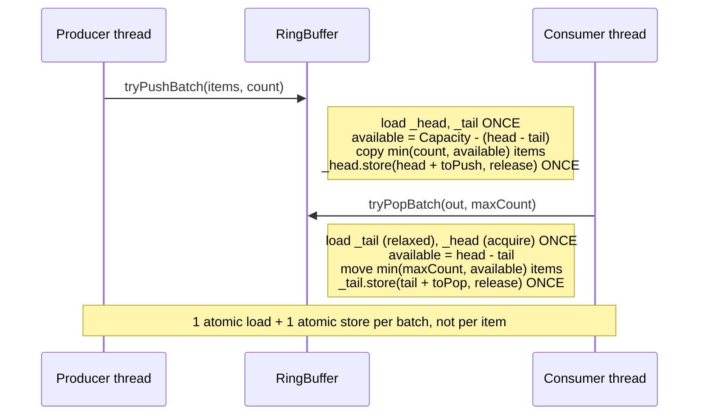

# Iora RingBuffer -- Architecture & Programmer's Guide

[Back to index](../../README.md)

| | |
|---|---|
| **Version** | 2.2 |
| **Date** | 2026-09-10 |
| **Status** | IMPLEMENTED |
| **Header** | `include/iora/core/ring_buffer.hpp` |
| **Namespace** | `iora::core` |
| **Dependencies** | Standard library only -- `<array>`, `<atomic>`, `<cstddef>`, `<memory>`, `<type_traits>`, `<utility>`. No intra-Iora headers, no external/third-party dependencies. Header-only. |

---

## Revision History

| Version | Date | Changes |
|---|---|---|
| 1.0 | 2026-03-20 | Initial implementation. |
| 1.2 | 2026-03-20 | Added batch operations, `peek`, and `DynamicRingBuffer::resize`. |
| 2.0 | 2026-03-20 | Full Architecture & Programmer's Guide (published as `coding_trackers/docs/iora/ring_buffer.md`). |
| 2.1 | 2026-09-10 | Migrated to `docs/core/ring_buffer.md` and fully re-verified against `include/iora/core/ring_buffer.hpp` (350 lines) and `tests/core/iora_test_ring_buffer.cpp`. **Corrected the memory-ordering claims:** the producer loads the consumer-owned `_tail` with `memory_order_relaxed` (not `acquire`), a deviation from the canonical acquire-loaded SPSC pattern -- flagged here as a candidate data-race defect on slot reuse (see sections 6 and 12), not papered over as "safe". Added the `size()` non-atomic double-load underflow hazard and the `nextPowerOfTwo` 32-bit shift-width note. Reformatted to the 12-section template with contiguous numbered sections. |
| 2.2 | 2026-09-10 | Fix-sync with commit `1902df7`: the producer-side `_tail` loads in `tryPush`/`tryPushBatch` (both variants) were promoted `memory_order_relaxed` -> `memory_order_acquire`, closing the slot-reuse data race documented in 2.1 -- the memory-ordering, thread-safety, and Known Limitations sections now describe this as resolved rather than a candidate defect. `nextPowerOfTwo`'s `v |= v >> 32` step is now guarded by `if constexpr (sizeof(std::size_t) > 4)`, resolving the 32-bit UB note. Dependencies list updated (`<cassert>`, `<cstdint>`, `<new>` removed, no longer included). Header line count corrected to 350. |

---

## 1. Executive Summary

### Problem

Media-plane pipelines in VoIP systems -- RTP ingest, jitter buffers, audio mixing -- hand frames between exactly two threads: a network-I/O producer and an audio-engine consumer. Guarding that hand-off with a `std::mutex`, or routing it through a multi-producer/multi-consumer (MPMC) `BlockingQueue`, pays lock contention, potential priority inversion, and a kernel transition on every frame. At 20 ms pacing (50 frames/sec per call, multiplied across concurrent calls) that per-frame overhead is exactly the cost the media plane cannot afford.

### Solution

`ring_buffer.hpp` provides two lock-free single-producer/single-consumer (SPSC) circular-buffer variants in `iora::core`:

- **`RingBuffer<T, Capacity>`** -- compile-time fixed capacity, backed by an in-object `std::array<T, Capacity>`; zero heap allocation after construction. Best for known-size pipelines (e.g. a fixed jitter buffer).
- **`DynamicRingBuffer<T>`** -- runtime-configurable capacity backed by a `std::unique_ptr<T[]>`, with a `resize()` that preserves FIFO order. Best for adaptive jitter buffers whose depth tracks measured network jitter.

Both enforce, by contract only, the SPSC discipline: exactly one thread ever calls `tryPush`/`tryPushBatch`, and exactly one (different) thread ever calls `tryPop`/`tryPopBatch`/`peek`. Violating that contract is undefined behavior -- there are no runtime guards.

### Technical Impact

- **No mutex, no CAS retry loop, no kernel transition** on the hot push/pop path -- only atomic loads/stores on two indices.
- **`alignas(64)`** on `_head` and `_tail` (and on `_buffer` in the fixed variant) places the producer's and consumer's hot indices on separate cache lines, eliminating false sharing.
- **Power-of-two capacity** turns the modulo-into-slot into a single `index & kMask` bitwise AND instead of an integer division.
- **Batch operations** (`tryPushBatch`/`tryPopBatch`) use a single-load/single-store pattern: one atomic load and one atomic store per batch of N items, not 2N atomic operations.
- **`peek()`** copies the head-of-queue item without advancing `_tail`, enabling jitter-buffer look-ahead (inspect a frame's timestamp before deciding to consume it).
- **`DynamicRingBuffer::resize()`** returns the count of dropped items, so a caller shrinking the buffer knows exactly how many oldest items were discarded.

---

## 2. System Architecture

### 2.1 Component relationships

```
iora::core  (ring_buffer.hpp)
|
|-- RingBuffer<T, Capacity>                 (fixed, compile-time sized)
|   |-- static constexpr kMask = Capacity - 1        (public; bitwise-AND slot mask)
|   |-- static_assert Capacity > 0
|   |-- static_assert (Capacity & (Capacity-1)) == 0  (power of two)
|   |-- alignas(64) std::atomic<size_t> _head         (producer-written, consumer-read)
|   |-- alignas(64) std::atomic<size_t> _tail         (consumer-written, producer-read)
|   `-- alignas(64) std::array<T, Capacity> _buffer   (in-object storage; no heap)
|
`-- DynamicRingBuffer<T>                    (runtime sized; supports resize)
    |-- size_t _capacity                     (nextPowerOfTwo(requested))
    |-- size_t _mask                         (_capacity - 1)
    |-- std::unique_ptr<T[]> _buffer         (single heap allocation)
    |-- alignas(64) std::atomic<size_t> _head
    |-- alignas(64) std::atomic<size_t> _tail
    `-- static nextPowerOfTwo(v)             (bit-twiddling round-up; 0 -> 1)

Both are non-copyable and non-movable (they contain std::atomic members and are
a shared synchronization point between two live threads).

Intended consumers (media plane; not part of this header):
  RTP ingest / jitter buffer  --produce/consume-->  RingBuffer / DynamicRingBuffer
  Audio mixing / playout                        (SPSC frame hand-off)
```

Both indices are **monotonically increasing** unsigned counters that are never wrapped by the code; the slot is derived on each access as `index & mask`. "Full" is `head - tail >= capacity`; "empty" is `tail >= head`. This resolves the classic "does `head == tail` mean full or empty?" ambiguity without sacrificing a buffer slot.

### 2.2 Data flow -- SPSC frame hand-off

```mermaid
sequenceDiagram
  participant Net as Network I/O thread (producer)
  participant RB as RingBuffer
  participant Aud as Audio engine thread (consumer)

  Net->>RB: tryPush(frame)
  Note right of RB: load _head (relaxed), _tail (acquire)<br/>if head - tail >= Capacity: return false<br/>_buffer[head & kMask] = frame<br/>_head.store(head+1, release)

  Aud->>RB: peek(frame)
  Note right of RB: load _tail (relaxed), _head (acquire)<br/>copy _buffer[tail & kMask]; do NOT advance _tail

  Aud->>RB: tryPop(frame)
  Note right of RB: load _tail (relaxed), _head (acquire)<br/>if tail >= head: return false<br/>frame = move(_buffer[tail & kMask])<br/>_tail.store(tail+1, release)

  Note over Net,Aud: no locks, no CAS loops, no kernel transitions
```

### 2.3 Data flow -- batch transfer (single-load/single-store)



### 2.4 Threading model

| Thread | Responsibility |
|---|---|
| **Producer** (exactly one) | Calls `tryPush` / `tryPushBatch`. Owns `_head` (the only writer). Reads `_tail` to compute free space. |
| **Consumer** (exactly one) | Calls `tryPop` / `tryPopBatch` / `peek`. Owns `_tail` (the only writer). Reads `_head` to compute available items. |
| **Any thread** (monitoring) | May call `size` / `empty` / `full` / `capacity` -- all relaxed and **approximate** (section 6). Not a synchronization primitive. |
| **Quiescing caller** | `clear()` (both variants) and `resize()` (dynamic only) require **SPSC quiescence** -- neither producer nor consumer may be mid-operation. They are not thread-safe against a live producer/consumer. |

---

## 3. Component Deep Dive

### 3.1 The SPSC contract

The entire design rests on one invariant: **exactly one thread ever writes `_head`** (the producer) and **exactly one thread ever writes `_tail`** (the consumer). This is what eliminates compare-and-swap loops, ABA counters, and every MPMC complication. Each side reads the other's index but writes only its own.

The contract is **not enforced at runtime** -- there is no owner-thread check, no assertion. Two producers, two consumers, or a single thread doing both without external ordering is undefined behavior with silent data corruption (lost items, duplicated items, torn reads). The type is non-copyable and non-movable precisely because it is a shared synchronization point that must not be relocated while the two threads reference it.

### 3.2 `RingBuffer\<T, Capacity\>` -- the fixed variant

**Compile-time capacity constraints.** Two `static_assert`s fire at instantiation:

```cpp
static_assert(Capacity > 0, "RingBuffer capacity must be greater than zero");
static_assert((Capacity & (Capacity - 1)) == 0,
  "RingBuffer capacity must be a power of two");
```

The power-of-two requirement makes `kMask = Capacity - 1` a compile-time constant and turns the slot computation into a single `index & kMask`.

**Storage.** `_buffer` is an in-object `std::array<T, Capacity>` -- stack- or enclosing-object-resident, zero heap allocation. All `Capacity` elements are default-initialized (indeterminate for trivial `T`; slots are always written before being read) when the buffer is constructed.

**Push (copy and move overloads).** Both overloads load `_head` (`relaxed`, own index) and `_tail` (`acquire`, other index -- see section 4), reject when `head - tail >= Capacity`, assign into `_buffer[head & kMask]`, then publish with `_head.store(head + 1, release)`:

```cpp
bool tryPush(const T& item) noexcept(std::is_nothrow_copy_assignable_v<T>)
{
  auto head = _head.load(std::memory_order_relaxed);
  auto tail = _tail.load(std::memory_order_acquire);
  if (head - tail >= Capacity)
  {
    return false;
  }
  _buffer[head & kMask] = item;
  _head.store(head + 1, std::memory_order_release);
  return true;
}
```

The move overload is identical except for `std::move(item)` and a `is_nothrow_move_assignable_v<T>` `noexcept` clause.

**Pop.** Loads `_tail` (`relaxed`, own index) and `_head` (`acquire`, other index), rejects when `tail >= head`, moves the slot out, then publishes with `_tail.store(tail + 1, release)`.

**`noexcept` propagation.** `tryPush`/`tryPop`/`peek`/`tryPushBatch`/`tryPopBatch` are conditionally `noexcept` on the relevant `is_nothrow_*_assignable_v<T>` trait; `size`/`empty`/`full`/`capacity`/`clear` are unconditionally `noexcept`. `capacity()` is additionally `constexpr` in this variant. The test suite `static_assert`s `noexcept(rb.size())`, `noexcept(rb.peek(val))` for `T = int`, and friends.

### 3.3 `DynamicRingBuffer\<T\>` -- the runtime variant

Identical SPSC push/pop/peek/batch semantics, but capacity is chosen at construction and may change:

- **Construction.** `explicit DynamicRingBuffer(std::size_t requestedCapacity)` rounds `requestedCapacity` up to the next power of two via the private `nextPowerOfTwo`, stores `_capacity`/`_mask`, and heap-allocates `_buffer = std::make_unique<T[]>(_capacity)`.
- **`nextPowerOfTwo(v)`.** The classic decrement / OR-shift-cascade / increment bit twiddle. `nextPowerOfTwo(0)` returns `1`, so a requested capacity of 0 silently becomes 1 (no assertion). The cascade's `v |= v >> 32` step is guarded behind `if constexpr (sizeof(std::size_t) > 4)` (commit `1902df7`), so it is only ever instantiated on a 64-bit `std::size_t` -- the prior 32-bit shift-width UB is handled, not merely noted (see section 12).
- **`capacity()`** returns the runtime `_capacity` member and is **not** `constexpr` here (unlike the fixed variant).

**`resize(newRequestedCapacity)`** -- **not thread-safe; requires SPSC quiescence.** It reallocates and drains existing items into the new buffer preserving FIFO order:

```cpp
std::size_t resize(std::size_t newRequestedCapacity)
{
  auto newCapacity = nextPowerOfTwo(newRequestedCapacity);
  auto newMask = newCapacity - 1;
  auto newBuffer = std::make_unique<T[]>(newCapacity);

  auto tail = _tail.load(std::memory_order_relaxed);
  auto head = _head.load(std::memory_order_relaxed);
  std::size_t count = head - tail;
  std::size_t toCopy = count < newCapacity ? count : newCapacity;

  // Keep the most-recent items if shrinking below the current count.
  auto startTail = (count > newCapacity) ? (head - newCapacity) : tail;
  for (std::size_t i = 0; i < toCopy; ++i)
  {
    newBuffer[i] = std::move(_buffer[(startTail + i) & _mask]);
  }

  std::size_t dropped = count - toCopy;

  _buffer = std::move(newBuffer);
  _capacity = newCapacity;
  _mask = newMask;
  _tail.store(0, std::memory_order_relaxed);
  _head.store(toCopy, std::memory_order_relaxed);
  return dropped;
}
```

**Drop-on-shrink policy.** When the new capacity is smaller than the current item count, the **oldest** items are dropped and the **most recent** `newCapacity` items are kept (`startTail = head - newCapacity`). This is the correct policy for an adaptive jitter buffer -- the newest audio frames are more valuable than stale ones. The test `Dynamic: resize to smaller than item count loses oldest` confirms: 6 items resized to capacity 4 keeps `{3,4,5,6}` and returns `dropped == 2`. Reading from the old buffer uses the **old** `_mask` (still in the member at copy time); the new mask is assigned only afterward. After the drain, indices are normalized to `_tail = 0`, `_head = toCopy`.

### 3.4 Batch operations (single-load/single-store)

`tryPushBatch`/`tryPopBatch` are **not** loops over the single-item primitives. Each computes the transferable count once, copies/moves in a plain (non-atomic) loop, then publishes its owned index once:

```cpp
std::size_t tryPushBatch(const T* items, std::size_t count)
  noexcept(std::is_nothrow_copy_assignable_v<T>)
{
  auto head = _head.load(std::memory_order_relaxed);
  auto tail = _tail.load(std::memory_order_acquire);
  auto available = Capacity - (head - tail);
  auto toPush = count < available ? count : available;

  for (std::size_t i = 0; i < toPush; ++i)
  {
    _buffer[(head + i) & kMask] = items[i];
  }
  _head.store(head + toPush, std::memory_order_release);
  return toPush;
}
```

A batch of N items therefore incurs exactly **one** atomic load of the opposite index and **one** release store of the owned index, versus `2N` atomic operations for a per-item loop. `tryPopBatch` is the mirror image (loads `_head` with `acquire`, moves items out, stores `_tail` with `release`). Both correctly handle wrap-around because indexing is `(base + i) & mask` (verified by the `Fixed: batch wrap-around` and `Dynamic: batch push/pop with wrap-around` tests).

Both batch methods return `0` and still perform a (redundant, same-value) release store of the owned index when nothing is transferable; this is harmless.

### 3.5 `peek` -- look-ahead without consuming

`peek(T& out) const` copies (does not move) `_buffer[tail & mask]` into `out` without advancing `_tail`. It loads `_tail` with `relaxed` and `_head` with `acquire`, exactly like `tryPop`, and so may only be called by the **consumer** thread (it reads the consumer-owned `_tail` without synchronization). It enables jitter-buffer look-ahead: inspect the next frame's timestamp/sequence number, then decide to `tryPop` it, wait for a later frame, or interpolate. Because it returns a copy, a large or non-trivially-copyable `T` pays a copy on every peek (section 12).

### 3.6 `clear`, `size`, `empty`, `full`, `capacity`

- **`clear()`** resets both indices to 0 with `relaxed` stores. It requires SPSC quiescence and does **not** destruct the elements already resident in the buffer -- only the indices move (section 12).
- **`size()`** returns `head - tail` from two independent `relaxed` loads (head first, then tail). It is approximate under concurrency and can even transiently underflow to a value near `SIZE_MAX` (section 6).
- **`empty()`** is `size() == 0`; **`full()`** is `size() >= capacity`. Both inherit `size()`'s approximation.
- **`capacity()`** returns the compile-time `Capacity` (fixed, `constexpr`) or the runtime `_capacity` (dynamic, non-`constexpr`).

---

## 4. Memory Ordering Model

The buffer synchronizes the two threads entirely through the acquire/release ordering on `_head` and `_tail`. The table below records the **actual** ordering used at each site.

| Operation | Index accessed | Owner | Ordering (actual) | Purpose |
|---|---|---|---|---|
| `tryPush` / `tryPushBatch` | load `_head` | producer (own) | `relaxed` | No cross-thread read; producer is the only writer of `_head`. |
| `tryPush` / `tryPushBatch` | load `_tail` | consumer (other) | **`acquire`** | Compute free space, and pairs with the consumer's `release` store of `_tail` -- see below. |
| `tryPush` / `tryPushBatch` | store `_head` | producer (own) | `release` | Publishes the slot writes: a consumer that `acquire`-loads this `_head` sees the item data written before it. |
| `tryPop` / `tryPopBatch` / `peek` | load `_tail` | consumer (own) | `relaxed` | No cross-thread read; consumer is the only writer of `_tail`. |
| `tryPop` / `tryPopBatch` / `peek` | load `_head` | producer (other) | `acquire` | Pairs with the producer's `release` store of `_head`; makes the item data visible before the consumer reads the slot. |
| `tryPop` / `tryPopBatch` | store `_tail` | consumer (own) | `release` | Intended to order the consumer's slot read before the producer observes the advanced tail and reuses the slot. |
| `size` / `empty` / `full` | load both | any | `relaxed` | Approximate monitoring only. |
| `clear` / `resize` | store/load both | quiescing caller | `relaxed` | Correct only under SPSC quiescence. |

**Fill direction is fully synchronized.** The producer's `release` store of `_head` and the consumer's `acquire` load of `_head` form a release/acquire pair. Everything the producer wrote into `_buffer[head & mask]` *happens-before* the consumer's read of that slot. This direction is correct.

**Slot-reuse (overwrite) direction is fully synchronized (resolved 2026-09-10, commit `1902df7`).** For the producer to safely **overwrite** a slot, the consumer's earlier *read* of that slot's previous occupant must *happen-before* the producer's write. The cross-thread edge the producer uses is its load of `_tail`. That load is now **`acquire`**, pairing with the consumer's `release` store of `_tail` in `tryPop`/`tryPopBatch` -- exactly the pattern the canonical lock-free SPSC ring buffer (e.g. `boost::lockfree::spsc_queue`, Rigtorp's SPSC queue) uses on both endpoints. The consumer's completed read of `_buffer[slot]` therefore *happens-before* the producer's `acquire`-observed `_tail` advance, which in turn *happens-before* the producer's overwrite of that same slot. There is no longer an unsynchronized read/write to the same non-atomic location on either the fill or the reuse direction, on any architecture (including weakly-ordered ARM/POWER) -- not only on x86, where the prior relaxed load happened to be masked by the hardware's implicit acquire/release semantics. (The 2.1 guide flagged this as a candidate data race pending human disposition; it was fixed, not merely dispositioned as safe.)

**Why acquire/release rather than `seq_cst`.** Sequential consistency would add a full fence to every atomic operation. Release/acquire is the minimum required for the fill direction and avoids that fence on architectures where it costs (ARM/POWER); on x86 both compile to plain loads/stores.

---

## 5. Usage Guide

All examples compile against the real API. Illustrative user types (`RtpFrame`) are shown with a minimal definition so the snippet is self-contained.

### 5.1 Fixed-size jitter buffer with peek look-ahead

```cpp
#include <iora/core/ring_buffer.hpp>
#include <cstdint>

struct RtpFrame
{
  std::uint32_t timestamp;
  // ... payload ...
};

using namespace iora::core;

RingBuffer<RtpFrame, 1024> jitterBuffer; // 1024 slots, power of two

// Producer (network I/O thread):
void onRtpPacket(RtpFrame&& frame, std::uint64_t& droppedFrames)
{
  if (!jitterBuffer.tryPush(std::move(frame)))
  {
    ++droppedFrames; // buffer full -- caller decides the drop policy
  }
}

// Consumer (audio engine thread):
void onPlayoutTick(std::uint32_t now)
{
  RtpFrame frame;
  // Peek to inspect the timestamp before committing to consume.
  if (jitterBuffer.peek(frame) && frame.timestamp <= now)
  {
    jitterBuffer.tryPop(frame);
    // playAudio(frame);
  }
}
```

### 5.2 Adaptive jitter buffer with dynamic resize

```cpp
#include <iora/core/ring_buffer.hpp>
#include <algorithm>
#include <cstddef>

using namespace iora::core;

DynamicRingBuffer<RtpFrame> jitterBuffer(256); // capacity rounds to 256

// Requires SPSC quiescence -- pause producer AND consumer before calling.
void adjustJitterDepth(std::size_t measuredJitterMs, std::uint64_t& totalDropped)
{
  std::size_t newDepth = std::max<std::size_t>(measuredJitterMs / 20, 64);
  std::size_t dropped = jitterBuffer.resize(newDepth);
  totalDropped += dropped; // oldest frames discarded if shrinking below fill
}
```

### 5.3 Batch audio transfer

```cpp
#include <iora/core/ring_buffer.hpp>
#include <cstddef>

using namespace iora::core;

RingBuffer<float, 4096> mixBuf;

void produce(const float* samples, std::size_t n, std::size_t& shed)
{
  std::size_t pushed = mixBuf.tryPushBatch(samples, n); // one release store
  shed += (n - pushed);                                 // remainder didn't fit
}

std::size_t consume(float* out, std::size_t maxN)
{
  return mixBuf.tryPopBatch(out, maxN); // returns count actually popped
}
```

### 5.4 Move-only element type

```cpp
#include <iora/core/ring_buffer.hpp>
#include <memory>

using namespace iora::core;

RingBuffer<std::unique_ptr<int>, 256> queue;

void producer()
{
  queue.tryPush(std::make_unique<int>(42)); // move overload selected
}

void consumer()
{
  std::unique_ptr<int> msg;
  if (queue.tryPop(msg))
  {
    // use *msg
  }
}
```

### 5.5 Anti-patterns

- **Do NOT use from multiple producers or multiple consumers.** The SPSC contract is unchecked; violation is silent data corruption. Use [`blocking_queue.md`](blocking_queue.md) (`iora::core::BlockingQueue`) for MPMC.
- **Do NOT call `peek`/`tryPop` from the producer thread, or `tryPush` from the consumer thread.** Each reads its owner's index without synchronization; crossing the roles corrupts state.
- **Do NOT call `resize()` (dynamic) or `clear()` (either) while the producer or consumer is active.** Both require SPSC quiescence -- stop or externally serialize both threads first.
- **Do NOT use `size()` / `empty()` / `full()` to make producer/consumer decisions.** They are relaxed and approximate, and `size()` can transiently return a huge (underflowed) value under concurrency. Rely on `tryPush`/`tryPop` return values instead.

---

## 6. Approximate Observers and Concurrency Hazards

`size()`, `empty()`, and `full()` are labelled "approximate", and the reason is worth stating precisely because it is stronger than "may be slightly stale".

`size()` performs **two independent relaxed loads** -- `_head` first, then `_tail` -- and returns their unsigned difference. It is not an atomic snapshot of the pair. When both the producer and consumer are active between the two loads, the observed `_tail` can be larger than the observed (older) `_head` snapshot: the true invariant `tail <= head` holds only for *simultaneous* values, not for a head sampled earlier and a tail sampled later. When that happens, `head - tail` **underflows** to a value near `SIZE_MAX`. `empty()` (`size() == 0`) and `full()` (`size() >= capacity`) inherit this: `full()` can spuriously report `true` from an underflowed size.

This is acceptable for monitoring/dashboards but disqualifies these methods from any synchronization role. The load-bearing signals are the boolean/count returns of `tryPush`, `tryPop`, `tryPushBatch`, and `tryPopBatch`, which are computed from a self-consistent pair within a single call. When a caller reads `size()` under genuine quiescence (both threads stopped), the value is exact.

---

## 7. Call Flow / Sequence Reference

### 7.1 `tryPush` -- success path

| Step | Actor | Action | Ordering |
|---|---|---|---|
| 1 | Producer | `head = _head.load()` | relaxed |
| 2 | Producer | `tail = _tail.load()` -- synchronizes with the consumer's `release` store of `_tail` | acquire |
| 3 | Producer | `if (head - tail >= Capacity) return false` | -- |
| 4 | Producer | `_buffer[head & kMask] = item` (copy or move) | plain write |
| 5 | Producer | `_head.store(head + 1)` -- publishes the slot write | release |
| 6 | Producer | `return true` | -- |

### 7.2 `tryPush` -- full (rejection) path

| Step | Actor | Action |
|---|---|---|
| 1-2 | Producer | Load `_head` (relaxed), `_tail` (acquire). |
| 3 | Producer | `head - tail >= Capacity` is true -- buffer full. |
| 4 | Producer | Return `false` immediately; no slot write, no store. Caller applies its own drop policy. |

### 7.3 `tryPop` -- success path

| Step | Actor | Action | Ordering |
|---|---|---|---|
| 1 | Consumer | `tail = _tail.load()` | relaxed |
| 2 | Consumer | `head = _head.load()` -- synchronizes with the producer's publish | acquire |
| 3 | Consumer | `if (tail >= head) return false` | -- |
| 4 | Consumer | `out = std::move(_buffer[tail & kMask])` | plain read/move |
| 5 | Consumer | `_tail.store(tail + 1)` | release |
| 6 | Consumer | `return true` | -- |

### 7.4 `DynamicRingBuffer::resize` -- shrink below fill (requires quiescence)

| Step | Actor | Action |
|---|---|---|
| 1 | Caller | Round `newRequestedCapacity` up to `newCapacity` (power of two); allocate `newBuffer`. |
| 2 | Caller | Load `_tail`, `_head` (relaxed); `count = head - tail`; `toCopy = min(count, newCapacity)`. |
| 3 | Caller | `startTail = (count > newCapacity) ? head - newCapacity : tail` -- pick the most-recent window. |
| 4 | Caller | Move `toCopy` items from `_buffer[(startTail + i) & _mask]` (old mask) into `newBuffer[i]`. |
| 5 | Caller | `dropped = count - toCopy`. |
| 6 | Caller | Swap in `newBuffer`, set `_capacity`/`_mask`; store `_tail = 0`, `_head = toCopy` (relaxed). |
| 7 | Caller | Return `dropped`. |

---

## 8. Thread Safety Model

| Operation | Called by | Synchronization | Notes |
|---|---|---|---|
| `tryPush(const T&)` / `tryPush(T&&)` | **Producer only** | Lock-free; `release` store on `_head`; `acquire` load of `_tail` | Returns `false` when full. |
| `tryPushBatch` | **Producer only** | Lock-free; single `release` store on `_head`; single `acquire` load of `_tail` | Returns count pushed. |
| `tryPop` | **Consumer only** | Lock-free; `acquire` load of `_head`, `release` store on `_tail` | Returns `false` when empty. |
| `tryPopBatch` | **Consumer only** | Lock-free; single `acquire` load, single `release` store | Returns count popped. |
| `peek` | **Consumer only** | Lock-free; `acquire` load of `_head`; does not advance `_tail` | Returns a copy of the head item. |
| `size` / `empty` / `full` | Any thread | `relaxed`, non-atomic double load | Approximate; can underflow under concurrency (section 6). Not for synchronization. |
| `capacity` | Any thread | None (constant / read-only member) | `constexpr` in the fixed variant. |
| `clear` | Quiescing caller | `relaxed` stores | Requires SPSC quiescence; does not destruct resident elements. |
| `resize` (dynamic only) | Quiescing caller | Not thread-safe | Requires SPSC quiescence; reallocates and drains. |

**Lock inventory.** None. There are no mutexes or condition variables; the only synchronization primitives are the two `std::atomic<std::size_t>` indices `_head` and `_tail`.

**False sharing.** `_head` and `_tail` are each `alignas(64)` so they occupy separate cache lines; the producer's stores to `_head` do not invalidate the consumer's `_tail` line and vice versa. In the fixed variant `_buffer` is also `alignas(64)`; in the dynamic variant the read-only `_capacity`/`_mask`/`_buffer` members are shared reads (never written after construction) and so do not cause write-invalidation traffic against the hot indices.

**Resolved audit item.** The producer-side load of the consumer-owned `_tail` was promoted `relaxed` -> `acquire` (commit `1902df7`, 2026-09-10); it now pairs with the consumer's `release` store of `_tail`, matching the canonical SPSC pattern on both endpoints (sections 4 and 12).

---

## 9. Configuration Reference

There is no runtime or environment configuration; sizing is fixed at instantiation/construction.

### 9.1 `RingBuffer\<T, Capacity\>` template parameters

| Parameter | Kind | Constraints | Meaning |
|---|---|---|---|
| `T` | type | Copy- or move-assignable | Element type. Move-only types are supported via the `T&&` push overload and move-out pop. |
| `Capacity` | `std::size_t` (non-type) | `> 0` **and** a power of two (both `static_assert`ed) | Fixed slot count. `kMask = Capacity - 1` is the public compile-time mask. |

### 9.2 `DynamicRingBuffer\<T\>` construction

| Parameter | Type | Constraints | Meaning |
|---|---|---|---|
| `T` | type | Copy- or move-assignable | Element type. |
| `requestedCapacity` | `std::size_t` (ctor arg, required) | Rounded up to the next power of two; `0` becomes `1` | Initial slot count. Later changeable via `resize(newRequestedCapacity)` (same rounding). |

---

## 10. API Reference

```cpp
namespace iora
{
namespace core
{

template <typename T, std::size_t Capacity>
class RingBuffer
{
  // static_assert(Capacity > 0)
  // static_assert((Capacity & (Capacity - 1)) == 0)   // power of two
public:
  static constexpr std::size_t kMask = Capacity - 1;

  RingBuffer() noexcept;

  RingBuffer(const RingBuffer&) = delete;
  RingBuffer& operator=(const RingBuffer&) = delete;
  RingBuffer(RingBuffer&&) = delete;
  RingBuffer& operator=(RingBuffer&&) = delete;

  bool tryPush(const T& item) noexcept(std::is_nothrow_copy_assignable_v<T>);
  bool tryPush(T&& item)      noexcept(std::is_nothrow_move_assignable_v<T>);
  bool tryPop(T& out)         noexcept(std::is_nothrow_move_assignable_v<T>);
  bool peek(T& out) const     noexcept(std::is_nothrow_copy_assignable_v<T>);

  std::size_t tryPushBatch(const T* items, std::size_t count)
    noexcept(std::is_nothrow_copy_assignable_v<T>);
  std::size_t tryPopBatch(T* out, std::size_t maxCount)
    noexcept(std::is_nothrow_move_assignable_v<T>);

  std::size_t size() const noexcept;
  bool empty() const noexcept;
  bool full() const noexcept;
  constexpr std::size_t capacity() const noexcept;
  void clear() noexcept;                 // requires SPSC quiescence
};

template <typename T>
class DynamicRingBuffer
{
public:
  explicit DynamicRingBuffer(std::size_t requestedCapacity);

  DynamicRingBuffer(const DynamicRingBuffer&) = delete;
  DynamicRingBuffer& operator=(const DynamicRingBuffer&) = delete;
  DynamicRingBuffer(DynamicRingBuffer&&) = delete;
  DynamicRingBuffer& operator=(DynamicRingBuffer&&) = delete;

  bool tryPush(const T& item) noexcept(std::is_nothrow_copy_assignable_v<T>);
  bool tryPush(T&& item)      noexcept(std::is_nothrow_move_assignable_v<T>);
  bool tryPop(T& out)         noexcept(std::is_nothrow_move_assignable_v<T>);
  bool peek(T& out) const     noexcept(std::is_nothrow_copy_assignable_v<T>);

  std::size_t tryPushBatch(const T* items, std::size_t count)
    noexcept(std::is_nothrow_copy_assignable_v<T>);
  std::size_t tryPopBatch(T* out, std::size_t maxCount)
    noexcept(std::is_nothrow_move_assignable_v<T>);

  std::size_t size() const noexcept;
  bool empty() const noexcept;
  bool full() const noexcept;
  std::size_t capacity() const noexcept; // NOT constexpr (runtime member)
  void clear() noexcept;                 // requires SPSC quiescence

  std::size_t resize(std::size_t newRequestedCapacity); // NOT thread-safe; returns dropped count
};

} // namespace core
} // namespace iora
```

---

## 11. Design Decisions

| ID | Decision | Rationale |
|---|---|---|
| D-1 | SPSC only (no MPMC). | `BlockingQueue` already covers MPMC. SPSC needs no CAS loop, no ABA counter, no contention -- and media pipelines are naturally one producer, one consumer. |
| D-2 | Power-of-two capacity (compile-time `static_assert` for fixed; construction-time round-up for dynamic). | Turns slot selection into `index & mask` (one bitwise AND) instead of `index % capacity` (integer division). |
| D-3 | Monotonically increasing, never-wrapped indices; slot = `index & mask`. | Resolves the "`head == tail` = full or empty?" ambiguity without wasting a slot. Unsigned overflow at `2^64` is not a concern at any realistic throughput. |
| D-4 | `alignas(64)` on `_head`, `_tail` (and `_buffer` in the fixed variant). | Puts the producer's and consumer's hot indices on separate cache lines -- no false sharing under load. |
| D-5 | Release/acquire ordering on the *fill* direction (producer `release`-stores `_head`; consumer `acquire`-loads it). | Minimum ordering that makes item data visible before the consumer reads the slot; avoids the `seq_cst` fence tax on ARM/POWER. |
| D-6 | Batch ops use single-load/single-store. | One atomic load + one atomic store per N-item batch instead of `2N` -- material for audio mixing (e.g. 160-sample transfers). |
| D-7 | `peek()` copies without advancing `_tail`. | Jitter-buffer look-ahead: inspect the next frame's timestamp before consuming. Returning a reference would be unsafe (the producer could overwrite the slot). |
| D-8 | `std::array<T, Capacity>` (fixed) vs `std::unique_ptr<T[]>` (dynamic). | Fixed: in-object, zero heap. Dynamic: a single heap allocation whose pointer can be swapped by `resize`. |
| D-9 | `resize()` keeps the most-recent items and returns the dropped count. | For adaptive jitter buffers the newest frames matter most; the return value lets the caller account for exactly what was lost. |
| D-10 | Non-copyable, non-movable (both variants). | They contain `std::atomic` members and act as a shared synchronization point between two live threads; relocating one mid-use is undefined behavior. |
| D-11 | Conditional `noexcept` keyed on `T`'s assignment traits. | Push/pop/peek/batch propagate `T`'s `nothrow` assignment; the query methods are unconditionally `noexcept`. |

---

## 12. Known Limitations

- **RESOLVED 2026-09-10 (commit `1902df7`): producer `_tail` loads promoted relaxed -> acquire.** The producer-side `_tail` loads in `RingBuffer::tryPush`/`tryPushBatch` (`ring_buffer.hpp:52`, `:66`, `:109`) and `DynamicRingBuffer::tryPush`/`tryPushBatch` (`ring_buffer.hpp:193`, `:206`, `:245`) now use `memory_order_acquire`, closing the slot-reuse data race this guide previously flagged as a candidate defect. Full rationale in section 4.
- **SPSC contract is not enforced at runtime.** No owner-thread check or assertion. Multiple producers/consumers, or one thread doing both without external ordering, is silent data corruption.
- **`size()` / `empty()` / `full()` are approximate and can underflow.** Two independent relaxed loads (not an atomic pair) mean `size()` can transiently return a value near `SIZE_MAX` under concurrency, and `full()` can spuriously report `true` (section 6). Use only for monitoring, never for coordination. (tracked: iora backlog 2026-09-10-20)
- **`clear()` does not destruct resident elements.** It resets indices only; any still-resident `T` (including owned resources held by e.g. `std::unique_ptr` slots that were never popped) is not released until the buffer itself is destroyed or the slot is overwritten.
- **`resize()` and `clear()` require SPSC quiescence.** Neither is thread-safe against a live producer/consumer, and there is no built-in mechanism to coordinate the pause -- the caller must arrange it.
- **No overwrite-on-full policy.** `tryPush` returns `false` when full; there is no `forcePush` that evicts the oldest item. The drop policy is the caller's.
- **`peek()` copies the element.** For large or non-trivially-copyable `T`, every peek pays a copy. There is no zero-copy (reference-returning) peek, because a returned reference could be overwritten by the producer.
- **`DynamicRingBuffer(0)` silently becomes capacity 1.** `nextPowerOfTwo(0)` returns `1`; a zero request is accepted without assertion or error.
- **RESOLVED (commit `1902df7`): `nextPowerOfTwo` 32-bit shift-width UB handled via `if constexpr` width guard.** The bit-cascade's `v |= v >> 32` step (`ring_buffer.hpp:337`) is now instantiated only when `if constexpr (sizeof(std::size_t) > 4)` (`ring_buffer.hpp:335`) holds, so it no longer compiles on a 32-bit `std::size_t` target. Iora targets 64-bit Linux, where the guard is always true and behavior is unchanged.
- **This guide covers `RingBuffer<T, Capacity>` and `DynamicRingBuffer<T>` only.** For MPMC hand-off use [`blocking_queue.md`](blocking_queue.md) (`iora::core::BlockingQueue`); this component is deliberately SPSC.
