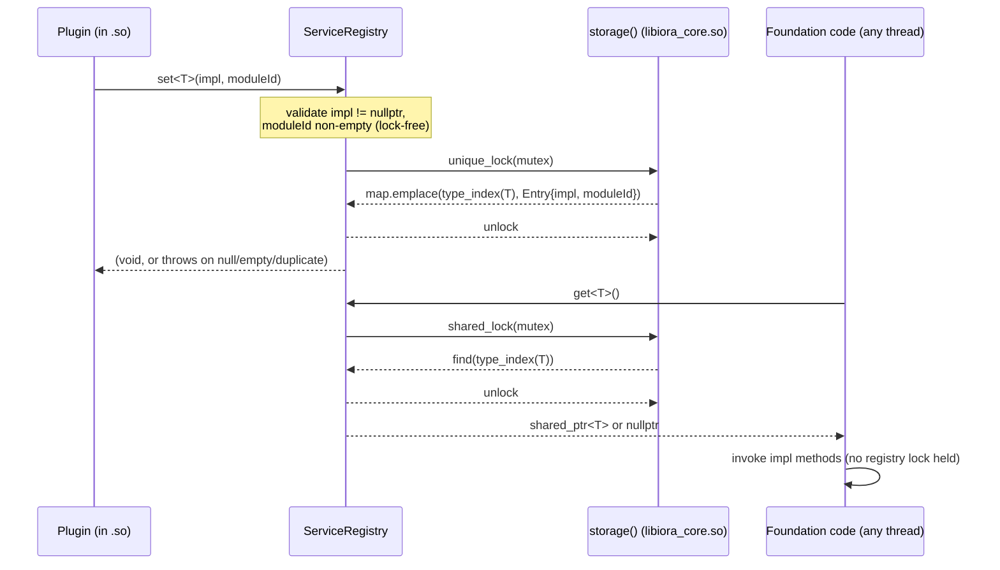

# Iora ServiceRegistry -- Architecture & Programmer's Guide

[Back to index](../../README.md)

| | |
|---|---|
| **Version** | 1.1 |
| **Date** | 2026-09-09 |
| **Status** | IMPLEMENTED |
| **Header** | `include/iora/core/service_registry.hpp` |
| **Compiled unit** | `src/core/iora_core.cpp` (defines `ServiceRegistry::storage()`, compiled once into `libiora_core.so`) |
| **Namespace** | `iora` |
| **Dependencies** | Standard library only -- `<cstdlib>`, `<memory>`, `<mutex>`, `<shared_mutex>`, `<stdexcept>`, `<string>`, `<typeindex>`, `<typeinfo>`, `<unordered_map>`, `<vector>` -- plus one intra-Iora header, `iora/core/logger.hpp` (for the AH-2 survivor-abort log line). No external/third-party dependencies. |

---

## Revision History

| Version | Date | Changes |
|---|---|---|
| 1.0.0 | 2026-05-29 | Initial implementation guide (combined `ServiceRegistry` + `iora::web` middleware interface contracts) in `coding_trackers/docs/iora/service_registry.md`. |
| 1.1 | 2026-09-09 | Migrated into the iora doc-wiki at `docs/core/service_registry.md` and restructured to the 12-section guide template. Re-verified every claim against the current `include/iora/core/service_registry.hpp` (280 lines) and against `include/iora/iora.hpp`'s plugin load/unload paths; corrected stale claims (listed in the migration report). Scope narrowed to `iora::ServiceRegistry` itself -- the four `iora::web` middleware interface contracts (`include/iora/web/middleware_interfaces.hpp`) are a separate component and are not documented here; see the frozen `coding_trackers/docs/iora/service_registry.md` for their prior combined write-up pending their own doc-wiki slice. |

---

## 1. Executive Summary

### Problem

iora foundation code (the HTTP/web layer, and other core subsystems) sometimes needs to call into a capability that an *optional, externally-built* plugin may provide -- authentication, session storage, CSRF protection, a login UI, or any other foundation-to-plugin handshake. Before this component, iora had exactly one cross-`.so` dispatch mechanism: `IoraService::callExportedApi(name, args...)`, which is **string-keyed** and aimed at user-code callers. There was no way for foundation code to ask, in a type-safe way, "is an implementation of interface `T` available?" and get back a typed pointer (or an unambiguous "no").

### Solution

`iora::ServiceRegistry` is a process-wide, type-safe, type-erased registry mapping an *interface type* to a single concrete *implementation* supplied by a plugin:

- A plugin calls `ServiceRegistry::set<T>(impl, moduleId)` inside `Plugin::onLoad`, using `getIdentity()` as `moduleId`.
- Foundation code calls `ServiceRegistry::get<T>()` at request time and receives a `std::shared_ptr<T>` -- or `nullptr` if no plugin registered one.
- Registrations are removed automatically, before `dlclose`, when the owning module unloads (`ServiceRegistry::unregisterModule`), and equally on a **failed partial load** -- both unload paths in `IoraService` (`include/iora/iora.hpp`) call it.

It **complements** (does not replace) the string-keyed `callExportedApi`.

### Technical Impact

- **O(1) average lookup** (`std::unordered_map<std::type_index, Entry>`) on the hot `get<T>()` path, under a `std::shared_mutex` read lock so concurrent readers never block each other.
- **Type safety, not string safety** -- the C++ interface *is* the contract; a missing plugin is an unambiguous `nullptr`, never a runtime string-lookup miss.
- **Zero plugin-loader changes needed** -- registration rides the existing `Plugin::onLoad` timing, and cleanup rides the existing unload/partial-load-failure paths.
- **No callback (and, as of the deferred-destruction fix below, no plugin destructor) ever runs while the registry mutex is held.**

---

## 2. System Architecture

### 2.1 Component relationships

```
iora (namespace)
`-- ServiceRegistry                       (all-static; never instantiated)
    |-- Entry                             (private nested: {impl: shared_ptr<void>, moduleId: string})
    |-- Storage                           (private nested: {map: unordered_map<type_index, Entry>, mutex: shared_mutex})
    |     `-- owned by storage()          (function-local static; DEFINED ONCE in src/core/iora_core.cpp)
    |-- coreSentinel()                    -> const std::string&  (bytes {NUL,'c','o','r','e'}, size()==5)
    `-- friend ServiceRegistryTestAccess  (test-only; struct body lives only in
                                            tests/web/service_registry_test_access.hpp -- production
                                            translation units that include the header see only an
                                            incomplete, uncallable type)

Consumers (outside this component; shown for context -- see include/iora/iora.hpp):
  IoraService::Plugin::onLoad()                      --calls-->  ServiceRegistry::set<T>(impl, moduleId)
  IoraService::teardownModuleHostSideLocked()        --calls-->  ServiceRegistry::unregisterModule(name)
                                                                   (the full-unload path, via unloadSingleModule)
  IoraService::cleanupPartialLoadLocked()            --calls-->  ServiceRegistry::unregisterModule(name)
                                                                   (a FAILED loadSingleModule -- partial-load cleanup)
  Foundation / request-handling code (any thread)    --calls-->  ServiceRegistry::get<T>()
  Plugin::onUnload() (optional, belt-and-suspenders) --calls-->  ServiceRegistry::unregister<T>()
```

The crucial property: the `set`/`get`/`unregister`/`unregisterModule` bodies are header-only and compiled into *every* `.so` that includes the header, but they all call `ServiceRegistry::storage()`, which is defined **exactly once** in `libiora_core.so`. Every translation unit and every plugin resolves `storage()` to the same `Storage` object, so a plugin's `set<T>()` and the foundation's `get<T>()` operate on one shared map.

### 2.2 Data flow -- registration then retrieval



### 2.3 Type erasure

The map is `std::unordered_map<std::type_index, Entry>` where `Entry { std::shared_ptr<void> impl; std::string moduleId; }`. `set<T>` stores `std::static_pointer_cast<void>(impl)`; `get<T>` recovers it with `std::static_pointer_cast<T>`. This is sound because the slot is keyed by `std::type_index(typeid(T))` -- only a `set<T>` ever writes a slot a `get<T>` reads. Cross-`.so` `type_index` equality (and callable vtables) require **default symbol visibility + RTTI + same toolchain** -- the same precondition iora's `ApiWrapper` already relies on (see Design Decisions, R-12).

### 2.4 Threading model

| Thread | Responsibility |
|---|---|
| Plugin-load thread, inside `Plugin::onLoad` (called under `IoraService::_loadModulesMutex`) | Calls `set<T>(impl, moduleId)` (or the core-internal `set<T>(impl)`) -- takes `Storage::mutex` as a **unique** (write) lock; rare, load-time only. |
| Plugin-unload thread, inside `teardownModuleHostSideLocked` (full unload, via `unloadSingleModule`) or `cleanupPartialLoadLocked` (a failed `loadSingleModule`) -- both run under `_loadModulesMutex` | Calls `unregisterModule(moduleId)` -- takes `Storage::mutex` as a unique lock, moves the matched impls out, releases the lock, then destructs the moved-out impls off-lock. |
| Any request-servicing / worker thread (the common case) | Calls `get<T>()` -- takes `Storage::mutex` as a **shared** (read) lock; the hot path, most frequent caller. |
| Plugin's own `onUnload()` (optional, belt-and-suspenders) | May call `unregister<T>()` for one interface -- takes `Storage::mutex` as a unique lock. |

A single `std::shared_mutex` in the shared `Storage` guards the map. `get<T>()` is the hot path (shared/read lock); `set`/`unregister`/`unregisterModule` are rare (unique/write lock, only at plugin load/unload). `get<T>()` returns the `shared_ptr` *by value*, and the caller then invokes interface methods with **no registry lock held**. Full detail in section 7.

---

## 3. Component Deep Dive

### 3.1 Overview and private nested types

`ServiceRegistry` is a class of `static` template methods over one shared `Storage` instance. It is never instantiated. Its `Entry` and `Storage` types are `private` nested types -- only `ServiceRegistry`'s own methods and the out-of-line `storage()` definition can name them:

```cpp
struct Entry
{
  std::shared_ptr<void> impl;
  std::string moduleId;
};

struct Storage
{
  std::unordered_map<std::type_index, Entry> map;
  std::shared_mutex mutex;
};

static Storage &storage();   // declared in the header, defined once in src/core/iora_core.cpp
```

`storage()` is a **non-inline** definition, compiled exactly once into `libiora_core.so`. Plugins are loaded `RTLD_NOW | RTLD_LOCAL`. A header-inline `static` map would be emitted **per `.so`**, so the foundation (in `libiora_core.so`) and a plugin would mutate *different* maps and `get<T>()` would never find what a plugin's `set<T>()` stored. The fix mirrors every other iora cross-`.so` singleton (`IoraService::getInstancePtr`, `MetricsRegistry::instance`): a non-inline accessor defined once in `iora_core.cpp`. This is the **single deliberate exception** to iora's header-only character for this component -- only the storage accessor is compiled; the templates stay header-only.

### 3.2 `coreSentinel()`

Core-internal registrations (made by iora itself, never unloaded) are tagged with a reserved `moduleId` that can never collide with a real plugin name (a printable `.so` filename):

```cpp
static const std::string &coreSentinel()
{
  static const std::string sentinel("\x00core", 5);   // {NUL,'c','o','r','e'}, size()==5
  return sentinel;
}
```

**Gotcha.** The sentinel **must** be built with an explicit length. `std::string s = "\x00core";` constructs from a `const char*` and truncates at the embedded NUL, yielding an *empty* string -- which would silently disable the orphan-survivor guard described in 3.7. The `("\x00core", 5)` two-argument constructor preserves all five bytes. `storage()` and `coreSentinel()` are function-local statics (C++11 "magic statics"), thread-safe to initialize on first use.

### 3.3 `set<T>(impl, moduleId)` -- plugin-facing registration

1. **Lock-free validation, before any lock:** throws `std::invalid_argument` if `impl == nullptr`; throws `std::invalid_argument` if `moduleId.empty()` -- `moduleId` is mandatory; this set-time rejection is the *primary* guard against orphaned registrations (see 3.7's AH-2 survivor check).
2. Computes `key = std::type_index(typeid(T))`.
3. Acquires a `std::unique_lock<std::shared_mutex>` over `storage().mutex`.
4. If `key` is already present, throws `std::runtime_error` (duplicate-set is a bug, consistent with `exportApi`; **not** a silent replace).
5. Stores `Entry{ std::static_pointer_cast<void>(std::move(impl)), moduleId }` via `map.emplace`.

### 3.4 `set<T>(impl)` -- core-internal overload

Delegates to the two-argument form with `coreSentinel()` as the `moduleId`. The sentinel is non-empty, so the empty-`moduleId` guard passes. **Plugin code must not call this overload** -- entries it creates are process-lifetime (iora core never unloads) and are exempt from the survivor check in 3.7 because they carry the non-empty sentinel. Same null/duplicate semantics as 3.3.

### 3.5 `get<T>()` -- retrieval (hot path)

1. Computes `key`.
2. Acquires a `std::shared_lock<std::shared_mutex>` over `storage().mutex`.
3. Looks up `key`; if absent, returns `nullptr` (a runtime condition, **not** an exception); if present, returns `std::static_pointer_cast<T>(entry.impl)`.
4. The shared lock releases on return; the returned `shared_ptr` keeps the object alive for the caller, who then uses it lock-free.

### 3.6 `unregister<T>()` -- single-interface removal

Computes `key`; acquires the unique lock; `map.erase(key)`; returns `true` if an entry was removed, `false` if none was present. A plugin may call this in `onUnload` to clear one interface before `dlclose`. It is symmetric in spirit to how `removeExportsForModule` clears a module's API exports before `dlclose`, though that path removes every export owned by a module in bulk rather than one interface at a time; the authoritative bulk cleanup for `ServiceRegistry` is `unregisterModule` (3.7), called automatically by the core.

### 3.7 `unregisterModule(moduleId) noexcept` -- bulk cleanup (authoritative)

Removes **all** registrations owned by `moduleId`. Called automatically by `IoraService`'s unload paths (`teardownModuleHostSideLocked`, on both the full-unload and the failed-partial-load routes -- see section 5) with the plugin's name, **before `dlclose`**. Idempotent: a module with zero registrations is a no-op.

```cpp
static void unregisterModule(const std::string &moduleId) noexcept
{
  Storage &s = storage();
  std::vector<std::shared_ptr<void>> deferred;
  {
    std::unique_lock<std::shared_mutex> lock(s.mutex);
    deferred.reserve(s.map.size());
    for (auto it = s.map.begin(); it != s.map.end();)
    {
      if (it->second.moduleId == moduleId)
      {
        deferred.push_back(std::move(it->second.impl));
        it = s.map.erase(it);
      }
      else
      {
        if (it->second.moduleId.empty())
        {
          IORA_LOG_ERROR("ServiceRegistry::unregisterModule: orphaned registration with empty "
                         "moduleId survives unload of '" + moduleId + "' ...");
          std::abort();
        }
        ++it;
      }
    }
  }
  // deferred destructs HERE, off Storage::mutex.
}
```

**Deferred destruction (TS-M1).** Each matched `Entry.impl` is a `shared_ptr` to a plugin service object. If the erase drops the last reference (typical during teardown, when no `get<T>()` caller still holds one), the object's destructor -- plugin code -- runs. Running that destructor while `Storage::mutex` is held would let a re-entrant destructor (one that calls `get<T>()`/`unregister<T>()`, which take this same **non-recursive** `shared_mutex`) self-deadlock. `unregisterModule` therefore moves each matched impl into a local `std::vector` reserved to the map's size (one allocation, so the per-match moves never reallocate or throw -- keeping this `noexcept` path allocation-free during teardown), erases the moved-from `Entry` (an empty `shared_ptr` -- no plugin destructor runs on-lock), releases the lock, and only then lets the `deferred` vector -- and with it every plugin object -- destruct.

**AH-2 survivor check.** While iterating under the write lock, any *surviving* entry with an **empty** `moduleId` is an orphan owned by no module (it would dangle after `dlclose`), so the function logs an error and calls `std::abort()`. Plugin entries are non-empty (rejected at set time by 3.3's H-2 guard) and core entries carry the non-empty sentinel, so neither can reach this branch through the public API -- the guard fires only on state injected outside the API.

**Why `noexcept` + `std::abort()`, never `throw`.** `unregisterModule` runs inside the `try` block of the module-teardown path, before `dlclose`. A thrown exception would be swallowed by that block's `catch` and **skip `dlclose`**, leaking the module with its vtable still mapped. Aborting is `NDEBUG`-independent (unlike `assert`), so the guard fires in release builds too.

### 3.8 Test-only access hook

`ServiceRegistry` declares `friend struct ServiceRegistryTestAccess;` as its only non-public extension point. The H-2 set-time empty-`moduleId` rejection (3.3) makes the AH-2 survivor-abort path in 3.7 unreachable through the public API, so exercising that defensive guard requires injecting an empty-`moduleId` entry directly into `storage()`. Only the *grant* lives in the production header (a friend declaration of an incomplete type); the struct's body is defined solely in the test-only header `tests/web/service_registry_test_access.hpp`, so production translation units that include `service_registry.hpp` gain no usable capability from it -- they see only an incomplete type they cannot call.

---

## 4. Usage Guide

### 4.1 A plugin registers an implementation

```cpp
#include "iora/iora.hpp"
#include "iora/web/middleware_interfaces.hpp"

class MyAuthGuard : public iora::web::IAuthGuard
{
public:
  std::optional<iora::web::Identity>
  authenticate(const iora::network::HttpServer::Request &req) override
  {
    // ... validate req, return an Identity on success, std::nullopt otherwise.
    return std::nullopt;
  }
};

class MyMiddlewarePlugin : public iora::IoraService::Plugin
{
public:
  using Plugin::Plugin;

  void onLoad(iora::IoraService *) override
  {
    iora::ServiceRegistry::set<iora::web::IAuthGuard>(
        std::make_shared<MyAuthGuard>(), getIdentity());   // getIdentity() == the .so name
  }

  void onUnload() override
  {
    // Nothing required -- the core unregisters this module's entries automatically
    // before dlclose. See 4.4 for the optional belt-and-suspenders form.
  }
};
IORA_DECLARE_PLUGIN(MyMiddlewarePlugin)
```

### 4.2 Foundation code retrieves and uses it

```cpp
auto guard = iora::ServiceRegistry::get<iora::web::IAuthGuard>();
if (!guard)
{
  // No auth plugin configured -- degrade gracefully (e.g. requireBasicAuth, or 503).
}
else
{
  if (auto id = guard->authenticate(req))
  {
    // id->subject, id->claims
  }
  else
  {
    // challenge / redirect to login / 401
  }
}
```

### 4.3 Two independent interfaces are tracked separately

```cpp
// Registering (and later retrieving) IAuthGuard and ISessionStore does not
// interfere -- each interface type is its own map slot.
iora::ServiceRegistry::set<iora::web::IAuthGuard>(std::make_shared<MyAuthGuard>(), getIdentity());
iora::ServiceRegistry::set<iora::web::ISessionStore>(std::make_shared<MySessionStore>(), getIdentity());

auto authOnly = iora::ServiceRegistry::get<iora::web::IAuthGuard>();     // non-null
auto sessOnly = iora::ServiceRegistry::get<iora::web::ISessionStore>();  // non-null, independent
```

### 4.4 Optional belt-and-suspenders unregister in `onUnload`

```cpp
void MyMiddlewarePlugin::onUnload()
{
  // Not required -- IoraService::unregisterModule(getIdentity()) runs automatically
  // before dlclose regardless. Calling unregister<T>() here only removes the entry
  // slightly earlier, and only for this one interface.
  iora::ServiceRegistry::unregister<iora::web::IAuthGuard>();
}
```

### 4.5 Anti-patterns

| Do | Don't |
|---|---|
| Register in `onLoad` with `getIdentity()` as `moduleId`. | Call the no-`moduleId` `set<T>(impl)` overload from a plugin -- it is core-internal and its entries are never auto-cleaned. |
| Treat `get<T>() == nullptr` as "capability absent" and degrade. | Assume a plugin is present; an optional capability is `nullptr`, not an exception. |
| Hold a `get<T>()` result only for the duration of one request handler. | Cache a `get<T>()` result across a module unload -- see section 6, the vtable-lifetime hazard. |
| Register once per interface type per process. | Call `set<T>` twice for the same `T` expecting a silent replace -- the second call throws `std::runtime_error`. |
| Let the core unload hook (`unregisterModule`) do the authoritative cleanup. | Rely on a plugin's own `unregister<T>()` call as the *only* cleanup -- it is optional and per-interface, not the safety net. |

---

## 5. Call Flow / Sequence Reference

### 5.1 Registration (success path, at plugin load)

| Step | Actor | Action | Lock state |
|---|---|---|---|
| 1 | `IoraService::loadSingleModule` | Calls `plugin->onLoad(this)`, itself running under `_loadModulesMutex`. | `_loadModulesMutex` held |
| 2 | Plugin's `onLoad` | Calls `ServiceRegistry::set<T>(impl, getIdentity())`. | (registry lock not yet taken) |
| 3 | `set<T>` | Validates `impl != nullptr` and `!moduleId.empty()`. | no lock (lock-free validation) |
| 4 | `set<T>` | Acquires `std::unique_lock<std::shared_mutex>` on `storage().mutex`. | registry write lock acquired |
| 5 | `set<T>` | Looks up `key`; absent, so proceeds. | registry write lock held |
| 6 | `set<T>` | `map.emplace(key, Entry{impl, moduleId})`. | registry write lock held |
| 7 | `set<T>` | Lock released on scope exit; returns to `onLoad`. | registry write lock released |

### 5.2 Registration -- failure path (duplicate type)

| Step | Actor | Action | Lock state |
|---|---|---|---|
| 1-4 | as above | Validation passes, write lock acquired. | registry write lock held |
| 5 | `set<T>` | Looks up `key`; **already present**. | registry write lock held |
| 6 | `set<T>` | Throws `std::runtime_error("... type already registered ...")`. | registry write lock released (RAII unwind) |
| 7 | Caller (`onLoad`) | Exception propagates; `IoraService::loadSingleModule` treats a throwing `onLoad` as a load failure and runs its partial-load cleanup path (`cleanupPartialLoadLocked`), which itself calls `ServiceRegistry::unregisterModule(name)` -- removing any *other* entries the same `onLoad` may already have registered before the throw. | registry write lock re-acquired then released inside `unregisterModule` |

### 5.3 Retrieval (request time)

| Step | Actor | Action | Lock state |
|---|---|---|---|
| 1 | Handler / worker thread | Calls `ServiceRegistry::get<T>()`. | no lock yet |
| 2 | `get<T>` | Acquires `std::shared_lock<std::shared_mutex>` on `storage().mutex`. | registry read lock acquired |
| 3 | `get<T>` | `map.find(key)`. | registry read lock held |
| 4 | `get<T>` | Present: `static_pointer_cast<T>`; absent: prepares to return `nullptr`. | registry read lock held |
| 5 | `get<T>` | Lock released on return; `shared_ptr<T>` (or `nullptr`) returned by value. | registry read lock released |
| 6 | Caller | Invokes interface methods on the returned pointer. | **no registry lock held** |

### 5.4 Unload / cleanup (both the full-unload and partial-load-failure routes call the same primitive)

| Step | Actor | Action | Lock state |
|---|---|---|---|
| 1 | `IoraService::unloadSingleModule` | Drains in-flight `callExportedApi` calls for the module, then calls `teardownModuleHostSideLocked(name, true)` under `_loadModulesMutex`. (A failed `loadSingleModule` instead calls `cleanupPartialLoadLocked(name)`, also under `_loadModulesMutex`; both converge on the same `unregisterModule` call.) | `_loadModulesMutex` held |
| 2 | `teardownModuleHostSideLocked` | Calls `plugin->onUnload()` (full-unload path only). | `_loadModulesMutex` held |
| 3 | `teardownModuleHostSideLocked` | Calls `removeExportsForModule(name)` -- an atomic, owner-checked erase over `_apiToModule`, tearing down every `callExportedApi` export the module owns. | `_loadModulesMutex` held; briefly takes and releases `_apiMutex` |
| 4 | `teardownModuleHostSideLocked` / `cleanupPartialLoadLocked` | Calls `ServiceRegistry::unregisterModule(name)`. | registry unique lock acquired, matched impls moved out, lock released, then impls destruct off-lock (3.7) |
| 5 | `teardownModuleHostSideLocked` | `_loadedModules.erase(it)` (invalidates the iterator -- must run *after* step 4, which uses only the `name` string copy, never the iterator/pointer). | `_loadModulesMutex` held |
| 6 | `unloadSingleModule` | On success, calls `PluginManager::unloadPlugin(name)` -> `dlclose`, **after** every host-side destroy from steps 2-5 has run while the `.so` was still mapped. | `_loadModulesMutex` held |

`unregisterModule` is placed **after** `removeExportsForModule` and **before** the `_loadedModules` erase and `dlclose`, and it is called with `name` -- a string copy, never the about-to-be-invalidated plugin pointer -- on both the full-unload route and the partial-load-failure route.

---

## 6. Lifetime Hazard & the Drain-Before-Unload Invariant (RD-7)

`get<T>()` returns a `shared_ptr`, so a caller holding the result keeps the **object** alive across an `unregisterModule` call. The danger is **not** the object -- it is the impl's **vtable**, which lives in the plugin `.so` code segment and is unmapped by `dlclose`. A `shared_ptr<T>` obtained just *before* an unload and used *after* `dlclose` dereferences an unmapped vtable (undefined behavior).

Unregister-on-unload covers the registry *slot*; it does **not** close this window (the `get()` call has already returned the pointer to the caller). The window is closed only by the **drain-before-unload** invariant, stated in the header's class-level documentation: *`unloadSingleModule` must not run while the HTTP server is started; interface-providing modules unload only after `http.stop()` has fully drained in-flight handlers,* so no live `get<T>()` result exists at unload time.

This component **states and documents** that invariant; the *enforcer* of the `http.start()`/`http.stop()` ordering is the application-wiring layer, outside `ServiceRegistry` itself. There is no hot-swap of an interface-providing module while it is in active use.

---

## 7. Thread Safety Model

| Operation | Synchronization | Notes |
|---|---|---|
| `set<T>(impl, moduleId)` | Lock-free null/empty validation, then `std::unique_lock<std::shared_mutex>` on `storage().mutex`. | Exclusive; rare (plugin load only). Throws before the write lock is taken on invalid input; throws under the write lock on a duplicate type. |
| `set<T>(impl)` (core-internal) | Same as above, via delegation. | Plugin code must not call this overload. |
| `get<T>()` | `std::shared_lock<std::shared_mutex>` on `storage().mutex`. | Shared/hot path; returns the `shared_ptr` by value and releases the lock before the caller touches the object -- **no callback is ever invoked while the registry mutex is held.** |
| `unregister<T>()` | `std::unique_lock<std::shared_mutex>` on `storage().mutex`. | Exclusive; rare. |
| `unregisterModule(moduleId) noexcept` | `std::unique_lock<std::shared_mutex>` on `storage().mutex`, held only while moving matched impls into a local `std::vector` and erasing their map slots. | Exclusive; rare (module load-failure or unload only). **The moved-out impls -- and any plugin destructor they run -- destruct *after* the lock is released (TS-M1).** Holding the lock while a plugin destructor ran would let a re-entrant destructor (one calling `get<T>()`/`unregister<T>()` against the same non-recursive `shared_mutex`) self-deadlock. |

**Lock ordering.** The only edge involving the registry mutex is `IoraService::_loadModulesMutex -> ServiceRegistry::Storage::mutex`:
- *set path:* `_loadModulesMutex` is held during `onLoad`, under which `set<T>` takes the registry write lock.
- *unregister path:* `_loadModulesMutex` is held during `teardownModuleHostSideLocked` / `cleanupPartialLoadLocked`, under which `unregisterModule` takes the registry write lock.

There is **no reverse edge**: `get<T>()` takes only the shared registry lock and never `_loadModulesMutex`. For context, the surrounding load/unload code also has the edge `_loadModulesMutex -> IoraService::_apiMutex` (`removeExportsForModule`), but `_apiMutex` and the registry mutex are **never held simultaneously**: the teardown path runs `removeExportsForModule` to completion (which itself takes and releases `_apiMutex`) and only *then* calls `unregisterModule`. Hence no `_apiMutex <-> registry` edge and no cycle. Otherwise the registry mutex is a **leaf** -- never held while acquiring `HttpServer`'s internal mutex or `IoraService::_apiMutex`.

**Abort under lock.** `unregisterModule`'s AH-2 survivor guard calls `std::abort()` while holding the unique lock. This is safe: the process terminates immediately, so there is no deadlock and no further lock interaction.

**Singleton init.** `storage()` and `coreSentinel()` are function-local statics (C++11 "magic statics"), thread-safe to initialize on first use.

**Concurrency coverage (and an intentional gap).** `tests/web/test_service_registry_concurrency.cpp` covers concurrent `get` vs `get` on the same type, `get` vs `set`/`unregister` on a *different* type, and `set` followed by a concurrent burst of `get` calls observing the set. It deliberately does **not** exercise concurrent `unregisterModule` vs `get` of the *same* type: the drain-before-unload invariant (section 6, RD-7) prohibits unloading a module while the server is serving, so that race cannot occur in production.

---

## 8. Configuration Reference

There are no runtime configuration parameters. The relevant build-time invariants:

| Item | Requirement | Enforced by |
|---|---|---|
| Symbol visibility | default (no `-fvisibility=hidden`) | `cmake/AbiInvariant.cmake` -- `iora_assert_abi_invariant()` (global flags) + `iora_assert_target_abi()` (per target, invoked from `configure_iora_target` in `cmake/IoraTargets.cmake`) |
| RTTI | enabled (no `-fno-rtti`) | same |
| Toolchain | core and every interface-providing plugin built with the **same** toolchain | documented obligation; external consumers enforce it in their own CMake |

If a consumer drifts to hidden visibility or disabled RTTI, `type_index` may stop comparing equal across `.so` boundaries and `get<T>()` would silently return `nullptr` (the capability appears absent). The CMake check fails configuration on the in-tree drift paths it can see; an external repository's drift is that repository's own obligation to enforce.

`ServiceRegistry`'s own tests are gated behind `-DIORA_BUILD_WEB_TESTS=ON` (also enabled by `-DIORA_BUILD_ALL_TESTS=ON`) in `tests/CMakeLists.txt`; targets are `test_service_registry`, `test_service_registry_concurrency`, and `test_service_registry_crossso`. Run with `ctest -j1` (see the repository-wide `feedback_ctest_j1` convention).

---

## 9. API Reference

```cpp
namespace iora
{

class ServiceRegistry
{
public:
  // Plugin-facing. moduleId MANDATORY. Throws std::invalid_argument (null impl
  // or empty moduleId) before locking; std::runtime_error on duplicate type.
  template <typename T> static void set(std::shared_ptr<T> impl, const std::string &moduleId);

  // Core-internal only (stores the reserved sentinel moduleId). Plugins MUST NOT call.
  template <typename T> static void set(std::shared_ptr<T> impl);

  // Hot path. Returns the registered impl, or nullptr if none. Shared lock.
  template <typename T> static std::shared_ptr<T> get();

  // Remove one interface. Returns true if an entry was removed. Unique lock.
  template <typename T> static bool unregister();

  // Remove all entries owned by moduleId. Called by the IoraService unload /
  // partial-load-failure paths before dlclose. noexcept: aborts (never throws)
  // on an orphaned empty-moduleId entry; destructs matched impls off-lock (TS-M1).
  static void unregisterModule(const std::string &moduleId) noexcept;

private:
  struct Entry;    // { std::shared_ptr<void> impl; std::string moduleId; }
  struct Storage;  // { std::unordered_map<std::type_index, Entry> map; std::shared_mutex mutex; }
  static Storage &storage();                  // declared here, defined once in iora_core.cpp
  static const std::string &coreSentinel();   // "\x00core", explicit length 5

  friend struct ServiceRegistryTestAccess;    // test-only; body only in tests/web/
};

} // namespace iora
```

---

## 10. Design Decisions

| ID | Decision | Rationale |
|---|---|---|
| C-4 | Storage is a non-inline definition in `iora_core.cpp`; templates stay header-only. | `RTLD_LOCAL` would fork a header-inline static per `.so`, breaking cross-plugin lookup. Mirrors `getInstancePtr`/`MetricsRegistry::instance`. |
| C-5 | Registry entries are removed by a core-driven `unregisterModule(pluginName)`, called from both the full-unload path (`teardownModuleHostSideLocked`) and the partial-load-failure path (`cleanupPartialLoadLocked`), before `dlclose`. | A surviving `shared_ptr<T>` from either an unloaded module or an aborted load would dangle after the vtable is unmapped. |
| RD-6 | `set<T>(impl, moduleId)` is the only plugin-facing form (`moduleId` mandatory); the core overload uses the sentinel `"\x00core"`; `Entry`/`Storage` are private nested types; the null/empty check is lock-free. | Removes the orphaned-registration hole; encapsulates storage. |
| RD-7 | Drain-before-unload is a hard invariant; documented on the class, enforced by application-wiring. | Closes the `get()`-racing-unload vtable window that unregister-on-unload alone cannot. |
| M-10 | Duplicate `set<T>` throws `std::runtime_error`; `set<T>(nullptr)` throws `std::invalid_argument`. | Consistent with `exportApi`; a second registration is a bug, not a silent replace; `get() == nullptr` unambiguously means "absent". |
| H-2 | `set<T>` rejects an empty `moduleId` at set time (lock-free). | Primary guard against orphaned entries; the survivor-abort in `unregisterModule` is belt-and-suspenders. |
| H-1 | Sentinel built with explicit length `("\x00core", 5)`. | A bare `const char*` would truncate at the embedded NUL, silently producing an empty sentinel. |
| M-3 | `unregisterModule` is `noexcept` and aborts (never throws) on a survivor violation. | It runs inside the unload/partial-load `try` block before `dlclose`; a throw would be swallowed and skip `dlclose`, leaking the module. |
| TS-M1 | `unregisterModule` moves each matched `Entry.impl` into a local `std::vector` under the write lock, erases the moved-from `Entry`, releases the lock, then lets the vector destruct. | A last-reference drop under `Storage::mutex` would run the plugin object's destructor on-lock; a re-entrant destructor calling `get<T>()`/`unregister<T>()` against the same non-recursive `shared_mutex` would self-deadlock. |
| R-3 / R-12 | Direct `shared_ptr<T>` across `.so`, no `extern "C"` proxy; same-toolchain/default-visibility/RTTI invariant, CMake-enforced. | iora already relies on cross-`.so` `type_index` for `ApiWrapper`; a proxy would add complexity for an invariant iora already meets. |

---

## 11. Known Limitations

- **No hot-swap.** Modules load at startup and unload at shutdown (or on a failed load). Runtime unload *is* supported by the code path, but unloading an interface-providing module while requests are in flight is not -- the drain-before-unload ordering (section 6, RD-7) is the guarantee, and its enforcement lives outside `ServiceRegistry`.
- **Single-toolchain ABI precondition.** Direct `shared_ptr<T>` across `.so` boundaries requires core and every interface-providing plugin to share toolchain, default symbol visibility, and RTTI. CMake-enforced for in-tree drift; an external consumer that drifts makes `get<T>()` silently return `nullptr` instead of failing loudly.
- **One implementation per interface type.** Duplicate `set<T>` throws; there is no multi-provider / chain-of-responsibility for a single interface.
- **`get<T>()`'s vtable lifetime is bound to the plugin `.so`, not the `shared_ptr` refcount.** Holding a result across a module unload keeps the object alive but its vtable is unmapped by `dlclose`. This is prevented by ordering (drain-before-unload), not by the type system.
- **This guide documents `ServiceRegistry` only.** The four `iora::web` interface contracts that motivated it (`IAuthGuard`, `ISessionStore`, `ICsrfProtector`, `ILoginUiProvider`, in `include/iora/web/middleware_interfaces.hpp`) are a separate component with their own conformance-fixture tests (`tests/web/conformance/*.hpp`), which exercise concrete *implementations* and so run only in a consuming plugin's own CI -- not in iora's gate. `ServiceRegistry`'s own tests (unit, concurrency/TSAN, cross-`.so`) do run in iora's gate. A dedicated guide for the middleware interfaces is not yet part of the doc-wiki; the prior combined write-up remains at `coding_trackers/docs/iora/service_registry.md`.
- **The registry is general-purpose but currently has one production consumer group.** The `set<T>`/`get<T>` pattern generalizes to any future foundation-to-plugin handshake; today it is exercised in-tree only by the `iora::web` middleware interfaces described above.
