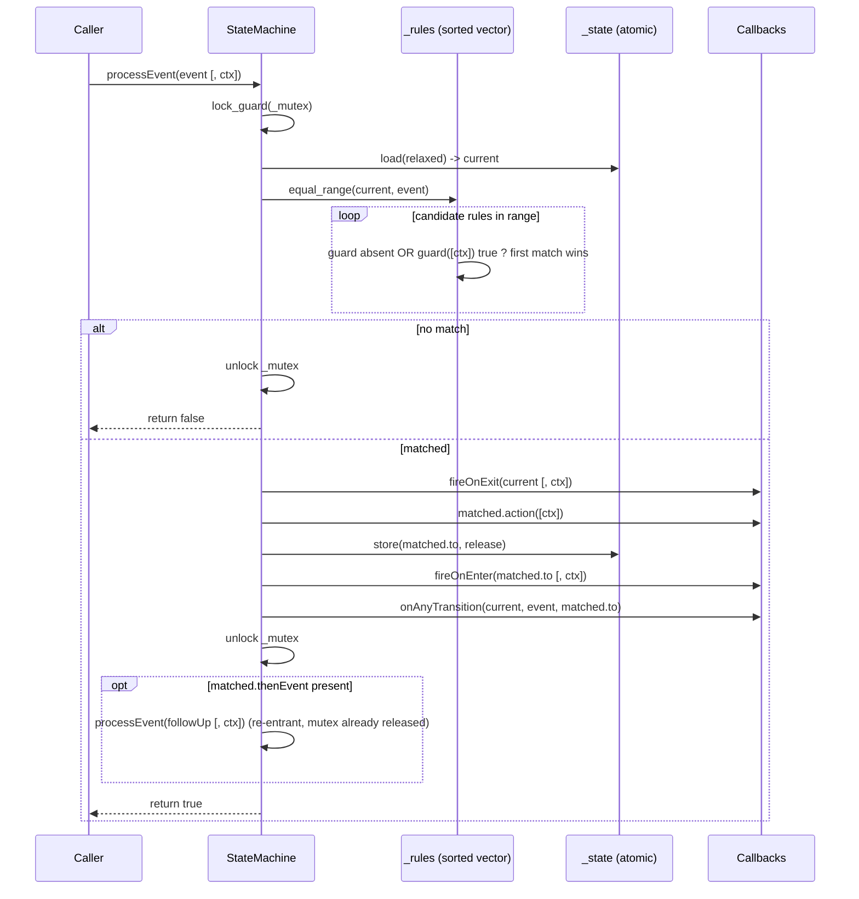
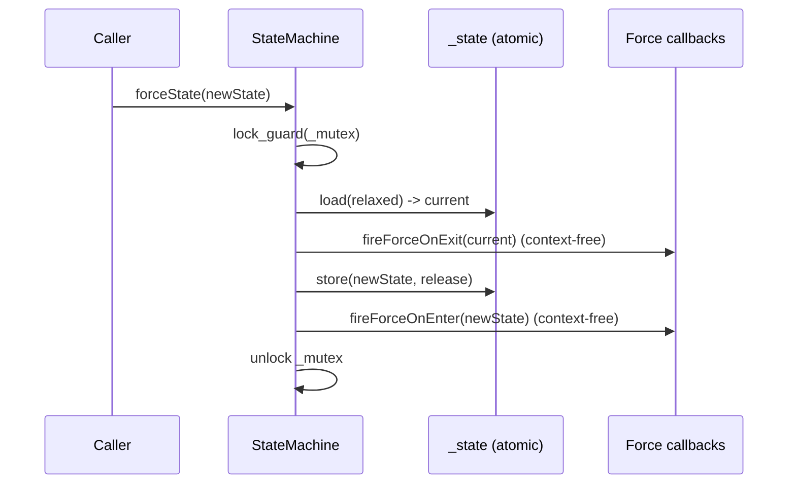
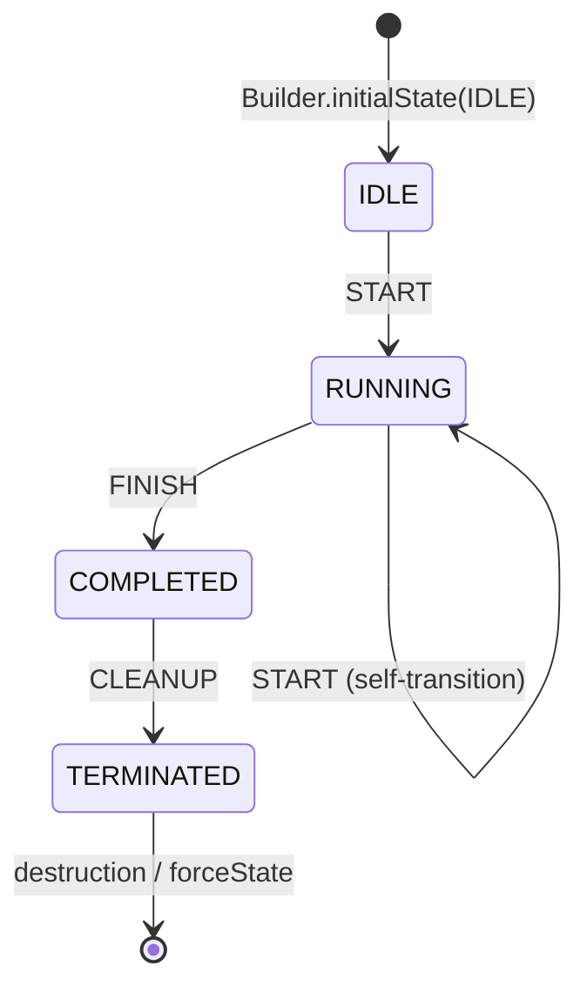

# Iora StateMachine -- Architecture & Programmer's Guide

[Back to index](../../README.md)

| | |
|---|---|
| **Version** | 3.1 |
| **Date** | 2026-09-10 |
| **Status** | IMPLEMENTED |
| **Header** | `include/iora/core/state_machine.hpp` |
| **Namespace** | `iora::core` |
| **Dependencies** | Standard library only -- `<algorithm>`, `<atomic>`, `<functional>`, `<mutex>`, `<optional>`, `<stdexcept>`, `<type_traits>`, `<utility>`, `<vector>`. Header-only, single class template, no intra-Iora and no external/third-party dependencies. |

---

## Revision History

| Version | Date | Changes |
|---|---|---|
| 1.0 | 2026-03-20 | Initial implementation. |
| 1.1 | 2026-03-20 | Added `thenEvent` compound transitions, `forceState` context-free callbacks, `onAnyTransition` observer. |
| 2.0 | 2026-03-20 | Rewritten as a full Architecture & Programmer's Guide (published as `coding_trackers/docs/iora/state_machine.md`). |
| 3.1 | 2026-09-10 | CP-3 doc-review: comparator dedup (behavior-preserving) landed; move-ctor-elision wording, CD-1 citation, Mermaid caption, and observer-separability corrected; callbacks-under-lock/thenEvent tracked (2026-09-10-23). |
| 3.0 | 2026-09-10 | Migrated to `docs/core/state_machine.md` and **fully re-verified against `include/iora/core/state_machine.hpp` (433 lines)** and `tests/core/iora_test_state_machine.cpp` (21 `TEST_CASE`s). Reformatted to the 12-section template with contiguous numbered sections and the `[Back to index]` link; **API Reference moved to the last substantive slot**. Drift corrected: (a) the "No self-transitions" limitation was wrong -- self-transitions *are* supported and fire `onExit` then `onEnter` (verified by `SM: self-transition fires onExit and onEnter`); reframed as a supported behavior. (b) Clarified that `onAnyTransition` fires **after** `onEnter`, still **under the mutex** (header lines 263-270), not merely "after the action". (c) Added an explicit state-transition diagram and the object-lifecycle / move-semantics coverage. (d) Added two labelled **CANDIDATE DEFECTs** to Known Limitations: user callbacks invoked while `_mutex` is held (copy-then-invoke deviation) and the non-atomic multi-leg `thenEvent` compound transition. No code was changed by this migration. |

---

## 1. Executive Summary

### Problem

The Karoo codebase repeatedly hand-rolls finite state machines -- SIP transaction handling, dialog and call-state management, registration and session lifecycle. Each hand-rolled FSM is an ad-hoc `switch`/`case` over a state enum with per-module quirks: forgotten transitions, inconsistent guard ordering, absent or bolted-on thread safety, and no separation between the *transition table* (the data) and the *execution engine* (the code that runs exit/action/enter in the right order). Adding one state means editing several `switch` blocks across several files, and the bugs that slip through are exactly the ones a generic, tested primitive would prevent.

### Solution

`iora::core::StateMachine<StateEnum, EventEnum, Context>` is a single-header, generic, type-safe FSM with a fluent builder:

- **Builder-only construction.** `StateMachine` has a deleted default constructor and a private member constructor; the only way to obtain one is `StateMachine::Builder().…​.build()`. `build()` validates that an initial state was set (else `std::logic_error`) and produces an immutable, pre-sorted transition table.
- **Flat sorted vector + `std::equal_range`.** Transition rules live in one contiguous `std::vector<TransitionRule>`, `std::stable_sort`-ed by `(from, event)`. Lookup is a binary search to the matching range followed by a short linear scan of that range's guards -- cache-local and allocation-free at run time.
- **Context-aware and context-free callbacks.** When `Context` is non-`void`, guards/actions/`onEnter`/`onExit` receive `const Context&`; when `Context` is `void` they take no argument. `forceState` uses a *separate* pair of context-free callbacks (`onEnterForce`/`onExitForce`) because it carries no event payload.
- **Compound transitions (`thenEvent`).** A rule may name a follow-up event; after the primary transition fully completes, the mutex is released and `processEvent` is re-entered for the follow-up -- multi-leg transitions without a `std::recursive_mutex`.
- **Atomic state, mutex-serialized transitions.** The current state is a `std::atomic<StateEnum>` readable lock-free from any thread (`currentState()`); every transition runs under a single `std::mutex`, so exactly one transition executes at a time.

### Technical Impact

- **O(log N) rule lookup** via `std::equal_range` over the sorted vector (N = number of transition rules), then a linear scan bounded by the number of rules sharing one `(from, event)` pair.
- **Lock-free state polling.** `currentState()` / `isInState()` are `noexcept` atomic `acquire` loads; a monitoring thread never contends on the transition mutex.
- **Deterministic guard priority without priority integers.** `stable_sort` preserves Builder insertion order within one `(from, event)` group; the first guard that passes wins.
- **Zero run-time allocation on the hot path.** Rule storage is built once; `processEvent` allocates nothing (it scans the pre-built vector and invokes `std::function`s already held).
- **`const void&` sidestep at compile time.** A `ContextTypes` partial specialization selects the callback signatures so the ill-formed `const void&` reference is never instantiated.

---

## 2. System Architecture

### 2.1 Component relationships

```
iora::core
`-- StateMachine<StateEnum, EventEnum, Context = void>   (public class template; deleted default ctor, non-copyable, move-constructible)
    |
    |-- Builder  (public nested class -- the ONLY way to construct a StateMachine)
    |   |-- initialState / transition / guard / onTransition / thenEvent
    |   |-- onEnter / onExit / onEnterForce / onExitForce / onAnyTransition
    |   `-- build() -> stable_sort(_rules by (from,event)) -> private StateMachine ctor
    |
    |-- TransitionRule  (private struct)
    |   |-- from   : StateEnum
    |   |-- event  : EventEnum
    |   |-- to     : StateEnum
    |   |-- guard  : GuardFn                 (optional; context-aware)
    |   |-- action : ActionFn                (optional; context-aware)
    |   `-- thenEvent : std::optional<EventEnum>
    |
    |-- ContextTypes<C>  (private template + void specialization)
    |   |-- primary   (C != void): GuardFn = function<bool(const C&)>, ActionFn/EnterExitFn = function<void(const C&)>
    |   `-- specialization (C == void): GuardFn = function<bool()>,   ActionFn/EnterExitFn = function<void()>
    |
    |-- Runtime state
    |   |-- _rules   : std::vector<TransitionRule>        (immutable after build)
    |   |-- _state   : std::atomic<StateEnum>             (acquire/release)
    |   `-- _mutex   : mutable std::mutex                 (serializes processEvent + forceState)
    |
    `-- Callback tables
        |-- _onEnter / _onExit             : std::vector<std::pair<StateEnum, EnterExitFn>>   (context-aware; for processEvent)
        |-- _forceOnEnter / _forceOnExit   : std::vector<std::pair<StateEnum, VoidFn>>        (context-free; for forceState)
        `-- _onAnyTransition               : TransitionLogFn = function<void(StateEnum, EventEnum, StateEnum)>  (single observer)
```

The three template parameters are `StateEnum` (an `enum class` of states), `EventEnum` (an `enum class` of events), and `Context` (an optional event-payload type, default `void`). State and event enums need only support `operator<` on their underlying values -- which the compiler provides for any `enum class` -- because the comparator sorts and searches by `(from, event)`.

### 2.2 Data flow -- `processEvent`



All steps from `fireOnExit` through `onAnyTransition` execute **while `_mutex` is held** (header lines 237-271 / 288-320). Only the `thenEvent` re-entry happens after the lock is released.

### 2.3 Data flow -- `forceState`



`forceState` never consults `_rules`, never evaluates a guard, and never fires an action or `onAnyTransition`. It fires only the context-free force callbacks.

### 2.4 Threading model

| Thread | Responsibility |
|---|---|
| **Transition caller(s)** | Call `processEvent` / `forceState`. Each takes `_mutex`, so transitions are fully serialized; exactly one runs at a time. Any number of threads may call, but they queue on the mutex. |
| **Observer / poller(s)** | Call `currentState` / `isInState`. Lock-free atomic `acquire` loads; never take `_mutex`; safe concurrently with an in-progress transition (will observe either the pre- or post-commit state). |
| **Constructing thread** | Builds via `Builder`; `build()` returns the `StateMachine` by value (C++17 mandatory copy elision -- no move is invoked). Construction is single-threaded by contract (section 7.4). |

`StateMachine` owns no background thread; it is a passive primitive.

---

## 3. Component Deep Dive

### 3.1 `Builder` -- the only constructor path

`Builder` is a public nested class. `StateMachine`'s default constructor is `= delete` and its value constructor is private, so the *only* route to a live machine is `Builder::build()` (verified by every test, all of which start from `StateMachine<...>::Builder()`).

Every Builder method returns `Builder&` for fluent chaining. `guard`, `onTransition`, and `thenEvent` mutate **the most recently added rule** via `_rules.back()`:

```cpp
Builder& guard(GuardFn fn)
{
  if (!_rules.empty())
  {
    _rules.back().guard = std::move(fn);
  }
  return *this;
}
```

If called before any `transition(...)`, they are **silent no-ops** (the `!_rules.empty()` guard) -- defensive, not an error (section 12).

`build()` does three things (header lines 179-203):

1. Throws `std::logic_error` if `initialState(...)` was never called (verified by `SM: build() throws if initialState not set`).
2. Applies `std::stable_sort` to `_rules`, ordering by `(from, event)` on the underlying enum values. **Stable** sort is load-bearing: rules sharing one `(from, event)` keep their Builder insertion order, which is exactly the guard-priority order (section 3.3).
3. Moves all collected data into the private `StateMachine` constructor and returns the machine by value.

After `build()`, the Builder's internal vectors are moved-from; do not reuse it (section 12).

### 3.2 Transition table -- flat vector + `equal_range`

Rules are stored in `std::vector<TransitionRule>` and searched with `std::equal_range` using the **same comparator that sorted them**. Both `Builder::build()`'s `stable_sort` and `findRules()`'s `equal_range` pass the single static `StateMachine::ruleLess`, so the sort order and the search order can never drift apart:

```cpp
TransitionRule key{state, event, {}, nullptr, nullptr, std::nullopt};
return std::equal_range(_rules.begin(), _rules.end(), key,
  &StateMachine::ruleLess);

// ...

// Strict-weak ordering on (from, event) -- the single source of truth.
static bool ruleLess(const TransitionRule& a, const TransitionRule& b)
{
  if (a.from != b.from)
  {
    return a.from < b.from;
  }
  return a.event < b.event;
}
```

`equal_range` yields the `[begin, end)` iterator pair bracketing every rule whose `(from, event)` equals the current `(state, event)`. For a typical protocol FSM (10-30 rules) this is a handful of comparisons followed by a 1-3 element guard scan -- lower constant factors and better cache locality than an `std::unordered_map` keyed on a combined `(state, event)` type (section 11, D-1).

### 3.3 Guards -- insertion-order priority

Within the matched range, `processEvent` selects the **first** rule whose guard is absent or returns `true`:

```cpp
const TransitionRule* matched = nullptr;
for (auto it = begin; it != end; ++it)
{
  if (!it->guard || it->guard(/*ctx*/))
  {
    matched = &(*it);
    break;
  }
}
```

Because `stable_sort` preserved Builder insertion order within the group, priority is controlled purely by the order in which you add the transitions -- no explicit priority integers. `SM: multiple guards -- insertion order` verifies that a first rule whose guard returns `false` is skipped in favor of a later rule whose guard returns `true`. If no rule matches (no `(from, event)` entry, or every guard rejected), `processEvent` returns `false` and the state is unchanged (`SM: no-match returns false, stays in state`, `SM: guard that rejects`).

### 3.4 Transition execution order

Once a rule is matched, the engine runs, **all under `_mutex`** (header lines 257-270):

1. `fireOnExit(current [, ctx])` -- every `onExit` callback registered for the *current* state, in registration order.
2. `matched->action([ctx])` -- the matched rule's action, if any.
3. `_state.store(matched->to, std::memory_order_release)` -- the state commit.
4. `fireOnEnter(matched->to [, ctx])` -- every `onEnter` callback for the *target* state.
5. `_onAnyTransition(current, event, matched->to)` -- the global observer, if registered.

`SM: onEnter and onExit fire in order` pins steps 1-2-4 as `exit_idle`, `action`, `enter_running`. Because the state is committed at step 3 (before `onEnter`), an `onEnter` callback -- or any concurrent poller -- that reads `currentState()` observes the **new** state. `SM: onAnyTransition receives correct triple` confirms the observer sees `(from=current, event, to=matched.to)`.

`fireOnEnter`/`fireOnExit` are variadic templates (`Args&&... args`): the `void`-context call site passes no argument and the context call site forwards `ctx`, so one implementation serves both (section 11, D-11).

### 3.5 `processEvent` -- the two SFINAE overloads

`processEvent` has two mutually exclusive overloads selected by `std::enable_if_t` on `std::is_void_v<Context>`:

```cpp
template<typename C = Context>
std::enable_if_t<std::is_void_v<C>, bool> processEvent(EventEnum event);

template<typename C = Context>
std::enable_if_t<!std::is_void_v<C>, bool> processEvent(EventEnum event, const C& ctx);
```

For a `void`-context machine, only the single-argument form exists; for a context-bearing machine, only the `(event, const C&)` form exists. `SM: Context-bearing processEvent` and `SM: Context guard rejects` exercise the context overload's guard and action receiving `const MyContext&`; `SM: Context-bearing onEnter/onExit receive context` confirms the context reaches the enter/exit callbacks.

### 3.6 `forceState` -- context-free escape hatch

`forceState(newState)` bypasses the transition table entirely and fires only the context-free force callbacks:

```cpp
void forceState(StateEnum newState)
{
  std::lock_guard lock(_mutex);
  auto current = _state.load(std::memory_order_relaxed);
  fireForceOnExit(current);
  _state.store(newState, std::memory_order_release);
  fireForceOnEnter(newState);
}
```

It shares `_mutex` with `processEvent`, so forced changes and event-driven transitions are mutually exclusive. Two reasons the force callbacks are a *separate* set (`_forceOnExit`/`_forceOnEnter`, type `VoidFn = std::function<void()>`):

- `forceState` carries **no event and no `Context`**, so it cannot invoke the context-aware `onEnter`/`onExit` (which expect `const Context&` on a context-bearing machine) without fabricating a dummy payload.
- It is deliberately usable **identically** on a context-bearing machine: `SM: forceState on Context-bearing FSM is context-free` shows `forceState` firing a `VoidFn` on a `StateMachine<State, Event, MyContext>`.

`SM: forceState bypasses transition table` forces a target for which no rule exists; `SM: forceState fires context-free onExitForce/onEnterForce` and `SM: forceState to same state fires onExit/onEnter` confirm both hooks fire (the latter even when `current == newState`).

### 3.7 `thenEvent` -- compound (multi-leg) transitions

A rule may declare a follow-up event. After the primary leg fully completes and **the mutex is released**, `processEvent` is re-entered for the follow-up:

```cpp
// captured inside the locked scope:
followUp = matched->thenEvent;
// ... lock_guard scope ends here (mutex released) ...
if (followUp)
{
  processEvent(*followUp);        // void-context overload
  // or processEvent(*followUp, ctx);  in the context overload
}
```

Properties (all verified by the `[then]` tests):

- **Not recursive under the lock.** The mutex is released before re-entry, so a single non-recursive `std::mutex` suffices; each leg takes and releases the lock independently. `SM: thenEvent compound transition` drives `RUNNING --FINISH--> COMPLETED --CLEANUP--> TERMINATED` from one call.
- **`onAnyTransition` fires per leg.** `SM: thenEvent + onAnyTransition ordering` asserts two observer calls, `1->2` then `2->3`.
- **Context is re-passed unchanged.** The context overload forwards the *same* `const C& ctx` to the follow-up. `SM: thenEvent with context re-passes original context` confirms both legs see `code == 42`.
- **Chainable.** A follow-up rule may itself carry a `thenEvent`, forming an arbitrary chain; each link re-acquires the lock.

Note the concurrency consequence: because the lock is dropped between legs, a compound transition is **not atomic across legs** -- another thread's `processEvent`/`forceState` can interleave. See the CANDIDATE DEFECT in section 12.

### 3.8 `ContextTypes` -- the `const void&` sidestep

The callback aliases depend on whether `Context` is `void`. A naive `std::conditional_t<std::is_void_v<Context>, std::function<bool()>, std::function<bool(const Context&)>>` does **not** work: `conditional_t` forms *both* branch types, and `const void&` is ill-formed. The header instead uses a helper with a partial specialization so only the matching branch is instantiated:

```cpp
template<typename C, typename = void>
struct ContextTypes
{
  using GuardFn = std::function<bool(const C&)>;
  using ActionFn = std::function<void(const C&)>;
  using EnterExitFn = std::function<void(const C&)>;
};

template<typename C>
struct ContextTypes<C, std::enable_if_t<std::is_void_v<C>>>
{
  using GuardFn = std::function<bool()>;
  using ActionFn = std::function<void()>;
  using EnterExitFn = std::function<void()>;
};
```

`VoidFn` (`std::function<void()>`, used by the force callbacks) and `TransitionLogFn` (`std::function<void(StateEnum, EventEnum, StateEnum)>`, used by `onAnyTransition`) are context-free regardless of `Context`.

### 3.9 Copy / move semantics

```cpp
StateMachine() = delete;                              // no default ctor
StateMachine(const StateMachine&) = delete;           // non-copyable
StateMachine& operator=(const StateMachine&) = delete;
StateMachine(StateMachine&& other) noexcept;          // move-constructible
StateMachine& operator=(StateMachine&&) = delete;     // not move-assignable
```

The machine is **move-constructible** but neither copyable nor move-assignable. The move constructor provides an accessible move ctor for completeness and for container storage; it is **not** what lets `Builder::build()` return by value -- under C++17 guaranteed copy elision, `build()`'s `return StateMachine(...)` returns a prvalue that is constructed directly into the caller's storage and does **not** invoke the move constructor. The move constructor transfers the rule vector and callback tables and copies the atomic state (`other._state.load(std::memory_order_relaxed)`); it does **not** transfer `_mutex` (a `std::mutex` is not movable -- the moved-to object default-constructs its own). Copying is deleted because an FSM holding a live `std::atomic` state and a `std::mutex` has no meaningful copy; move-assignment is deleted because reassigning a machine other threads may be transitioning is inherently unsafe.

---

## 4. Usage Guide

All examples use the real API and the correct include. Domain side effects (logging, timers) are shown as comments so the snippets compile as written.

### 4.1 Basic machine (`Context = void`)

```cpp
#include <iora/core/state_machine.hpp>

using namespace iora::core;

enum class State { IDLE, RUNNING, DONE };
enum class Event { START, FINISH };

void basic()
{
  auto sm = StateMachine<State, Event>::Builder()
    .initialState(State::IDLE)
    .transition(State::IDLE, Event::START, State::RUNNING)
    .transition(State::RUNNING, Event::FINISH, State::DONE)
      .onTransition([]() { /* work complete */ })
    .onEnter(State::RUNNING, []() { /* entered RUNNING */ })
    .onExit(State::RUNNING, []() { /* leaving RUNNING */ })
    .build();

  sm.processEvent(Event::START);   // IDLE -> RUNNING
  sm.processEvent(Event::FINISH);  // RUNNING -> DONE
  // sm.currentState() == State::DONE
}
```

### 4.2 Context-bearing machine (SIP-transaction flavor)

```cpp
#include <iora/core/state_machine.hpp>
#include <string>

using namespace iora::core;

struct SipMessage
{
  int code = 0;
  std::string method;
};

enum class TxState { TRYING, PROCEEDING, COMPLETED, TERMINATED };
enum class TxEvent { PROVISIONAL, FINAL, ACK };

void transaction()
{
  auto sm = StateMachine<TxState, TxEvent, SipMessage>::Builder()
    .initialState(TxState::TRYING)
    .transition(TxState::TRYING, TxEvent::PROVISIONAL, TxState::PROCEEDING)
      .guard([](const SipMessage& m) { return m.code >= 100 && m.code < 200; })
    .transition(TxState::TRYING, TxEvent::FINAL, TxState::COMPLETED)
      .guard([](const SipMessage& m) { return m.code >= 200; })
      .onTransition([](const SipMessage& m) { /* record final: m.code */ })
    .transition(TxState::COMPLETED, TxEvent::ACK, TxState::TERMINATED)
    .onEnter(TxState::COMPLETED, [](const SipMessage& m) { /* arm retransmit timer */ })
    .build();

  SipMessage response{200, "INVITE"};
  sm.processEvent(TxEvent::FINAL, response);   // TRYING -> COMPLETED
}
```

### 4.3 Guard priority -- multiple rules per `(from, event)`

```cpp
#include <iora/core/state_machine.hpp>

using namespace iora::core;

struct Msg { int priority = 0; };
enum class S { ACTIVE, HIGH, NORMAL, DROPPED };
enum class E { INPUT };

void priorityRouting()
{
  auto sm = StateMachine<S, E, Msg>::Builder()
    .initialState(S::ACTIVE)
    // Evaluated in insertion order; first passing guard wins.
    .transition(S::ACTIVE, E::INPUT, S::HIGH)
      .guard([](const Msg& m) { return m.priority > 8; })
    .transition(S::ACTIVE, E::INPUT, S::NORMAL)
      .guard([](const Msg& m) { return m.priority > 0; })
    .transition(S::ACTIVE, E::INPUT, S::DROPPED)   // no guard -- default fallthrough
    .build();

  sm.processEvent(E::INPUT, Msg{5});   // first guard fails, second passes -> NORMAL
}
```

### 4.4 Compound transition (`thenEvent`)

```cpp
#include <iora/core/state_machine.hpp>

using namespace iora::core;

enum class St { RUNNING, CLEANUP, TERMINATED };
enum class Ev { FINISH, CLEANUP_DONE };

void compound()
{
  auto sm = StateMachine<St, Ev>::Builder()
    .initialState(St::RUNNING)
    .transition(St::RUNNING, Ev::FINISH, St::CLEANUP)
      .thenEvent(Ev::CLEANUP_DONE)
    .transition(St::CLEANUP, Ev::CLEANUP_DONE, St::TERMINATED)
      .onTransition([]() { /* release resources */ })
    .build();

  sm.processEvent(Ev::FINISH);   // one call: RUNNING -> CLEANUP -> TERMINATED
  // sm.currentState() == St::TERMINATED
}
```

### 4.5 `forceState` + global observer

```cpp
#include <iora/core/state_machine.hpp>

using namespace iora::core;

enum class St2 { TRYING, TERMINATED };
enum class Ev2 { GO };

void recovery()
{
  auto sm = StateMachine<St2, Ev2>::Builder()
    .initialState(St2::TRYING)
    .transition(St2::TRYING, Ev2::GO, St2::TERMINATED)
    .onExitForce(St2::TRYING, []() { /* cancel pending timers */ })
    .onEnterForce(St2::TERMINATED, []() { /* log forced termination */ })
    .onAnyTransition([](St2 from, Ev2 ev, St2 to) { /* metrics / trace */ })
    .build();

  // Error path: skip the table, run only the context-free force hooks.
  sm.forceState(St2::TERMINATED);
}
```

### 4.6 Anti-patterns

| Do | Don't |
|---|---|
| Use `thenEvent` for a follow-up transition triggered from within a transition. | Call `processEvent` / `forceState` from *inside* a `guard` / `action` / `onEnter` / `onExit` / `onAnyTransition` callback -- the non-recursive `_mutex` is held, so this **deadlocks** (section 12, CANDIDATE DEFECT-1). |
| Keep callbacks short and non-blocking. | Do slow or blocking work in a callback -- it runs under `_mutex` and stalls every other `processEvent`/`forceState` caller (section 12). |
| Use `processEvent` with a guard for atomic test-and-transition. | Read `currentState()` and then branch on it in multi-threaded code -- another thread may transition between the read and the action (TOCTOU). |
| Call each Builder method fluently, then `build()` once. | Attach a `guard`/`onTransition`/`thenEvent` *before* the first `transition(...)` -- it silently no-ops. Reuse a Builder after `build()` -- its vectors are moved-from. |
| Reserve `forceState` for error recovery / re-initialization. | Use `forceState` for normal flow -- it bypasses guards, actions, the table, and `onAnyTransition`. |
| Treat a compound (`thenEvent`) transition as best-effort sequencing. | Assume the legs of a `thenEvent` chain are atomic against other threads -- the lock is released between legs (section 12, CANDIDATE DEFECT-2). |

---

## 5. Call Flow / Sequence Reference

### 5.1 `processEvent` -- matched transition (success)

| Step | Actor | Action | Lock state |
|---|---|---|---|
| 1 | Caller | `processEvent(event [, ctx])`; acquire `_mutex`. | `_mutex` held |
| 2 | Caller | `current = _state.load(relaxed)`. | `_mutex` held |
| 3 | Caller | `equal_range(current, event)`; scan for first rule with no guard or passing guard. | `_mutex` held |
| 4 | Caller | `fireOnExit(current [, ctx])`. | `_mutex` held |
| 5 | Caller | `matched->action([ctx])` if present. | `_mutex` held |
| 6 | Caller | `_state.store(matched->to, release)`. | `_mutex` held |
| 7 | Caller | `fireOnEnter(matched->to [, ctx])`. | `_mutex` held |
| 8 | Caller | `_onAnyTransition(current, event, matched->to)` if present; capture `followUp = matched->thenEvent`. | `_mutex` held |
| 9 | Caller | `lock_guard` scope ends -- release `_mutex`. | `_mutex` released |
| 10 | Caller | If `followUp`, re-enter `processEvent(*followUp [, ctx])` (back to step 1, fresh lock). | no lock |
| 11 | Caller | Return `true`. | no lock |

### 5.2 `processEvent` -- no matching rule / guard rejects (failure)

| Step | Actor | Action | Lock state |
|---|---|---|---|
| 1 | Caller | Acquire `_mutex`; `current = _state.load(relaxed)`. | `_mutex` held |
| 2 | Caller | `equal_range(current, event)` empty, or every rule's guard returned `false`. | `_mutex` held |
| 3 | Caller | `matched == nullptr` -> release `_mutex`, return `false`. State unchanged; no callbacks fired. | released on return |

### 5.3 `forceState`

| Step | Actor | Action | Lock state |
|---|---|---|---|
| 1 | Caller | `forceState(newState)`; acquire `_mutex`. | `_mutex` held |
| 2 | Caller | `current = _state.load(relaxed)`; `fireForceOnExit(current)`. | `_mutex` held |
| 3 | Caller | `_state.store(newState, release)`. | `_mutex` held |
| 4 | Caller | `fireForceOnEnter(newState)`; `lock_guard` scope ends. | held, then released |

### 5.4 Compound transition via `thenEvent` (two legs)

| Step | Actor | Action | Lock state |
|---|---|---|---|
| 1 | Caller | `processEvent(FINISH)`: run leg 1 per 5.1 steps 1-9 (RUNNING->COMPLETED); `followUp = CLEANUP`. | held during leg 1, released at step 9 |
| 2 | Caller | Re-enter `processEvent(CLEANUP)`: acquire `_mutex` afresh; run leg 2 (COMPLETED->TERMINATED). | new lock for leg 2 |
| 3 | Caller | Leg 2 has no `thenEvent` -> return `true` up the chain; leg 1 returns `true`. | released |

Between step 1's release and step 2's acquire the mutex is free; another thread's transition can interleave (section 12, CANDIDATE DEFECT-2).

### 5.5 `build` (construction)

| Step | Actor | Action |
|---|---|---|
| 1 | Builder | `build()`: if `!_hasInitialState`, throw `std::logic_error`. |
| 2 | Builder | `std::stable_sort(_rules)` by `(from, event)`. |
| 3 | Builder | Move rules + callback tables into the private `StateMachine` ctor; return by value (prvalue, constructed in place via C++17 copy elision -- no move ctor invoked). |

---

## 6. State and Lifecycle

### 6.1 The machine's own lifecycle

`StateMachine` itself has a trivial lifecycle: it is **created** exactly once (via `Builder::build()`), used for an arbitrary number of transitions, and **destroyed**. There is no close/reset: the transition table (`_rules`) and callback tables are immutable after `build()`; only `_state` changes, under `_mutex`. The destructor is implicit (no user-defined `~StateMachine`) -- it owns no threads and frees only its vectors, atomics, and mutex. As with any shared object, the caller must ensure no thread is inside `processEvent`/`forceState` (or reading `currentState()`) when the machine is destroyed.

### 6.2 The modeled state graph

The *content* of the state graph is supplied by the user's transition rules; `StateMachine` is generic over it. Using the enums from the test suite as a representative example:



*Caption: this diagram aggregates edges drawn from several different example machines in the test suite; no single constructed `StateMachine` exhibits all of these edges at once. It illustrates the kinds of edges the primitive supports, not one concrete rule table.*

| Mechanism | Effect on the modeled state |
|---|---|
| `initialState(s)` | Sets the starting state at `build()`; required (else `std::logic_error`). |
| `processEvent(e [, ctx])` | Moves along a matching, guard-approved `(from, e, to)` edge; fires exit/action/enter/observer; may chain via `thenEvent`. Returns `false` and stays put if no edge matches. |
| **Self-transition** (`from == to`) | Fully supported: fires `onExit(from)` then `onEnter(to)` (i.e. both, once each). `SM: self-transition fires onExit and onEnter` verifies `exitCount == 1` and `enterCount == 1` for a `RUNNING --START--> RUNNING` rule. There is no suppression of callbacks for self-transitions -- this is intentional, not a gap. |
| `forceState(s)` | Jumps to `s` regardless of the graph; fires only the context-free force hooks. |

### 6.3 Per-transition execution lifecycle

Every successful `processEvent` runs the fixed sequence `onExit -> action -> commit(state) -> onEnter -> onAnyTransition` (section 3.4), entirely under `_mutex`. The state is committed in the middle (step 3 of 5), so `onEnter` and any concurrent `currentState()` poll observe the new state; `onExit` and the action still observe the old state via `currentState()` only if they read it (they receive `ctx`, not the state).

---

## 7. Thread Safety Model

### 7.1 Primitive inventory (from the header)

| Primitive | Name | Role |
|---|---|---|
| `std::atomic<StateEnum>` | `_state` | Current state. Written with `release` inside a transition; read `relaxed` inside the locked transition and `acquire` by the lock-free observers. |
| `mutable std::mutex` | `_mutex` | Serializes `processEvent` and `forceState` (and the callbacks they invoke). `mutable` so it could be locked from a `const` method -- though in practice the lock-free observers do not take it. |
| `std::vector<TransitionRule>` | `_rules` | Immutable after `build()`; read-only during `processEvent`, so no lock needed for its *contents* beyond the transition serialization. |
| `std::vector<std::pair<...>>` x4 + `TransitionLogFn` | callback tables | Immutable after `build()`; invoked under `_mutex`. |

### 7.2 Per-operation synchronization

| Operation | Synchronization | Notes |
|---|---|---|
| `currentState()` | `_state.load(memory_order_acquire)`; **no lock**; `noexcept` | Safe from any thread, concurrently with a transition. Sees pre- or post-commit state. |
| `isInState(s)` | Calls `currentState()`; `acquire` load; no lock; `noexcept` | Same guarantees. |
| `processEvent(event)` (void) | `std::lock_guard<std::mutex>` over the whole transition; internal `_state` read is `relaxed`, commit is `release`; `thenEvent` re-entry happens **after** unlock | One transition at a time. **All guard/action/enter/exit/observer callbacks run under `_mutex`** (section 12, CANDIDATE DEFECT-1). |
| `processEvent(event, ctx)` (context) | Same as the void overload | Context forwarded to guard/action/enter/exit and re-passed to a `thenEvent` leg. |
| `forceState(newState)` | `std::lock_guard<std::mutex>`; `relaxed` read, `release` commit; force callbacks run under the lock | Mutually exclusive with `processEvent`. |
| `Builder::*` / `build()` | **None** | Construction is single-threaded by contract (7.4). |
| Move constructor | Reads `other._state.load(relaxed)`, moves vectors; **no lock on `other`** | Safe only under single-threaded construction (7.4). |

### 7.3 What is correct

- **Lock-free, correctly-ordered state reads.** `_state` is committed with `release` under the lock and read with `acquire` lock-free, so a poller that observes the new state also observes everything the action wrote before the commit. The stress test `SM: concurrent currentState reads during transitions` runs 4 readers against 1 writer over 10000 iterations and asserts the observed state is always one of the valid enum values -- i.e. reads are never torn.
- **Serialized transitions.** A single non-recursive `std::mutex` guarantees exactly one `processEvent`/`forceState` body runs at a time; `_rules` and the callback tables are immutable after `build()`, so they need no further protection.
- **`thenEvent` avoids recursive locking by design.** The lock is released before the follow-up re-enters, so a non-recursive mutex is sufficient for a legitimately-used chain.

### 7.4 Construction is single-threaded by contract

The Builder mutates plain `std::vector`s with no synchronization, and the move constructor reads `other._state` and moves `other`'s vectors without locking `other._mutex`. This is safe **only** because a machine is built on one thread before being shared (and `build()`'s return is elided -- no move -- under C++17). Do not publish a `StateMachine` to other threads until `build()` (and any explicit move into its final home) has completed. See section 12 for the move-constructor hazard if this contract is broken.

### 7.5 Lock ordering

There is exactly one lock (`_mutex`) and it is never held while acquiring another lock **of this object** -- but note that a user callback invoked under `_mutex` could acquire the caller's own locks, creating an external ordering dependency the FSM cannot see. More importantly, a callback that re-enters `processEvent`/`forceState` on the *same* machine tries to re-acquire the non-recursive `_mutex` and deadlocks (section 12, CANDIDATE DEFECT-1).

---

## 8. Configuration Reference

`StateMachine` has no runtime, environment, or file configuration. Its entire "configuration" is compile-time template parameters plus the Builder-declared rules and callbacks.

### 8.1 Template parameters

| Parameter | Default | Constraints | Meaning |
|---|---|---|---|
| `StateEnum` | -- (required) | `enum class`; underlying type must support `operator<` | The set of states. |
| `EventEnum` | -- (required) | `enum class`; underlying type must support `operator<` | The set of events. |
| `Context` | `void` | any type, or `void` | Optional event payload. Non-`void` makes guards/actions/`onEnter`/`onExit` take `const Context&`; `void` makes them nullary. Force callbacks and `onAnyTransition` are context-free regardless. |

### 8.2 Builder methods

| Method | Required | Effect |
|---|---|---|
| `initialState(StateEnum)` | **Yes** | Starting state. Omitting it makes `build()` throw `std::logic_error`. |
| `transition(from, event, to)` | >= 1 typical | Adds a rule. Multiple rules may share one `(from, event)`; insertion order is guard priority. |
| `guard(GuardFn)` | No | Attaches a guard to the most recently added rule (no-op if none added). |
| `onTransition(ActionFn)` | No | Attaches an action to the most recently added rule (no-op if none added). |
| `thenEvent(EventEnum)` | No | Attaches a follow-up event to the most recently added rule (no-op if none added). |
| `onEnter(state, EnterExitFn)` | No | Per-state entry callback; multiple allowed; fire in registration order. |
| `onExit(state, EnterExitFn)` | No | Per-state exit callback; multiple allowed; fire in registration order. |
| `onEnterForce(state, VoidFn)` | No | Context-free entry callback used only by `forceState`. |
| `onExitForce(state, VoidFn)` | No | Context-free exit callback used only by `forceState`. |
| `onAnyTransition(TransitionLogFn)` | No | Single global observer `(from, event, to)`; **last call wins** (stored, not appended). |

---

## 9. Performance Characteristics

| Operation | Complexity | Allocation |
|---|---|---|
| `processEvent` (rule lookup) | O(log N) `equal_range` over N rules, then O(k) guard scan over the k rules sharing one `(from, event)`. | None on the hot path (rules pre-built; callbacks are held `std::function`s). Callback bodies may allocate -- caller's choice. |
| `forceState` | O(m) over the m force callbacks registered for exit + enter of the two states. | None intrinsic. |
| `currentState` / `isInState` | O(1), lock-free atomic load. | None. |
| `build()` (one-time) | O(N log N) `stable_sort`. | The rule/callback vectors (one-time). |

The single `_mutex` is the transition throughput ceiling under many concurrent callers; there is no lock striping (and none is warranted -- a state machine is inherently serial). Callbacks running under the lock (section 12) extend the critical section by their own cost, so slow callbacks directly reduce transition throughput. The flat sorted vector is chosen over a hash map specifically for the small-N, cache-local regime typical of protocol FSMs (section 11, D-1).

---

## 10. API Reference

```cpp
namespace iora
{
namespace core
{

template<typename StateEnum, typename EventEnum, typename Context = void>
class StateMachine
{
public:
  // Construction: only via Builder::build().
  StateMachine() = delete;
  StateMachine(const StateMachine&) = delete;
  StateMachine& operator=(const StateMachine&) = delete;
  StateMachine(StateMachine&& other) noexcept;         // move-constructible
  StateMachine& operator=(StateMachine&&) = delete;    // not move-assignable

  class Builder
  {
  public:
    Builder() = default;

    Builder& initialState(StateEnum state);
    Builder& transition(StateEnum from, EventEnum event, StateEnum to);
    Builder& guard(GuardFn fn);                         // modifies most recent rule
    Builder& onTransition(ActionFn fn);                 // modifies most recent rule
    Builder& thenEvent(EventEnum followUp);             // modifies most recent rule
    Builder& onEnter(StateEnum state, EnterExitFn fn);
    Builder& onExit(StateEnum state, EnterExitFn fn);
    Builder& onEnterForce(StateEnum state, VoidFn fn);
    Builder& onExitForce(StateEnum state, VoidFn fn);
    Builder& onAnyTransition(TransitionLogFn fn);       // single observer; last wins
    StateMachine build();                               // throws std::logic_error if initialState unset
  };

  // Lock-free state queries.
  StateEnum currentState() const noexcept;
  bool isInState(StateEnum s) const noexcept;

  // Context == void overload (SFINAE-selected).
  template<typename C = Context>
  std::enable_if_t<std::is_void_v<C>, bool>
  processEvent(EventEnum event);

  // Context != void overload (SFINAE-selected).
  template<typename C = Context>
  std::enable_if_t<!std::is_void_v<C>, bool>
  processEvent(EventEnum event, const C& ctx);

  // Bypass the transition table; fire context-free force callbacks only.
  void forceState(StateEnum newState);
};

} // namespace core
} // namespace iora
```

### 10.1 Callback type aliases (private, shown for reference)

| Alias | `Context == void` | `Context != void` |
|---|---|---|
| `GuardFn` | `std::function<bool()>` | `std::function<bool(const Context&)>` |
| `ActionFn` | `std::function<void()>` | `std::function<void(const Context&)>` |
| `EnterExitFn` | `std::function<void()>` | `std::function<void(const Context&)>` |
| `VoidFn` | `std::function<void()>` | `std::function<void()>` (always context-free) |
| `TransitionLogFn` | `std::function<void(StateEnum, EventEnum, StateEnum)>` | same (always context-free) |

### 10.2 Return-value contract

| Method | `true` means | `false` means |
|---|---|---|
| `processEvent` (both) | a rule matched, guard passed, transition committed | no `(from, event)` rule, or every matching rule's guard rejected -- state unchanged |
| `isInState(s)` | current state `== s` | current state `!= s` |
| `build()` | (returns the machine) | -- (throws `std::logic_error` if `initialState` unset) |

---

## 11. Design Decisions

| ID | Decision | Rationale |
|---|---|---|
| D-1 | Flat `std::vector<TransitionRule>` + `stable_sort` + `equal_range`, not a hash/tree map. | For the 10-30 rules typical of protocol FSMs, a sorted contiguous vector with binary search has better cache locality and lower constant factors than `std::unordered_map`, and needs no combined-key type or hash. |
| D-2 | `stable_sort` so Builder insertion order is guard priority. | Deterministic priority with no explicit priority integers; the developer controls precedence by ordering the `transition(...)` calls. |
| D-3 | Builder-only construction (deleted default ctor, private value ctor). | The transition table is validated and frozen at `build()`; a half-built machine is unrepresentable. |
| D-4 | `ContextTypes` partial specialization instead of `std::conditional_t`. | `conditional_t` instantiates both branches, and `const void&` is ill-formed; the specialization forms only the matching signatures. |
| D-5 | Separate context-free force callbacks (`onEnterForce`/`onExitForce`). | `forceState` has no event and no `Context`; dedicated nullary hooks avoid fabricating a dummy payload and keep `forceState` usable identically on context-bearing machines. |
| D-6 | `thenEvent` releases `_mutex` before re-entering `processEvent`. | A non-recursive `std::mutex` suffices; avoids `std::recursive_mutex` and unbounded in-lock recursion. (Trade-off: legs are not atomic against other threads -- section 12.) |
| D-7 | `thenEvent` re-passes the same `Context`. | Both legs of a compound protocol transition refer to the same message; stashing context externally would be error-prone. |
| D-8 | `onAnyTransition` fires once per leg. | Compound transitions emit one trace/metric per intermediate state rather than hiding them behind a single combined entry. |
| D-9 | `std::atomic<StateEnum>` with release-commit / acquire-read; transitions under `_mutex`. | Lock-free polling from monitoring threads while transitions stay serialized; the `release`/`acquire` pair publishes action-written data to readers of the new state. |
| D-10 | Move-constructible, not copyable or move-assignable. | An accessible move ctor is provided for completeness / container storage. (It is **not** required for `build()`'s return: C++17 mandatory copy elision constructs the returned prvalue directly, invoking no move.) A machine holding a live atomic+mutex has no meaningful copy, and reassigning a machine other threads may be transitioning is unsafe. |
| D-11 | Variadic `fireOnEnter`/`fireOnExit` (`Args&&...`). | One implementation serves both the nullary `void`-context and the `const Context&` call sites without duplication. |
| D-12 | Builder mutators (`guard`/`onTransition`/`thenEvent`) no-op when no rule exists yet. | Defensive fluent-API behavior; a misordered chain does not crash (but also does not warn -- section 12). |

---

## 12. Known Limitations

- **CANDIDATE DEFECT-1 -- user callbacks are invoked while `_mutex` is held (guard evaluation and callbacks alike: `state_machine.hpp:238-265`, `:286-314`, `:327-334`).** Every `guard`, `action`, `onEnter`, `onExit`, `onAnyTransition`, and force callback runs inside the `std::lock_guard` critical section -- the guard scan (`:238-245` / `:286-295`) as well as the exit/action/enter/observer sequence -- i.e. the machine does **not** follow the copy-then-invoke discipline (release the user-facing lock before calling into user code) that the Iora thread-safety conventions prefer. Two concrete consequences: (a) **re-entrancy deadlock** -- a callback that calls `processEvent`/`forceState` on the same machine re-locks the non-recursive `_mutex` and deadlocks (documented as an anti-pattern in 4.6; `thenEvent` is the sanctioned alternative); (b) **lock-hold amplification** -- a slow or blocking callback stalls all other transition callers for its full duration. This appears **intentional**: a transition's exit/action/enter are logically one atomic unit and the design deliberately serializes them, and `thenEvent` exists precisely to defer re-entrant follow-ups until after the unlock.

  The callbacks are **not uniformly un-hoistable**, however:
  - The **intrinsic** callbacks -- `guard`, `action`, `onEnter`, `onExit` (and the force hooks) -- genuinely *are* part of the atomic transition: a guard participates in selecting the rule, and exit/action/enter run at defined points relative to the `_state` commit. Copy-then-invoke cannot be applied to them without changing transition semantics.
  - `onAnyTransition` is a **pure observer**. Its entire input -- the `(from, event, to)` triple -- is already captured by value during the transition (`matched->to` and the pre-commit `current` are local copies). It could be snapshotted under the lock and invoked **after** the unlock, satisfying copy-then-invoke (HR-9 / P-6) without affecting any transition outcome. The guide does not claim this is done today -- it is not -- only that, unlike the intrinsic callbacks, it is the one callback that genuinely *could* be hoisted.

  No code change is made here; a maintainer should decide whether to document the under-lock invocation as a hard contract or to hoist the `onAnyTransition` observer to after the unlock. **The callbacks-under-lock behavior (and the `thenEvent` non-atomicity and move-ctor hazard below) remain unfixed and are tracked in backlog `2026-09-10-23`.** Historically tracked as the "callbacks execute under the mutex" limitation.
- **CANDIDATE DEFECT-2 -- `thenEvent` compound transitions are not atomic across legs (`state_machine.hpp:268-273`, `:316-321`; tracked in backlog `2026-09-10-23`).** Because `_mutex` is released between the primary leg and the follow-up `processEvent`, another thread can observe the intermediate state and run its own `processEvent`/`forceState` before the follow-up leg acquires the lock. A chain that looks like an atomic `RUNNING -> CLEANUP -> TERMINATED` is really two independently-locked transitions. In single-threaded use (the tested scenario) this is invisible; under concurrent callers the follow-up leg runs against whatever state exists when it re-acquires the lock, and may find no matching rule (returning `false` silently for that leg). This is the direct trade-off of D-6 (non-recursive mutex). Flagged for a maintainer to confirm whether multi-leg atomicity is a requirement; no code change is proposed here.
- **Move-constructor has no synchronization (`state_machine.hpp:80-89`; tracked in backlog `2026-09-10-23`).** The move ctor reads `other._state` with `relaxed` and moves `other`'s vectors without locking `other._mutex`. This is safe only under the single-threaded construction contract (section 7.4); move-constructing a machine that another thread is concurrently transitioning is a data race. In practice `build()`'s return invokes **no** move (C++17 mandatory copy elision), so a move occurs only if user code explicitly moves the machine -- which should happen only before it is shared -- but the public move constructor does not enforce this.
- **Callbacks must be fast and non-blocking.** Direct corollary of CANDIDATE DEFECT-1: long-running `onEnter`/`onExit`/`onTransition`/`onAnyTransition` work blocks every other transition.
- **`thenEvent` always re-passes the same `Context`.** A follow-up leg that semantically needs a *different* payload cannot get one through the chain; issue separate `processEvent(event, otherCtx)` calls instead.
- **No wildcard states or events.** Every rule is an explicit `(from, event, to)` triple; there is no "any state" / "any event" match. "Global" behavior must be registered per state.
- **`onAnyTransition` is single (last-wins).** Calling `onAnyTransition` more than once on the Builder overwrites the prior observer (it is a stored member, not a list); there is no multi-observer fan-out.
- **Builder mutators silently no-op if misordered.** `guard`/`onTransition`/`thenEvent` called before any `transition(...)` do nothing (the `!_rules.empty()` guard) -- no compile-time or run-time diagnostic. Reusing a Builder after `build()` operates on moved-from vectors.
- **Enum underlying types must support `operator<`.** The sort/search comparator compares enum values with `<`; an enum class whose underlying type does not support `<` will fail to compile.
- **Moved-from `StateMachine` is valid-but-unspecified.** After move-construction the source must not be used.
