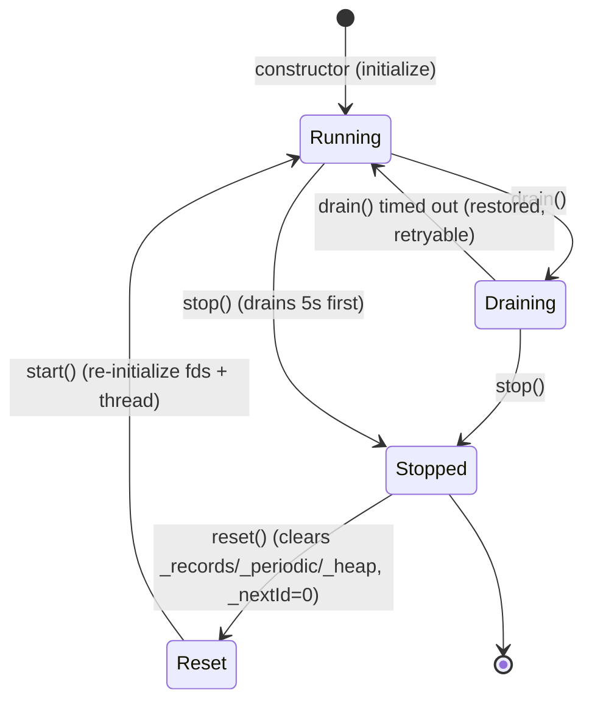

# Iora TimerService -- Architecture & Programmer's Guide

[Back to index](../../README.md)

| | |
|---|---|
| **Version** | 1.0 |
| **Date** | 2026-09-10 |
| **Status** | IMPLEMENTED |
| **Header** | `include/iora/core/timer.hpp` |
| **Namespace** | `iora::core` |
| **Dependencies** | Standard library -- `<atomic>`, `<chrono>`, `<condition_variable>`, `<cstdint>`, `<functional>`, `<future>`, `<memory>`, `<mutex>`, `<optional>`, `<queue>`, `<stdexcept>`, `<string>`, `<thread>`, `<type_traits>`, `<unordered_map>`, `<utility>`, `<vector>` -- plus Linux kernel interfaces `<sys/epoll.h>`, `<sys/eventfd.h>`, `<sys/timerfd.h>`, `<unistd.h>`, `<errno.h>`, `<string.h>`. Two intra-Iora headers: `iora/common/i_lifecycle_managed.hpp` (the `ILifecycleManaged` base and `DrainStats`/`LifecycleResult`) and `iora/core/errno_utils.hpp` (`errnoMessage`). No external/third-party dependencies. **Linux-only** (hard dependency on `timerfd`/`eventfd`/`epoll`). |

---

## Revision History

| Version | Date | Changes |
|---|---|---|
| 1.0 | 2026-09-10 | Initial Architecture & Programmer's Guide. Authored directly against `include/iora/core/timer.hpp` (1846 lines) and cross-checked against `tests/core/iora_test_timer.cpp` and `tests/core/iora_test_timer_lifecycle.cpp`. The README "High-Performance Timer System" section describes an aspirational API that diverges from the shipped header (see Known Limitations); this guide documents the **actual** implementation. |

---

## 1. Executive Summary

### Problem

A microservice framework needs a scheduler that can fire thousands of callbacks at precise deadlines without spinning a thread per timer and without waking on a fixed polling interval. A naive `std::thread` + `sleep_for` per timeout costs one OS thread per pending deadline; a single polling thread with a fixed tick trades CPU for accuracy (a coarse tick misses deadlines, a fine tick burns cycles when idle). Iora subsystems -- the DNS client's per-query timeout (`network/dns/dns_transport.hpp`), the TTL map's expiry sweeps (`util/ttl_map.hpp`), the TCP/UDP engines (`network/detail/*_engine.hpp`), and the SSE keep-alive stream (`network/sse_stream.hpp`) -- all need one-shot and periodic callbacks with sub-millisecond wake latency and clean shutdown semantics.

### Solution

`iora::core::TimerService` is a single-threaded, Linux-native timer scheduler:

- **One background thread per service** runs an `epoll_wait` loop over a `timerfd` (the next-deadline wake source) and an `eventfd` (the cross-thread "a timer was added/cancelled, re-evaluate" doorbell).
- **A binary min-heap** (`std::vector<HeapItem>` ordered by `{deadline, id}`) plus an `std::unordered_map<uint64_t, Record>` gives O(log n) insert, O(1) top-of-heap peek, and O(1) cancel-by-marking.
- **Three scheduling entry points** -- `scheduleAt(TimePoint, Handler)`, `scheduleAfter(Duration, Handler)`, and `schedulePeriodic(Duration, F)` -- each return a `std::uint64_t` timer id (0 signals rejection).
- **`SteadyTimer`** wraps a service in an ASIO-like arm/cancel object; **`TimerServicePool`** fans work across N services (round-robin or least-loaded); **`TimerConfigBuilder`** fluently constructs a `TimerServiceConfig`.
- **Full `ILifecycleManaged` lifecycle** -- `start`/`drain`/`stop`/`reset` with graceful drain semantics uniform with `TimingWheel::drain()`.

### Technical Impact

- **O(log n) schedule, O(1) cancel, O(1) next-deadline peek.** Cancellation marks a `Record` and lets the run loop skip it -- no heap removal on the cancel path.
- **Zero idle CPU.** `epoll_wait` blocks indefinitely (`epollTimeout = -1`) until the `timerfd` fires or the `eventfd` is poked; there is no polling tick.
- **Callbacks never run under the scheduler lock.** The run loop collects due handlers into a local vector, releases `_mutex`, then invokes them (copy/collect-then-invoke), so a handler may freely re-enter `scheduleAfter`/`cancel` without self-deadlock.
- **Graceful drain.** `drain(timeoutMs)` stops accepting new timers, cancels far-future timers that cannot complete in the budget, and blocks on a condition variable until in-flight callbacks finish.

**Relationship to `TimingWheel`.** `TimerService` is **not** built on `iora::core::TimingWheel`; they are two independent schedulers in the same namespace. `TimingWheel` (see [`docs/core/timing_wheel.md`](timing_wheel.md)) is a hierarchical timing wheel implementing the `iora::core::ITimerService` interface (`schedule`/`cancel`/`reschedule`, millisecond granularity). `TimerService` is a heap-plus-`timerfd` scheduler implementing `iora::common::ILifecycleManaged` instead, with a richer scheduling API (`scheduleAt`/`scheduleAfter`/`schedulePeriodic`) and nanosecond-programmed deadlines. They share only the *drain* vocabulary: both expose uniform `drain()` semantics. Choose `TimerService` when you want absolute-time scheduling, steady-clock precision, and per-service isolation; choose `TimingWheel` when you want O(1) amortized insert/cancel at a fixed tick and the `ITimerService` abstraction.

---

## 2. System Architecture

### 2.1 Component relationships

```
iora::core
`-- TimerService                       (public; : iora::common::ILifecycleManaged)
    |-- TimerService::Handler          (public nested: move-only type-erased nullary callable)
    |-- TimerService::ErrorHandler     (public nested: std::function<void(TimerError,string,int)>)
    |-- Record                         (private: {TimePoint tp; Handler handler; bool canceled})
    |-- HeapItem                       (private: {TimePoint tp; uint64_t id})   -- heap node
    |-- PeriodicTimer                  (private: {id, interval, nextExecution, canceled,
    |                                             std::function<void()> handler})
    |-- _records      : unordered_map<uint64_t, Record>        (guarded by _mutex)
    |-- _periodicTimers: unordered_map<uint64_t, PeriodicTimer>(guarded by _mutex)
    |-- _heap         : vector<HeapItem>  (binary min-heap, guarded by _mutex)
    |-- _thread       : std::thread       (runs runLoop())
    |-- _epollFd / _timerFd (plain int; run-loop-thread only) / _eventFd (atomic<int>; cross-thread)
    |-- _stats        : TimerStats        (atomics)
    `-- _drainCV      : condition_variable (drain completion)

SteadyTimer                            (public; ASIO-like adapter; holds TimerService& + weak cancel token)
TimerServicePool                       (public; vector<unique_ptr<TimerService>>, round-robin / least-loaded)
TimerConfigBuilder                     (public; fluent builder -> TimerServiceConfig)

Supporting types (public):
  TimerError        (enum class)        TimerException  (: std::exception, carries TimerError + errno)
  TimerStats        (struct of atomics) TimerLimits     (resource ceilings)
  TimerServiceConfig(struct)            TimerLogger     (abstract) / ConsoleTimerLogger (default impl)

Consumers (outside this component; shown for context):
  network/dns/dns_transport.hpp   --uses--> TimerService (per-query timeout / cancellation)
  util/ttl_map.hpp                --uses--> TimerService (TTL expiry)
  network/detail/tcp_engine.hpp,
  network/detail/udp_engine.hpp   --uses--> TimerService
  network/sse_stream.hpp          --uses--> TimerService (keep-alive)
```

### 2.2 Data flow -- schedule then fire

```mermaid
sequenceDiagram
  participant App as Caller (any thread)
  participant Svc as TimerService (scheduleAfter)
  participant Heap as _heap + _records (under _mutex)
  participant EF as eventfd (poke)
  participant Loop as runLoop (timer thread)
  participant CB as User handler

  App->>Svc: scheduleAfter(d, handler)
  Note over Svc: lock-free check _accepting + isValidTimeout
  Svc->>Heap: lock _mutex; emplace Record; heap push (siftUp)
  Svc-->>Heap: unlock _mutex
  Svc->>EF: poke() -- write(eventfd, 1)
  Svc-->>App: return timer id (uint64_t)

  EF-->>Loop: epoll_wait returns (eventfd readable)
  Loop->>Loop: drainEventfd()
  Loop->>Heap: lock _mutex; programTimerfd(next deadline)
  Loop-->>Heap: unlock _mutex; epoll_wait blocks until timerfd fires
  Loop->>Loop: timerfd fires -> drainTimerfd()
  Loop->>Heap: lock _mutex; collectDueLocked(now, ready)
  Note over Heap: pre-increment _executingCallbacks under lock
  Loop-->>Heap: unlock _mutex
  Loop->>CB: safeRun(handler)  (NO _mutex held)
  CB-->>Loop: returns (or throws -> swallowed + counted)
```

### 2.3 The min-heap plus map split

Ordering and identity are kept in two structures under one `_mutex`:

- **`_heap`** (`std::vector<HeapItem>`) is a binary min-heap keyed by `less(a,b) = a.tp < b.tp || (a.tp == b.tp && a.id < b.id)`. The tie-break on `id` makes ordering total and deterministic for equal deadlines. It answers "what is the earliest deadline?" in O(1) (`heapTop`) and pops in O(log n) (`heapPop` + `siftDown`).
- **`_records`** (`std::unordered_map<uint64_t, Record>`) owns each timer's `Handler` and its `canceled` flag, keyed by the timer id.

A `HeapItem` carries only `{tp, id}`; the `Handler` lives in the `Record`. Cancellation sets `Record::canceled = true` (O(1)) and leaves the stale `HeapItem` in the heap -- the run loop discovers the cancellation when it pops the item and looks up the record. This "lazy deletion" avoids an O(n) heap search on the hot cancel path.

### 2.4 Periodic timers share the id space

`schedulePeriodic` allocates **one** id used as the key in *both* `_records` and `_periodicTimers`. The `_records` entry is the currently-armed fire; `_periodicTimers` holds the interval and the copyable `std::function<void()>` handler used to re-arm. When a periodic fire is collected, `collectDueLocked` re-inserts a fresh `Record` (copying the stored handler) at `nextExecution += interval` under the same id. Because the id is shared, `cancel(id)` cancels both, and `getInFlightCount()` counts each active periodic timer exactly once (it counts `_records` only).

### 2.5 Threading model

| Thread | Responsibility |
|---|---|
| **Timer thread** (`_thread`, runs `runLoop`) | The only thread that touches `_epollFd`/`_timerFd`, calls `epoll_wait`, programs the `timerfd`, collects due handlers under `_mutex`, and invokes user callbacks (outside `_mutex`). One per `TimerService`. Named per `TimerServiceConfig::threadName`. |
| **Any caller thread** | `scheduleAt`/`scheduleAfter`/`schedulePeriodic`/`cancel` -- take `_mutex` briefly, mutate `_heap`/`_records`/`_periodicTimers`, then `poke()` the `eventfd` to wake the timer thread. Fully thread-safe and re-entrant from inside a running handler. |
| **Lifecycle caller** | `start`/`drain`/`stop`/`reset`/`getState`/`getInFlightCount` -- drive the `ILifecycleManaged` state machine. `stop()` joins the timer thread. |
| **Pool caller** | `TimerServicePool::getService`/`getLeastLoadedService`/`getAggregatedStats` -- select or aggregate across N independent services. |

A single `std::mutex _mutex` guards all timer bookkeeping; a separate `std::mutex _handlerMutex` guards the swappable `_logger` and `_errorHandler`; a `std::condition_variable _drainCV` signals drain completion. Full detail in section 8.

---

## 3. Component Deep Dive

### 3.1 `TimerService::Handler` -- move-only type erasure

`Handler` is a hand-rolled, move-only, type-erased nullary callable (not `std::function`, which requires the target be copyable):

```cpp
class Handler
{
public:
  template <typename F>
  Handler(F &&f) : _impl(std::make_unique<Model<std::decay_t<F>>>(std::forward<F>(f))) {}

  Handler(const Handler &) = delete;
  Handler &operator=(const Handler &) = delete;
  Handler(Handler &&) = default;
  Handler &operator=(Handler &&) = default;

  void operator()() const { if (_impl) { _impl->call(); } }
  explicit operator bool() const { return static_cast<bool>(_impl); }
  // private: Concept/Model with unique_ptr<Concept> _impl;
};
```

This lets **one-shot** timers (`scheduleAt`/`scheduleAfter`) accept move-only callables -- e.g. a lambda capturing a `std::unique_ptr`. **Periodic** timers cannot: `schedulePeriodic` must copy the handler into a `std::function<void()>` to re-arm it each interval, so its callable must be `CopyConstructible` (a move-only lambda is a compile error there -- documented in the header at the `schedulePeriodic` declaration).

### 3.2 `scheduleAt` -- the core schedule path

```cpp
template <typename Handler> std::uint64_t scheduleAt(TimePoint tp, Handler &&handler);
```

1. `static_assert(std::is_invocable_v<Handler>)` -- the handler must be callable with no arguments.
2. **Lock-free gate:** if `!_accepting` (service draining/not running), call `handleError(ServiceStopped, ...)` and **return 0**.
3. **Lock-free validity:** `isValidTimeout(tp)` checks `tp - now <= limits.maxTimeout`; on failure `handleError(InvalidTimeout, ...)` and **return 0**.
4. Under `_mutex`: **re-check** `_accepting` (drain may have flipped it since step 2), then check `_records.size() >= limits.maxConcurrentTimers`. Either failing sets a *pending* error to be reported after unlock and yields id 0.
5. Otherwise `id = ++_nextId`; emplace `Record{tp, forward(handler), false}`; push `HeapItem{tp, id}`; `siftUp`.
6. Release `_mutex`; if a pending error was set, `handleError(...)` and return 0; else `poke()` the eventfd and return the id.

The error is captured under the lock and *reported after* releasing it, so the logger/error-handler callback never runs while `_mutex` is held.

`scheduleAfter(Duration d, Handler)` is a one-line forward: `scheduleAt(Clock::now() + d, ...)`.

### 3.3 `schedulePeriodic` -- copy-before-forward

```cpp
template <typename F> std::uint64_t schedulePeriodic(Duration interval, F &&handler);
```

Same accept/validity gates as `scheduleAt`, plus a `_periodicTimers.size() >= limits.maxPeriodicTimers` check and the `maxConcurrentTimers` check. The subtlety, called out in a header comment: the handler is **copied into a `std::function<void()>` before** it is forwarded into the `Record`:

```cpp
std::function<void()> storedFn(handler);                       // copy FIRST
_periodicTimers.emplace(id, PeriodicTimer{id, interval, deadline, false, std::move(storedFn)});
_records.emplace(id, Record{deadline, Handler{std::forward<F>(handler)}, false});  // then move
```

If the forward happened first, `std::forward<F>` could move-from `handler`, leaving the periodic copy empty. Copying first preserves both the one-shot arm (in `_records`) and the re-arm template (in `_periodicTimers`).

### 3.4 `cancel` -- lazy, dual-store

```cpp
bool cancel(std::uint64_t id);   // returns true if a live timer existed
```

Under `_mutex`: marks the `_records` entry `canceled = true` (if present and not already cancelled) and requests a `poke()`; independently, if a `_periodicTimers` entry exists, marks it cancelled and **erases it immediately** (to prevent unbounded accumulation) while decrementing `periodicTimersActive`. The stale `HeapItem` remains in the heap and is discarded lazily when popped. Returns `true` if either store held a live entry. The `poke()` (if needed) and the optional debug log happen **after** the lock is released.

### 3.5 `runLoop` -- the event loop

The loop, running on `_thread`:

1. Under `_mutex`: if `!_running`, collect any already-due handlers, disarm the timerfd, and set `shouldExit`. Otherwise peek `heapTop()` for the next deadline and `programTimerfd(nextDue)`. If handlers were collected, pre-increment `_executingCallbacks` **under the lock** (so `drain()` cannot observe an empty `_records` with zero executing callbacks in the gap).
2. Release `_mutex`; `safeRun` each collected handler (no lock held). Report any `programTimerfd` errno after the callbacks.
3. If exiting, `notify_all` the drain CV and break.
4. `epoll_wait(_epollFd, ..., timeout)` where `timeout = epollTimeout` (default `-1` = block forever). On `EINTR`, continue; on other error, `handleError` and either break (`throwOnSystemError`) or continue.
5. For each ready fd: if the `timerfd` is readable, mark `timerTriggered`; if the `eventfd` is readable, mark `woke`. Drain whichever fired (`drainEventfd`/`drainTimerfd`).
6. Under `_mutex`: `collectDueLocked(now, ready)`; pre-increment `_executingCallbacks` if any; else, if draining, `notify_all` the drain CV.
7. Release `_mutex`; `safeRun` each collected handler.

### 3.6 `collectDueLocked` -- pop, skip-cancelled, re-arm periodic

Called with `_mutex` held. While the heap top's `tp <= now`: pop it, look up its `_records` entry, `std::move` the `Record` out and erase it. If not cancelled, push its `Handler` into the `out` vector (and bump `timersExpired`). Then, if a `_periodicTimers` entry exists for that id: if still active (neither the periodic nor the record was cancelled), advance `nextExecution += interval`, re-emplace a fresh `Record` copying the stored handler, and push a new `HeapItem`; otherwise erase the periodic entry.

### 3.7 `safeRun` -- guarded invocation and drain accounting

```cpp
void safeRun(const Handler &h);
```

Uses an RAII `CountGuard` whose destructor decrements `_executingCallbacks`; when the count reaches zero it locks/unlocks `_mutex` (a release fence so `drain()`'s predicate sees the change) and `notify_all`s `_drainCV`. Then, if the handler is non-empty, it times the call (when statistics enabled), invokes `h()`, and on any exception increments `exceptionsSwallowed` and calls `handleError(HandlerException, ...)`. **A throwing handler never escapes `safeRun`** -- the timer thread cannot be killed by user code. Statistics updated: `timersExecuted`, `totalHandlerExecutionTimeNs`, a CAS-updated `maxHandlerExecutionTimeNs`, and an approximate `avgHandlerExecutionTimeNs`.

### 3.8 `SteadyTimer` -- ASIO-like adapter

```cpp
explicit SteadyTimer(TimerService &svc);
void expiresAt(TimePoint tp);
void expiresAfter(Duration d);
template <typename Handler> void asyncWait(Handler &&handler);   // handler is NULLARY
bool cancel();
```

`asyncWait` first `cancel()`s any prior arm, allocates a fresh `std::shared_ptr<Shared>` (holding an `atomic<bool> canceled`), captures a `weak_ptr` to it, and schedules a wrapper on the service. The wrapper `lock()`s the weak_ptr and only invokes the user handler if the `Shared` still exists and is not cancelled. `cancel()` sets `Shared::canceled` and cancels the service token. The destructor cancels and resets the shared state. This gives a race-safe cancel: if the timer fires after `cancel()`/destruction, the wrapper observes the flag (or the expired weak_ptr) and does nothing. **The handler is nullary** -- `SteadyTimer` does not pass an `error_code` (contrary to the README sketch).

### 3.9 `TimerServicePool` -- fan-out

```cpp
explicit TimerServicePool(std::size_t numServices = std::thread::hardware_concurrency(),
                          const TimerServiceConfig &config = {});
TimerServicePool(std::size_t numServices, const TimerServiceConfig &config,
                 std::shared_ptr<TimerLogger> logger);
TimerService &getService();              // round-robin (atomic counter % size)
TimerService &getLeastLoadedService();   // min(timersScheduled - timersExecuted)
std::size_t size() const;
void stop();                             // stops every service
void getAggregatedStats(TimerStats &out) const;
void resetStats();
```

Constructs `numServices` independent `TimerService`s (clamped to a minimum of 1), each with a per-index thread name (`threadName + "_" + i`). `getService()` is a lock-free atomic round-robin. `getLeastLoadedService()` scans for the smallest `timersScheduled - timersExecuted`. The destructor calls `stop()`.

### 3.10 `TimerConfigBuilder` -- fluent config

A chainable builder over a private `TimerServiceConfig`, with one setter per commonly-tuned field (`maxEpollEvents`, `throwOnSystemError`, `epollTimeout`, `initialHeapCapacity`, `enableStatistics`, `enableDetailedLogging`, `maxConcurrentTimers`, `maxTimeout`, `threadPriority`, `threadName`) and a terminal `build()`.

---

## 4. Usage Guide

### 4.1 One-shot and periodic timers

```cpp
#include "iora/core/timer.hpp"
#include <atomic>
#include <chrono>
#include <iostream>

using namespace iora::core;
using namespace std::chrono_literals;

int main()
{
  TimerService service; // constructor starts the timer thread immediately

  std::uint64_t oneShot = service.scheduleAfter(500ms,
                                                []() { std::cout << "fired once\n"; });

  std::uint64_t ticker = service.schedulePeriodic(100ms,
                                                  []() { std::cout << "tick\n"; });

  std::this_thread::sleep_for(1s);

  service.cancel(oneShot); // no-op if already fired
  service.cancel(ticker);  // stop the periodic timer
  return 0;
} // ~TimerService drains (5s budget) and joins the thread
```

### 4.2 Absolute-time scheduling and rejection handling

```cpp
auto deadline = TimerService::Clock::now() + 2s;
std::uint64_t id = service.scheduleAt(deadline, []() { doMaintenance(); });
if (id == 0)
{
  // Rejected: service draining/stopped, timeout beyond limits.maxTimeout,
  // or maxConcurrentTimers exceeded. A 0 id is NOT a valid timer.
}
```

### 4.3 Tuned configuration via the builder

```cpp
auto config = TimerConfigBuilder()
                .enableStatistics(true)
                .enableDetailedLogging(false)
                .maxConcurrentTimers(50000)
                .threadName("AppTimers")
                .throwOnSystemError(false)
                .build();

TimerService service(config);

// ... schedule work ...

const TimerStats &stats = service.getStats();
std::cout << "scheduled=" << stats.timersScheduled.load()
          << " executed=" << stats.timersExecuted.load() << "\n";
```

### 4.4 ASIO-like `SteadyTimer`

```cpp
TimerService service;
SteadyTimer timer(service);

std::atomic<bool> fired{false};
timer.expiresAfter(25ms);
timer.asyncWait([&fired]() { fired = true; }); // nullary handler

// Re-arming: asyncWait cancels the previous arm first.
timer.expiresAfter(50ms);
timer.asyncWait([&fired]() { fired = true; });

timer.cancel(); // race-safe: a late fire observes the cancel flag and no-ops
```

### 4.5 Fan-out with a pool and graceful shutdown

```cpp
auto config = TimerConfigBuilder().enableStatistics(true).build();
TimerServicePool pool(4, config); // 4 independent services + threads

for (int i = 0; i < 1000; ++i)
{
  TimerService &svc = pool.getService(); // round-robin
  svc.scheduleAfter(std::chrono::milliseconds(i % 100), [i]() { process(i); });
}

TimerStats aggregated;
pool.getAggregatedStats(aggregated); // sums counters across all services

pool.stop(); // stops every service (also runs in ~TimerServicePool)
```

### 4.6 Explicit lifecycle (drain before stop)

```cpp
using iora::common::LifecycleState;

TimerService service; // starts in Running

// Reject new timers, fire imminent ones, cancel far-future ones, wait up to 3s.
auto result = service.drain(3000);
if (!result.success)
{
  // Timed out; service was restored to Running so drain can be retried.
}

service.stop();  // Running/Draining -> Stopped; joins the thread
service.reset(); // Stopped -> Reset; clears all timer state
service.start(); // Reset -> Running; re-creates fds and thread
```

### 4.7 Anti-patterns

| Do | Don't |
|---|---|
| Treat a returned id of `0` as "rejected" and handle it. | Assume every `schedule*` call succeeds -- a draining service, an over-limit timeout, or an exceeded `maxConcurrentTimers` returns 0. |
| Use a move-only capture only with `scheduleAt`/`scheduleAfter`. | Pass a move-only lambda to `schedulePeriodic` -- it copies into `std::function` and will not compile. |
| Call `drain(timeoutMs)` with a **positive** budget when periodic timers are active. | Call `drain(0)` while a periodic timer is armed -- periodic timers are not cancelled at `timeoutMs == 0`, so the wait never completes (see Known Limitations). |
| Let the handler run to completion quickly, or dispatch heavy work elsewhere. | Block the handler -- there is one timer thread; a slow handler delays every later timer on that service. |
| Cancel via `SteadyTimer::cancel()` / let it destruct. | Rely on cancelling a raw id you passed to `SteadyTimer` -- the service holds a wrapper token, not your id. |
| Size `maxConcurrentTimers` to your load. | Rely on `maxHeapSize` / `maxHandlerExecutionTime` limits -- they are declared but not enforced (see Known Limitations). |

---

## 5. Call Flow / Sequence Reference

### 5.1 `scheduleAfter` (success path)

| Step | Actor | Action | Lock state |
|---|---|---|---|
| 1 | Caller | `scheduleAfter(d, h)` -> `scheduleAt(now + d, h)`; `static_assert` is_invocable. | no lock |
| 2 | `scheduleAt` | Lock-free: `_accepting` load; `isValidTimeout(tp)`. | no lock |
| 3 | `scheduleAt` | Acquire `_mutex`; re-check `_accepting` and `_records.size() < maxConcurrentTimers`. | `_mutex` held |
| 4 | `scheduleAt` | `id = ++_nextId`; emplace `Record`; `_heap.emplace_back`; `siftUp`; bump stats. | `_mutex` held |
| 5 | `scheduleAt` | Release `_mutex`. | `_mutex` released |
| 6 | `scheduleAt` | `poke()` (write eventfd) to wake the timer thread; return `id`. | no lock |

### 5.2 `scheduleAt` (rejection path)

| Step | Actor | Action | Lock state |
|---|---|---|---|
| 1 | `scheduleAt` | Lock-free `_accepting == false` -> `handleError(ServiceStopped)`, return 0. | no lock |
| 1' | `scheduleAt` | Lock-free `isValidTimeout == false` -> `handleError(InvalidTimeout)`, return 0. | no lock |
| 2 | `scheduleAt` | Under `_mutex`: re-check `_accepting`, or `_records.size() >= maxConcurrentTimers` -> set *pending* error, `id = 0`. | `_mutex` held |
| 3 | `scheduleAt` | Release `_mutex`; `handleError(pendingError)` (logger/error-handler invoked off-lock); return 0. | `_mutex` released |

### 5.3 Fire path (timerfd due)

| Step | Actor | Action | Lock state |
|---|---|---|---|
| 1 | Timer thread | `epoll_wait` returns; `timerfd` readable -> `drainTimerfd()`. | no lock |
| 2 | Timer thread | Acquire `_mutex`; `collectDueLocked(now, ready)` pops due items, skips cancelled, re-arms periodic. | `_mutex` held |
| 3 | Timer thread | If `ready` non-empty: `_executingCallbacks.fetch_add(ready.size())` **under lock**. Else if draining: `_drainCV.notify_all()`. | `_mutex` held |
| 4 | Timer thread | Release `_mutex`. | `_mutex` released |
| 5 | Timer thread | For each handler: `safeRun(h)` -- invoke user callback with **no lock held**; swallow exceptions. | no lock |
| 6 | `CountGuard` (per handler) | On scope exit: decrement `_executingCallbacks`; if it hit 0, lock/unlock `_mutex` then `_drainCV.notify_all()`. | brief `_mutex` |

### 5.4 `drain` (graceful, positive budget)

| Step | Actor | Action | Lock state |
|---|---|---|---|
| 1 | Caller | `drain(timeoutMs)`; under `_mutex`, CAS `Running -> Draining`; `_accepting = false`. | `_mutex` held |
| 2 | `drain` | Under `_mutex`: count non-cancelled `_records` (`inFlightAtStart`); if `timeoutMs > 0`, cancel every `_records` entry whose `tp > now + timeoutMs`, and cancel **all** `_periodicTimers`. | `_mutex` held |
| 3 | `drain` | `poke()` so the run loop re-evaluates with the cancellations. | no lock |
| 4 | `drain` | `_drainCV.wait_for(budget, drainDone)` where `drainDone = (no live _records) && (_executingCallbacks == 0)`. | `_mutex` (CV) |
| 5 | `drain` | On timeout: CAS `Draining -> Running`, `_accepting = true` (retryable). Build `DrainStats`; return `LifecycleResult`. | brief `_mutex` |

### 5.5 `stop` (Running/Draining -> Stopped)

| Step | Actor | Action | Lock state |
|---|---|---|---|
| 1 | Caller | `stop()`; if `Running`, first `drain(5000)`. | as 5.4 |
| 2 | `stop` | CAS `_running true -> false`; `poke()`. | no lock |
| 3 | `stop` | `_thread.join()` (run loop drains due timers, disarms timerfd, exits). | no lock |
| 4 | `stop` | `cleanup()` closes eventfd/timerfd/epollfd; set state `Stopped`. | no lock |

---

## 6. Lifecycle State Machine

`TimerService` implements `iora::common::ILifecycleManaged`. Note the atypical **auto-start**: the constructor calls `initialize()`, which creates the fds, spawns the thread, sets `_accepting = true` and state `Running`. So a freshly constructed `TimerService` is already `Running` -- `start()` on it is a no-op returning success.



| Method | Precondition | Effect |
|---|---|---|
| `start()` | `Created` or `Reset` | From `Created` (auto-started) it is a success no-op; from `Reset` it re-runs `initialize()` (new fds + thread). |
| `drain(timeoutMs = 30000)` | `Running` | Stops accepting; cancels far-future + all periodic timers (when `timeoutMs > 0`); waits on `_drainCV`; on timeout restores `Running`. `timeoutMs == 0` waits indefinitely. |
| `stop()` | not `Stopped`/`Reset` | Drains 5s if `Running`, flips `_running`, joins the thread, closes fds -> `Stopped`. |
| `reset()` | `Stopped` | Clears all timer maps/heap and `_nextId`; resets stats -> `Reset`. |
| `getState()` | any | Returns the current `LifecycleState` (atomic acquire). |
| `getInFlightCount()` | any | Counts non-cancelled `_records` under `_mutex`. |

`drain()` returns a `LifecycleResult` carrying a `DrainStats{inFlightAtStart, remaining, cancelled, completed}`.

---

## 7. Statistics & Observability

When `TimerServiceConfig::enableStatistics` is `true` (the default), the service maintains a `TimerStats` block of `std::atomic<std::uint64_t>` counters, retrievable by `const TimerStats &getStats() const` and clearable by `resetStats()`:

| Counter | Meaning |
|---|---|
| `timersScheduled` | Total timers accepted (including each periodic re-arm). |
| `timersCanceled` | Timers cancelled before firing. |
| `timersExecuted` | Handlers that ran to completion in `safeRun`. |
| `timersExpired` | Due timers collected for firing (not cancelled). |
| `periodicTimersActive` | Currently-armed periodic timers. |
| `exceptionsSwallowed` | Handler invocations that threw. |
| `systemErrors` | `TimerError::SystemError` occurrences. |
| `heapOperations` | Heap push/pop operations. |
| `epollWaits` | `epoll_wait` iterations. |
| `eventfdWakeups` | `eventfd` doorbell reads. |
| `timerfdTriggers` | `timerfd` expiries handled. |
| `totalHandlerExecutionTimeNs` / `maxHandlerExecutionTimeNs` / `avgHandlerExecutionTimeNs` | Handler timing (avg is approximate under concurrency). |

`getUptimeSeconds()` reports wall time since construction/last reset. `TimerStats` is non-copyable in the usual sense (atomics), so `TimerServicePool::getAggregatedStats(TimerStats &out)` fills a caller-provided instance by summing per-service counters.

**Logging.** A pluggable `TimerLogger` (default `ConsoleTimerLogger`, which is *disabled* by default -- construct with `enabled = false`) receives lifecycle and error messages. Swap it at runtime with `setLogger(std::shared_ptr<TimerLogger>)`, and install an `ErrorHandler` (`std::function<void(TimerError, const std::string&, int)>`) with `setErrorHandler`. Both are guarded by `_handlerMutex` and are snapshotted before invocation, so neither runs while `_mutex` is held.

---

## 8. Thread Safety Model

| Operation | Synchronization | Notes |
|---|---|---|
| `scheduleAt` / `scheduleAfter` / `schedulePeriodic` | Lock-free `_accepting`/validity gate, then `std::lock_guard<std::mutex>` on `_mutex` for the heap/map mutation, then `poke()` off-lock. | Any thread. Errors are captured under the lock and reported after release. |
| `cancel` | `std::lock_guard<std::mutex>` on `_mutex`; `poke()` and debug log off-lock. | Marks `_records` cancelled (lazy heap deletion); erases `_periodicTimers` entry. |
| `runLoop` collect | `std::lock_guard<std::mutex>` on `_mutex` around `collectDueLocked` + `programTimerfd`; `_executingCallbacks` pre-incremented **under** the lock. | Prevents `drain()` seeing empty `_records` + zero executing in the gap between collect and fire. |
| **Handler invocation (`safeRun`)** | **No `_mutex` held.** Collect-then-invoke: handlers are moved into a local `std::vector<Handler>`, `_mutex` is released, then each is called. | A handler may re-enter `scheduleAfter`/`cancel` safely. Exceptions are caught and counted. |
| `drain` | Under `_mutex` for the `Running->Draining` CAS + `_accepting` store + cancellation sweep + inflight count; then `_drainCV.wait_for` releasing `_mutex`. | `DrainStats` accounting computed after the wait. Timeout path CAS-restores `Running`. |
| `stop` | `_running` CAS (acq_rel); `_thread.join()`; `cleanup()`; state store (release). | Joins the timer thread; safe to call from the destructor. |
| `getStats` / `getConfig` | None (returns `const&`); counters are atomics. | `getInFlightCount` takes `_mutex`. |
| `setLogger` / `setErrorHandler` / `loggerSnapshot` / `handleError` | `std::lock_guard<std::mutex>` on `_handlerMutex`. | Logger/handler are copied under `_handlerMutex` then invoked outside it. `_handlerMutex` is always the **inner** lock -- never held while acquiring `_mutex`. |

**Mutex/CV/atomic inventory (from the header):**

- `std::mutex _mutex` (mutable) -- guards `_records`, `_periodicTimers`, `_heap`, `_nextId`.
- `std::mutex _handlerMutex` (mutable) -- guards `_logger`, `_errorHandler`.
- `std::condition_variable _drainCV` -- notified when a drain may complete (from `safeRun`'s `CountGuard`, from the run loop's draining branch, and on run-loop exit).
- `std::atomic<bool> _running` -- run-loop keep-going flag.
- `std::atomic<bool> _accepting` -- whether new timers are accepted (flipped by drain).
- `std::atomic<std::uint32_t> _executingCallbacks` -- handlers currently inside `safeRun` (not yet reflected in `_records`).
- `std::atomic<iora::common::LifecycleState> _lifecycleState` -- lifecycle state.
- `std::atomic<int> _eventFd` -- the doorbell fd (accessed cross-thread by `poke()`); `_epollFd`/`_timerFd` are plain `int` touched only by the init/run-loop/cleanup single-thread sequence.

**Lock ordering.** `_mutex` -> `_handlerMutex` is the only nesting (`handleError` may be called while `_mutex` is held, and it takes `_handlerMutex` to snapshot then invokes off both locks). `_handlerMutex` is never held while acquiring `_mutex`, so there is no cycle. `_mutex` is otherwise a leaf.

**Drain wakeup correctness.** The `CountGuard` destructor takes/releases `_mutex` before `notify_all` so the `_executingCallbacks` decrement is visible to `drain()`'s predicate -- otherwise a notify could be lost if `drain()` had not yet entered `wait_for`. This is the same "notify under (or fenced by) the lock the destroyer observes" discipline used across iora.

**Callback-under-lock guarantee.** Confirmed by reading `runLoop`/`collectDueLocked`/`safeRun`: user handlers, the logger, and the error handler are always invoked with **no `_mutex` held** (copy/collect-then-invoke). This is the load-bearing safety property for re-entrant scheduling.

---

## 9. Configuration Reference

### 9.1 `TimerServiceConfig`

| Field | Type | Default | Units / Range | Effect |
|---|---|---|---|---|
| `maxEpollEvents` | `int` | `16` | count | Size of the `epoll_event` buffer and the `maxevents` argument to `epoll_wait`. |
| `throwOnSystemError` | `bool` | `false` | -- | If `true`, a fatal `epoll_wait`/`timerfd` error breaks the run loop; if `false`, it is logged and the loop continues. (Construction failures always throw regardless.) |
| `epollTimeout` | `std::chrono::milliseconds` | `-1` | ms; `-1` = infinite | `epoll_wait` timeout. `-1` blocks until an fd is ready (the normal, zero-idle-CPU mode). |
| `initialHeapCapacity` | `std::size_t` | `256` | count | `_heap.reserve()` size at construction to avoid early reallocations. |
| `enableStatistics` | `bool` | `true` | -- | Enables all `TimerStats` counter updates. |
| `enableDetailedLogging` | `bool` | `false` | -- | Emits per-schedule/per-cancel debug log lines. |
| `limits` | `TimerLimits` | (see 9.2) | -- | Resource ceilings. |
| `setThreadPriority` | `bool` | `false` | -- | If `true` (Linux), sets `SCHED_FIFO` priority on the timer thread. |
| `threadPriority` | `int` | `0` | scheduler priority | Priority used when `setThreadPriority` is `true`. |
| `threadName` | `std::string` | `"TimerService"` | -- | `pthread_setname_np` name (pool appends `_<index>`). |

### 9.2 `TimerLimits`

| Field | Type | Default | Units | Enforced? |
|---|---|---|---|---|
| `maxConcurrentTimers` | `std::size_t` | `10000` | count | **Yes** -- checked against `_records.size()` in every `schedule*`. |
| `maxTimeout` | `std::chrono::milliseconds` | `std::chrono::hours(24)` | ms | **Yes** -- `isValidTimeout` rejects deadlines further out. |
| `maxHandlerExecutionTime` | `std::chrono::milliseconds` | `std::chrono::seconds(30)` | ms | **No** -- declared but never read (see Known Limitations). |
| `maxHeapSize` | `std::size_t` | `50000` | count | **No** -- declared but never read (see Known Limitations). |
| `maxPeriodicTimers` | `std::size_t` | `1000` | count | **Yes** -- checked against `_periodicTimers.size()` in `schedulePeriodic`. |

### 9.3 Build / platform

`timer.hpp` is Linux-only: it includes `<sys/epoll.h>`, `<sys/eventfd.h>`, `<sys/timerfd.h>` and calls `epoll_create1`/`timerfd_create`/`eventfd` unconditionally. There is no non-Linux fallback. `configureThread` (priority/name) is additionally guarded by `#ifdef __linux__`.

---

## 10. API Reference

```cpp
namespace iora
{
namespace core
{

enum class TimerError
{
  None, SystemError, InvalidTimeout, ServiceStopped,
  HandlerException, ResourceExhausted, ConfigurationError
};

class TimerException : public std::exception
{
public:
  TimerException(TimerError code, const std::string &msg, int errno_val = 0);
  TimerError code() const;
  int getErrno() const;
  const char *what() const noexcept override;
};

struct TimerStats { /* atomics; see section 7 */ void reset(); double getUptimeSeconds() const; };

struct TimerLimits
{
  std::size_t maxConcurrentTimers{10000};
  std::chrono::milliseconds maxTimeout{std::chrono::hours(24)};
  std::chrono::milliseconds maxHandlerExecutionTime{std::chrono::seconds(30)};
  std::size_t maxHeapSize{50000};
  std::size_t maxPeriodicTimers{1000};
};

struct TimerServiceConfig
{
  int maxEpollEvents{16};
  bool throwOnSystemError{false};
  std::chrono::milliseconds epollTimeout{-1};
  std::size_t initialHeapCapacity{256};
  bool enableStatistics{true};
  bool enableDetailedLogging{false};
  TimerLimits limits;
  bool setThreadPriority{false};
  int threadPriority{0};
  std::string threadName{"TimerService"};
};

class TimerLogger
{
public:
  enum class Level { Debug = 0, Info = 1, Warning = 2, Error = 3, Critical = 4 };
  virtual ~TimerLogger() = default;
  virtual void log(Level level, const std::string &message,
                   TimerError error = TimerError::None, int errno_val = 0) = 0;
  void debug(const std::string &); void info(const std::string &);
  void warning(const std::string &);
  void error(const std::string &, TimerError = TimerError::None, int = 0);
  void critical(const std::string &, TimerError = TimerError::None, int = 0);
};

class ConsoleTimerLogger : public TimerLogger
{
public:
  explicit ConsoleTimerLogger(Level minLevel = Level::Info, bool enabled = false);
  void setEnabled(bool);
  bool isEnabled() const;
  void log(Level, const std::string &, TimerError = TimerError::None, int = 0) override;
};

class TimerService : public iora::common::ILifecycleManaged
{
public:
  using Clock = std::chrono::steady_clock;
  using TimePoint = Clock::time_point;
  using Duration = Clock::duration;

  class Handler                                   // move-only, type-erased, nullary
  {
  public:
    template <typename F> Handler(F &&f);
    Handler(const Handler &) = delete;
    Handler &operator=(const Handler &) = delete;
    Handler(Handler &&) = default;
    Handler &operator=(Handler &&) = default;
    void operator()() const;
    explicit operator bool() const;
  };

  using ErrorHandler = std::function<void(TimerError, const std::string &, int)>;

  explicit TimerService(const TimerServiceConfig &config = {});
  TimerService(const TimerServiceConfig &config, std::shared_ptr<TimerLogger> logger);
  ~TimerService();                                // calls stop()
  TimerService(const TimerService &) = delete;
  TimerService &operator=(const TimerService &) = delete;

  template <typename Handler> std::uint64_t scheduleAt(TimePoint tp, Handler &&handler);
  template <typename Handler> std::uint64_t scheduleAfter(Duration d, Handler &&handler);
  template <typename F>       std::uint64_t schedulePeriodic(Duration interval, F &&handler);
  bool cancel(std::uint64_t id);

  const TimerStats &getStats() const;
  void resetStats();
  const TimerServiceConfig &getConfig() const;
  void setErrorHandler(ErrorHandler handler);
  void setLogger(std::shared_ptr<TimerLogger> logger);

  // ILifecycleManaged
  iora::common::LifecycleResult start() override;
  iora::common::LifecycleResult drain(std::uint32_t timeoutMs = 30000) override;
  iora::common::LifecycleResult stop() override;
  iora::common::LifecycleResult reset() override;
  iora::common::LifecycleState  getState() const override;
  std::uint32_t                 getInFlightCount() const override;
};

class SteadyTimer
{
public:
  using Clock = TimerService::Clock;
  using TimePoint = TimerService::TimePoint;
  using Duration = TimerService::Duration;
  using Handler = TimerService::Handler;

  explicit SteadyTimer(TimerService &svc);
  ~SteadyTimer();
  void expiresAt(TimePoint tp);
  void expiresAfter(Duration d);
  template <typename Handler> void asyncWait(Handler &&handler);   // nullary handler
  bool cancel();
  TimerService &getService();
  const TimerService &getService() const;
};

class TimerServicePool
{
public:
  explicit TimerServicePool(std::size_t numServices = std::thread::hardware_concurrency(),
                            const TimerServiceConfig &config = {});
  TimerServicePool(std::size_t numServices, const TimerServiceConfig &config,
                   std::shared_ptr<TimerLogger> logger);
  ~TimerServicePool();                            // calls stop()
  TimerService &getService();                     // round-robin
  TimerService &getLeastLoadedService();          // throws TimerException if empty
  std::size_t size() const;
  void stop();
  void getAggregatedStats(TimerStats &aggregated) const;
  void resetStats();
};

class TimerConfigBuilder
{
public:
  TimerConfigBuilder &maxEpollEvents(int);
  TimerConfigBuilder &throwOnSystemError(bool);
  TimerConfigBuilder &epollTimeout(std::chrono::milliseconds);
  TimerConfigBuilder &initialHeapCapacity(std::size_t);
  TimerConfigBuilder &enableStatistics(bool);
  TimerConfigBuilder &enableDetailedLogging(bool);
  TimerConfigBuilder &maxConcurrentTimers(std::size_t);
  TimerConfigBuilder &maxTimeout(std::chrono::milliseconds);
  TimerConfigBuilder &threadPriority(bool enable, int priority = 0);
  TimerConfigBuilder &threadName(const std::string &);
  TimerServiceConfig build() const;
};

} // namespace core
} // namespace iora
```

---

## 11. Design Decisions

| ID | Decision | Rationale |
|---|---|---|
| D-1 | `timerfd` + `eventfd` + `epoll` instead of a polling tick. | Zero idle CPU: `epoll_wait` blocks until the next deadline (`timerfd`) or a schedule/cancel doorbell (`eventfd`). Nanosecond-programmed `timerfd` gives steady-clock precision without a fixed tick's accuracy/CPU trade-off. |
| D-2 | Binary min-heap (`vector<HeapItem>`) plus `unordered_map<id, Record>`. | O(log n) insert, O(1) next-deadline peek, O(1) cancel-by-flag. Splitting order (heap) from identity/handler (map) keeps `HeapItem` tiny and cancellation lazy. |
| D-3 | Lazy deletion -- `cancel` marks the `Record`, the stale `HeapItem` is discarded when popped. | Avoids an O(n) heap search on every cancel; the run loop already visits the item to fire it. |
| D-4 | Custom move-only `Handler` for one-shots; `std::function` copy for periodics. | One-shots can capture move-only state (`unique_ptr`); periodics need a copyable template to re-arm each interval. The copy-before-forward order preserves both. |
| D-5 | Collect-then-invoke: handlers fire with `_mutex` released. | A handler may re-enter `scheduleAfter`/`cancel` without self-deadlock; a slow or throwing handler cannot stall or crash the scheduler internals. |
| D-6 | Exceptions from handlers are caught in `safeRun` and counted. | The single timer thread must never die from user code; failures surface via `exceptionsSwallowed` + the error handler. |
| D-7 | Auto-start in the constructor (state begins `Running`). | Matches the "usable immediately after construction" ergonomics the consumers (DNS, TTL map) expect; `start()` stays available for the `Reset -> Running` restart. |
| D-8 | Periodic timers reuse one id across `_records` and `_periodicTimers`. | `cancel(id)` cancels both stores and `getInFlightCount()` avoids double-counting. |
| D-9 | Unified drain semantics with `TimingWheel::drain()`; `_executingCallbacks` pre-incremented under `_mutex`. | Consistent lifecycle across schedulers; the pre-increment closes the window where `drain()` could see empty `_records` and zero executing callbacks between collect and fire. |
| D-10 | `TimerServicePool` = N independent services, each its own thread + fds. | No shared lock across the pool; horizontal scale by round-robin or least-loaded selection. |
| D-11 | Construction failure always throws (even with `throwOnSystemError=false`). | A partially initialized service (fd creation failed) is a zombie; `throwOnSystemError` governs only *runtime* errors. |

---

## 12. Known Limitations

- **Linux-only.** Hard dependency on `timerfd`/`eventfd`/`epoll`; no portable fallback. Building on non-Linux will fail to compile.
- **`TimerLimits::maxHeapSize` and `TimerLimits::maxHandlerExecutionTime` are not enforced.** Both fields are declared and defaulted (`50000`, `30s`) but are never read anywhere in `timer.hpp`. Admission control uses `maxConcurrentTimers` against `_records.size()`, not heap size; there is no watchdog on slow handlers. Configuring these values has no effect today (candidate defect -- tracked in `tasks/iora/backlog/2026-09-10-8_timer-dead-timerlimits-fields_P2.json`).
- **`drain(0)` with an active periodic timer never completes.** When `timeoutMs == 0` the drain does not cancel periodic timers, and `collectDueLocked` re-arms them every interval, so the `drainDone` predicate (`no live _records`) is never satisfied. Use a positive budget when periodic timers may be armed. `stop()` is unaffected -- it drains with a 5000 ms budget. (Candidate defect -- tracked in `tasks/iora/backlog/2026-09-10-2_timer-drain-zero-hangs-with-periodic_P0.json`.)
- **`getLeastLoadedService()` degenerates when statistics are disabled.** Load is `timersScheduled - timersExecuted`, both only incremented when `enableStatistics == true`; with statistics off, every service reports load 0 and the first service is always returned. (Statistics are on by default, so this bites only if explicitly disabled.) Tracked -- including the unsigned-underflow edge in the `timersScheduled - timersExecuted` subtraction -- in `tasks/iora/backlog/2026-09-10-9_timer-least-loaded-service-stats-disabled_P2.json`.
- **Single thread per service.** All handlers on one service run serially on its timer thread; a long-running handler delays every subsequent timer on that service. Distribute heavy or blocking work across a `TimerServicePool` or hand off to a thread pool inside the handler.
- **No `reschedule`.** Unlike `ITimerService`/`TimingWheel`, `TimerService` has no `reschedule(id, newDelay)`; cancel and re-schedule instead. (The README sketch lists `reschedule`; it does not exist.)
- **Custom-logger constructor assumes a non-null logger.** The two-argument `TimerService` and three-argument `TimerServicePool` custom-logger constructors, and `TimerServicePool::stop()`, dereference the logger unconditionally; passing a null `std::shared_ptr<TimerLogger>` will crash. Tracked in `tasks/iora/backlog/2026-09-10-5_timer-null-logger-deref_P1.json`.
- **Statistics `avg`/aggregate are approximate.** `avgHandlerExecutionTimeNs` is computed from independently-loaded atomics under concurrency, and `getAggregatedStats` sums non-atomically across services -- both are monitoring hints, not exact accounting.
- **This guide documents `TimerService` (and its `SteadyTimer`/`TimerServicePool`/`TimerConfigBuilder` companions) only.** The sibling `iora::core::TimingWheel` scheduler and the `ITimerService` interface are a separate component; see [`docs/core/timing_wheel.md`](timing_wheel.md).
