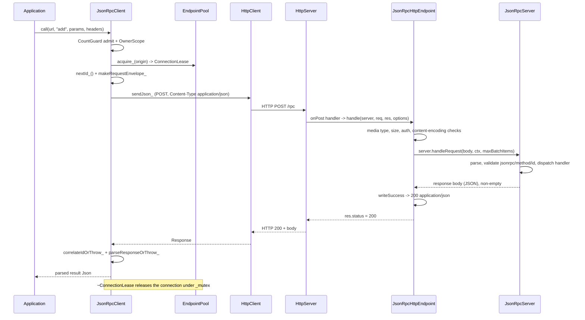

# Iora JSON-RPC (`iora::rpc`) — Architecture & Programmer's Guide

| | |
|---|---|
| **Version** | 1.0 |
| **Date** | 2026-09-09 |
| **Status** | IMPLEMENTED |
| **Headers** | `include/iora/rpc/jsonrpc_server.hpp`, `include/iora/rpc/jsonrpc_http.hpp`, `include/iora/rpc/jsonrpc_client.hpp` |
| **Namespace** | `iora::rpc` |
| **Dependencies** | `iora/parsers/json.hpp` (dispatcher); `iora/network/http_server.hpp`, `iora/parsers/accept_encoding.hpp`, `iora/parsers/content_coding.hpp`, `iora/util/gzip.hpp`, `iora/core/logger.hpp`, `iora/core/string_utils.hpp` (HTTP endpoint); `iora/network/http_client.hpp`, `iora/core/thread_pool.hpp`, `iora/parsers/http_message.hpp` (client). No dependency on `iora/iora.hpp` — the library never touches `IoraService`. |

## Revision History

| Version | Date | Changes |
|---------|------|---------|
| 1.0 | 2026-09-09 | Initial guide covering the migrated `iora::rpc` library: the carrier-agnostic `JsonRpcServer` dispatcher, the `JsonRpcHttpEndpoint` HTTP carrier, and the pooled `JsonRpcClient`. Documents direct composition (no plugin/`.so`/`IoraService`), the notification-204 contract, batch re-alignment, fail-closed bearer auth, negotiated gzip, the RFC 9110 §9.2.2 retry gate, and the D-LIFETIME raw-pointer teardown model. |

---

## 1. Executive Summary

### Problem

JSON-RPC was already the natural shape of two Iora components — a pure protocol validator/dispatcher and a pooled `HttpClient` wrapper — but both were reachable only by loading a shared object and calling stringly-typed exported APIs. An application wanting JSON-RPC had to go through `IoraService::loadSingleModule` plus `callExportedApi<void, const std::string&, JsonHandler>("jsonrpc.register", ...)`, losing compile-time type checking for no benefit. Concrete evidence of the accidental complexity in the old plugin form:

- The server (`src/modules/endpoints/jsonrpc_server/jsonrpc_server.hpp`) was already a pure `parsers::Json` validator, yet it dragged an `IoraService&` through `RpcContext` that **no caller ever read** — zero `RpcContext::service()` call sites across the entire workspace.
- The client carried an `IoraService& _service` member that was assigned once and never read.
- The two halves lived under **different namespaces** (`iora::modules::jsonrpc` and `iora::modules::connectors`) — two halves of one protocol under two names.
- `mod_jsonrpc_client.cpp` maintained a ~200-line `jobId -> result` map purely to ferry a `std::future` across a `.so` boundary, when the underlying class already exposes `std::future` and callback overloads directly.

### Solution

Three cohesive concerns are promoted into `include/iora/rpc/` under one namespace, `iora::rpc`, and composed **directly** — no service host, no plugin load, no `.so`:

- **`iora::rpc::JsonRpcServer`** — a carrier-agnostic JSON-RPC 2.0 protocol validator and method dispatcher over `parsers::Json`. It includes no network header and is unit-testable with no socket.
- **`iora::rpc::JsonRpcHttpEndpoint`** — the JSON-RPC-over-HTTP status-code mapping, newly separated from the plugin and bound to a `network::HttpServer&`. It re-derives the mapping from the specifications (RFC 9110 / RFC 6750 / JSON-RPC 2.0), not from the old plugin's behaviour.
- **`iora::rpc::JsonRpcClient`** — a per-origin connection-pooled client over an externally-owned `core::ThreadPool`, with synchronous and asynchronous (future + callback) calls, batching, and a blocking-quiesce destructor.

### Technical Impact

- **Zero `IoraService` coupling.** Neither header includes `iora/iora.hpp`, breaking the include cycle and enabling direct instantiation. The acceptance test (`tests/rpc/iora_test_jsonrpc_e2e.cpp`) composes all three classes with no plugin/service host.
- **Per-request heap allocation removed** in `RpcContext`: `RequestMetadata` is held by value instead of behind a `unique_ptr`, which also makes `RpcContext` copyable.
- **Per-origin pooling** keyed on `scheme://host:port`, so connections are shared across paths on one host, with O(1) reuse under a single mutex.
- **Bidirectional gzip negotiation** (request compress + response decode) with a fail-loud decoder and a per-origin 415 latch.
- **Double-submit safety**: only provably-not-sent failures are retried (RFC 9110 §9.2.2), so a non-idempotent POST is never silently duplicated.

---

## 2. System Architecture

### Component Relationships

```
iora::rpc  (header-only library, namespace iora::rpc)
│
├── JsonRpcServer               [jsonrpc_server.hpp]   — carrier-agnostic dispatcher
│   ├── _handlers               unordered_map<string, MethodHandler>
│   ├── _methodOptions          unordered_map<string, MethodOptions>
│   ├── _stats                  ServerStats (six atomics)
│   ├── _mutex                  guards the two maps (copy-then-invoke)
│   └── handleRequest(body, RpcContext&, maxBatchItems) -> string
│         ├── single  -> handleSingleGuarded -> handleSingle
│         └── batch   -> per-item handleSingleGuarded (notifications omitted)
│
├── JsonRpcHttpEndpoint         [jsonrpc_http.hpp]     — HTTP carrier (owns nothing)
│   ├── holds RAW JsonRpcServer* + a BY-VALUE JsonRpcHttpOptions copy
│   ├── registers one HttpServer::onPost(options.path) handler in its ctor
│   └── static handle(server, req, res, options)  — the whole HTTP mapping
│         1. media type (415)     2. raw size (413)   3. auth (401)
│         4. content-encoding (415/413/400)          5. dispatch -> 200 / 204
│
└── JsonRpcClient               [jsonrpc_client.hpp]   — pooled client (pImpl facade)
    └── shared_ptr<JsonRpcClientImpl>  (enable_shared_from_this)
        ├── _threadPool&        externally owned core::ThreadPool (NOT owned)
        ├── _config             immutable after construction
        ├── _derivedHttpConfig  HttpClient::Config derived once in the ctor
        ├── _pools              unordered_map<origin, shared_ptr<EndpointPool>>  [_mutex]
        │     └── EndpointPool -> vector<shared_ptr<PooledConnection>>
        │           └── PooledConnection -> unique_ptr<HttpClient>
        ├── _requestCompressionState  per-origin gzip latch  [_requestCompressionMutex, leaf]
        └── quiesce state       _quiesceMutex / _quiesceCv / _inFlight / _owners / _closing
```

The endpoint takes `network::HttpServer&`, not a new interface, deliberately: `onPost` is a non-virtual `HttpServer` member that `WebhookServer` inherits unchanged, so `HttpServer&` accepts both server types with no vtable and no adapter.

### Data Flow: A Single Call, End to End



### Threading Model

| Thread | Responsibility |
|--------|----------------|
| **Application / caller threads** | Invoke `call`/`notify`/`callBatch` (synchronous) or `callAsync`/`callBatchAsync` (enqueue). The synchronous calls block on the calling thread; the destructor's quiesce also runs here. |
| **`core::ThreadPool` workers** (client-side, externally owned) | Run the async `runBody()` for `callAsync`/`callBatchAsync`. The pool is **not** owned by the client — it must outlive the client. A worker may hold the last `shared_ptr<Impl>`, so `~Impl` can run on a worker after `~JsonRpcClient` returns. |
| **`HttpServer` thread pool** (server-side) | Runs the registered `onPost` handler — i.e. `JsonRpcHttpEndpoint::handle` and, within it, `JsonRpcServer::handleRequest` and the user's method handlers/hooks. Handlers run **concurrently with NO server lock held**. |
| **Transport I/O threads** (epoll, inside each `HttpClient`/`HttpServer`) | Read/write sockets. `~HttpClient` joins these, so it must never run under the client `_mutex` (collect-then-destroy). |

**Key invariant (server):** method handlers, `preHook` and `postHook` are invoked concurrently on the `HttpServer` worker threads with no `JsonRpcServer` lock held. They must be thread-safe and may re-enter the server (`registerMethod`/`unregisterMethod`/`hasMethod`/`getMethodNames` are safe from inside a handler because the handler and its options are copied out under `_mutex` and the lock is released before invocation).

**Key invariant (client):** the `RpcContext&` passed to a handler is valid only for that call and must not be captured beyond it. On the client side, the destructor is blocking: when `~JsonRpcClient` returns, no user callback is running and no counted call is in flight — but a call that had not yet *begun* when destruction started is refused, and `~Impl` itself may still run later on a pool worker.

---

## 3. Component Deep Dive

### 3.1 `JsonRpcServer` — the carrier-agnostic dispatcher

`JsonRpcServer` is pure protocol logic: it includes only `iora/parsers/json.hpp` and the standard library, and it is explicitly forbidden from including any network header or `iora/iora.hpp`. Its single entry point is:

```cpp
std::string handleRequest(const std::string &body, RpcContext &ctx,
                          std::size_t maxBatchItems = 50);
```

It returns the response body as a string, or an **empty string** for a pure notification or an all-notification batch (the signal the HTTP carrier maps to 204).

**Dispatch algorithm (`handleRequest`):**

1. `++totalRequests`; record `ctx.metadata().requestSize = body.size()`.
2. Empty body -> Parse error `-32700` (JSON-RPC §5.1: an empty octet string is invalid JSON, not an Invalid Request).
3. `Json::parseString(body)`; a throw -> Parse error `-32700`.
4. If the parsed value is an **array** (batch): `++batchRequests`; reject an empty batch (`-32600`) and a batch exceeding `maxBatchItems` (`-32600`); otherwise dispatch each item through `handleSingleGuarded`, **omitting** any null (notification) result from the output array; if the output array is empty return an empty string.
5. Otherwise dispatch the single object through `handleSingleGuarded`.

**Per-item validation (`handleSingle`)** applies the JSON-RPC 2.0 rules in a fixed order, all *before* any handler runs:

- non-object request -> Invalid Request `-32600`;
- `jsonrpc` missing or not the string `"2.0"` -> Invalid Request (type-guarded, so a numeric/object `jsonrpc` cannot throw `bad_variant_access` into the transport);
- missing/empty `method` -> Invalid Request;
- a present `id` that is not string/number/null -> Invalid Request answered with **`id: null`** (a positive allowlist `is_string() || is_number() || is_null()`; `is_number()` excludes `bool`, so `{"id": true}` is rejected);
- `requireAuth` without `ctx.authSubject()` -> `-32001`; `requestSize` over `MethodOptions::maxRequestSize` -> `-32600`.

**Notification handling (JSON-RPC §4.1).** A request with no `id` is a notification. Notification status is computed *before* the handler-map lookup, and every post-lookup failure (method-not-found, auth, size, or a handler exception) is **suppressed** to an empty `Json` for a notification via the `suppressOrError` lambda — a structurally valid notification MUST NOT be answered, even on error.

**Id echo policy (`echoableId`).** Every response echo site (success and error) coerces the id through `echoableId`: only a String or Number is echoed; anything else (Object, Array, Boolean, Null) becomes `null`. This is applied at both echo sites so that even if a second structural defect routes around the pre-dispatch id-type check, a non-representable id can never be echoed. A valid scalar id *is* echoed on an Invalid Request (so `MethodNotFound`/`InvalidParams` keep echoing their scalar id per §6).

**Exception firewall (`handleSingleGuarded`).** Wraps `handleSingle` in a `catch (...)` so no single item can abort a batch and no single request escapes as an exception; a caught throw becomes an `InternalError` envelope (or an empty result for a notification).

**Synchronization.** A single `mutable std::mutex _mutex` guards `_handlers` and `_methodOptions`. The handler and its options are **copied out under the lock**, and the lock is released before the handler, pre-hook, and post-hook run (copy-then-invoke). `ServerStats` is six `std::atomic<uint64_t>` counters; `getStats()` returns a `const ServerStats&`.

### 3.2 `RpcContext` and `RequestMetadata`

`RpcContext` is `IoraService`-free and copyable/movable (all four special members defaulted). It carries an optional authenticated subject and a by-value `RequestMetadata`:

```cpp
struct RequestMetadata
{
  std::chrono::steady_clock::time_point startTime; // defaults to now()
  std::string clientId;
  std::string method;
  std::size_t requestSize;                          // defaults to 0
};
```

The HTTP endpoint sets `ctx.metadata().clientId = req.remote_addr` (the real peer address). Within a batch the **same** `RpcContext` is reused for every item, with `metadata().method` overwritten per item, so every metadata field except `method` is per-batch, and `requestSize` is the size of the whole batch body.

### 3.3 `JsonRpcHttpEndpoint` — the HTTP carrier

The endpoint binds a `JsonRpcServer` to a `network::HttpServer` as an HTTP POST endpoint. Its constructor registers exactly one handler (last, so nothing is published into a live dispatching server mid-construction):

```cpp
JsonRpcHttpEndpoint(JsonRpcServer &server, network::HttpServer &http,
                    JsonRpcHttpOptions options = {});
```

**Lifetime (D-LIFETIME, raw-pointer form).** The registered handler captures a **raw `JsonRpcServer*`** (from `&server`) and an **owned by-value copy** of the options — never `this`, never a `weak_ptr`/`shared_ptr`. All four special members are deleted, and a `static_assert` guards against storing the endpoint in a container. The tested precondition is that the `JsonRpcServer` must be declared before the `HttpServer`, and `HttpServer::stop()` must complete before either the `JsonRpcServer` or any state the handler/options depend on (including a `tokenValidator`'s captured state) is destroyed. See §10 for the accepted teardown-race characterisation.

**The mapping (`static handle`)** runs in a pinned order (auth deliberately precedes content-encoding so an unauthenticated caller cannot force decompression CPU or probe supported codings):

1. **Media type (415).** `Content-Type` essence must exactly match the allow-list `{application/json, application/json-rpc, application/jsonrequest}` (an essence match after OWS-trimming and case-folding — **not** a substring match, so `text/plain;x=application/json` is rejected). This 415 carries no `Accept-Encoding` (that header disambiguates the content-coding 415 below).
2. **Raw size (413).** `req.body.size() > maxRequestBytes` -> Content Too Large. No `Retry-After` (a fixed limit is permanent). Body not dispatched.
3. **Auth (401).** Fail-closed: `requireAuth && !tokenValidator` -> 401. Otherwise parse a Bearer token (case-insensitive scheme, `1*SP` separator, token68-validated). A missing/malformed credential -> 401 with `WWW-Authenticate: Bearer`; a validator rejection -> 401 with `error="invalid_token"` added. The subject returned by the validator is threaded into the `RpcContext`.
4. **Content-Encoding (415/413/400).** The `Content-Encoding` list is capped at 2 codings; `identity` always decodable, `gzip`/`x-gzip` decodable only when `enableRequestDecompression`. An undecodable or over-cap list -> 415 with `Accept-Encoding` listing the decodable set; a gzip inflate failure -> 400 (`BadCoding`); an over-cap inflate output -> 413.
5. **Dispatch.** Build `RpcContext(subject)`, set `clientId`, call `server.handleRequest`. An **empty** result -> **204** with the body cleared and `Content-Length`/`Content-Type` erased. A non-empty result -> **200** via `writeSuccess` (which optionally gzip-compresses over `compressionThreshold` with `Vary: Accept-Encoding`). A handler exception -> a 500 envelope; the log records a stable class and the *sanitized* method name, never raw `what()`.

**Transport error codes (`HttpErrorCode`).** Transport refusals use an endpoint-local `enum class HttpErrorCode : int` (`UnsupportedMediaType = -32015`, `EntityTooLarge = -32013`, `BadCoding = -32040`) — distinct from the protocol `ErrorCode`, because these bodies never reached the JSON-RPC parser and so must not reuse `-32600`. Every error envelope defensively erases `Content-Encoding`/`Vary` so a throw that unwinds after response compression began cannot leak a stray gzip header.

### 3.4 `JsonRpcClient` — the pooled client

`JsonRpcClient` is a thin, non-copyable, non-movable facade over a `std::shared_ptr<JsonRpcClientImpl>`. The `shared_ptr` lets async work outlive the facade safely, and `Impl` derives from `enable_shared_from_this` and is constructed only via `create()` (a passkey-gated `make_shared`), so `shared_from_this()` is always well-formed.

```cpp
explicit JsonRpcClient(iora::core::ThreadPool &threadPool, Config config = {});
```

**Per-origin pooling.** `_pools` is keyed on the parsed **origin** (`scheme://host:effective-port`) via `network::normalizeOrigin`, so two paths on one host share one `EndpointPool`, one `HttpClient`, one `Transport`, one `DnsClient`. `normalizeOrigin` throws `std::invalid_argument` on a malformed/unreachable URL form (userinfo, bracketed IPv6 literal, empty/non-numeric/zero/out-of-range port, non-lowercase or non-`http(s)` scheme) before any pool is minted. `PoolExhaustedError` is thrown **immediately** (no queuing, no wait) when a per-origin, global, or pool cap is hit.

**Connection lifetime — `PooledConnection`, `EndpointPool`, `ConnectionLease`.** A `PooledConnection` owns one `HttpClient` and tracks `_inUse`/`_lastUsed`. An `EndpointPool` holds `vector<shared_ptr<PooledConnection>>` plus a `_pendingCreates` counter for the unlocked construction window. A `ConnectionLease` holds only owning `shared_ptr`s (to the `Impl`, the pool, and the connection) — no raw pointers, no vector index — so it can never be aliased onto a different connection or dereference a freed pool/mutex. Its destructor releases the connection under `Impl::_mutex`. The pool never runs an `HttpClient` destructor under `_mutex`: every erase path moves the owning reference into an `evicted` bin the caller destroys only after unlocking (collect-then-destroy).

**The request path (`callCore_`).** Acquire a lease, capture `nextId_()` **before** building the envelope, send via `sendJsonCompressedOrIdentity_` with `ResultExpected`, then `correlateIdOrThrow_(resp, requestId)` and `parseResponseOrThrow_`. Success is counted only *after* the response parses cleanly, so an error envelope is charged to `failedRequests` exactly once (never both).

**Id correlation (`correlateIdOrThrow_`).** The single-call path correlates the response `id` against the request `id`: no id -> failure; `id: null` on an *error* response is exempt (§5), but `id: null` on a non-error response fails; a non-null id that is not the numeric request id fails. The batch path (`parseBatchResponseOrThrow_`) matches by id into an `unordered_map`, re-aligns results to **request order**, and fills each notification's slot with a null `Json` (JSON-RPC §6).

**Response validation (`parseResponseOrThrow_`).** Requires an object with `jsonrpc == "2.0"` and **exactly one** of `result`/`error`, throwing `JsonRpcError` otherwise; a conformant error object becomes a `RemoteError(code, message, data)`.

**Notifications (`notifyCore_`).** Send with `ResponseExpectation::NoResultExpected`, which treats **any 2xx** as success without parsing the body (JSON-RPC §4.1 — a notification gets no Response, so its outcome is the HTTP status alone; a lax server that nonetheless returns a body has it ignored, never parse-gated into a failure). This is what makes a bodyless 204 a clean success. The all-notification batch takes the same path and returns one null per item.

**Negotiated gzip.** By default the client advertises `Accept-Encoding: gzip` (`advertiseAcceptEncoding == true`) and inflates gzip/x-gzip responses via `decodeResponseContentEncoding_` (2-coding cap, bounded to `maxDecodedResponseBytes`, unknown coding throws). Request compression (`enableRequestCompression`, default false) gzips a body over `compressionThreshold` once and memoizes it; if the server answers **415** on a compressed request, `sendJson_` throws `ContentCodingRejectedError` *before* decode/parse, and the wrapper `sendJsonCompressedOrIdentity_` latches the origin off (with a 300 s re-probe TTL) and re-sends once forcing identity.

**Retry gate (RFC 9110 §9.2.2).** `sendJsonWithRetries_` retries **only** a provably-not-sent failure (`HttpRequestNotSentError`, including subclass `HttpLeaseAcquireTimeoutError`), classified by type via `HttpClient::isRequestProvablyNotSent`. Every JSON-RPC call is a non-idempotent POST, so a possibly-sent failure (response-read timeout, framing error, post-write peer close, decode/parse throw) is rethrown without retry to avoid double-submitting a create/charge/transfer. The backoff wait is interruptible by the closing flag (waits on `_quiesceCv`).

**Blocking-quiesce destructor.** `~JsonRpcClient` calls `Impl::quiesce()` on the destroying (user) thread. It (1) latches `_closing` (terminating if called from inside the client's own callback — a self-deadlock), (2) `cancelInFlight()`s every pooled `HttpClient` so a receive-parked exchange unwinds, (3) waits unconditionally for `_inFlight == 0`, then (4) clears `_pools`. When it returns, no user callback is running and no counted call is in flight; the honest residual is a call parked inside the user `httpClientFactory`/`httpClientConfigurer`, which the design cannot cancel.

---

## 4. Usage Guide

All examples compile against the real API; none uses `IoraService`, a plugin, or a `.so`.

### 4.1 Compose a server end to end (the acceptance pattern)

```cpp
#include "iora/core/thread_pool.hpp"
#include "iora/network/http_server.hpp"
#include "iora/rpc/jsonrpc_server.hpp"
#include "iora/rpc/jsonrpc_http.hpp"

using namespace iora;

// D-LIFETIME: declare the JsonRpcServer BEFORE the HttpServer so it is destroyed
// AFTER it; destroy the endpoint FIRST.
rpc::JsonRpcServer server;
server.registerMethod("add",
                      [](const parsers::Json &p, rpc::RpcContext &) -> parsers::Json
                      {
                        return parsers::Json(p["a"].get<int>() + p["b"].get<int>());
                      });

network::HttpServer http("127.0.0.1", 8080);

rpc::JsonRpcHttpOptions ho;
ho.path = "/rpc";
ho.maxBatchItems = 50;

rpc::JsonRpcHttpEndpoint endpoint(server, http, ho);
http.start();

// ... serve ...

http.stop();   // MUST complete before `server` (or `endpoint`) is destroyed.
```

### 4.2 Client: synchronous call, notification, and batch

```cpp
#include "iora/core/thread_pool.hpp"
#include "iora/rpc/jsonrpc_client.hpp"

using namespace iora;

core::ThreadPool pool(2, 4, std::chrono::seconds(2)); // MUST outlive the client
rpc::Config cfg;
cfg.requestTimeout = std::chrono::seconds(5);
cfg.maxRetries = 0;
rpc::JsonRpcClient client(pool, cfg);

const std::string url = "http://localhost:8080/rpc";

// Synchronous call -> parsed `result`.
parsers::Json params;
params["a"] = 2;
params["b"] = 3;
parsers::Json result = client.call(url, "add", params);   // == 5

// Fire-and-forget notification (answered with a bodyless 204; any 2xx == success).
client.notify(url, "sink", parsers::Json("event"));

// Batch: one result per item, in request order.
std::vector<rpc::BatchItem> items;
parsers::Json p1;
p1["a"] = 10;
p1["b"] = 1;
items.emplace_back("add", p1, 1u);          // request (id = 1)
items.emplace_back("sink", parsers::Json("evt")); // notification (no id)
std::vector<parsers::Json> results = client.callBatch(url, items);
// results[0] == 11 ; results[1].is_null()  (the notification slot)
```

### 4.3 Client: asynchronous (future and callback)

```cpp
// Future overload — the result or exception arrives via the future.
std::future<parsers::Json> fut = client.callAsync(url, "add", params);
parsers::Json r = fut.get();   // may throw PoolExhaustedError / RemoteError / ...

// Callback overload — onSuccess/onError run on a pool worker (except the two
// pre-enqueue failures, which run synchronously on the calling thread).
client.callAsync(url, "add", params, /*headers=*/{},
                 [](parsers::Json v) { /* handle result */ },
                 [](std::exception_ptr e)
                 {
                   try
                   {
                     std::rethrow_exception(e);
                   }
                   catch (const rpc::PoolExhaustedError &)
                   {
                     // back off; the pool never queues past the per-origin cap
                   }
                   catch (const rpc::RemoteError &re)
                   {
                     // re.code(), re.message(), re.data()
                   }
                 });
```

### 4.4 Server: fail-closed bearer auth with a stateful validator

```cpp
auto tokens = std::make_shared<std::map<std::string, std::string>>();
(*tokens)["s3cr3t"] = "acct-42";

rpc::JsonRpcHttpOptions ho;
ho.requireAuth = true;
ho.authRealm = "karoo";
ho.tokenValidator =
  [tokens](std::string_view token) -> std::optional<std::string>
  {
    auto it = tokens->find(std::string(token));
    if (it == tokens->end())
    {
      return std::nullopt;    // 401 with error="invalid_token"
    }
    return it->second;        // becomes ctx.authSubject()
  };

rpc::JsonRpcHttpEndpoint endpoint(server, http, ho);
// The captured `tokens` MUST outlive http.stop(); the by-value options copy owns
// the std::function, but not the state it captured.
```

### 4.5 Enabling gzip on both directions

```cpp
// Server: decode gzip requests and compress large responses.
rpc::JsonRpcHttpOptions ho;
ho.enableRequestDecompression = true;
ho.enableResponseCompression = true;
ho.compressionThreshold = 1024; // only compress responses over 1 KiB

// Client: advertise + inflate is on by default; opt into REQUEST compression.
rpc::Config cfg;
cfg.enableRequestCompression = true; // gzip request bodies over compressionThreshold
cfg.compressionThreshold = 1024;
```

### Anti-Patterns

- **Do NOT destroy the `JsonRpcServer` or `HttpServer` before `HttpServer::stop()` returns.** The endpoint holds raw pointers to both; post-destruction dispatch is undefined behaviour. Declare the server before the HTTP server, destroy the endpoint first, and call `stop()` before either is torn down.
- **Do NOT store a `JsonRpcHttpEndpoint` in a container or copy/move it.** All four special members are deleted; a memberwise copy would not re-register and would silently produce an inert duplicate.
- **Do NOT let the `core::ThreadPool` be reset, stopped, or destroyed while a `JsonRpcClient` is alive.** The pool is externally owned and must outlive the client; the blocking destructor relies on it.
- **Do NOT destroy a `JsonRpcClient` from inside one of its own async callbacks or a `httpClientConfigurer`.** That is a self-deadlock; it is detected and calls `std::terminate`.
- **Do NOT supply framing/connection headers or a per-call `User-Agent`.** The full reject set is `Host`, `Content-Length`, `Connection`, `Transfer-Encoding`, `TE`, `Trailer`, `Upgrade`, `Proxy-Connection`, `Keep-Alive`, `Accept-Encoding`, and `Content-Encoding` (all raise `JsonRpcError`), plus a per-call `User-Agent`; set `User-Agent` once via `Config::defaultHeaders`.
- **Do NOT rely on `callAsync`'s `onError` running on the calling thread.** Only the two pre-enqueue failures (closing-gate refusal, enqueue throw) deliver synchronously; every post-enqueue failure (pool exhaustion, URL validation, send, parse) is delivered on a worker.

---

## 5. Call Flow / Sequence Reference

### 5.1 Server dispatch of a single call (success path)

| Step | Component | Action |
|------|-----------|--------|
| 1 | `HttpServer` worker | Invokes the registered `onPost` handler -> `JsonRpcHttpEndpoint::handle` |
| 2 | endpoint | Media-type allow-list check (415 on miss) |
| 3 | endpoint | Raw-size check vs `maxRequestBytes` (413 on excess) |
| 4 | endpoint | Auth: fail-closed, Bearer parse, `tokenValidator` -> `subject` (401 on any failure) |
| 5 | endpoint | Content-Encoding decode if gzip and enabled (415/413/400 on failure) |
| 6 | endpoint | `RpcContext ctx(subject)`; `ctx.metadata().clientId = req.remote_addr` |
| 7 | `JsonRpcServer` | `handleRequest` -> `handleSingleGuarded` -> `handleSingle` |
| 8 | `JsonRpcServer` | Validate `jsonrpc`/`method`/`id`; **acquire `_mutex`**, copy out handler + options, **release `_mutex`** |
| 9 | `JsonRpcServer` | `preHook` (if any) -> `handler(params, ctx)` -> `postHook` (if any) — all lock-free |
| 10 | `JsonRpcServer` | Build `{jsonrpc, result, id: echoableId(id)}`; `++successfulRequests` |
| 11 | endpoint | Non-empty body -> `res.status = 200`, `writeSuccess` (optional gzip + `Vary`) |

### 5.2 Notification (204) path

| Step | Component | Action |
|------|-----------|--------|
| 1 | `JsonRpcServer` | `handleSingle` sees no `id` -> `isNotif = true`; `++notificationRequests` |
| 2 | `JsonRpcServer` | Handler runs; success returns empty `Json` (§4.1) -> `handleRequest` returns `""` |
| 3 | endpoint | `out.empty()` -> `res.status = 204`; `res.body.clear()`; erase `Content-Length` + `Content-Type` |
| 4 | client (`sendJson_`) | `NoResultExpected` + `response.success()` -> return null `Json` **without parsing** |
| 5 | client (`notifyCore_`) | `++successfulRequests`; `notify()` returns void |

### 5.3 Client acquire + release (lock acquisition explicit)

| Step | Action | Lock |
|------|--------|------|
| 1 | `normalizeOrigin(endpoint)` (may throw `std::invalid_argument`) | none (pure) |
| 2 | Declare `evictedConns`/`evictedPools`/`pool`/`newConn` **before** the lock | none |
| 3 | `lock(_mutex)`; assert `_totalConnections == recalcTotalLocked_()`; `_closing` check | **acquire `_mutex`** |
| 4 | `findPool_(origin)`; create pool if absent (enforcing `maxEndpointPools`) | held |
| 5 | `tryAcquireFree`; apply `_totalConnections -= reclaimed`; count evictions | held |
| 6a | Reuse hit -> `finishAcquireLocked_` -> **`lock.unlock()`** -> construct `ConnectionLease` | **release** |
| 6b | Miss -> `reserveCreate()`, **unlock**, `makeHttpClient_` (user factory runs unlocked), **re-lock**, `publishCreate` | release/re-acquire |
| 7 | Send on the lease; on scope exit `~ConnectionLease` re-acquires `_mutex` and `markFree`s | **acquire `_mutex`** |

### 5.4 Teardown across an in-flight dispatch (failure/cleanup path)

| Step | Component | Action |
|------|-----------|--------|
| 1 | `HttpServer::stop()` | `_shutdown = true`; sleep 50 ms grace |
| 2 | `HttpServer::stop()` | Stop the transport (brief `_mutex`); clear session info |
| 3 | `HttpServer::stop()` | Drain: wait up to **2 s** for pending + active tasks, holding no `_mutex` |
| 4 | in-flight handler | Completes executing (its reply travels over an already-closed socket) |
| 5 | `HttpServer::stop()` | Reset the transport; return only after the handler finished |
| 6 | client | Observes the connection close; the non-idempotent POST is **not** retried |
| 7 | application | Destroy the endpoint, then `http`, then `server` (reverse declaration order) |

---

## 6. Thread Safety Model

### Server (`JsonRpcServer`)

| Operation | Synchronization | Notes |
|-----------|-----------------|-------|
| `registerMethod` / `unregisterMethod` | `_mutex` for the two-map write | Safe to call from inside a handler (copy-then-invoke released the lock first) |
| `hasMethod` / `getMethodNames` | `_mutex` (read) | `mutable` mutex; `const` methods |
| `handleRequest` dispatch | `_mutex` only around the handler-map lookup | Handler, `preHook`, `postHook` run with **no lock held** |
| `getStats` / `resetStats` | `ServerStats` atomics (seq_cst) | `reset()` is per-counter atomic, not atomic across counters — call when quiescent |

### HTTP endpoint (`JsonRpcHttpEndpoint`)

| Operation | Synchronization | Notes |
|-----------|-----------------|-------|
| `handle` (static) | none of its own | Runs on the `HttpServer` worker; concurrency-safe because it holds no shared mutable state — the raw `JsonRpcServer*` is internally synchronized and the options copy is per-endpoint immutable |
| `tokenValidator` invocation | user-provided | Must be thread-safe; invoked concurrently on worker threads. Its captured state must outlive `HttpServer::stop()` |

### Client (`JsonRpcClientImpl`)

| Operation | Synchronization | Notes |
|-----------|-----------------|-------|
| `acquire_` / `finishAcquireLocked_` | `_mutex` (pool map, pools, connections, `_totalConnections`) | User `httpClientFactory`/`httpClientConfigurer` run with `_mutex` **released** (may re-enter the client) |
| `~ConnectionLease` (release) | `_mutex` (non-recursive) | Never destroy a lease while already holding `_mutex`; the lease holds a `shared_ptr<Impl>` so it can never outlive the Impl |
| eviction / `purgeIdle` | `_mutex`; owning refs moved to an `evicted` bin | `~HttpClient` joins I/O threads and runs **only after** `_mutex` releases (collect-then-destroy) |
| `shouldCompressOrigin_` / `latchOff_` | `_requestCompressionMutex` (**leaf**) | Guards the per-origin `_requestCompressionState` map. Ordered as a leaf: no other lock is acquired while it is held, and it is never held across an HTTP call or a user callback (DP-9) |
| `CountGuard` / `OwnerScope` admission | `_quiesceMutex` (**leaf**) | Gate + `_inFlight` increment are one atomic step; `~CountGuard` decrements and notifies **under** the lock |
| `quiesce` STEP 2 | `_mutex` **then** `HttpClient::_mutex` (the one permitted nesting) | `cancelInFlight()` is non-blocking/non-joining, so the nesting cannot stall or form a cycle |
| stats counters (`_stats`, `_nextId`) | `std::atomic` with `memory_order_relaxed` | Eventually-consistent aggregates; `getStats()` returns a by-value `ClientStatsSnapshot` |
| user callbacks (`onSuccess`/`onError`) | invoked with no client lock held | A throwing user callback is swallowed so it cannot escape into a pool worker |

**Cross-mutex rules.** `_mutex` and `_quiesceMutex` are never held simultaneously. `_quiesceMutex` is never held across any `core::ThreadPool` call. The only `_mutex` -> `HttpClient::_mutex` nesting is the non-joining `cancelInFlight()` sweep in `quiesce` STEP 2; `HttpClient` never acquires the pool `_mutex`, so no reverse edge exists.

---

## 7. Configuration Reference

### `JsonRpcHttpOptions` (`jsonrpc_http.hpp`)

| Field | Type | Default | Meaning |
|-------|------|---------|---------|
| `path` | `std::string` | `"/rpc"` | Path the `onPost` handler is registered on |
| `maxRequestBytes` | `std::size_t` | `1048576` (1 MiB) | Raw body cap (413); also the per-inflate output cap for gzip requests |
| `maxBatchItems` | `std::size_t` | `50` | Passed to `handleRequest`; a larger batch -> `-32600` |
| `requireAuth` | `bool` | `false` | When true, requests must present a valid bearer token; fail-closed if no validator |
| `logRequests` | `bool` | `false` | Gate for the rejection `WARN` logs (the 500 log is always emitted) |
| `tokenValidator` | `std::function<std::optional<std::string>(std::string_view)>` | empty | Returns the subject on success, `nullopt` on rejection. Empty + `requireAuth` -> 401 |
| `authRealm` | `std::string` | empty | Interpolated into `WWW-Authenticate`; validated against the qdtext reject set (ctor throws on an invalid realm) |
| `enableRequestDecompression` | `bool` | `false` | Gate for decoding a gzip request body (the Content-Encoding is examined regardless) |
| `enableResponseCompression` | `bool` | `false` | Enable gzip response compression + `Vary: Accept-Encoding` |
| `compressionThreshold` | `std::size_t` | `1024` | Minimum response size (bytes) to attempt gzip |

*No `allowedOrigins`/CORS field exists in this library* — CORS is a separate tracker, so there is no inert option here.

### `JsonRpcClient` `Config` (`jsonrpc_client.hpp`)

| Field | Type | Default | Meaning |
|-------|------|---------|---------|
| `maxConnectionsPerEndpoint` | `std::size_t` | `8` | Per-origin connection cap; overshoot -> `PoolExhaustedError` (no queuing) |
| `globalMaxConnections` | `std::size_t` | `0` | Global cap across all origins; `0` = unlimited |
| `maxEndpointPools` | `std::size_t` | `0` | Cap on distinct origins; `0` = unlimited (a default client never throws the pool-cap) |
| `idleTimeout` | `std::chrono::milliseconds` | `30 s` | Idle window after which `purgeIdle()` evicts the wrapper `HttpClient` **object** |
| `socketIdleTimeout` | `std::chrono::milliseconds` | `3 s` | Drives `HttpClient::Config::connectionIdleTimeout` (seconds-granular, floored at 1 s); kept below the common 5 s server keep-alive floor to reduce the reuse race |
| `requestTimeout` | `std::chrono::milliseconds` | `30 s` | Per-call HTTP request timeout |
| `connectionTimeout` | `std::chrono::milliseconds` | `10 s` | TCP/TLS connect timeout (`HttpClient::Config::connectTimeout`) |
| `maxRetries` | `std::size_t` | `3` | Max retry attempts (only for provably-not-sent failures) |
| `retryBackoffMultiplier` | `double` | `2.0` | Exponential backoff multiplier |
| `initialRetryDelay` | `std::chrono::milliseconds` | `100 ms` | First retry delay |
| `maxRetryDelay` | `std::chrono::milliseconds` | `5 s` | Backoff ceiling |
| `enableKeepAlive` | `bool` | `true` | Maps to `HttpClient::Config::reuseConnections` |
| `defaultHeaders` | `std::vector<std::pair<std::string,std::string>>` | empty | Headers on every request; validated + deduped at construction; a `User-Agent` here is consumed into `HttpClient::Config::userAgent` |
| `httpClientFactory` | `HttpClientFactory` | empty (default installed) | `(origin, derived HttpClient::Config) -> unique_ptr<HttpClient>`; runs on the calling thread with no lock held |
| `httpClientConfigurer` | `std::function<void(const std::string&, HttpClient&)>` | empty | Post-creation hook (e.g. TLS); same re-entrancy contract as the factory |
| `enableRequestCompression` | `bool` | `false` | Gzip request bodies over `compressionThreshold` |
| `advertiseAcceptEncoding` | `bool` | `true` | Emit `Accept-Encoding: gzip` (else `identity`) and enable response decode |
| `compressionThreshold` | `std::size_t` | `1024` | Minimum request-body size to attempt gzip |
| `maxDecodedResponseBytes` | `std::size_t` | `16 * 1024 * 1024` (16 MiB) | Response decode cap and the aligned JSON parse cap for every response |

Derived (non-configurable) `HttpClient` knobs built once in the constructor: `leaseAcquireTimeout = 3 * requestTimeout`; `connectionIdleTimeout = max(1 s, cast<seconds>(socketIdleTimeout))`.

---

## 8. API Reference

Signatures are reproduced verbatim from the headers.

### `jsonrpc_server.hpp`

```cpp
enum class ErrorCode : int
{
  ParseError = -32700, InvalidRequest = -32600, MethodNotFound = -32601,
  InvalidParams = -32602, InternalError = -32603,
  TimeoutError = -32000, AuthenticationError = -32001, RateLimitExceeded = -32002
};

struct RequestMetadata
{
  std::chrono::steady_clock::time_point startTime;
  std::string clientId;
  std::string method;
  std::size_t requestSize;
};

class RpcContext
{
public:
  explicit RpcContext(std::optional<std::string> subject = {});
  const std::optional<std::string> &authSubject() const;
  const RequestMetadata &metadata() const;
  RequestMetadata &metadata();
};

using MethodHandler = std::function<iora::parsers::Json(const iora::parsers::Json &, RpcContext &)>;
using MethodPreHook = std::function<void(const std::string &, const iora::parsers::Json &, RpcContext &)>;
using MethodPostHook = std::function<void(const std::string &, const iora::parsers::Json &,
                                          const iora::parsers::Json &, RpcContext &)>;

struct MethodOptions
{
  bool requireAuth = false;
  std::chrono::milliseconds timeout{5000};       // declared, NOT enforced (see §10)
  std::size_t maxRequestSize = 1024 * 1024;
  MethodPreHook preHook;
  MethodPostHook postHook;
};

struct ServerStats
{
  std::atomic<std::uint64_t> totalRequests{0}, successfulRequests{0}, failedRequests{0},
    timeoutRequests{0}, batchRequests{0}, notificationRequests{0};
  void reset();
};

class JsonRpcServer
{
public:
  JsonRpcServer() = default;
  JsonRpcServer(const JsonRpcServer &) = delete;
  JsonRpcServer &operator=(const JsonRpcServer &) = delete;

  void registerMethod(const std::string &name, MethodHandler handler);
  void registerMethod(const std::string &name, MethodHandler handler, const MethodOptions &options);
  bool unregisterMethod(const std::string &name);
  bool hasMethod(const std::string &name) const;
  std::vector<std::string> getMethodNames() const;
  const ServerStats &getStats() const;
  void resetStats();
  std::string handleRequest(const std::string &body, RpcContext &ctx,
                            std::size_t maxBatchItems = 50);
};
```

### `jsonrpc_http.hpp`

```cpp
enum class HttpErrorCode : int
{
  UnsupportedMediaType = -32015, EntityTooLarge = -32013, BadCoding = -32040
};

struct JsonRpcHttpOptions
{
  std::string path{"/rpc"};
  std::size_t maxRequestBytes{1048576};
  std::size_t maxBatchItems{50};
  bool requireAuth{false};
  bool logRequests{false};
  std::function<std::optional<std::string>(std::string_view token)> tokenValidator;
  std::string authRealm;
  bool enableRequestDecompression{false};
  bool enableResponseCompression{false};
  std::size_t compressionThreshold{1024};
};

class JsonRpcHttpEndpoint
{
public:
  JsonRpcHttpEndpoint(JsonRpcServer &server, network::HttpServer &http,
                      JsonRpcHttpOptions options = {});
  JsonRpcHttpEndpoint(const JsonRpcHttpEndpoint &) = delete;
  JsonRpcHttpEndpoint &operator=(const JsonRpcHttpEndpoint &) = delete;
  JsonRpcHttpEndpoint(JsonRpcHttpEndpoint &&) = delete;
  JsonRpcHttpEndpoint &operator=(JsonRpcHttpEndpoint &&) = delete;

  static void handle(JsonRpcServer &server, const network::HttpServer::Request &req,
                     network::HttpServer::Response &res, const JsonRpcHttpOptions &options);
};
```

### `jsonrpc_client.hpp`

```cpp
class JsonRpcError : public std::runtime_error { /* explicit JsonRpcError(const std::string&) */ };
class PoolExhaustedError : public JsonRpcError { /* ... */ };
class ClientShutdownError : public JsonRpcError { /* ... */ };
class RemoteError : public JsonRpcError
{
public:
  RemoteError(int code, const std::string &message, iora::parsers::Json data);
  int code() const noexcept;
  const std::string &message() const noexcept;
  const iora::parsers::Json &data() const noexcept;
};
class ContentCodingRejectedError : public std::runtime_error
{
public:
  ContentCodingRejectedError(std::string origin, const std::string &what);
  const std::string &origin() const noexcept;
};

struct Config { /* see §7 */ };
struct ClientStatsSnapshot
{
  std::uint64_t totalRequests, successfulRequests, failedRequests, timeoutRequests,
    retriedRequests, batchRequests, notificationRequests, poolExhaustions,
    connectionsCreated, connectionsEvicted;
};
struct BatchItem
{
  std::string method;
  iora::parsers::Json params;
  std::optional<std::uint64_t> id; // none == notification
  BatchItem(std::string method, iora::parsers::Json params);
  BatchItem(std::string method, iora::parsers::Json params, std::uint64_t id);
};

class JsonRpcClient
{
public:
  explicit JsonRpcClient(iora::core::ThreadPool &threadPool, Config config = {});
  JsonRpcClient(const JsonRpcClient &) = delete;
  JsonRpcClient &operator=(const JsonRpcClient &) = delete;
  JsonRpcClient(JsonRpcClient &&) = delete;
  JsonRpcClient &operator=(JsonRpcClient &&) = delete;
  ~JsonRpcClient(); // blocking quiesce

  iora::parsers::Json call(const std::string &endpoint, const std::string &method,
                           const iora::parsers::Json &params = iora::parsers::Json::object(),
                           const std::vector<std::pair<std::string, std::string>> &headers = {});
  void notify(const std::string &endpoint, const std::string &method,
              const iora::parsers::Json &params = iora::parsers::Json::object(),
              const std::vector<std::pair<std::string, std::string>> &headers = {});
  std::future<iora::parsers::Json>
  callAsync(const std::string &endpoint, const std::string &method,
            const iora::parsers::Json &params = iora::parsers::Json::object(),
            const std::vector<std::pair<std::string, std::string>> &headers = {});
  void callAsync(const std::string &endpoint, const std::string &method,
                 const iora::parsers::Json &params,
                 const std::vector<std::pair<std::string, std::string>> &headers,
                 std::function<void(iora::parsers::Json)> onSuccess,
                 std::function<void(std::exception_ptr)> onError);
  std::vector<iora::parsers::Json>
  callBatch(const std::string &endpoint, const std::vector<BatchItem> &items,
            const std::vector<std::pair<std::string, std::string>> &headers = {});
  std::future<std::vector<iora::parsers::Json>>
  callBatchAsync(const std::string &endpoint, const std::vector<BatchItem> &items,
                 const std::vector<std::pair<std::string, std::string>> &headers = {});
  std::size_t purgeIdle();
  Config config() const;
  ClientStatsSnapshot getStats() const;
  void resetStats();
};
```

`ClientStats` (the internal atomic counters returned by-value through `ClientStatsSnapshot`) also tracks `retriedRequests`, `poolExhaustions`, `connectionsCreated`, and `connectionsEvicted` (the last counts wrapper `HttpClient` objects retired by this pool, **not** socket-level evictions inside `HttpClient`).

---

## 9. Design Decisions

| Decision | Rationale |
|----------|-----------|
| **Dispatcher includes no network header** | Keeps `JsonRpcServer` usable over a non-HTTP carrier and unit-testable with no socket. Violating this makes the split pointless. |
| **No `iora::rpc` header includes `iora/iora.hpp`** | That header defines `IoraService`; depending on it from a library header is circular and defeats direct instantiation — the entire point of the migration. |
| **Endpoint takes `network::HttpServer&`, not a new interface** | `onPost` is a non-virtual `HttpServer` member `WebhookServer` inherits, so `HttpServer&` accepts both server types with no vtable and no adapter. |
| **`RpcContext` holds `RequestMetadata` by value** | `RequestMetadata` is four fields; the old `unique_ptr` bought nothing and cost a per-request heap allocation. By-value also makes `RpcContext` copyable. |
| **Notification answered with a bodyless 204** | JSON-RPC §4.1 forbids a Response to a notification; an empty dispatcher result maps to 204 with framing headers erased (RFC 9110 §8.6 / RFC 9112 §6.3). |
| **Client maps any 2xx notification to void success** | The client cannot see a Response for a notification, so the HTTP status alone is the outcome; parsing an empty body would throw on every successful notification. |
| **Batch omits notification responses; client re-aligns to request order** | JSON-RPC §6: the server returns responses only for requests; the client fills each notification's slot with null so results stay positional. |
| **Fail-closed auth** | `requireAuth` with no `tokenValidator` returns 401 rather than silently admitting every request — a misconfiguration must not open the door. |
| **Bearer + `WWW-Authenticate`, `error="invalid_token"` only on a rejected valid token** | RFC 6750 §3/§3.1: the `error` param is added only when a syntactically-valid token was supplied and rejected, not for an absent/malformed credential. |
| **Endpoint-local `HttpErrorCode`, never `-32600`** | A transport refusal (415/413/400) never reached the JSON-RPC parser, so reusing "not a valid Request object" (`-32600`) would misreport it; `-32000..-32099` is the implementation-defined range. |
| **HTTP mapping re-derived from the specs, not the plugin** | The old plugin's behaviour carried six defects (204 with a body, `requireAuth` validating nothing, substring Content-Type match, 401 without `WWW-Authenticate`, case-sensitive Bearer, `-32600` for transport refusals); the endpoint fixes them by construction. |
| **Content-Encoding checked after auth** | So an unauthenticated caller cannot force decompression CPU or probe supported codings pre-auth. |
| **RFC 9110 §9.2.2 retry gate** | Every JSON-RPC call is a non-idempotent POST; retrying a possibly-sent failure risks a silent duplicate create/charge/transfer, so only provably-not-sent failures are retried. |
| **Per-origin pooling** | Keying on `scheme://host:port` shares connections across paths on one host and lets the per-endpoint cap mean what it says. |
| **`ConnectionLease` holds only owning references** | No raw pointer or vector index survives a concurrent purge/eviction, so a lease can never alias a different connection or dereference a freed pool/mutex. |
| **Collect-then-destroy for evicted connections/pools** | `~HttpClient` joins I/O threads; destroying it under `_mutex` would block the pool and risk deadlock, so owning refs are moved to an `evicted` bin destroyed after unlock. |
| **`_requestCompressionMutex` is a dedicated leaf lock** | The per-origin gzip-latch map needs container-level serialization (an `unordered_map` rehash race is UB), but must never be held across an HTTP call or callback (DP-9). |
| **Blocking-quiesce destructor bounded by cancellation, not a timer** | A time-based bound was proven impossible (a slowloris re-arms the per-iteration receive timeout); `cancelInFlight()` unwinds receive-parked exchanges, then the destructor waits unconditionally for `_inFlight == 0`. |
| **Self-destruct from a client callback calls `std::terminate`** | Destroying the client from inside its own work is a guaranteed permanent block (the executing `OwnerScope` cannot leave `_owners` while the destructor waits for exactly that); it is diagnosed and aborted, the honest analogue of `Transport::stop` throwing on the I/O thread. |
| **D-LIFETIME raw-pointer endpoint** | The handler captures a raw `JsonRpcServer*` + a by-value options copy; the tested `stop()`-before-destroy precondition mitigates the accepted teardown-race UAF without the overhead of a `weak_ptr` shared-state form (which remains available as a usage pattern). |

---

## 10. Known Limitations

| Item | Status | Impact |
|------|--------|--------|
| `MethodOptions::timeout` | Declared, settable, **not enforced** | `JsonRpcServer` carries the field forward exactly as before the migration; enforcing it is owned by a follow-on tracker. `ServerStats::timeoutRequests` is likewise never incremented server-side. Do not assume a slow handler is time-bounded. |
| In-flight response not delivered on `stop()` | **By contract, not a bug** | `HttpServer::stop()` drains in-flight handlers up to 2 s so teardown never races a live handler, but it closes the transport after a 50 ms grace, so a handler held past that grace completes and its reply travels over an already-closed socket — the client observes a connection close. The migrated client then correctly does **not** auto-retry the non-idempotent call. Long handlers should honour `getShutdownChecker()` and return promptly. |
| Endpoint teardown-race UAF | Accepted, mitigated | The endpoint holds a raw `JsonRpcServer*` and a by-value options copy; `stop()` is **not** a hard barrier (it abandons its drain after 2 s), so dispatch after the server/HTTP-server is destroyed is undefined behaviour. Mitigated by the tested declare-before/destroy-first ordering; an application needing a hard guarantee must adopt the `weak_ptr` shared-state pattern itself. |
| No CORS | Out of scope | `JsonRpcHttpOptions` ships no `allowedOrigins` field; CORS preflight is a separate tracker. |
| No per-request timeout enforcement on the client beyond `HttpClient` | As designed | `Config::requestTimeout`/`connectionTimeout` map onto `HttpClient` deadlines; a request parked in the user `httpClientFactory`/`httpClientConfigurer` is not cancellable by the quiesce (the honest residual). |
| `getStats()` / `config()` are uncounted accessors | As designed | They return by-value snapshots but must **not** be called concurrently with the client's destruction — they neither keep the `Impl` alive nor make a concurrent quiesce wait for them. |
| DNS/resolution failures not counted as timeouts | Deliberate | A resolve failure surfaces as `TransportError::Resolve`, a distinct failure domain; only lease-acquire, response-read, and connect timeouts increment `timeoutRequests`. |
| `429`/`408` + `Retry-After` retry | Split out | These are surfaced as a `RemoteError` like any other non-2xx and are **not** retried within this library; the Retry-After retry is a separate follow-on tracker. |

### Divergences between the architecture doc and the shipped code (resolved in favour of the code)

- **Client `Accept-Encoding` default.** The migration doc's older client-HTTP section states the client's only wire contribution is `Accept-Encoding: identity`. The shipped code (post gzip Consumer C) advertises `Accept-Encoding: gzip` by default (`advertiseAcceptEncoding == true`) and inflates gzip responses. This guide documents the code: **gzip by default**.
- **`httpDependencySurface`.** The doc's "exactly one `HttpClient` method: `postJson`" note is stale; the compressed and caller-Content-Type send paths use the string-body `http.post()` route and read `Response.statusCode` before parse, while only the identity/batch fallback uses `postJson`. Documented per the code.
- **`enableCompression` removed vs the four gzip `Config` fields.** The doc's `unchanged.Config` line ("`enableCompression` is REMOVED") is superseded by the same doc's Consumer C section; the code carries `enableRequestCompression`, `advertiseAcceptEncoding`, `compressionThreshold`, and `maxDecodedResponseBytes`. Documented per the code.
