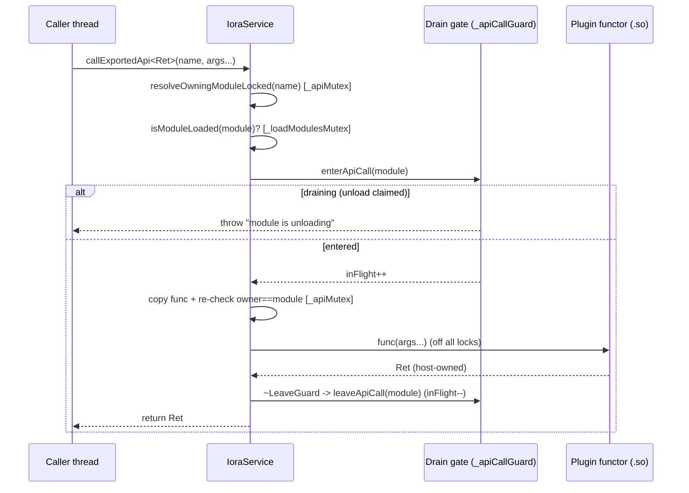

# Iora Service (`iora::IoraService`) — Architecture & Programmer's Guide

[Back to index](../README.md)

| | |
|---|---|
| **Version** | 1.2 |
| **Date** | 2026-09-24 |
| **Status** | IMPLEMENTED |
| **Header** | `include/iora/iora.hpp` |
| **Namespace** | `iora` (`iora::IoraService`, `iora::IoraPlugin`) |
| **Dependencies** | `core/config_loader.hpp`, `core/metrics.hpp`, `core/event_queue.hpp`, `core/logger.hpp`, `core/plugin_loader.hpp`, `core/service_registry.hpp`, `core/thread_pool.hpp`, `network/http_client.hpp`, `network/webhook_server.hpp`, `parsers/json.hpp`, `parsers/xml.hpp`, `storage/concrete_state_store.hpp`, `storage/json_file_store.hpp`, `system/shell_runner.hpp`, `util/expiring_cache.hpp`, `util/filesystem.hpp` |

## Revision History

| Version | Date | Changes |
|---------|------|---------|
| 1.0 | 2026-09-09 | Initial flagship guide for the framework entry point. Documents the `IoraService` singleton lifecycle, the nested `Config` structure, the `Plugin` model and `IORA_DECLARE_PLUGIN`, the exported-API access surface (`exportApi`, `getExportedApi`, `getExportedApiSafe`/`SafeApiFunction`, `callExportedApi`), the `RouteBuilder`/`EventBuilder` fluent DSL, and — in depth — the concurrency model that makes module unload use-after-free-safe (the drain gate, the clear-before-dlclose machinery, the host-only wrapper rule, and the documented lock ordering). Traced directly against `include/iora/iora.hpp`. |
| 1.1 | 2026-09-24 | DOC-4: rehomed content from the removed README sections and corrected claims against source. §1 and §9 no longer call the `SafeApiFunction` fast path zero-cost (each call takes `_loadModulesMutex` briefly and holds `cacheMutex` across the invoke). §3.2 states the silent-plaintext TLS consequence; §3.3 documents when dependency hooks fire (including that a batch unload does not notify) and that their exceptions are swallowed; §3.4 adds the relative cost of the access paths and what the tests assert; §3.5/§3.6 list the `std::runtime_error`s each path throws, the per-wrapper serialization, and the refresh-path exception wrapping; new §5.5 (batch `loadModules` failure handling); the §4.1 `catch` comment no longer implies `shutdown()` cleans up after a failed `init()`; §7 separates the `Config` struct from the `iora` executable's TOML keys and lists the fields no file key reaches; Known Limitations adds the related defects. |
| 1.2 | 2026-09-24 | DOC-4 doc-review fixes: the `DP-7` self-unload guard is limited to `callExportedApi` (§1, §4.5, §9); unloading a module from inside a call through one of its `SafeApiFunction` wrappers self-deadlocks (new Known Limitation). §6 lock ordering adds `cacheMutex` → every lock the exported function can reach, and Known Limitations adds two cross-thread deadlocks that follow from it; `TS-1` no longer claims no lock is held across the wait. §3.3 extends the must-not-call rule from the dependency hooks to `onLoad`/`onUnload` and completes the list. §1, §3.4 and §3.6 state that each `SafeApiFunction`/`callExportedApi` call waits for any concurrent load or unload (including user `onLoad`/`onUnload`/hook code), and §3.4 adds the per-call debug-message string. §3.3 corrects the state of M when `onDependencyUnloaded` runs. §3.5 documents that `Args` must be given explicitly and that by-value parameter types then need rvalue arguments. §3.2/§7/Known Limitations cover every missing cert/key/CA case, including a requested mTLS setup, and say the indication is INFO-only. §3.6 and Known Limitations limit the slow-path rewrap to `std::exception`-derived throws. §5.1/§5.5: `validateModulePath` applies only to `loadSingleModule(const std::string&)`, and a new row covers a throwing custom factory or a non-`std` throw from an `IORA_DECLARE_PLUGIN` constructor. Known Limitations: load order can be controlled by a host with `modules.autoLoad=false` plus `loadSingleModule` calls; a webhook `start()` failure leaves the server never started and the retry's `shutdown()` returns early; the installed template path differs from the executable's default config path. Known Limitation rows cite their coding_trackers backlog trackers. |

---

## 1. Executive Summary

### Problem

A production service framework must load and unload native code (shared objects) *at runtime* while other threads are actively calling into that code. The naive design — hand each caller a bare `std::function` copied out of a plugin's export table — is a use-after-free waiting to happen: the callable's type-erased target (its "manager") lives in the plugin's `.so` text, and `dlclose()` unmaps that text. Any surviving copy then dereferences unmapped memory the next time it is invoked *or destroyed*.

Concrete failure modes the header is engineered against (all traceable in the design-principle comments in `iora.hpp`):

- A `SafeApiFunction` whose cached plugin `std::function` outlives `dlclose` → **destructor UAF** when the wrapper is later destroyed.
- A `SafeApiFunction::operator()` invoking its cached function *while* a concurrent unload `dlclose`s the module → **concurrent-call UAF**.
- `callExportedApi` copying a plugin functor out of `_apiExports`, releasing the lock, then invoking a copy that captures a now-destroyed plugin object → **teardown UAF**.
- An export published under an *empty* plugin identity (from a constructor or custom factory, before the plugin name is assigned) that no unload path can ever reclaim → **dangling export past `dlclose`**.

### Solution

`IoraService` is the singleton host that owns every core subsystem (webhook server, thread pool, state store, JSON file store, expiring cache, event queue, config loader, metrics) and privately extends `core::PluginManager` to own the plugin lifecycle. Around the plugin boundary it layers a **hardened concurrency model**:

- **`callExportedApi<Ret>(name, args...)`** — a single *gated* copy-and-invoke. The owning module is resolved, an is-loaded gate rejects a mid-load/mid-unload module, a per-module **in-flight drain gate** is entered, and the unload path *waits* for the call to finish before tearing the module down.
- **`getExportedApiSafe<Sig>(name)` → `SafeApiFunction<Sig>`** — a UAF-safe callable a caller may hold across time. On unload the service **clears the wrapper's cache before `dlclose`** (freeing the plugin functor while the `.so` is still mapped) and, because the invoke runs under the same `cacheMutex`, that clear also *drains* any in-flight invoke.
- **Host-only wrapper creation (`DP-F`/`DP-H-hostonly`)** — `getExportedApiSafe` throws if called while `_loadModulesMutex` is held (i.e. from a plugin `onLoad`), because a wrapper constructed in a plugin TU would carry a *plugin-resident vtable* that `dlclose` frees.
- **Authoritative `apiName → module` reverse map (`_apiToModule`)** — one source of truth for which module owns an export, so unexport-on-unload is owner-checked and leak-free.

### Technical Impact

- **No per-call counter or drain on the held-wrapper fast path.** `SafeApiFunction::operator()` checks `isModuleLoaded` (a `_loadModulesMutex` acquisition) and invokes the cached function while holding the wrapper's `cacheMutex`; the unloader's cache clear takes the same mutex, so it doubles as the drain. The price is two mutex acquisitions per call and serialization of all calls through one wrapper (section 3.6). The `_loadModulesMutex` acquisition is short only when no load or unload is running: it waits for any concurrent `loadSingleModule`/`unloadSingleModule`/`unloadAllModules`, which hold that mutex across user `onLoad`/`onUnload`/dependency-hook code, so a slow `onLoad` stalls every `SafeApiFunction` and `callExportedApi` call on every thread.
- **Bounded, deadlock-aware teardown.** The drain gate blocks an unload only for the exact set of in-flight calls to *that* module; a same-thread self/transitive unload from inside a `callExportedApi` call is detected and rejected (`DP-7`) rather than deadlocked. The guard does not cover calls through a `SafeApiFunction`: unloading a module from inside one of its wrappers' calls self-deadlocks (Known Limitations).
- **Deterministic destruction order.** Host-side teardown (`onUnload`, unexport, `ServiceRegistry` cleanup, `~Plugin`) always completes *before* `dlclose`, and for a batch unload *every* module's host-side teardown runs before *any* `dlclose`.
- **Fail-closed export boundary.** Empty API name or empty plugin identity is rejected at `exportApi`, so no un-reclaimable export can be created.

---

## 2. System Architecture

### Component Relationships

```
iora::IoraService : private core::PluginManager      [include/iora/iora.hpp]
│
├── Core subsystems (unique_ptr members, created in applyConfig)
│   ├── _webhookServer     network::WebhookServer      (features.server)
│   ├── _stateStore        storage::ConcreteStateStore (features.stateStore)
│   ├── _cache             util::ExpiringCache<string,string> (features.expiringCache)
│   ├── _configLoader      core::ConfigLoader          (always)
│   ├── _jsonFileStore     storage::JsonFileStore      (features.jsonFileStore)
│   ├── _threadPool        core::ThreadPool            (always)
│   └── _eventQueue        core::EventQueue{4}          (value member, 4 workers)
│
├── Plugin lifecycle (inherited PluginManager + IoraService state)
│   ├── _loadedModules     map<name, unique_ptr<Plugin>>          [_loadModulesMutex]
│   ├── _apiExports        map<apiName, ApiWrapper>               [_apiMutex]
│   ├── _apiToModule       map<apiName, moduleName>  (reverse map)[_apiMutex]
│   ├── _apiUnloadingModules  set<name>  (unload claim)           [_loadModulesMutex]
│   ├── _dependents / _pendingDependencies  dependency graph      [_loadModulesMutex]
│   ├── _safeApiRegistry   map<name, vector<weak_ptr<ISafeApiClearable>>> [_apiCallGuard]
│   └── _apiCallGates      map<name, {inFlight,draining}> + _apiDrainCv    [_apiCallGuard]
│
├── Nested types
│   ├── Config             (server/modules/state/log/threadPool/features)
│   ├── Plugin  (abstract) onLoad / onUnload / require / onDependency{Loaded,Unloaded}
│   ├── SafeApiFunction<Sig> : ISafeApiClearable   (UAF-safe callable wrapper)
│   ├── RouteBuilder / EventBuilder                (fluent DSL)
│   ├── AutoServiceShutdown                        (RAII shutdown)
│   └── LoadModulesGuard                           (ownsLoadModulesMutex()-syncing lock)
│
└── Singleton storage   shared_ptr<IoraService>   (instancePtr / destroyInstance)
```

Plugin loader internals — how a `.so` is `dlopen`ed, symbol-resolved, and `dlclose`d — live in `core::PluginLoader` / `core::PluginManager`. See [core/plugin_loader.md](core/plugin_loader.md); this guide covers only the `IoraService` layer that wraps them.

### Data Flow — a gated exported-API call



### Threading Model

| Thread | Responsibility |
|--------|----------------|
| Application / caller threads | Call `callExportedApi`, invoke `SafeApiFunction`, register routes/handlers, load/unload modules |
| Webhook server threads | Run HTTP/TLS handlers registered via `RouteBuilder::handleJson` |
| `EventQueue` workers (4) | Dispatch events pushed via `pushEvent`; run handlers registered via `EventBuilder` and the async `module.(unload\|reload)` invalidation of `SafeApiFunction` |
| `ThreadPool` workers | Application-submitted asynchronous work |
| Main thread | Typically blocks in `waitForTermination()` until `terminate()` (e.g. from a `SIGINT` handler) |

---

## 3. Component Deep Dive

### 3.1 `IoraService` — the singleton host

`IoraService` is a non-copyable singleton (`IoraService(const IoraService&) = delete`). It is never constructed directly by application code; access is through static accessors:

- `static std::shared_ptr<IoraService> instance()` — returns the singleton `shared_ptr`, lazily creating it. Preferred: the `shared_ptr` keeps the instance alive for the duration of use.
- `static IoraService& instanceRef()` — a reference for backward compatibility. Documented **WARNING**: this can dangle if `destroyInstance()` runs on another thread; it never returns null because `instancePtr()` always creates on demand.
- `static std::shared_ptr<IoraService>& getInstancePtr()`, `static std::shared_ptr<IoraService> instancePtr()`, `static void destroyInstance()` — the singleton storage. When `iora.hpp` is compiled *into the shared core* (`IORA_CORE_SHARED` or `IORA_CORE_BUILDING`) these are declared and defined once in `src/core/iora_core.cpp`; otherwise they are provided inline with a function-local static `shared_ptr` and an `instanceMutex`.

The instance owns each subsystem behind a `const unique_ptr<T>&` accessor: `webhookServer()`, `stateStore()`, `cache()`, `configLoader()`, `jsonFileStore()`, `threadPool()`. `metrics()` returns `core::MetricsRegistry::instance()` (a function-local static, available *before* `init()` and *during* shutdown). `eventQueue()` returns the by-value `_eventQueue` member.

### 3.2 Lifecycle — `init`, `applyConfig`, `shutdown`

**`static void init(const Config& config)`** is the configuration entry point. It first calls `shutdown()` if an instance already exists (guaranteeing a clean slate), obtains a fresh instance, stores the config, and calls `applyConfig()`.

**`void applyConfig()`** (private) performs staged construction and throws `std::runtime_error` if `_isRunning` is already true (reconfiguration of a running service is disallowed). Order and gating:

1. **Logger** first — `core::Logger::init(level, file, async, retentionDays, timeFormat, compressAfterDays)`. A second init throws and is logged-and-skipped (idempotent).
2. **`JsonFileStore`** — created at `state.file` when `features.jsonFileStore != false`.
3. **`WebhookServer`** — created and `start()`ed when `features.server != false`; TLS is enabled only if `certFile`, `keyFile`, *and* `caFile` are all set. If any of the three is missing — a certificate and key but no CA file, only one of certificate/key, or an mTLS request (`--tls-require-client-cert`, `requireClientCert = true`) with any file missing — the server starts in **plaintext HTTP with no client authentication**. The only trace is two INFO-level log lines, `applyConfig: server.tls.caFile = <unset>` (or the matching cert/key line) and `applyConfig: TLS is not enabled`, which are not emitted at `warn` or above. Verify the listener rather than the log, for example with `openssl s_client -connect <host>:<port>` (see Known Limitations). This is stricter than `HttpServer::enableTls` itself, which requires `caFile` only when `requireClientCert` is true. A failed `start()` rethrows.
4. **`ThreadPool`** — always created.
5. **`ConfigLoader`** — created if not already set (from `config.configFile`, defaulting to `IORA_DEFAULT_CONFIG_FILE_PATH`).
6. **Modules path** — taken from `modules.directory` if set.
7. **`ConcreteStateStore`** — when `features.stateStore != false`.
8. **`ExpiringCache`** — when `features.expiringCache != false` (1-minute flush interval).
9. **Module auto-load** — when `features.modules != false` *and* `modules.autoLoad != false`, `loadModules()` runs. A module that fails by throwing ends the batch and the exception propagates out of `applyConfig()` and `init()` (section 5.5).

`applyConfig()` sets `_isRunning = true` at the end, so it stays `false` when any step above throws (see Known Limitations).

**`static void shutdown()`** is idempotent (guards on `_isRunning`) and tears down in a deliberate order. The order is load-bearing:

1. Set `_isRunning = false` (reentrancy guard).
2. **Stop and destroy the webhook server *before* unloading modules** — plugins register route callbacks (`std::function`s) on the server; unloading modules first would leave those callbacks dangling into unmapped `.so` memory.
3. `unloadAllModules()`.
4. Reset the thread pool; clear dependency maps.
5. Clear `_apiExports` and `_apiToModule` — done **without** holding `_apiMutex`, which is safe *only* under the documented `destroyInstance` quiescence precondition (no thread may call `getExportedApiSafe`/`callExportedApi`/`(un)loadModule` concurrently with service destruction).
6. Flush the JSON file store; reset `_stateStore`, `_jsonFileStore`, `_configLoader`, `_cache`; reset `_config`.
7. `core::Logger::shutdown()`.
8. `destroyInstance()`.

All of `shutdown()` runs inside try/catch arms that swallow exceptions (a shutdown must not throw).

**`~IoraService()`** is a best-effort net: it stops `_webhookServer` and flushes `_jsonFileStore` inside nested try/catch (logging may be unavailable if the `Logger` is already destroyed, in which case it falls back to `std::cerr`).

**`AutoServiceShutdown`** is an RAII helper whose destructor calls `IoraService::shutdown()`; construct one in `main()` after `init()` for guaranteed teardown on scope exit.

**`waitForTermination()` / `terminate()`** implement a condition-variable rendezvous over `_terminationMutex`/`_terminationCv`/`_terminated`: the main thread blocks in `waitForTermination()` until another thread (e.g. a signal handler) calls `terminate()`.

### 3.3 `Plugin` — the plugin contract

`IoraService::Plugin` (aliased `iora::IoraPlugin`) is the abstract base every plugin subclasses:

- **Constructor** `explicit Plugin(IoraService* service)` throws `std::invalid_argument` on a null service.
- **`virtual void onLoad(IoraService* service) = 0`** — called once the plugin object is constructed *and its name/path are assigned*. This is the only correct place to export APIs and call `require`. It runs on the loading thread with `_loadModulesMutex` held (see the must-not-call rule below).
- **`virtual void onUnload() = 0`** — called before unload, while the `.so` is still mapped. It runs on the unloading thread with `_loadModulesMutex` held (see the must-not-call rule below).
- **`const std::string& getIdentity() const`** — the plugin's identity string (its `_name`, set to the `.so` filename by the loader).
- **`void require(const std::string& moduleName)`** — must be called from `onLoad`; throws `std::runtime_error` if the required module is not currently loaded (a module that is being unloaded counts as not loaded), then registers the dependency and invokes `onDependencyLoaded(moduleName)` **immediately**, before `require` returns. A `require` failure that `onLoad` lets escape fails the load (section 5.2).
- **`virtual void onDependencyLoaded/onDependencyUnloaded(const std::string&)`** — default no-op hooks for dependency lifecycle events.

When the dependency hooks fire, for a plugin D that called `require("M")`:

| Event | Hook on D | Order |
|-------|-----------|-------|
| D's own `require("M")` succeeds | `onDependencyLoaded("M")` | Synchronously inside `require`, during D's `onLoad` |
| M is loaded again later (`loadSingleModule` or the load half of `reloadModule`) while D is loaded | `onDependencyLoaded("M")` | After M's `onLoad` succeeds and M is inserted into the module map, under `_loadModulesMutex` |
| M is unloaded by `unloadSingleModule` (or the unload half of `reloadModule`) | `onDependencyUnloaded("M")` | **Before** M's `onUnload`, under `_loadModulesMutex`. M is already claimed as unloading: `isModuleLoaded("M")` returns `false`, M's `SafeApiFunction` caches have been cleared and its in-flight `callExportedApi` calls drained. Only M's plugin object, its `.so` mapping and its export entries remain |
| M is unloaded by `unloadAllModules()` (including `shutdown()`) | *none* | The batch unload passes `notifyDependents=false`, so dependents are not told |

An exception (standard or not) thrown from `onDependencyLoaded` or `onDependencyUnloaded` is logged at error level and swallowed; it never fails `require`, the dependency's load, or its unload, and the remaining dependents are still notified. Because the unload notification runs before `onUnload`, dependents have already been told when M's `onUnload` then throws and the unload is abandoned (M stays loaded; see Known Limitations). The hooks run on the loading or unloading thread with `_loadModulesMutex` held.

**Must-not-call rule for `onLoad`, `onUnload` and the dependency hooks.** All four run with `_loadModulesMutex` held (`onLoad` under `loadSingleModule`'s `LoadModulesGuard`; `onUnload` inside `teardownModuleHostSideLocked`, reached from `unloadSingleModule` and `unloadAllModules` after the guard is re-acquired; the hooks as described above). That mutex is non-recursive, so none of them may call anything that takes it again. Each of these self-deadlocks the calling thread: `loadSingleModule`, `unloadSingleModule`, `reloadModule`, `unloadAllModules`, `loadModules` (protected, so reachable only from an `IoraService` subclass), `isModuleLoaded`, `callExportedApi`, and a `SafeApiFunction` call or `SafeApiFunction::isAvailable()`. `getExportedApiSafe` throws there instead (host-only rule). `exportApi`, `getExportedApi` and `require` (from `onLoad`) are safe: they do not take `_loadModulesMutex`.

`_name` is assigned by `loadSingleModule` *after* the factory returns but *before* `onLoad` runs. This is why an export from a plugin constructor or a custom factory would carry an *empty* identity — and why `exportApi` rejects an empty identity outright.

The **`IORA_DECLARE_PLUGIN(PluginType)`** macro emits the `extern "C" iora::IoraPlugin* loadModule(iora::IoraService*)` factory the loader resolves. It constructs `new PluginType(service)` and, on a `std::exception`, logs and returns `nullptr` (a null return makes the load fail cleanly).

### 3.4 Exported APIs — registration and the four access paths

**Registration** — two overloads, the first delegating to the second:

```cpp
template <typename Func> void exportApi(Plugin& plugin, const std::string& name, Func&& func);
template <typename Func> void exportApi(const std::string& pluginIdentity,
                                        const std::string& name, Func&& func);
```

The identity overload rejects an empty `name` (`std::invalid_argument`) and an empty `pluginIdentity` (`std::invalid_argument` — the boundary guard against un-reclaimable exports), then, under `_apiMutex`, rejects a duplicate name (`std::runtime_error`) and writes both `_apiExports[name]` and `_apiToModule[name] = pluginIdentity`. `_apiToModule` has exactly **one write site** — this overload — so the two maps never disagree. `makeStdFunction` deduces the callable's signature (function pointer, `std::function`, lambda/functor via `operator()`) and type-erases it into an `ApiWrapper`. The struct holds three members: `std::any func`, `std::string signature`, and `std::type_index type_id` (retained for type identity). Only `func` and `signature` drive `get()`'s `any_cast` and its mismatch diagnostics.

An export whose identity matches a loaded module's name is **auto-unexported** when that module unloads (via `removeExportsForModule`, driven by `_apiToModule`). There is no manual per-name unexport; a synthetic/host-owned identity that matches no module is cleared only at service shutdown.

The **four ways to reach an export** differ entirely in their lifetime safety:

| Path | Signature | Safety across a concurrent unload |
|------|-----------|-----------------------------------|
| `getExportedApi<Sig>(name)` | `std::function<Sig>` | **UNSAFE (`DP-9`).** Bare copy under `_apiMutex` only; no is-loaded gate, no drain. Never retain across a possible unload/load-failure. |
| `callExportedApi<Ret>(name, args...)` | `Ret` | **Safe for one gated call.** Drain gate + is-loaded gate + owner re-check. Return type must be host-owned. |
| `getExportedApiSafe<Sig>(name)` | `shared_ptr<SafeApiFunction<Sig>>` | **Safe to hold across time.** Clear-before-`dlclose` + `cacheMutex` drain. Host-only creation. |
| `getExportedApiNames()` | `vector<string>` | Read-only snapshot of names under `_apiMutex`. |

**Relative cost per call.** `getExportedApi` returns a bare `std::function`: once obtained, a call is a plain indirect call. A `SafeApiFunction` call adds a `_loadModulesMutex` acquisition (`isModuleLoaded`) and holds its `cacheMutex` across the invoke. `callExportedApi` does the full lookup every time: it first builds a `std::string` (`"IoraService::callExportedApi() - Calling plugin API: " + name`) for `Logger::debug`, which is constructed before the logger checks its level, so the allocation is paid even when debug logging is off; then two `_apiMutex` holds, one `_loadModulesMutex` acquisition, two `_apiCallGuard` acquisitions (enter and leave the drain gate), a `std::function` copy, and a thread-local multiset insert and erase. The `_loadModulesMutex` acquisition in both paths is uncontended only while no module is loading or unloading: it waits for any concurrent load/unload to finish, including user `onLoad`, `onUnload` and dependency-hook code run under that mutex, so a slow `onLoad` stalls every exported-API call on every thread. So a held `SafeApiFunction` is the right tool for repeated calls, and `callExportedApi` for occasional ones. The benchmark sections of `tests/service/iora_test_plugin.cpp` measure all three over 100,000 calls and assert:

- `SafeApiFunction` per-call time < `callExportedApi` per-call time (every build);
- in `NDEBUG` builds only, `SafeApiFunction` per-call time minus bare `std::function` per-call time < 50 ns;
- in `NDEBUG` builds only, the first `SafeApiFunction` call after an unload/reload (the cache refresh), averaged over 10 reloads, < 50 µs.

The tests print the bare `getExportedApi` figure but do not assert that it is the fastest.

### 3.5 `callExportedApi` — the single gated call

```cpp
template <typename Ret, typename... Args>
Ret callExportedApi(const std::string& name, Args&&... args);
```

Steps (each a distinct synchronization event):

1. **Resolve owner** under `_apiMutex` via `resolveOwningModuleLocked(name)` → throws `"API not found"` if absent.
2. **Is-loaded gate** (`DP-6b`): `isModuleLoaded(module)` under `_loadModulesMutex` (taken and released, never nested with `_apiMutex`) → throws `"module ... not loaded"` for a mid-`onLoad` or claimed-unloading module.
3. **Enter the drain gate**: `enterApiCall(module)` → throws `"module ... is unloading"` if the gate is draining. A rejected call never materializes a copy.
4. **Arm the `LeaveGuard`** *before* pushing the thread-local in-flight marker, so even a throwing push still runs `leaveApiCall` (no permanent drain hang). The guard pops exactly one entry from `inFlightApiModules()` (`erase(find)`, not `erase(key)`) and calls `leaveApiCall`.
5. **Copy with an owner re-check** in the same `_apiMutex` hold (`C-1`): re-resolve `owner == module` and re-find `_apiExports[name]`, guarding against a concurrent unexport+re-export rebinding the name to a different module while the gate protected the original.
6. **Invoke off all locks.** The gate keeps the module's host-side teardown waiting until the call returns and the guard fires `leaveApiCall`.

**Declaration order matters (`DP-8`):** the `LeaveGuard` is declared *before* the local `func`, so `~func` (whose manager is `.so`-resident) runs *before* `leaveApiCall` releases the gate.

**Exceptions.** Every rejection is a `std::runtime_error`: `"API not found: <name>"` (step 1), `"plugin API unavailable: module <m> not loaded"` (step 2), `"plugin API unavailable: module <m> is unloading"` (step 3), `"API not found or owner changed for: <name>"` (step 5), and `"API signature mismatch for '<name>'. Expected: ..., Actual: ..."` when `Ret(Args...)` is not exactly the exported signature. An exception thrown by the exported function itself propagates unchanged.

**Give `Args` explicitly.** `Args&&...` is a forwarding reference, so letting the compiler deduce `Args` produces reference and array types that do not match the export: an lvalue `int x` deduces `int&` (looked up as `Ret(int&)`), and a string literal deduces `const char (&)[N]`; both fail at step 5 with `"API signature mismatch"`. Only prvalue arguments of exactly the parameter types happen to deduce correctly. Name the exported parameter types as template arguments, as section 4.3 and `tests/service/iora_test_plugin.cpp` do (`callExportedApi<int, int, int>("testplugin.add", 2, 3)`, `callExportedApi<std::string, const std::string&>("testplugin.greet", "World")`). With explicit `Args` the function parameters become `Args&&`, so a by-value parameter type such as `int` is taken as `int&&` and rejects an lvalue at compile time ("cannot bind rvalue reference"): pass a temporary (`int(x)`), a literal, or `std::move(x)`. A `const T&` parameter type binds lvalues normally. (Checked in a scratch build: deduced `<int>(name, x, y)` with `int` lvalues and deduced `<std::string>(name, "lit")` both throw the mismatch; `<int, int, int>(name, int(x), int(y))` returns the sum.)

**The return type MUST be host-owned.** C++17 guaranteed copy elision materializes the returned object in the *caller's* frame, so a return type whose destructor lives in the plugin `.so` would run *after* the drain releases — outside the gate's protection. All in-repo callers return host-owned types (e.g. a reference to a host `CodecRegistry`, or a `parsers::Json`).

### 3.6 `SafeApiFunction<R(Args...)>` — the held wrapper

Obtained only via `getExportedApiSafe`, returned as a `shared_ptr`. It derives from the non-template base `ISafeApiClearable` so the service can clear a heterogeneous registry of wrappers before `dlclose` (`DP-B`).

Public surface:

```cpp
void invalidateAndClearCache() noexcept override;   // clear cache under cacheMutex
R    operator()(Args... args) const;                // validate + invoke (thread-safe)
bool isAvailable() const;                            // service->isModuleLoaded(moduleName)
const std::string& getModuleName() const;
const std::string& getApiName() const;
```

`operator()` uses double-checked locking:

1. **Fast path**: if `valid` and `service->isModuleLoaded(moduleName)`, take `cacheMutex`, re-check `valid && cachedFunc`, invoke `cachedFunc(args...)`.
2. **Slow path**: take `cacheMutex`; re-check; if the module is not loaded, set `valid=false` and throw `"unavailable: module not loaded"`; otherwise refresh via `service->getExportedApi<R(Args...)>(apiName)`, set `valid=true`, invoke.

**Serialization and reentrancy.** Both paths invoke the user function while holding the wrapper's `cacheMutex` (a plain, non-recursive `std::mutex`), after a `_loadModulesMutex` acquisition in `isModuleLoaded` that waits for any concurrent load or unload to finish (including user `onLoad`/`onUnload`/dependency-hook code). Consequences: calls through **one** `SafeApiFunction` never run concurrently — a slow export serializes every thread sharing that wrapper (use one wrapper per thread, or `callExportedApi`, for parallel calls); and an exported function that calls back into the **same** wrapper, directly or through a callback, re-locks `cacheMutex` on the same thread, which is undefined behavior and in practice a self-deadlock. The same re-lock happens when the exported function, directly or transitively (for example through a `callExportedApi` of another module's export), unloads the wrapper's own module: the unload's `clearSafeApiCaches` calls `invalidateAndClearCache()` on this wrapper (Known Limitations). Because `cacheMutex` is held across arbitrary user code, it is ordered before every lock that code can reach (section 6).

**Exceptions.** Construction (`getExportedApiSafe`) throws `std::runtime_error` `"API not found: <name>"` if no module owns the name, and a host-only violation error if called during a module load. `operator()` throws `std::runtime_error` `"API '<name>' unavailable: module '<m>' not loaded"` when the module is not loaded or is being unloaded. On the slow path the refresh and the invoke share one `try` whose handler is `catch (const std::exception&)`: a signature mismatch, a vanished export, **or a `std::exception`-derived exception thrown by the exported function itself** is rethrown as `std::runtime_error("Failed to refresh API '<name>': " + what())` and marks the wrapper invalid, whereas the same exception thrown on the fast path propagates unchanged (see Known Limitations). A non-`std` exception (for example `throw 42;`) is not caught by that handler: it propagates unchanged on either path, and on the slow path the wrapper is left marked valid with the refreshed function cached. The first call on a new wrapper, and the first call after a reload, take the slow path.

`invalidateAndClearCache()` (called by the unloader with `_loadModulesMutex` released, before `dlclose`) takes `cacheMutex`, sets `valid=false`, and destroys `cachedFunc`. Because `operator()` invokes *under* `cacheMutex`, this clear both frees the plugin functor before `dlclose` **and** waits out any in-flight invoke of that wrapper (`DP-CACHEMUTEX-SERIALIZES`).

The wrapper also lazily registers an event handler for `^module\.(unload|reload)\.<module>$` that sets `valid=false`. This async invalidation is now **redundant** for safety (the synchronous clear-before-`dlclose` already invalidates) and is retained only as harmless belt-and-suspenders — do not reintroduce reliance on it.

### 3.7 `RouteBuilder` and `EventBuilder` — the fluent DSL

`on(endpoint)` returns a `RouteBuilder` bound to the webhook server; `handleJson(handler)` registers a JSON POST route (`WebhookServer::onJsonPost`). `on()` throws `std::logic_error` if the server is disabled (`features.server=false`) — it is the only public accessor that unconditionally dereferences `_webhookServer`.

`onEvent(id)`, `onEventName(name)`, and `onEventNameMatches(pattern)` return an `EventBuilder` tagged `ID`, `NAME`, or `NAME_MATCHES`; `handle(handler)` dispatches to `EventQueue::onEventId` / `onEventName` / `onEventNameMatches`. Events are pushed with `pushEvent(const parsers::Json&)`.

---

## 4. Usage Guide

### 4.1 Bootstrapping a service in `main()`

```cpp
#include <csignal>
#include <iora/iora.hpp>

int main(int argc, char** argv)
{
  try
  {
    iora::IoraService::Config config;
    config.server.port = 8080;
    config.log.level = "info";
    config.modules.directory = "/usr/local/iora/modules";

    iora::IoraService::init(config);

    // Hold the shared_ptr (keeps the instance alive) and let the RAII guard
    // run shutdown() on scope exit. shutdown() is idempotent.
    auto svc = iora::IoraService::instance();
    iora::IoraService::AutoServiceShutdown guard(*svc);

    std::signal(SIGINT, [](int) { iora::IoraService::instance()->terminate(); });

    svc->waitForTermination();
  }
  catch (const std::exception& ex)
  {
    std::cerr << "Error initializing IoraService: " << ex.what() << std::endl;
    // init() can throw before the guard is constructed. If the throw came from
    // init()'s own applyConfig(), this shutdown() is currently a no-op (see
    // Known Limitations); it still covers a throw after init() returned.
    iora::IoraService::shutdown();
    return EXIT_FAILURE;
  }

  return 0;
}
```

### 4.2 Writing a plugin that exports an API

```cpp
#include <iora/iora.hpp>

class GreeterPlugin : public iora::IoraService::Plugin
{
public:
  using Plugin::Plugin;  // inherit the base ctor (incl. its null-service check)

  void onLoad(iora::IoraService* svc) override
  {
    // Export ONLY from onLoad: the plugin name (identity) is assigned before
    // onLoad runs, so the export is reclaimable when the module unloads.
    svc->exportApi(*this, "greeter.hello",
                   [](const std::string& who) -> std::string
                   { return "hello, " + who; });
  }

  void onUnload() override {}
};

IORA_DECLARE_PLUGIN(GreeterPlugin)
```

### 4.3 Calling an export safely — one-shot vs. held

```cpp
auto svc = iora::IoraService::instance();

// One gated call (drain-protected). Ret must be host-owned (std::string is).
std::string once = svc->callExportedApi<std::string, const std::string&>(
  "greeter.hello", "world");

// A wrapper held across time — created from a HOST TU (never a plugin onLoad).
auto hello = svc->getExportedApiSafe<std::string(const std::string&)>("greeter.hello");
std::string a = (*hello)("alice");   // works while the module is loaded
// ... module may be unloaded/reloaded here ...
if (hello->isAvailable())
{
  std::string b = (*hello)("bob");   // auto-recovers after a reload
}
```

### 4.4 Registering a route and an event handler

```cpp
auto svc = iora::IoraService::instance();

// JsonHandler is `std::function<parsers::Json(const parsers::Json&)>`:
// it receives the request body and RETURNS the response body.
svc->on("/webhook").handleJson(
  [](const iora::parsers::Json& body) -> iora::parsers::Json
  {
    iora::parsers::Json res = iora::parsers::Json::object();
    res["ok"] = true;
    return res;
  });

// EventQueue::Handler is `std::function<void(const parsers::Json&)>`.
svc->onEventName("call.started").handle(
  [](const iora::parsers::Json& event)
  {
    iora::core::Logger::info("call started: " + event.dump());
  });

iora::parsers::Json ev = iora::parsers::Json::object();
ev["eventName"] = "call.started";
svc->pushEvent(ev);
```

### 4.5 Anti-Patterns

- **Do NOT call `exportApi` from a plugin constructor or a custom `loadModule` factory.** The plugin identity is empty there; `exportApi` throws `std::invalid_argument`. Export from `onLoad`.
- **Do NOT create a `SafeApiFunction` inside a plugin TU** (e.g. from `onLoad`). `getExportedApiSafe` throws when it detects `_loadModulesMutex` is held, because a plugin-resident vtable would use-after-`dlclose`. Resolve wrappers from the host *after* load.
- **Do NOT retain the `std::function` from `getExportedApi` across a possible unload or load-failure.** It has no lifetime guarantee (`DP-9`); use `getExportedApiSafe` or `callExportedApi`.
- **Do NOT return a plugin-owned type from a `callExportedApi` export.** Its destructor would run in the caller frame *after* the drain releases — outside gate protection. Return host-owned types only.
- **Do NOT unload a module from inside its own exported API call.** For a call made through `callExportedApi`, the self-unload guard (`DP-7`) throws (`unloadSingleModule`) or skips-and-reports-false (`unloadAllModules`) rather than deadlock the drain. For a call made through one of the module's `SafeApiFunction` wrappers — directly, or transitively through further calls — there is no guard: the unload re-locks that wrapper's `cacheMutex` and the thread deadlocks permanently, leaving the module claimed as unloading (Known Limitations).
- **Do NOT call `IoraService::on()` when `features.server=false`.** It throws `std::logic_error`.

---

## 5. Call Flow / Sequence Reference

### 5.1 `loadSingleModule` — success path

| Step | Action | Lock |
|------|--------|------|
| 1 | `loadSingleModule(const std::string&)` only: validate path (`validateModulePath`: no `..`/`/.`/`\.`, no null/control chars, ≤4096, extension in `.so`/`.dll`/`.dylib`) and require an existing regular file. The directory scan in `loadModules()` calls the protected `directory_entry` overload directly and skips this step | — |
| 2 | Enter `directory_entry` overload; construct `LoadModulesGuard` (`ownsLoadModulesMutex()=true`) | acquire `_loadModulesMutex` |
| 3 | Fail-fast if the name is claimed unloading | held |
| 4 | `PluginManager::loadPlugin(name, path)` (`dlopen`); set `pluginRegistered=true` | held |
| 5 | `resolve<LoadModuleFunc>(name, "loadModule")`; call factory → `Plugin*` | held |
| 6 | Assign `_name`, `_path`; call `onLoad(this)` | held |
| 7 | Insert into `_loadedModules`; `notifyDependentsOfLoad(name)` | held |
| 8 | Return `true`; `~LoadModulesGuard` (`ownsLoadModulesMutex()=false`) | release |

### 5.2 `loadSingleModule` — `onLoad` throws (cleanup path)

| Step | Action | Lock |
|------|--------|------|
| 1–5 | As above, through the factory call | `_loadModulesMutex` held |
| 6 | `onLoad` throws | held |
| 7 | Inner catch: `cleanupPartialLoadLocked(name)` — `removeExportsForModule` (`_apiMutex`), `ServiceRegistry::unregisterModule` (noexcept), erase `_loadedModules[name]` (`~Plugin` while `.so` mapped), prune tracking (`_apiCallGuard`) | held (+ nested `_apiMutex`/`_apiCallGuard`) |
| 8 | Rethrow to outer catch → `cleanupIfRegistered()` (idempotent) then `PluginManager::unloadPlugin(name)` (`dlclose`) | held |
| 9 | Rethrow to caller | release |

Invariant: every host-side destroy runs while the `.so` is still mapped; `dlclose` happens only after cleanup. A throw from cleanup safely *skips* the `dlclose` (the `.so` stays mapped, so the still-present export is not dangling).

A `require()` that throws inside `onLoad` takes this path unless `onLoad` catches it.

### 5.3 `unloadSingleModule` — success path

| Step | Action | Lock |
|------|--------|------|
| 1 | `LoadModulesGuard guard(_loadModulesMutex)` | acquire `_loadModulesMutex` |
| 2 | Not found → return false; already unloading → return false | held |
| 3 | Self-unload guard: if this thread has the module in `inFlightApiModules()`, throw *before* claiming | held |
| 4 | Claim: `_apiUnloadingModules.insert(name)`; `beginApiDrain(name)` (new calls now rejected). On throw, `openGate` + rethrow | held (+ `_apiCallGuard`) |
| 5 | `guard.unlock()`; `clearSafeApiCaches(name)` (each wrapper's `cacheMutex`); `drainApiCalls(name)` (wait `inFlight==0`); `guard.lock()` | **`_loadModulesMutex` released** |
| 6 | `teardownModuleHostSideLocked(name, notifyDependents=true)` — `onUnload`, `removeExportsForModule`, `ServiceRegistry::unregisterModule`, erase, prune | held |
| 7 | If erased: `PluginManager::unloadPlugin(name)` (`dlclose`) | held |
| 8 | `openGate(name)` (release claim + end drain) — always | held |
| 9 | On success push `module.unload.<name>` event | held |

### 5.4 `SafeApiFunction::operator()` after a reload

| Step | Action | Lock |
|------|--------|------|
| 1 | `registerEventHandler()` (once) | — |
| 2 | Fast path: `valid && isModuleLoaded`? After a reload `valid` may be false | — / `_loadModulesMutex` (in `isModuleLoaded`) |
| 3 | Slow path: take `cacheMutex`; re-check | `cacheMutex` |
| 4 | Module not loaded → `valid=false`, throw | `cacheMutex` |
| 5 | Refresh `cachedFunc = getExportedApi<Sig>(apiName)`; `valid=true`; invoke | `cacheMutex` → `_apiMutex` |

### 5.5 `loadModules` — batch failure handling

`loadModules()` (run by `applyConfig()` when auto-load is on) returns early, loading nothing, if `modules.directory` is unset, missing, or not a directory (logged). Otherwise it loads either each name in `modules.modules` (in list order) or, when that list is unset or empty, every regular file in the directory with a `.so`/`.dll`/`.dylib` extension, in `directory_iterator` order (unspecified). Each module goes through `loadSingleModule`. The loop has no `try`/`catch`, so what happens next depends on how that module fails:

| Failure | Result | Batch |
|---------|--------|-------|
| Listed file missing or not a regular file | Logged (`Module not found`) | Continues |
| Listed path fails `validateModulePath` (applies only to the `modules.modules` list path, which goes through `loadSingleModule(const std::string&)`; the directory scan calls the `directory_entry` overload and skips it) | Logged; `loadSingleModule` returns `false` | Continues |
| Symlink target cannot be resolved, or resolved extension not allowed (both paths) | Logged; `loadSingleModule` returns `false` | Continues |
| Module name is mid-unload | Logged; returns `false` | Continues |
| Factory returns `nullptr` (including an `IORA_DECLARE_PLUGIN` constructor that threw a `std::exception`) | Logged; cleaned up; returns `false` | Continues |
| A custom (non-macro) `loadModule` factory throws, or an `IORA_DECLARE_PLUGIN` constructor throws a non-`std::exception` (the macro catches only `std::exception`) | Cleaned up (`catch (const std::exception&)` or `catch (...)` arm); rethrown | **Stops** |
| `dlopen` fails (`PluginLoader` throws `"Failed to load library: ..."`) | Cleaned up; rethrown | **Stops** |
| `loadModule` symbol missing (`"Failed to resolve symbol: loadModule"`) | Cleaned up; rethrown | **Stops** |
| A plugin of the same name is already registered (`"Plugin already loaded: <name>"`) | Rethrown | **Stops** |
| `onLoad` throws, including an uncaught failed `require()` | Partial load cleaned up (section 5.2); rethrown | **Stops** |

A stopping failure propagates out of `loadModules()`, `applyConfig()`, and `init()`. Modules already loaded earlier in the batch stay loaded, later ones are never attempted, and because `applyConfig()` never reaches `_isRunning = true`, `shutdown()` then does nothing (see Known Limitations).

---

## 6. Thread Safety Model

### Mutexes and their scope

| Mutex / primitive | Guards | Role |
|-------------------|--------|------|
| `_loadModulesMutex` (`mutable std::mutex`) | `_loadedModules`, `_apiUnloadingModules`, dependency maps, module map mutations | **Outer** lock of the module lifecycle |
| `_apiMutex` (`mutable std::mutex`) | `_apiExports`, `_apiToModule` | **Inner** lock of the export table |
| `_apiCallGuard` (`mutable std::mutex`) | `_safeApiRegistry`, `_apiCallGates`, `_apiDrainCv` | **Leaf** — two unrelated concerns co-located (registry + drain gate) |
| `SafeApiFunction::cacheMutex` (per wrapper) | `cachedFunc` | Held during invoke *and* during clear (serializes them) |
| `_terminationMutex` + `_terminationCv` | `_terminated` | Main-thread block/wake |
| `_apiDrainCv` | (over `_apiCallGuard`) | Wakes an unloader when `inFlight` hits 0 |
| `_isRunning` (`std::atomic<bool>`) | running state | Reentrancy guard for `applyConfig`/`shutdown` |
| `SafeApiFunction::valid`, `eventHandlerRegistered` (`std::atomic<bool>`) | wrapper state | Lock-free validity flag / one-shot registration |

### Documented lock ordering (the only nestings)

```
_loadModulesMutex  ->  _apiMutex           (any path holding both)
_loadModulesMutex  ->  _apiCallGuard       (unload begin/drain/end, teardown->prune)
cacheMutex         ->  _loadModulesMutex -> _apiMutex   (operator() slow-path refresh)
cacheMutex         ->  any lock the exported function can reach   (operator() invoke)
```

The last edge is not a fixed pair. `operator()` holds `cacheMutex` while it runs the exported function (both paths), so `cacheMutex` is ordered before **every** lock that user code can take: `_loadModulesMutex`, `_apiMutex` and `_apiCallGuard` (through a nested `callExportedApi`, `isModuleLoaded`, load or unload), the drain wait of an unload, another wrapper's `cacheMutex` (through a nested wrapper call or an unload's `clearSafeApiCaches`), and the plugin's own locks. Nothing enforces a global order among different wrappers' `cacheMutex`es or between a `cacheMutex` and the drain gate, so an exported function that loads, unloads, or calls another wrapper can take part in a cycle. The known cases are listed in Known Limitations (same-thread self-unload; two cross-thread cycles).

The **unload CLEAR is the exception that closes the cycle**: `clearSafeApiCaches` takes each wrapper's `cacheMutex` with `_loadModulesMutex` **released** (`DP-CLEAR-OFF-LOADMUTEX`). A `_loadModulesMutex → cacheMutex` edge would cycle with `operator()`'s `cacheMutex → _loadModulesMutex` order — the exact deadlock a naive clear-under-`_loadModulesMutex` would hit. No path takes `_loadModulesMutex` while holding `_apiCallGuard` inverted, and `callExportedApi` enters/leaves the gate *disjoint* from its `_apiMutex` copy (never both held).

### The drain gate (`_apiCallGates` + `_apiDrainCv`)

| Operation | Synchronization | Notes |
|-----------|-----------------|-------|
| `enterApiCall(m)` | `_apiCallGuard` | Returns false if `draining`; else `++inFlight` |
| `leaveApiCall(m)` | `_apiCallGuard` | `find()`+assert (never `operator[]`, which could underflow `size_t` and hang the drain); notifies `_apiDrainCv` **under the lock** at the last departure when draining (destroyer-observes discipline); erases an idle non-draining gate to keep the map bounded |
| `beginApiDrain(m)` | `_apiCallGuard` | Set in the same `_loadModulesMutex` critical section as the claim, so no call slips the claim-to-drain gap |
| `drainApiCalls(m)` | `_apiCallGuard` (CV wait) | Runs with `_loadModulesMutex` **released** (`DP-3`); predicate: gate absent OR `inFlight==0` |
| `openGate(m)` / `endApiDrain(m)` | `_apiCallGuard` | Release claim + clear draining + drop idle gate; `openGate` is no-throw (swallows the effectively-impossible `_apiCallGuard.lock()` failure) so per-module release loops never strand a sibling |

### The clear-before-`dlclose` registry (`_safeApiRegistry`)

`getExportedApiSafe` registers each wrapper as a `weak_ptr<ISafeApiClearable>` keyed by module (`registerSafeApi`, under `_apiCallGuard`) — the **registry-before-handout** invariant: the wrapper is registered before it is returned, so no live wrapper can exist unregistered (whose cache would go uncleared before `dlclose`). On unload, `snapshotSafeApis` locks the weak_ptrs (copy-then-use, so the clear runs *outside* `_apiCallGuard`) and `clearSafeApiCaches` calls `invalidateAndClearCache()` on each. `pruneSafeApiRegistry` drops expired entries so the map stays bounded for uniquely-named, never-reloaded modules.

### Host-only wrapper creation (`DP-F` / `DP-H-hostonly`)

`getExportedApiSafe` throws if `ownsLoadModulesMutex()` — i.e. it is being called while this thread holds `_loadModulesMutex` (the cheaply-detectable "plugin `onLoad`" case). The vtable and `shared_ptr` control block of a `SafeApiFunction` constructed in a plugin TU are resident in the plugin `.so`; if that wrapper (or the service's `weak_ptr` to it) outlives `dlclose`, destroying it invokes an unmapped manager — the exact destructor UAF the design prevents. `ownsLoadModulesMutex()` and `inFlightApiModules()` are **defined once in `src/core/iora_core.cpp`, not as header inline/`thread_local`**, because `iora.hpp` compiles into both the host and each `RTLD_LOCAL` plugin `.so`, and an inline `thread_local` does not guarantee a single TLS instance across a `dlopen` boundary — a plugin-TU write and a host-TU read would touch different objects and the guard would silently fail.

### `LoadModulesGuard`

An RAII wrapper over `std::unique_lock<std::mutex>(_loadModulesMutex)` that keeps `ownsLoadModulesMutex()` in sync with the lock's *actual* held/released state across the release/re-acquire window (its `unlock()`/`lock()` flip the flag), restoring `false` on every throw/return path. Because `_loadModulesMutex` is non-recursive, a single thread never nests two guards, so the flag cannot be clobbered.

---

## 7. Configuration Reference

`IoraService::Config` is a plain struct. Every field is a `std::optional`; unset values resolve to the defaults below in `applyConfig()`. **`IoraService` itself reads no configuration file**: `init()` / `applyConfig()` use only the values the caller put in the struct. (`applyConfig()` does construct a `ConfigLoader` for `configFile`, but only for other code to query through `configLoader()`; it reads no `Config` field from it.)

**The `iora` executable.** `src/iora.cpp` fills the struct from its command line (`parseCliArgs`) and then, for fields still unset, from a TOML file (`parseTomlConfig`; `-c <path>`, default `/etc/iora.conf.d/iora.cfg`, a path that `cmake --install` writes only when the install prefix is `/`; see Known Limitations). For the fields it reads, precedence is **CLI > TOML > default**, enforced by call order in `main()` (`parseCliArgs` before `parseTomlConfig`; the TOML parser writes only when `!has_value()`). Keys are looked up by exact, case-sensitive dotted path; a key spelled differently is silently ignored. The executable reads exactly these keys:

| TOML table | Keys read |
|------------|-----------|
| `[iora.server]` | `port` |
| `[iora.server.tls]` | `certFile`, `keyFile`, `caFile`, `requireClientCert` |
| `[iora.state]` | `file` |
| `[iora.log]` | `level`, `file`, `async`, `retentionDays`, `timeFormat` |
| `[iora.modules]` | `directory`, `autoLoad` |
| `[iora.threadPool]` | `minThreads`, `maxThreads`, `queueSize`, `idleTimeoutSeconds` |
| `[iora.features]` | `server`, `jsonFileStore`, `stateStore`, `expiringCache`, `modules` |

Three `Config` fields are reached by **neither** the file nor the command line and can only be set in code: `server.bindAddress`, `modules.modules`, and `log.compressAfterDays`. For those the precedence rule does not apply — under the `iora` executable they always take their defaults (`"0.0.0.0"`, unset → directory scan, `0` → compression off). The shipped template has further mismatches (see Known Limitations).

### `server` (`Config::ServerConfig`)

| Field | Type | Default | Notes |
|-------|------|---------|-------|
| `bindAddress` | `optional<string>` | `"0.0.0.0"` | Applied only when `features.server != false`. Code-only: no TOML key or CLI flag sets it |
| `port` | `optional<int>` | `8080` | |
| `tls.certFile` | `optional<string>` | unset | TLS enabled only if cert **and** key **and** ca are all set; otherwise the server runs plaintext HTTP (section 3.2) |
| `tls.keyFile` | `optional<string>` | unset | |
| `tls.caFile` | `optional<string>` | unset | |
| `tls.requireClientCert` | `optional<bool>` | `false` | mTLS. Has no effect unless cert, key **and** CA are all set: with any of them missing the server runs plaintext with no client authentication (section 3.2) |

### `modules` (`Config::ModulesConfig`)

| Field | Type | Default | Notes |
|-------|------|---------|-------|
| `autoLoad` | `optional<bool>` | `true` | Load modules during `init` (gated also by `features.modules`) |
| `directory` | `optional<string>` | unset | Module search directory (`_modulesPath`) |
| `modules` | `optional<vector<string>>` | unset | Explicit ordered list; empty/unset → scan the directory for `.so`/`.dll`/`.dylib` (unspecified order). Code-only: no TOML key or CLI flag sets it |

### `state` (`Config::StateConfig`)

| Field | Type | Default | Notes |
|-------|------|---------|-------|
| `file` | `optional<string>` | `"state.json"` | Backing file for `JsonFileStore` (gated by `features.jsonFileStore`) |

### `log` (`Config::LogConfig`)

| Field | Type | Default | Notes |
|-------|------|---------|-------|
| `level` | `optional<string>` | `"info"` | `trace`/`debug`/`info`/`warn`/`warning`/`error`/`fatal` (unrecognized → `Info`) |
| `file` | `optional<string>` | `""` (console) | |
| `async` | `optional<bool>` | `false` | |
| `retentionDays` | `optional<int>` | `7` | |
| `timeFormat` | `optional<string>` | `"%Y-%m-%d %H:%M:%S"` | |
| `compressAfterDays` | `optional<int>` | `0` (off) | Compress rotated files older than N days. Code-only: no TOML key or CLI flag sets it |

### `threadPool` (`Config::ThreadPool`)

| Field | Type | Default (from `applyConfig`) | Notes |
|-------|------|------------------------------|-------|
| `minThreads` | `optional<size_t>` | `1` | |
| `maxThreads` | `optional<size_t>` | `std::thread::hardware_concurrency()` (or `4` if that is 0) | |
| `queueSize` | `optional<size_t>` | `maxThreads * 2` | |
| `idleTimeoutSeconds` | `optional<chrono::seconds>` | `60s` | |

> **Authoritative source:** the thread-pool defaults resolved in `applyConfig()` (min 1 / max `hardware_concurrency` — or 4 if that is 0 / queue `maxThreads*2` / idle 60s) are the single source of truth. As of 2026-09-10 the CLI `--help` text in `src/iora.cpp` matches them exactly (min 1 / max "hardware concurrency, or 4" / queue "2 x max threads"); the earlier stale help string (min 2 / max 8 / queue 128) was corrected.

### `features` (`Config::FeaturesConfig`)

Toggles for optional subsystems. Each unset field resolves to `true` (via `.value_or(true)`), preserving the legacy "construct everything" behavior. Set to `false` to skip construction.

| Field | Type | Default | Disables |
|-------|------|---------|----------|
| `server` | `optional<bool>` | `true` | `WebhookServer` (then `on()` throws `std::logic_error`) |
| `jsonFileStore` | `optional<bool>` | `true` | `JsonFileStore` |
| `stateStore` | `optional<bool>` | `true` | `ConcreteStateStore` |
| `expiringCache` | `optional<bool>` | `true` | `ExpiringCache` |
| `modules` | `optional<bool>` | `true` | Module loader (auto-load) |

### Top-level

| Field | Type | Default | Notes |
|-------|------|---------|-------|
| `configFile` | `optional<string>` | `IORA_DEFAULT_CONFIG_FILE_PATH` (`/etc/iora.conf.d/iora.cfg`) | Drives `ConfigLoader`. The install step writes the template to `${CMAKE_INSTALL_PREFIX}/etc/iora.conf.d/iora.cfg` (`/usr/local/etc/...` with the default prefix), not to this path (Known Limitations) |

---

## 8. API Reference

```cpp
namespace iora
{
// Non-template base for clear-before-dlclose (DP-B).
struct ISafeApiClearable
{
  virtual ~ISafeApiClearable() = default;
  virtual void invalidateAndClearCache() noexcept = 0;
};

class IoraService : private core::PluginManager
{
public:
  IoraService(const IoraService&) = delete;
  IoraService& operator=(const IoraService&) = delete;
  IoraService();
  ~IoraService();

  // Singleton access
  static std::shared_ptr<IoraService> instance();
  static IoraService& instanceRef();
  static std::shared_ptr<IoraService>& getInstancePtr();
  static std::shared_ptr<IoraService> instancePtr();
  static void destroyInstance();

  // Lifecycle
  static void init(const Config& config);
  static void shutdown();
  void waitForTermination();
  void terminate();

  // Subsystem accessors
  const std::unique_ptr<network::WebhookServer>& webhookServer() const;
  const std::unique_ptr<storage::ConcreteStateStore>& stateStore() const;
  const std::unique_ptr<util::ExpiringCache<std::string, std::string>>& cache() const;
  const std::unique_ptr<core::ConfigLoader>& configLoader() const;
  const std::unique_ptr<storage::JsonFileStore>& jsonFileStore() const;
  const std::unique_ptr<core::ThreadPool>& threadPool() const;
  core::MetricsRegistry& metrics();
  core::EventQueue& eventQueue();

  // Factories
  std::unique_ptr<storage::JsonFileStore> makeJsonFileStore(const std::string& filename) const;
  network::HttpClient makeHttpClient() const;

  // Events
  void pushEvent(const parsers::Json& event);
  void registerEventHandlerById(const std::string& eventId, core::EventQueue::Handler handler);
  void registerEventHandlerByName(const std::string& eventName, core::EventQueue::Handler handler);

  // Exported-API registration
  template <typename Func> void exportApi(Plugin& plugin, const std::string& name, Func&& func);
  template <typename Func> void exportApi(const std::string& pluginIdentity,
                                          const std::string& name, Func&& func);

  // Exported-API access
  template <typename FuncSignature>
  std::function<FuncSignature> getExportedApi(const std::string& name);              // UNSAFE (DP-9)
  template <typename FuncSignature>
  std::shared_ptr<SafeApiFunction<FuncSignature>> getExportedApiSafe(const std::string& name);
  template <typename Ret, typename... Args>
  Ret callExportedApi(const std::string& name, Args&&... args);
  std::vector<std::string> getExportedApiNames() const;

  // Fluent DSL
  RouteBuilder on(const std::string& endpoint);
  EventBuilder onEvent(const std::string& eventId);
  EventBuilder onEventName(const std::string& eventName);
  EventBuilder onEventNameMatches(const std::string& eventNamePattern);

  // Module lifecycle
  bool loadSingleModule(const std::string& modulePath);
  bool unloadSingleModule(const std::string& pluginName);
  bool reloadModule(const std::string& pluginName);
  bool isModuleLoaded(const std::string& moduleName) const;
  bool unloadAllModules();
  // loadModules() is PROTECTED — internal, auto-invoked by applyConfig() during
  // init(); it is NOT part of the public surface and cannot be called by
  // application code.
  void setConfigLoader(std::unique_ptr<core::ConfigLoader>&& loader);

  // Host-only enforcement / self-unload guard state (defined in iora_core.cpp)
  static bool& ownsLoadModulesMutex();
  static std::multiset<std::string>& inFlightApiModules();

  struct Config { /* server, modules, state, log, threadPool, features, configFile */ };

  class Plugin
  {
  public:
    explicit Plugin(IoraService* service);
    virtual ~Plugin() = default;
    virtual void onLoad(IoraService* service) = 0;
    virtual void onUnload() = 0;
    IoraService* service() const;
    const std::string& getIdentity() const;
    void require(const std::string& moduleName);
    virtual void onDependencyLoaded(const std::string& moduleName);
    virtual void onDependencyUnloaded(const std::string& moduleName);
  };

  class AutoServiceShutdown
  {
  public:
    explicit AutoServiceShutdown(iora::IoraService& service);
    ~AutoServiceShutdown();
  };
};

template <typename R, typename... Args>
class IoraService::SafeApiFunction<R(Args...)> : public ISafeApiClearable
{
public:
  void invalidateAndClearCache() noexcept override;
  R operator()(Args... args) const;
  bool isAvailable() const;
  const std::string& getModuleName() const;
  const std::string& getApiName() const;
  // Construction is private; getExportedApiSafe is the sole factory (DP-G).
};

class IoraService::RouteBuilder
{
public:
  RouteBuilder(network::WebhookServer& server, const std::string& endpoint);
  void handleJson(const network::WebhookServer::JsonHandler& handler);
};

class IoraService::EventBuilder
{
public:
  enum class EventType { ID, NAME, NAME_MATCHES };
  EventBuilder(core::EventQueue& queue, const std::string& eventId, EventType type);
  void handle(const core::EventQueue::Handler& handler);
};

using IoraPlugin = IoraService::Plugin;

#define IORA_DECLARE_PLUGIN(PluginType) /* emits extern "C" loadModule factory */
} // namespace iora
```

---

## 9. Design Decisions

| Decision | Rationale |
|----------|-----------|
| Host-only `SafeApiFunction` creation (`DP-F`/`DP-H-hostonly`) | A wrapper built in a plugin TU has a `.so`-resident vtable/control block; outliving `dlclose` → destructor UAF. `getExportedApiSafe` rejects the detectable `onLoad` case via `ownsLoadModulesMutex()`. |
| Clear cache **before** `dlclose`, with `_loadModulesMutex` released (`DP-B` + `DP-CLEAR-OFF-LOADMUTEX`) | Frees the plugin functor while the `.so` is still mapped; releasing `_loadModulesMutex` avoids the `_loadModulesMutex→cacheMutex` edge that would cycle with `operator()`'s `cacheMutex→_loadModulesMutex`. |
| Invoke under `cacheMutex` also serves as the drain (`DP-CACHEMUTEX-SERIALIZES`) | The clear takes `cacheMutex`, so it waits out an in-flight invoke — no per-call counter or drain gate is needed. The cost is that calls through one wrapper are serialized and a same-wrapper reentrant call self-deadlocks (Known Limitations). |
| Per-module drain gate for `callExportedApi` (`DP-1b`) | The copied functor captures the plugin object; the unload must wait for in-flight calls before host-side teardown, not merely before `dlclose`. |
| `LeaveGuard` before `func`, guard pops one entry (`DP-8`, `M1`) | `~func` (`.so`-resident manager) must run before the gate releases; `erase(find)` keeps the reentrant/transitive in-flight multiset correct. |
| Owner re-check in the copy hold (`C-1`) | An unexport+re-export could rebind the name to a different module while the gate protects the original; re-resolving `owner==module` proves the copy belongs to the drained module. |
| Return type of `callExportedApi` must be host-owned | C++17 guaranteed copy elision materializes the result in the caller frame; a plugin-owned destructor would run outside the gate. |
| Authoritative `_apiToModule` reverse map, single write site (`A-DP-1`/`A-C1`) | One source of truth for unexport-on-unload; owner-checked teardown never wrong-unexports a re-bound name or leaks a post-snapshot export. |
| Reject empty API name and empty plugin identity at `exportApi` | An empty-identity export keys `_apiToModule[""]`, which `removeExportsForModule` can never reclaim → dangling past `dlclose`. Export only from `onLoad`, where `_name` is set. |
| Claimed-unloading module reports **not loaded** (`DP-E`) | `operator()`, `isModuleLoaded`, `callExportedApi`, and `require` all agree the module is unavailable during the unload window, even while its entry lingers in `_loadedModules`. |
| Same-thread self/transitive unload detection via `inFlightApiModules()` (`DP-7`) | Draining a module the calling thread has in-flight would deadlock; the unloader throws (single) or skips-and-fails (batch) instead. Only `callExportedApi` records its module in `inFlightApiModules()`; `SafeApiFunction::operator()` does not, so an unload from inside a wrapper call is not detected (Known Limitations). |
| `notify_all` under `_apiCallGuard` at the last departure | The woken waiter proceeds to teardown/`dlclose` (the destroyer shape), so notify-under-lock is the correct discipline (see `reference_cv_notify_under_lock_when_destroyer_observes`). |
| Two-pass batch unload (host-side teardown for all, then `dlclose` all) | Guarantees no module's `onUnload` runs after a sibling's `.so` has been `dlclose`d. |
| `ownsLoadModulesMutex()`/`inFlightApiModules()` defined once in `iora_core.cpp` | An inline `thread_local` does not guarantee a single TLS instance across an `RTLD_LOCAL` `dlopen` boundary; the guard would silently fail. |
| Webhook server stopped before module unload in `shutdown()` | Plugins register route callbacks on the server; unloading first would dangle those callbacks into unmapped `.so` memory. |

---

## 10. Known Limitations

- **Cross-thread mutual unload is unsupported (`TS-1`).** The thread-local in-flight set breaks a *same-thread* self/transitive unload cycle but not a *cross-thread* mutual one (thread A inside a call of M unloads N while thread B inside a call of N unloads M). When both calls are `callExportedApi` calls, each drain waits on the other's in-flight count → a condition-variable wait-cycle in which no lock is held across the wait, so it is not a lock deadlock and TSan cannot see it. When the calls are made through `SafeApiFunction` wrappers, locks **are** held across the wait: see the next item. No in-repo caller does this. Per a human decision (2026-09-07) the drain wait is intentionally **unbounded** — a timeout would spuriously abort legitimately long in-flight calls. (coding_trackers: tasks/iora/backlog/2026-09-24-25_safeapifunction-self-unload-cachemutex-relock_P2.json; coding_trackers: tasks/iora/backlog/2026-09-24-24_non-owner-ismoduleloaded-safeapi-plugin-lock-abba_P1.json)
- **Cross-thread deadlocks through `SafeApiFunction`'s `cacheMutex`.** Because `operator()` holds the wrapper's `cacheMutex` across the exported function (section 6), two further cross-thread cycles exist, neither detected: (a) thread A inside wrapper W1 of module M unloads N while thread B inside wrapper W2 of N unloads M — each unload's `clearSafeApiCaches` blocks on the other thread's held `cacheMutex`, a lock deadlock; (b) thread A inside wrapper W of M calls `unloadSingleModule(N)` and waits in the drain for N's in-flight `callExportedApi` calls, while thread B inside one of those calls invokes W and blocks on the `cacheMutex` A holds. Both leave the unloaded module claimed as unloading for good. (coding_trackers: tasks/iora/backlog/2026-09-24-25_safeapifunction-self-unload-cachemutex-relock_P2.json; coding_trackers: tasks/iora/backlog/2026-09-24-24_non-owner-ismoduleloaded-safeapi-plugin-lock-abba_P1.json)
- **Unloading a module from inside one of its `SafeApiFunction` calls self-deadlocks.** The `DP-7` guard covers only `callExportedApi`: `SafeApiFunction::operator()` does not record its module in `inFlightApiModules()`. If the exported function, directly or transitively (for example via a `callExportedApi` whose target unloads the wrapper's module), calls `unloadSingleModule`, `reloadModule` or `unloadAllModules` for that module on the same thread, the unload claims the module, releases `_loadModulesMutex`, and `clearSafeApiCaches` → `invalidateAndClearCache()` re-locks the non-recursive `cacheMutex` the thread already holds. That is undefined behavior and in practice a permanent self-deadlock; the module stays claimed as unloading, so `isModuleLoaded` reports it as not loaded and every other caller of it fails. (coding_trackers: tasks/iora/backlog/2026-09-24-25_safeapifunction-self-unload-cachemutex-relock_P2.json)
- **`onLoad`, `onUnload` and the dependency hooks run under `_loadModulesMutex`.** Calling `loadSingleModule`, `unloadSingleModule`, `reloadModule`, `unloadAllModules`, `isModuleLoaded`, `callExportedApi`, or a `SafeApiFunction` call or `isAvailable()` from any of them self-deadlocks (section 3.3). The same mutex makes every exported-API call on every thread wait for a running load or unload, so a slow `onLoad`/`onUnload` stalls all of them. A plugin worker thread that holds a plugin lock and calls `isModuleLoaded` or a `SafeApiFunction`, while an unloader holding `_loadModulesMutex` runs that plugin's `onUnload` which takes the same plugin lock, is a cross-thread deadlock. (coding_trackers: tasks/iora/backlog/2026-09-24-24_non-owner-ismoduleloaded-safeapi-plugin-lock-abba_P1.json)
- **`getExportedApi` is UAF-unsafe by contract (`DP-9`).** It applies no is-loaded gate and no drain; a retained/invoked/destroyed copy across an unload or a load-failure is undefined behavior. It exists as the low-level primitive `SafeApiFunction` and `callExportedApi` build on; prefer those.
- **`instanceRef()` can dangle.** It returns a raw reference that becomes invalid if `destroyInstance()` runs on another thread. Hold the `instance()` `shared_ptr` when lifetime matters.
- **Shutdown quiescence precondition.** The final `_apiExports`/`_apiToModule` clear in `shutdown()` and the destruction of `_safeApiRegistry`/`_apiCallGates` in `destroyInstance()` run **without** their guarding locks; no thread may call `getExportedApiSafe`, `callExportedApi`, or `(un)loadModule` concurrently with service destruction. A call racing destruction is the same UB class (`TS-3`).
- **No cycle detection in dependency loading, and load order is the caller's job.** Removed by design; `require()` throws if a dependency is not already loaded. A host application can fix the order in two ways: list the modules in `Config::modules.modules`, which is code-only (section 7); or set `modules.autoLoad = false` (or `features.modules = false`) and call the public `loadSingleModule(const std::string&)` for each module in dependency order after `init()`. The `iora` executable can do neither — no key or flag sets `modules.modules`, and it makes no `loadSingleModule` calls of its own — so under it the modules are loaded in `directory_iterator` order, which is unspecified, and a plugin that `require()`s another may fail to load depending on directory order. (coding_trackers: tasks/iora/backlog/2026-09-24-16_ioraservice-config-keys-and-plugin-batch-load_P1.json)
- **CLI help text vs. thread-pool defaults — RESOLVED (2026-09-10).** `src/iora.cpp`'s `--help` previously advertised min 2 / max 8 / queue 128, disagreeing with `applyConfig()`. The help strings were corrected to min 1 / max `hardware_concurrency` (or 4) / queue `maxThreads*2`, so they now match the authoritative `applyConfig()` defaults. No remaining mismatch.
- **TLS silently falls back to plaintext when any of cert, key or CA is missing — including a requested mTLS setup.** `applyConfig()` enables server TLS only when `tls.certFile`, `tls.keyFile` **and** `tls.caFile` are all set. With the CA file omitted — a normal server-auth-only setup, which `HttpServer::enableTls` itself accepts when `requireClientCert` is false — or with only one of cert/key, the webhook server listens in plaintext HTTP. A configuration that asks for mutual TLS (`--tls-require-client-cert` or `requireClientCert = true`) with any file missing likewise runs plaintext and authenticates no client. The only indication is INFO-level (`applyConfig: TLS is not enabled`, `applyConfig: server.tls.caFile = <unset>`), invisible at `warn` or above. Check the listener itself, for example `openssl s_client -connect <host>:<port>` must complete a handshake. (coding_trackers: tasks/iora/backlog/2026-09-24-11_ioraservice-applyconfig-tls-requires-cafile-silent-plaintext_P0.json)
- **One throwing plugin aborts the whole auto-load and escapes `init()`.** `loadModules()` has no `try`/`catch`: a `dlopen` failure, a missing `loadModule` symbol, a duplicate name, or a throwing `onLoad` (including an uncaught failed `require()`) stops the batch and propagates out of `applyConfig()` and `init()` (section 5.5). Earlier modules stay loaded; later ones are not attempted. (coding_trackers: tasks/iora/backlog/2026-09-24-16_ioraservice-config-keys-and-plugin-batch-load_P1.json)
- **A failed `init()` cannot be cleaned up or retried.** `applyConfig()` sets `_isRunning = true` only as its last statement, so after any throw `_isRunning` is `false` and `shutdown()` returns immediately (it checks `_isRunning` before doing anything). What is left behind depends on the failure: after a failed module load the webhook server is running and the modules loaded before the failure stay loaded; after a webhook `start()` failure the server was never started (the `WebhookServer` object remains, unstarted) and no module was loaded yet, but the logger and `JsonFileStore` set up earlier are not torn down. The pattern in section 4.1 (catch, then `shutdown()`) therefore does not tear anything down. A later `init()` does call `shutdown()` first, but that call returns early for the same reason; `init()` then reuses the same instance and, after a failed module load, fails with `"Plugin already loaded"` when it reaches a module the failed attempt loaded. (coding_trackers: tasks/iora/backlog/2026-09-24-16_ioraservice-config-keys-and-plugin-batch-load_P1.json)
- **The shipped `iora.cfg` template is largely ignored by the `iora` executable.** `src/config/iora.cfg.in` (installed as `iora.cfg`) does not match the keys `src/iora.cpp` reads (section 7): its thread-pool table is `[iora.threadpool]`, not `[iora.threadPool]`, so all four thread-pool settings are ignored; its `[iora.server.tls]` keys are `cert_file`/`key_file`/`ca_file`/`require_client_cert`, not the camelCase names read, so TLS is never enabled from it and the server runs plaintext; its `[iora.log]` `retention_days` and `time_format` are ignored (`level`, `file`, `async` are read); its `[iora.modules]` `modules = [...]` list is ignored (`modules.modules` is code-only), so every module file in the directory is loaded instead; and its `[iora.modules.mod_kvstore]`, `[iora.modules.jsonrpc_server]` and `[iora.modules.jsonrpcClient]` tables, and the `mod_*.so` names in that list, describe plugins this repository no longer builds. The template is also not installed where the executable looks for it: the install step writes it to `${CMAKE_INSTALL_PREFIX}/etc/iora.conf.d/iora.cfg` (`CMakeLists.txt`; `/usr/local/etc/iora.conf.d/iora.cfg` with the default `/usr/local` prefix), while `src/iora.cpp` and `IORA_DEFAULT_CONFIG_FILE_PATH` default to `/etc/iora.conf.d/iora.cfg`, so an installed `iora` does not read it unless started with `-c <path>` (or the prefix is `/`). (coding_trackers: tasks/iora/backlog/2026-09-24-16_ioraservice-config-keys-and-plugin-batch-load_P1.json; coding_trackers: tasks/iora/backlog/2026-09-24-12_cmake-subproject-install-and-packaging-correctness_P0.json)
- **Calls through one `SafeApiFunction` are serialized, and same-wrapper reentry self-deadlocks.** `operator()` holds the wrapper's non-recursive `cacheMutex` while the exported function runs, so concurrent callers sharing a wrapper run one at a time, and an exported function that (directly or via a callback) calls the same wrapper again on the same thread re-locks `cacheMutex` — undefined behavior, in practice a deadlock (section 3.6). (coding_trackers: tasks/iora/backlog/2026-09-24-16_ioraservice-config-keys-and-plugin-batch-load_P1.json)
- **`SafeApiFunction` rewraps user exceptions on the slow path only.** On the first call and the first call after a reload, a `std::exception`-derived exception thrown by the exported function is caught by the refresh `try` (`catch (const std::exception&)`) and rethrown as `std::runtime_error("Failed to refresh API ...")` (the original type is lost, and the wrapper is marked invalid so the next call refreshes again); on the fast path the same exception propagates unchanged. A non-`std` exception propagates unchanged on both paths. (coding_trackers: tasks/iora/backlog/2026-09-24-16_ioraservice-config-keys-and-plugin-batch-load_P1.json)
- **Dependents are not notified on a batch unload, and are notified of an unload that may not happen.** `unloadAllModules()` (and so `shutdown()`) never calls `onDependencyUnloaded`. `unloadSingleModule` calls it on every dependent *before* the module's `onUnload`; if `onUnload` then throws, the unload is abandoned and the module stays loaded, but the dependents have already been told it went away (section 3.3). (coding_trackers: tasks/iora/backlog/2026-09-24-16_ioraservice-config-keys-and-plugin-batch-load_P1.json)
- **Reconfiguration of a running service is disallowed.** `applyConfig()` throws if `_isRunning`; `init()` fully shuts down and re-creates the singleton rather than mutating a live one.
- **`SafeApiFunction`'s async event invalidation is redundant.** The `module.(unload|reload)` event handler that sets `valid=false` is superseded by the synchronous clear-before-`dlclose`; it is retained only as harmless belt-and-suspenders and must not be relied upon for safety.
