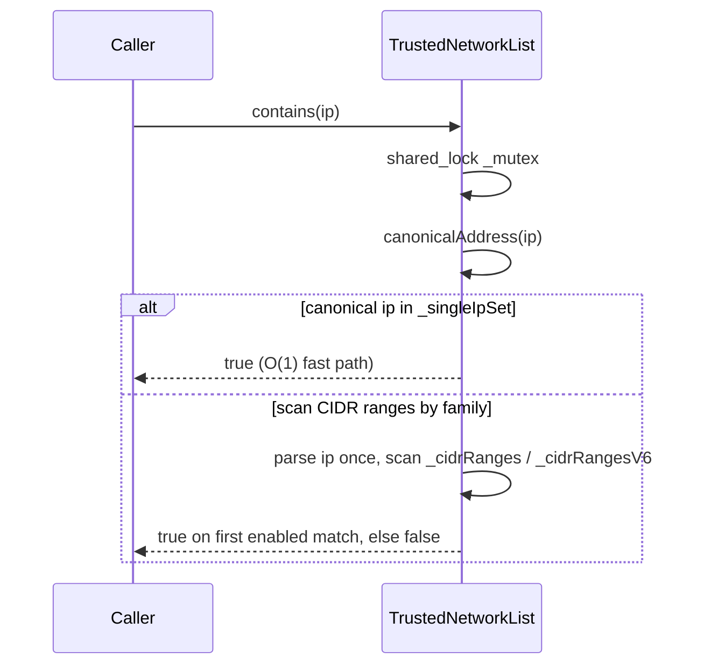

# Iora IP Utilities — Architecture & Programmer's Guide

[Back to index](../../README.md)

| | |
|---|---|
| **Version** | 1.0 |
| **Date** | 2026-09-18 |
| **Status** | IMPLEMENTED |
| **Header** | `include/iora/network/ip_utils.hpp` |
| **Namespace** | `iora::network` |
| **Dependencies** | `<algorithm>`, `<array>`, `<atomic>`, `<cctype>`, `<cstdint>`, `<cstring>`, `<mutex>`, `<optional>`, `<shared_mutex>`, `<sstream>`, `<stdexcept>`, `<string>`, `<unordered_set>`, `<variant>`, `<vector>` (standard library only — no Iora dependencies) |

---

## Revision History

| Version | Date | Changes |
|---|---|---|
| 1.0 | 2026-09-18 | Initial guide, authored against the implementation. Documents the `IPv4`/`IPv6` static parsers, the unified `IpAddress` value type, the `CidrNetwork` / `TrustedNetworkEntry` structures, and the `shared_mutex`-guarded `TrustedNetworkList`. Records the security-relevant parsing choices (leading-zero rejection, colon-boundary rejection, RFC 5952 zero-run compression, strict CIDR-prefix validation, embedded-IPv4 only in the `::ffff:` form). Single-host trust matching and de-duplication are canonical (spelling-independent). |

---

## 1. Executive Summary

### Problem

Iora components that make trust, routing, or filtering decisions on peer addresses need to parse and reason about IP addresses without dragging in a resolver or a heavyweight networking dependency:

- A transport or SIP layer wants to know whether a peer is loopback, RFC 1918 private, or link-local before applying a policy — questions `getaddrinfo` does not answer.
- An access-control layer wants an allow-list of trusted CIDR ranges and single hosts, and wants the common "is this IP trusted?" check to be cheap even when the list mixes IPv4 and IPv6.
- Hand-rolling IPv4/IPv6 string parsing per call site is where the subtle bugs live: octal ambiguity from leading zeros (`010` ≠ 10), incorrect `::` expansion, off-by-one in prefix masks, and non-canonical rendering.

### Solution

`ip_utils.hpp` is a single, dependency-free header providing:

- **`IPv4`** and **`IPv6`** — stateless static utility classes: string ↔ numeric parsing, validation, CIDR containment, and classification (`isPrivate`, `isLoopback`, `isLinkLocal`, `isUniqueLocal`, `isIPv4Mapped`). `IPv4::parse` rejects leading zeros as a deliberate anti-octal security measure; `IPv6::toString` emits RFC 5952 zero-run compression.
- **`IpAddress`** — a unified value type that auto-detects the family from a string and offers `inNetwork`, `toString`, and family accessors. It is the bridge used by `sockaddr_utils.hpp` (`toSockaddr`) to build wire `sockaddr`s without a string round-trip.
- **`CidrNetwork`** / **`TrustedNetworkEntry`** — parsed CIDR values (dual-family) and a labelled trust-list entry.
- **`TrustedNetworkList`** — a thread-safe allow-list optimized for the hot `contains(ip)` path: single hosts land in an `unordered_set` keyed on the canonical address form for O(1) lookup, CIDR ranges are split by family and scanned linearly under a `shared_mutex`.

### Technical Impact

- **O(1) single-host trust checks** via `_singleIpSet` (canonical-keyed, so spelling-independent), with CIDR ranges scanned only when the single-host fast path misses.
- **Zero-allocation classification** — the numeric `IPv4`/`IPv6` predicates operate on `std::uint32_t` / `std::array<std::uint8_t,16>` with no heap use.
- **No external dependency** — header-only, standard library only, so it can sit at the very bottom of the network layer (`sockaddr_utils.hpp` depends on it, not the reverse).

> **Current consumers.** These types are public foundation API. Today `IpAddress` is reached in-tree through `sockaddr_utils::toSockaddr`; the `CidrNetwork` / `TrustedNetworkList` allow-list has no in-tree production consumer yet (it is exercised by unit tests). The design is driven by the anticipated trust/routing consumers described above, not by a shipped caller.

---

## 2. System Architecture

### 2.1 Component relationships

```
iora::network (ip_utils.hpp)
│
├── IPv4  ................ static-only: parse/toString/prefixToNetmask/inNetwork/
│                          isValid/isPrivate/isLoopback  (host-order uint32)
│
├── IPv6  ................ static-only: parse/toString(RFC 5952)/inNetwork/isValid/
│      │                   isLoopback/isLinkLocal/isUniqueLocal/isIPv4Mapped
│      └── Address = std::array<std::uint8_t, 16>   (network byte order)
│
├── AddressFamily {IPv4, IPv6}   (enum class)
│
├── IpAddress  ........... value type; auto-detects family; holds either a uint32
│                          or an Address + the original string; inNetwork/toString/family
│      consumed by → sockaddr_utils::toSockaddr / addressFromSockaddr
│
├── isIPv6Address(str) / isValidIpAddress(str)   (free functions)
│
├── CidrNetwork  ......... struct: address string + prefixLength + parsed value +
│      │                   family + valid flag; parse()/contains()/toString()
│      └── owned by → TrustedNetworkEntry {id, network, description, enabled}
│
└── TrustedNetworkList  .. shared_mutex-guarded allow-list
        ├── _entries        (authoritative vector<TrustedNetworkEntry>)
        ├── _singleIpSet    (unordered_set<string>, canonical /32 & /128 fast path)
        ├── _cidrRanges     (vector, IPv4 CIDR ranges)
        └── _cidrRangesV6   (vector, IPv6 CIDR ranges)
              _singleIpSet + _cidrRanges* are a DERIVED index rebuilt by rebuildIndex()
```

### 2.2 Numeric representations (the one thing to internalize)

| Type | Representation | Byte order |
|---|---|---|
| `IPv4` values (`std::uint32_t`) | packed `(o0<<24)|(o1<<16)|(o2<<8)|o3` | **host order** |
| `IPv6::Address` (`std::array<std::uint8_t,16>`) | the 16 address bytes | **network order** |

This split matters at the `sockaddr` boundary: `sockaddr_utils::toSockaddr` calls `htonl(ip.ipv4())` on the host-order IPv4 value but `memcpy`s the IPv6 array directly because it is already network order. Keep the invariant in mind whenever you read `ipv4()` or `ipv6()` off an `IpAddress`.

### 2.3 Threading model

| Component | Thread model |
|---|---|
| `IPv4`, `IPv6`, free functions | Stateless static functions; safe to call from any thread with no synchronization. |
| `IpAddress`, `CidrNetwork`, `TrustedNetworkEntry` | Plain value types. A single instance is not protected against concurrent mutation; copies are independent. |
| `TrustedNetworkList` | Internally synchronized by a `mutable std::shared_mutex`. Reads (`contains`, `getAll`, `getById`, `size`) take a `shared_lock`; mutations (`add`, `addCidr`, `removeById`, `removeByCidr`, `clear`, `setEnabled`) take a `unique_lock`. Safe for concurrent multi-reader / single-writer use. |

### 2.4 Data flow — `TrustedNetworkList::contains`



---

## 3. Component Deep Dive

### 3.1 `IPv4` — host-order 32-bit parsing

`IPv4::parse` walks exactly four dot-separated octets. Two deliberate rejections harden it against ambiguity:

```cpp
// Reject leading zeros (e.g., "01", "001") - security measure
// Only "0" itself is allowed, not "00" or "01"
std::size_t octetLen = pos - octetStart;
if (octetLen > 1 && ip[octetStart] == '0')
{
  return false;
}
```

- **Leading zeros are rejected.** `010` is *not* accepted as 8 or 10; it is rejected outright. This closes the classic octal-vs-decimal confusion where one component of the stack reads `010` as octal and another as decimal — an allow-list bypass vector.
- **Trailing characters are rejected** (`pos != ip.length()` after the fourth octet), so `1.2.3.4x` and `1.2.3.4.5` fail.
- Each octet is range-checked to `<= 255` *during* accumulation, so overflow cannot wrap.

The result is packed **host order**: `(o0<<24)|(o1<<16)|(o2<<8)|o3`, so `192.168.1.1` → `0xC0A80101`. `toString` reverses this by shifting.

Classification predicates operate on the packed value:

| Predicate | Range |
|---|---|
| `isPrivate` | `10.0.0.0/8`, `172.16.0.0/12`, `192.168.0.0/16` (RFC 1918) |
| `isLoopback` | `127.0.0.0/8` |

`prefixToNetmask(n)` returns the host-order mask; `n == 0` yields `0`, `n >= 32` yields `0xFFFFFFFF`, otherwise `~((1u << (32 - n)) - 1)`. `inNetwork` masks both operands and compares.

### 3.2 `IPv6` — network-order 128-bit parsing and RFC 5952 rendering

`IPv6::Address` is `std::array<std::uint8_t, 16>` in network order. `parse` handles:

- **`::` zero-compression**, including a leading `::`. Exactly one `::` is allowed (a second returns `false`).
- **IPv4-mapped addresses in the `::ffff:a.b.c.d` form only.** The detector matches a leading `::ffff:` (case-insensitive on the `ffff`) and parses the dotted-quad tail via `IPv4::parse`, filling bytes 10–11 with `0xff` and 12–15 with the IPv4 octets. See Known Limitations for the forms that are *not* accepted.
- **Per-group validation** through the private `parseGroup`: 1–4 hex digits, value `<= 0xFFFF`, non-hex or over-long groups rejected.
- **Colon-boundary rejection.** A stray, non-doubled leading or trailing colon is malformed and rejected: `:1:2:3:4:5:6:7:8`, `1:2:3:4:5:6:7:8:`, and `1::2:` all fail (the legitimate `::` compression is handled separately). This mirrors `IPv4::parse`'s trailing-character strictness.

`toString` implements **RFC 5952** canonical rendering:

```cpp
// Find longest run of zeros for compression (must be > 1 to compress)
std::size_t bestStart = 8;  // 8 means "no compression"
std::size_t bestLen = 1;    // Only compress runs > 1
...
if (curLen > bestLen)       // strictly greater => FIRST longest run wins on a tie
```

- Only a zero run **longer than one group** is compressed (a lone zero group is written `0`, per RFC 5952 §4.2.2).
- On a tie between equal-length runs, the **first** run is compressed (`>` not `>=`), matching RFC 5952 §4.2.3.
- Hex is emitted lowercase (`std::hex` default) with no leading zeros, per RFC 5952 §4.1–4.3.

Classification: `isLoopback` (`::1`), `isLinkLocal` (`fe80::/10`), `isUniqueLocal` (`fc00::/7`, RFC 4193), `isIPv4Mapped` (`::ffff:0:0/96`). `inNetwork` compares full bytes then the partial-byte mask; `prefixLength > 128` is clamped to 128.

### 3.3 `IpAddress` — the unified value type

`IpAddress` stores whichever of `_ipv4` / `_ipv6` matches the detected family, plus `_original` (the exact input string) and a `_valid` flag. Construction parses eagerly:

```cpp
explicit IpAddress(const std::string& addr) { parse(addr); }
```

`parse` tries `IPv4::parse` first (cheaper, and `192.168.1.1` is unambiguous), then `IPv6::parse`. Accessors:

- `isValid()`, `family()`, `ipv4()` (host order — only meaningful when `family() == IPv4`), `ipv6()` (the network-order array), `original()`, `toString()` (canonical form, or `""` when invalid), and `inNetwork(other, prefix)` (returns `false` on a family mismatch).

`IpAddress` is the input to `sockaddr_utils::toSockaddr`, which reads `ipv4()`/`ipv6()` directly rather than re-parsing `toString()` — see the [SockaddrUtils guide](sockaddr_utils.md).

### 3.4 `CidrNetwork` — dual-family CIDR value

`CidrNetwork` is a plain struct carrying both the textual `address`, the `prefixLength`, the parsed value (`addressNum` for IPv4, `addressV6` for IPv6), the `family`, and a `valid` flag. It offers two construction paths:

- The `(addr, prefix)` constructor and `parse(cidr)` (which splits on `/`, defaulting the prefix to 32/128 when absent). Both validate the prefix against the family maximum (32 or 128) and set `valid` accordingly. **Always check `isValid()` after construction** — the constructor cannot signal failure otherwise.
- **Strict prefix parsing.** `parse` requires the text after `/` to be a run of decimal digits and nothing else: a sign, whitespace, or trailing garbage (`"10.0.0.0/24garbage"`, `"10.0.0.0/ 24"`, `"10.0.0.0/"`) is rejected rather than silently truncated to a valid prefix.
- `contains(...)` is overloaded for a string IP, a raw `std::uint32_t` (IPv4), and an `IPv6::Address`. Each first checks family agreement, then delegates to `IPv4::inNetwork` / `IPv6::inNetwork`.

The parsed value is **not** masked to the network address — `CidrNetwork("192.168.1.5", 24)` stores `addressNum` for `.5`, and `toString()` returns `192.168.1.5/24`. Containment still works because `inNetwork` masks both sides; only the rendered/stored form retains the host bits.

### 3.5 `TrustedNetworkList` — the synchronized allow-list

The list keeps `_entries` as the authoritative store and maintains a **derived index** for fast lookup, rebuilt wholesale by `rebuildIndex()` on every mutation:

- `isSingleHost()` entries (`/32` or `/128`) → `_singleIpSet` (an `unordered_set<std::string>` keyed by `entry.network.address`).
- CIDR ranges → `_cidrRanges` (IPv4) or `_cidrRangesV6` (IPv6).
- Disabled entries are skipped by `rebuildIndex()`, so `setEnabled(id,false)` removes an entry from the lookup index without deleting it from `_entries`.

`contains(ip)` is the hot path:

```cpp
std::shared_lock lock(_mutex);
if (_singleIpSet.count(canonicalAddress(ip)) > 0) { return true; }  // canonical fast path
bool isV6 = isIPv6Address(ip);
// then linear scan of the matching family's CIDR ranges, parsing `ip` once
```

**The single-host fast path is canonical.** Both the stored key (in `rebuildIndex`) and the query are reduced to canonical form by the private `canonicalAddress` helper (`IpAddress(x).toString()`, i.e. RFC 5952 for IPv6, dotted-decimal for IPv4), so a host added as `::1` still matches a query for `0:0:0:0:0:0:0:1`, and `2001:DB8::1` matches `2001:db8::1`. The `add`/`addCidr`/`removeByCidr` duplicate and match checks use the same canonicalization, so two spellings of one address collide as intended. IDs are generated by an atomic counter (`net_<n>`), so `generateId()` is safe even though it is only ever called under the write lock.

---

## 4. Usage Guide

All examples assume:

```cpp
#include <iora/network/ip_utils.hpp>
using namespace iora::network;
```

### 4.1 Classify a peer address

```cpp
void applyPolicy(const std::string& peer)
{
  IpAddress ip(peer);
  if (!ip.isValid())
  {
    // reject or log a malformed address
    return;
  }

  if (ip.family() == AddressFamily::IPv4)
  {
    std::uint32_t v = ip.ipv4();
    if (IPv4::isLoopback(v) || IPv4::isPrivate(v))
    {
      // trust the local/RFC1918 peer
    }
  }
  else
  {
    if (IPv6::isLoopback(ip.ipv6()) || IPv6::isLinkLocal(ip.ipv6()))
    {
      // trust loopback / link-local
    }
  }
}
```

### 4.2 One-off CIDR containment

```cpp
CidrNetwork net;
if (net.parse("10.0.0.0/8") && net.isValid())
{
  bool inside = net.contains("10.4.5.6");   // true
  bool outside = net.contains("11.0.0.1");  // false
  bool wrongFamily = net.contains("::1");   // false (family mismatch)
}

// Static helper without building a CidrNetwork:
bool ok = IPv4::inNetwork("192.168.1.42", "192.168.1.0", 24);  // true
```

### 4.3 A trusted-network allow-list

```cpp
TrustedNetworkList trusted;
trusted.addCidr("10.0.0.0/8", "corp LAN");
trusted.addCidr("192.168.1.50/32", "jump host");   // single host -> fast path
std::string id = trusted.addCidr("2001:db8::/32", "v6 range");

bool a = trusted.contains("10.9.9.9");        // true  (CIDR scan)
bool b = trusted.contains("192.168.1.50");    // true  (O(1) exact match)
bool c = trusted.contains("2001:db8::dead");  // true  (v6 CIDR scan)

trusted.setEnabled(id, false);                // drop the v6 range from the index
bool d = trusted.contains("2001:db8::dead");  // now false
```

### 4.4 Validate before use

```cpp
if (isValidIpAddress(userInput))                 // family-agnostic
{
  // safe to parse
}
bool looksV6 = isIPv6Address(userInput);         // cheap: just checks for ':'
```

### 4.5 Anti-patterns

- **Do NOT** read `ipv4()` when `family() == IPv6` (or `ipv6()` on an IPv4 value): the accessors return the default-initialized member, not a conversion. Always branch on `family()` first.
- **Do NOT** skip `isValid()` after `CidrNetwork` construction — the constructor swallows parse failures and leaves `valid == false`; a subsequent `contains()` on an invalid network silently returns `false`.
- **Do NOT** rely on `isIPv6Address` as validation — it only tests for a `:` and will call any colon-bearing string "IPv6". Use `isValidIpAddress` when you need a real check.
- **Do NOT** feed a hostname to any of these functions. Nothing here resolves DNS; a hostname is simply "invalid". Use [`DnsClient`](dns_client.md) or the transport `NameResolver` for resolution.

---

## 5. Call Flow / Sequence Reference

### 5.1 `TrustedNetworkList::addCidr` (write path)

| Step | Action | Lock |
|---|---|---|
| 1 | Parse `cidr` into a temporary `TrustedNetworkEntry` (fails → return `""`) | none (parse runs before locking) |
| 2 | Acquire `unique_lock(_mutex)` | write |
| 3 | Linear-scan `_entries` for a duplicate `(address, prefixLength)` → return `""` if found | write |
| 4 | Assign `generateId()` (atomic fetch-add), `push_back` into `_entries` | write |
| 5 | `rebuildIndex()` — clear and repopulate `_singleIpSet` / `_cidrRanges` / `_cidrRangesV6` from enabled entries | write |
| 6 | Return the new ID; lock released on scope exit | — |

### 5.2 `TrustedNetworkList::contains` (read path, success + miss)

| Step | Action | Lock |
|---|---|---|
| 1 | Acquire `shared_lock(_mutex)` | read |
| 2 | `_singleIpSet.count(ip)` > 0 → **return true** (fast path) | read |
| 3 | `isIPv6Address(ip)` selects the family branch | read |
| 4 | Parse `ip` once (`IPv4::parse` / `IPv6::parse`); parse failure → **return false** | read |
| 5 | Linear-scan the family's CIDR vector; first enabled `network.contains(...)` → **return true** | read |
| 6 | No match → **return false**; lock released on scope exit | — |

---

## 6. Thread Safety Model

### 7.1 `TrustedNetworkList` operations

| Operation | Synchronization | Notes |
|---|---|---|
| `contains`, `getAll`, `getById`, `size` | `std::shared_lock(_mutex)` | Concurrent readers permitted. `getAll` returns a copy of `_entries`. |
| `add`, `addCidr`, `removeById`, `removeByCidr`, `clear`, `setEnabled` | `std::unique_lock(_mutex)` | Exclusive; each mutation calls `rebuildIndex()` while holding the write lock (`clear` resets all four containers directly). |
| `generateId` (private) | — | Called only under the write lock; the atomic counter would be safe regardless. |

The parse step in `addCidr` / `removeByCidr` runs **before** the lock is taken, so a malformed CIDR never contends the write lock. `_mutex` is `mutable`, so the `const` read methods can lock it.

### 7.2 Stateless types

`IPv4`, `IPv6`, and the free functions hold no state and are safe to call concurrently. `IpAddress`, `CidrNetwork`, and `TrustedNetworkEntry` provide no internal synchronization; treat a single instance as you would any value type (safe to share for read, not for concurrent mutation).

---

## 7. Configuration Reference

`ip_utils.hpp` has no runtime configuration object. The tunable constants are defaults baked into the types:

| Location | Constant | Default | Meaning |
|---|---|---|---|
| `CidrNetwork::prefixLength` | field initializer | `32` | Prefix used when none is parsed; overridden to `128` for a detected IPv6 address with no `/`. |
| `TrustedNetworkEntry::enabled` | field initializer | `true` | New entries participate in the index unless disabled. |
| `TrustedNetworkList::_idCounter` | atomic initializer | `0` | Generated IDs are `net_<counter+1>`, starting at `net_1`. |
| `IPv4::prefixToNetmask` | — | clamps `>=32` to `0xFFFFFFFF`, `0` to `0` | Prefix bounds. |
| `IPv6::inNetwork` | — | clamps `prefixLength > 128` to `128` | Prefix bounds. |

---

## 8. API Reference

```cpp
namespace iora { namespace network {

class IPv4
{
public:
  static bool parse(const std::string& ip, std::uint32_t& result);
  static std::string toString(std::uint32_t ip);
  static std::uint32_t prefixToNetmask(std::uint32_t prefixLength);
  static bool inNetwork(std::uint32_t ip, std::uint32_t network, std::uint32_t prefixLength);
  static bool inNetwork(const std::string& ipStr, const std::string& networkStr,
                        std::uint32_t prefixLength);
  static bool isValid(const std::string& ip);
  static bool isPrivate(std::uint32_t ip);
  static bool isLoopback(std::uint32_t ip);
  static bool isPrivate(const std::string& ipStr);
};

class IPv6
{
public:
  using Address = std::array<std::uint8_t, 16>;
  static bool parse(const std::string& ip, Address& result);
  static std::string toString(const Address& addr);
  static bool inNetwork(const Address& ip, const Address& network, std::uint32_t prefixLength);
  static bool inNetwork(const std::string& ipStr, const std::string& networkStr,
                        std::uint32_t prefixLength);
  static bool isValid(const std::string& ip);
  static bool isLoopback(const Address& addr);
  static bool isLinkLocal(const Address& addr);
  static bool isUniqueLocal(const Address& addr);
  static bool isIPv4Mapped(const Address& addr);
};

enum class AddressFamily { IPv4, IPv6 };

class IpAddress
{
public:
  IpAddress() = default;
  explicit IpAddress(const std::string& addr);
  bool parse(const std::string& addr);
  bool isValid() const;
  AddressFamily family() const;
  std::uint32_t ipv4() const;
  const IPv6::Address& ipv6() const;
  const std::string& original() const;
  std::string toString() const;
  bool inNetwork(const IpAddress& network, std::uint32_t prefixLength) const;
};

inline bool isIPv6Address(const std::string& ip);
inline bool isValidIpAddress(const std::string& ip);

struct CidrNetwork
{
  std::string address;
  std::uint32_t prefixLength{32};
  std::uint32_t addressNum{0};
  IPv6::Address addressV6{};
  AddressFamily family{AddressFamily::IPv4};
  bool valid{false};

  CidrNetwork() = default;
  CidrNetwork(const std::string& addr, std::uint32_t prefix);
  bool isValid() const;
  bool parse(const std::string& cidr);
  std::string toString() const;
  bool contains(const std::string& ip) const;
  bool contains(std::uint32_t ip) const;
  bool contains(const IPv6::Address& ip) const;
  bool isSingleHost() const;
  bool isIPv6() const;
};

struct TrustedNetworkEntry
{
  std::string id;
  CidrNetwork network;
  std::string description;
  bool enabled{true};
  bool parse(const std::string& cidr);
  std::string toString() const;
};

class TrustedNetworkList
{
public:
  TrustedNetworkList() = default;
  bool add(const TrustedNetworkEntry& entry);
  std::string addCidr(const std::string& cidr, const std::string& description = "");
  bool removeById(const std::string& id);
  bool removeByCidr(const std::string& cidr);
  bool contains(const std::string& ip) const;
  std::vector<TrustedNetworkEntry> getAll() const;
  std::optional<TrustedNetworkEntry> getById(const std::string& id) const;
  std::size_t size() const;
  void clear();
  bool setEnabled(const std::string& id, bool enabled);
};

}} // namespace iora::network
```

---

## 9. Design Decisions

| Decision | Rationale |
|---|---|
| Reject leading zeros in `IPv4::parse` | Prevents octal-vs-decimal ambiguity (`010`) that can bypass string-based allow-lists when two components disagree on the radix. |
| IPv4 stored host-order, IPv6 stored network-order | IPv4 arithmetic (masking, classification) is natural in host order; the 16-byte IPv6 array is already the wire form, avoiding a conversion. The `sockaddr` boundary reconciles them (`htonl` for v4, `memcpy` for v6). |
| RFC 5952 canonical `toString` (first-longest-run compression, lowercase, no leading zeros) | A single canonical rendering makes string comparison and logging deterministic across the stack. |
| `TrustedNetworkList` splits single hosts into a hash set | The dominant query is "is this exact host trusted?"; an `unordered_set` answers it in O(1) and leaves the linear CIDR scan for the rarer range case. |
| Derived index rebuilt wholesale on mutation (`rebuildIndex`) | Mutations are rare relative to lookups; a full rebuild is simpler and less error-prone than incremental index maintenance, and keeps `_entries` the single source of truth. |
| `shared_mutex` rather than a plain mutex | The list is read-mostly (per-packet / per-request trust checks); shared locking lets readers run concurrently. |
| Header-only, zero Iora dependencies | Lets the header sit at the bottom of the network layer so `sockaddr_utils.hpp` and the engines can depend on it without a layering inversion. |
| `CidrNetwork` keeps the un-masked host bits | Preserves the caller's original text for round-tripping / display; containment masks at compare time so correctness is unaffected. |

---

## 10. Known Limitations

### 10.1 Embedded IPv4 accepted only in the `::ffff:a.b.c.d` form

`IPv6::parse` recognizes an embedded IPv4 dotted-quad only when the string begins with a compressed `::ffff:` prefix. The fully-expanded `0:0:0:0:0:ffff:1.2.3.4` and the deprecated IPv4-compatible `::1.2.3.4` (and `::a.b.c.d` generally) forms are **not** parsed and are reported invalid.

### 10.2 `toString` renders IPv4-mapped addresses as hex groups

`IPv6::toString` does not special-case `::ffff:0:0/96`; an IPv4-mapped address round-trips to `::ffff:c0a8:101` rather than the RFC 5952 §5 recommended dotted form `::ffff:192.168.1.1`. This is a rendering-only deviation (the address is correct); RFC 5952 §5 states the dotted form as a recommendation, not a requirement.

### 10.3 No hostname or scope-ID support

Nothing here resolves DNS; hostnames are simply invalid input. IPv6 zone/scope IDs (`fe80::1%eth0`) are not parsed — the `%` makes the string invalid.

### 10.4 `CidrNetwork` construction cannot throw on failure

The `(addr, prefix)` constructor and `parse()` report failure only via the `valid` flag / return value; a caller that skips `isValid()` will operate on a network whose `contains()` always returns `false`.

---

[Back to index](../../README.md)
