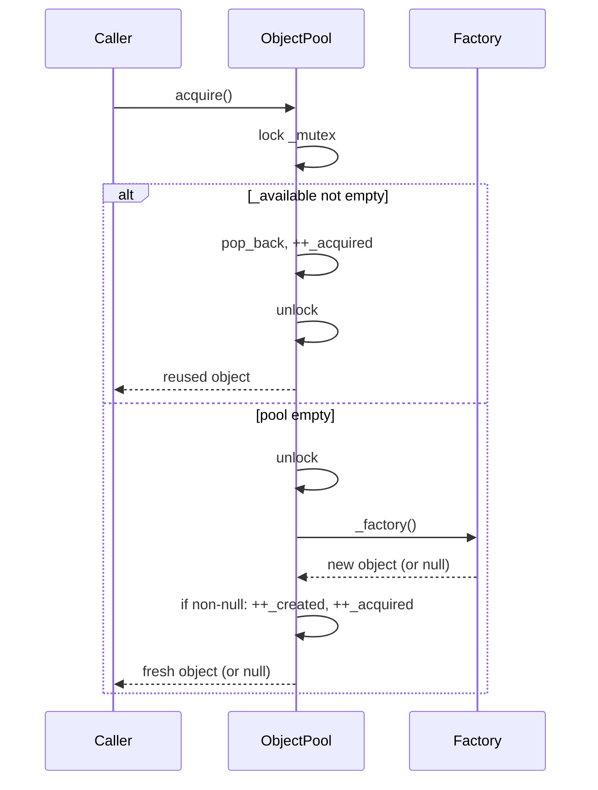

# Iora ObjectPool — Architecture & Programmer's Guide

[Back to index](../../README.md)

| | |
|---|---|
| **Version** | 1.0 |
| **Date** | 2026-09-18 |
| **Status** | IMPLEMENTED |
| **Header** | `include/iora/network/object_pool.hpp` |
| **Namespace** | `iora::network` |
| **Dependencies** | `<atomic>`, `<functional>`, `<memory>`, `<mutex>`, `<vector>` (standard library only) |

---

## Revision History

| Version | Date | Changes |
|---|---|---|
| 1.0 | 2026-09-18 | Initial guide, authored against the implementation. Documents the generic `ObjectPool<T>`, its `PooledObject<T>` RAII handle, and the `makePooled` helper: the mutex-guarded LIFO free list, the capped growth (`_maxPoolSize`), the relaxed-atomic statistics, and the synchronization model in which both the `Resetter` and the `Factory` run outside the pool lock. |

---

## 1. Executive Summary

### Problem

Objects that are created and destroyed at high frequency on a hot path — reusable buffers, scratch parse contexts, per-request work items — turn `new`/`delete` churn into an allocator bottleneck and a source of memory fragmentation. Each call site that wants reuse ends up hand-rolling a free list plus its own thread-safety and its own "cap the growth" logic.

### Solution

`ObjectPool<T>` is a small generic free-list pool:

- **`ObjectPool<T>`** — holds a `std::vector<std::unique_ptr<T>>` of idle objects, guarded by a `std::mutex`. `acquire()` reuses an idle object or manufactures one via the caller's `Factory`; `release()` optionally runs a `Resetter` and returns the object to the list, discarding it once the list reaches `_maxPoolSize`.
- **`PooledObject<T>`** — a move-only RAII handle that returns its object to the pool on destruction, so callers cannot forget to release.
- **`makePooled(pool)`** — a one-liner that acquires and wraps in one step.

### Technical Impact

- **Bounded reuse** — the free list never grows past `_maxPoolSize` (default 100), so a burst of releases cannot balloon memory.
- **Lock held only for the list splice** — the potentially expensive `Resetter` **and** the `Factory` both run *outside* the pool lock, so neither serializes other pool users nor risks a self-deadlock.
- **Lifetime-safe by construction** — `PooledObject` guarantees return-to-pool; `release()` on the handle opts out explicitly when an object must escape the pool.

---

## 2. System Architecture

### 2.1 Where it sits

`object_pool.hpp` is a leaf header in `iora::network`: standard library only, no other Iora dependency. It is a generic template usable by any component; it does not itself wire into the transport engines. (The header currently lives under `network/`; a relocation to `iora::core` is tracked as a follow-up — see §10.5.)

### 2.2 Component relationships

```
ObjectPool<T>
├── Factory   = std::function<std::unique_ptr<T>()>   (required; makes new objects)
├── Resetter  = std::function<void(T*)>                (optional; scrubs before reuse)
├── _mutex                                             (guards _available + _maxPoolSize)
├── _available : vector<unique_ptr<T>>                (the free list / LIFO stack)
├── _maxPoolSize = 100                                (growth cap)
└── _created/_acquired/_released/_destroyed : atomic  (relaxed counters -> Stats)

PooledObject<T>            makePooled(pool) -> PooledObject<T>
├── _obj  : unique_ptr<T>       returns acquire()-then-wrap in one call
└── _pool : ObjectPool<T>*
    ~PooledObject() -> _pool->release(std::move(_obj))   (unless moved-from / released)
```

### 2.3 Data flow — `acquire()`



### 2.4 Threading model

| Thread role | Responsibility |
|---|---|
| Any caller thread | `acquire()` / `release()` / `getStats()` / `setMaxPoolSize()` / `clear()` — the list splice and counters are internally synchronized by `_mutex`. |
| Caller-supplied `Factory` | Invoked by `acquire()` **outside** `_mutex` on a pool miss (and by the constructor during pre-population, single-threaded). |
| Caller-supplied `Resetter` | Invoked by `release()` **before** `_mutex` is taken. |

---

## 3. Component Deep Dive

### 3.1 `ObjectPool<T>` construction and pre-population

```cpp
explicit ObjectPool(Factory factory, Resetter resetter = nullptr, std::size_t initialSize = 0);
```

The constructor eagerly manufactures `initialSize` objects via `_factory()` and pushes each onto `_available`, incrementing `_created`. A factory that returns `nullptr` is skipped (no null is stored). Only the `Factory` is required; the `Resetter` may be null.

### 3.2 `acquire()`

```cpp
std::unique_ptr<T> acquire()
{
  {
    std::lock_guard<std::mutex> lock(_mutex);
    if (!_available.empty())
    {
      auto obj = std::move(_available.back());
      _available.pop_back();          // LIFO: reuse the most-recently released
      _acquired.fetch_add(1, std::memory_order_relaxed);
      return obj;
    }
  }
  // Pool empty: manufacture OUTSIDE the lock.
  auto obj = _factory ? _factory() : nullptr;
  if (obj)
  {
    _created.fetch_add(1, std::memory_order_relaxed);
    _acquired.fetch_add(1, std::memory_order_relaxed);
  }
  return obj;
}
```

The free list is **LIFO** — the most recently released object is reused first (cache-friendly). On an empty pool the caller's `Factory` runs to make a fresh object **after the lock is released**, so a slow or re-entrant factory neither serializes other pool users nor self-deadlocks. `_acquired` counts every successful acquisition (reuse *and* fresh); a factory that returns `nullptr` is passed straight through and counts toward nothing.

### 3.3 `release()`

```cpp
void release(std::unique_ptr<T> obj)
{
  if (!obj)
  {
    return;                           // null is a no-op
  }
  if (_resetter)
  {
    _resetter(obj.get());             // BEFORE the lock
  }

  std::lock_guard<std::mutex> lock(_mutex);
  if (_available.size() < _maxPoolSize)
  {
    _available.push_back(std::move(obj));
    _released.fetch_add(1, std::memory_order_relaxed);
  }
  else
  {
    _destroyed.fetch_add(1, std::memory_order_relaxed);  // over cap -> freed on scope exit
  }
}
```

The `Resetter` runs **outside** the lock, so a heavy scrub does not serialize other pool users. When the free list is already at `_maxPoolSize`, the object is not stored; it is destroyed when `obj` leaves scope, and `_destroyed` is bumped.

### 3.4 `setMaxPoolSize()`, `clear()`, `getStats()`

- `setMaxPoolSize(n)` updates the cap under the lock and **trims** the free list down to the new cap immediately, bumping `_destroyed` for each dropped object.
- `clear()` drops all idle objects and bumps `_destroyed` by the number dropped, so destruction accounting stays consistent with the over-cap and trim paths.
- Both `clear()` and `setMaxPoolSize()` route through a shared `collectSurplusLocked` helper that moves the surplus objects into a local under the lock and lets them destruct **after** the lock is released. So, as with the over-cap `release()` path, a pooled type's destructor never runs while `_mutex` is held — a `~T()` that re-enters the pool cannot deadlock.
- `getStats()` snapshots under the lock: `available` is the current list size; the four totals are the relaxed-atomic counters. `Stats` fields are `available`, `totalCreated`, `totalAcquired`, `totalReleased`, `totalDestroyed`.

### 3.5 `PooledObject<T>` — RAII handle

`PooledObject<T>` owns the object and a non-owning back-pointer to the pool. It is **move-only** (copy is deleted). Its destructor returns the object to the pool when both `_obj` and `_pool` are non-null; a moved-from handle nulls `_pool` so it becomes a no-op. `release()` detaches the object from the pool (nulls `_pool` and hands back the `unique_ptr`) for the case where an object must outlive the pool relationship. Accessors: `get()`, `operator*`, `operator->`, and `explicit operator bool`.

Because `_pool` is a raw pointer with no lifetime guarantee, **the pool must outlive every `PooledObject` drawn from it** — see §10.5.

`makePooled(pool)` is `PooledObject<T>(pool.acquire(), &pool)` — acquire and wrap in one call.

---

## 4. Usage Guide

```cpp
#include <iora/network/object_pool.hpp>
using namespace iora::network;
```

### 4.1 A pooled scratch buffer with reset

```cpp
ObjectPool<std::vector<char>> bufPool(
  [] { return std::make_unique<std::vector<char>>(4096); },  // Factory
  [](std::vector<char>* v) { v->clear(); },                  // Resetter (scrub on return)
  8);                                                         // pre-populate 8

{
  auto buf = makePooled(bufPool);   // PooledObject<std::vector<char>>
  buf->assign(payload.begin(), payload.end());
  // ... use *buf ...
}   // buf destructs -> reset() ran on return, object is back in the pool
```

### 4.2 Manual acquire / release

```cpp
std::unique_ptr<std::vector<char>> b = bufPool.acquire();
// ... use *b ...
bufPool.release(std::move(b));      // explicit return
```

### 4.3 Sizing and stats

```cpp
bufPool.setMaxPoolSize(32);         // raise the cap (or lower it -> trims immediately)
auto s = bufPool.getStats();
// s.available, s.totalCreated, s.totalAcquired, s.totalReleased, s.totalDestroyed
```

### 4.4 Letting an object escape the pool

```cpp
PooledObject<Widget> w = makePooled(widgetPool);
std::unique_ptr<Widget> owned = w.release();   // detach: NOT returned to the pool
```

### 4.5 Anti-patterns

- **Do NOT** let a `PooledObject` outlive the pool it came from — the handle's destructor calls back into the pool through a raw pointer (use-after-free). See §10.5.
- **Do NOT** put the scrub logic in the `Factory`; put it in the `Resetter`, which runs on every return. Reserve the `Factory` for fresh construction only.
- **Do NOT** use the returned `unique_ptr` after `release()`, and do NOT touch a `PooledObject` after moving from it — the object is back in (or detached from) the pool.
- **Do NOT** read `totalAcquired` as "reuse hits" — it counts every successful acquisition, both reused and freshly manufactured. A null-returning factory increments nothing.

---

## 5. Call Flow / Sequence Reference

### 5.1 `acquire()` — reuse vs manufacture

| Step | Action | Lock |
|---|---|---|
| 1 | Acquire `lock_guard(_mutex)` (inner scope) | held |
| 2 | If `_available` non-empty: move `back()`, `pop_back()`, bump `_acquired`, return | held |
| 3 | Else: release the lock | — |
| 4 | Call `_factory()` (if set) outside the lock | none |
| 5 | If non-null: bump `_created` and `_acquired`; return the object (or null) | none |

### 5.2 `release()` — return vs discard

| Step | Action | Lock |
|---|---|---|
| 1 | Null check: `obj == nullptr` → return | none |
| 2 | If `_resetter`: run `_resetter(obj.get())` | none (before lock) |
| 3 | Acquire `lock_guard(_mutex)` | held |
| 4 | If `_available.size() < _maxPoolSize`: `push_back`, bump `_released` | held |
| 5 | Else: bump `_destroyed`; `obj` freed on scope exit | held |

---

## 6. Thread Safety Model

| Operation | Synchronization | Notes |
|---|---|---|
| `acquire` | `std::lock_guard(_mutex)` for the reuse splice only | The `Factory` is invoked **after** the lock is released on a pool miss. |
| `release` | `std::lock_guard(_mutex)` for the splice only | The `Resetter` runs **before** the lock is taken. |
| `getStats`, `setMaxPoolSize`, `clear` | `std::lock_guard(_mutex)` | `setMaxPoolSize` / `clear` count under the lock but destroy the dropped objects **after** releasing it (collect-then-destroy), so `~T()` never runs while `_mutex` is held. |
| Statistics counters | `std::atomic` (relaxed) | Individually atomic; a `getStats` snapshot is taken under the lock but the totals are independent relaxed loads, so they are eventually-consistent rather than a single transactional reading. |
| `PooledObject` move/destroy | none (delegates to `release`) | The handle is single-owner; concurrency lives in the pool it points at, which must outlive it. |

Neither user callback (`Factory`, `Resetter`) is ever invoked while `_mutex` is held, so a callback may safely re-enter the pool.

---

## 7. Configuration Reference

| Parameter | Where | Default | Meaning |
|---|---|---|---|
| `_maxPoolSize` | field initializer | `100` | Max idle objects retained; releases beyond it destroy the object. Adjustable via `setMaxPoolSize` (trims immediately). |
| `initialSize` | `ObjectPool` ctor arg | `0` | Objects pre-manufactured at construction. |
| `resetter` | `ObjectPool` ctor arg | `nullptr` | Optional per-release scrub; skipped when null. |

---

## 8. API Reference

```cpp
namespace iora { namespace network {

template <typename T>
class ObjectPool
{
public:
  using Factory  = std::function<std::unique_ptr<T>()>;
  using Resetter = std::function<void(T*)>;

  explicit ObjectPool(Factory factory, Resetter resetter = nullptr,
                      std::size_t initialSize = 0);

  std::unique_ptr<T> acquire();
  void release(std::unique_ptr<T> obj);

  struct Stats
  {
    std::size_t available;
    std::size_t totalCreated;
    std::size_t totalAcquired;
    std::size_t totalReleased;
    std::size_t totalDestroyed;
  };
  Stats getStats() const;

  void setMaxPoolSize(std::size_t size);
  void clear();
};

template <typename T>
class PooledObject
{
public:
  PooledObject(std::unique_ptr<T> obj, ObjectPool<T>* pool);
  ~PooledObject();

  PooledObject(const PooledObject&) = delete;
  PooledObject& operator=(const PooledObject&) = delete;
  PooledObject(PooledObject&& other) noexcept;
  PooledObject& operator=(PooledObject&& other) noexcept;

  T* get() const;
  T& operator*() const;
  T* operator->() const;
  explicit operator bool() const;

  std::unique_ptr<T> release();   // detach without returning to the pool
};

template <typename T>
PooledObject<T> makePooled(ObjectPool<T>& pool);

}} // namespace iora::network
```

---

## 9. Design Decisions

| Decision | Rationale |
|---|---|
| Generic `template <typename T>` with `std::function` Factory/Resetter | One pool type serves any poolable object; the caller supplies construction and reset without subclassing. |
| LIFO free list (`push_back`/`pop_back` on a vector) | Reuses the hottest (most-recently-touched) object first, improving cache locality; a vector is contiguous and cheap. |
| Both `Factory` and `Resetter` run outside the lock | The pool lock guards only the list splice and counters; keeping user callbacks off it prevents callback-induced serialization and lets a callback safely re-enter the pool. |
| Hard `_maxPoolSize` cap with discard-on-overflow | Prevents a release burst from growing memory without bound; over-cap objects are simply freed. |
| `PooledObject` RAII handle, move-only, non-owning pool pointer | Guarantees return-to-pool and forbids accidental double-ownership; `release()` is the explicit escape hatch. The non-owning pointer imposes the pool-outlives-handle contract (§10.5). |
| Relaxed atomics for statistics | Counters are advisory/observability only; relaxed ordering avoids fences on the hot path. |

---

## 10. Known Limitations

### 10.1 Statistics are not a transactional snapshot

`getStats()` reads `_available` under the lock but the four totals are independent relaxed atomics. Across a concurrent `acquire`/`release`, the returned `Stats` can reflect a momentarily inconsistent combination. The counters are intended for coarse observability, not exact accounting.

### 10.2 No shrink-to-fit or idle eviction

The pool retains up to `_maxPoolSize` idle objects indefinitely; there is no time-based idle eviction. Lower the cap (which trims immediately) or `clear()` to release memory.

### 10.3 No hard cap on outstanding (in-use) objects

`_maxPoolSize` caps only the *idle* free list. If callers acquire faster than they release, the pool will keep manufacturing fresh objects; the cap does not bound the number of objects checked out at once.

### 10.4 A re-entrant factory can still recurse without bound

Calling `acquire()` from inside the `Factory` no longer deadlocks (the factory runs off the lock), but a factory that unconditionally re-acquires will recurse until the stack is exhausted. The pool removes the lock hazard, not the caller's own logic errors.

### 10.5 The pool must outlive every `PooledObject` (and every checked-out object)

`PooledObject<T>` holds a raw `ObjectPool<T>*` with no ownership. If the pool is destroyed while a handle is still outstanding, the handle's destructor calls `release()` on a dangling pointer — a use-after-free. Ensure the pool outlives all handles and any manually-acquired `unique_ptr` you intend to `release()` back to it (a manually-acquired object simply outlives the pool as a plain `unique_ptr` if never returned, which is safe; the hazard is specifically the `PooledObject` auto-return path).

---

[Back to index](../../README.md)
