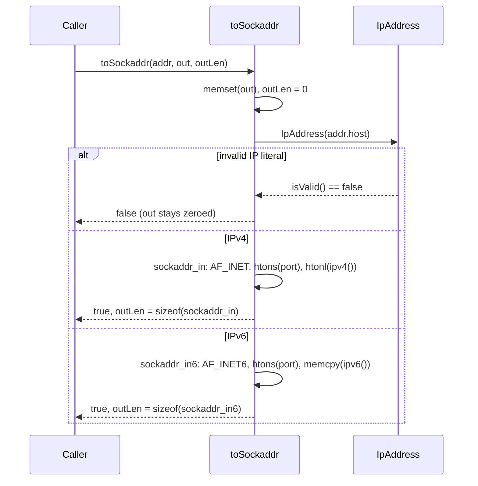

# Iora SockaddrUtils — Architecture & Programmer's Guide

[Back to index](../../README.md)

| | |
|---|---|
| **Version** | 1.0 |
| **Date** | 2026-09-18 |
| **Status** | IMPLEMENTED |
| **Header** | `include/iora/network/sockaddr_utils.hpp` |
| **Namespace** | `iora::network` |
| **Dependencies** | `iora/network/ip_utils.hpp`, `iora/network/transport_types.hpp`; `<cstdint>`, `<cstring>`, `<arpa/inet.h>`, `<netdb.h>`, `<netinet/in.h>`, `<sys/socket.h>` (POSIX) |

---

## Revision History

| Version | Date | Changes |
|---|---|---|
| 1.0 | 2026-09-18 | Initial guide, authored against the implementation. Documents the three free functions `addressFromSockaddr`, `toSockaddr`, and `applyDscpToFd`, the de-duplication history that motivated the header, the dual-stack DSCP mirroring for IPv4-mapped IPv6 sockets, and the explicit `AF_INET` gate on the DSCP path. |

---

## 1. Executive Summary

### Problem

Converting between a POSIX `sockaddr_storage` and Iora's `TransportAddress` (a `{host, port}` value) is needed at every socket boundary — accept, recvfrom, connect, getsockname. The conversion was originally a **private static** duplicated byte-for-byte in both `detail/tcp_engine.hpp` and `detail/udp_engine.hpp`; because both copies were private, a third consumer (iora_media's RTP transport binding) could reach neither and copied it a third time. Applying a DSCP mark to a socket fd had the same twin-copy problem.

### Solution

`sockaddr_utils.hpp` lifts the shared conversions into three inline free functions in `iora::network`:

- **`addressFromSockaddr(ss)`** — the single implementation of the `sockaddr` → `TransportAddress` direction (both engines now forward to it, retiring all three copies).
- **`toSockaddr(addr, out, outLen)`** — `TransportAddress` → `sockaddr_storage`, using the already-parsed `IpAddress` value rather than a string round-trip.
- **`applyDscpToFd(fd, dscp)`** — set the DSCP mark on a socket, with dual-stack mirroring so an IPv4-mapped IPv6 socket still marks its egress.

### Technical Impact

- **One implementation each** for the render direction and the DSCP mark, eliminating the duplicate-copy drift class.
- **No string round-trip** in `toSockaddr` — it reads the parsed `IpAddress` (`ipv4()`/`ipv6()`) directly, avoiding an extra parse plus heap allocation on the per-datagram media TX path.
- **Correct layering** — the header sits above both `ip_utils.hpp` and `transport_types.hpp` and depends on each, so `ip_utils.hpp` need not depend on transport types (which would be a layering inversion).

---

## 2. System Architecture

### 2.1 Where it sits

`sockaddr_utils.hpp` sits **above** two independent leaf headers and depends on each; neither of them depends on the other:

```
        sockaddr_utils.hpp   (depends on BOTH headers below)
        │        ├── addressFromSockaddr  <- forwarded to by TcpEngine & UdpEngine
        │        ├── toSockaddr           <- consumers today are outside this library
        │        └── applyDscpToFd        <- per-session setDscp() + at-creation config.dscpValue
        │
        ├── depends on ── ip_utils.hpp         (IpAddress, IPv4/IPv6)
        └── depends on ── transport_types.hpp  (TransportAddress {host, port})
```

`sockaddr_utils.hpp` deliberately lives in its own header rather than inside `ip_utils.hpp` so that the low-level IP-parsing utilities do not have to include `transport_types.hpp` — `ip_utils.hpp` and `transport_types.hpp` remain siblings with no edge between them.

### 2.2 Data flow — `toSockaddr`



### 2.3 Threading model

All three functions are **stateless** and operate only on their arguments and the kernel socket referenced by `fd`. They are safe to call from any thread; there is no shared state and no internal synchronization. Concurrency correctness is entirely a property of how the caller manages the `fd` and the output buffers.

---

## 3. Component Deep Dive

### 3.1 `addressFromSockaddr` — the render direction

```cpp
inline TransportAddress addressFromSockaddr(const sockaddr_storage& ss);
```

Renders `AF_INET` / `AF_INET6` to a `TransportAddress` via `inet_ntop` into an `NI_MAXHOST` buffer, with the port taken through `ntohs`. Behavior at the edges:

- A family other than `AF_INET`/`AF_INET6` yields a **default-constructed** `TransportAddress` (empty host, port 0).
- If `inet_ntop` fails, `host` is left empty but the **port is still set** from the `sockaddr` (the port assignment is unconditional within each family branch).

This is the one implementation of the direction; `TcpEngine` and `UdpEngine` forward to it.

### 3.2 `toSockaddr` — the build direction (no string round-trip)

```cpp
inline bool toSockaddr(const TransportAddress& addr, sockaddr_storage& out, socklen_t& outLen);
```

Zeroes `out`, sets `outLen = 0`, then parses `addr.host` into an `IpAddress`. On an invalid literal it returns `false` (it does **not** resolve hostnames). Otherwise:

- **IPv4:** fills a `sockaddr_in` with `AF_INET`, `htons(port)`, and `htonl(ip.ipv4())`. `IpAddress::ipv4()` is the host-order 32-bit value, so `htonl` yields network order; `outLen = sizeof(sockaddr_in)`.
- **IPv6:** fills a `sockaddr_in6` with `AF_INET6`, `htons(port)`, and a `memcpy` of the 16-byte `ipv6()` array (already network order); `outLen = sizeof(sockaddr_in6)`.

The design note in the header is deliberate: reading the parsed value avoids a `parse → toString() → re-parse` round-trip that would cost an extra parse plus a heap allocation on every call — significant because this runs per-datagram on a media TX path — and removes failure legs that could not fire.

### 3.3 `applyDscpToFd` — DSCP marking with dual-stack mirroring

```cpp
inline bool applyDscpToFd(int fd, std::uint8_t dscp);
```

Determines the socket family via `getsockname` (which works on a freshly created, not-yet-connected socket, since the family is fixed at `socket()` time), then sets the DSCP value into the high 6 bits of the TOS / traffic-class byte (`val = dscp << 2`):

- **`AF_INET6`:** `setsockopt(IPPROTO_IPV6, IPV6_TCLASS)` is the family-primary option and decides success. It then **best-effort mirrors** the mark onto `IPPROTO_IP, IP_TOS`, because on a dual-stack `AF_INET6` socket carrying an IPv4-mapped peer (`::ffff:a.b.c.d`) many kernels govern the egress IPv4 TOS byte via `IP_TOS` rather than `IPV6_TCLASS`. That secondary `setsockopt` is allowed to fail silently (some kernels reject `IP_TOS` on `AF_INET6`); only the primary option decides the return value.
- **`AF_INET`:** `setsockopt(IPPROTO_IP, IP_TOS)`; success is that call's result.
- **Any other family** (e.g. `AF_UNIX`): returns `false` explicitly — the family has no DSCP/TOS notion, so the code rejects it rather than relying on the kernel to fail an `IP_TOS` setsockopt.

Returns `false` if `fd < 0`, `getsockname` fails, the family-primary `setsockopt` fails, or the family is neither `AF_INET` nor `AF_INET6`.

---

## 4. Usage Guide

```cpp
#include <iora/network/sockaddr_utils.hpp>
using namespace iora::network;
```

### 4.1 Render a peer after recvfrom / accept

```cpp
sockaddr_storage ss{};
socklen_t sl = sizeof(ss);
::recvfrom(fd, buf, len, 0, reinterpret_cast<sockaddr*>(&ss), &sl);

TransportAddress peer = addressFromSockaddr(ss);
if (!peer.host.empty())
{
  // peer.host / peer.port are ready to log or route
}
```

### 4.2 Build a sockaddr for sendto

```cpp
TransportAddress dst{"192.0.2.10", 5060};
sockaddr_storage ss{};
socklen_t sl = 0;
if (toSockaddr(dst, ss, sl))
{
  ::sendto(fd, data, n, 0, reinterpret_cast<const sockaddr*>(&ss), sl);
}
else
{
  // dst.host was not a valid IP literal (toSockaddr does NOT resolve hostnames)
}
```

### 4.3 Apply a DSCP mark

```cpp
// EF (Expedited Forwarding) = DSCP 46 for signaling/media
if (!applyDscpToFd(fd, 46))
{
  // fd<0, getsockname, primary setsockopt, or an unsupported family
}
```

### 4.4 Anti-patterns

- **Do NOT** pass a hostname to `toSockaddr` — it returns `false` for anything that is not a valid IP literal. Resolve first ([`DnsClient`](dns_client.md) or the transport `NameResolver`).
- **Do NOT** treat a non-empty return from `addressFromSockaddr` as guaranteed: for an unsupported family you get an empty-host/zero-port value, and on an `inet_ntop` failure you get an empty host but a populated port. Check `host` before use.
- **Do NOT** assume `outLen` is `sizeof(sockaddr_storage)` — pass the `outLen` that `toSockaddr` set (either `sizeof(sockaddr_in)` or `sizeof(sockaddr_in6)`) to the socket call.
- **Do NOT** interpret an `applyDscpToFd` success as proof the IPv4-mapped egress was marked — the `IP_TOS` mirror is best-effort and its failure is ignored.
- **Do NOT** pass a bare link-local literal (`fe80::1`) to `toSockaddr` and expect a routable `sockaddr` — no scope ID is set (see §10.5).

---

## 5. Call Flow / Sequence Reference

### 5.1 `toSockaddr`

| Step | Action | Result on failure |
|---|---|---|
| 1 | `memset(out, 0)`, `outLen = 0` | — |
| 2 | Construct `IpAddress(addr.host)`; `isValid()`? | invalid → return `false` |
| 3 | IPv4 branch: `AF_INET`, `htons(port)`, `htonl(ipv4())`, `outLen = sizeof(sockaddr_in)` | — |
| 4 | IPv6 branch: `AF_INET6`, `htons(port)`, `memcpy(ipv6())`, `outLen = sizeof(sockaddr_in6)` | — |
| 5 | return `true` | — |

### 5.2 `applyDscpToFd`

| Step | Action | Result on failure |
|---|---|---|
| 1 | `fd < 0`? | → return `false` |
| 2 | `getsockname(fd)` for family | fail → return `false` |
| 3 | `val = dscp << 2` | — |
| 4 | `AF_INET6`: `IPV6_TCLASS` (primary) | fail → return `false` |
| 5 | `AF_INET6`: `IP_TOS` mirror (best-effort) | failure ignored |
| 6 | `AF_INET`: `IP_TOS` | return its success |
| 7 | any other family | → return `false` |

---

## 6. Thread Safety Model

| Function | Synchronization | Notes |
|---|---|---|
| `addressFromSockaddr` | none | Pure function of its argument; no shared state. |
| `toSockaddr` | none | Writes only the caller's `out`/`outLen`. |
| `applyDscpToFd` | none | Operates on the kernel socket via `fd`; the caller owns `fd`'s lifetime and any concurrent use of it. |

All three are re-entrant and safe to call concurrently on distinct arguments; concurrent operations on the same `fd` are the caller's responsibility.

---

## 7. Configuration Reference

`sockaddr_utils.hpp` has no configuration object. The one derived constant is the TOS/traffic-class encoding: `val = dscp << 2` places the 6-bit DSCP in the high bits of the 8-bit byte, leaving the low 2 (ECN) bits clear.

---

## 8. API Reference

```cpp
namespace iora { namespace network {

/// sockaddr_storage -> TransportAddress (empty host+port 0 for unsupported family).
inline TransportAddress addressFromSockaddr(const sockaddr_storage& ss);

/// TransportAddress -> sockaddr_storage. Returns false if addr.host is not a valid
/// IP literal (does NOT resolve hostnames). outLen set to sizeof(sockaddr_in|in6).
inline bool toSockaddr(const TransportAddress& addr, sockaddr_storage& out,
                       socklen_t& outLen);

/// Set DSCP (high 6 bits of TOS/traffic-class) on fd. For AF_INET6, sets IPV6_TCLASS
/// (primary) and best-effort mirrors IP_TOS for the IPv4-mapped egress; for AF_INET
/// sets IP_TOS. Returns false if fd<0, getsockname fails, the primary setsockopt
/// fails, or the family is neither AF_INET nor AF_INET6.
inline bool applyDscpToFd(int fd, std::uint8_t dscp);

}} // namespace iora::network
```

---

## 9. Design Decisions

| Decision | Rationale |
|---|---|
| Lift `addressFromSockaddr` / `applyDscpToFd` out of the engines | They were byte-identical private statics in both `tcp_engine.hpp` and `udp_engine.hpp`; a third consumer copied them again. One shared inline retires all copies and the drift risk. |
| `toSockaddr` reads the parsed `IpAddress`, not a string | Avoids a `parse → toString → re-parse` round-trip (extra parse + heap allocation) on a per-datagram media TX path, and removes failure legs that cannot fire. |
| Own header, above `ip_utils.hpp` + `transport_types.hpp` | Keeps `ip_utils.hpp` free of a `transport_types.hpp` dependency, which would be a layering inversion. |
| DSCP primary/secondary split for `AF_INET6` | Dual-stack sockets carrying IPv4-mapped peers often honor `IP_TOS`, not `IPV6_TCLASS`, for the egress IPv4 byte; mirror to mark it, but let the primary option decide success. |
| Explicit `AF_INET` gate, else `false` | Makes the family contract self-evident: only `AF_INET`/`AF_INET6` carry a DSCP notion, so an unsupported family fails explicitly rather than via unspecified kernel behavior. |
| Unconditional port assignment in `addressFromSockaddr` | The port is valid even when `inet_ntop` cannot render the host, so it is always populated within the family branch. |

---

## 10. Known Limitations

### 10.1 No hostname resolution

`toSockaddr` accepts only IP literals; a hostname returns `false`. Resolution is out of scope by design — use `DnsClient` / `NameResolver` first.

### 10.2 `toSockaddr` is not yet the one implementation of the build direction

Unlike the render direction, `toSockaddr` has **not** displaced the in-library sockaddr-building code: `TcpEngine` still builds `sockaddr`s inline on its listen/connect paths, where the conversion is interleaved with family-dependent socket creation and (on connect) hostname resolution that this function deliberately does not perform. Its consumers today are outside this library. Do not read "the one implementation" as covering this direction until those sites are converted.

### 10.3 DSCP mirror is best-effort and unreported

On `AF_INET6`, the `IP_TOS` mirror for the IPv4-mapped egress can fail on kernels that reject `IP_TOS` on an `AF_INET6` socket; that failure is intentionally ignored and not surfaced. A `true` return means only that the primary option (`IPV6_TCLASS`, or `IP_TOS` on `AF_INET`) succeeded.

### 10.4 POSIX-only

The header uses POSIX socket headers (`<arpa/inet.h>`, `<netinet/in.h>`, `<sys/socket.h>`); it is not portable to non-POSIX platforms without a shim.

### 10.5 `toSockaddr` sets no IPv6 scope ID

`toSockaddr` never sets `sin6_scope_id`. A bare link-local literal (`fe80::1`) parses (a `%zone` suffix is rejected upstream by `ip_utils`) and yields a scope-less `sockaddr_in6`, which the kernel may refuse or misroute. Scope-ID support is not implemented; do not rely on this utility for link-local destinations.

---

[Back to index](../../README.md)
