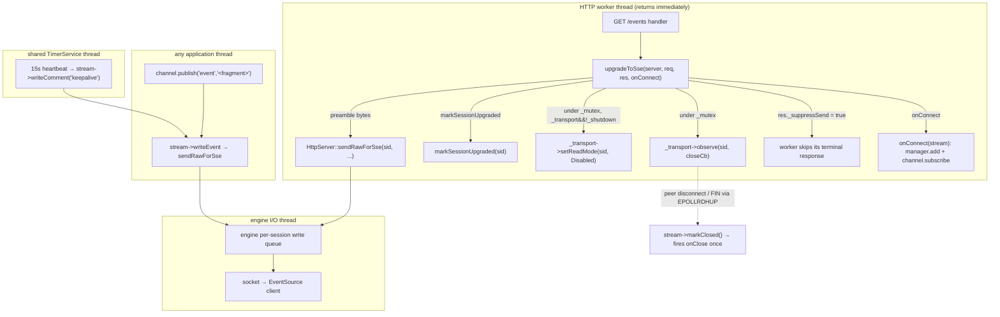

# Iora Server-Sent Events + Channel Pub/Sub — Architecture & Programmer's Guide

[Back to index](../../README.md)

| | |
|---|---|
| **Version** | 1.1 |
| **Date** | 2026-09-14 |
| **Status** | IMPLEMENTED |
| **Headers** | `include/iora/network/sse_stream.hpp` (`SseStream`, `upgradeToSse`, `SseManager`), `include/iora/web/channel.hpp` (`SseChannel`, `WsChannel`) |
| **Namespace** | `iora::network` (`SseStream`, `upgradeToSse`, `SseManager`), `iora::web` (`SseChannel`, `WsChannel`) |
| **Dependencies** | `core::TimerService` ([`timer.md`](../core/timer.md)) — injected heartbeat · `HttpServer` ([`http_server.md`](http_server.md)) routing seam (`Request::sid`, `Response::_suppressSend`, `sendRawForSse`, `closeSession`, `markSessionUpgraded`, `setIdleTimeout`, `setGcInterval`, friend grants) · `Transport` ([`transport.md`](transport.md)) `observe` / `setReadMode` · `WebSocketServer` ([`websocket.md`](websocket.md)) `isSessionActive` + send-boundary `closeSent` recheck |

---

## Revision History

| Version | Date | Changes |
|---|---|---|
| 1.0 | 2026-06-01 | Initial implementation: `SseStream` + `upgradeToSse` + `SseManager`, `SseChannel` + `WsChannel`, `WebSocketServer::isSessionActive` + send-boundary `closeSent` recheck, `HttpServer` seam additions (`sendRawForSse`→bool/virtual, `closeSession` virtual, `setIdleTimeout`/`setGcInterval`). iora commit `18ed521`; review loop (cpp17 + thread-safety + web) converged after 3 iterations. |
| 1.1 | 2026-09-14 | Migrated into the network documentation wiki (`docs/network/`). Full step-13 re-verify against current source: documented that `upgradeToSse`'s `setReadMode` + `observe` run under `HttpServer::_mutex` with a `_transport && !_shutdown` recheck (the use-after-free guard, tracker `2026-05-30-2`), which the prior revision omitted; recorded that read-disabled sessions still detect a client FIN via `EPOLLRDHUP` (iora `ebc405b`, tracker `2026-09-11-19`). No behavior change. |

---

## 1. Executive Summary

**Problem.** iora's `HttpServer` builds exactly one `Response` per request and sends it once — there is no server-push path. HTMX live-update patterns need either Server-Sent Events (the `sse` extension swaps fragments arriving on an `EventSource`) or WebSocket push, plus a pub/sub abstraction to broadcast a fragment to every connected client. None of this existed. The original brainstorm proposed an SSE model where "the HTTP worker hands the socket fd to an SSE manager that owns the connection" — which is **impossible and unnecessary** on iora's transport (the worker never owns the fd; it only knows a `SessionId`).

**Solution.** Three cooperating pieces plus a channel layer:

1. **`SseStream`** — a `shared_ptr`-held handle wrapping a `SessionId` + a back-pointer to the owning `HttpServer`. It formats the SSE wire protocol (`event:`/`data:`/`retry:`/comments) and writes bytes through the engine's per-session write queue. It is **not** a socket owner.
2. **`upgradeToSse(server, req, res, onConnect)`** — a free function called from inside a `GET` handler. It enqueues the `200 text/event-stream` preamble directly to the socket, marks the session "upgraded" so the HTTP parser stops, registers a disconnect observer (under the server lock), sets `res._suppressSend = true` so the worker writes no terminal response, hands the stream to `onConnect`, and returns the worker thread to the pool.
3. **`SseManager`** — a registry of live streams plus one periodic heartbeat scheduled on a **shared, injected** `core::TimerService` (no dedicated thread). The 15 s heartbeat writes `: keepalive` comments that keep the connection alive against proxy/engine idle timeouts.
4. **`SseChannel` / `WsChannel`** — named pub/sub channels. `publish()` snapshots subscribers under a brief per-channel mutex, releases it, then writes to each subscriber — never holding a lock across a socket write.

**Impact.** A consumer subscribes a connecting client to a named channel in one line and calls `channel.publish("event", "<fragment>")` from any application thread to fan out live HTML updates. The model reuses the exact `SessionId`-retention mechanism WebSocket already proves: writes happen after the handler returns, by `SessionId`, through the engine write queue. No fd transfer, no held worker threads, no per-connection thread.

---

## 2. System Architecture

### 2.1 The SessionId-retention model (why there is no fd hand-off)

The HTTP worker never owns the socket fd — the fd lives in the engine `Session` and is reached only by `SessionId` via `_transport->sendAsync`. "Upgrading" to SSE therefore means: keep the connection open (the default), stop feeding inbound bytes to the HTTP parser (`markSessionUpgraded`), remember the `SessionId`, and write subsequent bytes through the same `sendRaw`→engine-queue path WebSocket uses. This is structurally **simpler** than WebSocket (server→client only, no frame masking, no inbound frame parser).



### 2.2 Threading model

| Thread | Role |
|---|---|
| HTTP worker pool (existing, 2–8) | Runs the SSE `GET` handler → `upgradeToSse` → `onConnect`, then returns. Never streams. |
| Engine I/O thread (existing) | Performs all real socket writes via the per-session write queue; enforces backpressure closes. |
| Shared `TimerService` thread (existing, **injected**) | Drives the 15 s heartbeat + closed-stream sweep. No dedicated SSE thread (RD-24). |
| Publisher threads (any) | Call `SseChannel::publish` / `WsChannel::publish`. |
| Engine close-observer dispatch (existing) | On disconnect, invokes the `observe` callback (copy-then-iterate, no transport lock held) → `SseStream::markClosed()`. |

### 2.3 Network topology

```
EventSource client ──TCP──► iora HttpServer (engine Session, fd owned by engine)
        ▲                         │
        │  text/event-stream      │ SseStream{SessionId, HttpServer*}
        │  (open-ended body)      │ co-owned by: SseManager registry,
        └─────────────────────────┘ each SseChannel it subscribes to,
                                     the disconnect-observer closure
```

---

## 3. Component Deep Dive

### 3.1 `SseStream` (`iora::network`)

A lightweight handle to one SSE connection. Fields:

- `SessionId _sid` — the engine session (no fd).
- `HttpServer* _server` — reached via **friend** access to the protected `sendRawForSse`/`closeSession` (RD-17). `SseStream` is declared a friend inside `HttpServer`.
- `std::atomic<bool> _open` — a **standalone, advisory** flag, read/written `memory_order_relaxed` (RD-16). It carries **no** happens-before for any other field; it is a best-effort prune hint only. It is **not** the close-once coordination mechanism.
- `std::mutex _closeMutex` + `bool _closed` + `std::function<void()> _onClose` — the **close-latch**.

Instances are held by `std::shared_ptr` so the manager registry, each channel's subscriber list, and the observe-callback closure can co-own one stream. The destructor is side-effect-free (it does **not** close the session).

#### Wire format (static, pure, unit-tested without a transport)

| Method | Output |
|---|---|
| `formatEvent(name, data)` | `event: <name>\n` (omitted if `name` empty) + one `data: <line>\n` per logical line + trailing `\n` |
| `formatComment(text)` | `: <text>\n\n` |
| `formatRetry(ms)` | `retry: <ms>\n\n` |

Key invariants:

- **Single-space separator** (web-H1): each data line is `data:` + exactly **one** space + `<line>`. The `EventSource` client strips one leading space, so the round-trip is identity even when a payload line itself begins with spaces.
- **Empty data** (web-L1): `formatEvent("m","")` → `event: m\ndata: \n\n` — exactly one `data:` line, never zero.
- **Line-ending normalization** (RD-8): `data` is split on `\r\n`, `\r`, **and** `\n`; terminators are stripped; no stray `\r` reaches a `data:` line.
- **Field-injection hardening** (web-W1): the event **name** and comment **text** are CR/LF-stripped (`appendStripped`). A `\n`/`\r` in the name would otherwise terminate the `event:` field early and forge arbitrary SSE fields — the SSE analogue of HTTP header CRLF injection. The `data` field is the exception: it is split per line (the legitimate multi-line mechanism), not stripped.

#### Close-latch (RD-19 / RD-22)

The `_closeMutex` guards **both** `_closed` and the `_onClose` slot, so `onClose` registration provably shares the close critical section. A bare `std::atomic<bool>` test-and-set would **not** make registration race-free (registration `{read closed; store _onClose}` would race the close path `{set closed; load _onClose}`, allowing a missed fire — a gauge leak — or a double fire).

Three entry points, all invoking the callback **outside** the latch (copy-then-invoke):

- **`close()`** — explicit close (RD-19 path b). Sets `_open=false`; takes `_closeMutex`; if already `_closed`, returns **without** calling `closeSession`; else latches, copies `cb`, releases the mutex, **then** (only on the winning latch, outside `_closeMutex`) calls `closeSession(_sid)` and fires `cb`. Idempotent.
- **`markClosed()`** — observer-driven close (RD-19 path a). Same latch, but **never** calls `closeSession` (the engine is already closing the session — M-6). Public so the `upgradeToSse` observer closure can invoke it.
- **`onClose(cb)`** — registers the callback. If the stream is **already closed**, fires `cb` immediately/synchronously on the registering thread, outside the latch (RD-22, closes the gauge-leak window). Single-slot: a second registration before the latch fires overwrites the first (last-wins), matching `WebSocketServer::setOnClose`.

> **As-built note (M-6 reconciliation).** The architecture's literal `close()` pseudocode called `closeSession` *before* the latch unconditionally — which double-closes a session the observer already latched. The implementation calls `closeSession` **after** the latch decision and **only** when `close()` wins the latch, honoring the doc's own M-6/RD-19 invariant. `closeSession` fires exactly once and only on the winning explicit close.

#### Writes

`writeEvent` / `writeComment` / `writeRetry` are fire-and-forget: each checks `_open` (relaxed) and no-ops if closed; assembles the bytes into a **local owning buffer**; hands `.data()/.size()` to `sendRawForSse` (the engine copies into its queue). If `sendRawForSse` returns `false` (transport down) the stream's `_open` is flipped to `false` — the **secondary** disconnect signal. The **primary** signal is always the `observe` callback.

### 3.2 `upgradeToSse` (`iora::network`)

```cpp
void upgradeToSse(HttpServer& server, const HttpServer::Request& req,
                  HttpServer::Response& res,
                  std::function<void(std::shared_ptr<SseStream>)> onConnect);
```

Steps (in order):

1. **GET-only no-op** (RD-21): if `req.method != GET`, return immediately — no preamble, no `_suppressSend`. An auto-`HEAD` dispatch to a `GET` SSE handler thus yields a normal bodyless `HEAD` response. (`Accept: text/event-stream` is advisory and not enforced; a `Last-Event-ID` request header is silently ignored — v1 does not replay events, web-M3.)
2. Construct the `SseStream` **first** (thread-H1): from the instant `observe` is registered, `markClosed()` may fire concurrently, so the close-latch must already be initialized.
3. Build the preamble (see §6) and enqueue via `server.sendRawForSse(req.sid, ...)` — no flush (RD-18); the engine I/O thread delivers.
4. `markSessionUpgraded(req.sid)` — the SSE `GET` is the terminal request on its connection (RD-2); pipelined-after bytes are parsed-then-ignored.
5. **Under `HttpServer::_mutex`, re-checking `_transport && !_shutdown`** — the steps that dereference the private `_transport` take the server's outermost lock and re-check the same invariant `sendRaw`/`closeSession` use, because a worker still inside `upgradeToSse` can straggle past `stop()`'s bounded drain wait and race `_transport.reset()` (also under `_mutex`); an unguarded raw deref here would be a use-after-free (the defect class of tracker `2026-05-30-2`). `_mutex` is the outermost lock **on this `upgradeToSse` path** (globally, the WebSocket send path holds `_wsMutex` above it — `_wsMutex → _mutex`); `setReadMode`/`observe` take only the transport's own internal locks, so there is no inversion. Inside the guard:
   - `_transport->setReadMode(req.sid, ReadMode::Disabled)` — stop app-data reads. (This does **not** exempt idle reaping — see §3.3 / M-3.) Disabling reads withholds `EPOLLIN`, but the TCP engine still arms `EPOLLRDHUP` on the session, so a client's graceful FIN is detected and drives the disconnect observer below; that FIN detection is what makes the observer fire on a real disconnect (a regression where `EPOLLRDHUP` was not armed left this undetected — iora `ebc405b`, tracker `2026-09-11-19`).
   - `_transport->observe(req.sid, closeCb)` — the closure captures the `shared_ptr<SseStream>` **by value** (strong ref, thread-H2) so the stream survives an in-flight publish. The returned `ObserverId` is intentionally discarded: the engine auto-purges per-session observers on close, so no explicit `unobserve` is required (and calling it from inside `markClosed` would run during the very dispatch that erases the entry). `observe()` only **registers** the closure under `_mutex` (the engine dispatches `markClosed` later, lock-free), so registration under the lock does not invoke a callback under it.
6. `res._suppressSend = true` — the worker skips its entire terminal response/keep-alive block. Clean all-or-nothing: the preamble was already written in step 3.
7. `onConnect(stream)` — the consumer registers the stream with the `SseManager` **and** subscribes it to a channel. (`upgradeToSse` does neither — the 4-arg signature has no `SseManager`, cpp17-H1.) `markClosed()` may already have fired, so `onConnect`'s `onClose(cb)` relies on the RD-22 immediate-fire.
8. Return — the worker goes back to the pool; the session stays open.

### 3.3 `SseManager` (`iora::network`)

A scheduler, not a socket owner. Constructed with `SseManager(HttpServer&, core::TimerService&, interval = 15s)` — the `TimerService` is **injected** (cpp17-H1; `HttpServer` owns none) and must be started and outlive the manager. The `server` argument is accepted for the canonical signature but **not retained** (the manager never calls into the server directly — writes go through `SseStream`).

- **Registry** lives in a heap `struct Registry { std::mutex mutex; std::vector<std::shared_ptr<SseStream>> streams; std::atomic<bool> draining; std::atomic<int> ticksInFlight; }` owned by `std::shared_ptr<Registry>`.
- **`add(stream)`** pushes under the registry leaf mutex, then arms the heartbeat lazily on the first stream (`_scheduleMutex`-guarded, **outside** the registry mutex so it stays a strict leaf).
- **Heartbeat** (`schedulePeriodic`) is a **static** `heartbeatTick(std::weak_ptr<Registry>)`: it promotes the weak_ptr per tick and bails if expired. It increments `ticksInFlight` (seq_cst) before reading `draining`, copy-then-iterates a snapshot (no lock held during `writeComment`), writes `: keepalive\n\n` to each open stream, then prunes closed streams under the mutex with a `WARN` log.
- **`shutdown()`** sets `draining` (seq_cst), **waits** for any in-flight tick (`ticksInFlight == 0`), then writes a final `: shutting down\n\n` comment and `close()`s each stream while the transport is up, then cancels the schedule and clears the registry (releasing the manager's stream references so the streams can be reclaimed once the channel/observer refs also drop).
- **`remove(stream)`** / **`streamCount()`** take only the registry leaf mutex.

> **Lifetime safety (H-1).** `TimerService::cancel()` does **not** join a callback already in flight, and the design has the `TimerService` outlive the manager. The heap-`Registry` + `weak_ptr` promotion makes destruction race-free: an in-flight tick keeps the `Registry` alive via its locked strong ref; a tick dispatched after the manager is gone finds the `weak_ptr` expired and bails. No use-after-free under any cancel/destruction ordering. The `~SseManager` destructor cancels the schedule.

> **Arm-vs-shutdown (M-2).** `armHeartbeat()` skips arming when `_armed` is already set **or** `draining` is set. Combined with `shutdown()` setting `draining` before it cancels under `_scheduleMutex`, this closes the `add()`-vs-`shutdown()` re-arm leak: an arm that wins the mutex before draining schedules and is cancelled by the later `cancelSchedule()`; an arm that loses sees `draining` and never schedules. `_armed` is deliberately one-shot even on failure — a mis-wired **stopped** `TimerService` makes `schedulePeriodic` return `0`; the manager logs an error (heartbeat-less) rather than silently retrying on a later `add()`.

> **Idle survival (M-3).** `ReadMode::Disabled` does **not** exempt the 600 s `idleTimeout` — the engine GC keys on `lastActivity`, not `ReadMode`. The 15 s heartbeat's outbound write refreshes `lastActivity`, keeping a healthy stream alive. Its **primary** purpose is defending the tighter ~30–60 s idle timeouts of L7 proxies.

### 3.4 `SseChannel` / `WsChannel` (`iora::web`)

Both use a per-channel `mutable std::mutex` (a leaf lock) and the **snapshot-then-write** discipline: acquire the mutex only to copy the subscriber snapshot (and prune), release it, then write to each subscriber with no lock held. `publish()` is callable from any thread and never blocks the publisher.

- **`SseChannel`** holds `std::vector<std::shared_ptr<SseStream>>` (co-ownership keeps streams alive across in-flight publishes). `publish(eventName, htmlFragment)` prunes closed streams then `writeEvent`s each open one. Zero-subscriber publish is a no-op. `removeClosed()` prunes on demand; `subscriberCount()` is the source for the OQ-8 gauge.
- **`WsChannel`** holds its **own** `std::unordered_set<SessionId>` (because `WebSocketServer::_sessions` is private with no enumeration, OQ-6). `publish(htmlFragment)` skips + prunes any `sid` failing `isSessionActive`, else `sendText`. The prune of inactive sids re-takes the channel mutex; a sid unsubscribed-then-resubscribed in that window loses the fresh subscription (benign TOCTOU, cpp17-L3 — re-added on the next subscribe; no correctness or safety impact). `unsubscribe` takes **only** the channel mutex and never calls back into the server (thread-M4), keeping the channel mutex a strict leaf. One server per channel in v1 (a subscribe with a different server is logged and ignored, L-1). Push-only (no inbound handling).

### 3.5 `WebSocketServer` changes (web-M7, RFC 6455 §5.5.1)

Two changes prevent a DATA frame from ever following a CLOSE frame:

1. **`bool isSessionActive(SessionId) const`** — a cheap early-out (`true` iff present and `!closeSent`). Best-effort; can go stale immediately.
2. **Authoritative send-boundary recheck** — `sendText`/`sendBinary`/`sendPing` now acquire `_wsMutex`, re-check `closeSent`, **drop** the frame if absent/closing, else serialize and `sendRaw` **while still holding `_wsMutex`**. This makes the check-and-send atomic with respect to `sendClose` / the inbound-CLOSE echo (which flip `closeSent` under `_wsMutex`). The data-after-close window is **closed**, not narrowed. The lock order is `_wsMutex → _mutex`, identical to the existing inbound-CLOSE echo — no new cycle.

---

## 4. Usage Guide

### 4.1 Quick start

```cpp
#include <iora/network/sse_stream.hpp>
#include <iora/web/channel.hpp>
#include <iora/core/timer.hpp>

iora::network::HttpServer http("0.0.0.0", 8080);
iora::core::TimerService timer;            // owner-provided, outlives the manager
timer.start();                             // returns a LifecycleResult — check .success in production
iora::network::SseManager sseManager(http, timer);   // default 15s heartbeat
iora::web::SseChannel updates("updates");

// SSE route: subscribe the connecting client, then return.
http.onGet("/events", [&](const auto& req, auto& res) {
  iora::network::upgradeToSse(http, req, res,
    [&](std::shared_ptr<iora::network::SseStream> stream) {
      sseManager.add(stream);       // heartbeats + bookkeeping
      updates.subscribe(stream);    // fan-out target
      // optional: stream->onClose([&]{ liveSubscribers.decrement(); });
    });
});

http.start();

// From any thread, push a fragment to every subscriber:
updates.publish("row-added", "<tr><td>42</td></tr>");

// Graceful shutdown order: drain SSE first, then stop the timer, then the server.
sseManager.shutdown();
timer.stop();
http.stop();
```

Client side (HTMX): `<div hx-ext="sse" sse-connect="/events" sse-swap="row-added"></div>`.

### 4.2 WebSocket push

```cpp
iora::network::WebSocketServer ws("0.0.0.0", 8081);
iora::web::WsChannel wsUpdates("ws-updates");
ws.setOnConnect([&](iora::network::SessionId sid, const std::string&) {
  wsUpdates.subscribe(ws, sid);
});
// ... ws.setOnClose -> wsUpdates.unsubscribe(sid);
wsUpdates.publish("<li>new item</li>");   // dropped automatically for closing sessions
```

### 4.3 Gotchas & anti-patterns

- **Do not** hold a worker thread to stream — subscribe and return. A held-thread streaming handler does not scale and was explicitly rejected (LD-4).
- **Do not** let an `SseStream` outlive its `HttpServer` (v1 ties stream lifetime to the server via shutdown ordering; there is no `weak_ptr` to the server).
- **Inject a started `TimerService`** that outlives the `SseManager`. A stopped service makes `schedulePeriodic` return 0 and the manager logs an error (heartbeat-less).
- **`onConnect` runs on the worker thread** — keep it cheap (locked pushes only), never block.
- Event **names** are identifiers; do not pass attacker-controlled multi-line strings as the event name (they are CR/LF-stripped, but the intent is single-line identifiers).

---

## 5. Call Flow / Sequence Reference

### 5.1 Subscribe → publish

1. Client `GET /events` (HTMX sets `Accept: text/event-stream`).
2. Worker runs the handler → `upgradeToSse` → enqueues preamble, marks upgraded, then (under `_mutex`) sets `ReadMode::Disabled` + registers `observe`, sets `_suppressSend`, calls `onConnect` (which `add`s to the manager and `subscribe`s to the channel), returns.
3. Engine I/O thread delivers the preamble; the `EventSource` `onopen` fires.
4. Application thread calls `channel.publish("e", "<frag>")` → snapshot → `stream->writeEvent` → `sendRawForSse` → engine queue → client `EventSource` dispatches the `e` event.

### 5.2 Heartbeat

Every 15 s the `TimerService` callback (`heartbeatTick`) snapshots the registry, writes `: keepalive\n\n` to each open stream (refreshing `lastActivity`), and prunes closed streams.

### 5.3 Disconnect

Client drops → engine close dispatch (peer FIN detected via `EPOLLRDHUP` even on a read-disabled session) → `observe` callback (no transport lock held) → `stream->markClosed()` → `_open=false`, `onClose` fires once (gauge decrement), **no** `closeSession`. The next `publish`/heartbeat prunes the stream from the channel/registry; the closure's strong ref is released by the engine's observer auto-purge, so the stream's `use_count` returns to baseline.

### 5.4 Graceful shutdown

`shutdown()` sets `draining` → waits for any in-flight tick → writes `: shutting down\n\n` + `close()`s each stream (socket close drives the client to reconnect on restart) → cancels the heartbeat schedule → clears the registry. No `: keepalive` can follow `: shutting down`.

---

## 6. Configuration Reference

### 6.1 SSE preamble (exact bytes)

```
HTTP/1.1 200 OK\r\n
Content-Type: text/event-stream; charset=utf-8\r\n
Cache-Control: no-cache, no-transform\r\n
X-Accel-Buffering: no\r\n
Date: <IMF-fixdate>\r\n
\r\n
retry: 3000\n\n
```

| Element | Rationale |
|---|---|
| `Content-Type: text/event-stream; charset=utf-8` | SSE media type. |
| `Cache-Control: no-cache, no-transform` | `no-transform` (RFC 9111 §5.2.2.6) stops compressing/transcoding proxies from buffering (web-M6). |
| `X-Accel-Buffering: no` | Defeats nginx response buffering (nginx-specific, web-M2). |
| `Date: <IMF-fixdate>` | RFC 9110 §6.6.1 MUST for a clock-bearing origin server on a 2xx; a 29-char IMF-fixdate, UTC, **C-locale English** day/month tables via a **reentrant** formatter (`detail::formatHttpDate`, shared with `HttpResponse::toWireFormat`; never `std::gmtime` — the preamble is built on worker threads, thread-H4). |
| **No** `Connection` | HTTP/1.0-ism; no-op on 1.1, forbidden on HTTP/2 (web-M5). The open-ended (no `Content-Length`) body keeps the connection alive. |
| **No** `Content-Length` / `Transfer-Encoding` | Open-ended stream. |
| `retry: 3000` **after** the blank line | It is the **first SSE body line**, not an HTTP header (web-H1/M4). Placed before the blank line a browser would parse `retry` as a response header and the reconnect time would be lost. |

### 6.2 Parameters

| Parameter | Default | Where | Effect |
|---|---|---|---|
| Heartbeat interval | 15 s | `SseManager` ctor arg | Keepalive cadence; shorten in tests. |
| `kDefaultSseRetryMs` | 3000 | `sse_stream.hpp` | Initial reconnect delay (fixed base; per-client jitter is wired by the phase-8 application layer via `writeRetry`, R-2). |
| `setIdleTimeout(seconds)` | 600 s | `HttpServer` | Engine GC reaps sessions idle longer than this; the heartbeat keeps SSE alive. |
| `setGcInterval(seconds)` | 5 s | `HttpServer` | How often the engine GC sweeps. |
| `~200 subscribers` | — | documented | Comfortable v1 per-tick fan-out limit on the shared `TimerService` callback. |

---

## 7. Thread Safety Model

| Lock | Guards | Discipline |
|---|---|---|
| `SseStream::_closeMutex` | `_closed` + `_onClose` | LEAF. Callback copied out and invoked **outside** the latch. `closeSession` called outside it, only on the winning explicit close. |
| `SseManager::Registry::mutex` | `streams` | LEAF. Held only to snapshot / add / remove / prune — **never** during a write, **never** while arming the schedule. |
| `SseManager::_scheduleMutex` | arm/cancel of the schedule (`_armed`, `_scheduleId`) | Serializes arm vs cancel; nests only the `TimerService` lock; never co-held with the registry mutex. |
| `SseChannel::_mutex` / `WsChannel::_mutex` | subscriber list | LEAF. Snapshot-then-write; `unsubscribe` takes only this mutex. |
| `HttpServer::_mutex` | `_transport` / `_shutdown` | Held by `upgradeToSse` across `setReadMode` + `observe` registration (the UAF guard, tracker `2026-05-30-2`); outermost **on the `upgradeToSse`/HTTP path** (below `_wsMutex` on the WS send path), no callback invoked under it. |
| `WebSocketServer::_wsMutex` | `_sessions` (`closeSent`) | The send methods hold it across `sendRaw` (`_wsMutex → _mutex`, same as the inbound-CLOSE echo). |

- `_open` is a relaxed advisory atomic (RD-16); a stale read is harmless (a write to an already-closed session is a no-op that re-sets `_open=false`).
- The `draining`/`ticksInFlight` handshake is **seq_cst**: `shutdown()` stores `draining` then reads `ticksInFlight`; the tick increments `ticksInFlight` **before** reading `draining`. The total order makes it impossible for a `: keepalive` to land after `shutdown`'s wait (thread-H3 / M-1).
- **Safe to call from any thread:** `SseChannel::publish`, `WsChannel::publish`, `SseStream::write*`, `SseStream::close`, `SseManager::add/remove/streamCount`. `onConnect` runs on the worker thread and must be cheap.

---

## 8. API Reference

```cpp
// iora::network — sse_stream.hpp
class SseStream {
public:
  SseStream(HttpServer& server, SessionId sid);
  static std::string formatEvent(std::string_view name, std::string_view data);
  static std::string formatComment(std::string_view text);
  static std::string formatRetry(std::uint32_t ms);
  void writeEvent(std::string_view name, std::string_view data);
  void writeComment(std::string_view text);
  void writeRetry(std::uint32_t ms);
  bool isOpen() const;
  void close();          // explicit (RD-19 path b): closeSession on the winning latch
  void markClosed();     // observer-driven (RD-19 path a): no closeSession
  void onClose(std::function<void()> cb);  // RD-22 fire-immediately-if-closed
  SessionId sessionId() const;
};

void upgradeToSse(HttpServer& server, const HttpServer::Request& req,
                  HttpServer::Response& res,
                  std::function<void(std::shared_ptr<SseStream>)> onConnect);

class SseManager {
public:
  SseManager(HttpServer& server, core::TimerService& timer,
             std::chrono::milliseconds interval = std::chrono::milliseconds(15000));
  void add(std::shared_ptr<SseStream> stream);
  void remove(const std::shared_ptr<SseStream>& stream);
  std::size_t streamCount() const;
  void shutdown();
};

// iora::web — channel.hpp
class SseChannel {
public:
  explicit SseChannel(std::string name);
  const std::string& name() const;
  void subscribe(std::shared_ptr<network::SseStream> stream);
  void publish(std::string_view eventName, std::string_view htmlFragment);
  std::size_t subscriberCount() const;
  void removeClosed();
};

class WsChannel {
public:
  explicit WsChannel(std::string name);
  const std::string& name() const;
  void subscribe(network::WebSocketServer& server, network::SessionId sid);
  void publish(std::string_view htmlFragment);
  std::size_t subscriberCount() const;
  void unsubscribe(network::SessionId sid);
};

// iora::network — websocket_server.hpp (additions)
virtual bool WebSocketServer::isSessionActive(SessionId sid) const;

// iora::network — http_server.hpp (seam additions)
virtual bool HttpServer::sendRawForSse(SessionId, const std::uint8_t*, std::size_t); // protected
virtual void HttpServer::closeSession(SessionId);                                     // protected
void HttpServer::setIdleTimeout(std::chrono::seconds);
void HttpServer::setGcInterval(std::chrono::seconds);
```

---

## 9. Design Decisions

> **Notation.** Bracketed identifiers used throughout this guide — `RD-*` (requirement/decision), `M-*` (mechanism), `C-*` (core decision), `H-*` (hazard / lifetime-safety finding), `LD-*` (cross-cutting or rejected-design decision), `R-*` (risk), `thread-*` / `cpp17-*` / `web-*` (dimension-specific review findings), `OQ-*` (open question), `L-*` (limitation) — are stable references into the component's design and review record (`architecture/iora/sse_and_channels.json` and the phase-6 review, tracker `2026-05-29-7`). They are retained for traceability; the table below resolves the load-bearing ones, and a reader can safely treat any others as pointers into that record rather than terms they must look up to follow the guide.

| ID | Decision | Rationale |
|---|---|---|
| C-2 | SessionId-retention, not fd hand-off | The worker never owned the fd; WebSocket already proves post-return writes by `SessionId`. |
| C-1 | Preamble written directly via `sendRawForSse` + `_suppressSend` | After the routing `_mutex` narrowing the handler holds no lock, so the brief `_mutex` in `sendRawForSse` cannot self-deadlock. |
| RD-24 | No dedicated SSE thread; heartbeat on the injected shared `TimerService` | Reuses an existing facility; removes all manager-thread lifecycle. |
| RD-19 | Two close paths; only explicit `close()` calls `closeSession`, and only on the winning latch | Avoids the double-close M-6 forbids when a disconnect observer is already closing the session. |
| RD-22 | `onClose` fires immediately if already closed | Closes the gauge-leak window when a peer disconnects before `onClose` is registered. |
| web-M7 | Authoritative `closeSent` recheck at the WS send boundary | A DATA frame can never follow a CLOSE frame (RFC 6455 §5.5.1). |
| web-W1 | CR/LF-strip the event name + comment text | Prevents SSE field injection (HTTP-CRLF-injection analogue). |
| Seam | `sendRawForSse`→bool, `closeSession`/WS-sends virtual, `setIdleTimeout`/`setGcInterval` | Enable the documented failure signal, test doubles, and the M-3 idle test (human-consented). |

---

## 10. Known Limitations

- **~200 subscribers** is the comfortable v1 limit for the single shared-`TimerService` heartbeat fan-out. Above that, move the fan-out to a dedicated pool — **no public-API change** required.
- **`WsChannel` is push-only** — no inbound WS message handling (a documented non-goal).
- **No hot-reconnect replay** — on reconnect iora does not replay missed events; a `Last-Event-ID` request header is silently ignored (the request upgrades normally, web-M3). The consumer re-renders current state on (re)subscribe.
- **Idle survival is best-effort via the heartbeat**, not an idle exemption — if the heartbeat stalls > 600 s the engine reaps the session.
- **`SseStream` holds a raw back-pointer to its `HttpServer`** — the stream must not outlive the server (enforced by shutdown ordering, not a `weak_ptr`, in v1).
- **Lazy channel-registry creation** (two concurrent `sseChannel(name)` returning the same instance) is owned by the phase-8 application layer; the registry does not exist in this component.
