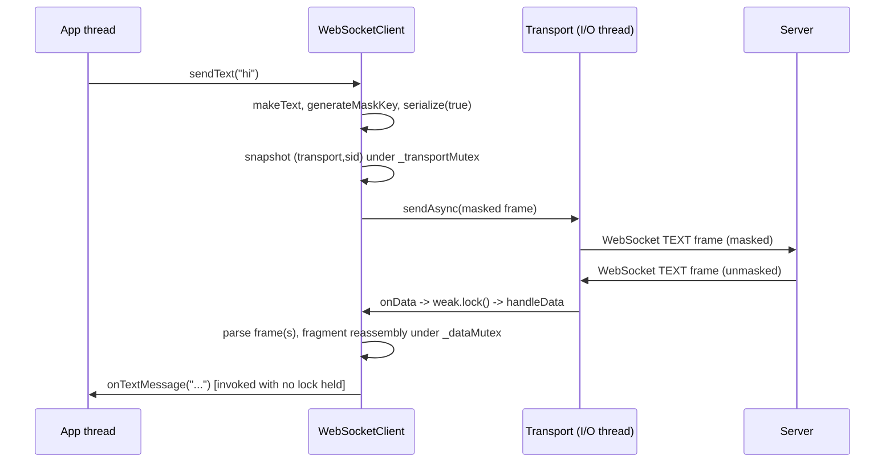

# Iora WebSocket -- Architecture & Programmer's Guide

[Back to index](../../README.md)

| | |
|---|---|
| **Version** | 2.1 |
| **Date** | 2026-09-12 |
| **Status** | IMPLEMENTED |
| **Headers** | `include/iora/network/websocket_frame.hpp` (frame parse/serialize/masking), `include/iora/network/websocket_server.hpp` (server, extends `HttpServer`), `include/iora/network/websocket_client.hpp` (client, `shared_ptr`-managed, auto-reconnect) |
| **Namespace** | `iora::network` |
| **Dependencies** | `HttpServer` ([`http_server.md`](http_server.md), `include/iora/network/http_server.hpp`) for the server; `Transport` ([`transport.md`](transport.md), `include/iora/network/transport_impl.hpp`) for the client; `iora::crypto::SecureRng` (`include/iora/crypto/secure_rng.hpp`) for SHA-1 and the mask/key RNG; `iora::util::Base64` (`include/iora/util/base64.hpp`) -- the standard padded RFC 4648 Base64 encoder used to compute `Sec-WebSocket-Accept` (server) and the `Sec-WebSocket-Key` nonce (client); NOT the in-house `Base64Url` variant (dedicated guide TBD when `docs/util/base64.md` lands); `iora::core::BufferView` (`include/iora/core/buffer_view.hpp`). OpenSSL is required at link time (SHA-1 and TLS) -- an executable including these headers must be configured with `configure_iora_target(<tgt> ENABLE_OPENSSL)`. Linux-only (inherits the epoll transport). See also the HTTP request/response model in [`../parsers/http_message.md`](../parsers/http_message.md). |

---

## 2. Revision History

| Version | Date | Changes |
|---------|------|---------|
| 1.0 | 2026-03-20 | Initial implementation: frame parser, server, client. |
| 1.1 | 2026-03-20 | Server buffer TOCTOU fix, client fragment reassembly, close-echo loop guard, control-frame validation, client thread-safety. |
| 1.2 | 2026-03-20 | Origin validation, custom upgrade headers, client TLS mode, UTF-8 overlong/surrogate validation. |
| 1.3 | 2026-06-12 | `WebSocketClient` reconnect-worker redesign (S-3 phase-2, "Option C"): `shared_ptr`-managed client, single long-lived CV worker, `weak_ptr` promote-before-touch, `noexcept` teardown/dtor, `_transportMutex` member-group lock, one-shot `_closeEchoed` CLOSE echo. |
| 2.0 | 2026-09-11 | **Migrated to `docs/network/` and re-verified end-to-end against the current three headers.** Restructured to the canonical 12-section guide template with API Reference LAST. Corrected stale claims from the 2026-06-14 draft: `util::Base64` is the **standard padded** encoder (not Base64URL), so `Sec-WebSocket-Accept` is RFC-compliant; the client connects via `connectSync` **then** `sendSync` (the draft said async-connect + `sendSync`); `Transport` methods are `inline`, so including `websocket_client.hpp`/`websocket_server.hpp` in multiple TUs is ODR-safe (no one-TU rule). Documented additional RFC 6455 conformance gaps found during verification (unmasked-client-frame acceptance, RSV silent-consume, oversized-control-frame parser stall, reserved-code 1005 echoed on the wire, 64-bit length not high-bit-validated) in Known Limitations. |
| 2.1 | 2026-09-12 | Re-synced to the landed HTTP/WS hardening fixes (iora 1af4b25 WS codec, e00906e subclass teardown): tri-state frame parse with 64-bit MSB check + maxFrameSize-before-alloc, unmasked/RSV/oversized-control/fragmentation protocol-error closes, no-code-close sentinel, close-code range validation, client-side masks/UTF-8/maxFrameSize, subclass-quiesce teardown invariant + onUpgradedClose abrupt-disconnect hook. Remaining open items retagged with tracker refs. |

---

## 3. Executive Summary

### Problem

The Iora ecosystem needs RFC 6455 WebSocket support for browser-facing VoIP (SIP over WebSocket, RFC 7118) and for real-time management dashboards. Both need a bidirectional, framed, message-oriented channel layered on the existing epoll transport, without pulling in a third-party WebSocket library and without opening a second listener port.

### Solution

Three header-only components in `iora::network`:

- **`WebSocketFrame`** (`websocket_frame.hpp`) -- a pure, transport-free RFC 6455 frame codec: `parse()` is **tri-state** (Ok / Incomplete / ProtocolError-with-close-code, reported through a `WsParseError` out-parameter) and decodes one frame from a `core::BufferView` (auto-unmasking) with the declared length checked against `maxFrameSize` **before** any allocation and the 64-bit length's MSB rejected; `serialize()` encodes to the wire (optionally masking with the frame's stored mask key), plus close-payload extraction/validation, close-echo construction (no-code sentinel), UTF-8 validation, and factory helpers.
- **`WebSocketServer`** (`websocket_server.hpp`) -- extends `HttpServer` and hooks the HTTP upgrade via `onUpgradeRequest()`. It performs the handshake (`SHA-1` + Base64 accept, subprotocol negotiation, origin check), reassembles fragments, auto-answers Ping with Pong, echoes Close once, enforces RFC 6455 protocol rules (masking, RSV, control-frame size, fragmentation sequence, close-code range) by closing the offending session, and dispatches text/binary messages to callbacks. A codec throw or protocol violation closes **that one session**, not the transport. WebSocket sessions ride the existing HTTP port. On an abrupt transport drop with no protocol CLOSE, the base `onUpgradedClose` seam still fires the app's close callback exactly once; and `~WebSocketServer` quiesces the transport before its own members are destroyed.
- **`WebSocketClient`** (`websocket_client.hpp`) -- a `shared_ptr`-managed client (created only via `create()`; copy/move deleted) that runs the upgrade handshake over `Transport`, masks every client-to-server frame with a `SecureRng` key, and optionally auto-reconnects with exponential backoff driven by a single long-lived condition-variable worker.

### Technical impact

- **No external WebSocket dependency.** SHA-1 comes from the existing OpenSSL link; Base64 is in-house; framing is `WebSocketFrame`.
- **Server reuses the HTTP port.** A WebSocket upgrade is an HTTP `GET` with `Upgrade: websocket`; the server intercepts it in the `HttpServer` upgrade hook, so no new listener is needed.
- **Structurally safe client teardown.** The client lives only inside a `std::shared_ptr`; every I/O-thread callback and the reconnect worker promote a `weak_ptr` before touching state, so a callback that drops the last reference defers `~WebSocketClient` rather than freeing the object mid-call.
- **Deterministic client connect.** `connect()` blocks until the upgrade settles (`CONNECTED`) or fails/times out, so the caller never races an asynchronous handshake.

---

## 4. System Architecture

### 4.1 Component relationships

```
websocket_frame.hpp   (pure codec -- no I/O, no transport, no locks)
  enum class WsOpcode { CONTINUATION, TEXT, BINARY, CLOSE, PING, PONG }
  bool isControlFrame(WsOpcode)
  struct WsParseError { bool isError; uint16_t closeCode; }   // tri-state discriminator
  struct WebSocketFrame
    fields:   bool fin; WsOpcode opcode; bool masked; uint8_t maskKey[4]; vector<uint8_t> payload
    const:    static constexpr size_t kDefaultMaxFrameSize = 64 MiB
    parse:    static optional<WebSocketFrame> parse(core::BufferView, size_t& consumed,
                       size_t maxFrameSize = kDefaultMaxFrameSize, WsParseError* outError = nullptr)
    encode:   vector<uint8_t> serialize(bool applyMask = false) const
    close:    pair<uint16_t,string> closePayload() const; bool hasCloseCode() const
    validate: struct CloseValidation; CloseValidation validateClose() const
              static bool isValidCloseCode(uint16_t)
    echo:     static WebSocketFrame makeClose / makeCloseNoCode / makeCloseEcho(const WebSocketFrame&)
    factories: makeText / makeBinary / makeContinuation / makePing / makePong
    utf8:     bool isValidUtf8() const; static isValidUtf8(ptr,len); static isValidUtf8(vector)

HttpServer  (base -- include/iora/network/http_server.hpp)
  |  owns std::shared_ptr<Transport> (TCP/TLS), thread pool, _mutex, _sessionInfo,
  |  _upgradedSessions
  |  virtual bool onUpgradeRequest(SessionId, const Request&, Response&)          [seam]
  |  virtual void onUpgradedData(SessionId, const uint8_t*, size_t)               [seam]
  |  virtual void onUpgradedClose(SessionId, const TransportErrorInfo&)           [seam, abrupt drop]
  |  protected void quiesceTransport() / void quiesceTransportNoexcept(const char*)
  |  void markSessionUpgraded(SessionId) / void sendRaw(...) / virtual void closeSession(...)
  |
  +-- WebSocketServer : public HttpServer      (websocket_server.hpp)
        ~WebSocketServer() -> quiesceTransportNoexcept() FIRST (WS-TS1/2 subclass-quiesce)
        overrides onUpgradeRequest()  -> RFC 6455 handshake (SHA-1+Base64, subproto, origin)
        overrides onUpgradedData()    -> move-parse-prepend frame loop, per-frame try/catch
        overrides onUpgradedClose()   -> prune _sessions, fire _onClose once (1001/1006)
        mutable std::mutex _wsMutex
        unordered_map<SessionId, WsSessionState> _sessions
          WsSessionState { buffer; fragmentBuffer; fragmentOpcode; fragmentInProgress;
                           negotiatedProtocol; closeSent }
        size_t _maxFrameSize = 16 MiB
        callbacks: _onConnect _onTextMessage _onBinaryMessage _onClose _onError
                   _subprotocolCb _originCb
        sends:     sendText / sendBinary / sendPing (closeSent-gated) / sendClose / isSessionActive

WebSocketClient final : enable_shared_from_this<WebSocketClient>   (websocket_client.hpp)
  created ONLY via static create() -> shared_ptr   (private PrivateTag ctor; copy+move deleted)
  owns (guarded by _transportMutex): shared_ptr<Transport> _transport; SessionId _sessionId;
                                     shared_ptr<ReconnectControl> _rc; std::thread _reconnectWorker
  receive state (guarded by _dataMutex): _buffer; _fragmentBuffer; _fragmentOpcode;
                                         _fragmentInProgress; _negotiatedProtocol
  size cap: size_t _maxFrameSize = 16 MiB (setMaxFrameSize, set-once-before-connect)
  atomics: _state; _upgradeComplete; _closeEchoed; _ioThreadId
  handshake sync: _connectMutex + _connectCv
  struct ReconnectControl { mutex m; condition_variable cv; bool requested; atomic<bool> shouldRun }
  API: connect / disconnect / sendText / sendBinary / sendPing / sendClose / getState /
       negotiatedProtocol / setMaxFrameSize + 6 callback setters
```

Both the server and the client depend on the same `WebSocketFrame` codec for wire encode/decode; the codec is the only shared surface. The server and client never link to each other.

### 4.2 Upgrade handshake (server side)

```mermaid
sequenceDiagram
  participant C as Client
  participant T as Transport (epoll I/O thread)
  participant H as HttpServer
  participant W as WebSocketServer

  C->>T: TCP connect
  T->>H: onAccept (new SessionId)
  C->>T: HTTP GET (Upgrade, Sec-WebSocket-Key, Version 13)
  T->>H: handleIncomingData
  H->>H: parse HTTP request
  H->>W: onUpgradeRequest(sid, req, res)
  W->>W: validate Upgrade/Connection/Key/Version
  W->>W: origin callback (optional) then accept = Base64(SHA1(key + GUID))
  W->>W: subprotocol callback (optional)
  W->>W: build 101, markSessionUpgraded(sid), create WsSessionState
  W->>W: fire onConnect(sid, subprotocol)
  W-->>H: return true
  H->>T: send 101 Switching Protocols
  Note over C,W: session is now WebSocket; further bytes go to onUpgradedData
```

### 4.3 Message send and receive (client side)



### 4.4 Threading model

| Thread | Responsibility |
|---|---|
| Transport engine I/O thread (one per transport) | Runs the epoll loop. Server: delivers raw bytes to `onUpgradedData`, fires all server callbacks. Client: fires `onData`/`onClose`/`onError`, which promote `self` via `weak.lock()` and run `handleData`/`handleDisconnect`. Every user message/close/error callback runs on this thread. |
| HttpServer thread pool | Runs the HTTP request path, including `onUpgradeRequest` (the handshake) and the server's `onConnect` callback. |
| Application thread(s) | Construct the server/client, register callbacks (before `connect`/`start`), and call the send methods and `disconnect`/`sendClose` from any thread. |
| Client reconnect worker | One long-lived thread per connect cycle (spawned only when `Options::autoReconnect`). CV-idle between events; woken non-blocking by I/O-thread callbacks via `requestReconnect()`. Performs interruptible backoff, then `doConnect`. Never joins or tears down on the I/O thread. |

---

## 5. Component Deep Dive

### 5.1 WebSocketFrame -- the codec

`WebSocketFrame` is pure logic: no sockets, no transport, no mutexes. It decodes and encodes a single RFC 6455 frame and provides the message-level helpers the server and client build on.

**Wire format (RFC 6455 section 5.2).**

```
 0                   1                   2                   3
 0 1 2 3 4 5 6 7 8 9 0 1 2 3 4 5 6 7 8 9 0 1 2 3 4 5 6 7 8 9 0 1
+-+-+-+-+-------+-+-------------+-------------------------------+
|F|R|R|R| opcode|M| Payload len |   Extended payload length     |
|I|S|S|S|  (4)  |A|     (7)     |         (16 or 64)            |
|N|V|V|V|       |S|             |  (if payload len == 126/127)  |
+-+-+-+-+-------+-+-------------+ - - - - - - - - - - - - - - - +
|          masking-key (4 bytes, present iff MASK == 1)         |
+---------------------------------------------------------------+
|                        payload data ...                       |
+---------------------------------------------------------------+
```

**Opcodes.** `WsOpcode` is a `uint8_t` enum: `CONTINUATION = 0x0`, `TEXT = 0x1`, `BINARY = 0x2`, `CLOSE = 0x8`, `PING = 0x9`, `PONG = 0xA`. `isControlFrame(op)` returns `true` for `CLOSE`, `PING`, `PONG`.

**FIN and fragmentation.** `fin` is bit 7 of byte 0. A message may span multiple frames: a first frame carrying `TEXT`/`BINARY` with `fin == false`, zero or more `CONTINUATION` frames, and a final frame with `fin == true`. Reassembly is done by the server/client (section 5.2/5.3), not by the codec -- `parse()` returns one frame at a time.

**Payload-length encoding.** Byte 1 low 7 bits give the length: `0..125` is the literal length; `126` means the next 2 bytes are a big-endian 16-bit length (`readU16BE`); `127` means the next 8 bytes are a big-endian 64-bit length (`readU64BE`). For the 127 form, `parse()` rejects a value whose most-significant bit is set (RFC 6455 section 5.2 requires MSB = 0) as a protocol error (close `1002`). Both extended forms also enforce **minimal-length encoding** (RFC 6455 section 5.2: "the minimal number of bytes MUST be used to encode the length"): a 126-form carrying a value `<= 125`, or a 127-form carrying a value `<= 0xFFFF`, uses more bytes than necessary and is rejected as a protocol error (close `1002`). The declared length is then checked against `maxFrameSize` (default `kDefaultMaxFrameSize` = 64 MiB, caller-overridable) and, if exceeded, rejected as `1009` (message too big) **before any payload is allocated**. The "is the whole payload present yet?" test uses subtraction (`payloadLen > data.size() - pos`, with `pos <= data.size()` already guaranteed) so the bound cannot wrap for a near-`SIZE_MAX` length. `serialize()` picks the smallest encoding that fits `payload.size()`.

**Masking.** `parse()` reads the 4-byte mask key when the MASK bit is set and unmasks in place: `payload[i] ^= maskKey[i % 4]`. `serialize(applyMask)` masks only when `applyMask == true`, using the frame's **stored** `maskKey` (the caller must have filled it first -- see the note below). The client fills `maskKey` from `SecureRng` before every send; the server never masks.

**Tri-state parse and protocol errors.** `parse()` reports one of three outcomes, disambiguated through the `WsParseError* outError` out-parameter (always written when non-null):

- **Ok** -- returns the frame; `consumed` = bytes used; `outError->isError == false`.
- **Incomplete** (need more bytes) -- returns `std::nullopt`; `consumed == 0`; `outError->isError == false`.
- **ProtocolError** -- returns `std::nullopt`; `consumed == 0`; `outError->{isError = true, closeCode = ...}` (`1002` protocol error, `1009` message too big).

This replaces the earlier collapse-everything-into-`std::nullopt` behavior, so a caller can now tell "buffer and wait" apart from "close the connection" (the ambiguity noted in earlier revisions of section 12 is resolved). `parse()` centralizes the RFC 6455 rules: an RSV bit set with no negotiated extension (section 5.2), an opcode outside the six defined values (section 5.2), and a control frame (`CLOSE`/`PING`/`PONG`) with payload `> 125` or `fin == false` (section 5.5) each return a `1002` protocol error rather than being silently consumed.

**Snippet -- tri-state parse:**

```cpp
core::BufferView view(buf.data(), buf.size());
std::size_t consumed = 0;
iora::network::WsParseError perr;
auto frame = iora::network::WebSocketFrame::parse(view, consumed, maxFrameSize, &perr);
if (!frame)
{
  if (perr.isError)
  {
    // protocol error -- close the session with perr.closeCode (1002 / 1009)
  }
  // else: incomplete -- buffer and wait for more bytes
}
else
{
  // advance by `consumed`; frame->payload is already unmasked
}
```

**Close payload and echo.** `closePayload()` returns `{code, reason}`. If the payload is shorter than 2 bytes it returns `{1005, ""}` (1005 = "no status code present") -- but 1005 is a callback-only code that MUST NOT go on the wire. `hasCloseCode()` reports whether a 2-byte code is present. `validateClose()` checks an inbound CLOSE per RFC 6455 sections 5.5.1/7.4 (a no-code CLOSE is conforming; a 1-byte payload is a malformed length -> `1002`; an invalid/reserved code -> `1002`; a non-UTF-8 reason -> `1007`). `makeCloseEcho(received)` builds the correct on-the-wire echo: a no-code CLOSE echoes `makeCloseNoCode()` (empty payload, never 1005/1006/1015); a valid code echoes a `1000` normal-closure ack; a reserved/invalid code echoes `1002`. `isValidCloseCode(c)` is the shared range test (permitted: 1000-1003, 1007-1011, 3000-4999).

**Factories.** `makeText(text, fin=true)`, `makeBinary(data, fin=true)`, `makeContinuation(data, fin=true)`, `makePing(payload={})`, `makePong(payload={})`, `makeClose(code, reason="")`, `makeCloseNoCode()`. `makeClose` writes the 2-byte big-endian code followed by the reason bytes; `makeCloseNoCode` produces an empty-payload CLOSE.

**UTF-8 validation.** `isValidUtf8()` walks the payload and rejects invalid leading bytes, truncated sequences, bad continuation bytes, overlong encodings (2-byte `< 0xC2`, 3-byte `E0 < A0`, 4-byte `F0 < 90`), UTF-16 surrogates (`ED A0..`), and code points above `U+10FFFF`. Two static overloads -- `isValidUtf8(const std::uint8_t*, std::size_t)` and `isValidUtf8(const std::vector<std::uint8_t>&)` -- let call sites validate raw bytes without a throwaway temp-frame copy; the member overload delegates to the pointer form. **Both** the server and the client use this to reject a non-UTF-8 TEXT message with close code `1007` (the client-side gap noted in earlier revisions is now closed).

> **Note (masking).** `serialize(applyMask = true)` masks with the frame's **stored** `maskKey`; it does not generate one. The doc comment now states this explicitly (the earlier "applies a random mask key" wording was corrected). Callers who want RFC-compliant client framing must fill `maskKey` first (as `WebSocketClient` does via `generateMaskKey`, which draws from `SecureRng`).

### 5.2 WebSocketServer -- accept, upgrade, per-connection lifecycle

`WebSocketServer` derives from `HttpServer` and overrides two protected seams.

**`onUpgradeRequest(sid, req, res)`** runs on the HTTP thread pool when a request carries an `Upgrade` header. It:

1. Reads `Upgrade`; if (case-insensitively) not `websocket`, returns `false` so `HttpServer` handles it as an ordinary HTTP request.
2. Requires `Connection` to contain `upgrade` (case-insensitive) else `400`.
3. Requires a non-empty `Sec-WebSocket-Key` else `400`.
4. Requires `Sec-WebSocket-Version: 13` else `426` with a `Sec-WebSocket-Version: 13` response header.
5. If an origin callback is set, calls it; a `false` result yields `403`.
6. Computes `Sec-WebSocket-Accept = Base64(SHA-1(key + "258EAFA5-E914-47DA-95CA-C5AB0DC85B11"))` using `crypto::SecureRng::sha1` and `util::Base64::encode` (standard padded Base64).
7. If a subprotocol callback is set and the client sent `Sec-WebSocket-Protocol`, splits the comma list, trims each, and calls the callback to pick one.
8. Builds a `101 Switching Protocols` response with `Upgrade: websocket`, `Connection: Upgrade`, `Sec-WebSocket-Accept`, and (if negotiated) `Sec-WebSocket-Protocol`.
9. Calls `markSessionUpgraded(sid)`, creates the `WsSessionState`, and fires `onConnect(sid, subprotocol)`.

**`onUpgradedData(sid, data, len)`** runs on the transport I/O thread for every byte after the upgrade. It uses the **move-parse-prepend** pattern to stay TOCTOU-safe against concurrent delivery:

```cpp
std::vector<std::uint8_t> localBuffer;
{
  std::lock_guard<std::mutex> lock(_wsMutex);
  auto it = _sessions.find(sid);
  if (it == _sessions.end()) { return; }
  it->second.buffer.insert(it->second.buffer.end(), data, data + len);
  localBuffer = std::move(it->second.buffer);   // take the whole buffer out
  it->second.buffer.clear();
}
// parse frames from localBuffer with NO lock held; then prepend any
// unconsumed remainder back ahead of bytes that arrived during parsing.
```

Parsing outside the lock is what lets `handleFrame` fire user callbacks without holding `_wsMutex`. Each per-frame parse + dispatch is wrapped in a `try { ... } catch (...)` so a `std::bad_alloc` or any codec throw closes **this one session** (best-effort `sendClose(sid, 1009)` + `eraseAndCloseSession`) and breaks the loop -- it can never escape into the transport I/O thread and tear down the whole transport (WS-C1 defense-in-depth). The recovery path is itself wrapped, since `sendClose`/session teardown can also allocate. On a tri-state `ProtocolError` the loop calls `sendClose(sid, perr.closeCode, "")`, fires `onError`, and `eraseAndCloseSession(sid)`. `handleFrame` returns `true` when it tore the session down, and the loop stops immediately so no further frame is dispatched on -- or data accumulated for -- a closed session.

**Frame dispatch (`handleFrame`).** Returns `true` iff the session was torn down and the parse loop must stop.

- **Unmasked client frame** (WS-M1, RFC 6455 section 5.1) -> `sendClose(sid, 1002, "Unmasked frame")`, `onError`, `eraseAndCloseSession`, return `true`. The `masked` bit is checked before any opcode dispatch.
- `TEXT`/`BINARY`/`CONTINUATION` go to `handleDataFrame` (reassembly).
- `PING` -> the server immediately sends an unmasked `PONG` echoing the ping payload.
- `PONG` -> no-op (the application may track keep-alive itself).
- `CLOSE` -> first `validateClose()` (RFC 6455 sections 5.5.1/7.4); on failure `sendClose(sid, failCode, "")` (1002/1007) + `onError` + teardown, **without** firing the normal `onClose`. Otherwise, under `_wsMutex`, if `closeSent` is still false, set it and send `makeCloseEcho(frame)` (a valid code -> 1000 ack; a no-code CLOSE -> empty-payload echo, never 1005; reserved/invalid -> 1002); then fire `onClose(sid, code, reason)` outside the lock (copy-then-invoke); then erase the session state and call `closeSession(sid)`.
- Any other (reserved) opcode -> safety net (`parse()` already rejects reserved opcodes 1002): `sendClose(sid, 1002, "Unsupported opcode")`, `onError`, teardown.

A protocol-error close fires `_onError` as its terminal signal and deliberately does **not** also fire `_onClose`; a normal or abrupt close fires `_onClose` once. An application that frees per-session state must treat `_onError` as a terminal close signal too.

**Fragment reassembly (`handleDataFrame`).** Under `_wsMutex`, the fragmentation sequence is enforced (WS-M5, RFC 6455 section 5.4) via `fragmentInProgress`: a start frame (`TEXT`/`BINARY`) arriving while a fragment is already in progress, or a `CONTINUATION` with none in progress, sets `fragmentError`. Otherwise a start frame sets `fragmentOpcode`/seeds `fragmentBuffer`/records `fragmentInProgress = !fin`; a `CONTINUATION` appends and clears `fragmentInProgress` on `fin`. If the accumulated `fragmentBuffer` exceeds `_maxFrameSize`, `tooLarge` is set; otherwise, when `fin` is set, the completed message is moved out and `fragmentBuffer` reset. Then, **outside** the lock (each error path routes through `eraseAndCloseSession`, dropping the whole session entry including `fragmentBuffer`): `fragmentError` -> `sendClose(sid, 1002, "Protocol error")` + `onError`; `tooLarge` -> `sendClose(sid, 1009, "Message Too Big")` + `onError`; a completed `TEXT` that fails `isValidUtf8()` -> `sendClose(sid, 1007, "Invalid UTF-8")` + `onError`; otherwise the appropriate `onTextMessage`/`onBinaryMessage` fires.

**Abrupt transport close (`onUpgradedClose`, WS-TS3).** On an abrupt client disconnect (TCP RST/FIN with no WebSocket CLOSE frame -- crash, `kill -9`, network drop) the protocol layer never runs its CLOSE path, so the base `HttpServer` transport `onClose` routes upgraded sessions to the virtual `onUpgradedClose(sid, reason)` seam (invoked with **no** internal lock held). The `WebSocketServer` override erases the session under `_wsMutex`; membership in `_sessions` is the **at-most-once guard** -- a WS-level CLOSE echo or a protocol-error `eraseAndCloseSession` has already erased the entry (and, on the CLOSE path, already fired `onClose`), so this fires `_onClose` **only** for a transport close still owned with no protocol CLOSE exchanged. The `_onClose` invocation is snapshotted into a local and run outside `_wsMutex` (copy-then-invoke). The reported close code is callback-only, never on the wire: `1001` "going away" when the whole server is shutting down (detected via `isServerInitiatedClose` -> the shutdown flag, or `TransportError::ShuttingDown`), else `1006` "abnormal closure" (frameless peer loss, write-stall timeout, idle-GC reap).

**Subclass-quiesce teardown invariant (WS-TS1/WS-TS2).** The transport I/O thread drives `onUpgradedData`/`onUpgradedClose` into `_sessions`/`_wsMutex`, and `~HttpServer` runs only **after** the derived class's members are already destroyed -- so the base `stop()` alone would leave a live I/O-thread frame dispatch racing the destruction of `_sessions`. `HttpServer` therefore exposes a protected, idempotent `quiesceTransport()` (stops the transport off `_mutex`, drains the pool, resets the transport) plus a `noexcept` wrapper `quiesceTransportNoexcept(who)`. `~WebSocketServer` (and `~WebhookServer`) calls `quiesceTransportNoexcept("~WebSocketServer")` **first**, before any derived member is torn down; the base dtor's later `stop()` then early-outs (nothing left to quiesce). Any `HttpServer` subclass that adds state touched by the I/O thread or a pool worker MUST quiesce first in its own destructor.

**Send methods and the data-after-close invariant.** `sendText`, `sendBinary`, and `sendPing` are `virtual` (a test double may override them, preserving the recheck) and share one contract: they take `_wsMutex`, drop silently if the session is unknown or `closeSent` is already true, then serialize **unmasked** and call `sendRaw`. The recheck and the send are atomic under `_wsMutex` with respect to `sendClose` and the inbound-CLOSE echo (both flip `closeSent` under `_wsMutex`), so a DATA frame can never follow a CLOSE frame on the wire. These methods hold `_wsMutex` across `sendRaw` (which internally takes `HttpServer::_mutex`) -- the same `_wsMutex` -> `_mutex` order as the inbound-CLOSE echo, so no new lock cycle is introduced. `sendClose` flips `closeSent` in a short critical section, then serializes and sends outside the lock. `isSessionActive(sid)` is a cheap, best-effort liveness probe (present and not `closeSent`); its result can go stale immediately -- the authoritative guarantee is the recheck inside the send methods.

### 5.3 WebSocketClient -- connect/upgrade, send/recv, ping/pong, close, threading

`WebSocketClient` is `final`, derives from `std::enable_shared_from_this`, and exists **only** inside a `std::shared_ptr`. Its constructor is private (a `PrivateTag` passkey lets `make_shared` reach it while keeping it unreachable from outside), the sole construction surface is `static create()`, and copy and move are deleted.

**Why shared-ownership-only.** The client registers callbacks on a lower-layer `Transport` that fire on the transport I/O thread, and it runs a reconnect worker thread; both touch the client asynchronously. If a user callback (say `onClose`) drops the last reference, a raw-`this` toucher would use freed memory. The fix makes the client reference-counted and has every async toucher promote a strong reference per use. Every transport callback and the reconnect worker capture `std::weak_ptr<WebSocketClient>` and begin with `auto self = weak.lock(); if (!self) return;`. The promoted `self` pins the client for the whole callback frame (and the whole reconnect attempt), so a callback that drops the last external reference merely decrements -- `~WebSocketClient` is deferred until the frame unwinds. `shared_from_this()` is forbidden (UB at refcount 0); only `weak_from_this()` is used, and only post-construction (in `doConnect`).

**User-callback contract (compiler-unenforceable).** A user callback MUST capture the client via `std::weak_ptr`, never an owning `std::shared_ptr`. An owning capture stored in a callback is a self-owning cycle that leaks the client and its worker thread.

**Connect/upgrade (`connect`, always on a user thread).**

1. Reap any prior worker: under `_transportMutex` copy the old `_rc` and move the `std::thread` out; signal `shouldRun = false` + notify (both `rc->cv` and, via an empty-`_connectMutex`-critical-section serialization, `_connectCv`); then `join()` **outside** the lock.
2. `teardownTransport(gracefulClose=true)` on any existing transport.
3. Assign `_host`/`_port`/`_path`/`_options` (safe now that the old worker is gone).
4. Allocate a fresh `_rc` (`ReconnectControl`).
5. `doConnect(rc)` -- the initial attempt on the calling thread.
6. If `Options::autoReconnect`, spawn the single long-lived worker capturing `weak_from_this()` + the fresh `rc`.
7. Block on `_connectCv` until `_state` settles to `CONNECTED`/`DISCONNECTED`/`CLOSED` or `timeoutMs` elapses. On failure/timeout, reap the worker, tear down, `setState(DISCONNECTED)`, and return `false`.

`doConnect` builds a TCP `Transport` (`enableTcpNoDelay = true`) into a **local**, clears the receive/fragment buffers under `_dataMutex`, resets `_upgradeComplete` and `_closeEchoed`, registers the three weak-promoted transport callbacks, `start()`s, and calls `connectSync(host, port, tlsMode, 5000ms)`. It then **publishes** the `(_transport, _sessionId)` pair in one `_transportMutex` critical section, gated on `rc->shouldRun` -- if a concurrent `disconnect()`/dtor cleared `shouldRun`, the publish is abandoned and the local transport torn down outside the lock (the *publish gate*, closing resurrect-after-disconnect). Finally it sends the upgrade request via `sendSync(5000ms)`. The `101` arrives later on the I/O thread, where `handleData` completes the handshake. (The client uses `connectSync` **then** `sendSync`, not an async connect -- `connectSync` returns only a registered, sendable session, so the subsequent `sendSync` cannot race the session insert.)

**Upgrade-response validation (`handleData`).** Until `_upgradeComplete`, the client accumulates bytes, waits for `\r\n\r\n`, then requires the response to **start** with `HTTP/1.1 101` (status line, not a substring), recomputes the expected accept as `Base64(SHA-1(_wsKey + GUID))`, and compares it against the trimmed `Sec-WebSocket-Accept` header value (scoped to the header section). On mismatch it sets `DISCONNECTED` and fires `onError`. On success it extracts the trimmed `Sec-WebSocket-Protocol` header value, sets `_negotiatedProtocol` under `_dataMutex`, sets `_upgradeComplete`, transitions to `CONNECTED`, fires `onConnect`, and strips the HTTP response bytes so trailing WebSocket frame bytes in the same read are parsed next.

**Send / receive.** `sendText`/`sendBinary`/`sendPing` early-out (advisory) when `_state != CONNECTED`, then build the frame, fill a fresh mask key via `SecureRng::fill` (`generateMaskKey`), `serialize(true)` (client MUST mask), and hand the bytes to `sendRawBytes`, which snapshots `(_transport, _sessionId)` under `_transportMutex` and calls `t->sendAsync` outside the lock. If a reconnect nulls the transport between the state check and the snapshot, the snapshot is null and the send no-ops -- no torn send. Inbound frames arrive via `handleData` -> `handleFrame`. The frame loop parses tri-state (passing the client's `_maxFrameSize`, WS-L3) and wraps each parse + dispatch in a `try/catch` so a codec throw closes this connection rather than escaping into the I/O thread (WS-C1). It enforces the client-side RFC 6455 rules by calling `closeWithError(code)`: a `ProtocolError` from `parse()` closes with `perr.closeCode`; a **masked** server frame closes `1002` (WS-L2, RFC 6455 section 5.1 -- servers MUST NOT mask); `TEXT`/`BINARY`/`CONTINUATION` are reassembled in `handleDataFrame` (fragment state under `_dataMutex`, payload moved out and the callback invoked with no lock held), where a fragmentation-sequence violation closes `1002` (WS-M5), an over-cap reassembled message closes `1009` (WS-L3), and a completed `TEXT` that fails `isValidUtf8()` closes `1007` (WS-L4). `closeWithError` sends the CLOSE once (masked), transitions to `CLOSED` so a subsequent transport drop does not auto-reconnect, clears the reconnect controller, fires `onError`, and tears the transport down. `_maxFrameSize` is set via `setMaxFrameSize` before `connect()` (same set-once-before-connect contract as the callbacks).

**Ping/pong.** An inbound `PING` is auto-answered with a masked `PONG` echoing the payload. An inbound `PONG` is a no-op. `Options::pingInterval` exists but no timer sends periodic pings (section 12).

**Close handshake.** On an inbound `CLOSE`, the client first runs `validateClose()` (RFC 6455 sections 5.5.1/7.4); a malformed length, invalid/reserved code, or non-UTF-8 reason routes to `closeWithError(failCode)` (1002/1007) without firing the normal `onClose`. Otherwise it echoes a Close frame **exactly once**, gated by the one-shot atomic `_closeEchoed.exchange(true)` (re-armed per connection in `doConnect`), computing the echo via `makeCloseEcho(frame)` (no code -> empty echo, never 1005; valid code -> 1000 ack; reserved/invalid -> 1002) and masking it; then transitions to `CLOSED` and fires `onClose(code, reason)`. `sendClose` deliberately has **no** `_state == CONNECTED` early-out so a CLOSE can be attempted during teardown; its only gate is the null-transport snapshot in `sendRawBytes`. `disconnect(code, reason)` reaps the worker, then `teardownTransport(gracefulClose=true, code, reason)` (best-effort masked CLOSE frame + enqueue-only `close` + off-I/O-thread `stop`), then `setState(CLOSED)`.

**Auto-reconnect worker.** A `static` loop holding a `weak_ptr<WebSocketClient>` and a strong `shared_ptr<ReconnectControl>`. Each iteration: wait on `rc->cv` for `requested || !shouldRun`; exit if `!shouldRun`; promote `self`; run an interruptible backoff `wait_for` (woken by `!shouldRun`); `reconnectAttempt(rc)`. On success, reset the backoff to `initialReconnectDelay`; on failure, `delay = min(delay*2, maxReconnectDelay)` and re-arm `requested`. `reconnectAttempt` tears down the prior transport, `doConnect`s, and waits up to `kHandshakeSettleTimeout` (10000 ms) on `_connectCv` for the state to settle -- the wait predicate also observes `rc->shouldRun`, so a concurrent `disconnect()`/dtor interrupts it (it does not stall for the full settle timeout against a half-open server). Auto-reconnect engages only **after** a successful connection drops; a failed *initial* `connect()` returns `false` with no background retry.

**Destructor.** `~WebSocketClient` is `noexcept`, self-contained, and the universal worker reaper. It may run on a user, I/O, or worker thread (a promoted-self callback dropping the last reference). It reaps the worker first (so the `std::thread` member is non-joinable before its implicit destructor -- joining when safe, detaching, never aborting, when on the I/O/worker thread), then runs its own `teardownTransport(gracefulClose=false)`. It never calls the public `disconnect()` (which could run `stop()` on the I/O thread and throw).

**Synchronization -- with why.**

- **`_transportMutex` (leaf)** guards `{_transport, _sessionId, _rc, _reconnectWorker}` as a consistent unit. Shared ownership of the *client* is orthogonal to safe access of a concurrently read-vs-reassigned `shared_ptr<Transport>` / `std::thread` *member* -- that is what this mutex is for. Reads snapshot `(transport, sessionId)` and dereference outside the lock (copy-then-invoke); the worker thread uses move-out-then-join-outside-lock. The `SessionId` is a plain (mutex-guarded) value read together with `_transport` as a pair, because the id is reused across reconnects and a torn pair is unsafe.
- **`rc->m` (leaf, in `ReconnectControl`)** guards the worker wakeup state; `shouldRun` is written under `rc->m` (paired with the notify -- no lost wakeup) and read lock-free at the post-wake exit check.
- **`_dataMutex` (leaf)** guards `_buffer`, `_fragmentBuffer`, `_fragmentOpcode`, and `_negotiatedProtocol`.
- The three leaf locks are mutually independent -- never nested, never held across `stop()`/`close()`/`sendAsync()`/`reset()`/`doConnect()`/`join()`/`weak.lock()`.
- **`_connectMutex` + `_connectCv`** back the blocking connect handshake. `setState` stores `_state` under `_connectMutex` (paired with the notify) and is never called while that lock is already held by the same thread.
- **`_ioThreadId`** is an `atomic<thread::id>` identity token (set first in each I/O callback, reset to `id{}` in `teardownTransport` under `_transportMutex`), accessed `relaxed`. Its only correctness-critical read is "am I on the I/O thread?" (to skip `stop()`/`join()` there), satisfied by same-thread program order; the `id{}` reset closes the OS-recycled-id window.

---

## 6. Usage Guide

All examples assume `using namespace iora::network;` and a build configured with `configure_iora_target(<tgt> ENABLE_OPENSSL)` (SHA-1 and TLS need OpenSSL).

### 6.1 Server: echo server

```cpp
#include <iora/network/websocket_server.hpp>
#include <string>

int main()
{
  iora::network::WebSocketServer server("0.0.0.0", 8080);

  server.setOnConnect([](iora::network::SessionId sid, const std::string& proto)
  {
    // proto is the negotiated subprotocol (empty if none)
  });

  server.setOnTextMessage([&server](iora::network::SessionId sid, const std::string& msg)
  {
    server.sendText(sid, "echo: " + msg);   // server frames are sent unmasked
  });

  server.setOnClose([](iora::network::SessionId sid, std::uint16_t code,
                       const std::string& reason)
  {
    // session already torn down by the time this returns
  });

  server.start();
  // ... run ...
  server.stop();
}
```

### 6.2 Server: subprotocol + origin gate + size limit

```cpp
iora::network::WebSocketServer server("0.0.0.0", 8080);

server.setMaxFrameSize(1 * 1024 * 1024);   // cap reassembled messages at 1 MiB

server.setSubprotocolCallback([](const std::vector<std::string>& requested) -> std::string
{
  for (const auto& p : requested)
  {
    if (p == "sip") { return "sip"; }
  }
  return "";   // empty => no Sec-WebSocket-Protocol header in the 101
});

server.setOriginCallback([](iora::network::SessionId, const std::string& origin) -> bool
{
  return origin == "https://app.example.com";   // false => 403
});

server.start();
```

### 6.3 Client: connect, send, receive

```cpp
#include <iora/network/websocket_client.hpp>

auto client = iora::network::WebSocketClient::create();   // ONLY way to construct

client->setOnTextMessage([](const std::string& msg)
{
  // handle inbound text
});

iora::network::WebSocketClient::Options opts;
opts.subprotocols = {"sip"};

if (client->connect("127.0.0.1", 8080, "/ws", opts))   // blocks until upgrade settles
{
  client->sendText("hello");    // masked automatically
}

// ...later...
client->disconnect(1000, "bye");
// dropping the last shared_ptr reaps the worker and tears down the transport
```

### 6.4 Client: handle ping/pong and close, with a weak-captured callback

```cpp
auto client = iora::network::WebSocketClient::create();

// HR-11: weak-capture the client, never an owning shared_ptr.
std::weak_ptr<iora::network::WebSocketClient> weak = client;

client->setOnStateChange([weak](iora::network::WebSocketState st)
{
  if (auto self = weak.lock())
  {
    // react to CONNECTING/CONNECTED/DISCONNECTED/CLOSED
  }
});

client->setOnClose([](std::uint16_t code, const std::string& reason)
{
  // peer or local close; the client has already echoed exactly once
});

client->connect("sbc.example.com", 443, "/ws");
client->sendPing();     // an inbound PING is answered with a PONG automatically
```

### 6.5 Client: TLS (wss://) with auto-reconnect

```cpp
iora::network::WebSocketClient::Options opts;
opts.tlsMode              = iora::network::TlsMode::Client;   // wss://
opts.autoReconnect        = true;                             // engages AFTER a drop
opts.initialReconnectDelay = std::chrono::milliseconds(1000);
opts.maxReconnectDelay     = std::chrono::milliseconds(30000);
opts.headers              = {{"Authorization", "Bearer <token>"}};

auto client = iora::network::WebSocketClient::create();
client->connect("sbc.example.com", 443, "/ws", opts);
```

### 6.6 Anti-patterns -- do NOT

- **Do NOT block in a message/close/error callback.** They run on the single transport I/O thread; blocking stalls every session on that transport. Copy the data and hand it to a worker.
- **Do NOT send unmasked frames from a client.** RFC 6455 requires client-to-server masking. Always let `WebSocketClient` mask (it fills a fresh `SecureRng` key and calls `serialize(true)`); never craft a client frame with `serialize(false)`.
- **Do NOT send masked frames from the server.** Server-to-client frames MUST be unmasked; `WebSocketServer` calls `serialize(false)`.
- **Do NOT construct a `WebSocketClient` by value, `make_unique`, or `make_shared`.** The constructor is private -- use `WebSocketClient::create()`. A non-shared instance has an empty `weak_from_this()`, silently disabling reconnect and the safety gate.
- **Do NOT capture an owning `shared_ptr<WebSocketClient>` in a client callback.** It forms a self-owning cycle that leaks the client and its worker thread. Weak-capture and `lock()` per call.
- **Do NOT call `server.stop()` (or the client's `disconnect()` expecting a clean join) from inside a callback running on the I/O thread.** Prefer to signal and tear down from another thread.
- **Do NOT rely on auto-reconnect to retry a failed initial `connect()`.** A `false` return means no connection and no background activity; call `connect()` again yourself.
- **Do NOT ignore `WsParseError` when calling `WebSocketFrame::parse` directly.** A `nullopt` return with `outError->isError == true` is a protocol error to be closed (`outError->closeCode`), not an "incomplete buffer" to keep waiting on. Pass a `WsParseError*` and branch on it (both `WebSocketServer` and `WebSocketClient` do); a caller that only buffers-and-waits would treat a protocol error as incomplete.

---

## 7. Call Flow / Sequence Reference

### 7.1 Upgrade handshake (server) -- success

| Step | Actor | Action / lock |
|---|---|---|
| 1 | Client | Sends HTTP `GET` with `Upgrade: websocket`, `Sec-WebSocket-Key`, `Sec-WebSocket-Version: 13`. |
| 2 | HttpServer | `handleIncomingData` -> HTTP parse -> detects `Upgrade` -> `onUpgradeRequest(sid, req, res)` (thread pool). |
| 3 | WebSocketServer | Validates `Upgrade`/`Connection`/`Key`/`Version`. |
| 4 | WebSocketServer | Origin callback (if set); `403` on reject. |
| 5 | WebSocketServer | `accept = Base64(SHA-1(key + GUID))`; subprotocol callback (if set). |
| 6 | WebSocketServer | Builds `101`; `markSessionUpgraded(sid)`; creates `WsSessionState` under `_wsMutex`. |
| 7 | WebSocketServer | Fires `onConnect(sid, subprotocol)`; returns `true`. |
| 8 | HttpServer | Sends the `101` via transport; subsequent bytes route to `onUpgradedData`. |

### 7.2 Upgrade handshake (server) -- failure (bad version)

| Step | Actor | Action |
|---|---|---|
| 1-3 | as 7.1 | but `Sec-WebSocket-Version != "13"`. |
| 4 | WebSocketServer | Sets `res.status = 426`, adds `Sec-WebSocket-Version: 13`, body "Unsupported WebSocket version"; returns `true`. |
| 5 | HttpServer | Sends `426`; the session is **not** upgraded (no `WsSessionState`, no `onConnect`). |

### 7.3 Frame send (client) -- masked

| Step | Actor | Action / lock |
|---|---|---|
| 1 | App | `sendText(text)`; advisory early-out if `_state != CONNECTED`. |
| 2 | Client | `makeText` -> `generateMaskKey` (`SecureRng::fill`) -> `serialize(true)`. |
| 3 | Client | `sendRawBytes`: snapshot `(_transport, _sessionId)` **under `_transportMutex`**, then release. |
| 4 | Client | If transport non-null and `sid != 0`, `t->sendAsync(...)` **outside** the lock. A torn reconnect leaves a null snapshot -> silent no-op. |

### 7.4 Frame receive + dispatch (client)

| Step | Actor | Action / lock |
|---|---|---|
| 1 | I/O thread | `onData` -> `self = weak.lock()`; stamps `_ioThreadId`; `handleData`. |
| 2 | Client | Appends bytes and moves `_buffer` out **under `_dataMutex`**; releases. |
| 3 | Client | If `!_upgradeComplete`, validate the `101`/accept, set `CONNECTED`, fire `onConnect`, strip HTTP bytes. |
| 4 | Client | Loop `WebSocketFrame::parse`; per frame `handleFrame` (no lock held). |
| 5 | Client | `TEXT`/`BINARY`/`CONTINUATION` -> `handleDataFrame`: fragment state **under `_dataMutex`**; on `fin`, move payload out and release. |
| 6 | Client | Invoke `onTextMessage`/`onBinaryMessage` with **no lock held**. |
| 7 | Client | Prepend any unconsumed remainder back **under `_dataMutex`**. |

### 7.5 Close handshake

| Step | Initiator | Action / lock |
|---|---|---|
| 1 | Either side | Sends a `CLOSE` frame (code + reason). |
| 2 (server) | Server | On inbound `CLOSE`, `validateClose()` first (bad -> `sendClose(failCode)` + `onError` + teardown, no `onClose`). Else **under `_wsMutex`**: if `!closeSent`, set it and send `makeCloseEcho(frame)`; release; fire `onClose`; erase state under `_wsMutex`; `closeSession(sid)`. |
| 2 (client) | Client | On inbound `CLOSE`, `validateClose()` first (bad -> `closeWithError(failCode)`, no `onClose`). Else one-shot `_closeEchoed.exchange(true)` -> masked `makeCloseEcho(frame)` once; `setState(CLOSED)`; fire `onClose`. |
| 3 | Local close | `WebSocketServer::sendClose` flips `closeSent` under `_wsMutex` then sends; `WebSocketClient::disconnect` reaps the worker, `teardownTransport(graceful)`, `setState(CLOSED)`. |

---

## 8. Thread Safety Model

| Operation | Thread | Lock(s) | Notes |
|---|---|---|---|
| Server `onUpgradeRequest` | HTTP thread pool | none WS-specific | Creates `WsSessionState` and fires `onConnect` under/after `_wsMutex` as noted. |
| Server `onUpgradedData` | Transport I/O thread | `_wsMutex` for buffer move/prepend | Parses and fires callbacks with the lock released. |
| Server `sendText`/`sendBinary`/`sendPing` | any | `_wsMutex` held across `sendRaw` (which takes `HttpServer::_mutex`) | `closeSent` recheck + send are atomic -> no data frame after CLOSE. Lock order `_wsMutex` -> `_mutex` matches the inbound-CLOSE echo (no cycle). |
| Server `sendClose` | any | `_wsMutex` (short, to set `closeSent`) then send outside | -- |
| Server `handleFrame` CLOSE | I/O thread | `_wsMutex` for echo guard and session erase | `onClose` fired outside the lock. |
| Server `onUpgradedClose` (abrupt drop) | Transport I/O thread | `_wsMutex` for the session erase | Fired by the base transport `onClose` with no internal lock held; membership erase is the at-most-once guard; `_onClose` snapshotted and invoked outside `_wsMutex` (1001/1006, callback-only). |
| Server `quiesceTransport` / `~WebSocketServer` | any (dtor: owner) | `_mutex` only to snapshot/reset `_transport` | `stop()` and the pool drain run with NO `_mutex` held (avoids the `_wsMutex` -> `_mutex` deadlock). Subclass dtor quiesces FIRST; `quiesceTransportNoexcept` swallows throws. |
| Server `isSessionActive` | any | `_wsMutex` | Best-effort; can go stale immediately. |
| Client message/close/error callbacks | Transport I/O thread | `_dataMutex` for buffer/fragment ops; released before the user callback | The message callback runs on the I/O thread after `weak.lock()` promotes `self`. |
| Client `sendText`/`sendBinary`/`sendPing`/`sendClose` | any | `_transportMutex` to snapshot `(_transport,_sessionId)`; `sendAsync` outside | Advisory `_state` early-out (not on `sendClose`); the snapshot is the authoritative gate. |
| Client `connect` | user thread only | `_transportMutex` for reap/publish; `_connectMutex`/`_connectCv` to block | `_connectMutex` released before any `stop()`/teardown. |
| Client `disconnect` | any | reaps worker, `teardownTransport` (`_transportMutex`) | Skips the join on the I/O/worker thread; dtor/`connect` reap later. |
| Client `requestReconnect` | I/O thread only | read `_rc` under `_transportMutex`, set `requested` under `rc->m` before notify | Non-blocking; never joins/tears down. |
| Client `teardownTransport` | any | `_transportMutex` (snapshot+clear, reset `_ioThreadId`) | `noexcept`; `stop()` only off the I/O thread. |
| Client `reapWorker` / `~WebSocketClient` | any | `_transportMutex`; move-out-then-join-outside-lock | Signals `shouldRun=false`+notify before the onIo/onWorker gate; detaches (never aborts) on I/O/worker. |
| Client `negotiatedProtocol` / `getState` | any | `_dataMutex` (proto) / atomic (state) | Safe from callbacks. |

**Which thread invokes the message callback?** The transport I/O thread, in both the server (`onUpgradedData` -> `handleDataFrame`) and the client (`onData` -> `handleData` -> `handleDataFrame`). The server's `onConnect` additionally may run on the HTTP thread pool.

**Can you send from within a callback?** Yes. Both server and client sends snapshot their transport/session under a leaf mutex and invoke `sendRaw`/`sendAsync` with no user-facing lock held while the callback ran (the callback itself is invoked outside `_wsMutex`/`_dataMutex`), so re-entrant sends do not self-deadlock. Do not, however, run blocking work in the callback -- it stalls the I/O thread for every session on that transport.

---

## 9. Configuration Reference

### 9.1 WebSocketServer

| Parameter | Type | Default | Units / range | Description |
|---|---|---|---|---|
| `bindAddress` (ctor) | `std::string` | `"0.0.0.0"` | -- | Listen address (inherited `HttpServer` ctor arg). |
| `port` (ctor) | `int` | `DEFAULT_PORT` = `8080` | TCP port | WebSocket upgrades ride this HTTP port. |
| `_maxFrameSize` (`setMaxFrameSize`) | `std::size_t` | `16 * 1024 * 1024` (16 MiB) | bytes | Cap on the **reassembled message** (accumulated `fragmentBuffer`), not a single frame. Exceeding it closes the session with code `1009`. |
| subprotocol callback | `std::string(const std::vector<std::string>&)` | none | -- | Returns the chosen subprotocol, or `""` to send no `Sec-WebSocket-Protocol`. |
| origin callback | `bool(SessionId, const std::string&)` | none (all origins allowed) | -- | Returns `false` to reject the upgrade with `403`. |

### 9.2 WebSocketClient::Options

| Field | Type | Default | Units / range | Description |
|---|---|---|---|---|
| `autoReconnect` | `bool` | `false` | -- | Reconnect after a **successful** connection drops (not for a failed initial connect). |
| `initialReconnectDelay` | `std::chrono::milliseconds` | `1000` ms | ms | First backoff delay. |
| `maxReconnectDelay` | `std::chrono::milliseconds` | `30000` ms | ms | Backoff ceiling (`delay = min(delay*2, max)`). |
| `subprotocols` | `std::vector<std::string>` | empty | -- | Sent as `Sec-WebSocket-Protocol` in the upgrade request. |
| `pingInterval` | `std::chrono::seconds` | `30` s | s | **Not wired** -- stored but no timer sends periodic pings (section 12). |
| `headers` | `std::unordered_map<std::string,std::string>` | empty | -- | Extra headers added to the upgrade request. |
| `tlsMode` | `TlsMode` | `TlsMode::None` | `None`/`Server`/`Client` | Use `TlsMode::Client` for `wss://`. |

Not in `Options`: `setMaxFrameSize(std::size_t)` caps a single inbound frame's declared length and the reassembled message (default `16 MiB`; WS-L3). It must be set **before** `connect()` (set-once-before-connect, read lock-free on the I/O thread). Exceeding it closes the connection with code `1009`.

### 9.3 WebSocketClient timeouts (not in `Options`)

| Constant / arg | Value | Description |
|---|---|---|
| `connect(..., timeoutMs)` | default `10000` ms | Overall wait in `connect()` for the handshake to settle. |
| internal `connectSync` timeout | `5000` ms | TCP/TLS connect bound inside `doConnect`. |
| internal `sendSync` timeout | `5000` ms | Upgrade-request send bound inside `doConnect`. |
| `kHandshakeSettleTimeout` | `10000` ms | Reconnect-attempt wait for the upgrade to settle (interruptible by `shouldRun`). |

### 9.4 Frame constants

| Item | Value | Source |
|---|---|---|
| WebSocket GUID | `258EAFA5-E914-47DA-95CA-C5AB0DC85B11` | RFC 6455 section 4.2.2 (accept computation). |
| Control-frame max payload | `125` bytes | Enforced in `WebSocketFrame::parse` (else close 1002). |
| Length encodings | 7-bit `0..125`, 16-bit (`126`), 64-bit (`127`, MSB MUST be 0) | `WebSocketFrame::parse`/`serialize`; MSB-set 64-bit length -> close 1002. |
| `kDefaultMaxFrameSize` | `64 * 1024 * 1024` (64 MiB) | Default declared-length cap in `WebSocketFrame::parse` (caller-overridable; server/client pass their own `_maxFrameSize` of 16 MiB). Exceeded -> close 1009 before allocation. |
| Permitted close codes | `1000-1003`, `1007-1011`, `3000-4999` | `WebSocketFrame::isValidCloseCode`; others (incl. 1004/1005/1006/1012-1015) rejected/echoed as 1002. |

---

## 10. API Reference

Concise signatures only; behavior is documented above. Namespace `iora::network`.

### 10.1 WebSocketFrame (`websocket_frame.hpp`)

```cpp
enum class WsOpcode : std::uint8_t
{ CONTINUATION = 0x0, TEXT = 0x1, BINARY = 0x2, CLOSE = 0x8, PING = 0x9, PONG = 0xA };

bool isControlFrame(WsOpcode op);

// Tri-state discriminator written by parse() through its outError parameter.
struct WsParseError
{
  bool isError = false;         // false => incomplete (need more bytes); true => protocol error
  std::uint16_t closeCode = 0;  // 1002 protocol error, 1009 message too big
};

struct WebSocketFrame
{
  bool fin = true;
  WsOpcode opcode = WsOpcode::TEXT;
  bool masked = false;
  std::uint8_t maskKey[4] = {0, 0, 0, 0};
  std::vector<std::uint8_t> payload;

  static constexpr std::size_t kDefaultMaxFrameSize = 64u * 1024u * 1024u;

  struct CloseValidation { bool ok; std::uint16_t failCode; };

  // Tri-state: Ok (returns frame), Incomplete (nullopt, !isError), ProtocolError
  // (nullopt, isError + closeCode). Rejects RSV!=0, reserved opcodes, oversize
  // control frames, MSB-set 64-bit length, and length > maxFrameSize BEFORE alloc.
  static std::optional<WebSocketFrame> parse(core::BufferView data, std::size_t& consumed,
                                             std::size_t maxFrameSize = kDefaultMaxFrameSize,
                                             WsParseError* outError = nullptr);
  std::vector<std::uint8_t> serialize(bool applyMask = false) const;  // masks with stored maskKey
  std::pair<std::uint16_t, std::string> closePayload() const;         // {1005, ""} if < 2 bytes
  bool hasCloseCode() const;
  CloseValidation validateClose() const;                              // RFC 6455 5.5.1 / 7.4
  static bool isValidCloseCode(std::uint16_t c);                      // 1000-1003,1007-1011,3000-4999

  bool isValidUtf8() const;
  static bool isValidUtf8(const std::uint8_t* data, std::size_t len);
  static bool isValidUtf8(const std::vector<std::uint8_t>& v);

  static WebSocketFrame makeText(const std::string& text, bool fin = true);
  static WebSocketFrame makeBinary(const std::vector<std::uint8_t>& data, bool fin = true);
  static WebSocketFrame makeContinuation(const std::vector<std::uint8_t>& data, bool fin = true);
  static WebSocketFrame makePing(const std::vector<std::uint8_t>& payload = {});
  static WebSocketFrame makePong(const std::vector<std::uint8_t>& payload = {});
  static WebSocketFrame makeClose(std::uint16_t code, const std::string& reason = "");
  static WebSocketFrame makeCloseNoCode();                            // empty-payload CLOSE echo
  static WebSocketFrame makeCloseEcho(const WebSocketFrame& received);
};
```

### 10.2 WebSocketServer (`websocket_server.hpp`)

```cpp
class WebSocketServer : public HttpServer
{
public:
  using MessageCallback      = std::function<void(SessionId, const std::string&)>;
  using BinaryCallback       = std::function<void(SessionId, const std::vector<std::uint8_t>&)>;
  using ConnectCallback      = std::function<void(SessionId, const std::string& subprotocol)>;
  using CloseCallback        = std::function<void(SessionId, std::uint16_t code, const std::string& reason)>;
  using ErrorCallback        = std::function<void(SessionId, const std::string& message)>;
  using SubprotocolCallback  = std::function<std::string(const std::vector<std::string>&)>;
  using OriginCallback       = std::function<bool(SessionId, const std::string& origin)>;

  WebSocketServer(const std::string& bindAddress = "0.0.0.0", int port = DEFAULT_PORT);

  void setOnConnect(ConnectCallback);
  void setOnTextMessage(MessageCallback);
  void setOnBinaryMessage(BinaryCallback);
  void setOnClose(CloseCallback);
  void setOnError(ErrorCallback);
  void setSubprotocolCallback(SubprotocolCallback);
  void setOriginCallback(OriginCallback);
  void setMaxFrameSize(std::size_t maxBytes);

  virtual bool isSessionActive(SessionId sid) const;
  virtual void sendText(SessionId sid, const std::string& text);
  virtual void sendBinary(SessionId sid, const std::vector<std::uint8_t>& data);
  virtual void sendPing(SessionId sid, const std::vector<std::uint8_t>& payload = {});
  void sendClose(SessionId sid, std::uint16_t code = 1000, const std::string& reason = "");

protected:
  bool onUpgradeRequest(SessionId, const Request&, Response&) override;
  void onUpgradedData(SessionId, const std::uint8_t* data, std::size_t len) override;
  void onUpgradedClose(SessionId, const TransportErrorInfo& reason) override;  // WS-TS3 abrupt drop
  // Inherited from HttpServer: protected quiesceTransport() / quiesceTransportNoexcept(const char*).
  // ~WebSocketServer() calls quiesceTransportNoexcept() first (WS-TS1/2).
};
```

### 10.3 WebSocketClient (`websocket_client.hpp`)

```cpp
enum class WebSocketState { DISCONNECTED, CONNECTING, CONNECTED, CLOSING, CLOSED };

class WebSocketClient final : public std::enable_shared_from_this<WebSocketClient>
{
public:
  using TextCallback    = std::function<void(const std::string&)>;
  using BinaryCallback  = std::function<void(const std::vector<std::uint8_t>&)>;
  using ConnectCallback = std::function<void(const std::string& subprotocol)>;
  using CloseCallback   = std::function<void(std::uint16_t code, const std::string& reason)>;
  using ErrorCallback   = std::function<void(const std::string& message)>;
  using StateCallback   = std::function<void(WebSocketState)>;

  struct Options
  {
    bool autoReconnect;                                     // false
    std::chrono::milliseconds initialReconnectDelay;        // 1000 ms
    std::chrono::milliseconds maxReconnectDelay;            // 30000 ms
    std::vector<std::string> subprotocols;
    std::chrono::seconds pingInterval;                      // 30 s (not wired)
    std::unordered_map<std::string, std::string> headers;
    TlsMode tlsMode;                                        // TlsMode::None
  };

  static std::shared_ptr<WebSocketClient> create();         // ONLY constructor surface
  // ctor is private (PrivateTag); copy and move are deleted.

  void setOnConnect(ConnectCallback);
  void setOnTextMessage(TextCallback);
  void setOnBinaryMessage(BinaryCallback);
  void setOnClose(CloseCallback);
  void setOnError(ErrorCallback);
  void setOnStateChange(StateCallback);
  void setMaxFrameSize(std::size_t maxBytes);   // set before connect(); inbound cap (WS-L3), close 1009

  bool connect(const std::string& host, std::uint16_t port,
               const std::string& path = "/",
               const Options& options = Options(),
               std::chrono::milliseconds timeoutMs = std::chrono::milliseconds(10000));
  void disconnect(std::uint16_t code = 1000, const std::string& reason = "");

  void sendText(const std::string& text);
  void sendBinary(const std::vector<std::uint8_t>& data);
  void sendPing(const std::vector<std::uint8_t>& payload = {});
  void sendClose(std::uint16_t code = 1000, const std::string& reason = "");

  WebSocketState getState() const;
  std::string negotiatedProtocol() const;
};
```

---

## 11. Design Decisions

| Decision | Rationale |
|---|---|
| Server extends `HttpServer`, not standalone | A WebSocket upgrade is an HTTP `GET`; reusing `HttpServer` gives transport, TLS, session tracking, and the thread pool for free, and needs no second port. |
| `WebSocketFrame` is a pure, transport-free codec | Keeps parse/serialize testable in isolation and shareable by both server and client; the only cross-component dependency. |
| Client connects with `connectSync` then `sendSync` | `connectSync` returns only a registered, sendable session, so the synchronous upgrade send cannot race the async session insert; `connect()` is deterministic (blocks until the handshake settles). |
| Server move-parse-prepend under `_wsMutex` | Moving the whole buffer out under the lock, parsing outside, and prepending the remainder makes concurrent delivery TOCTOU-safe and lets callbacks fire with no lock held. |
| Server `closeSent` recheck inside the send methods | Makes the recheck+send atomic w.r.t. `sendClose`/inbound-CLOSE echo (all flip `closeSent` under `_wsMutex`), so a DATA frame can never follow a CLOSE frame. |
| Client is `shared_ptr`-managed (esft + private ctor + `create()`) | Transport callbacks and the reconnect worker touch the client asynchronously; reference-counting + `weak.lock()` per use defers `~client` past a callback that drops the last ref, closing every destroy-from-own-callback UAF. |
| Single long-lived CV reconnect worker | Replaces spawn-a-thread-per-disconnect, which deadlocked when the I/O thread joined a worker blocked in `Transport::stop()` and `std::terminate`d on rapid cycles. One worker, signalled non-blocking, dtor as universal reaper. |
| `weak_ptr` promote-before-touch in the worker and every callback | The promoted `self` pins the client across the whole callback frame / reconnect attempt; a last-ref drop merely decrements and defers destruction to frame unwind. |
| Publish gate (re-check `shouldRun` inside the publish critical section) | A `disconnect()` that cleared the transport must not be undone by an in-flight worker publishing a fresh one -- the gate abandons the publish. |
| One-shot `_closeEchoed` CLOSE echo (re-armed per connection) | Echoes a peer CLOSE exactly once even if two CLOSE frames arrive in one TCP segment; replaces a dead `_state != CLOSING` guard (`CLOSING` is never stored). |
| Handshake-settle wait interruptible by `shouldRun` (H-3) | A concurrent `disconnect()`/dtor wakes a reconnect attempt parked on `_connectCv`, so teardown does not stall ~10 s against a half-open server that accepts TCP but never sends the `101`. |
| `_transportMutex` member-group lock | Shared ownership of the client is orthogonal to safely reading-vs-reassigning a `shared_ptr<Transport>`/`std::thread` member; the group is guarded as a consistent unit (the reused session id makes a torn pair unsafe). |
| `noexcept` teardown/dtor; dtor never calls `disconnect()` | A throw escaping teardown-in-a-dtor is `std::terminate`; `disconnect()` could run `stop()` on the I/O thread and throw. Teardown gates `stop()` off the I/O thread and relies on the last-`Transport`-ref drop there. |
| Standard padded Base64 for accept/key | RFC 6455 mandates standard Base64 (`util::Base64`), distinct from the in-house `Base64Url` encoder. |
| UTF-8 validation with overlong + surrogate rejection (server **and** client) | RFC 6455 + RFC 3629 compliance (close 1007 on invalid TEXT); a shared static overload validates raw bytes without a temp-frame copy. |
| Tri-state `parse()` via `WsParseError` out-param | An incomplete buffer and a protocol error both returned `std::nullopt` before, so callers could not tell "wait" from "close" and would stall on a malformed control frame; the discriminator lets the parser own the RFC rules (RSV, reserved opcode, oversize control, MSB length, minimal-length encoding, size cap) and hand the caller an exact close code. |
| Codec throws caught at each parse call site | A `std::bad_alloc` / codec throw must close ONE session, not escape into the transport I/O thread and self-destruct the whole transport (WS-C1); the recovery is itself wrapped since it also allocates. |
| `maxFrameSize` checked before allocation + subtraction bounds | A crafted 8-byte length near `SIZE_MAX` could wrap an additive bound and reach `resize()` with a near-`2^64` argument (throw/crash on the I/O thread); the length is validated against the cap before any allocation and the presence test uses subtraction (WS-C1/WS-M6). |
| `makeCloseEcho` / `makeCloseNoCode` (no-code sentinel) | 1005/1006/1015 are callback-only and MUST NOT go on the wire (RFC 6455 7.4.1); the echo is computed from the received frame (empty for no-code, 1000 for a valid code, 1002 for reserved/invalid) rather than blindly reflecting the peer's code. |
| Subclass-quiesce teardown (`quiesceTransport` first in `~WebSocketServer`) | `~HttpServer` runs after the derived members are gone, so the base `stop()` alone would race a live I/O-thread dispatch against the destruction of `_sessions`; the subclass quiesces the transport before its own members are torn down (WS-TS1/2). |
| `onUpgradedClose` seam for abrupt disconnects | An abrupt RST/FIN with no protocol CLOSE is the only event that reaches the protocol server, so the base transport `onClose` routes upgraded sessions to a virtual seam that prunes state and fires `onClose` once (1001/1006) -- membership in `_sessions` is the at-most-once guard against a double callback (WS-TS3). |

---

## 12. Known Limitations

This section is honest about what is and is not implemented. The first group lists genuinely-open items (unimplemented features and tracked defects); the second group records the RFC 6455 conformance gaps that were found during the 2.0 verification pass (and the doc-review round-2 pass) and have since been **RESOLVED** by the landed hardening fixes (iora 1af4b25 WS codec, e00906e subclass teardown, and the doc-review round-2 minimal-length-encoding fix).

### 12.1 Open items

| Item | Status | Impact |
|---|---|---|
| `permessage-deflate` (RFC 7692) | Not implemented | No per-message compression extension is negotiated or applied. |
| `pingInterval` auto-ping | Not wired | `Options::pingInterval` is stored but no timer sends periodic keep-alive pings; the field is inert. |
| Close-handshake timeout | Not implemented | Neither side force-closes after a bounded wait if the peer never answers a CLOSE frame. |
| Upgrade-vs-transport-close handshake-window race | **Tracked -- `2026-09-11-23`** | The I/O-thread `onUpgradedClose` can race the pool-worker `onUpgradeRequest` during the handshake window (a transport close arriving before/while the session is being marked upgraded). Real, unfixed; see the tracker. |
| Raw-frame WS conformance test harness + dispatch coverage gap | **Tracked -- `2026-09-11-17`** | There is no raw-frame (byte-level) conformance test harness exercising the full dispatch matrix; coverage of some protocol-error dispatch paths is thinner than a fuzz/conformance suite would give. Real, unfixed; see the tracker. |
| User self-owning-strong-capture leak | By contract (not compiler-enforceable) | A user callback capturing an owning `shared_ptr<WebSocketClient>` forms a self-owning cycle that leaks the client + its worker thread. Mitigated only by the documented HR-11 weak-capture rule and the anti-pattern guidance in section 6.6; the compiler cannot enforce it. |

### 12.2 Resolved (landed in the HTTP/WS hardening fixes)

The RFC 6455 conformance gaps flagged during the 2.0 verification pass are now fixed. Kept here as history so the guide's trail from "reported" to "resolved" is visible.

| Finding (ref) | Resolution |
|---|---|
| 64-bit length high bit not validated; unchecked length arithmetic (**WS-C1**) | RESOLVED. `parse()` now rejects an MSB-set 64-bit length as a `1002` protocol error, enforces `maxFrameSize` (close `1009`) **before** any allocation, and uses subtraction (`payloadLen > data.size() - pos`) so the presence bound cannot wrap. `parse()` is tri-state (`WsParseError`), and each call site (server `onUpgradedData`, client `handleData`) wraps parse + dispatch in `try/catch` so a codec throw closes ONE session, not the whole transport. (Its real blast radius was a whole-transport self-destruct in BOTH directions -- the client path used the same unchecked arithmetic and is fixed identically.) |
| Non-minimal extended-length encoding accepted (RFC 6455 §5.2; doc-review round 2) | RESOLVED. `parse()` now rejects a non-minimal length as a `1002` protocol error: a 126-form carrying a value `<= 125`, or a 127-form carrying a value `<= 0xFFFF`, uses more bytes than the minimal encoding the RFC mandates. Boundary-pinned by tests (values 125 and 0xFFFF reject; 126, 65535, and 65536 accept). |
| Unmasked client frames accepted (**WS-M1**) | RESOLVED. The server now closes `1002` on any unmasked client frame before opcode dispatch. |
| RSV bits silently consumed (**WS-M2**) | RESOLVED. `parse()` returns a `1002` protocol error when any RSV bit is set with no negotiated extension, instead of consuming the buffer. |
| Oversized / FIN=0 control frame stalls the parser (**WS-M3**) | RESOLVED. `parse()` returns a `1002` protocol error for a control frame with payload > 125 or `fin == false`; the tri-state result stops the loop from treating it as "incomplete". |
| Reserved close code 1005 echoed on the wire (**WS-M4**) | RESOLVED. A no-code peer CLOSE now echoes `makeCloseNoCode()` (empty payload) via `makeCloseEcho`; 1005/1006/1015 are never placed on the wire. |
| Fragmentation sequence not enforced (**WS-M5**) | RESOLVED. A stray `CONTINUATION` (none in progress) or a new data opcode mid-fragment now fails the connection with `1002` (both server and client), tracked via `fragmentInProgress`. |
| Session buffer / per-frame size cap (**WS-M6**) | RESOLVED. `maxFrameSize` is enforced on the declared per-frame length before allocation, so the pre-parse session buffer cannot grow without bound (close `1009`). |
| `tolower` signed-char UB (**WS-W7**) | RESOLVED. The upgrade header case-fold uses `core::StringUtils::iequals`/`toLower` (no signed-char UB). |
| Missing close-code range validation (**WS-L1**) | RESOLVED. `isValidCloseCode` (1000-1003, 1007-1011, 3000-4999) gates both `validateClose` and `makeCloseEcho`; an invalid/reserved received code is answered with `1002`. |
| Client does not reject masked server frames (**WS-L2**) | RESOLVED. The client now closes `1002` on a masked inbound (server-to-client) frame. |
| Client received-message size cap (**WS-L3**) | RESOLVED. The client enforces an inbound `_maxFrameSize` (`setMaxFrameSize`, default 16 MiB); an over-cap reassembled message closes `1009`. |
| Client UTF-8 validation on inbound TEXT (**WS-L4**) | RESOLVED. The client validates a completed TEXT message with `isValidUtf8()` and closes `1007` on failure, matching the server. |
| `serialize()` doc comment contradicts behavior (**WS-L5**) | RESOLVED. The doc comment now states that `serialize(true)` masks with the caller-set stored `maskKey` (no randomness generated). |
| Parse error vs incomplete indistinguishable | RESOLVED. `parse()` is tri-state via `WsParseError` (Ok / Incomplete / ProtocolError-with-close-code), so a caller can tell "buffer and wait" from "close". |
| Subclass teardown UAF (**WS-TS1/WS-TS2**) | RESOLVED. `HttpServer` exposes a protected idempotent `quiesceTransport()` (+ `quiesceTransportNoexcept()`); `~WebSocketServer`/`~WebhookServer` quiesce the transport FIRST, before derived members are destroyed. |
| Abrupt disconnect leaked session / no `onClose` (**WS-TS3**) | RESOLVED. The base transport `onClose` fires the virtual `onUpgradedClose(sid, reason)` for upgraded sessions (no lock held); the `WebSocketServer` override prunes `_sessions` under `_wsMutex` and fires `_onClose` exactly once (membership guard, copy-then-invoke), with a callback-only code of 1001 (going away) or 1006 (abnormal closure). |
