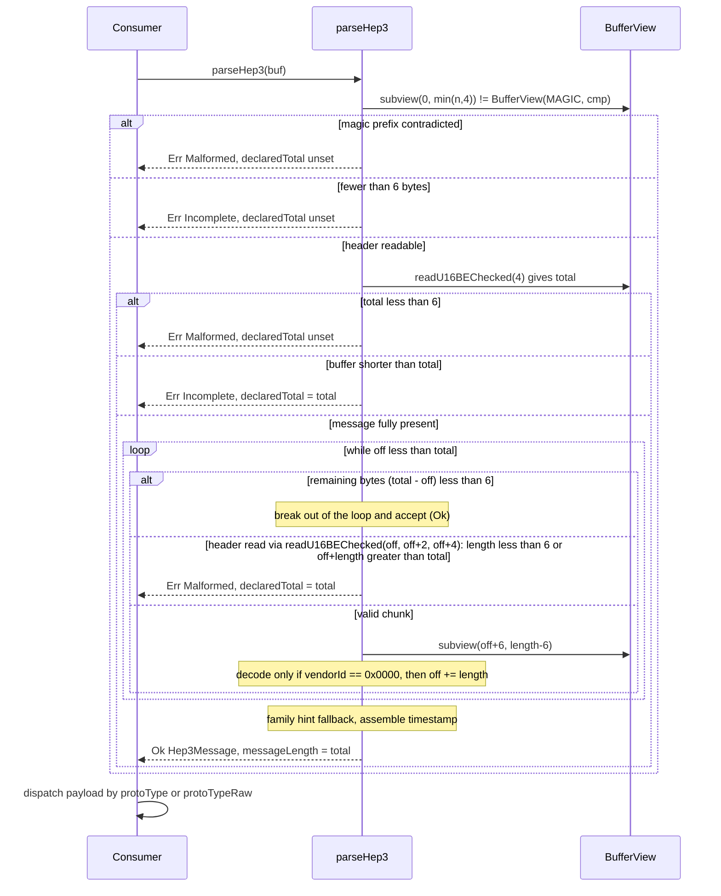

# Iora HEP3 Parser — Architecture & Programmer's Guide

[Back to index](../../README.md)

| | |
|---|---|
| **Version** | 1.2 |
| **Date** | 2026-09-24 |
| **Status** | IMPLEMENTED |
| **Header** | `include/iora/parsers/hep3.hpp` |
| **Namespace** | `iora::parsers` (constants and helpers in `iora::parsers::detail`) |
| **Dependencies** | Standard library (`<algorithm>`, `<array>`, `<cstdint>`, `<optional>`) plus two intra-Iora headers, `iora/core/buffer_view.hpp` (checked big-endian readers, `subview`; see [Buffer primitives](../core/buffer_primitives.md)) and `iora/core/result.hpp` (`Result<T, E>`; see [Result](../core/result.md)) -- no third-party dependencies, no zlib |

This guide covers `parseHep3`, Iora's header-only parser for the **HEP3** (Homer Encapsulation Protocol version 3, also called EEP) capture-transport envelope used by the sipcapture/HOMER ecosystem. Protocol statements in this guide were checked against the *HEP3 Network Protocol Specification, rev. 37 (2025-06-25)*, `docs/HEP3_Network_Protocol_Specification_REV_37.pdf` in the `sipcapture/HEP` GitHub repository. HEP3 is a de-facto industry protocol, not an IETF RFC. Every specification-derived claim in this guide (header and chunk framing, p. 1; payload types and generic chunk types, pp. 2-3; capture protocol types for `0x000b`, pp. 3-4; vendor ids, p. 5; the 113-octet worked example, pp. 5-6) rests on the rev. 37 text; a later revision may add or relabel entries.

---

## Revision History

| Version | Date | Changes |
|---------|------|---------|
| 1.0 | 2026-09-24 | Initial guide for the HEP3 envelope parser (`parseHep3`, `Hep3Message`, `Hep3ParseError`), added in iora commit `176bbb9`. |
| 1.1 | 2026-09-24 | Doc-review round 1 fixes: corrected the compressed-payload design rationale (a zero-dependency gzip decoder, `iora::util::Gzip::decompress`, exists; zlib/raw DEFLATE have no public decoder) and rewrote Example 4 to inflate a gzip-member payload; corrected the "every field is optional" claim; corrected the capture-agent-id legacy-encoding description (`htons` into a u32, value shifted left 16 bits); corrected the sender list (Kamailio `siptrace` defaults to HEPv1, `sipcapture` is a receiver; FreeSWITCH defaults to HEP3); corrected the iteration bound to 10921 chunks plus one terminating iteration; added the missing `remaining < 6` branch to the chunk-loop diagram; fixed the example compile command and missing includes; added links to the Result, Buffer primitives and Gzip guides; expanded section 10 with HEPv1/v2, `EEP1`, trailing-byte leniency versus Kamailio, unrecognized `AF_INET6` values, the unreachable auth key, UDP length mismatch, header-comment mismatches, and test-suite gaps. |
| 1.2 | 2026-09-24 | Doc-review round 2 fixes: corrected the non-optional field count (six, not four); corrected the Kamailio `siptrace` sender conditions (`hep_mode_on` or `trace_mode` HEP bit, plus `hep_version=3`) and added OpenSIPS `proto_hep` as a sender (HEP3 default, HEPv1/v2 over UDP) and as a `0x0010` emitter (`compressed_payload`); qualified first-wins as same-type (payload precedence is the cross-type exception); reworded the first-wins rationale; kept the gzip-decodability text only in section 10; in section 10, corrected the `EEP1` description (Kamailio accepts it on the `nonsip_hook` / `SREV_RCV_NOSIP` path and in `hep_version()`, not on the default UDP path) and removed a pipe-containing code span that broke the table, versioned the trailing-byte comparison (Kamailio 6.0+, not 5.8; OpenSIPS 3.6+), added the generic type-`0x0000` row, added heplify and FreeSWITCH to the capture-id list and restricted the `v >> 16` heuristic to allowlisted legacy sources, corrected the rtpengine/heplify layout facts from agent source and added the missing test-gap items (wrong-length `0x0001`, payload precedence order, zero-length `0x0011`, `0x000a` without `0x0009`, family bytes, address duplicates, the non-discriminating auth-key test, vendor collisions, type `0x0000`, the capture-id quirk vector), corrected the `bytesConsumed` comment references, cited the tracking coding_trackers entries, and added rev. 37 page references. |

---

## 1. Executive Summary

### Problem

Capture agents in a VoIP deployment -- heplify, captagent, the Kamailio `siptrace` module, OpenSIPS `proto_hep`, FreeSWITCH, rtpengine and others -- do not ship raw packet captures to a monitoring collector. They ship **already-framed application units** (a SIP message, an RTCP report, a quality-metrics JSON document) wrapped in a HEP3 envelope that carries the capture metadata: the original IP 5-tuple, a capture timestamp, the capture agent's node id, a payload-type discriminator, and an optional correlation id. A collector that wants to ingest this traffic must parse the envelope first. Three sender caveats matter for a HEP3-only parser. Kamailio `siptrace` emits HEP only when HEP mirroring is enabled -- `modparam("siptrace", "hep_mode_on", 1)` for `sip_trace()` / flag-based tracing, or bit 1 of `trace_mode` for automatic mirroring -- and that HEP is HEP3 only with `modparam("siptrace", "hep_version", 3)`; the default is `hep_version=1` (`siptrace.c`: `int hep_mode_on = 0;`, `int hep_version = 1;`). OpenSIPS `proto_hep` sends HEP3 by default (a `hep_id` without `version=` is version 3, `proto_hep/hep.c`) and sends HEPv1/v2 only over UDP when `version=1` or `version=2` is given (TCP/TLS fall back to UDP for those versions). FreeSWITCH's sofia `capture-server` URL defaults to HEP3 in current `freeswitch/sofia-sip` (`tport_logging.c` sets `mr_prot_ver = 3` unless `;hep=1` or `;hep=2` is given). Kamailio's `sipcapture` module is the collector (receiver) side, not a sender. HEPv1/HEPv2 datagrams are not decoded by this parser (section 10).

Before `hep3.hpp`, no Iora library contained a HEP3 parser. A consumer (the passive-monitoring work in `iora_voipmon`, whose competitive-platform brainstorm named a HEP3 envelope parser as a foundation item) had two options: pull in an external HEP library, or hand-roll pointer arithmetic with `ntohs`/`ntohl` over **untrusted, unauthenticated, lossy** UDP/TCP input. The second option is exactly the code shape that produces unsigned-underflow out-of-bounds reads (a chunk length smaller than its own header), cross-message contamination on TCP (walking into the next message's bytes), and unaligned-read undefined behavior.

### Solution

- **`iora::parsers::parseHep3(iora::core::BufferView)`** -- one `noexcept` function that validates the HEP3 general header, walks the TLV chunk list, and returns an `iora::core::Result<Hep3Message, Hep3ParseError>` (`hep3.hpp:206`). A raw-pointer overload forwards to it (`hep3.hpp:461`).
- **`Hep3Message`** -- the decoded envelope (`hep3.hpp:99-115`). The address, port, protocol, timestamp, capture-agent-id and correlation-id fields are `std::optional` and stay unset when their chunk is absent or malformed, so "zero" is distinguishable from "not present". Six fields are not optional: `family` is a plain `Hep3IpFamily` whose `Unknown` value is the absence sentinel; `protoTypeRaw` / `protoType` default to `0` / `OTHER`; `payload` is a plain `BufferView` whose presence is reported by the separate `payloadStatus` enum; and `messageLength` is always set on `Ok`.
- **`Hep3ParseError`** -- a two-way discriminator (`Incomplete` vs `Malformed`) plus an optional `declaredTotal` that lets a TCP consumer size its next read or skip a bad frame and resynchronize (`hep3.hpp:131-135`).
- **Classify, do not parse.** The captured payload is classified by the proto-type chunk (`Hep3ProtoType`, raw byte kept in `protoTypeRaw`) and returned as a non-owning `BufferView`; the consumer hands it to the SIP parser, the RTCP parser, or a JSON parser.
- **Checked reads only.** Every multi-byte field is read through `BufferView::readU16BEChecked` / `readU32BEChecked` / `readU8Checked`; there is no raw pointer arithmetic and no `ntoh*`.

### Technical Impact

- **One linear pass**, O(number of chunks): at most `(65535 - 6) / 6` = 10921 accepted chunks in the largest possible message, plus at most one terminating iteration (the one that sees a `< 6`-byte remainder and stops, or that rejects a lying chunk); no recursion, no allocation.
- **Zero-copy:** `payload` and `correlationId` are views into the caller's buffer.
- **Transport-agnostic framing:** status is decided from buffer contents alone; `messageLength` equals the bytes consumed, so a HEP-over-TCP consumer re-frames a stream of concatenated messages by advancing that many bytes.
- **Hardened:** every structural violation becomes a typed `Malformed` error; no input can cause an out-of-bounds read, an exception, or a non-terminating loop.

---

## 2. System Architecture

### Component Relationships

```
iora::parsers::parseHep3(BufferView buf) noexcept          entry point (free function)
 |   parseHep3(const std::uint8_t*, std::size_t) noexcept  forwards to the above
 |
 |-- reads through --> iora::core::BufferView               (borrowed; caller owns bytes)
 |                       subview(), operator!=, readU8Checked(),
 |                       readU16BEChecked(), readU32BEChecked()
 |
 |-- uses ----------> iora::parsers::detail
 |                       HEP3_GENERAL_HEADER, HEP3_CHUNK_HEADER, HEP3_VENDOR_GENERIC,
 |                       CHUNK_* type ids, USEC_PER_SEC,
 |                       classifyProtoType(), makeErr()
 |
 |-- returns -------> Hep3Result = iora::core::Result<Hep3Message, Hep3ParseError>
                        |
                        |-- Ok arm: Hep3Message (value type, owns nothing it points to)
                        |     family            : Hep3IpFamily
                        |     protocol          : std::optional<std::uint8_t>
                        |     srcAddr / dstAddr : std::optional<Hep3Address>
                        |                           family + std::array<std::uint8_t, 16> bytes
                        |     srcPort / dstPort : std::optional<std::uint16_t>
                        |     timestampMicros   : std::optional<std::uint64_t>
                        |     protoTypeRaw      : std::uint8_t   (0 when absent)
                        |     protoType         : Hep3ProtoType  (OTHER when absent)
                        |     payloadStatus     : Hep3PayloadStatus
                        |     payload           : BufferView  --> view into caller's buffer
                        |     correlationId     : std::optional<BufferView> --> view into caller's buffer
                        |     captureAgentId    : std::optional<std::uint32_t>
                        |     messageLength     : std::uint16_t  (== declared total)
                        |
                        |-- Err arm: Hep3ParseError
                              code          : Hep3ErrorCode {Incomplete, Malformed}
                              declaredTotal : std::optional<std::uint16_t>
```

### Wire format (as parsed)

```
offset  0      4        6                                              total
        +------+--------+----------------------------------------------+
        | HEP3 | total  | chunk | chunk | ... | chunk | (0-5 stray)    |   next message ...
        +------+--------+----------------------------------------------+
                 u16 BE,
                 includes the 6-byte header

chunk:  +----------+--------+--------+----------------------+
        | vendorId | typeId | length | payload (length - 6) |
        +----------+--------+--------+----------------------+
          u16 BE     u16 BE   u16 BE, includes the 6-byte chunk header
```

Both length rules come from the specification: the total length "specifies the total packet length including the HEP3 or EEP3 ID, and the length field itself and the payload" with a range of 6 to 65535, and the chunk length "specifies the total length of the chunk, including the vendor ID, type ID, length and payload fields".

### Data Flow: parsing one message



### Threading Model

| Thread | Responsibility |
|---|---|
| Any caller thread | Calls `parseHep3` directly. The function has no static mutable state, takes no locks, and spawns nothing; it is fully reentrant. |

There are no internal threads. The only shared object is the caller's byte buffer, which `parseHep3` reads and never writes (see section 6).

---

## 3. Component Deep Dive

### 3.1 `parseHep3` -- phase 1: general header, content-only status

A HEP3 parser cannot know whether its input is an atomic UDP datagram or a slice of a TCP stream, so the status decision uses the buffer contents alone and leaves the transport interpretation to the consumer (`hep3.hpp:212-238`):

```cpp
static constexpr std::uint8_t MAGIC[4] = {'H', 'E', 'P', '3'};
const std::size_t n = buf.size();
const std::size_t cmp = n < 4 ? n : 4;
if (buf.subview(0, cmp) != iora::core::BufferView(MAGIC, cmp))
{
  return makeErr(Hep3ErrorCode::Malformed, std::nullopt);
}
if (n < HEP3_GENERAL_HEADER)
{
  return makeErr(Hep3ErrorCode::Incomplete, std::nullopt);
}
const std::uint16_t total = buf.readU16BEChecked(4).value(); // safe: n >= 6 checked above
if (total < HEP3_GENERAL_HEADER)
{
  return makeErr(Hep3ErrorCode::Malformed, std::nullopt);
}
if (n < total)
{
  return makeErr(Hep3ErrorCode::Incomplete, total);
}
```

The magic comparison uses only the bytes that are present: `BufferView::operator==` compares sizes and then `memcmp`s, so a 1-3 byte buffer that is a prefix of `"HEP3"` compares equal and falls through to the `n < 6` `Incomplete` branch, while any diverging byte is an immediate `Malformed`. An empty buffer compares equal (both views empty) and is `Incomplete`. This rejects HEP1/HEP2 fixed-struct datagrams (they do not start with `HEP3`) and also rejects the alternate `EEP3` identifier (see section 10).

| Input | Result | `declaredTotal` |
|---|---|---|
| First `min(n,4)` bytes diverge from `"HEP3"` | `Malformed` | unset |
| Consistent prefix, `n < 6` (including `n == 0`) | `Incomplete` | unset |
| Magic OK, `total < 6` | `Malformed` | unset |
| Magic OK, `n < total` | `Incomplete` | `total` |
| Magic OK, `n >= total` | proceed to phase 2 | -- |

The `.value()` call on the checked read is safe because `n >= 6` was just established; the function is `noexcept`, so a `std::bad_optional_access` here would terminate -- the invariant comment documents why it cannot happen.

### 3.2 `parseHep3` -- phase 2: the chunk walk

The walk is bounded to the **message window** `[6, total)`, not to the end of the buffer (`hep3.hpp:240-437`). A TCP receive buffer may already hold the next message after `total`; bounding by `total` keeps the next message's bytes from being interpreted as chunks of this one.

```cpp
std::size_t off = HEP3_GENERAL_HEADER;
while (off < total)
{
  if (total - off < HEP3_CHUNK_HEADER)
  {
    break;
  }
  const std::uint16_t vendorId = buf.readU16BEChecked(off).value();
  const std::uint16_t typeId = buf.readU16BEChecked(off + 2).value();
  const std::uint16_t clen = buf.readU16BEChecked(off + 4).value();
  if (clen < HEP3_CHUNK_HEADER)
  {
    return makeErr(Hep3ErrorCode::Malformed, total);
  }
  if (off + clen > total)
  {
    return makeErr(Hep3ErrorCode::Malformed, total);
  }
  const std::size_t payOff = off + HEP3_CHUNK_HEADER;
  const std::size_t payLen = static_cast<std::size_t>(clen) - HEP3_CHUNK_HEADER;
  const iora::core::BufferView chunk = buf.subview(payOff, payLen);
  // ... decode when vendorId == HEP3_VENDOR_GENERIC ...
  off += clen;
}
```

Hardening properties, each enforced by the code above:

| Hazard | Guard | Outcome |
|---|---|---|
| Chunk `length < 6` would underflow `length - 6` into a huge `payLen` | `clen < HEP3_CHUNK_HEADER` checked **before** the subtraction | `Malformed`, `declaredTotal = total` |
| Chunk claims more bytes than the message window holds | `off + clen > total` (computed in `std::size_t`, cannot overflow) | `Malformed`, `declaredTotal = total` |
| Chunk-header reads past the buffer | `total - off >= 6` and `n >= total` imply `off + 6 <= n` | reads always in bounds |
| Infinite loop on a zero-length chunk | every accepted chunk has `clen >= 6`, so `off` strictly increases | at most 10921 accepted chunks plus one terminating iteration |
| 1-5 stray bytes after the last chunk, inside `total` | `total - off < HEP3_CHUNK_HEADER` | walk stops; message is **accepted** (`Ok`) with what was decoded |
| Next message's bytes in the same buffer | loop bound is `total`, not `n` | never read |

A `Malformed` produced here carries `declaredTotal = total` because the outer frame was valid: a stream consumer can skip exactly `total` bytes and continue with the next message rather than dropping the connection.

**The vendor gate.** Chunks are decoded only when `vendorId == 0x0000` (generic chunk types). The specification assigns vendor ids to FreeSWITCH (`0x0001`), Kamailio/SER (`0x0002`), OpenSIPS (`0x0003`), Asterisk (`0x0004`), Homer Project (`0x0005`), SipXecs (`0x0006`), Yeti Switch (`0x0007`) and Genesys (`0x0008`), and leaves chunk-type definition within a vendor id to that vendor. A vendor type id can therefore numerically collide with a generic one (a vendor chunk with type id `0x0007` is not a source port), so every non-zero vendor id is skipped by length without inspection.

### 3.3 Generic chunk decode rules

Within the vendor gate, each generic chunk is decoded by a `switch (typeId)` (`hep3.hpp:286-433`). Three rules apply to every decoded field:

1. **First wins** (same-type duplicates; the one cross-type exception is payload precedence below). A duplicate chunk never overwrites an earlier decoded value.
2. **Exact length or ignore.** A known chunk whose payload length differs from the specification's type size leaves the field unset and the walk continues -- a bad known chunk is not a structural error.
3. **Only structure is fatal.** `Malformed` is reserved for the framing violations in section 3.2.

| Type id | Spec payload type | Decoded into | Accepted length | Notes |
|---|---|---|---|---|
| `0x0001` | uint8, IP protocol family | internal `familyHint` | 1 | `2` -> IPv4; `10`, `23`, `28`, `30` -> IPv6 (AF_INET6 on Linux, Windows, FreeBSD, macOS); any other value ignored -- including `24` (AF_INET6 on OpenBSD/NetBSD) and `26` (Solaris/illumos). Used only as a fallback (section 3.4). |
| `0x0002` | uint8, IP protocol ID | `protocol` | 1 | e.g. 17 UDP, 6 TCP; not interpreted. |
| `0x0003` / `0x0004` | inet4-addr, IPv4 src / dst | `srcAddr` / `dstAddr` | 4 | Sets `family = IPv4` if not yet set. |
| `0x0005` / `0x0006` | inet6-addr, IPv6 src / dst | `srcAddr` / `dstAddr` | 16 | Sets `family = IPv6` if not yet set. |
| `0x0007` / `0x0008` | uint16, src / dst port | `srcPort` / `dstPort` | 2 | |
| `0x0009` | uint32, seconds since epoch | internal `tsSec` | 4 | |
| `0x000a` | uint32, microseconds offset | internal `tsUsec` | 4 | |
| `0x000b` | uint8, protocol type | `protoTypeRaw`, `protoType` | 1 | First-wins via a `sawProtoType` flag. |
| `0x000c` | uint32, capture agent ID | `captureAgentId` | 4 | |
| `0x000e` | octet-string, authenticate key | nothing | any | A secret: never decoded, copied, or exposed in any field. |
| `0x000f` | octet-string, captured payload | `payload`, `payloadStatus = Uncompressed` | any (0 allowed) | See payload precedence below. |
| `0x0010` | octet-string, compressed payload | `payload`, `payloadStatus = CompressedUnsupported` | any | Not inflated. |
| `0x0011` | octet-string, internal correlation id | `correlationId` | any (0 allowed) | A present-but-empty chunk yields an engaged optional holding an empty view. |
| anything else | -- | nothing | any | Skipped by length (keep-alive `0x000d`, VLAN `0x0012`, string capture-agent name `0x0013`, MAC/TOS/MOS/tag chunks `0x0014`-`0x0029`, unknown ids). |

**Address chunks and family precedence** (`hep3.hpp:295-334`). The four address chunks share one case. A wrong-length address chunk is ignored and provides no family evidence. The **first** well-formed address chunk establishes `msg.family`; a later address chunk of the *other* family is ignored entirely (its slot stays unset). Duplicates of the same slot are first-wins. The bytes are copied into `Hep3Address::bytes`, whose 16-byte array is large enough for either family; for IPv4 only `bytes[0..3]` are meaningful and the remainder is zero.

```cpp
if (payLen != addrLen)
{
  break;
}
if (msg.family != Hep3IpFamily::Unknown && msg.family != fam)
{
  break;
}
std::optional<Hep3Address>& slot = isSrc ? msg.srcAddr : msg.dstAddr;
if (slot)
{
  break; // first-wins for duplicates
}
```

**Payload precedence** (`hep3.hpp:381-399`). An uncompressed `0x000f` chunk wins over any compressed `0x0010` chunk regardless of order, and over a later duplicate `0x000f`. A `0x0010` chunk is taken only if no payload of either kind has been seen.

| Chunks present (in order) | `payloadStatus` | `payload` |
|---|---|---|
| none | `None` | empty view |
| `0x000f` | `Uncompressed` | the `0x000f` bytes |
| `0x0010` | `CompressedUnsupported` | the raw compressed bytes |
| `0x0010` then `0x000f` | `Uncompressed` | the `0x000f` bytes (overwrites) |
| `0x000f` then `0x0010` | `Uncompressed` | the `0x000f` bytes |
| `0x000f`, `0x000f` | `Uncompressed` | the first `0x000f` |

A compressed or payload-less message is still `Ok`: the envelope (addresses, ports, correlation id, capture-agent id) survives so that correlation and call binding downstream still work.

### 3.4 `parseHep3` -- phase 3: assembly

After the walk (`hep3.hpp:439-457`):

- **Family fallback.** If no well-formed address chunk resolved `msg.family`, the `0x0001` hint (if recognized) is applied. This covers units such as metrics reports that carry ports but no addresses. When an address chunk is present, it always wins -- a conflicting family byte is ignored, not reported.
- **Timestamp.** If the seconds chunk was decoded, `timestampMicros = sec * 1000000 + usec`, where `usec` is the microseconds chunk's value if present **and** `< 1000000`, otherwise `0`. The product cannot overflow: `UINT32_MAX * 10^6 + 999999` is below `2^52`. A microseconds chunk without a seconds chunk leaves `timestampMicros` unset.
- **Length.** `messageLength` was set to `total` before the walk; on success it equals the number of bytes that belong to this message.

### 3.5 `classifyProtoType` and the proto-type values

`detail::classifyProtoType` (`hep3.hpp:168-183`) maps the raw `0x000b` byte to the convenience enum:

| Raw | Enum | Specification rev. 37 label |
|---|---|---|
| `0x01` | `SIP` | SIP |
| `0x03` | `SDP` | SDP |
| `0x04` | `RTP` | RTP |
| `0x05` | `RTCP` | RTCP JSON |
| any other | `OTHER` | e.g. `0x02` XMPP, `0x06` MGCP, `0x22` MOS full report, `0x32` SIP JSON, `0x35` DNS JSON, `0x3a` RTCP PION, `0x3c` CDR |

`protoTypeRaw` is the authoritative value. Note that rev. 37 labels `0x05` "RTCP JSON"; the parser maps it to `RTCP` without asserting an encoding, and its header comment describes JSON-versus-binary as a consumer content-sniff. A consumer should inspect the first payload byte (`{` for JSON, version bits `10` for binary RFC 3550 RTCP) rather than assume either form. Proto-types the enum does not name (for example `0x32` SIP JSON, `0x3a` RTCP PION) are reachable only through `protoTypeRaw`.

### 3.6 Value semantics and lifetime

`Hep3Message`, `Hep3Address`, and `Hep3ParseError` are plain aggregates with default member initializers; they are freely copyable and movable. Copying a `Hep3Message` copies the **views**, not the bytes: `payload` and `correlationId` in every copy still point into the buffer passed to `parseHep3`. That buffer must outlive, and must not be modified during, any use of those views. Every other field is an owned value.

---

## 4. Usage Guide

All examples are complete programs that were compiled with `g++ -std=c++17 -Wall -Wextra -Werror -I<iora>/include ex.cpp` and run (`hep3.hpp` needs only the standard library plus the header-only `buffer_view.hpp` and `result.hpp`; Example 4 additionally includes the header-only `gzip.hpp`); the output shown is the actual output. Each builds its HEP3 bytes by hand because the parser has no serializer.

```cpp
#include "iora/parsers/hep3.hpp"
```

### Example 1: Decode a SIP capture datagram

This builds the packet from the specification's worked example (IPv4 212.202.0.1:12010 to 82.116.0.211:5060, capture agent 228, timestamp 1313440459.120000) with a longer SIP payload, and treats the input as an atomic UDP datagram.

```cpp
#include "iora/parsers/hep3.hpp"

#include <cstdint>
#include <cstdio>
#include <string>
#include <string_view>
#include <vector>

namespace
{

void putU16(std::vector<std::uint8_t>& out, std::uint16_t v)
{
  out.push_back(static_cast<std::uint8_t>(v >> 8));
  out.push_back(static_cast<std::uint8_t>(v & 0xff));
}

void putChunk(std::vector<std::uint8_t>& out, std::uint16_t vendor, std::uint16_t type,
              const std::vector<std::uint8_t>& payload)
{
  putU16(out, vendor);
  putU16(out, type);
  putU16(out, static_cast<std::uint16_t>(6 + payload.size()));
  out.insert(out.end(), payload.begin(), payload.end());
}

std::vector<std::uint8_t> buildSipPacket()
{
  std::vector<std::uint8_t> body;
  putChunk(body, 0, 0x0001, {2});                        // IP family AF_INET
  putChunk(body, 0, 0x0002, {17});                       // IPPROTO_UDP
  putChunk(body, 0, 0x0003, {212, 202, 0, 1});           // IPv4 src
  putChunk(body, 0, 0x0004, {82, 116, 0, 211});          // IPv4 dst
  putChunk(body, 0, 0x0007, {0x2e, 0xea});               // src port 12010
  putChunk(body, 0, 0x0008, {0x13, 0xc4});               // dst port 5060
  putChunk(body, 0, 0x0009, {0x4e, 0x49, 0x82, 0xcb});   // seconds 1313440459
  putChunk(body, 0, 0x000a, {0x00, 0x01, 0xd4, 0xc0});   // usec 120000
  putChunk(body, 0, 0x000b, {0x01});                     // proto-type SIP
  putChunk(body, 0, 0x000c, {0x00, 0x00, 0x00, 0xe4});   // capture agent 228
  const std::string sip = "INVITE sip:bob@example.com SIP/2.0\r\n\r\n";
  putChunk(body, 0, 0x000f, std::vector<std::uint8_t>(sip.begin(), sip.end()));

  std::vector<std::uint8_t> pkt = {'H', 'E', 'P', '3'};
  putU16(pkt, static_cast<std::uint16_t>(6 + body.size()));
  pkt.insert(pkt.end(), body.begin(), body.end());
  return pkt;
}

} // namespace

int main()
{
  const std::vector<std::uint8_t> datagram = buildSipPacket();

  const iora::parsers::Hep3Result r = iora::parsers::parseHep3(datagram.data(), datagram.size());
  if (!r)
  {
    std::printf("drop datagram (code=%d)\n", static_cast<int>(r.error().code));
    return 1;
  }

  const iora::parsers::Hep3Message& m = r.value();
  if (m.srcAddr && m.dstAddr && m.srcPort && m.dstPort &&
      m.family == iora::parsers::Hep3IpFamily::IPv4)
  {
    std::printf("%u.%u.%u.%u:%u -> %u.%u.%u.%u:%u\n", m.srcAddr->bytes[0],
                m.srcAddr->bytes[1], m.srcAddr->bytes[2], m.srcAddr->bytes[3],
                static_cast<unsigned>(*m.srcPort), m.dstAddr->bytes[0], m.dstAddr->bytes[1],
                m.dstAddr->bytes[2], m.dstAddr->bytes[3], static_cast<unsigned>(*m.dstPort));
  }
  if (m.timestampMicros)
  {
    std::printf("ts=%llu us\n", static_cast<unsigned long long>(*m.timestampMicros));
  }
  if (m.captureAgentId)
  {
    std::printf("agent=%u\n", static_cast<unsigned>(*m.captureAgentId));
  }
  if (m.protoType == iora::parsers::Hep3ProtoType::SIP &&
      m.payloadStatus == iora::parsers::Hep3PayloadStatus::Uncompressed)
  {
    const std::string_view sip = m.payload.asStringView();
    std::printf("SIP (%zu bytes): %.*s\n", sip.size(), 32, sip.data());
  }
  std::printf("messageLength=%u (datagram %zu)\n", static_cast<unsigned>(m.messageLength),
              datagram.size());
  return 0;
}
```

Output:

```
212.202.0.1:12010 -> 82.116.0.211:5060
ts=1313440459120000 us
agent=228
SIP (38 bytes): INVITE sip:bob@example.com SIP/2
messageLength=137 (datagram 137)
```

On UDP both `Incomplete` and `Malformed` mean "drop": a datagram is never delivered in pieces. On `Ok`, a UDP consumer should also compare `messageLength` with the datagram size and treat a mismatch as suspicious (log or count it): the parser ignores any bytes after `total`, which on a stream is the next message but on a datagram is garbage or a sender bug.

### Example 2: Re-frame a HEP-over-TCP stream

A TCP consumer accumulates bytes and repeatedly parses from the front. `Ok` advances by `messageLength`; `Incomplete` keeps the tail and waits; a `Malformed` with `declaredTotal` skips that frame; a `Malformed` without one means the stream is no longer framed and the connection is closed.

```cpp
#include "iora/parsers/hep3.hpp"

#include <cstddef>
#include <cstdint>
#include <cstdio>
#include <string>
#include <vector>

namespace
{

void putU16(std::vector<std::uint8_t>& out, std::uint16_t v)
{
  out.push_back(static_cast<std::uint8_t>(v >> 8));
  out.push_back(static_cast<std::uint8_t>(v & 0xff));
}

std::vector<std::uint8_t> buildPayloadOnly(const std::string& text)
{
  std::vector<std::uint8_t> pkt = {'H', 'E', 'P', '3'};
  putU16(pkt, static_cast<std::uint16_t>(6 + 6 + 6 + 1 + text.size()));
  putU16(pkt, 0x0000);
  putU16(pkt, 0x000b);
  putU16(pkt, 7);
  pkt.push_back(0x01);
  putU16(pkt, 0x0000);
  putU16(pkt, 0x000f);
  putU16(pkt, static_cast<std::uint16_t>(6 + text.size()));
  pkt.insert(pkt.end(), text.begin(), text.end());
  return pkt;
}

class HepStreamReassembler
{
public:
  void onBytes(const std::uint8_t* data, std::size_t len)
  {
    _buffer.insert(_buffer.end(), data, data + len);
    std::size_t consumed = 0;
    while (consumed < _buffer.size())
    {
      const iora::core::BufferView view(_buffer.data() + consumed, _buffer.size() - consumed);
      const iora::parsers::Hep3Result r = iora::parsers::parseHep3(view);
      if (r.isOk())
      {
        const iora::parsers::Hep3Message& m = r.value();
        const std::string owned(m.payload.asStringView());
        std::printf("message: %u bytes, payload='%s'\n",
                    static_cast<unsigned>(m.messageLength), owned.c_str());
        consumed += m.messageLength;
        continue;
      }
      const iora::parsers::Hep3ParseError& e = r.error();
      if (e.code == iora::parsers::Hep3ErrorCode::Incomplete)
      {
        if (e.declaredTotal)
        {
          std::printf("incomplete: have %zu of %u bytes\n", view.size(),
                      static_cast<unsigned>(*e.declaredTotal));
        }
        else
        {
          std::printf("incomplete: header not yet readable (%zu bytes)\n", view.size());
        }
        break;
      }
      if (e.declaredTotal)
      {
        std::printf("malformed: skipping %u bytes to resync\n",
                    static_cast<unsigned>(*e.declaredTotal));
        consumed += *e.declaredTotal;
        continue;
      }
      std::printf("malformed framing: closing connection\n");
      _buffer.clear();
      return;
    }
    _buffer.erase(_buffer.begin(), _buffer.begin() + static_cast<std::ptrdiff_t>(consumed));
  }

private:
  std::vector<std::uint8_t> _buffer;
};

} // namespace

int main()
{
  const std::vector<std::uint8_t> a = buildPayloadOnly("OPTIONS");
  const std::vector<std::uint8_t> b = buildPayloadOnly("BYE");

  std::vector<std::uint8_t> wire(a);
  wire.insert(wire.end(), b.begin(), b.end());

  HepStreamReassembler reassembler;
  reassembler.onBytes(wire.data(), a.size() + 4);
  reassembler.onBytes(wire.data() + a.size() + 4, 3);
  reassembler.onBytes(wire.data() + a.size() + 7, wire.size() - a.size() - 7);
  return 0;
}
```

Output:

```
message: 26 bytes, payload='OPTIONS'
incomplete: header not yet readable (4 bytes)
incomplete: have 7 of 22 bytes
message: 22 bytes, payload='BYE'
```

The payload is copied into an owning `std::string` **before** the buffer is erased: the view would dangle afterwards.

### Example 3: How hostile input is classified

This runs a set of adversarial and edge-case inputs through the parser and prints the outcome of each. It shows the exact line the parser draws between a fatal structural error and a tolerated bad field.

```cpp
#include "iora/parsers/hep3.hpp"

#include <cstdint>
#include <cstdio>
#include <string>
#include <vector>

namespace
{

void putU16(std::vector<std::uint8_t>& out, std::uint16_t v)
{
  out.push_back(static_cast<std::uint8_t>(v >> 8));
  out.push_back(static_cast<std::uint8_t>(v & 0xff));
}

std::vector<std::uint8_t> frame(const std::vector<std::uint8_t>& body)
{
  std::vector<std::uint8_t> pkt = {'H', 'E', 'P', '3'};
  putU16(pkt, static_cast<std::uint16_t>(6 + body.size()));
  pkt.insert(pkt.end(), body.begin(), body.end());
  return pkt;
}

void describe(const char* label, const std::vector<std::uint8_t>& bytes)
{
  const iora::parsers::Hep3Result r = iora::parsers::parseHep3(bytes.data(), bytes.size());
  if (r.isOk())
  {
    const iora::parsers::Hep3Message& m = r.value();
    std::printf("%-28s Ok  srcPort=%s protoTypeRaw=%u\n", label,
                m.srcPort ? std::to_string(*m.srcPort).c_str() : "unset",
                static_cast<unsigned>(m.protoTypeRaw));
    return;
  }
  const iora::parsers::Hep3ParseError& e = r.error();
  std::printf("%-28s %s declaredTotal=%s\n", label,
              e.code == iora::parsers::Hep3ErrorCode::Incomplete ? "Incomplete" : "Malformed",
              e.declaredTotal ? std::to_string(*e.declaredTotal).c_str() : "none");
}

} // namespace

int main()
{
  describe("wrong magic", {'H', 'E', 'P', '2', 0x00, 0x06});
  describe("EEP3 magic", {'E', 'E', 'P', '3', 0x00, 0x06});
  describe("consistent prefix 'HE'", {'H', 'E'});
  describe("total < 6", {'H', 'E', 'P', '3', 0x00, 0x05});

  std::vector<std::uint8_t> lying = {0x00, 0x00, 0x00, 0x07, 0x00, 0x03};
  describe("chunk length < 6", frame(lying));

  std::vector<std::uint8_t> overrun = {0x00, 0x00, 0x00, 0x07, 0x00, 0x40, 0x13, 0xc4};
  describe("chunk overruns total", frame(overrun));

  std::vector<std::uint8_t> vendor;
  putU16(vendor, 0x0002);
  putU16(vendor, 0x0007);
  putU16(vendor, 8);
  putU16(vendor, 9999);
  describe("vendor chunk, typeId 0x0007", frame(vendor));

  std::vector<std::uint8_t> badLen = {0x00, 0x00, 0x00, 0x07, 0x00, 0x09, 0x00, 0x13, 0xc4};
  describe("3-byte port chunk", frame(badLen));

  std::vector<std::uint8_t> trailing = {0x00, 0x00, 0x00, 0x07, 0x00, 0x08, 0x13, 0xc4,
                                        0xde, 0xad, 0xbe};
  describe("3-byte trailing remainder", frame(trailing));
  return 0;
}
```

Output:

```
wrong magic                  Malformed declaredTotal=none
EEP3 magic                   Malformed declaredTotal=none
consistent prefix 'HE'       Incomplete declaredTotal=none
total < 6                    Malformed declaredTotal=none
chunk length < 6             Malformed declaredTotal=12
chunk overruns total         Malformed declaredTotal=14
vendor chunk, typeId 0x0007  Ok  srcPort=unset protoTypeRaw=0
3-byte port chunk            Ok  srcPort=unset protoTypeRaw=0
3-byte trailing remainder    Ok  srcPort=5060 protoTypeRaw=0
```

Note the last three rows: a Kamailio vendor chunk whose type id collides with the generic source-port id does not set `srcPort`; a known chunk with the wrong length is silently ignored; and three stray bytes after the last chunk are accepted. `protoTypeRaw=0` in all three means "no proto-type chunk" -- the field is not optional (section 10).

### Example 4: Compressed RTCP report with a correlation id and no addresses

A metrics-style unit: IPv6 family byte but no address chunks, ports, proto-type `0x05`, a correlation id (typically the SIP Call-ID, used to bind RTCP to a call), an auth-key chunk, and a compressed `0x0010` payload. The parser never inflates; the consumer does. The specification labels `0x0010` "gzip/inflate" without fixing the container, and senders differ (captagent emits zlib, RFC 1950, whose first byte is typically `0x78`; OpenSIPS `proto_hep` emits `0x0010` when its `compressed_payload` modparam is set, with a container that depends on the loaded `compression` module). A payload that is a gzip member (RFC 1952, magic `1f 8b`) can be decoded with the zero-dependency [`iora::util::Gzip::decompress`](../util/gzip.md)`(payload.asStringView(), cap)`, which requires an explicit output cap because the input is untrusted. A zlib-wrapped or raw DEFLATE payload cannot be decoded with any public Iora API today: `Gzip`'s DEFLATE core is private (`iora::util::detail`) and `decompress` accepts only the gzip container. The program below runs one message of each kind.

```cpp
#include "iora/parsers/hep3.hpp"
#include "iora/util/gzip.hpp"

#include <cstddef>
#include <cstdint>
#include <cstdio>
#include <string>
#include <string_view>
#include <vector>

namespace
{

constexpr std::size_t MAX_INFLATED_BYTES = 64 * 1024;

void putU16(std::vector<std::uint8_t>& out, std::uint16_t v)
{
  out.push_back(static_cast<std::uint8_t>(v >> 8));
  out.push_back(static_cast<std::uint8_t>(v & 0xff));
}

void putChunk(std::vector<std::uint8_t>& out, std::uint16_t type,
              const std::vector<std::uint8_t>& payload)
{
  putU16(out, 0x0000);
  putU16(out, type);
  putU16(out, static_cast<std::uint16_t>(6 + payload.size()));
  out.insert(out.end(), payload.begin(), payload.end());
}

std::vector<std::uint8_t> buildReport(const std::vector<std::uint8_t>& compressed)
{
  std::vector<std::uint8_t> body;
  putChunk(body, 0x0001, {10});
  putChunk(body, 0x0007, {0x27, 0x10});
  putChunk(body, 0x0008, {0x27, 0x11});
  putChunk(body, 0x000b, {0x05});
  const std::string callId = "a84b4c76e66710@pc33.example.com";
  putChunk(body, 0x0011, std::vector<std::uint8_t>(callId.begin(), callId.end()));
  putChunk(body, 0x000e, {'s', 'e', 'c', 'r', 'e', 't'});
  putChunk(body, 0x0010, compressed);

  std::vector<std::uint8_t> pkt = {'H', 'E', 'P', '3'};
  putU16(pkt, static_cast<std::uint16_t>(6 + body.size()));
  pkt.insert(pkt.end(), body.begin(), body.end());
  return pkt;
}

void handle(const std::vector<std::uint8_t>& pkt)
{
  const iora::parsers::Hep3Result r = iora::parsers::parseHep3(pkt.data(), pkt.size());
  if (!r)
  {
    std::printf("drop\n");
    return;
  }
  const iora::parsers::Hep3Message& m = r.value();

  std::printf("family=%s, addresses present: %s, protoType RTCP: %s (raw 0x%02x)\n",
              m.family == iora::parsers::Hep3IpFamily::IPv6 ? "IPv6" : "other",
              (m.srcAddr || m.dstAddr) ? "yes" : "no",
              m.protoType == iora::parsers::Hep3ProtoType::RTCP ? "yes" : "no",
              static_cast<unsigned>(m.protoTypeRaw));

  if (m.correlationId && !m.correlationId->empty())
  {
    const std::string key(m.correlationId->asStringView());
    std::printf("correlation id: %s\n", key.c_str());
  }

  if (m.payloadStatus != iora::parsers::Hep3PayloadStatus::CompressedUnsupported)
  {
    return;
  }
  const std::string_view raw = m.payload.asStringView();
  const bool isGzipMember = raw.size() >= 2 && static_cast<unsigned char>(raw[0]) == 0x1f &&
                            static_cast<unsigned char>(raw[1]) == 0x8b;
  if (!isGzipMember)
  {
    std::printf("compressed payload: %zu bytes, not a gzip member (zlib or raw deflate): "
                "no public iora decoder\n",
                raw.size());
    return;
  }
  const auto inflated = iora::util::Gzip::decompress(raw, MAX_INFLATED_BYTES);
  if (!inflated)
  {
    std::printf("gzip payload rejected (malformed or over the cap)\n");
    return;
  }
  std::printf("gzip payload inflated: %s\n", inflated.value().c_str());
}

} // namespace

int main()
{
  const std::string report = "{\"ssrc\":123,\"mos\":4.1}";
  const std::string gz = iora::util::Gzip::compress(report);
  handle(buildReport(std::vector<std::uint8_t>(gz.begin(), gz.end())));

  handle(buildReport({0x78, 0x9c, 0x03, 0x00, 0x00, 0x00, 0x00, 0x01}));
  return 0;
}
```

Output:

```
family=IPv6, addresses present: no, protoType RTCP: yes (raw 0x05)
correlation id: a84b4c76e66710@pc33.example.com
gzip payload inflated: {"ssrc":123,"mos":4.1}
family=IPv6, addresses present: no, protoType RTCP: yes (raw 0x05)
correlation id: a84b4c76e66710@pc33.example.com
compressed payload: 8 bytes, not a gzip member (zlib or raw deflate): no public iora decoder
```

The auth-key bytes appear nowhere in `Hep3Message`.

### Anti-Patterns

- **Do NOT use `payload` or `correlationId` after the source buffer is freed, reused, or erased.** They are non-owning views. Copy (`toOwned()`, or construct a `std::string` from `asStringView()`) at the point where the receive buffer is recycled, as Example 2 does.
- **Do NOT treat `Incomplete` the same on every transport.** On UDP it means drop; on TCP it means keep the bytes and read more. The parser cannot tell the difference -- the consumer must.
- **Do NOT test `protoTypeRaw == 0` or `protoType == OTHER` as "unknown protocol" without considering absence.** Both are also the values when no `0x000b` chunk was present or it had the wrong length.
- **Do NOT treat `payloadStatus == None` or `CompressedUnsupported` as a failed parse.** The envelope is fully valid; route it to correlation even if the payload cannot be processed.
- **Do NOT assume `correlationId` engaged means non-empty.** A zero-length `0x0011` chunk produces an engaged optional holding an empty view; check `empty()` before using it as a lookup key.
- **Do NOT call the pointer overload with `data == nullptr` and a non-zero `size`.** The overload wraps the pair in a `BufferView` without validation, and the magic comparison would `memcmp` through the null pointer.

---

## 5. Call Flow / Sequence Reference

No step in any flow acquires or releases a lock; `parseHep3` holds no synchronization primitives.

### 5.1 Success path: fully-present message

| Step | Action | Source | Result |
|---|---|---|---|
| 1 | `cmp = min(n, 4)`; compare `buf.subview(0, cmp)` to `BufferView(MAGIC, cmp)` | `hep3.hpp:213-222` | equal |
| 2 | `n >= 6` | `hep3.hpp:223` | header readable |
| 3 | `total = buf.readU16BEChecked(4).value()` | `hep3.hpp:229` | declared total |
| 4 | `total >= 6` and `n >= total` | `hep3.hpp:230-238` | proceed |
| 5 | `msg.messageLength = total`; `off = 6` | `hep3.hpp:242-250` | walk begins |
| 6 | Per chunk: read vendor/type/length; check `clen >= 6` and `off + clen <= total`; `chunk = buf.subview(off + 6, clen - 6)` | `hep3.hpp:262-279` | chunk view |
| 7 | If `vendorId == 0x0000`, decode by `typeId` (first-wins for same-type duplicates -- the one cross-type exception is payload precedence, section 3.3; exact length) | `hep3.hpp:284-433` | fields set |
| 8 | `off += clen`; stop at `off >= total` or remainder `< 6` | `hep3.hpp:251-257`, `:436` | walk ends |
| 9 | Apply family hint if `msg.family == Unknown` | `hep3.hpp:442-445` | family resolved |
| 10 | If `tsSec`, compute `timestampMicros` | `hep3.hpp:449-455` | timestamp set |
| 11 | `return Hep3Result::ok(std::move(msg))` | `hep3.hpp:457` | consumer advances by `messageLength` |

### 5.2 Failure path: lying inner chunk

| Step | Action | Result |
|---|---|---|
| 1-5 | As in 5.1 | outer frame valid, `n >= total` |
| 6 | A chunk has `clen < 6`, or `off + clen > total` | structural violation |
| 7 | `return makeErr(Malformed, total)` | fields decoded so far are discarded |
| 8 | Consumer (TCP): skip `declaredTotal` bytes and parse the next frame; (UDP): drop | stream stays in sync |

### 5.3 Incomplete path: short TCP read

| Step | Action | Result |
|---|---|---|
| 1 | Magic prefix consistent | not `Malformed` |
| 2a | `n < 6` | `Incomplete`, `declaredTotal` unset -- read at least 6 bytes |
| 2b | `n >= 6`, `total >= 6`, `n < total` | `Incomplete`, `declaredTotal = total` -- read `total - n` more bytes |
| 3 | Consumer keeps the buffered bytes and calls `parseHep3` again after the next read | re-parse from the start of the message |

### 5.4 Framing failure: bad magic or `total < 6`

| Step | Action | Result |
|---|---|---|
| 1 | Magic prefix contradicted, or `total < 6` | `Malformed`, `declaredTotal` unset |
| 2 | Consumer (TCP): there is no trustworthy frame boundary -- close the connection; (UDP): drop | -- |

---

## 6. Thread Safety Model

| Operation | Synchronization | Notes |
|---|---|---|
| `parseHep3(iora::core::BufferView)` | None required | Pure function over its argument. The only static is the `constexpr` `MAGIC` array (immutable). Safe to call concurrently from any number of threads, including on the **same** buffer, provided no thread writes to that buffer during the calls. |
| `parseHep3(const std::uint8_t*, std::size_t)` | None required | Forwards to the `BufferView` overload. |
| `detail::classifyProtoType`, `detail::makeErr` | None required | Stateless. |
| Reading a returned `Hep3Message` / `Hep3ParseError` | Caller's responsibility | Ordinary value types; standard rules for sharing an object between threads apply. |
| Dereferencing `payload` / `correlationId` | Caller's responsibility | Views into the caller's buffer. Valid only while that buffer is alive and unmodified. A capture pipeline that recycles receive buffers must copy retained bytes before recycling. |

There are no mutexes, atomics, or condition variables in `hep3.hpp`.

---

## 7. Configuration Reference

`parseHep3` has no runtime configuration, no options struct, and no environment dependencies. Its behavior is fixed by these constants in `iora::parsers::detail` (`hep3.hpp:142-166`) and by the literal values in the decode switch:

| Constant / value | Exact value | Meaning |
|---|---|---|
| `HEP3_GENERAL_HEADER` | `6` | Magic (4) + total length (2); the minimum valid `total`. |
| `HEP3_CHUNK_HEADER` | `6` | vendorId (2) + typeId (2) + length (2); the minimum valid chunk length. |
| `HEP3_VENDOR_GENERIC` | `0x0000` | The only vendor id whose chunks are decoded. |
| `USEC_PER_SEC` | `1000000u` | Seconds-to-microseconds factor; a microseconds value `>=` this contributes `0`. |
| Magic | `{'H', 'E', 'P', '3'}` (`0x48455033`) | The only accepted identifier. |
| Maximum message size | `65535` bytes | Inherent to the 16-bit total-length field; no smaller cap is applied. |
| Maximum chunk iterations | `10921` accepted chunks + at most 1 terminating iteration | `(65535 - 6) / 6` = 10921, implied by forward progress; the extra iteration is the one that stops on a `< 6`-byte remainder or rejects a lying chunk. There is no explicit counter. |
| IPv4 family byte | `2` | `0x0001` hint value mapped to `Hep3IpFamily::IPv4`. |
| IPv6 family bytes | `10`, `23`, `28`, `30` | `0x0001` hint values mapped to `Hep3IpFamily::IPv6`. `24` (OpenBSD/NetBSD) and `26` (Solaris/illumos) are not recognized. |
| Decoded chunk type ids | `CHUNK_IP_FAMILY` `0x0001`, `CHUNK_PROTOCOL` `0x0002`, `CHUNK_IPV4_SRC` `0x0003`, `CHUNK_IPV4_DST` `0x0004`, `CHUNK_IPV6_SRC` `0x0005`, `CHUNK_IPV6_DST` `0x0006`, `CHUNK_SRC_PORT` `0x0007`, `CHUNK_DST_PORT` `0x0008`, `CHUNK_TS_SEC` `0x0009`, `CHUNK_TS_USEC` `0x000a`, `CHUNK_PROTO_TYPE` `0x000b`, `CHUNK_CAPTURE_AGENT` `0x000c`, `CHUNK_PAYLOAD` `0x000f`, `CHUNK_PAYLOAD_COMPRESSED` `0x0010`, `CHUNK_CORRELATION_ID` `0x0011` | See section 3.3. |
| Recognized, never exposed | `CHUNK_AUTH_KEY` `0x000e` | Skipped like an unknown chunk. |

### Default field values on `Ok`

| Field | Value when its chunk is absent or malformed |
|---|---|
| `family` | `Hep3IpFamily::Unknown` |
| `protocol`, `srcAddr`, `dstAddr`, `srcPort`, `dstPort`, `timestampMicros`, `correlationId`, `captureAgentId` | `std::nullopt` |
| `protoTypeRaw` | `0` |
| `protoType` | `Hep3ProtoType::OTHER` |
| `payloadStatus` | `Hep3PayloadStatus::None` |
| `payload` | empty `BufferView` |
| `messageLength` | always the declared total (never defaulted on `Ok`) |

---

## 8. API Reference

All declarations are in namespace `iora::parsers`, header `iora/parsers/hep3.hpp`.

```cpp
enum class Hep3ProtoType : std::uint8_t
{
  SIP,
  SDP,
  RTP,
  RTCP,
  OTHER
};

enum class Hep3PayloadStatus : std::uint8_t
{
  None,
  Uncompressed,
  CompressedUnsupported
};

enum class Hep3IpFamily : std::uint8_t
{
  Unknown,
  IPv4,
  IPv6
};

struct Hep3Address
{
  Hep3IpFamily family = Hep3IpFamily::Unknown;
  std::array<std::uint8_t, 16> bytes{};
};

struct Hep3Message
{
  Hep3IpFamily family = Hep3IpFamily::Unknown;
  std::optional<std::uint8_t> protocol;
  std::optional<Hep3Address> srcAddr;
  std::optional<Hep3Address> dstAddr;
  std::optional<std::uint16_t> srcPort;
  std::optional<std::uint16_t> dstPort;
  std::optional<std::uint64_t> timestampMicros;
  std::uint8_t protoTypeRaw = 0;
  Hep3ProtoType protoType = Hep3ProtoType::OTHER;
  Hep3PayloadStatus payloadStatus = Hep3PayloadStatus::None;
  iora::core::BufferView payload;
  std::optional<iora::core::BufferView> correlationId;
  std::optional<std::uint32_t> captureAgentId;
  std::uint16_t messageLength = 0;
};

enum class Hep3ErrorCode : std::uint8_t
{
  Incomplete,
  Malformed
};

struct Hep3ParseError
{
  Hep3ErrorCode code = Hep3ErrorCode::Malformed;
  std::optional<std::uint16_t> declaredTotal;
};

using Hep3Result = iora::core::Result<Hep3Message, Hep3ParseError>;

inline Hep3Result parseHep3(iora::core::BufferView buf) noexcept;
inline Hep3Result parseHep3(const std::uint8_t* data, std::size_t size) noexcept;
```

### `iora::parsers::detail` (implementation support, not a stable API)

```cpp
inline constexpr std::size_t HEP3_CHUNK_HEADER = 6;
inline constexpr std::size_t HEP3_GENERAL_HEADER = 6;
inline constexpr std::uint16_t HEP3_VENDOR_GENERIC = 0x0000;
// CHUNK_IP_FAMILY ... CHUNK_CORRELATION_ID: inline constexpr std::uint16_t (section 7)
inline constexpr std::uint32_t USEC_PER_SEC = 1000000u;

inline Hep3ProtoType classifyProtoType(std::uint8_t raw) noexcept;
inline Hep3Result makeErr(Hep3ErrorCode code, std::optional<std::uint16_t> declaredTotal) noexcept;
```

The `Result` accessors used with `Hep3Result` (`isOk()`, `isErr()`, `explicit operator bool()`, `value()`, `error()`) are documented in the [Result guide](../core/result.md); the `BufferView` accessors used on `payload` and `correlationId` (`asStringView()`, `toOwned()`, `empty()`, `size()`) are documented in the [Buffer primitives guide](../core/buffer_primitives.md).

---

## 9. Design Decisions

| Decision | Rationale |
|---|---|
| Content-only, transport-agnostic status | The parser is given bytes, not a socket. Deciding `Incomplete` versus `Malformed` from content alone keeps one parser correct for UDP, TCP, and SCTP; the consumer supplies the transport meaning (drop versus await). |
| Magic compared over `min(n, 4)` bytes | A TCP read that ends inside the magic is not an error. Comparing only the present prefix yields `Incomplete` for a consistent prefix and an immediate `Malformed` for a divergent one, with no special-case branch. |
| Chunk walk bounded by `total`, not buffer end | Prevents cross-message contamination when a TCP buffer holds several concatenated messages. |
| `length < 6` rejected before `length - 6` | The chunk length includes its own header; the guard prevents an unsigned underflow into an enormous payload length and guarantees forward progress. |
| `Hep3ParseError` is a struct carrying `declaredTotal` | `Incomplete` needs it to size the next read; a `Malformed` frame with valid outer framing needs it to resynchronize without closing the stream. A bare enum cannot carry either. |
| `noexcept` + `Result`, never exceptions | Input is untrusted and arrives at wire rate. An exception on the ingest path is a crash or a throughput cliff; every malformed input becomes a value instead. All `.value()` calls are guarded by invariants documented at the call site. |
| Only structural violations are fatal | A single wrong-length known chunk from a quirky agent should not discard an otherwise useful envelope. Fields are left unset instead, and `Malformed` is reserved for lies that make further framing untrustworthy. |
| Generic decode only for `vendorId == 0x0000` | Vendor chunk type ids live in the vendor's own namespace and can collide numerically with generic ids; decoding them as generic would corrupt the envelope. |
| First-wins for duplicate chunks | Deterministic output for a given byte sequence; a repeated chunk from a hostile or buggy agent cannot override an earlier one. |
| Address-chunk presence determines family; `0x0001` is a fallback hint | The `AF_INET6` value differs by operating system (10, 23, 28, 30); an address chunk's type id is unambiguous. The hint still resolves the family for address-less metrics units. |
| Classify the payload, never parse it | Keeps the parser dependency-free and single-purpose; SIP, RTCP, and JSON payloads go to their own parsers. |
| Compressed payload surfaced raw, not inflated | Keeps the parser single-purpose and allocation-free: inflating would allocate an output buffer and would need a caller-chosen output cap to be safe against decompression bombs, neither of which fits a `noexcept` zero-copy envelope parser. Reporting `CompressedUnsupported` on an `Ok` result keeps the envelope usable and leaves decompression to the consumer; which containers the consumer can decode with Iora today is described in section 10 ("Compressed payloads are not inflated"). |
| Auth key `0x000e` never decoded or exposed | It is a credential; keeping it out of every field keeps it out of every log and serialization path. |
| Non-owning `payload` / `correlationId` | Zero-copy on the hot path. The consumer decides what to retain and copies only that. |

---

## 10. Known Limitations

Code and test defects in this section are tracked in coding_trackers: `tasks/iora/backlog/2026-09-24-18_hep3-spec-conformance-and-test-corpus_P1.json` (spec conformance, header comments, test corpus); the requested inflate-helper and auth-key-check capabilities are tracked in coding_trackers: `tasks/iora/backlog/2026-09-24-19_hep3-inflate-helper-and-auth-key-check_P2.json`.

| Limitation | Impact |
|---|---|
| `EEP3` and `EEP1` identifiers rejected | Specification rev. 37 (p. 1) draws the header ID field as either `HEP3` or `EEP3` and describes the total length as "including the HEP3 or EEP3 ID", while giving only the value `0x48455033`. Kamailio's `sipcapture` module (`sipcapture.c`, master) accepts `EEP1` (`45 45 50 31`) as HEPv3 on its `nonsip_hook` receive path -- `nosip_hep_msg`, registered on `SREV_RCV_NOSIP` when `modparam("sipcapture", "nonsip_hook", 1)` is set, which is the path that handles HEP over TCP/TLS -- and in its internal `hep_version()` helper; its default UDP path (`hep_msg_received` in `sipcapture/hep.c`, registered on `SREV_NET_DGRAM_IN`) accepts `HEP3` and HEPv1/v2 but not `EEP1`. Neither path accepts `EEP3`. The parser accepts only `HEP3`; a sender using `EEP3` or `EEP1` receives `Malformed` (the test suite asserts the `EEP3` rejection; `EEP1` has no test). Tracked: coding_trackers: `tasks/iora/backlog/2026-09-24-18_hep3-spec-conformance-and-test-corpus_P1.json`. |
| HEPv1/HEPv2 not decoded | The older fixed-struct HEP versions (first byte `1` or `2`, no `HEP3` magic) are rejected as `Malformed`. This matters in practice: Kamailio `siptrace` sends HEPv1 unless `hep_version` is set to 3, OpenSIPS `proto_hep` sends HEPv1/v2 over UDP when a `hep_id` carries `version=1` or `version=2`, and FreeSWITCH sends HEPv1/v2 when its `capture-server` URL carries `;hep=1` or `;hep=2`. |
| Compressed payloads are not inflated | `0x0010` yields `CompressedUnsupported` and the raw bytes. The specification (p. 3) describes the encoding as "gzip/inflate" without fixing the container, and senders differ: captagent emits zlib (RFC 1950, e.g. `78 9c`), and OpenSIPS `proto_hep` emits `0x0010` when its `compressed_payload` modparam is set, with a container that depends on the loaded `compression` module. The consumer must detect and decompress it. A gzip-member (RFC 1952, `1f 8b`) payload can be decoded with the zero-dependency [`iora::util::Gzip::decompress`](../util/gzip.md)`(payload.asStringView(), cap)`, which requires an explicit output cap because the input is untrusted. A zlib-wrapped or raw DEFLATE payload cannot be decoded with any public Iora API today, because `Gzip`'s DEFLATE core is private (`iora::util::detail`) and `decompress` accepts only the gzip container; such a consumer needs an external inflater (Example 4). An inflate helper is tracked: coding_trackers: `tasks/iora/backlog/2026-09-24-19_hep3-inflate-helper-and-auth-key-check_P2.json`. |
| Proto-type presence is not observable | `protoTypeRaw` and `protoType` are not `std::optional`: an absent or wrong-length `0x000b` chunk reads as `0` / `OTHER`, indistinguishable from an explicit `0x00` (reserved) value. This contradicts the `Hep3Message` struct comment (`hep3.hpp:96-98`), which says "All decoded metadata fields are optional and left UNSET (not silently zeroed) when their chunk is absent or malformed". That comment is also false for `family` (a plain `Hep3IpFamily` with an `Unknown` sentinel, `hep3.hpp:101`) and for `payload` / `payloadStatus` (non-optional). Tracked: coding_trackers: `tasks/iora/backlog/2026-09-24-18_hep3-spec-conformance-and-test-corpus_P1.json`. |
| `Hep3ProtoType` names only SIP, SDP, RTP, RTCP | All other assigned values (XMPP, MGCP, MEGACO, M2UA, M3UA, IAX, H.323 variants, M2PA, MOS reports, SIP JSON, DNS JSON, M3UA JSON, RTSP, DIAMETER, GSM MAP, RTCP PION, CDR, Verto) map to `OTHER`; use `protoTypeRaw`. `0x05` is labeled "RTCP JSON" in rev. 37 but is classified as plain `RTCP`, so the consumer must content-sniff the encoding. |
| Trailing 1-5 bytes accepted | Stray bytes after the last complete chunk but inside `total` stop the walk silently and the message is `Ok`; the consumer is not told that the message ended with an incomplete chunk header. This is more lenient than current collectors: Kamailio 6.0+ (`hepv3_chunk_ok`, `sipcapture/hep.c`) rejects a chunk header that does not fit (`off + 6 > total`) and so rejects the same message (Kamailio 5.8 and earlier do not bounds-check the chunk header), and OpenSIPS `proto_hep` (`unpack_hepv3` in `proto_hep/hep.c`, 3.6 and master) also rejects a truncated chunk header. Tracked: coding_trackers: `tasks/iora/backlog/2026-09-24-18_hep3-spec-conformance-and-test-corpus_P1.json`. |
| Bytes after `total` in a UDP datagram ignored | The parser reads only `[0, total)`. On a datagram, `messageLength` smaller than the datagram size means trailing garbage or a sender bug, and the parser does not report it; a UDP consumer should compare the two and log or count a mismatch as suspicious (see the note after Example 1). |
| Cross-family address chunk dropped silently | If the first address chunk is IPv4, a later IPv6 address chunk (or vice versa) is ignored with no indication; its `srcAddr`/`dstAddr` slot stays unset. |
| Family byte never cross-checked | When an address chunk is present, a contradictory `0x0001` value is ignored, not reported. Unrecognized family values (anything other than 2, 10, 23, 28, 30) are ignored. |
| `AF_INET6` hint list incomplete | Only `10` (Linux), `23` (Windows), `28` (FreeBSD) and `30` (macOS) are recognized as IPv6 (`hep3.hpp:420`). `24` (OpenBSD/NetBSD) and `26` (Solaris/illumos) are not, so an address-less unit (for example a metrics report) from an agent on those platforms yields `family = Unknown`. Units that carry an address chunk are unaffected. Tracked: coding_trackers: `tasks/iora/backlog/2026-09-24-18_hep3-spec-conformance-and-test-corpus_P1.json`. |
| Microseconds without seconds discarded; out-of-range microseconds zeroed | A `0x000a` chunk alone does not produce a timestamp; a value `>= 1000000` is replaced with `0` without notice. |
| Many generic chunks not decoded | Keep-alive `0x000d`, VLAN `0x0012`, string capture-agent name `0x0013`, MAC addresses, Ethernet type, TCP flags, IP TOS, MOS, R-factor, jitter, GEO location, transaction type, JSON keys, tags, event type, and group ID `0x0029` are skipped. A consumer that needs them must walk the chunks itself. |
| Generic chunk type `0x0000` skipped | A generic (vendor `0x0000`) chunk with type id `0x0000` is not assigned by the specification and is skipped by length like any unknown type, so the message stays `Ok`. Kamailio's collector rejects the whole message instead (`parsing_hepv3_message` in `sipcapture/hep.c`: `case 0: goto error;`, present in 5.8, 6.0 and master). Tracked: coding_trackers: `tasks/iora/backlog/2026-09-24-18_hep3-spec-conformance-and-test-corpus_P1.json`. |
| Vendor chunks not exposed | Chunks with a non-zero vendor id are skipped with no way to retrieve them. |
| Capture-agent id from some legacy agents is shifted left 16 bits | sipcapture/HEP issue #2: older hepipe and captagent6 builds on little-endian hosts store `htons(v)` into the 4-byte `0x000c` field, so agent 2001 arrives as `07 D1 00 00`. The parser reads the specification-correct 4-byte big-endian value, `0x07D10000` -- the intended id shifted left 16 bits, not byte-swapped. Current captagent (`htonl`), Kamailio `siptrace`, OpenSIPS (`htonl(hep_capture_id)`), rtpengine (`htonl(capt_id)`, `daemon/homer.c`), heplify (`binary.BigEndian.PutUint32` of `NodeID`, `publish/marshal.go`) and FreeSWITCH sofia-sip (`htonl(mr->mr_agent_id)`, `tport_logging.c`) send specification-correct values. The heuristic `v >> 16` when `(v & 0xFFFF) == 0` also matches every specification-correct id that is a multiple of 65536, so a consumer should apply it only to sources known to run a legacy agent (an allowlist keyed by source address or transport), never to all traffic. A 2-byte `0x000c` chunk is ignored. |
| One message per call | `parseHep3` parses exactly one message; stream consumers loop on `messageLength` (Example 2). |
| No access to the auth key | The `0x000e` auth-key chunk is skipped and never exposed (`hep3.hpp:427-432`), so the parser provides no way to read, let alone verify, it. A consumer that must authenticate agents has to walk the chunk list itself today. A constant-time auth-key check API is tracked: coding_trackers: `tasks/iora/backlog/2026-09-24-19_hep3-inflate-helper-and-auth-key-check_P2.json`. |
| No serializer | The header only parses; there is no API to build HEP3 messages. |
| Test corpus is specification-modeled | The positive vectors in `tests/parsers/iora_test_hep3_parser.cpp` are built by hand from documented agent behavior, not captured from live agents. |
| Test-suite gaps | Tracked: coding_trackers: `tasks/iora/backlog/2026-09-24-18_hep3-spec-conformance-and-test-corpus_P1.json`. (1) There is no known-answer test for the specification's own 113-octet worked example (pp. 5-6). (2) The "spec-modeled real-agent layouts" sections (test file lines 551-597) mislabel agent behavior. rtpengine (`daemon/homer.c`, master) emits only vendor-0 chunks -- family, protocol, ports, timestamps, proto-type, `0x000c`, then the address chunks, then `0x0011` immediately before `0x000f` -- whereas the test's "rtpengine-style" layout has an interleaved vendor-`0x0007` chunk, no `0x000c`, and no `0x0011`. heplify v1.67.1 (`publish/marshal.go`, `MarshalTo`) emits `0x000c`, optional `0x000e` / `0x0011`, an unconditional uint16 VLAN chunk `0x0012`, optional `0x0013` / `0x0017` / `0x0018` / `0x0020`, and the payload last, whereas the test's "heplify-style" layout lacks `0x0012` and `0x0013`. (3) The cross-family test (test file lines 387-397) is non-discriminating: its IPv6 chunk is also a source address, so the source-slot first-wins rule alone drops it and the test would pass without the cross-family rule; duplicate-address first-wins for the same family and a cross-family *destination* chunk are untested. (4) The SECTION "wrong-length port and family" (test file line 351) sends a wrong-length IPv4 source-address chunk (`0x0003`), not a family chunk; a wrong-length `0x0001` is untested. (5) Payload precedence is tested only as `0x0010` then `0x000f` (test file lines 230-239); `0x000f` then `0x0010` and a duplicate `0x000f` are untested. (6) A zero-length `0x0011` (engaged, empty `correlationId`) is untested. (7) A `0x000a` chunk without `0x0009` is untested. (8) Family bytes `10`, `23` and `28`, and unrecognized family values, are untested (only `2` and `30`, test file lines 451-467). (9) The auth-key test (test file lines 203-215) is non-discriminating: `Hep3Message` has no field that could carry the key, and the test checks only that the payload is unaffected, so it cannot detect whether `0x000e` is recognized, skipped as unknown, or mishandled in any way that leaves the payload intact. (10) Label errors in test comments: `0x0013` is called "group id" (the specification assigns it the string capture-agent ID; Group ID is `0x0029`), VLAN `0x0012` is encoded as a 1-byte value (the specification type is uint16), and family byte `30` is labeled "BSD/macOS" (`30` is macOS; FreeBSD is `28`). (11) Vendor chunks whose type id collides with `0x000f` or an address type (only `0x0007` and `0x000b` collisions are tested, test file lines 250-264), a generic type-`0x0000` chunk, and the legacy capture-id vector `07 D1 00 00` are untested. |
| Header comments disagree with the code or specification | Tracked: coding_trackers: `tasks/iora/backlog/2026-09-24-18_hep3-spec-conformance-and-test-corpus_P1.json`. (1) `hep3.hpp:46` ("the returned message length (bytesConsumed)") and `:114` ("Total length == bytesConsumed") refer to a `bytesConsumed` value, and `:204` uses it as an alias ("`bytesConsumed`/messageLength"); no such field exists -- the field is `messageLength`. (2) `hep3.hpp:24` and `:56` cite "HEP3 rev12"; this guide was checked against rev. 37. (3) `hep3.hpp:75` describes the compressed payload as "(zlib)"; the specification says "gzip/inflate" (and captagent in practice sends zlib, RFC 1950), and the zero-dependency rationale beside it is inaccurate (see section 9). (4) `hep3.hpp:40-41` says the JSON-versus-binary distinction "is a consumer content-sniff, not a proto-type value", while rev. 37 labels `0x05` "RTCP JSON". (5) `hep3.hpp:79-80` (`Hep3IpFamily`) and `:101` (`family`) describe the family as determined only by the address chunks and omit the `0x0001` family-byte fallback applied at `hep3.hpp:442-445`; section 3.4 describes the actual behavior. (6) The `Hep3Message` "all fields optional" comment (`:96-98`), see "Proto-type presence is not observable" above. |
