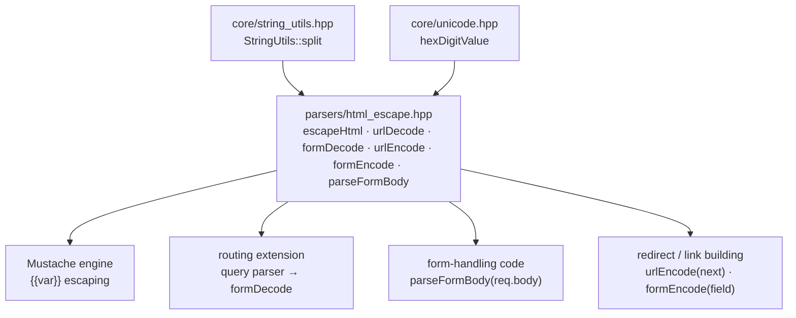
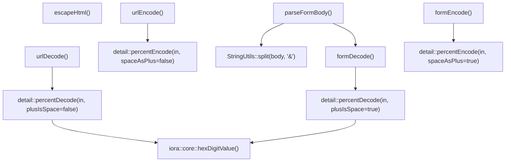

# HTML Escape & URL/Form Encoding — Architecture & Programmer's Guide

[Back to index](../../README.md)

| | |
|---|---|
| **Component** | `iora::parsers` text primitives: `escapeHtml`, `urlDecode`, `formDecode`, `urlEncode`, `formEncode`, `parseFormBody` |
| **Version** | 1.1.0 |
| **Date** | 2026-09-09 |
| **Status** | IMPLEMENTED |
| **Header** | `include/iora/parsers/html_escape.hpp` (header-only) |
| **Namespace** | `iora::parsers` (public), `iora::parsers::detail` (internal encode/decode core) |
| **Dependencies** | `<cstdint>`, `<string>`, `<string_view>`, `<unordered_map>`; `iora/core/string_utils.hpp` (`StringUtils::split`); `iora/core/unicode.hpp` (`iora::core::hexDigitValue`) |
| **Architecture ref** | `architecture/iora/html_escape.json` |
| **Tracker ref** | `tasks/iora/completed/2026-05-29-2_htmx-support_phase2a_html-escape_P2.json` |

---

## Revision History

| Version | Date | Changes |
|---|---|---|
| 1.0.0 | 2026-05-29 | Initial implementation: `escapeHtml` (5-char HTML escaper incl. single-quote → `&#39;`), `urlDecode`/`formDecode` (lenient percent-decode sharing one `detail::percentDecode` core), `parseFormBody` (x-www-form-urlencoded → `unordered_map`). 30 test cases / 90 assertions. |
| 1.1.0 | 2026-09-09 | Added the percent-*encoders* `urlEncode` (RFC 3986, space → `%20`) and `formEncode` (WHATWG x-www-form-urlencoded, space → `+`), both over a shared `detail::percentEncode(in, spaceAsPlus)` core; they are the round-trip inverses of `urlDecode`/`formDecode`. Migrated into `iora/docs/parsers/` and re-verified every signature, default, qualifier, and behavioral claim against `include/iora/parsers/html_escape.hpp`. Test coverage now 120 assertions / 45 cases (adds encoder + round-trip groups). |

---

## 1. Executive Summary

**Problem.** iora ships an HTTP server, a JSON parser, an HTTP client, and an XML parser, but none of the text primitives a *server-rendered* web layer (HTMX-style admin UIs, form handlers) needs — for either direction of the wire:

1. **HTML escaping** for safely interpolating user-controlled data into HTML. Repo-wide there was no forward HTML/text escaper — the XML parser only decodes entities *inbound* (`xml.hpp:286 decodeEntities`), and most hand-rolled escapers forget the single-quote, opening attribute-context XSS.
2. **Percent-decoding** of URL-encoded text. No `urlDecode`/form-body parser existed anywhere; handlers receiving an `application/x-www-form-urlencoded` POST got raw bytes in `req.body`.
3. **Form-body parsing.** The existing query-string parser (`network/http_server.hpp:837-858`) does not even percent-decode and silently drops parameters lacking `=`, so query params arrive corrupted.
4. **Percent-encoding** for the *outbound* direction — building a `?next=…` redirect target or an x-www-form-urlencoded request body — which has no repo-wide primitive either.

**Solution.** A single tier-0 leaf header, `include/iora/parsers/html_escape.hpp`, providing six pure, `std`-only free functions in `iora::parsers`:

| Function | Purpose |
|---|---|
| `escapeHtml(string_view) -> string` | Escape `& < > " '` for HTML body + quoted-attribute context. |
| `urlDecode(string_view) -> string` | Percent-decode; `+` stays a literal `+` (path/generic context). |
| `formDecode(string_view) -> string` | Percent-decode; `+` → space (form-body / query-value context). |
| `urlEncode(string_view) -> string` | Percent-encode per RFC 3986; space → `%20`. Inverse of `urlDecode`. |
| `formEncode(string_view) -> string` | Percent-encode per WHATWG form-urlencoded; space → `+`. Inverse of `formDecode`. |
| `parseFormBody(string_view) -> unordered_map<string,string>` | Parse an x-www-form-urlencoded body into a key→value map. |

**Why it matters.**

- *Security (technical):* `escapeHtml` escapes **five** characters including the single-quote (`'` → `&#39;`), making interpolation into single-quoted attributes (`value='{{x}}'`, `hx-vals='…'`) XSS-safe — the gap most hand-rolled escapers leave open.
- *Correctness:* `urlDecode`/`formDecode` give iora one shared, lenient percent-decoder, and `urlEncode`/`formEncode` are their exact byte-for-byte inverses (verified over all 256 byte values). Once the routing layer routes the broken query parser through `formDecode`, query and form parsing finally share one decoding rule.
- *Robustness:* the four decode/escape functions are **total** — they never throw on adversarial/garbage input (lenient, Python `urllib.parse.unquote` style), which is the right posture for untrusted HTTP input; the two encoders are likewise total and byte-wise.

This header is the leaf the Mustache engine (`{{var}}` escaping), the routing/auth layers, and form-handling code depend on.

---

## 2. System Architecture

### 2.1 Position in the dependency graph

`html_escape.hpp` is a **tier-0 leaf**: it depends only on the C++ standard library, `iora::core::StringUtils`, and the shared `iora::core::hexDigitValue` primitive (`iora/core/unicode.hpp`) — the same hex-nibble routine `json.hpp` and `xml.hpp` use. It has no HTMX-component dependencies. Downstream consumers depend on *it*:



### 2.2 Internal structure

The six public functions sit over two internal cores — one for decoding, one for encoding — plus the `escapeHtml` standalone pass:



- `urlDecode` and `formDecode` are thin wrappers over `detail::percentDecode(in, bool plusIsSpace)` — one routine, one boolean, two self-documenting public names (review finding M-3: a single bool-flag *public* function is a footgun because the default could be wrong at a call site). `percentDecode` validates each hex nibble via the shared `iora::core::hexDigitValue` (from `iora/core/unicode.hpp`) rather than a local hex-nibble routine.
- `urlEncode` and `formEncode` mirror that pattern over `detail::percentEncode(in, bool spaceAsPlus)` — again one routine, two named public entry points. (Note the flag names differ by direction: the decoder asks `plusIsSpace`, the encoder asks `spaceAsPlus` — each reads correctly at its own definition.)
- `parseFormBody` reuses `StringUtils::split` for the **outer** `&` field split, but does the **inner** key/value split manually (`find('=') + substr`), and form-decodes both halves via `formDecode`.

### 2.3 Threading model

All six functions are **pure and reentrant**: no shared state, no mutable statics, output-only allocation. They are safe to call concurrently from any thread with no synchronization. See §8.

---

## 3. Component Deep Dive

### 3.1 `escapeHtml`

```cpp
std::string escapeHtml(std::string_view in);
```

**Algorithm.** A single left-to-right pass over the input bytes. Each byte is matched in a `switch`; the five special characters are replaced with their entities, every other byte is copied verbatim:

| Input char | Output entity |
|---|---|
| `&` | `&amp;` |
| `<` | `&lt;` |
| `>` | `&gt;` |
| `"` | `&quot;` |
| `'` (U+0027) | `&#39;` |

**Why single-pass.** A single pass over the *input* (appending entities to a fresh output buffer) structurally cannot re-scan the `&` characters it just emitted, so it is **immune to double-escaping** (`<` never becomes `&amp;lt;`). A replace-all-occurrences implementation would have to replace `&` *first* to be correct; the single-pass builder sidesteps that ordering trap entirely.

**Why `&#39;` (decimal) not `&apos;`.** `&apos;` is an XML/XHTML entity not defined in HTML4 and unreliable in legacy parsers. The numeric `&#39;` is universally understood (the OWASP Java Encoder and Python `html.escape` make the same choice; `html.escape` uses the hex form `&#x27;`, which is equivalent).

**Byte-wise / signedness.** The function iterates with `for (char c : in)` and matches raw bytes; only the five ASCII characters (all `< 0x80`) are special. High-bit bytes (UTF-8 continuation bytes, Latin-1, etc.) and embedded NULs fall through to the default copy unchanged — there is no `char`-signedness hazard because the default branch copies the byte without comparing it.

**Invariants.**
- Not idempotent: `escapeHtml("&amp;") == "&amp;amp;"`. Escape exactly once, at the output boundary.
- Empty input → empty output. Reserves `in.size()` up front.
- **Context boundary (DD-6):** HTML body + *quoted* attribute context **only**. NOT safe for unquoted attributes, `<script>`/JS-string, `javascript:`/`url()`, CSS, or HTML comments. Those require context-specific escapers (not provided in v1).

### 3.2 `detail::percentDecode` (shared decode core)

```cpp
namespace detail
{
  std::string percentDecode(std::string_view in, bool plusIsSpace);
}
```

**Algorithm.** Scan left-to-right with index `i`:

1. If `in[i] == '%'` **and** there are at least two more bytes (`i + 2 < n`) **and** both are valid hex (`iora::core::hexDigitValue(c, out)` returns `true` for each): emit the decoded byte `(hi << 4) | lo`, advance by 3.
2. Otherwise, if `in[i] == '%'` (malformed — at EOF, too few trailing chars, or a non-hex nibble): emit a **literal `%`**, advance by **1** (lenient recovery).
3. Otherwise, if `plusIsSpace && in[i] == '+'`: emit a space, advance by 1.
4. Otherwise: copy the byte, advance by 1.

**Leniency (designPrinciple[2]).** Matches Python `urllib.parse.unquote`: a malformed escape is passed through literally and decoding continues — it **never throws** and **never discards the remainder**. The advance-by-1 on a malformed `%` is load-bearing: it means a second `%` is not greedily consumed as the start of a new escape during a failed lookahead.

**Hex-nibble validation** is no longer hand-rolled in this header. `percentDecode` calls the shared `iora::core::hexDigitValue(char c, std::uint32_t& out)` (declared in `iora/core/unicode.hpp`) — the same primitive `json.hpp` and `xml.hpp` use for their own escape decoding — instead of a local `detail::hexNibble`. It accepts both upper- and lower-case hex in either nibble position and returns `false` (leaving `out` unset) for a non-hex byte.

### 3.3 `urlDecode` / `formDecode`

```cpp
std::string urlDecode(std::string_view in);   // percentDecode(in, false)
std::string formDecode(std::string_view in);  // percentDecode(in, true)
```

The **only** behavioral difference is the treatment of a *raw* `+`:

| Input | `urlDecode` | `formDecode` |
|---|---|---|
| `a+b` | `a+b` (literal) | `a b` (space) |
| `a%2Bb` | `a+b` | `a+b` (percent path precedence) |
| `a%20b` | `a b` | `a b` |

`urlDecode` is correct for path segments and generic percent-encoded text; `formDecode` is correct for `application/x-www-form-urlencoded` bodies **and query-string values** (both use the `+`=space convention per the WHATWG URL form-urlencoded parser). `parseFormBody` is built on `formDecode`.

### 3.4 `parseFormBody`

```cpp
std::unordered_map<std::string, std::string> parseFormBody(std::string_view body);
```

**Algorithm.**

1. **Outer split:** `StringUtils::split(body, '&')` yields the field segments. An unencoded `&` is unambiguously a separator (a literal `&` in data must be `%26`).
2. For each segment:
   - If the segment is **empty** (consecutive `&&`, or a leading/trailing `&`): **skip it** (`continue`). This is distinct from an empty *key* (see below).
   - **Inner split on the FIRST `=`** via `seg.find('=') + seg.substr(...)` — *not* `StringUtils::split(seg,'=')`, which would split on every `=` and corrupt a value that legitimately contains `=` (e.g. base64 padding, `token=ab=cd`).
     - No `=`: the whole segment is a **bare key** → empty-string value.
     - With `=`: `key = substr(0, eq)`, `value = substr(eq+1)` (the remainder, including any further `=`, is the value).
   - `formDecode` is applied to **both** key and value before insertion.
3. Insert into the map with **last-wins** on duplicate keys (natural consequence of `unordered_map`).

**Distinctions that matter:**

| Body | Result | Why |
|---|---|---|
| `flag&x=1` | `{flag:"", x:"1"}` | bare key kept as empty value (HTML forms submit valueless fields) |
| `=v` | `{"":"v"}` | empty *key* with a value — kept (non-empty segment) |
| `&a=1&` | `{a:"1"}` | empty *segments* skipped — no spurious `{"":""}` |
| `a=1&&b=2` | `{a:"1", b:"2"}` | consecutive `&` → empty segment skipped |
| `token=ab=cd` | `{token:"ab=cd"}` | split-on-first-`=` keeps the inner `=` |
| `x=1&x=2&x=3` | `{x:"3"}` | last-wins |

**Invariants.**
- **Lenient and total:** never throws; empty body → empty map; malformed segments yield whatever decodes.
- **No trim (L-4):** decoded leading/trailing spaces are preserved (`k=%20v%20` → `{k:" v "}`, `k=+v+` → `{k:" v "}`). Form fields may legitimately contain edge spaces once decoded.
- **`string_view` lifetime:** the split segments are views into `body`; both key and value are materialized into owned `std::string` (via `formDecode`) before insertion, so no view outlives `body`.

### 3.5 `detail::percentEncode` (shared encode core)

```cpp
namespace detail
{
  std::string percentEncode(std::string_view in, bool spaceAsPlus);
}
```

**Algorithm.** Iterate `for (unsigned char c : in)`:

1. If `c` is an RFC 3986 **unreserved** byte — `A`-`Z`, `a`-`z`, `0`-`9`, `-`, `.`, `_`, `~` — copy it verbatim.
2. Otherwise, if `spaceAsPlus && c == 0x20` (space): emit `+`.
3. Otherwise: emit `%` followed by the two **uppercase** hex digits of the byte (`kHex[c >> 4]`, `kHex[c & 0x0F]`, where `kHex = "0123456789ABCDEF"`).

Everything outside the unreserved set is percent-encoded, so the output is safe to drop into any URL/form context. The encoder is byte-wise: a multi-byte UTF-8 sequence is encoded one byte at a time (`São` → `S%C3%A3o`), a NUL byte becomes `%00`, and `%` itself becomes `%25`. Output length is reserved at `in.size()` up front (it grows for encoded bytes).

### 3.6 `urlEncode` / `formEncode`

```cpp
std::string urlEncode(std::string_view in);   // percentEncode(in, false)
std::string formEncode(std::string_view in);  // percentEncode(in, true)
```

The **only** behavioral difference is the treatment of a *raw* space:

| Input | `urlEncode` | `formEncode` |
|---|---|---|
| `a b` (space) | `a%20b` | `a+b` |
| `+` | `%2B` | `%2B` |
| `/`, `?`, `=`, `&`, `#`, `:`, `@` | `%2F %3F %3D %26 %23 %3A %40` | same |
| `A`-`Z` `a`-`z` `0`-`9` `-` `.` `_` `~` | verbatim | verbatim |

`urlEncode` is correct for a path segment or a query *value* that must survive a generic URL (space → `%20`, e.g. a `?next=` redirect target); `formEncode` is correct for a value in an `application/x-www-form-urlencoded` request body (space → `+`, the WHATWG convention). Both are exact inverses of the matching decoder — `urlDecode(urlEncode(x)) == x` and `formDecode(formEncode(x)) == x` hold for every one of the 256 byte values (round-trip tests). The two encoders differ only when the input contains a raw space; on any space-free input they are identical.

---

## 4. Usage Guide

### 4.1 Quick start

```cpp
#include <iora/parsers/html_escape.hpp>

using namespace iora::parsers;

// Escape user data before interpolating into HTML (body or quoted attribute):
std::string safe = escapeHtml(userName);           // "<b>" -> "&lt;b&gt;"

// Decode a percent-encoded path segment ('+' is literal):
std::string seg = urlDecode(pathSegment);           // "a%2Fb" -> "a/b"

// Decode a single form/query value ('+' -> space):
std::string val = formDecode(queryValue);           // "hello+world" -> "hello world"

// Encode a value for a URL query string ('+' stays %2B, space -> %20):
std::string q = urlEncode(nextPath);                // "/a?x=1" -> "%2Fa%3Fx%3D1"

// Encode a value for an x-www-form-urlencoded body (space -> '+'):
std::string f = formEncode(fieldValue);             // "hello world" -> "hello+world"

// Parse a whole x-www-form-urlencoded POST body:
auto fields = parseFormBody(request.body);          // {"user":"jo","msg":"hi there"}
std::string user = fields.count("user") ? fields.at("user") : "";
```

### 4.2 Common patterns

- **Render-time escaping:** escape exactly once, at the moment you write a value into HTML output. Do not pre-escape and store.
- **Form POST handling:** call `parseFormBody(req.body)` once, then read fields from the map. Treat a missing key with `.count()`/`.find()` — do not assume presence.
- **Round-trip a value through a URL:** `urlEncode` before you place it into a URL/query, `formDecode` (or `urlDecode`) when it comes back. Match the encoder to the decoder: form body ↔ `formEncode`/`formDecode`; generic URL ↔ `urlEncode`/`urlDecode`.

### 4.3 Gotchas & anti-patterns

| Anti-pattern | Why it's wrong | Do instead |
|---|---|---|
| `escapeHtml` into a `<script>` / `style` / `href="javascript:…"` context | escapeHtml is HTML-body/attribute only; it does **not** neutralize JS/CSS/URL contexts | use a context-appropriate escaper (not in v1) |
| Escaping twice | not idempotent → `&amp;amp;` | escape once at the output boundary |
| `urlDecode` on a form value | leaves `+` as literal `+` instead of a space | use `formDecode` for form/query values |
| `formEncode` for a value going into a generic URL path | encodes space as `+`, which a path context reads literally, not as a space | use `urlEncode` (space → `%20`) for path/generic-URL contexts |
| Encoding an already-encoded string | double-encodes `%` (→ `%25`), corrupting the value | encode raw values exactly once, at the boundary |
| Splitting a field on every `=` | corrupts values containing `=` | `parseFormBody` already splits on the first `=` only |
| Relying on duplicate keys | last-wins; earlier values are lost | multi-valued fields are out of scope in v1 (see §12) |

---

## 5. Call Flow / Sequence Reference

### 5.1 `parseFormBody("na+me=John+Doe&city=S%C3%A3o%20Paulo")`

```
split('&')            -> ["na+me=John+Doe", "city=S%C3%A3o%20Paulo"]
segment 1 "na+me=John+Doe":
  not empty; find('=') = 5
  key   = formDecode("na+me")    -> "na me"
  value = formDecode("John+Doe") -> "John Doe"
  insert {"na me": "John Doe"}
segment 2 "city=S%C3%A3o%20Paulo":
  not empty; find('=') = 4
  key   = formDecode("city")               -> "city"
  value = formDecode("S%C3%A3o%20Paulo")   -> "São Paulo"   (C3 A3 = U+00E3 'ã'; %20 -> space)
  insert {"city": "São Paulo"}
result -> {"na me":"John Doe", "city":"São Paulo"}
```

### 5.2 Lenient recovery (failure path): `urlDecode("%%41")`

```
i=0 '%': lookahead in[1]='%' -> hexDigitValue('%', out) = false  => malformed: emit '%', advance 1
i=1 '%': lookahead in[2]='4' (hi=4), in[3]='1' (lo=1) => emit 0x41 'A', advance 3
result -> "%A"
```

### 5.3 Encode round-trip: `urlEncode("/a b")` then `urlDecode(...)`

```
urlEncode("/a b"):
  '/'  -> not unreserved, not space  -> "%2F"
  'a'  -> unreserved                 -> "a"
  ' '  -> space, spaceAsPlus=false   -> "%20"
  'b'  -> unreserved                 -> "b"
  result -> "%2Fa%20b"
urlDecode("%2Fa%20b") -> "/a b"      (exact inverse)
```

### 5.4 Pathological structure: `parseFormBody("===&&&===")`

```
split('&')   -> ["===", "", "", "==="]    (the &&& run yields two empty segments)
"===": not empty; find('=')=0; key="" value="==" ; insert {"":"=="}
"":   empty -> skip
"":   empty -> skip
"===": same as first; last-wins {"":"=="}
result -> {"":"=="}
```

---

## 6. Thread Safety Model

| Function | Synchronization | Safe to call from |
|---|---|---|
| `escapeHtml` | none needed | any thread, concurrently |
| `urlDecode` | none needed | any thread, concurrently |
| `formDecode` | none needed | any thread, concurrently |
| `urlEncode` | none needed | any thread, concurrently |
| `formEncode` | none needed | any thread, concurrently |
| `parseFormBody` | none needed | any thread, concurrently |

All six are **pure functions**: they read only their argument, write only freshly-allocated output, and touch no shared or static mutable state. `detail::percentDecode`, `detail::percentEncode`, and the shared `iora::core::hexDigitValue` are likewise pure (the encoder's `kHex` table is a function-local `static constexpr char[]` — read-only, no mutable state). There is no lock to order and no callback invoked, so there are no copy-then-invoke or copy-then-iterate concerns. Concurrent calls on distinct inputs are fully independent.

---

## 7. Configuration Reference

This component has **no configurable parameters** — no options, no globals, no compile-time switches. Behavior is fixed by the specification:

| Behavior | Fixed value |
|---|---|
| escapeHtml character set | `& < > " '` (single-quote → `&#39;`) |
| `urlDecode` `+` handling | literal `+` |
| `formDecode` `+` handling | space |
| `urlEncode` space handling | `%20` |
| `formEncode` space handling | `+` |
| Encoder unreserved set (copied verbatim) | `A`-`Z` `a`-`z` `0`-`9` `-` `.` `_` `~` (RFC 3986 §2.3) |
| Encoder hex case | uppercase (`%2F`, `%0A`, `%FF`) |
| Malformed `%` handling (decode) | lenient (literal `%`, advance 1, never throw) |
| Duplicate form keys | last-wins |
| Key/value trimming | none |

---

## 8. API Reference

```cpp
namespace iora::parsers
{

// Escape text for HTML body / quoted-attribute interpolation.
// Escapes & < > " ' ; single-quote -> &#39;. Single-pass, byte-wise, never double-escapes.
std::string escapeHtml(std::string_view in);

// Percent-decode; '+' is a literal '+'. Lenient on malformed escapes (never throws).
std::string urlDecode(std::string_view in);

// Percent-decode; raw '+' -> space, but %2B -> '+'. Lenient (never throws).
std::string formDecode(std::string_view in);

// Percent-encode per RFC 3986 (space -> %20). Inverse of urlDecode.
std::string urlEncode(std::string_view in);

// Form-encode per WHATWG application/x-www-form-urlencoded (space -> +). Inverse of formDecode.
std::string formEncode(std::string_view in);

// Parse an application/x-www-form-urlencoded body into key->value.
// Outer split on '&', inner split on first '='; both halves form-decoded.
// Last-wins on duplicates; bare key -> empty value; empty segments skipped; never throws.
std::unordered_map<std::string, std::string> parseFormBody(std::string_view body);

} // namespace iora::parsers
```

All six functions are `inline` free functions (header-only). The encode/decode cores `detail::percentDecode(std::string_view, bool plusIsSpace)` and `detail::percentEncode(std::string_view, bool spaceAsPlus)` live in `iora::parsers::detail` and are implementation detail — call the named public wrappers, not the cores. Hex-nibble validation is not a local implementation detail of this header: `percentDecode` calls the shared `iora::core::hexDigitValue` from `iora/core/unicode.hpp`.

---

## 9. Design Decisions

| ID | Decision | Rationale |
|---|---|---|
| DD-1 (H-4) | `escapeHtml` escapes the single-quote (5 chars total), as `&#39;` | iora/HTMX interpolate into single-quoted attributes; an unescaped `'` permits attribute-context XSS. `&#39;` (not `&apos;`) is reliable in legacy HTML. |
| DD-2 (M-3) | TWO decode functions, not one bool-flag public function | The `+` rule differs by context (path vs form/query); two named functions make the call site state its intent. They share one internal core parameterized by `plusIsSpace`. |
| DD-3 (M-4) | `formDecode` is the decoding primitive for the (future) query-parser rewire; the `network/http_server.hpp` edit is owned by `routing_extension.json` | Query values use the form-urlencoding `+`=space convention, so `formDecode` (not `urlDecode`) is correct. This header supplies the primitive only. |
| DD-4 | Duplicate keys collapse last-wins | `unordered_map<string,string>` cannot hold multiple values; last-wins is the documented consequence. |
| DD-6 | `escapeHtml` is an HTML body/attribute escaper only | A single "escape everywhere" function is a classic XSS source; naming + documented boundary make the scope explicit. |
| DD-7 | Outer `&` split reuses `StringUtils::split`; inner key/value split is manual `find('=')+substr` | `StringUtils::split` is right for the `&` separator but would over-split a value containing `=`; split-on-first-`=` keeps the value intact. |
| DD-8 | TWO encode functions (`urlEncode`/`formEncode`) mirroring the decode pair, over one `detail::percentEncode(in, spaceAsPlus)` core | Symmetry with the decoders: the *space* rule differs by context (generic URL `%20` vs form body `+`) exactly as the *`+`* rule differs on decode. Two named entry points state intent at the call site; a single bool-flag public function would repeat the M-3 footgun. |
| (impl) | Hex-nibble validation reuses the shared `iora::core::hexDigitValue` (`iora/core/unicode.hpp`) instead of a local `detail::hexNibble` | The same primitive `json.hpp` and `xml.hpp` already use for their own escape decoding; one hex-nibble routine for the whole `parsers` tier instead of a per-header hand-rolled copy. Yields both the validity check and the value in one step; `<cctype>` not needed. |
| (impl) | Encoder emits **uppercase** hex; unreserved set is exactly RFC 3986 §2.3 | Uppercase `%XX` is the RFC-preferred form and round-trips cleanly through the case-insensitive decoder; restricting verbatim output to the unreserved set makes the encoder safe for any URL/form context. |

---

## 10. Known Limitations

1. **Context coverage:** `escapeHtml` covers HTML body + quoted-attribute contexts only. There is no escaper for unquoted attributes, `<script>`/JS-string, `javascript:`/`url()`, CSS, or HTML-comment contexts. Interpolating into those is the caller's responsibility.
2. **Duplicate keys:** `parseFormBody` collapses duplicate keys (last-wins). Multi-valued fields (e.g. multi-select submitting the same key repeatedly) lose all but the last value. A multiplicity-preserving overload (`unordered_map<string, vector<string>>`) is deferred.
3. **No UTF-8 validation:** `urlDecode`/`formDecode`/`urlEncode`/`formEncode` are byte-level codecs; they do not validate that decoded bytes form well-formed UTF-8 and do not normalize. Callers needing validated UTF-8 must validate the result.
4. **Lenient decode by design:** malformed `%` escapes pass through literally rather than being rejected. Applications requiring strict RFC 3986 rejection are not served by v1.
5. **No HTML un-escaper:** this header escapes outbound HTML (`escapeHtml`) but provides no inverse HTML-entity decoder. (Percent-encoding, by contrast, IS bidirectional as of v1.1.0: `urlEncode`/`formEncode` are the exact inverses of `urlDecode`/`formDecode`.)
6. **Not idempotent:** `escapeHtml` does not detect already-escaped input, and the encoders do not detect already-encoded input (`%` → `%25`); callers must escape/encode exactly once at the output boundary.
7. **Query-parser rewire still open:** the existing non-decoding query parser at `network/http_server.hpp:837-858` (M-4) is not yet routed through `formDecode`; that edit is owned by `routing_extension.json`.
