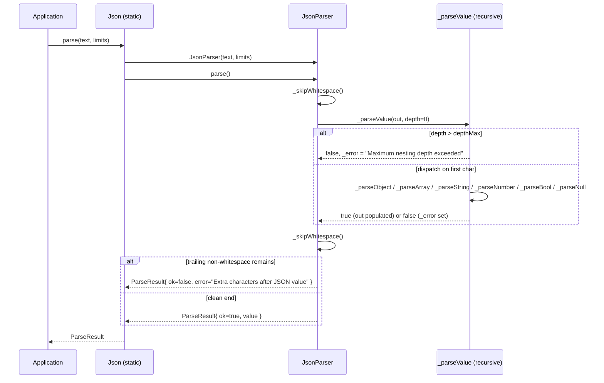

# Iora JSON -- value model, parser & serializer -- Architecture & Programmer's Guide

[Back to index](../../README.md)

| | |
|---|---|
| **Version** | 1.0 |
| **Date** | 2026-09-09 |
| **Status** | IMPLEMENTED |
| **Header** | `include/iora/parsers/json.hpp` |
| **Namespace** | `iora::parsers` |
| **Dependencies** | Standard library (`<variant>`, `<unordered_map>`, `<vector>`, `<string>`, `<string_view>`, `<optional>`, `<charconv>`, `<functional>`, `<stdexcept>`) plus one intra-Iora header, `iora/core/unicode.hpp` (for `\uXXXX` decoding) -- no external/third-party dependencies |

## Revision History

| Version | Date | Changes |
|---------|------|---------|
| 1.0 | 2026-09-09 | Initial guide for the implemented single-header JSON value, parser, and serializer. |

---

## 1. Executive Summary

### Problem

Iora is a zero-external-dependency C++17 microservice framework. Its HTTP, JSON-RPC, and WebSocket layers all move JSON payloads, but pulling in a heavyweight third-party JSON library (with its own build integration, ABI surface, and allocation behavior) conflicts with the framework's "no third-party deps" constraint. The framework therefore needs a small, self-contained JSON facility that:

- lives in a single header and compiles under C++17 with no external packages,
- offers a DOM-style value model familiar to users of popular JSON libraries,
- reports parse errors with line/column context, and
- bounds resource use so untrusted network payloads cannot exhaust memory or blow the stack.

### Solution

`include/iora/parsers/json.hpp` provides a pragmatic, header-only JSON implementation in namespace `iora::parsers`:

- **`Json`** -- a DOM value backed by `std::variant<std::nullptr_t, bool, std::int64_t, double, std::string, Array, Object>`. Supports the seven JSON-ish types (null, boolean, integer, double, string, array, object) with implicit constructors, `operator[]` access, and template getters.
- **`JsonParser`** -- a recursive-descent parser producing a `ParseResult` (a `Json` value plus an `ok` flag and a `JsonError` with `JsonLocation`). Never throws on malformed input; the throwing entry point `Json::parseOrThrow` wraps it.
- **`JsonStreamParser`** -- an incremental, DOM-building wrapper that buffers chunks and attempts a full parse after each `feed()`.
- **`ParseLimits`** -- caps on array items, object members, nesting depth, and string length to bound resource use.
- **`SerializeOptions` / `Json::dump` / `Json::serialize`** -- serializer with optional pretty-printing, configurable indent, and key sorting.

### Technical Impact

- **Zero external/third-party dependencies** -- standard library plus one intra-Iora header (`iora/core/unicode.hpp`), nothing else to link.
- **DOM value is `std::variant`-backed** -- no manual tagged-union bookkeeping, no raw `new`/`delete` in the value type.
- **Bounded parsing** -- default limits reject arrays/objects over 10,000 elements, nesting deeper than 100, and strings longer than 1,000,000 bytes, so a malicious payload cannot trivially exhaust resources.
- **Non-throwing core** -- `Json::parse(std::string_view, ParseLimits) -> ParseResult` reports errors as data (line/column), avoiding exception cost on the hot path; a throwing convenience layer sits on top.

> This is a pragmatic parser, not a fully validating RFC 8259 engine. Section 12 (Known Limitations) documents where it deviates from strict JSON. As of the 2026-09-09 parsers-slice fix, `\uXXXX` escapes are decoded to UTF-8 (including surrogate pairs) and unescaped control characters are rejected; the remaining deviations below are the ones the source still exhibits.

---

## 2. System Architecture

### Component Relationships

```
iora::parsers (json.hpp)
|
+-- iora::core::unicode.hpp (intra-Iora dependency: hexDigitValue, appendUtf8)
|
+-- enum class JsonType { Null, Boolean, Int, Double, String, Array, Object }
|
+-- struct JsonLocation { offset, line, column }
+-- struct JsonError    { message, where : JsonLocation }
+-- struct ParseLimits  { arrayItemsMax, membersMax, depthMax, stringLengthMax }
+-- struct SerializeOptions { pretty, sortKeys, indent }
+-- struct ParseResult  { value : Json, ok : bool, error : JsonError }
|
+-- class Json                         // the DOM value type
|   |
|   +-- Value = std::variant<nullptr_t, bool, int64_t, double, std::string, Array, Object>
|   |   +-- Array  = std::vector<Json>
|   |   +-- Object = std::unordered_map<std::string, Json>
|   |
|   +-- constructors / implicit conversions
|   +-- type queries (isX / is_x)
|   +-- accessors (getX, get<T>, operator[], at)
|   +-- mutators (push_back, emplace_back, erase, clear)
|   +-- serialize() / dump()
|   +-- static parse() / parseOrThrow() / parseString() / safe_parse()
|   +-- nested exceptions: parse_error, type_error, out_of_range
|
+-- class JsonParser                   // recursive-descent, owns _text/_pos/_limits/_error
|   +-- parse() -> ParseResult
|
+-- class JsonStreamParser             // buffers chunks, re-parses on each feed()
|   +-- feed(chunk) / finish() / complete() / value() / error()
|
+-- template<class T, size_t InlineN> class SmallVec   // small-buffer vector (NOT wired into Json; see Section 12)
```

Ownership: a `Json` owns its payload by value through the `std::variant`. Arrays own their elements (`std::vector<Json>`), objects own their key strings and value `Json`s (`std::unordered_map<std::string, Json>`). Copies are deep (variant copy recurses). `JsonParser` borrows the input as a `std::string_view` -- the caller must keep the source buffer alive for the duration of the parse call.

### Data Flow: Parsing a Payload



For the throwing path, `Json::parseOrThrow` calls `parse` and throws `Json::parse_error` when `ok == false`, formatting the message as `"JSON parse error at line L, column C: <message>"`.

### Threading Model

| Thread | Responsibility |
|--------|----------------|
| Any caller thread | Constructs `Json` values, parses, serializes. Each `JsonParser` / `JsonStreamParser` is a distinct object with no shared mutable global state. |
| Multiple caller threads | May parse concurrently into separate `Json` results with no synchronization (the static `parse` entry points construct a fresh `JsonParser` per call). A single `Json` instance is NOT internally synchronized; concurrent mutation of one instance requires external locking. |

There are no mutexes, atomics, condition variables, or background threads anywhere in this header.

---

## 3. Component Deep Dive

### 3.1 `Json` -- the DOM value

`Json` wraps a single `std::variant`:

```cpp
using Value =
  std::variant<std::nullptr_t, bool, std::int64_t, double, std::string, Array, Object>;
Value _value;
```

The `JsonType` enum is deliberately ordered to match the variant alternatives, so `type()` is a direct cast of the active index:

```cpp
JsonType type() const { return static_cast<JsonType>(_value.index()); }
```

**Construction and implicit conversions.** `Json` is implicitly constructible from `nullptr_t`, `bool`, any integral type (funneled through one SFINAE-constrained template to `std::int64_t`), `float`/`double` (stored as `double`), `const char*` / `std::string`, `Array`, and `Object`. A `std::initializer_list<Json>` constructs an array. Note that `bool` is excluded from the integral template (`!std::is_same_v<T, bool>`) so `Json(true)` stays a boolean rather than being widened to `int64`.

Implicit *conversion operators* also exist: to any arithmetic non-bool type (via `get<T>()`), to `bool`, and to `std::string`. The `operator bool()` is special: it returns the stored boolean when the value is a boolean, otherwise `!isNull()` (so a non-null number/string/array is "truthy"). The `operator std::string()` returns the stored string when the value is a string, otherwise the serialized `dump()` of the value.

**Type queries.** Two parallel families exist: the terse `isNull/isBool/isInt/isDouble/isString/isArray/isObject`, and snake-case aliases (`is_null`, `is_boolean`, `is_number_integer`, `is_number_float`, `is_string`, `is_array`, `is_object`) for familiarity with other libraries. Additional numeric predicates: `is_number()` (int or double), `is_number_unsigned()` (int and `>= 0`).

**Accessors.**

- Typed getters `getBool()`, `getInt()`, `getDouble()`, `getString()`, `getArray()`, `getObject()` call `std::get<...>` on the variant. If the active alternative does not match, `std::get` throws `std::bad_variant_access` -- NOT `Json::type_error`.
- `get<T>()` / `value<T>()` is a template. For floating-point `T` it accepts either a stored double or a stored int (converting), and throws `std::runtime_error("type_error: cannot get numeric type")` if the value is neither. For integral `T` it forwards to `getInt()` (and thus can throw `bad_variant_access` on a non-int). `std::string`, `Array`, and `Object` are supported; anything else is a compile-time `static_assert`.

**Element access.**

- `operator[](size_t)` (non-const) auto-vivifies: if the value is not an array it is replaced with an empty array, then grown with null elements up to `index`. The `const` overload returns a reference to a static null `Json` when out of range or not an array (never throws, never mutates).
- `operator[](const std::string&)` / `operator[](const char*)` (non-const) auto-vivifies an object and default-inserts the key. The `const` overloads return the static null `Json` for a missing key or non-object.
- Explicit `int` overloads exist for both index and key positions to disambiguate the literal `0` (which is otherwise ambiguous between `size_t` and a null `const char*`). `json[0]` therefore indexes an array.
- `at(key)` / `at(index)` are the checked accessors: they throw `std::runtime_error` (via `Json::type_error` message text for the wrong-container case) or `std::out_of_range` for a missing key / out-of-bounds index.

**Mutation.** `push_back` / `emplace_back` auto-vivify an array if needed. `clear()` empties an array or object in place, and resets any other type to null. `erase(key)` removes an object member (returns count erased, 0 if not an object). `erase(const_iterator)` removes by iterator (throws `type_error` on a non-object).

**Container introspection.** `size()` returns element count for arrays/objects, character count for strings, `0` for null, and throws `std::runtime_error` for scalars. `empty()` mirrors this but returns `false` (rather than throwing) for scalars. `contains(key)`, `count(key)`, and `find(key)` operate on objects; `find` throws `type_error` on a non-object.

**Iteration.** Range-based `begin()`/`end()` iterate an array's elements and throw `type_error` on a non-array. `beginArray()`/`endArray()` are explicit array iterators with the same semantics. `items()` returns a reference to the underlying `Object` (`std::unordered_map`) for structured-binding iteration over key/value pairs; it throws `type_error` on a non-object. `endObject()` complements a `find()` result.

### 3.2 `JsonParser` -- recursive descent

`JsonParser` holds the input `std::string_view _text`, a cursor `std::size_t _pos`, the `ParseLimits _limits`, and an error string `_error`. `parse()` skips leading whitespace, requires at least one value, then after a successful value skips trailing whitespace and *rejects any remaining non-whitespace characters* ("Extra characters after JSON value"). This is why `"1.2.3"` fails: `1.2` parses, then `.3` is trailing garbage.

`_parseValue` dispatches on the first non-whitespace character and enforces the depth limit *before* descending:

```cpp
if (depth > _limits.depthMax)
{
  _error = "Maximum nesting depth exceeded";
  return false;
}
```

- **Numbers** (`_parseNumber`) accept an optional leading `-`, an integer part (a lone `0` or a digit run), an optional fractional part (`.` followed by at least one digit), and an optional exponent (`e`/`E` with optional sign and at least one digit). If the token has no `.`/exponent it is parsed with `std::from_chars` into `std::int64_t`; on range failure (or presence of a fraction/exponent) it falls back to `std::strtod` and is stored as `double`. Consequently, an integer literal outside the `int64` range silently becomes a `double`. Leading `+`, leading zeros like `01`, and bare `.5` are rejected by construction.
- **Strings** (`_parseString`) handle the standard escapes `\" \\ \/ \b \f \n \r \t`. See Section 12 for the `\u` and control-character behavior; the header's doc comment now accurately describes this behavior.
- **Arrays / objects** enforce `arrayItemsMax` / `membersMax` as they accumulate elements and recurse via `_parseValue(..., depth + 1)`. Object keys must be JSON strings; a `:` must follow; members are comma-separated. Trailing commas are rejected.
- **`null` / `true` / `false`** are matched by fixed-length substring compares.

`_getLocation()` recomputes line/column by scanning from the start of the buffer to `_pos` on demand -- it is O(n) in the offset but is only called on the error and completion paths.

### 3.3 `JsonStreamParser` -- incremental DOM building

This is a convenience wrapper for chunked input (for example, HTTP body fragments). It appends each chunk to an internal `std::string _buffer` and re-runs a *full* `Json::parse` over the entire accumulated buffer on every `feed()`:

```cpp
bool feed(std::string_view chunk)
{
  _buffer.append(chunk.data(), chunk.size());
  auto result = Json::parse(_buffer, _limits);
  if (result.ok) { _value = std::move(result.value); _complete = true; _error = JsonError{}; return true; }
  _error = result.error;
  return false;
}
```

`feed()` returns `true` as soon as the buffer holds a complete, valid JSON value. `finish()` performs one last parse if not already complete. `complete()`, `value()`, and `error()` expose state. Because each `feed()` re-parses from scratch, this is a DOM-building buffer, not a true streaming/SAX parser -- cost is quadratic in the number of chunks for a large document (Section 12).

### 3.4 `SmallVec` -- present but not wired into `Json`

The header defines `template<class T, std::size_t InlineN> class SmallVec`, a small-buffer-optimized vector with inline storage, move/copy semantics, and `push_back`/`emplace_back`. Despite the README's "small-vector optimization" language, **`Json::Array` is `std::vector<Json>`, not `SmallVec`** -- `SmallVec` is not used by the `Json` value type anywhere in this header. It is documented here for completeness and flagged in Section 12.

### 3.5 Serialization

`serialize(const SerializeOptions&)` and its private `_serialize(options, depth)` recurse over the value. Scalars: `null`, `true`/`false`, `std::to_string(int64)`, `std::to_string(double)`, and an escaped string. `dump(int indent, char indent_char, bool ensure_ascii, bool sort_keys)` is a convenience that builds `SerializeOptions` -- when `indent >= 0` it enables pretty-printing with `std::string(indent, indent_char)` as the indent unit, and it forwards `sort_keys`. Object keys are collected, optionally `std::sort`-ed (when `sortKeys`), then emitted. String escaping (`_escapeString`) emits `\" \\ \b \f \n \r \t` and `\uXXXX` for any byte below 0x20; all other bytes (including UTF-8 multibyte sequences) are emitted verbatim.

Two serializer behaviors worth internalizing: doubles go through `std::to_string`, which formats with a fixed number of fractional digits (e.g. `3.140000`), and the `ensure_ascii` parameter of `dump()` is accepted but never consulted (Section 12).

---

## 4. Usage Guide

All examples compile against the real API. Include the single header directly (as the tests do):

```cpp
#include "iora/parsers/json.hpp"
```

`iora/parsers/json.hpp` is also reachable through the umbrella `#include "iora/iora.hpp"`.

### Example 1: Parse a request payload (throwing)

```cpp
#include "iora/parsers/json.hpp"
#include <iostream>
#include <string>

void handleRequest(const std::string &body)
{
  using iora::parsers::Json;

  // parseString throws Json::parse_error on malformed input.
  Json req = Json::parseString(body);

  const std::string method = req["method"].get<std::string>();
  const std::int64_t id = req["id"].get<std::int64_t>();

  std::cout << "method=" << method << " id=" << id << std::endl;
}
```

### Example 2: Non-throwing parse of untrusted input with limits

```cpp
#include "iora/parsers/json.hpp"
#include <iostream>
#include <string_view>

bool tryHandle(std::string_view payload)
{
  using iora::parsers::Json;
  using iora::parsers::ParseLimits;
  using iora::parsers::ParseResult;

  ParseLimits limits;          // defaults: 10000 items/members, depth 100, 1e6 string bytes
  limits.depthMax = 32;        // tighten nesting for this endpoint

  ParseResult result = Json::parse(payload, limits);
  if (!result.ok)
  {
    std::cerr << "parse failed at line " << result.error.where.line
              << ", column " << result.error.where.column
              << ": " << result.error.message << std::endl;
    return false;
  }

  const Json &j = result.value;
  if (j.is_object() && j.contains("ok"))
  {
    std::cout << "ok=" << j["ok"].get<bool>() << std::endl;
  }
  return true;
}
```

### Example 3: Build and serialize a response

```cpp
#include "iora/parsers/json.hpp"
#include <iostream>

std::string buildResponse()
{
  using iora::parsers::Json;

  Json resp = Json::object();
  resp["status"] = "success";
  resp["count"] = 2;

  Json items = Json::array();
  items.push_back("item1");
  items.push_back("item2");
  resp["data"] = std::move(items);

  // Pretty-print with a 2-space indent (indent >= 0 enables pretty mode).
  return resp.dump(2);
}

int main()
{
  std::cout << buildResponse() << std::endl;
  return 0;
}
```

### Example 4: Iterate arrays and objects

```cpp
#include "iora/parsers/json.hpp"
#include <iostream>

void report(const iora::parsers::Json &root)
{
  using iora::parsers::Json;

  // Arrays: range-based for iterates elements.
  for (const Json &user : root["users"])
  {
    const std::string name = user["name"].get<std::string>();
    const int age = user["age"].get<int>();
    std::cout << name << " is " << age << std::endl;
  }

  // Objects: items() exposes the underlying map for structured bindings.
  for (const auto &[key, value] : root["meta"].items())
  {
    std::cout << key << " => " << value.dump() << std::endl;
  }
}
```

### Example 5: Deterministic output with sorted keys

```cpp
#include "iora/parsers/json.hpp"
#include <cassert>
#include <string>

void stableOutput()
{
  using iora::parsers::Json;
  using iora::parsers::SerializeOptions;

  Json j = Json::object();
  j["b"] = 2;
  j["a"] = 1;

  SerializeOptions opts;
  opts.sortKeys = true;         // object keys emitted in alphabetical order
  const std::string s = j.serialize(opts);
  assert(s == R"({"a":1,"b":2})");

  // Equivalent via dump(): dump(indent, indent_char, ensure_ascii, sort_keys)
  const std::string s2 = j.dump(-1, ' ', false, /*sort_keys=*/true);
  assert(s2 == s);
}
```

### Anti-Patterns

- **Do NOT rely on object key order.** `Object` is `std::unordered_map`; iteration and default serialization order are unspecified. Use `SerializeOptions::sortKeys` (or `dump(..., sort_keys=true)`) when you need stable output.
- **Do NOT call `getInt()` / `getString()` / `getArray()` on a value of the wrong type expecting `Json::type_error`.** Those call `std::get` and throw `std::bad_variant_access`. Guard with `isInt()`/`isString()`/etc. first, or use `at()`/`get<T>()` where the throw semantics are documented.
- **Do NOT pass a string literal to the bare `Json::parse(...)` overload set.** `parse(std::string_view, ParseLimits)` and `parse(const std::string&)` are both viable for a `const char*`, which is ambiguous. Use `parseString`, `parseOrThrow`, or `safe_parse`, or pass an explicit `std::string`/`std::string_view`.
- **`\uXXXX` escapes are decoded to UTF-8** -- do not assume they are left raw. The parser decodes `\uXXXX` (and `\uD800\uDC00` surrogate pairs) and rejects malformed/truncated escapes with a parse error. Raw UTF-8 bytes also pass through unchanged. (Earlier revisions inserted a `?` placeholder; fixed 2026-09-09.)
- **Do NOT feed one enormous document to `JsonStreamParser` in many tiny chunks expecting linear cost.** Each `feed()` re-parses the entire accumulated buffer; cost is quadratic in the number of chunks. For a single large document, buffer it and call `Json::parse` once.
- **Do NOT assume `dump(indent, indent_char, ensure_ascii, ...)` honors `ensure_ascii`.** It is ignored; non-ASCII bytes are always emitted verbatim.

---

## 5. Call Flow / Sequence Reference

### 5.1 `Json::parseOrThrow(text)` -- success path

| Step | Action | Result |
|------|--------|--------|
| 1 | `parseOrThrow` calls `parse(text, limits)` | Constructs a `JsonParser` over the `string_view`. |
| 2 | `JsonParser::parse` calls `_skipWhitespace()` | Cursor advances past leading whitespace. |
| 3 | Empty-after-whitespace check | If `_pos >= size`, returns `ok=false` "Unexpected end of input". |
| 4 | `_parseValue(out, 0)` | Depth check, dispatch on first char, recurse into container parsers. |
| 5 | `_skipWhitespace()` | Advance past trailing whitespace. |
| 6 | Trailing-garbage check | If characters remain, `ok=false` "Extra characters after JSON value". |
| 7 | Set `result.ok = true` | `ParseResult` carries the value. |
| 8 | `parseOrThrow` sees `ok == true` | Returns `std::move(result.value)`. |

### 5.2 `Json::parseOrThrow(text)` -- failure path

| Step | Action | Result |
|------|--------|--------|
| 1-4 | As above, until `_parseValue` returns `false` | `_error` holds the specific message (e.g. "Expected ',' or '}'"). |
| 5 | `JsonParser::parse` builds `result.error` | `message = _error` (or "Parse error" if empty), `where = _getLocation()`. |
| 6 | Returns `ParseResult{ ok=false }` | |
| 7 | `parseOrThrow` sees `ok == false` | Throws `Json::parse_error("JSON parse error at line L, column C: <message>")`. |

### 5.3 `Json::parse(std::string_view, ParseLimits)` -- non-throwing

| Step | Action | Result |
|------|--------|--------|
| 1 | Construct `JsonParser(text, limits)` | Borrows the input buffer. |
| 2 | `parser.parse()` | As in 5.1/5.2. |
| 3 | Return `ParseResult` by value | Caller inspects `ok`, reads `value` on success or `error` on failure. No exception is thrown for malformed input. |

### 5.4 `JsonStreamParser::feed(chunk)` then `finish()`

| Step | Action | Result |
|------|--------|--------|
| 1 | `feed` appends chunk to `_buffer` | Buffer grows. |
| 2 | `Json::parse(_buffer, _limits)` | Full re-parse of the accumulated buffer. |
| 3 | If `ok` | Store `_value`, set `_complete = true`, clear `_error`, return `true`. |
| 4 | If not `ok` | Record `_error`, return `false` (caller may `feed` more). |
| 5 | `finish()` | If `_complete`, return `true`; else one final parse attempt; on failure records `_error` and returns `false`. |

---

## 6. Thread Safety Model

There are no locks, atomics, or shared mutable global state in this header. Safety is therefore purely a function of how instances are shared.

| Operation | Synchronization | Notes |
|-----------|-----------------|-------|
| `Json::parse` / `parseOrThrow` / `parseString` / `safe_parse` (static) | None needed across threads | Each call constructs a fresh `JsonParser`; no shared state. Concurrent parses into separate results are safe. |
| Constructing / copying / moving distinct `Json` values | None needed | Independent objects. Copies are deep. |
| Reading a single shared `Json` from multiple threads | Caller-provided | Concurrent const reads of an unchanging `Json` are safe; if any thread mutates it, all access must be externally synchronized. |
| Mutating a single shared `Json` (`operator[]`, `push_back`, `erase`, ...) | Caller-provided mutex | Not internally synchronized. The test suite's "Concurrent object manipulation" case guards a shared object with an external `std::mutex`. |
| `JsonParser` instance | Not shared | Single-use, single-threaded; owns cursor `_pos` and `_error`. |
| `JsonStreamParser` instance | Not shared | Holds mutable `_buffer`/`_value`/`_complete`/`_error`; use one instance per thread/stream. |
| The `const Json&` returned for missing keys/indices | Shared static | `operator[]` const overloads return a reference to a function-local `static Json null_json`. It is only ever read (never mutated) and default-constructs to null; safe as a read-only sentinel. |

---

## 7. Configuration Reference

### `ParseLimits` (resource caps applied during parsing)

| Field | Type | Default | Meaning |
|-------|------|---------|---------|
| `arrayItemsMax` | `std::size_t` | `10000` | Maximum number of elements in a single array; exceeding it fails with "Array size exceeds limit". |
| `membersMax` | `std::size_t` | `10000` | Maximum number of members in a single object; exceeding it fails with "Object size exceeds limit". |
| `depthMax` | `std::size_t` | `100` | Maximum nesting depth; exceeding it fails with "Maximum nesting depth exceeded". Checked as `depth > depthMax`. |
| `stringLengthMax` | `std::size_t` | `1000000` | Maximum decoded string length in bytes; exceeding it fails with "String length exceeds limit". |

### `SerializeOptions` (output formatting)

| Field | Type | Default | Meaning |
|-------|------|---------|---------|
| `pretty` | `bool` | `false` | When true, emit newlines and per-level indentation. |
| `sortKeys` | `bool` | `false` | When true, object keys are sorted alphabetically before emission. |
| `indent` | `std::string` | `"  "` (two spaces) | Indentation unit used per nesting level when `pretty` is true. |

### `Json::dump(int indent, char indent_char, bool ensure_ascii, bool sort_keys)` parameters

| Parameter | Default | Effect |
|-----------|---------|--------|
| `indent` | `-1` | `>= 0` enables pretty-print with an indent unit of `indent` copies of `indent_char`; `-1` (or any negative) means compact output. |
| `indent_char` | `' '` | Character repeated to form the indent unit (only meaningful when `indent >= 0`). |
| `ensure_ascii` | `false` | Accepted but IGNORED -- non-ASCII bytes are always emitted verbatim (Section 12). |
| `sort_keys` | `false` | Forwarded to `SerializeOptions::sortKeys`. |

### Static parse entry points

| Signature | Throws? | Notes |
|-----------|---------|-------|
| `static ParseResult parse(std::string_view, const ParseLimits& = {})` | No | Core non-throwing parse; returns `ParseResult`. |
| `static Json parse(const std::string&)` | Yes (`parse_error`) | Convenience alias to `parseOrThrow`. |
| `static Json parse(const std::string&, std::nullptr_t, bool allow_exceptions = true)` | Conditional | `allow_exceptions=false` returns default `Json()` on error instead of throwing. |
| `static Json parse(const std::string&, std::function<bool(int, const ParseResult&)> = nullptr, bool allow_exceptions = true)` | Conditional | The callback is accepted but IGNORED; delegates to the `nullptr` overload (Section 12). |
| `static Json parseOrThrow(std::string_view, const ParseLimits& = {})` | Yes (`parse_error`) | Throwing wrapper over `parse`. |
| `static Json parseString(const std::string&)` | Yes (`parse_error`) | Unambiguous throwing parse for string input. |
| `static Json safe_parse(const std::string&)` | No | Returns default `Json()` (null) on error. |

---

## 8. API Reference

Signatures are copied from `include/iora/parsers/json.hpp`. Qualifiers (`const`, `noexcept`, `static`, template constraints) are reproduced exactly.

### Supporting types

```cpp
enum class JsonType { Null, Boolean, Int, Double, String, Array, Object };

struct JsonLocation { std::size_t offset{0}; std::size_t line{1}; std::size_t column{1}; };
struct JsonError    { std::string message; JsonLocation where; };

struct ParseLimits
{
  std::size_t arrayItemsMax{10000};
  std::size_t membersMax{10000};
  std::size_t depthMax{100};
  std::size_t stringLengthMax{1000000};
};

struct SerializeOptions
{
  bool pretty{false};
  bool sortKeys{false};
  std::string indent{"  "};
};

struct ParseResult
{
  Json value;
  bool ok{false};
  JsonError error;
};
```

### `class Json`

```cpp
class Json
{
public:
  using Array = std::vector<Json>;
  using Object = std::unordered_map<std::string, Json>;

  // Constructors
  Json();
  Json(std::nullptr_t);
  Json(bool b);
  template <typename T,
            std::enable_if_t<std::is_integral_v<T> && !std::is_same_v<T, bool>, int> = 0>
  Json(T i);
  Json(float f);
  Json(double d);
  Json(const char *s);
  Json(const std::string &s);
  Json(std::string &&s);
  Json(const Array &a);
  Json(Array &&a);
  Json(const Object &o);
  Json(Object &&o);
  Json(std::initializer_list<Json> init);
  Json(const Json &other);
  Json(Json &&other) noexcept;
  Json &operator=(const Json &other);
  Json &operator=(Json &&other) noexcept;

  // Implicit conversions
  template <typename T,
            std::enable_if_t<std::is_arithmetic_v<T> && !std::is_same_v<T, bool>, int> = 0>
  operator T() const;
  operator bool() const;
  operator std::string() const;

  // Type queries
  JsonType type() const;
  bool isNull() const;   bool isBool() const;   bool isInt() const;   bool isDouble() const;
  bool isString() const; bool isArray() const;  bool isObject() const;
  bool is_null() const;             bool is_boolean() const;
  bool is_number_integer() const;   bool is_number_unsigned() const;
  bool is_number_float() const;     bool is_number() const;
  bool is_string() const;           bool is_array() const;   bool is_object() const;

  // Value accessors
  bool getBool() const;
  std::int64_t getInt() const;
  double getDouble() const;
  const std::string &getString() const;
  const Array &getArray() const;
  const Object &getObject() const;
  std::string &getString();
  Array &getArray();
  Object &getObject();
  template <typename T> T get() const;
  template <typename T> T value() const;

  // Element access
  Json &operator[](std::size_t index);
  const Json &operator[](std::size_t index) const;
  Json &operator[](const std::string &key);
  Json &operator[](const char *key);
  const Json &operator[](const std::string &key) const;
  const Json &operator[](const char *key) const;
  Json &operator[](int index);
  const Json &operator[](int index) const;
  bool contains(const std::string &key) const;
  Json &at(const std::string &key);
  const Json &at(const std::string &key) const;
  Json &at(std::size_t index);
  const Json &at(std::size_t index) const;

  // Container ops
  std::size_t size() const;
  bool empty() const;
  void push_back(const Json &val);
  void push_back(Json &&val);
  template <typename... Args> void emplace_back(Args &&...args);
  void clear();
  std::size_t erase(const std::string &key);
  Object::iterator find(const std::string &key);
  Object::const_iterator find(const std::string &key) const;
  Object &items();
  const Object &items() const;
  std::size_t count(const std::string &key) const;
  Object::iterator erase(Object::const_iterator it);

  // Iteration (arrays)
  Array::iterator begin();
  Array::const_iterator begin() const;
  Array::iterator end();
  Array::const_iterator end() const;
  Array::iterator beginArray();
  Array::iterator endArray();
  Array::const_iterator beginArray() const;
  Array::const_iterator endArray() const;
  Object::iterator endObject();
  Object::const_iterator endObject() const;

  // Serialization
  std::string serialize(const SerializeOptions &options = {}) const;
  std::string dump(int indent = -1, char indent_char = ' ',
                   bool ensure_ascii = false, bool sort_keys = false) const;

  // Static parsing
  static auto parse(std::string_view text, const ParseLimits &limits = ParseLimits{})
    -> struct ParseResult;
  static Json parseOrThrow(std::string_view text, const ParseLimits &limits = {});
  static Json parse(const std::string &text);
  static Json parse(const std::string &text, std::nullptr_t, bool allow_exceptions = true);
  static Json parse(const std::string &text,
                    std::function<bool(int, const ParseResult &)> = nullptr,
                    bool allow_exceptions = true);
  static Json parseString(const std::string &text);
  static Json safe_parse(const std::string &text);

  // Factories
  static Json object();
  static Json array();

  // Comparison
  bool operator==(const Json &other) const;
  bool operator!=(const Json &other) const;
  bool operator==(const std::string &str) const;
  bool operator==(const char *str) const;
  bool operator==(int val) const;
  bool operator==(bool val) const;
  bool operator==(double val) const;

  // Stream I/O
  friend std::istream &operator>>(std::istream &is, Json &j);
  friend std::ostream &operator<<(std::ostream &os, const Json &j);

  // Nested exception types
  class parse_error : public std::runtime_error { public: explicit parse_error(const std::string &msg); };
  class type_error  : public std::runtime_error { public: explicit type_error(const std::string &msg); };
  class out_of_range : public std::out_of_range { public: explicit out_of_range(const std::string &msg); };
};
```

### `class JsonParser`

```cpp
class JsonParser
{
public:
  explicit JsonParser(std::string_view text, const ParseLimits &limits);
  ParseResult parse();
};
```

### `class JsonStreamParser`

```cpp
class JsonStreamParser
{
public:
  explicit JsonStreamParser(const ParseLimits &limits = {});
  bool feed(std::string_view chunk);
  bool finish();
  bool complete() const;
  const Json &value() const;
  const JsonError &error() const;
};
```

### `template <typename T, std::size_t InlineN> class SmallVec`

```cpp
template <typename T, std::size_t InlineN> class SmallVec
{
public:
  SmallVec();
  SmallVec(const SmallVec &other);
  SmallVec(SmallVec &&other) noexcept;
  ~SmallVec();
  SmallVec &operator=(const SmallVec &other);
  SmallVec &operator=(SmallVec &&other) noexcept;
  void push_back(const T &value);
  void push_back(T &&value);
  template <typename... Args> void emplace_back(Args &&...args);
  std::size_t size() const;
  bool empty() const;
  T &operator[](std::size_t index);
  const T &operator[](std::size_t index) const;
  T *begin();  T *end();
  const T *begin() const;  const T *end() const;
};
```

(Defined but not used by `Json`; see Section 12.)

---

## 9. Design Decisions

| Decision | Rationale |
|----------|-----------|
| **`std::variant` as the value store** | Gives a tagged union with automatic destruction/copy/move and no raw `new`/`delete`, matching Iora's memory-safety rules. `type()` becomes a one-line cast of `_value.index()` because `JsonType` is ordered to match the variant alternatives. |
| **Non-throwing core, throwing convenience layer** | `parse(...) -> ParseResult` reports errors as data with line/column, so the hot path never pays exception cost; `parseOrThrow` / `parseString` layer throwing semantics on top for call sites that prefer it. |
| **`ParseLimits` with conservative defaults** | Untrusted network payloads must not exhaust memory or the stack. Depth 100 bounds recursion; 10,000 element caps and 1 MB string cap bound allocation. Callers can tighten per endpoint. |
| **Integers as `int64`, out-of-range as `double`** | Covers the common microservice range exactly, and degrades to `double` (with precision loss) rather than failing for very large magnitudes. |
| **`std::string_view` input to the parser** | Zero-copy over the caller's buffer. The trade-off is that the caller must keep the source alive for the parse call's duration. |
| **`operator[]` auto-vivification (non-const)** | Enables the fluent `j["a"]["b"] = 1` builder style. The const overloads instead return a shared static null sentinel so read access never throws or mutates. |
| **Explicit `int` index/key overloads** | Without them, `json[0]` is ambiguous between `std::size_t` and a null-pointer `const char*` conversion. The overloads make `json[0]` index an array unambiguously. |
| **Dual query/accessor naming (`isX` and `is_x`)** | Eases migration from popular JSON libraries whose API uses snake_case, without abandoning the framework's camelCase house style. |
| **`std::unordered_map` for objects** | O(1) average key access for microservice payloads. The trade-off -- unspecified key order -- is addressed by `SerializeOptions::sortKeys` for deterministic output. |
| **`parseString` / `safe_parse` as distinct names** | The overloaded `parse(...)` set is ambiguous for string literals (`std::string` vs `std::string_view`); dedicated names give callers an unambiguous, intention-revealing entry point. |
| **Header-only, no external dependencies** | Satisfies Iora's zero-external-dependency constraint; the only non-stdlib include is the intra-Iora `iora/core/unicode.hpp` (shared UTF-8 encoder / hex-digit helper) — one `#include`, nothing to link. |

---

## 10. Known Limitations

The source is ground truth. Some behaviors the header's doc comment described were corrected in the 2026-09-09 parsers-slice work (noted inline); the remainder are real, still-present gaps, several tracked in the backlog.

| Item | Impact |
|------|--------|
| **`\uXXXX` escapes are decoded (as of 2026-09-09)** | `_parseString` decodes `\uXXXX` to UTF-8 via the shared `iora::core::appendUtf8`, including `\uD800\uDC00` surrogate pairs, and rejects malformed/truncated escapes, non-hex digits, and unpaired/lone surrogates with a parse error. Raw UTF-8 bytes also pass through unchanged. |
| **Unescaped control characters are rejected (as of 2026-09-09)** | `_parseString` rejects any unescaped byte below 0x20 with "Unescaped control character in string", per RFC 8259 section 7. Escaped forms (`\u0000`, `\n`) still decode. |
| **`dump(..., ensure_ascii, ...)` ignores `ensure_ascii`** | The parameter is accepted for API familiarity but never consulted; non-ASCII bytes are always emitted verbatim. There is no ASCII-only serialization mode. (Tracked: backlog 2026-09-09-5.) |
| **`parse(text, callback, allow_exceptions)` ignores the callback** | The `std::function<bool(int, const ParseResult&)>` parameter is accepted but never invoked; the overload delegates to the `nullptr` form. There is no SAX/event callback facility. (Tracked: backlog 2026-09-09-6.) |
| **`JsonStreamParser` is not a true streaming parser** | Each `feed()` re-parses the entire accumulated buffer, so cost is O(n * chunks) for a document delivered in many chunks, and partial input simply reports a (recoverable) parse error until the buffer holds a complete value. (Tracked: backlog 2026-09-09-4.) |
| **`SmallVec` is defined but unused by `Json`** | `Json::Array` is `std::vector<Json>`. Despite the README's "small-vector optimization" claim, the small-buffer optimization is not applied to JSON arrays. |
| **Wrong-type scalar getters throw `std::bad_variant_access`, not `Json::type_error`** | `getInt()`/`getString()`/etc. call `std::get`; on a type mismatch they throw `std::bad_variant_access`. The nested `type_error` type is only used by the object/array-shaped accessors (`find`, `items`, `erase(iterator)`, iteration guards). Callers catching `Json::type_error` will miss scalar mismatches. (Tracked: backlog 2026-09-09-3.) |
| **`get<T>()` numeric mismatch throws `std::runtime_error`, not `type_error`** | For floating-point `T` on a non-numeric value, the message text is "type_error: cannot get numeric type" but the thrown type is `std::runtime_error`, inconsistent with the nested exception hierarchy. (Tracked: backlog 2026-09-09-3.) |
| **Bare `parse(...)` overload set is ambiguous for string literals** | `parse(std::string_view, ParseLimits)` and `parse(const std::string&)` are both viable for `const char*`. Use `parseString`, `parseOrThrow`, or `safe_parse` instead. |
| **Serialized doubles use `std::to_string`** | Doubles are formatted with a fixed fractional precision (e.g. `3.140000`), which can lose precision and does not produce the shortest round-trippable representation. Integer-valued doubles still print with a fractional part. |
| **`_skipWhitespace` / `isdigit` pass raw `char` to `<cctype>`** | `std::isspace`/`std::isdigit` are called on a possibly-signed `char`; for bytes with the high bit set this is technically undefined behavior (though it works in practice on common platforms). |
| **Not a fully validating RFC 8259 engine** | By design (stated in the header). It accepts standard JSON and rejects common errors, but is not a conformance-grade validator; the items above are the notable specific gaps. |

---
</content>
</invoke>
