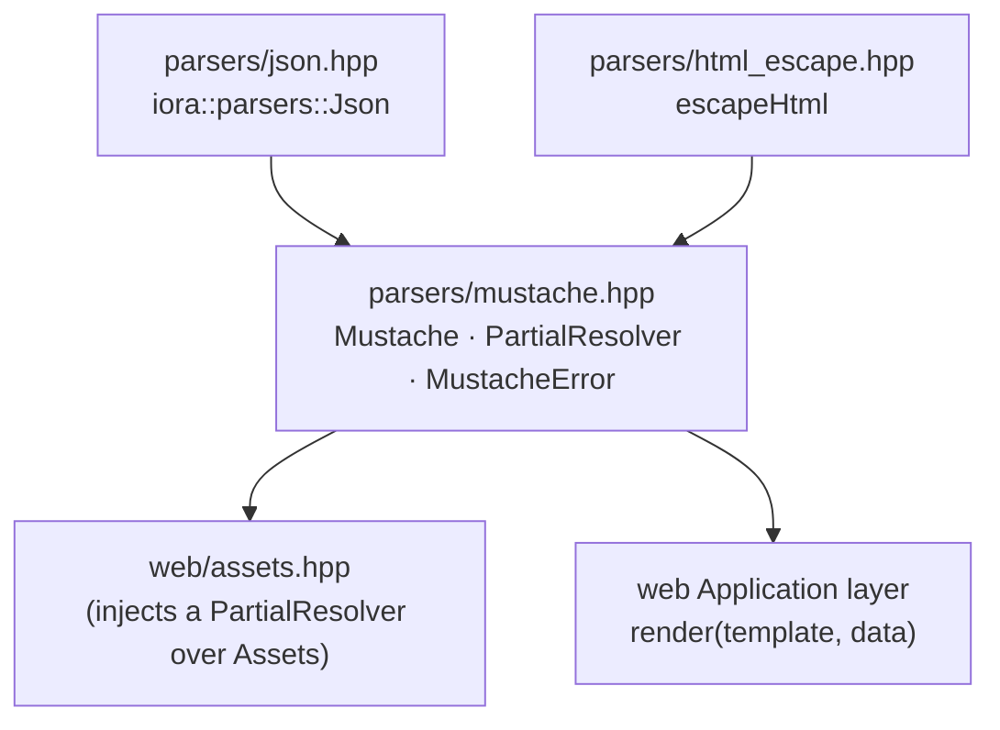
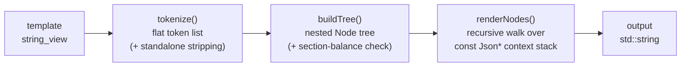

# Mustache Template Engine — Architecture & Programmer's Guide

[Back to index](../../README.md)

| | |
|---|---|
| **Component** | `iora::parsers::Mustache` — logic-less Mustache engine over `iora::parsers::Json` |
| **Version** | 1.0.1 |
| **Date** | 2026-09-09 |
| **Status** | IMPLEMENTED |
| **Header** | `include/iora/parsers/mustache.hpp` (header-only) |
| **Namespace** | `iora::parsers` |
| **Dependencies** | `<cstddef>`, `<cstdio>`, `<functional>`, `<optional>`, `<stdexcept>`, `<string>`, `<string_view>`, `<vector>`; `iora/parsers/json.hpp`; `iora/parsers/html_escape.hpp` |
| **Public symbols** | `Mustache::render`, `PartialResolver`, `MustacheError` |
| **Architecture ref** | `architecture/iora/mustache_engine.json` |
| **Tracker ref** | `tasks/iora/completed/2026-05-29-3_htmx-support_phase2b_mustache-engine_P2.json` |

---

## Revision History

| Version | Date | Changes |
|---|---|---|
| 1.0.0 | 2026-05-30 | Initial implementation: logic-less Mustache engine over `iora::parsers::Json`. Tags: `{{var}}` (escaped), `{{{var}}}`/`{{&var}}` (unescaped), `{{#s}}`, `{{^s}}`, `{{>p}}`, `{{!c}}`, dotted paths, implicit `{{.}}`. Spec-conformant standalone-line stripping + standalone-partial source-indentation. Render-recursion depth guard. 132 assertions / 17 test cases. |
| 1.0.1 | 2026-09-09 | Migrated into `iora/docs/parsers/` and re-verified every signature, default, qualifier, and behavioral claim against `include/iora/parsers/mustache.hpp`. No drift found: the `render()` signature, the `depthMax = 100` recursion bound, and the `isFalsy`/`formatScalar`/`resolve` semantics and tag grammar are all current. Test coverage confirmed at 132 assertions / 17 cases. |

---

## 1. Executive Summary

**Problem.** iora ships an HTTP server but no template engine. A server-rendered admin UI (the HTMX initiative) otherwise builds HTML by hand-concatenating strings — error-prone and unsafe (no escaping by default). Because iora ships its *own* JSON value type (`iora::parsers::Json`, not nlohmann), an off-the-shelf C++ Mustache library cannot bind to it without an adapter, and `iora::parsers::Json` has several sharp edges that a naive engine falls into and either crashes the server or silently corrupts the caller's data:

- the non-`const` `operator[]` **default-inserts** (reading a missing key mutates the object);
- `operator bool()` treats an **empty array/string as `true`** — the opposite of Mustache section falsiness;
- `operator std::string()`/`dump()` render a double as `"1.000000"` and JSON-quote strings — wrong for HTML;
- the `const` accessors (`getInt`, `getString`, …) **throw `Json::type_error`** on a type mismatch, and `size()` throws for scalar kinds.

**Solution.** A single header-only class, `iora::parsers::Mustache`, with one public entry point:

```cpp
static std::string render(std::string_view tmpl, const Json& data,
                          const PartialResolver& partials = {});
```

It renders the **logic-less** Mustache subset against a `const Json&` context, HTML-escaping by default, and is built specifically to honor every `iora::parsers::Json` sharp edge: `const`-only traversal (cannot mutate the caller's data), bespoke truthiness, `isX()`-gated access (cannot throw `Json::type_error`), explicit scalar formatting, and a render-recursion depth bound.

**Why it matters.**

- *Safety.* `{{var}}` routes through `iora::parsers::escapeHtml` — see [`docs/parsers/html_escape.md` §3.1](html_escape.md#31-escapehtml) for the escaper's full contract — making interpolation into HTML body and **quoted** attributes XSS-safe by default. The unescaped forms `{{{var}}}`/`{{&var}}` are opt-in.
- *Correctness.* Sections iterate **arrays only** (deterministic vector order); object-member iteration is deliberately unsupported because `Json::Object` is an unordered map. The same template + data render byte-identical across runs.
- *Robustness.* No Json access can throw out of `render()`; a malformed-typed context yields *defined* behavior (empty interpolation / skipped section), never a crash. A missing key is never an error.

**Two behaviors you must know before using it** (detailed in §11):

1. **Numeric zero is TRUTHY.** `{{#count}}…{{/count}}` with `count == 0` renders its body once. The falsy set is exactly `{ null, false, empty array, empty string }`.
2. **Escaping is HTML-context ONLY.** `{{var}}` is safe in HTML text and *quoted* attributes; it is **not** a URL-, JS-, CSS-, or unquoted-attribute escaper.

---

## 2. System Architecture

### 2.1 Position in the dependency graph

The engine is **tier 1** of the HTMX initiative: it sits directly on the two tier-0 parser leaves and is consumed by the higher web layers.



**Layering invariant (MEP-10).** `parsers/` must not depend on `web/`. Since `web/assets.hpp` already depends on the Mustache engine (it renders templates), a `mustache → assets` edge would be a dependency *cycle*. Therefore partial resolution is a **caller-supplied callback** (`PartialResolver`); the Assets-backed "auto-load a partial by name" convenience is constructed in the web layer and passed *in*. The engine's only includes are `parsers/json.hpp` and `parsers/html_escape.hpp`.

### 2.2 Render pipeline

`render()` is a thin wrapper over a three-stage pipeline:



1. **`tokenize`** — a single forward pass turns the template into a flat list of literal and tag tokens, classifying each tag by its leading sigil, applying Mustache standalone-line stripping, and capturing standalone-partial indentation.
2. **`buildTree`** — folds the flat list into a tree, nesting section bodies and validating that every `{{#}}`/`{{^}}` has a correctly-named `{{/}}`.
3. **`renderNodes`** — recursively walks the tree against a `std::vector<const Json*>` context stack, resolving names, formatting/escaping scalars, iterating sections, and expanding partials.

### 2.3 Threading model

The engine is **stateless and reentrant**. `render()` and every helper are `static`; there is no shared mutable state. `render()` is safe to call concurrently from multiple threads, including on the same `const Json&` (it never mutates the data). The only externally-supplied state is the `PartialResolver` callback — its own thread-safety is the caller's responsibility.

---

## 3. Component Deep Dive

### 3.1 Token model

The tokenizer emits a flat `std::vector<FlatTok>`. A `FlatTok` is one of:

| Kind | Source | Carried data |
|---|---|---|
| `Literal` | verbatim text run | owning `text` |
| `Variable` | `{{name}}` | owning `name` |
| `Unescaped` | `{{{name}}}` or `{{&name}}` | owning `name` |
| `SectionOpen` | `{{#name}}` | owning `name` |
| `InvertedOpen` | `{{^name}}` | owning `name` |
| `SectionClose` | `{{/name}}` | owning `name` |
| `Partial` | `{{>name}}` | owning `name`, owning `indent` |
| `Comment` | `{{!…}}` | — (dropped after standalone handling) |

**Owning names are load-bearing.** A token's tag name is stored as an *owning* `std::string`, never a `std::string_view` into the source buffer. This is required because a partial's source is a **temporary** `std::string` returned by the resolver; if names were views into it, the token vector would dangle the moment that temporary expired (cpp M-3).

`buildTree` converts the flat list into a `Node` tree:

```cpp
struct Node
{
  NodeType type;              // Literal, Variable, Unescaped, Section, Inverted, Partial
  std::string text;           // literal content OR tag name
  std::string indent;         // standalone partial indent
  std::vector<Node> children; // section / inverted-section body
};
```

### 3.2 Tokenizer — three passes

`tokenize(std::string_view)` runs three passes over the buffer:

**Pass 1 — scan tags.** Find each `{{`. If the next char is `{`, it is a triple-stache `{{{ … }}}` (always unescaped interpolation) closed by `}}}`; otherwise it is a `{{ … }}` tag closed by `}}`. An unterminated tag (`{{`/`{{{` with no closing delimiter before end-of-input — including an unterminated `{{!comment`) throws `MustacheError`. Inner content is **trimmed** of leading/trailing ASCII whitespace, then classified by its first character (the sigil):

| Sigil | Kind | Name |
|---|---|---|
| `#` | SectionOpen | `trim(rest)` |
| `^` | InvertedOpen | `trim(rest)` |
| `/` | SectionClose | `trim(rest)` |
| `>` | Partial | `trim(rest)` |
| `!` | Comment | — |
| `&` | Unescaped | `trim(rest)` |
| `=` | — | **throws** `MustacheError` (set-delimiter tags are unsupported in v1) |
| *(none)* | Variable | the whole trimmed inner |

An empty tag (`{{}}` or `{{ }}`) trims to an empty name and is classified `Variable` with an empty name, which resolves to nothing and emits nothing. Because the inner is trimmed first, `{{ name }}` ≡ `{{name}}`, `{{# name }}` ≡ `{{#name}}`, and section open/close match on the trimmed name (dotted names compared verbatim after trim).

> **Set-delimiter rejection.** A `{{=<% %>=}}` tag is rejected loudly rather than silently parsed as a variable named `=<% %>=`. Silently mis-rendering the *rest* of the template with the wrong (still default) delimiters is worse than a clear error (web L-1).

**Pass 2 — standalone detection.** For each *standalone-eligible* tag (section open/close, comment, partial — **never** an interpolation tag), the pass inspects the **raw buffer** (immune to later mutation) to decide whether the tag stands alone on its line:

- **Left clear:** everything from the previous newline (or beginning-of-input) up to the tag is spaces/tabs only.
- **Right clear:** optional spaces/tabs after the tag, then a newline (`\n`, or a full `\r\n` consumed as one) or end-of-input.

If both hold, the tag is *standalone*: the leading whitespace on its line and the trailing newline are removed from the output. For a standalone **partial**, the leading whitespace is *captured* as its `indent` (used in §3.6), not merely discarded.

**Pass 3 — materialize.** Walk the buffer emitting the literal "gaps" between tags, with each standalone tag's captured `leftTrimStart`/`rightTrimEnd` offsets folded into the gap boundaries, then emit the tag tokens (comments are dropped). Operating on raw-buffer offsets means **adjacent** standalone tags (e.g. `{{#a}}\n{{/a}}`) each strip their own line correctly, with no interference.

### 3.3 Truthiness — `isFalsy` (MEP-3)

```cpp
static bool isFalsy(const Json& v);
```

The falsy set is exactly **`{ null, false, empty array, empty string }`**:

| Value | Falsy? |
|---|---|
| `null` | yes |
| `false` / `true` | yes / no |
| empty array `[]` / non-empty array | yes / no |
| empty string `""` / non-empty string | yes / no |
| object (any) | no (truthy) |
| **`0` / `0.0`** | **no (truthy)** |

It uses `isX()` gates only — **never** `Json::operator bool()` (which would treat `[]`/`""` as `true`) and **never** an unguarded `size()` (which *throws* for scalar kinds). Empty-collection tests read `getArray().empty()` / `getString().empty()` strictly behind their `isArray()`/`isString()` gates.

### 3.4 Scalar formatting — `formatScalar` (MEP-6)

```cpp
static std::string formatScalar(const Json& v);
```

| Type | Output |
|---|---|
| string | the raw characters |
| int64 | `std::to_string` |
| double | `snprintf(buf, sizeof buf, "%g", d)` into `char buf[32]` |
| bool | `"true"` / `"false"` |
| null, array, object | empty string |

`%g` is the portable shortest-general format: it drops trailing zeros (`1.0 → "1"`, `1.5 → "1.5"`) and switches to scientific notation only for large/small magnitudes (`1e300 → "1e+300"`). The engine deliberately avoids `printf %f` (which pads `1.000000`) and `std::to_chars<double>` (libstdc++ floating-point `to_chars` support is version-dependent and not portable across iora's toolchains). `buf[32]` is provably sufficient for `%g` at default precision (worst case ≈ 14 chars). `Json::operator std::string()`/`dump()` are never used.

### 3.5 Name resolution — `resolve` (MEP-2 / MEP-5)

```cpp
static const Json& resolve(const std::string& name,
                           const std::vector<const Json*>& stack);
```

- The implicit iterator `"."` resolves to the **innermost** stack frame.
- For a dotted path `a.b.c`, the **first** segment (`a`) walks the context stack innermost → outermost (Mustache lexical scoping); the first frame that `isObject() && contains("a")` wins.
- Every **subsequent** segment descends **only** from the resolved node — the stack is *not* re-walked. So an outer-scope key sharing a missing tail's name is never picked up.
- A missing key, a non-object node mid-path, or an empty segment (`a..b`) yields a static **null sentinel** (renders empty / makes a section falsy). It is never an error.

Resolution uses **only** three non-throwing primitives: `isObject()`, `contains()`, and the `const` `operator[]` (which returns a static null sentinel rather than mutating or throwing). It never uses `find()` (throws `type_error` on a non-object), `at()` (throws on miss), `items()`, or the non-`const` `operator[]` (default-inserts). This is what makes the engine incapable of mutating the caller's `const Json&`.

### 3.6 Renderer — `renderNodes`

```cpp
static void renderNodes(const std::vector<Node>& nodes,
                        std::vector<const Json*>& stack,
                        const PartialResolver& partials, int depth,
                        std::string& out);
```

Per node:

- **Literal** → append verbatim.
- **Variable** → `out += escapeHtml(formatScalar(resolve(name)))`. `escapeHtml` is `iora::parsers::escapeHtml` (see [`docs/parsers/html_escape.md` §3.1](html_escape.md#31-escapehtml) for its character set and context boundary) — this is the escape-by-default path.
- **Unescaped** → `out += formatScalar(resolve(name))` (no escaping).
- **Section** → resolve `name`; if `isFalsy`, render nothing. If a (non-empty) **array**, push each element and render the body once per element in vector order. Otherwise (object or non-falsy scalar) push the value and render the body **once**. No object-member iteration.
- **Inverted** → resolve `name`; render the body **once iff** `isFalsy`. Never pushes a context.
- **Partial** → see §3.7.

The **depth guard** (`depth > depthLimit()`, where `depthLimit()` mirrors `ParseLimits::depthMax` = 100) is checked on entry and throws `MustacheError` before recursing further. Both section descent **and** partial expansion pass `depth + 1`, so the bound covers *total* render recursion (MEP-7). `buildTree` carries a complementary parse-time guard on static section nesting, so a pathologically deep template is caught even before render.

### 3.7 Partials — lazy, shared-context, source-indented (MEP-7)

When a `{{>name}}` node is **reached**:

1. If the resolver is empty, or returns `std::nullopt`, throw `MustacheError`. (Resolution is **lazy** — a `{{>name}}` inside a skipped/falsy section is never reached, so an empty resolver does not throw there.)
2. If the partial token is **standalone**, apply its captured `indent` to the partial **source** (§3.8) *before* tokenizing.
3. Hold the (possibly indented) source in a **local** `std::string` that outlives the recursive call, tokenize + `buildTree` it, and `renderNodes(…, depth + 1)` on the **same live context stack** — so the partial sees the caller's current context (Mustache partials are lexically scoped to the inclusion point), not a fresh root.

The shared live stack plus `depth + 1` is what makes a self-referential or mutually-recursive partial set terminate with `MustacheError` instead of overflowing the C++ stack.

### 3.8 Standalone-partial indentation — `applyIndent`

```cpp
static std::string applyIndent(const std::string& src, const std::string& indent);
```

A standalone `{{>p}}` with leading whitespace indents the partial's lines. The indent is applied to the **source** before rendering, **not** to the rendered output. The rule (matching mustache.js `indentPartial`):

- prepend `indent` at the start **unless** the source begins with a newline;
- after every interior newline **immediately followed by a non-newline character**, insert `indent`;
- do **not** indent before an empty line (a blank source line stays empty — never becomes a trailing-whitespace line);
- do **not** indent after a trailing newline (no trailing indented blank line).

**Why source, not output.** Applying indentation to the source means newlines *injected by interpolated data* are **not** re-indented. This is the spec's "Standalone Indentation" requirement. Worked example:

```
template:  " {{>p}}"            (one-space indent)
partial p: "|\n{{{content}}}\n|\n"
data:      { "content": "<\n->" }

indent applied to SOURCE first → " |\n {{{content}}}\n |\n"
then {{{content}}} expands to the raw "<\n->"
output:    " |\n <\n->\n |\n"   ← the "->" line has NO indent (it came from data)
```

---

## 4. Usage Guide

### 4.1 Quick start

```cpp
#include <iora/parsers/mustache.hpp>
#include <iora/parsers/json.hpp>

using iora::parsers::Json;
using iora::parsers::Mustache;

Json data;
data["name"] = Json("World");
std::string out = Mustache::render("Hello, {{name}}!", data);
// out == "Hello, World!"
```

### 4.2 Building the data context

`render()` takes a `const Json&`. Build it with the normal `Json` API (the non-`const` `operator[]` *intentionally* inserts here — that is fine for *constructing* data; the engine itself only ever reads):

```cpp
Json page;
page["title"] = Json("Users");

Json ada;
ada["name"] = Json("Ada");
ada["admin"] = Json(true);

Json linus;
linus["name"] = Json("Linus");
linus["admin"] = Json(false);

page["users"] = Json::Array{ada, linus};       // sections iterate arrays
```

```html
<h1>{{title}}</h1>
<ul>
{{#users}}
  <li>{{name}}{{#admin}} (admin){{/admin}}</li>
{{/users}}
</ul>
```

The standalone `{{#users}}` / `{{/users}}` lines leave no blank lines in the output.

### 4.3 Escaped vs unescaped

```cpp
Json d; d["html"] = Json("<b>hi</b> & 'x'");
Mustache::render("{{html}}",   d);  // "&lt;b&gt;hi&lt;/b&gt; &amp; &#39;x&#39;"
Mustache::render("{{{html}}}", d);  // "<b>hi</b> & 'x'"   (verbatim)
Mustache::render("{{&html}}",  d);  // "<b>hi</b> & 'x'"   (verbatim — same as triple-stache)
```

### 4.4 Partials

```cpp
auto resolver = [](std::string_view name) -> std::optional<std::string>
{
  if (name == "row")
  {
    return std::string("<li>{{name}}</li>");
  }
  return std::nullopt;               // unknown partial → MustacheError when reached
};

Json d; d["name"] = Json("Ada");
Mustache::render("{{>row}}", d, resolver);   // "<li>Ada</li>"  (partial sees d.name)
```

In the web layer the resolver typically closes over an `Assets` instance to auto-load partial templates by name.

### 4.5 Common patterns & gotchas

| Want | Do | Don't |
|---|---|---|
| Conditional block | `{{#flag}}…{{/flag}}` with a `bool` | expect `{{#count}}` to hide when `count == 0` (zero is **truthy**) |
| "Empty state" | `{{^items}}No items{{/items}}` | iterate object members (`{{#obj}}{{key}}{{/obj}}` renders **once**, not per member) |
| Numeric formatting | format in C++ before `render` | rely on the template (logic-less: no arithmetic/format specifiers) |
| URL/JS context | escape in C++ for that context, or build the attribute safely | put `{{var}}` in an `href`/`<script>`/unquoted attribute (see §11) |
| Repeated/ordered output | use an **array** | use an object (unordered → nondeterministic; unsupported) |

### 4.6 Anti-patterns

- **Business logic in templates.** The engine is logic-less *by design* (permanent, not a v1 shortcut). Compute decisions and formatting in C++ and place the results in the `Json` context.
- **Rendering attacker-controlled *template source*.** Template source is assumed author-trusted (developer-written / shipped assets). Only the *data* is treated as untrusted. (See §11.)
- **Expecting object-member iteration.** `{{#obj}}…{{/obj}}` renders the body once with the object pushed as context, not once per key. There is no key/value loop; use an array for repeated output.
- **Relying on `0` being falsy.** Numeric zero renders a section body and suppresses its inverted counterpart. Guard the zero case in C++ if you need JS-style falsiness.

---

## 5. Call Flow Reference

### 5.1 `render("Hi {{name}}", {name:"Ada"})`

```
render
 ├─ tokenize("Hi {{name}}")           → [Literal "Hi ", Variable "name"]
 ├─ buildTree(...)                     → [Literal "Hi ", Variable "name"]
 └─ renderNodes(depth=0, stack=[root])
     ├─ Literal "Hi "                  → out = "Hi "
     └─ Variable "name"
         ├─ resolve("name")            → root["name"] = "Ada"
         ├─ formatScalar               → "Ada"
         └─ escapeHtml                 → "Ada"   → out = "Hi Ada"
```

### 5.2 Array section `{{#users}}…{{/users}}`

```
renderNodes
 └─ Section "users"
     ├─ resolve("users")               → array of 2
     ├─ isFalsy(array)? no (non-empty)
     ├─ isArray? yes
     ├─ element 0: stack.push(&u0); renderNodes(depth+1); stack.pop()
     └─ element 1: stack.push(&u1); renderNodes(depth+1); stack.pop()
```

### 5.3 Standalone partial expansion `"  {{>p}}\n"`, `p = "X\n{{>q}}\nY\n"`

```
renderNodes
 └─ Partial "p" (standalone, indent="  ")
     ├─ partials("p")                  → "X\n{{>q}}\nY\n"
     ├─ applyIndent(src, "  ")         → "  X\n  {{>q}}\n  Y\n"   (the {{>q}} line is now indented → standalone)
     ├─ tokenize + buildTree(indented source)
     └─ renderNodes(depth+1, same stack)
         ├─ Literal "  X\n"
         ├─ Partial "q" (standalone, indent="  ")  → q expanded, indented one level
         └─ Literal "  Y\n"
```

### 5.4 Failure path — unbalanced section `{{#a}}body`

```
render
 ├─ tokenize("{{#a}}body")             → [SectionOpen "a", Literal "body"]
 └─ buildTree(...)
     ├─ SectionOpen "a": recurse (inSection=true, openName="a")
     │   ├─ Literal "body"
     │   └─ end-of-tokens reached while inSection
     └─ throw MustacheError("unclosed section {{#a}}")
```

`render()` propagates the `MustacheError`; no output string is produced.

---

## 6. Thread Safety Model

| Operation | Safety |
|---|---|
| `Mustache::render(...)` from many threads, distinct data | Safe — stateless, no shared state. |
| `Mustache::render(...)` from many threads, **same `const Json&`** | Safe — the engine never mutates the data; it holds only `const Json*`. |
| The `PartialResolver` callback | Caller's responsibility — if it touches shared mutable state (e.g. an `Assets` cache), the caller must make that thread-safe. |

There are no mutexes, atomics, or condition variables in the engine. The context stack (`std::vector<const Json*>`) is a per-call local; pointers in it reference the caller's data and per-element array entries, which are stable for the duration of `render()` because the engine never mutates the `Json`.

---

## 7. Configuration Reference

The engine has no runtime configuration object. The single tunable is inherited from the JSON parser:

| Parameter | Source | Default | Effect |
|---|---|---|---|
| Render-recursion depth limit | `iora::parsers::ParseLimits::depthMax` (`json.hpp`) | `100` | Maximum total render recursion (section nesting + partial expansion) and maximum static section nesting at parse time. Exceeding it throws `MustacheError`. |

There is deliberately **no** template-length or tag-count cap in v1 (template source is author-trusted — see §11). The escaping policy (five-character HTML escape) is fixed and lives in `iora::parsers::escapeHtml`.

---

## 8. API Reference

```cpp
namespace iora::parsers
{

/// Structural template error (NOT thrown for missing values).
class MustacheError : public std::runtime_error
{
  using std::runtime_error::runtime_error;
};

/// Maps a partial name to its template source; std::nullopt → unknown
/// (MustacheError when the {{>name}} is reached). Resolution is lazy.
using PartialResolver =
  std::function<std::optional<std::string>(std::string_view name)>;

class Mustache
{
public:
  /// Render `tmpl` against `data`, resolving partials via `partials`.
  /// Throws MustacheError on a structural template error; never throws
  /// Json::type_error (all access is isX()-gated).
  static std::string render(std::string_view tmpl, const Json& data,
                            const PartialResolver& partials = {});
};

} // namespace iora::parsers
```

**`MustacheError` is thrown for:** unbalanced section (`{{#a}}` with no `{{/a}}`), stray close (`{{/a}}` with no open), mismatched close (`{{#a}}…{{/b}}`), unterminated tag (`{{`/`{{{`/`{{!` with no closing delimiter), a `{{=…=}}` set-delimiter tag, a reached `{{>name}}` with no resolver or an unknown partial, and render-recursion depth exceeded.

**`MustacheError` is NOT thrown for:** missing keys, out-of-range, `null`, or type mismatches — these are defined empty/falsy behavior.

### Supported tags

| Tag | Meaning |
|---|---|
| `{{name}}` | Escaped interpolation (HTML-escaped). |
| `{{{name}}}` | Unescaped interpolation (verbatim). |
| `{{&name}}` | Unescaped interpolation (verbatim) — alternate form. |
| `{{#name}}…{{/name}}` | Section: falsy → nothing; non-empty array → once per element; object/non-falsy scalar → once. |
| `{{^name}}…{{/name}}` | Inverted section: body once iff falsy. |
| `{{>name}}` | Partial (lazy, shared context, standalone-indented). |
| `{{!comment}}` | Comment (emits nothing). |
| `{{.}}` | Implicit iterator (innermost context frame). |
| `a.b.c` | Dotted path (any name position). |

---

## 9. Design Decisions

| ID | Decision | Rationale |
|---|---|---|
| LD-2 | Build a minimal in-house engine over `iora::parsers::Json`; no external dep. | Full control, zero deps, binds to the native Json type. |
| MEP-1 / R-1 | Logic-less, permanently. | Prevents "business logic in HTML". Expressive needs get a *separate* engine later, never bolted on. |
| CONST-TRAP | `const Json&` only; resolve via `isObject()+contains()+const operator[]`, never `find()`. | Non-`const` `operator[]` default-inserts; `find()` throws on a non-object. A `const`-only engine cannot corrupt caller data. |
| H-2 | Bespoke `isFalsy()`, never `operator bool()`. | `operator bool()` treats `[]`/`""` as `true` — opposite of Mustache. |
| H-3 | Sections iterate arrays only. | `Json::Object` is an unordered map → nondeterministic member order. |
| M-2 | `isX()`-gate every access. | `const` accessors throw `Json::type_error`; `size()` throws for scalars. |
| SCALAR-FMT | Explicit `%g` via `snprintf`; never `dump()`/`to_chars<double>`. | `dump()` renders `1.000000`/quotes; `to_chars<double>` is not portable across iora's toolchains. |
| RENDER-DEPTH | Bound *total* recursion (sections + partials) by `depthMax`. | A cyclic partial set or pathologically deep template would otherwise overflow the C++ stack. |
| STANDALONE-LINE | Spec-conformant standalone stripping + standalone-partial **source** indentation. | Otherwise a section/comment/partial tag alone on its line leaves a stray blank line / broken indentation. Indenting the source (not the output) keeps data-injected newlines un-indented. |
| OQ-11 / MEP-10 | Partials via a caller-supplied callback; Assets convenience injected from `web/`. | `parsers/` must not depend on `web/` (cycle). |
| web L-1 | Reject `{{=…=}}` set-delimiter tags with `MustacheError`. | Silently mis-rendering the rest of the template is worse than a clear error. |

---

## 10. Known Limitations

- **No conditionals, comparisons, arithmetic, filters, or lambdas** — logic-less by design. Compute everything in C++ before `render`.
- **No object-member section iteration.** A section over an object renders its body once; there is no `{{#obj}}{{key}}{{/obj}}` member loop. Use arrays for ordered/repeated output.
- **No strict mode.** A missing variable is empty/falsy, never an error (deferred to a future opt-in).
- **No custom delimiters.** `{{=<% %>=}}` is unsupported and rejected with `MustacheError`; only default `{{ }}` / `{{{ }}}`.
- **No dotted numeric array indexing.** `{{items.0}}` is not part of the v1 grammar; arrays are consumed via sections.
- **`{{{var}}}` / `{{&var}}` perform no escaping** — the caller owns the safety of unescaped content.

---

## 11. Critical Behaviors (read before using)

### 11.1 Numeric zero is TRUTHY

The integer `0` and the double `0.0` are **not** falsy. The falsy set is exactly `{ null, false, empty array, empty string }`.

```cpp
Json d; d["count"] = Json(0);
Mustache::render("{{#count}}has count{{/count}}", d);   // "has count"  (body renders ONCE, 0 pushed as context)
Mustache::render("{{^count}}none{{/count}}", d);         // ""           (inverted does NOT render)
```

This is a deliberate divergence from JavaScript falsiness and from some Mustache implementations that treat `0` as falsy. If you are porting templates that relied on `0`-is-falsy, **guard the zero case in C++** before `render` (e.g. set the key to `false` or omit it) — do not rely on the template.

### 11.2 Escaping is HTML-context ONLY

`{{var}}` routes through `iora::parsers::escapeHtml` — see [`docs/parsers/html_escape.md` §3.1](html_escape.md#31-escapehtml) for the exact character set (`& < > " '`, single-quote → `&#39;` decimal) and the HTML-body/quoted-attribute context boundary it implements. The mustache-specific consequence: `{{var}}` is escaped **by default**, but that escaping is **NOT** a URL-, JS-, CSS-, or unquoted-attribute escaper — never place `{{var}}` directly into an `href`/`src`, an inline `<script>`/`<style>` body, or an unquoted attribute without separate, caller-side encoding.

```cpp
Json d; d["url"] = Json("javascript:alert(1)");
Mustache::render("<a href=\"{{url}}\">x</a>", d);
// "<a href=\"javascript:alert(1)\">x</a>"  ← scheme intact; escapeHtml is not a URL escaper
```

These are *awareness* facts, not behaviors the engine fixes. The engine's contract is: **escape-by-default for HTML text and quoted attributes; everything else is the caller's responsibility.** The *data* context is always treated as untrusted (hence escape-by-default and non-throwing access); the *template source*, by contrast, is assumed author-trusted (developer-written / shipped assets), which is why there is no template-length/tag-count cap. If you ever render attacker-influenced template *source*, add length/tag-count caps before doing so.

---

## 12. Test Coverage

`tests/web/test_mustache.cpp` — **132 assertions / 17 cases** (registered in `tests/CMakeLists.txt` via the `WEB_TESTS` set; build with `-DIORA_BUILD_WEB_TESTS=ON`, run with `ctest -R mustache -j1`). Coverage maps 1:1 to the architecture test strategy:

| Group | What it pins |
|---|---|
| interpolation | strings, dotted paths, missing/null → empty, implicit `{{.}}`, present-head/missing-tail, no stack re-walk after the first segment, empty-segment `a..b`, whitespace-trimmed names |
| scalar formatting | string/int/`%g` double (incl. `1e300`)/bool/null; array/object → empty; **no `Json::type_error` for any type** |
| escaping | `<`/`>`/`&`/`"`; single-quote → exactly `&#39;`; byte-exact combined payload (no double-escape); `{{{}}}` and `{{&}}` verbatim |
| XSS awareness | `javascript:` URI passthrough, JS-string-break payload, `{{{}}}` vs `{{}}` on `</script>`, unquoted-attribute injection, `data:` scheme passthrough |
| sections — arrays | 3× in order, empty skipped, **byte-identical determinism** across repeated renders, nested, element shadowing, outer visibility |
| sections — scalar/object once | object renders once (no member loop), `true`, non-empty string, **integer 0 renders once** |
| sections — dotted head | `{{#a.b}}` over array/object, `{{^a.b}}` falsy/non-falsy, dotted close matches |
| inverted | renders iff falsy across the full falsy set; **0/0.0 do NOT render** |
| standalone-line | section block (no blank lines), standalone comment, BOF/EOF, interpolation-never-standalone, inline-trims-nothing, indented section/inverted, internal-whitespace, multiline comment, **5 inverted-standalone spec variants** |
| standalone-partial indentation | basic, **data-injected newline not re-indented**, without-newline, without-previous-line, **CRLF**, non-standalone, padding+name-trim, nested composition, **blank-interior-line not indented** |
| comments | emit nothing; braces/lone-`}`/literal-`{{` consumed; unterminated → `MustacheError` |
| partials | expand, shared context, `nullopt` → error, empty-resolver-reached → error, no-partials default, **lazy** (skipped normal & inverted sections don't resolve) |
| recursion depth | self-referential partial, mutual recursion, deep static nesting → `MustacheError` |
| syntax errors | unbalanced / stray / mismatched / unterminated / unterminated-triple → `MustacheError` |
| set-delimiter | `{{=…=}}` → `MustacheError` |
| const-correctness | `dump()` byte-identical before/after render (non-object at a path not converted; missing key not inserted) |
