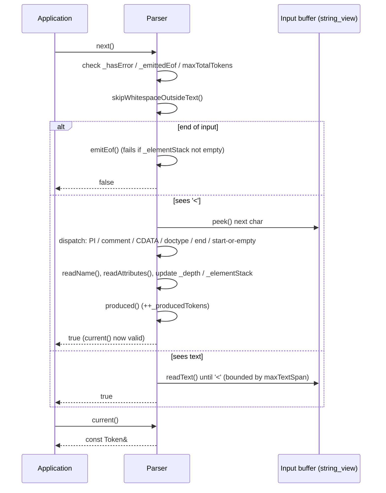

# Iora XML Parser — Architecture & Programmer's Guide

[Back to index](../../README.md)

| | |
|---|---|
| **Version** | 1.0 |
| **Date** | 2026-09-09 |
| **Status** | IMPLEMENTED |
| **Header** | `include/iora/parsers/xml.hpp` |
| **Namespace** | `iora::parsers::xml` |
| **Dependencies** | C++17 standard library (`<algorithm>`, `<cstddef>`, `<cstdint>`, `<functional>`, `<limits>`, `<memory>`, `<stdexcept>`, `<string>`, `<string_view>`, `<utility>`, `<vector>`) plus one intra-Iora header: `iora/core/unicode.hpp` (shared UTF-8 encoder `iora::core::appendUtf8` / hex-digit helper `iora::core::hexDigitValue`, used by numeric char-ref decoding). No external dependencies. |

## 2. Revision History

| Version | Date | Changes |
|---------|------|---------|
| 1.0 | 2026-09-09 | Initial guide for the single-header, non-validating XML 1.0 parser (pull / SAX / DOM). |

---

## 3. Executive Summary

### Problem

Iora is a zero-external-dependency C++17 microservice framework. Services routinely need to
consume XML: SOAP envelopes, RSS/Atom feeds, provisioning payloads, and configuration files.
Pulling in libxml2, Expat, or RapidXML would violate the framework's "no external dependencies"
constraint and drag in a large, general-purpose (and historically CVE-prone) surface — DTD
processing, external entity resolution, and validation machinery that a microservice almost never
wants and that is the source of the classic XML attack classes (XXE, billion-laughs).

Without a purpose-built parser, teams hand-roll ad-hoc string scanning per call site, which is
error-prone (tag balance, entity decoding, attribute quoting) and repeatedly re-implements the
same subset of XML with the same subset of bugs.

### Solution

A single-header, non-validating XML 1.0 tokenizer that is **safe by default** and exposes three
layered API styles over one shared pull engine:

- **`iora::parsers::xml::Parser`** — a pull tokenizer. `next()` advances one token at a time;
  `current()` returns a `Token` whose `name`/`text`/attribute views are zero-copy slices of the
  caller's input buffer. This is the engine; SAX and DOM are built on it.
- **`iora::parsers::xml::SaxCallbacks` + `runSax()`** — event-driven dispatch. Register any subset
  of `std::function` callbacks; `runSax()` drives the pull parser and fires the ones you set.
  (Gated by `IORA_XML_ENABLE_SAX`, default on.)
- **`iora::parsers::xml::DomBuilder` + `Node`** — builds an owned, navigable tree
  (`std::unique_ptr<Node>`) with `childByName()`, `getAttribute()`, `getTextContent()` helpers.
  (Gated by `IORA_XML_ENABLE_DOM`, default on.)

Safety is structural: there is no DTD/entity-declaration processing and no external-entity
resolution at all, and a set of configurable numeric limits (`Options`) bounds depth, attribute
count, name length, text span, and total token count.

### Technical Impact

- **Zero-copy tokenization.** `Token::name`, `Token::text`, and `Attribute` are `std::string_view`
  slices into the caller's buffer — no allocation per token in the pull path.
- **Zero external dependencies.** Header-only; nothing beyond the C++17 standard library and one
  intra-Iora header (`iora/core/unicode.hpp`, the shared UTF-8 / hex-digit helpers).
- **XXE and billion-laughs are structurally impossible.** Custom/parameter entities are never
  declared or expanded, so recursive-expansion and external-reference attacks have no mechanism
  to fire (see § 5 and § 11).
- **Bounded work.** Every unbounded dimension of an XML document (nesting, attributes, name and
  text length, token count) has an explicit `Options` limit; the defaults bound resource use even
  when the caller does not configure anything.
- **Single-threaded and lock-free by construction.** No mutexes or atomics; a `Parser` instance is
  cheap and self-contained.

---

## 4. System Architecture

### 4.1 Component Relationships

```
iora::core::unicode  (intra-Iora dependency, iora/core/unicode.hpp)
│      appendUtf8()      shared UTF-8 encoder (used by numeric char-ref decoding)
│      hexDigitValue()   shared hex-digit parser (used by hex char-ref decoding)
│
iora::parsers::xml
│
├── enum class TokenKind            Token type discriminant
│      Invalid, Eof, XmlDecl, Doctype, StartElement, EndElement,
│      EmptyElement, Text, CData, Comment, ProcessingInstruction
│
├── struct Error                    { offset, line, column, message }
│
├── struct Options                  Safety limits + feature toggles (all by-value)
│      permissive, namespaceProcessing, maxDepth, maxAttrsPerElement,
│      maxNameLength, maxTextSpan, maxTotalTokens
│
├── struct Attribute                { string_view name; string_view value; }  (zero-copy)
│
├── struct Token                    Current token produced by Parser
│      kind, name, text, attributes, selfClosing, depth, offset, line, column
│      + splitQName()               prefix/localName split (no URI resolution)
│
├── class MonotonicArena            Bump allocator (see Known Limitations — not wired to DomBuilder)
│
├── class Parser  ◄──────────────── THE ENGINE (owns the cursor + element stack)
│      Parser(string_view input, const Options& = Options{})
│      next() / current() / error()
│      static decodeEntities(string_view, string&, Error* = nullptr)
│      private: _input, _opt, _cur, _line, _col, _depth, _token,
│               _hasError, _error, _emittedEof, _producedTokens, _elementStack
│
├── [IORA_XML_ENABLE_SAX]
│      struct SaxCallbacks          9 optional std::function<void(const Token&)> slots
│      runSax(Parser&, const SaxCallbacks&) ──► drives Parser::next()
│
└── [IORA_XML_ENABLE_DOM]
       enum class NodeType          Document, Element, Text, CData, Comment, ProcessingInstruction
       class Node                   { type, name, value, attributes[], children[] (unique_ptr) }
              childByName() / getAttribute() / getTextContent()
       class DomBuilder
              static build(Parser&, Error* = nullptr) ──► drives Parser::next()
```

**Ownership.** The `Parser` does not own the input text — it holds a `std::string_view` (`_input`)
into a buffer the caller must keep alive. `Token`'s views likewise point into that same buffer.
The DOM path is the only one that copies: `DomBuilder::build` produces a `std::unique_ptr<Node>`
tree whose `Node::name`/`Node::value`/attributes are owned `std::string`s (entity-decoded), so a
DOM outlives the source buffer.

### 4.2 Data Flow — Pull-Parsing One Token



### 4.3 Threading Model

| Thread | Responsibility |
|--------|----------------|
| Caller's thread | Constructs the `Parser`, drives `next()`/`runSax()`/`DomBuilder::build`, reads `current()`/`Node`. All parser work runs synchronously on this one thread. |
| (none) | There is no background thread, no timer, no callback thread. The component contains no mutexes, atomics, or condition variables. |

A single `Parser` instance holds mutable cursor state (`_cur`, `_line`, `_col`, `_depth`,
`_token`, `_elementStack`) and is therefore **not** safe to share across threads without external
synchronization. Distinct `Parser` instances over distinct (or read-only shared) buffers are fully
independent and may run concurrently on different threads. See § 8.

---

## 5. Component Deep Dive

### 5.1 `Parser` — the pull tokenizer

`Parser` is the core state machine. It scans a contiguous `std::string_view` from front to back,
producing exactly one `Token` per successful `next()` call.

**Cursor and position tracking.** The private cursor `_cur` is a byte index into `_input`. Every
consuming step goes through `get()`, which increments `_cur` and maintains 1-based `_line`/`_col`
(a `'\n'` resets column to 1 and increments line). `peek()` reads without consuming; `advance()` is
`(void)get()`. This gives every token and every `Error` an accurate `offset`/`line`/`column`.

**Dispatch.** `next()` first honours three early exits — a sticky prior error
(`_hasError`), an already-emitted EOF (`_emittedEof`), and the total-token cap
(`maxTotalTokens`) — then skips inter-token whitespace and dispatches on the leading character:

- `'<'` followed by `'?'` → `readProcessingInstruction`
- `'<'` `'!'` `--` → `readComment`; `'<'` `'!'` `[CDATA[` → `readCData`;
  `'<'` `'!'` `DOCTYPE` (case-insensitive) → `readDoctype`
- `'<'` `'/'` → `readEndTag`
- `'<'` + name-start → `readStartOrEmptyTag`
- anything else → `readText`

**Element-balance validation.** `Parser` maintains `std::vector<std::string> _elementStack` of open
element names. `readStartOrEmptyTag` pushes the name for non-empty start tags; a
self-closing `<x/>` is **not** pushed. `readEndTag` requires a non-empty stack and an exact
top-of-stack name match, otherwise it fails with `"end tag without matching start tag"` or
`"mismatched end tag - expected </X> but got </Y>"`. `emitEof` fails with
`"unclosed elements at end of document: ..."` if the stack is non-empty at end of input.
This is the parser's well-formedness guarantee.

**Depth semantics.** `_depth` starts at 0; the root element's `StartElement` token has `depth == 1`.
For an `EndElement`, the token's reported `depth` is that of the element being closed
(`_depth + 1` after the internal decrement in `readEndTag`). Nesting is bounded: opening an element
when `_depth + 1 > maxDepth` fails with `"maximum element depth exceeded"` (`readStartOrEmptyTag`).

**Inter-element whitespace.** `skipWhitespaceOutsideText()` runs at the top of every
`next()` and consumes spaces/tabs/CR/LF until it reaches `'<'` or non-whitespace. Consequently,
whitespace that sits entirely between tags is discarded (no `Text` token is produced for it), and
leading whitespace of a mixed-content run is trimmed. Whitespace embedded inside a text run before
the next `'<'` is preserved. The parser is therefore not whitespace-preserving in the
`xml:space="preserve"` sense (see § 12).

**Error model.** `fail(msg)` sets `_hasError`, records `offset`/`line`/`column`/`message`,
and returns `false`. Once set, every subsequent `next()` returns `false`. `error()` returns a
`const Error*` — `nullptr` when clean. When compiled with `-DIORA_XML_THROW_ON_ERROR=1`, `fail`
instead throws `std::runtime_error(message)`; the default (`0`) is the non-throwing,
return-`false` model.

**`decodeEntities` (static).** Attribute and text slices are raw (un-decoded) by
design. `decodeEntities(in, out, err)` performs the decode: it recognizes exactly the five XML
predefined entities — `&lt;` `&gt;` `&amp;` `&apos;` `&quot;` — plus numeric character references
`&#DDD;` (decimal) and `&#xHH;` (hex, case-insensitive `x`). Any other `&name;` is rejected with
`"unknown entity"` and the comment in `decodeEntities` states the intent plainly:
*"external entities unsupported by design."* An unterminated `&` (no `;`) yields
`"unterminated entity"`. This is the security-critical routine: because there is no entity
*table* to populate and no DTD parsing, there is no way to define a recursive or external entity,
so entity-expansion attacks cannot be constructed.

**Numeric char-ref decoding (`appendCharRef`).** A code point is parsed then UTF-8
encoded via the shared `iora::core::appendUtf8` primitive (`core/unicode.hpp`); hex digits are
parsed via `iora::core::hexDigitValue`. Invalid digits
fail. A hex reference with no digits after `#x` (e.g. `&#x;`) is rejected — the code requires at
least one hex digit, so it does not silently decode to `U+0000`. Accumulation is bounded during
parse: a running value above `U+10FFFF` is rejected in-loop
before it can wrap. UTF-16 surrogate halves (`U+D800`–`U+DFFF`) and code points above `U+10FFFF`
are rejected by `appendUtf8` (`core/unicode.hpp`). Other XML-illegal characters (e.g. `U+0000`,
most C0 controls) are **not** rejected (see § 12).

### 5.2 `Token` and `Attribute`

`Token` is the unit produced by `next()`. Field meaning by kind:

| Kind | `name` | `text` | `attributes` | `selfClosing` |
|------|--------|--------|--------------|---------------|
| `StartElement` | element name | — | attribute list | `false` |
| `EmptyElement` | element name | — | attribute list | `true` |
| `EndElement` | element name | — | — | `false` |
| `Text` | — | raw text slice | — | `false` |
| `CData` | — | inner CDATA text (delimiters stripped) | — | `false` |
| `Comment` | — | inner comment text (`<!--`/`-->` stripped) | — | `false` |
| `ProcessingInstruction` | PI target | content after target up to `?>` | — | `false` |
| `Doctype` | — | name-and-ids slice (see § 12) | — | `false` |
| `Eof` | — | — | — | `false` |

All string members are `std::string_view` slices of the input buffer (zero-copy). `attributes` is a
`std::vector<Attribute>` — this is the one heap allocation the pull path may perform per
element-with-attributes.

`Token::splitQName()` splits `name` at the first `':'` into `{prefix, localName}`,
returning `{empty, name}` when there is no colon. It performs **no** namespace-URI resolution — it
is a pure lexical split, and it is always available regardless of the `Options::namespaceProcessing`
flag.

### 5.3 `SaxCallbacks` and `runSax`

`SaxCallbacks` is a struct of nine `std::function<void(const Token&)>` slots
(`onXmlDecl`, `onDoctype`, `onStartElement`, `onEndElement`, `onEmptyElement`, `onText`, `onCData`,
`onComment`, `onPI`). `runSax(parser, cb)` drives `parser.next()` to exhaustion and,
for each token, invokes the matching callback **only if it is set**. Unset slots are skipped; there
is no default handling. It returns `parser.error() == nullptr` — i.e. `true` on a clean run, `false`
if parsing failed. The callback receives the same `const Token&` that `current()` would return, so
its views are valid only during the call (they alias the input buffer, which is fine, but the
`attributes` vector is owned by the parser's current token and is overwritten on the next advance).

`onXmlDecl` is present in the struct but is never invoked, because the engine never produces an
`XmlDecl` token — see § 12.

### 5.4 `DomBuilder` and `Node`

`DomBuilder::build(parser, errOut)` constructs an owned tree. It seeds a
`Document` root, keeps a `std::vector<Node*>` stack, and for each token:

- `StartElement` → new `Element` node (attributes entity-decoded via `Parser::decodeEntities`),
  pushed as a child of the current top and onto the stack.
- `EmptyElement` → new `Element` node (attributes decoded) appended as a child; **not** pushed.
- `EndElement` → pops the stack; a pop that would empty the stack past the document root yields
  `"unbalanced end element"`.
- `Text` → entity-decoded; a node is created **only if the decoded string is non-empty**.
- `CData` / `Comment` / `ProcessingInstruction` → nodes carrying the raw text (CDATA and comment
  text are **not** entity-decoded — CDATA is by definition literal).
- `XmlDecl` / `Doctype` → ignored.

On completion it propagates any parser error into `errOut` and returns `nullptr`; it also returns
`nullptr` with `"unclosed elements at end of document"` if the stack did not unwind to just the
document. On success it returns the `Document` node.

`Node` owns its children as `std::vector<std::unique_ptr<Node>>` and its attributes
as `std::vector<Node::Attr>` (owned `std::string` name/value). Navigation helpers:
`childByName(n)` returns the first direct child *element* with that name or `nullptr`;
`getAttribute(n)` returns the attribute value or an empty `string_view`;
`getTextContent()` concatenates the `value` of all direct `Text` and `CData` children.

### 5.5 `MonotonicArena`

`MonotonicArena` is a bump allocator: `allocate(n)` rounds up to
`alignof(std::max_align_t)` and carves from the current block, doubling the block growth up to
1 MiB; `make<T>()` and `makeArray<T>()` are typed helpers. Its destructor frees all blocks. Note
that it is **not** wired into `DomBuilder`, which allocates each `Node` via `std::make_unique` — the
arena is currently unused infrastructure (see § 12).

---

## 6. Usage Guide

All examples assume:

```cpp
#include "iora/parsers/xml.hpp"
// namespace alias used below for brevity:
namespace xml = iora::parsers::xml;
```

The buffer whose text a `Parser` reads must outlive the `Parser` and every `Token` view taken from
it. In the examples the `std::string` literal outlives its use.

### Example 1 — Pull parsing a stream of tokens

```cpp
void printElements(std::string_view doc)
{
  xml::Parser parser(doc);
  while (parser.next())
  {
    const xml::Token &tok = parser.current();
    if (tok.kind == xml::TokenKind::StartElement ||
        tok.kind == xml::TokenKind::EmptyElement)
    {
      std::string decoded;
      for (const xml::Attribute &a : tok.attributes)
      {
        xml::Parser::decodeEntities(a.value, decoded);
        // use a.name (raw) and decoded (entity-decoded value)
      }
    }
  }
  if (const xml::Error *err = parser.error())
  {
    // err->line, err->column, err->message
  }
}
```

### Example 2 — SAX event handling

```cpp
bool countItems(std::string_view feed, std::size_t &itemCount)
{
  xml::Parser parser(feed);
  xml::SaxCallbacks cb;
  itemCount = 0;
  cb.onStartElement = [&](const xml::Token &t)
  {
    if (t.name == "item")
    {
      ++itemCount;
    }
  };
  return xml::runSax(parser, cb); // false if the document was malformed
}
```

### Example 3 — DOM navigation of a config document

```cpp
std::string readHost(std::string_view configXml)
{
  xml::Parser parser(configXml);
  xml::Error err;
  std::unique_ptr<xml::Node> doc = xml::DomBuilder::build(parser, &err);
  if (!doc)
  {
    return {}; // err.message describes the failure
  }
  const xml::Node *root = doc->children[0].get();       // the document element
  const xml::Node *database = root->childByName("database");
  if (database == nullptr)
  {
    return {};
  }
  const xml::Node *host = database->childByName("host");
  return host != nullptr ? host->getTextContent() : std::string{};
}
```

### Example 4 — Decoding a namespaced (QName) element

```cpp
void inspectSoap(std::string_view envelope)
{
  xml::Parser parser(envelope);
  if (parser.next() && parser.current().kind == xml::TokenKind::StartElement)
  {
    auto [prefix, local] = parser.current().splitQName(); // e.g. {"soap", "Envelope"}
    // prefix is lexical only; no URI resolution is performed.
    (void)prefix;
    (void)local;
  }
}
```

### Example 5 — Hardening limits for untrusted input

```cpp
xml::Options hardened()
{
  xml::Options opt;         // start from safe defaults
  opt.maxDepth = 32;        // reject pathological nesting
  opt.maxAttrsPerElement = 64;
  opt.maxNameLength = 128;
  opt.maxTextSpan = 64u * 1024u; // 64 KiB contiguous text/attr-value cap
  opt.maxTotalTokens = 100000;   // hard ceiling on total tokens (0 = unbounded)
  return opt;
}

bool parseUntrusted(std::string_view payload)
{
  xml::Parser parser(payload, hardened());
  while (parser.next())
  {
    // ... consume ...
  }
  return parser.error() == nullptr;
}
```

### Anti-Patterns

- **Do NOT** let the input buffer die before the `Parser` or its `Token` views. `Token::name`,
  `Token::text`, and `Attribute` are `string_view`s into your buffer; using them after the buffer
  is freed is a use-after-free. (A `DomBuilder` tree is safe to keep — it copies.)
- **Do NOT** treat `Token::text` / `Attribute::value` as final strings. They are *raw* slices;
  `&amp;`, `&#10;`, etc. are still encoded. Call `xml::Parser::decodeEntities` before using them.
  (The DOM path already decodes element text and attributes for you; CDATA and comments are left
  literal.)
- **Do NOT** expect a callback in `runSax` to fire for a construct whose slot you did not set, and
  do NOT expect `onXmlDecl` to fire at all — `<?xml ... ?>` is delivered as a
  `ProcessingInstruction` (target `"xml"`), never as an `XmlDecl` token.
- **Do NOT** share one `Parser` (or one in-flight `DomBuilder`/`runSax` over it) across threads.
  The cursor state is mutable and unsynchronized. Use one `Parser` per thread.
- **Do NOT** rely on `Options::permissive` or `Options::namespaceProcessing` to change behavior —
  both fields exist but are not consulted by the current implementation (see § 12). Parsing is
  always strict, and QName splitting is always available via `splitQName()`.
- **Do NOT** assume inter-element whitespace survives — it is discarded. Do not use this parser
  where mixed-content whitespace fidelity matters.

---

## 7. Call Flow / Sequence Reference

### 7.1 Success path — `next()` consuming a start tag with attributes

| Step | Action | State change |
|------|--------|--------------|
| 1 | `next()` entered | early-exit checks: `_hasError` false, `_emittedEof` false |
| 2 | token cap check | if `maxTotalTokens != 0 && _producedTokens >= maxTotalTokens` → `fail("token limit exceeded")` |
| 3 | `skipWhitespaceOutsideText()` | `_cur` advanced past inter-token whitespace |
| 4 | not EOF; `peek() == '<'`, next is name-start | dispatch → `readStartOrEmptyTag` |
| 5 | `readName()` | reads element name; fails if `len > maxNameLength` (empty name → `"invalid start tag name"`) |
| 6 | `readAttributes()` | loops name `=` quoted-value; each value bounded by `maxTextSpan`; count bounded by `maxAttrsPerElement` |
| 7 | check `'/'` then require `'>'` | non-empty start tag detected |
| 8 | depth check | `_depth + 1 > maxDepth` → `fail("maximum element depth exceeded")` |
| 9 | `++_depth`; push name to `_elementStack` | element opened |
| 10 | set `_token`; `produced()` | `++_producedTokens`; `next()` returns `true` |
| 11 | caller calls `current()` | reads the populated `Token` |

### 7.2 Failure / cleanup path — unclosed element at EOF

| Step | Action | State change |
|------|--------|--------------|
| 1 | `next()` entered after last child consumed | passes early-exit checks |
| 2 | `skipWhitespaceOutsideText()` then `eof()` true | end of input reached |
| 3 | `emitEof()` | inspects `_elementStack` |
| 4 | stack non-empty | builds `"unclosed elements at end of document: <a> ..."`, calls `fail()` |
| 5 | `fail()` | sets `_hasError`, records position; (throws if `IORA_XML_THROW_ON_ERROR=1`) |
| 6 | `next()` returns `false` | `error()` now returns the populated `Error*` |

### 7.3 `DomBuilder::build` — end-tag pop

| Step | Action | State change |
|------|--------|--------------|
| 1 | token is `EndElement` | enters end-element case |
| 2 | check `stack.size() <= 1` | if true → set `errOut = "unbalanced end element"`, return `nullptr` |
| 3 | `stack.pop_back()` | current parent becomes the enclosing element |
| 4 | loop continues | next token attaches to the new top |

---

## 8. Thread Safety Model

The component uses **no** synchronization primitives (verified: no `mutex`, `atomic`, `thread`, or
condition variable anywhere in `xml.hpp`). Safety is entirely a function of instance ownership.

| Operation | Synchronization | Notes |
|-----------|-----------------|-------|
| `Parser::next()` / `current()` / `error()` | None | Mutates/reads instance cursor state (`_cur`, `_line`, `_col`, `_depth`, `_token`, `_elementStack`, `_producedTokens`, `_hasError`). Not reentrant; not safe to call concurrently on one instance. |
| `Parser::decodeEntities` (static) | None needed | Pure function of its arguments; no shared state. Safe to call concurrently. |
| `Token::splitQName()` (const) | None needed | Reads only the token's own `name`. |
| `runSax(Parser&, cb)` | None | Drives one `Parser`; inherits that instance's single-thread requirement. Callbacks run synchronously on the caller's thread. |
| `DomBuilder::build(Parser&, err)` | None | Drives one `Parser`; single-thread per (parser, build) pair. Returned tree is owned/independent. |
| `Node` accessors (`childByName`, `getAttribute`, `getTextContent`) | None | `Node` is effectively immutable once built; concurrent **read-only** access to a finished tree from multiple threads is safe (no shared mutation). |
| Distinct `Parser` instances | None needed | Fully independent; may run on different threads simultaneously, including over the same read-only input buffer. |

**Rule of thumb:** one `Parser` per thread; a completed DOM tree may be shared for reading.

---

## 9. Configuration Reference

### 9.1 `Options` (runtime, per-`Parser`)

| Field | Type | Default | Units / range | Enforced? | Effect |
|-------|------|---------|---------------|-----------|--------|
| `permissive` | `bool` | `false` | — | **No — inert** (never read) | Intended "best-effort recovery"; not implemented. Parsing is always strict. |
| `namespaceProcessing` | `bool` | `true` | — | **No — inert** (never read) | `splitQName()` is always available regardless. No URI resolution in any case. |
| `maxDepth` | `std::size_t` | `256` | element nesting levels | Yes (`readStartOrEmptyTag`) | `_depth + 1 > maxDepth` → `"maximum element depth exceeded"`. |
| `maxAttrsPerElement` | `std::size_t` | `256` | attributes per element | Yes (`readAttributes`) | `attrs.size() > maxAttrsPerElement` → `"too many attributes"`. |
| `maxNameLength` | `std::size_t` | `1024` | bytes | Yes (`readName`) | Name `len > maxNameLength` → internal `"name too long"`; the empty name propagates as `"invalid ... tag name"`. |
| `maxTextSpan` | `std::size_t` | `1u << 20` (1 MiB) | bytes | Yes (`readText` / `readQuotedValue`) | Contiguous text run `>= maxTextSpan` → `"text span too large"`; attribute value `> maxTextSpan` → `"attribute value too long"`. |
| `maxTotalTokens` | `std::size_t` | `0` | tokens; `0` = unbounded | Yes (`next`) | When non-zero, `_producedTokens >= maxTotalTokens` → `"token limit exceeded"`. |

### 9.2 Compile-time macros

| Macro | Default | Effect |
|-------|---------|--------|
| `IORA_XML_ENABLE_SAX` | `1` | Compiles `SaxCallbacks` and `runSax`. Set to `0` to omit the SAX layer. |
| `IORA_XML_ENABLE_DOM` | `1` | Compiles `NodeType`, `Node`, `DomBuilder`. Set to `0` to omit the DOM layer. |
| `IORA_XML_THROW_ON_ERROR` | `0` | `0`: `fail()` records the error and returns `false` (check `error()`). `1`: `fail()` throws `std::runtime_error(message)`. |

Define these before including `xml.hpp` (each is guarded by `#ifndef`).

---

## 10. API Reference

```cpp
namespace iora { namespace parsers { namespace xml {

enum class TokenKind
{
  Invalid, Eof, XmlDecl, Doctype, StartElement, EndElement,
  EmptyElement, Text, CData, Comment, ProcessingInstruction
};

struct Error
{
  std::size_t offset{0};
  std::size_t line{1};
  std::size_t column{1};
  std::string message;
};

struct Options
{
  bool permissive{false};
  bool namespaceProcessing{true};
  std::size_t maxDepth{256};
  std::size_t maxAttrsPerElement{256};
  std::size_t maxNameLength{1024};
  std::size_t maxTextSpan{1u << 20};
  std::size_t maxTotalTokens{0};
};

struct Attribute
{
  std::string_view name;
  std::string_view value;
};

struct Token
{
  TokenKind kind{TokenKind::Invalid};
  std::string_view name;
  std::string_view text;
  std::vector<Attribute> attributes;
  bool selfClosing{false};
  std::size_t depth{0};
  std::size_t offset{0};
  std::size_t line{1};
  std::size_t column{1};

  std::pair<std::string_view, std::string_view> splitQName() const;
};

class MonotonicArena
{
public:
  MonotonicArena() = default;
  ~MonotonicArena();
  void *allocate(std::size_t n);
  template <class T> T *make();
  template <class T> T *makeArray(std::size_t count);
};

class Parser
{
public:
  Parser(std::string_view input, const Options &opt = Options{});
  const Token &current() const;
  const Error *error() const;
  bool next();
  static bool decodeEntities(std::string_view in, std::string &out, Error *err = nullptr);
};

#if IORA_XML_ENABLE_SAX
struct SaxCallbacks
{
  std::function<void(const Token &)> onXmlDecl;
  std::function<void(const Token &)> onDoctype;
  std::function<void(const Token &)> onStartElement;
  std::function<void(const Token &)> onEndElement;
  std::function<void(const Token &)> onEmptyElement;
  std::function<void(const Token &)> onText;
  std::function<void(const Token &)> onCData;
  std::function<void(const Token &)> onComment;
  std::function<void(const Token &)> onPI;
};

inline bool runSax(Parser &parser, const SaxCallbacks &cb);
#endif

#if IORA_XML_ENABLE_DOM
enum class NodeType
{
  Document, Element, Text, CData, Comment, ProcessingInstruction
};

class Node
{
public:
  NodeType type{NodeType::Element};
  std::string name;
  std::string value;

  struct Attr
  {
    std::string name;
    std::string value;
  };

  std::vector<Attr> attributes;
  std::vector<std::unique_ptr<Node>> children;

  const Node *childByName(std::string_view n) const;
  std::string_view getAttribute(std::string_view attrName) const;
  std::string getTextContent() const;
};

class DomBuilder
{
public:
  static std::unique_ptr<Node> build(Parser &parser, Error *errOut = nullptr);
};
#endif

}}} // namespace iora::parsers::xml
```

---

## 11. Design Decisions

| Decision | Rationale |
|----------|-----------|
| Non-validating parser (no DTD/XSD) | A microservice framework consuming SOAP/RSS/config almost never wants schema validation, and validation machinery is a large, slow, attack-prone surface. Well-formedness (tag balance) is checked; grammar validation is deliberately out of scope. |
| No external-entity resolution; only 5 predefined + numeric char refs | Eliminates the XXE attack class by construction — there is no code path that opens a URL/file or expands a declared entity. An unknown `&name;` is a hard error, not a lookup. (`decodeEntities`.) |
| No entity-declaration table at all | Makes the billion-laughs / quadratic-blowup recursive-expansion attack impossible: with no way to *define* an entity, there is nothing to expand recursively. |
| Explicit numeric limits in `Options` with safe defaults | Every unbounded document dimension (depth, attrs, name len, text span, token count) is capped, so even a caller who passes no options gets bounded resource use against hostile input. |
| Zero-copy `string_view` tokens | Avoids per-token allocation on the hot pull path; the caller owns the buffer and controls lifetime. The DOM layer opts into copying for callers who need an owned tree. |
| Raw (un-decoded) token text; separate `decodeEntities` | Keeps the tokenizer allocation-free and lets the caller decide when/whether to materialize decoded strings. The DOM layer decodes element text/attributes on the caller's behalf. |
| Header-only, no external dependencies | Honours Iora's zero-external-dependency constraint (the only non-stdlib include is the intra-Iora `iora/core/unicode.hpp`); `#include` and go, no link step, small binary footprint. |
| Layered pull → SAX → DOM over one engine | One tokenizer, three ergonomics: maximal control (pull), low-footprint events (SAX), convenient navigation (DOM). SAX/DOM are compile-time optional to trim unused code. |
| Single-threaded, lock-free | Parsing is a synchronous, CPU-bound transform; per-thread instances scale trivially without the cost and hazard of internal locking. |
| CDATA and comments left literal in the DOM | CDATA is by definition un-escaped character data; entity-decoding it would corrupt it. Comments are metadata, preserved verbatim. |
| Compile-time error policy (`IORA_XML_THROW_ON_ERROR`) | Lets a codebase choose return-code error handling (default, exception-free hot paths) or exception propagation without per-call-site branching. |

---

## 12. Known Limitations

Each item below was verified against `include/iora/parsers/xml.hpp`. Items marked **inert field**
or **unused** are declared in the source but not exercised by the current implementation, and are
recorded here rather than described as working behavior.

- **`Options::permissive` is inert.** Declared in `Options` and documented as "best-effort recovery
  for minor issues," but never read anywhere in the parser. Malformed input always produces a hard
  error; there is no recovery mode.
- **`Options::namespaceProcessing` is inert.** Declared in `Options` but never read. QName splitting
  via `Token::splitQName()` is always available and is purely lexical (first `':'`); the parser
  performs **no** namespace-URI binding or resolution in any configuration.
- **`XmlDecl` tokens are never produced.** The `TokenKind::XmlDecl` enumerator, the
  `SaxCallbacks::onXmlDecl` slot, and the `DomBuilder` `XmlDecl` case all exist, but `<?xml ... ?>`
  is tokenized by `readProcessingInstruction` as a `ProcessingInstruction` with target `"xml"`
  (confirmed by the test `iora_test_xml_parser.cpp`, which asserts `kind == ProcessingInstruction`,
  `name == "xml"`). `onXmlDecl` therefore never fires and the XML declaration's `version`/`encoding`
  are not parsed into structured fields.
- **`MonotonicArena` is unused.** It is a complete bump allocator described as "for
  optional DOM allocations," but `DomBuilder` allocates every `Node` with `std::make_unique`. The
  arena is not wired into any code path.
- **DOCTYPE is tokenized but not interpreted.** `readDoctype` scans to the matching
  top-level `>` (tracking `[`…`]` nesting) and emits a `Doctype` token whose `text` is the raw
  name-and-ids slice; the `name` field is left empty. The internal subset is not parsed, no entities
  are declared from it, and `DomBuilder` ignores `Doctype` tokens entirely. (This is intentional for
  security, but means DTD-declared entities are not available — such references fail as
  `"unknown entity"`.)
- **UTF-8 only; no encoding detection or transcoding.** The parser treats input as UTF-8 bytes. It
  does not read the `encoding=` pseudo-attribute of an XML declaration, and does not handle UTF-16
  or other encodings or a BOM. Name-start/name-char classification is ASCII-only
  (`isNameStart` / `isNameChar`), so non-ASCII element/attribute names are not accepted as name
  characters.
- **Numeric char refs are not fully XML-char-validated.** `appendCharRef` (via the shared
  `iora::core::appendUtf8`) rejects UTF-16
  surrogate halves and code points above `U+10FFFF`, but accepts other XML-illegal code points such
  as `U+0000` and most C0 control characters. Callers handling untrusted input that must be strictly
  XML-1.0-legal should post-validate decoded text.
- **Inter-element whitespace is discarded and leading mixed-content whitespace is trimmed.**
  `skipWhitespaceOutsideText()` consumes whitespace between tags, so the parser is not suitable
  where `xml:space="preserve"` fidelity is required.
- **Attribute values are not normalized per XML rules.** `readQuotedValue` captures the verbatim
  slice between quotes; XML attribute-value normalization (whitespace/newline folding) is not
  applied. Entity decoding of attribute values happens only when the caller (or the DOM path) calls
  `decodeEntities`.
- **Duplicate attribute names are not rejected.** `readAttributes` does not check for repeated
  attribute names on one element (well-formedness constraint), so `<x a="1" a="2"/>` parses with two
  attributes.
- **A `Parser` instance is single-use and single-threaded.** There is no `reset()`; to re-parse,
  construct a new `Parser`. One instance must not be driven concurrently from multiple threads.
- **Token views alias the input buffer.** `Token`/`Attribute` `string_view`s (and the parser's
  `attributes` vector, which is overwritten on the next `next()`) are only valid while the source
  buffer lives and before the parser advances. Only the DOM tree is independent of the buffer.
