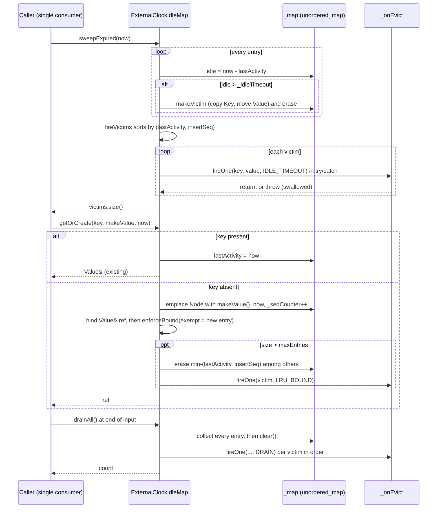

# Iora ExternalClockIdleMap — Architecture & Programmer's Guide

[Back to index](../../README.md)

| | |
|---|---|
| **Version** | 1.2 |
| **Date** | 2026-09-24 |
| **Status** | IMPLEMENTED |
| **Header** | `include/iora/util/external_clock_idle_map.hpp` |
| **Namespace** | `iora::util` (implementation traits in `iora::util::detail`) |
| **Public types** | `ExternalClockIdleMap<Key, Value, TimePoint>`, `EvictReason` |
| **Dependencies** | Standard library only: `<algorithm>`, `<cstddef>`, `<cstdint>`, `<functional>`, `<optional>`, `<stdexcept>`, `<type_traits>`, `<unordered_map>`, `<utility>`, `<vector>`. No other iora header, no clock, no thread, no third-party dependency. |

---

## Revision History

| Version | Date | Changes |
|---|---|---|
| 1.0 | 2026-09-24 | Initial Architecture & Programmer's Guide, written against `include/iora/util/external_clock_idle_map.hpp` (added in iora `61d13e9`, "util: add ExternalClockIdleMap (caller-clocked idle-timeout eviction map)"), cross-checked against `tests/util/iora_test_external_clock_idle_map.cpp` and the architecture document `architecture/iora/util_external_clock_idle_map.json` (v0.3.0). |
| 1.1 | 2026-09-24 | Doc-review round 1 fixes: removed literal backslash escapes inside code spans; corrected Section 3.8's "one eviction restores the bound" claim and added Section 5.7 (bound eviction throws after the insert); added pointer/reference-escape, uniform `const`-call and callback-under-external-lock guidance to Section 6; attributed the "callback-time rehash unreachable" note to the test file and recorded its contradiction with the header comment; stated the strict-weak-ordering / no-NaN requirement on `TimePoint`; completed the `Key`/`Value`/`TimePoint` type requirements (verified by compile probes); reorganized Section 10 (removed reviewer-workflow sentence, added a Doc/code discrepancies subsection, added bound-overshoot, NaN, `EvictReason` naming and header/test comment entries). |
| 1.2 | 2026-09-24 | Doc-review round 2 fixes: de-duplicated three repeated facts (the bound-eviction-throw overshoot is traced only in Section 5.7, the header/test rehash contradiction only in Section 10.1, and NaN / strict weak ordering only in Section 3.2, with short cross-references elsewhere); added the two missing throw points to Section 5.3 and Section 10 (the `push_back` of the temporary `Victim`, and `fireVictims()`'s `std::sort`), each confirmed by probe; added the caveat that the `getOrCreate()` reference can dangle through its own `LRU_BOUND` callback (Section 3.4, Section 4.6, D-10) and the factory re-entrancy rule (Section 3.4, Section 4.6); qualified "one eviction restores the bound"; quoted the full test name; corrected where a non-move-assignable `Value` fails for `put()`; corrected the negative-`idleTimeout` description for a backward `now`; qualified the pointer-stability claim against bound eviction; stated the header's guidance that the callback should be `noexcept`; expanded Section 6 (in-place `put()` and `get()`-pointer races, factory and `forEach` callable running inside the caller's critical section, a concrete deferred-work queue pattern); prefixed coding_trackers paths with `coding_trackers:` (the architecture document named in row 1.0 is `coding_trackers:architecture/iora/util_external_clock_idle_map.json`; row 1.0 is left unchanged as history); cited the code-defect tracker in Section 10. |

---

## 1. Executive Summary

### Problem

`iora::util` already has two expiring maps, documented together in the [TtlMap \& ExpiringCache guide](caching.md). Both are built around the *host's* clock:

- `TtlMap` reads `std::chrono::steady_clock::now()` inside `put()` and `get()` and is swept by a periodic job on an injected `iora::core::TimerService`.
- `ExpiringCache` reads `std::chrono::steady_clock::now()` inside `set()`, `get()` and its purge loop, and owns a `std::thread` that wakes every 5 seconds.

That is correct for a live cache, and wrong for anything whose notion of time comes from the data. A passive VoIP sensor reading a week-old pcap must expire a call after 30 seconds of *captured* silence, not 30 seconds of wall-clock time; an accelerated replay must expire calls as fast as it reads packets; a deterministic test must produce the same evictions on every run. None of that is possible when the container reads the clock itself and evicts on a background timer, and neither sibling can be retrofitted without removing its sweeper and re-templating it on a clock -- effectively a rewrite. The first consumer that hit this was the `iora_voipmon` call table, which is driven by packet timestamps.

### Solution

`ExternalClockIdleMap<Key, Value, TimePoint>` is a third, deliberately separate primitive:

- **No internal clock.** Every operation that sets or evaluates time takes a caller-supplied `TimePoint now`. The header never names a clock. `TimePoint` can be a plain signed integer (microseconds of packet time), a `std::chrono::duration`, or a `std::chrono::time_point`.
- **No background thread.** Expiry happens only when the caller calls `sweepExpired(now)`; end-of-input flushing happens only when the caller calls `drainAll()`.
- **Idle (last-activity) timeout.** `put()`, `get()`, `getOrCreate()` and `touch()` set the entry's `lastActivity = now`; an entry expires when `(now - lastActivity) > idleTimeout` -- strictly greater. `peek()` and `forEach()` inspect without refreshing.
- **Copy-then-invoke eviction with a reason.** A single `EvictionCallback` receives `(const Key&, Value&&, EvictReason)` for `IDLE_TIMEOUT`, `LRU_BOUND` and `DRAIN`. All map mutation for an eviction pass finishes before the first callback runs, so the callback may re-enter the map; each callback is wrapped in `try`/`catch` so one throwing victim cannot abort the rest. `erase()` and overwrite are silent.
- **Deterministic ordering.** Callbacks fire in `(lastActivity, insertSeq)` order, and the optional `maxEntries` bound evicts the `(lastActivity, insertSeq)` minimum, so identical input produces identical evictions in identical order regardless of hash-table layout.

### Technical Impact

- **Replayable and accelerable.** The same `(operation, now)` sequence always yields the same victim set in the same callback order; a replay can run as fast as the caller feeds it.
- **Zero threads, zero locks, zero clock reads.** The map adds no scheduling or synchronization cost; it is exactly one `std::unordered_map<Key, Node>` plus a `std::uint64_t` counter.
- **Backward-time safe.** A `now` earlier than a stored `lastActivity` yields a negative (signed) delta that never satisfies the expiry test -- no unsigned wrap, no spurious eviction.
- **O(1) average** `put`/`get`/`getOrCreate`/`peek`/`touch`/`erase`/`contains` when no bound is exceeded; **O(n + k log k)** `sweepExpired` (scan plus sort of the k victims); **O(n log n)** `drainAll`; **O(n)** for the single bound eviction on an insert that exceeds `maxEntries`.
- **Stable addresses.** Pointers and references returned by `get()`/`getOrCreate()` are not invalidated structurally by inserts, rehashes or operations on other keys (a property of `std::unordered_map` nodes). They do dangle once *that key* is removed -- including by a new-key insert on a bounded map that evicts it with `LRU_BOUND` (Section 3.4).

---

## 2. System Architecture

### 2.1 Component relationships

```
iora::util
|
|-- enum class EvictReason                 { IDLE_TIMEOUT, LRU_BOUND, DRAIN }
|
|-- detail::DurationIsSigned<D>           (trait: D::rep signed for chrono, else D signed)
|-- detail::HasLess<T>                    (trait: const T& < const T& is well-formed)
|-- detail::HasSubtract<T>                (trait: const T& - const T& is well-formed)
|
`-- ExternalClockIdleMap<Key, Value, TimePoint>   (public; non-copyable, non-movable)
      |-- using Duration         = decltype(TimePoint - TimePoint)   (must be signed)
      |-- using EvictionCallback = std::function<void(const Key&, Value&&, EvictReason)>
      |-- using FactoryFn        = std::function<Value()>
      |
      |-- Node    (private: Value value; TimePoint lastActivity; std::uint64_t insertSeq)
      |-- Victim  (private: Key key (a COPY); Value value (moved out); lastActivity; insertSeq)
      |
      |-- Duration                   _idleTimeout
      |-- EvictionCallback           _onEvict        (may be empty)
      |-- std::optional<std::size_t> _maxEntries     (nullopt = unbounded; 0 rejected)
      |-- std::unordered_map<Key, Node> _map         (the only container; no LRU list)
      `-- std::uint64_t              _seqCounter{0}  (monotonic insertion sequence)

Collaborators: none. The caller owns the clock, the sweep cadence and serialization.
```

There is no secondary ordering structure. Both the idle sweep and the bound victim are chosen by scanning `lastActivity` values, which stays correct when `now` moves backward or arrives out of order (a touch-ordered LRU list would not).

### 2.2 Data flow -- packet-driven sweep and create



### 2.3 Threading model

| Thread | Responsibility |
|---|---|
| The single consumer (caller) | Every call: mutation, lookup, `sweepExpired`, `drainAll`, observers. Also runs every eviction callback, synchronously, before the triggering call returns. |
| Any other thread | None. The map takes no lock; concurrent access from a second thread without external serialization is a data race (see Section 6). |

The map spawns no thread and schedules nothing. If the caller wants periodic sweeps it calls `sweepExpired()` itself -- typically once per input record or once per batch, using that record's timestamp.

---

## 3. Component Deep Dive

### 3.1 `EvictReason`

```cpp
enum class EvictReason
{
  IDLE_TIMEOUT, ///< sweepExpired(now): (now - lastActivity) > idleTimeout.
  LRU_BOUND,    ///< maxEntries exceeded: min-(lastActivity, insertSeq) victim.
  DRAIN         ///< drainAll(): end-of-capture flush of every entry.
};
```

The reason is the only way a callback can tell *why* an entry left. Because `erase()` and overwrite never fire the callback, every callback invocation means "the map decided to remove this", never "the caller removed this". A consumer emitting records on eviction can therefore emit exactly once per logical entry: it emits its own record when it `erase()`s deliberately, and relies on the callback for everything else.

### 3.2 Template requirements and compile-time checks

```cpp
using Duration = decltype(std::declval<TimePoint>() - std::declval<TimePoint>());

static_assert(detail::HasLess<TimePoint>::value, "TimePoint must be LessThanComparable");
static_assert(detail::HasSubtract<TimePoint>::value,
              "TimePoint must support (TimePoint - TimePoint) -> Duration");
static_assert(detail::DurationIsSigned<Duration>::value, "...must be SIGNED...");
static_assert(std::is_move_constructible<Value>::value, "Value must be move-constructible");
```

- **`Duration` is deduced**, not a template parameter. For `std::int64_t` it is `std::int64_t`; for `double` it is `double`; for `std::chrono::microseconds` it is `std::chrono::microseconds`; for a `std::chrono::time_point<C, D>` it is the time point's duration type.
- **Signedness is mandatory.** `DurationIsSigned` checks `std::is_signed<D::rep>` when `D` has a nested `rep` (chrono durations) and `std::is_signed<D>` otherwise. An unsigned tick type (for example `std::uint64_t` packet counters) is rejected at compile time, because `earlier - later` would wrap to a huge positive value and evict everything.
- **`Key` needs only hashing and equality for lookups** -- no `operator<`. Ordering ties are broken by `insertSeq`, never by `Key`. The backing container is `std::unordered_map<Key, Node>` with the default `std::hash<Key>` and `std::equal_to<Key>`; there is no hasher template parameter, so a user key type needs a `std::hash` specialization.
- **`TimePoint`'s `operator<` must be a strict weak ordering** over every value the caller passes. `lessActivity()` (used by the victim sort and the bound scan) and `std::sort` rely on it; the trait only checks that `a < b` is well-formed. For a floating-point `TimePoint` this means **`now` must never be NaN**: a NaN `lastActivity` makes `now - lastActivity` NaN, `NaN > idleTimeout` is always false, and the entry never expires (a probe's NaN entry survived `sweepExpired(1e9)`); a NaN among sorted victims breaks the strict-weak-ordering precondition of `std::sort` in `fireVictims()`, which is undefined behavior, and makes the `LRU_BOUND` victim choice arbitrary. Nothing checks for it. See Section 10.
- **What the asserts do not cover** (each verified by a compile probe against the header):
  - `Key` must be **copy-constructible** (`emplace(key, ...)` copies it, and every `Victim` owns a copy) and **move-assignable** (`sweepExpired()`/`drainAll()` `std::sort` a `std::vector<Victim>`, which move-assigns victims).
  - `Value` must be **move-assignable**: `put()` on an existing key move-assigns it, and the same victim sort in `sweepExpired()` **and `drainAll()`** move-assigns it. A move-constructible, non-move-assignable `Value` passes the `static_assert` and then fails to compile: for `put()` in the header's own body (`it->second.value = std::move(value);`), and for `sweepExpired()` and `drainAll()` deep inside the standard library's `std::sort`.
  - `TimePoint` must be **copy-constructible** (it is copied into each `Node` and each `Victim`), **copy-assignable** (`put()`/`get()`/`getOrCreate()`/`touch()` assign `lastActivity = now` from an lvalue) and **move-assignable** (the victim sort).

  See Section 10.

### 3.3 Construction, copy and move

```cpp
ExternalClockIdleMap(Duration idleTimeout, EvictionCallback onEvict,
                     std::optional<std::size_t> maxEntries = std::nullopt)
```

- `maxEntries == 0` throws `std::invalid_argument("ExternalClockIdleMap: maxEntries must be > 0 (use std::nullopt for unbounded)")`. This is the only validation.
- `onEvict` may be empty (`nullptr` or a default-constructed `std::function`). Evictions still remove entries and are still counted in the return values of `sweepExpired()`/`drainAll()`; `fireOne()` simply returns early on `if (!_onEvict)`.
- `idleTimeout` is **not** validated. A negative timeout evicts, at the next sweep, every entry whose `lastActivity` is not ahead of `now` by at least `|idleTimeout|` -- with a monotonic `now` that is every entry, even one touched with the same `now` (idle `0 > -5`). A probe with `idleTimeout = -5` and `sweepExpired(90)` evicted entries last active at 90 and 94 and kept those at 95 and 100. See Section 10.
- All four copy/move operations are `= delete`. A live map carries a callback identity and a single-consumer contract; copying or moving it has no meaningful semantics. Hold it by value inside an owner object, or behind `std::unique_ptr`, if it must be relocated.

### 3.4 Insert and lookup: `put`, `get`, `getOrCreate`, `peek`, `touch`

Each entry is a `Node { Value value; TimePoint lastActivity; std::uint64_t insertSeq; }`.

- **`put(key, value, now)`** -- on an existing key: move-assign the value, set `lastActivity = now`, return. The entry keeps its original `insertSeq` and **no callback fires** (overwrite is silent, even though the old value is destroyed). On a new key: `emplace(key, Node{std::move(value), now, _seqCounter++})`, then `enforceBound(_map.end())`. Passing `end()` means no entry is exempt, so under a backward `now` the just-inserted entry can itself be the minimum and be evicted with `LRU_BOUND` before `put()` returns. `put()` returns `void`, so no dangling handle results; the value is delivered to the callback instead.
- **`get(key, now)`** -- on hit set `lastActivity = now` and return `&value`; `nullptr` on miss. Never inserts.
- **`getOrCreate(key, makeValue, now)`** -- on hit behaves like `get()` and returns a reference. On miss, constructs the value with `makeValue()` inside the `Node{...}` initializer (braced-init evaluation is left to right, so a throwing factory leaves the map and `_seqCounter` untouched), emplaces it, and then:

  ```cpp
  Value &ref = res.first->second.value;
  enforceBound(res.first);
  return ref;
  ```

  Two deliberate details. The new entry is passed to `enforceBound()` as `exempt`, so it can never be *selected* as its own victim -- otherwise, under a backward `now`, the returned reference would dangle immediately. And the reference is bound **before** `enforceBound()`, so it never depends on the iterator `res.first` surviving a re-entrant `LRU_BOUND` callback: a rehash would invalidate iterators but not references to nodes. (Whether such a callback-time rehash can occur on this path is disputed between the header and test comments; see Section 10.1. The pre-binding is correct either way.)

  **The reference can still dangle through the `LRU_BOUND` callback it triggers.** The exemption only keeps `enforceBound()` from choosing the new key; the callback runs before `getOrCreate()` returns, and anything it does to the new key takes effect first. A callback that `erase()`s the new key, calls `drainAll()`, or calls `sweepExpired()` with a `now` far enough ahead removes it, and `getOrCreate()` then returns a dangling reference. The header's CAVEAT names the erase case ("pathological ... and outside the callback contract"); a probe confirmed all three (`contains(key)` was `false` after `getOrCreate()` returned). On a bounded map, an `LRU_BOUND` callback must not remove entries it did not receive.

  **The factory must not re-enter the map.** `makeValue()` runs after the `find` miss and before `emplace`. If it inserts the same key, `emplace` fails: the factory's return value is silently discarded, `getOrCreate()` returns a reference to the entry the factory inserted, that entry's `lastActivity` is **not** set to this call's `now` (it keeps whatever the nested insert set), `_seqCounter` has still been incremented, and `enforceBound(res.first)` still runs. A probe whose factory called `put(7, "from-put", 3)` got back `"from-put"`, and a later `sweepExpired(14)` (idle timeout 10) evicted the entry although `getOrCreate()` had been called with `now = 50`. The header does not state this restriction.
- **`peek(key) const`** -- returns `const Value*` without touching `lastActivity`. Use it for inspection that must not keep an entry alive.
- **`touch(key, now)`** -- refreshes `lastActivity` only; returns whether the key existed.

**Pointer and reference validity.** A `Value*` from `get()` or a `Value&` from `getOrCreate()` stays valid until *that key* is erased, evicted (sweep, bound or drain) or the map is destroyed. Inserts, rehashes, and operations on other keys do not invalidate it structurally -- but on a bounded map a new-key insert can evict *that key* with `LRU_BOUND` (Section 4.6), which does invalidate it; overwriting that key with `put()` keeps the address and changes the contents. The test `get() pointer stays valid across other-key ops and rehash` asserts address identity across 200 inserts and 100 erases.

### 3.5 Silent removal: `erase`

`erase(key)` is `return _map.erase(key) > 0;`. No callback, no reason. The intended pattern is "the caller saw the end of this entry's life (for example a SIP BYE), handled it itself, and is discarding it".

### 3.6 Expiry: `sweepExpired`

```cpp
std::vector<Victim> victims;
victims.reserve(_map.size());
for (auto it = _map.begin(); it != _map.end();)
{
  const Duration idle = now - it->second.lastActivity;
  if (idle > _idleTimeout)
  {
    victims.push_back(makeVictim(it->first, it->second));
    it = _map.erase(it);
  }
  else
  {
    ++it;
  }
}
fireVictims(victims, EvictReason::IDLE_TIMEOUT);
return victims.size();
```

- **Phase 1 (mutate):** one pass over the hash table. Each expired entry becomes a `Victim` holding a *copy* of the key and the *moved-out* value, and is erased from `_map` immediately.
- **Phase 2 (invoke):** `fireVictims()` sorts the victims by `lessActivity(lastActivity, insertSeq)` and calls `fireOne()` for each. By then the map already reflects the sweep, so a callback that calls `put()`, `erase()`, `get()` or even `sweepExpired()` sees a consistent map and cannot invalidate the loop.
- **Boundary:** strictly greater. With `idleTimeout = 100`, an entry last active at `0` survives `sweepExpired(100)` and is evicted by `sweepExpired(101)`.
- **Backward `now`:** `now - lastActivity` is negative, `negative > idleTimeout` is false for any non-negative timeout, and the entry is left alone. A later forward sweep evaluates it normally.
- **Cost:** `reserve(_map.size())` allocates room for every entry on every call, even when nothing expires (see Section 10), then O(n) scan plus O(k log k) sort.

### 3.7 End-of-input flush: `drainAll`

`drainAll()` builds a `Victim` for every entry, calls `_map.clear()`, then fires `DRAIN` callbacks in `(lastActivity, insertSeq)` order and returns the count. A second call on an empty map returns `0` and fires nothing. This is what prevents "trailing entry" loss: without it, entries still open when the input ends would never reach the callback, because no further `now` arrives to expire them.

### 3.8 The capacity bound: `enforceBound`

Called after every *new-key* insert (never on overwrite). If `_maxEntries` is set and `_map.size() > *_maxEntries`, it scans the whole table for the `(lastActivity, insertSeq)` minimum, skipping `exempt`, erases that one entry and fires `LRU_BOUND`. When `enforceBound()` completes normally, size only grew by one, so one eviction restores the bound -- provided the map was within the bound before the insert.

**Invariant break.** `enforceBound()` runs *after* the new entry is emplaced and collects the victim (`Key` copy, `Value` move) *before* erasing it, so a throw there leaves `size() == maxEntries + 1`, and the overshoot is never recovered. The full failure trace is in Section 5.7. The `victim == _map.end()` branch is unreachable under the constructor-enforced `maxEntries >= 1` plus the size guard, and is kept as a guard against a future edit.

"LRU" here means *least-recent `lastActivity` value*, not *least-recently-touched in call order*. The two coincide only when `now` is monotonic; the value-based choice is the one that stays meaningful when timestamps arrive reordered.

### 3.9 Callback invocation and isolation: `fireOne`, `fireVictims`

```cpp
void fireOne(const Key &key, Value &&value, EvictReason reason)
{
  if (!_onEvict)
  {
    return;
  }
  try
  {
    _onEvict(key, std::move(value), reason);
  }
  catch (const std::exception &)
  {
  }
  catch (...)
  {
  }
}
```

All three eviction paths go through `fireOne()`. A `std::exception` or any other thrown object is caught and discarded, so the loop continues with the next victim and nothing propagates to the caller of `sweepExpired()`, `drainAll()`, `put()` or `getOrCreate()`. The exception is not logged, counted or reported (see Section 10). This isolation is a safety net, not the intended contract: the header's `EvictionCallback` comment says the callback "may throw (it is isolated per victim), but SHOULD itself be noexcept". Write callbacks that handle their own failures. The `const Key&` passed to the callback refers to the victim's own copy, never to an erased node, and the `Value&&` may be moved from.

Ordering in `fireVictims()` uses `std::sort` with `lessActivity()`: compare `lastActivity` with `operator<` in both directions, and fall back to `insertSeq`. Because `insertSeq` is unique per entry, the order is total and the sort's instability is irrelevant -- provided `TimePoint`'s `operator<` is a strict weak ordering over the stored values (no NaN; Section 3.2).

### 3.10 Observers

`forEach(fn) const` calls `fn(const Key&, const Value&)` for each entry in hash-table order (unspecified) and does not refresh `lastActivity`. `size()` and `empty()` are `noexcept`; `contains()` is a plain `find`. None of these take a `now`.

---

## 4. Usage Guide

### 4.1 Which to use when: ExternalClockIdleMap vs TtlMap vs ExpiringCache

Verified against `ttl_map.hpp` and `expiring_cache.hpp`; see the [TtlMap \& ExpiringCache guide](caching.md) for the siblings in depth.

| Property | `ExternalClockIdleMap` | `TtlMap` | `ExpiringCache` |
|---|---|---|---|
| Time source | Caller-supplied `now` on each call | `steady_clock::now()` internally | `steady_clock::now()` internally |
| Expiry semantics | Idle: refreshed by `put`/`get`/`getOrCreate`/`touch` | Absolute TTL set at `put()`; `get()` refreshes only the LRU recency stamp | Absolute TTL set at `set()`; `get()` does not refresh |
| Who sweeps | The caller, via `sweepExpired(now)` | Periodic job on an injected `TimerService` (`Config::sweepInterval`) | Owned `std::thread`, every 5 s |
| Thread safety | None -- caller-serialized | `std::shared_mutex` (shared-lock `get()`) | `std::mutex` |
| Capacity bound | Optional `maxEntries`, exact min-`lastActivity` by O(n) scan | `Config::maxEntries`, approximate second-chance LRU | None |
| Eviction callback | `(const Key&, Value&&, EvictReason)` on idle, bound and drain; not on `erase`/overwrite | None (counters in `stats()`) | `(const K&, const V&)` on expiry **and** on explicit `remove()` |
| Lookup returns | `Value*` / `Value&` into the map | `std::optional<V>` copy | `std::optional<V>` copy |
| End-of-input flush | `drainAll()` | No | No |
| Deterministic replay | Yes | No | No |

Rule of thumb: if the question "has this been idle too long?" should be answered in the data's time (packets, log records, simulation ticks, test ticks), use `ExternalClockIdleMap`. If it should be answered in the host's time and several threads share the cache, use `TtlMap`. `ExpiringCache` remains for its existing simple consumers.

### 4.2 Packet-time call table with idle expiry and end-of-capture drain

Sweep with each packet's timestamp, create-on-miss with `getOrCreate()`, and flush with `drainAll()` at the end so the last open calls still produce records.

```cpp
#include "iora/util/external_clock_idle_map.hpp"

#include <cstdint>
#include <iostream>
#include <string>
#include <utility>
#include <vector>

// Packet time in microseconds since the capture epoch. A signed integral
// TimePoint gives a signed Duration (std::int64_t), as the map requires.
using PacketTimeUs = std::int64_t;

struct CallState
{
  std::string from;
  int packets = 0;
};

struct Packet
{
  PacketTimeUs ts;
  std::string callId;
  std::string from;
};

int main()
{
  using iora::util::EvictReason;
  using CallTable = iora::util::ExternalClockIdleMap<std::string, CallState, PacketTimeUs>;

  const PacketTimeUs idleUs = 30LL * 1000 * 1000; // 30 s of captured-time silence

  CallTable calls(idleUs,
                  [](const std::string &callId, CallState &&st, EvictReason reason)
                  {
                    std::cout << "CDR " << callId << " from=" << st.from
                              << " packets=" << st.packets << " reason="
                              << (reason == EvictReason::IDLE_TIMEOUT ? "idle" : "drain") << "\n";
                  });

  const std::vector<Packet> capture = {
      {0, "c1@host", "alice"},
      {1000000, "c2@host", "bob"},
      {5000000, "c1@host", "alice"},
      {40000000, "c2@host", "bob"}, // both calls idle > 30 s at t=40 s
  };

  for (const auto &pkt : capture)
  {
    // Expire first, using the packet's own timestamp as "now".
    calls.sweepExpired(pkt.ts);

    CallState &st = calls.getOrCreate(
        pkt.callId, [&] { return CallState{pkt.from, 0}; }, pkt.ts);
    ++st.packets;
  }

  // End of capture: flush every open call so no trailing CDR is lost.
  const std::size_t drained = calls.drainAll();
  std::cout << "drained " << drained << "\n";
  return 0;
}
```

Output:

```
CDR c2@host from=bob packets=1 reason=idle
CDR c1@host from=alice packets=2 reason=idle
CDR c2@host from=bob packets=1 reason=drain
drained 1
```

At `t = 40 s` both calls exceed 30 s of idle; they are reported in `lastActivity` order (`c2` last seen at 1 s, then `c1` at 5 s). The packet then recreates `c2`, which only `drainAll()` reports.

### 4.3 `std::chrono::time_point` from captured timestamps; `peek` vs `get`

```cpp
#include "iora/util/external_clock_idle_map.hpp"

#include <chrono>
#include <cstddef>
#include <iostream>
#include <string>

int main()
{
  using namespace std::chrono;
  using iora::util::EvictReason;

  // A chrono time_point built from captured timestamps, never from now().
  using CaptureTime = time_point<system_clock, microseconds>;
  using SessionMap = iora::util::ExternalClockIdleMap<std::string, int, CaptureTime>;

  SessionMap sessions(seconds(10), [](const std::string &key, int &&hits, EvictReason)
                      { std::cout << "expired " << key << " hits=" << hits << "\n"; });

  const CaptureTime t0{seconds(1700000000)}; // a timeval from a week-old pcap

  sessions.put("10.0.0.1:5060", 1, t0);
  sessions.put("10.0.0.2:5060", 1, t0 + seconds(2));

  // peek() inspects without extending the idle timer.
  if (const int *hits = sessions.peek("10.0.0.1:5060"))
  {
    std::cout << "peek hits=" << *hits << "\n";
  }

  // get() refreshes lastActivity for the key it hits.
  if (int *hits = sessions.get("10.0.0.2:5060", t0 + seconds(8)))
  {
    ++*hits;
  }

  // At t0+10s nothing is strictly past the boundary: (10s - 0s) == 10s.
  const std::size_t at10 = sessions.sweepExpired(t0 + seconds(10));
  std::cout << "sweep@10s evicted " << at10 << "\n";
  // At t0+11s only the first key is idle for > 10s (the second was refreshed at 8s).
  const std::size_t at11 = sessions.sweepExpired(t0 + seconds(11));
  std::cout << "sweep@11s evicted " << at11 << "\n";
  std::cout << "remaining " << sessions.size() << "\n";
  return 0;
}
```

Output:

```
peek hits=1
sweep@10s evicted 0
expired 10.0.0.1:5060 hits=1
sweep@11s evicted 1
remaining 1
```

The callback runs inside `sweepExpired()`, before it returns -- hence the "expired" line printed before the count.

### 4.4 Bounding memory with `maxEntries`; silent `erase`

```cpp
#include "iora/util/external_clock_idle_map.hpp"

#include <cstddef>
#include <iostream>
#include <optional>
#include <stdexcept>
#include <string>

int main()
{
  using iora::util::EvictReason;
  using Map = iora::util::ExternalClockIdleMap<std::string, std::string, long long>;

  // Bound the map at 2 entries to cap memory under a flood of transient keys.
  Map flows(
      1000,
      [](const std::string &key, std::string &&, EvictReason reason)
      {
        std::cout << "evicted " << key
                  << (reason == EvictReason::LRU_BOUND ? " (LRU_BOUND)" : "") << "\n";
      },
      std::optional<std::size_t>{2});

  flows.put("a", "flow-a", 10);
  flows.put("b", "flow-b", 20);
  flows.touch("a", 30);         // "a" is now more recent than "b"
  flows.put("c", "flow-c", 40); // 3 > 2: min-(lastActivity, insertSeq) is "b"

  // Explicit removal is silent: no callback fires.
  std::cout << "erase a -> " << flows.erase("a") << "\n";
  std::cout << "contains b -> " << flows.contains("b") << ", size " << flows.size() << "\n";

  try
  {
    Map bad(1000, nullptr, std::optional<std::size_t>{0});
  }
  catch (const std::invalid_argument &e)
  {
    std::cout << "rejected: " << e.what() << "\n";
  }
  return 0;
}
```

Output:

```
evicted b (LRU_BOUND)
erase a -> 1
contains b -> 0, size 1
rejected: ExternalClockIdleMap: maxEntries must be > 0 (use std::nullopt for unbounded)
```

### 4.5 A throwing, re-entrant callback

```cpp
#include "iora/util/external_clock_idle_map.hpp"

#include <iostream>
#include <stdexcept>
#include <string>

int main()
{
  using iora::util::EvictReason;
  using Map = iora::util::ExternalClockIdleMap<int, std::string, long long>;

  Map *self = nullptr;
  int delivered = 0;

  Map map(5,
          [&](const int &key, std::string &&value, EvictReason)
          {
            if (key == 2)
            {
              throw std::runtime_error("sink unavailable"); // isolated per victim
            }
            ++delivered;
            // Re-entry is legal: all map mutation for this sweep is already done.
            self->put(key + 100, "follow-up for " + value, 100);
          });
  self = &map;

  map.put(1, "one", 0);
  map.put(2, "two", 0);
  map.put(3, "three", 0);

  const std::size_t evicted = map.sweepExpired(10); // all three idle 10 > 5
  std::cout << "evicted=" << evicted << " delivered=" << delivered
            << " size=" << map.size() << "\n";
  map.forEach([](const int &key, const std::string &value)
              { std::cout << key << " -> " << value << "\n"; });
  return 0;
}
```

Output (the two `forEach` lines may appear in either order -- iteration order is unspecified):

```
evicted=3 delivered=2 size=2
103 -> follow-up for three
101 -> follow-up for one
```

The throw for key `2` is swallowed and the sweep still delivers keys `1` and `3`; the return value counts all three evictions, including the one whose callback failed.

### 4.6 Anti-patterns

- **Do NOT share one map between threads without your own lock.** There is no internal synchronization; even `get()` writes `lastActivity`. If you must, wrap every call -- and remember the callback runs on the calling thread while your lock is held, so it must not take that lock again.
- **Do NOT use an unsigned tick type, or a negative `idleTimeout`.** The former is rejected at compile time; the latter compiles and (for a monotonic `now`) silently evicts every entry at every sweep (Section 3.3).
- **Do NOT rely on the callback for entries you `erase()` or overwrite.** Neither fires it. Emit your own record before `erase()`, and treat `put()` on an existing key as a destructive replace.
- **Do NOT hold a `get()` pointer or `getOrCreate()` reference across a `sweepExpired()`, `drainAll()`, or a new-key `put()`/`getOrCreate()` under a bound.** Any of these may remove that key, and the pointer dangles with no signal. Re-look the key up afterwards.
- **Do NOT remove entries from an `LRU_BOUND` callback on a bounded map that `getOrCreate()` feeds.** That callback runs inside `getOrCreate()`; if it erases the just-created key, calls `drainAll()`, or calls `sweepExpired()` with a far-future `now`, the reference `getOrCreate()` returns is already dangling (Section 3.4).
- **Do NOT touch the map from the `getOrCreate()` factory.** A factory that inserts the same key has its value silently discarded and leaves the entry with a stale `lastActivity` (Section 3.4). Build the value only.
- **Do NOT mutate the map from inside `forEach()`, or insert unconditionally from an `LRU_BOUND` callback.** `forEach()` iterates the live table, so a mutation invalidates its iterator. And an `LRU_BOUND` callback that always inserts a new key triggers another bound eviction, which calls the callback again, recursively, with no depth limit.
- **Do NOT forget `drainAll()` at end of input.** Entries still open when the input stops never expire on their own -- there is no timer.

---

## 5. Call Flow / Sequence Reference

The map takes no lock, so there are no lock acquire/release steps. The column "Callback may run?" marks where user code executes.

### 5.1 `sweepExpired(now)` -- success path

| Step | Action | Callback may run? |
|---|---|---|
| 1 | `victims.reserve(_map.size())` | No |
| 2 | For each entry: `idle = now - lastActivity`; if `idle > _idleTimeout`, `makeVictim()` (copy `Key`, move `Value`) and `_map.erase(it)` | No |
| 3 | `std::sort` victims by `(lastActivity, insertSeq)` | No |
| 4 | For each victim: `fireOne(key, std::move(value), IDLE_TIMEOUT)` | Yes -- may re-enter the map |
| 5 | Return `victims.size()` (includes victims whose callback threw) | No |

### 5.2 `sweepExpired(now)` -- failure path: callback throws

| Step | Action | Result |
|---|---|---|
| 1-3 | As above; the map already excludes all victims | Map consistent |
| 4a | `_onEvict` throws for victim i | Caught by `catch (const std::exception&)` or `catch (...)`, discarded |
| 4b | Continue with victim i+1 | Remaining callbacks still run |
| 5 | Return full victim count | Caller is not told that a callback failed |

### 5.3 `sweepExpired(now)` / `drainAll()` -- failure path: `Key` copy or `Value` move throws in phase 1

| Step | `sweepExpired` | `drainAll` |
|---|---|---|
| 1 | Some victims already collected **and erased** from `_map` | Some victims already collected; their nodes remain in `_map` with **moved-from** values |
| 2 | `makeVictim()` throws for the next entry | Same |
| 3 | Exception propagates; local `victims` destroyed | Same; `_map.clear()` never runs |
| 4 | Already-erased entries are lost -- no callback | Moved-from values remain in the map and will later be delivered or returned as moved-from |

Confirmed by a probe whose `Key` copy constructor throws on the third copy: `sweepExpired` lost one entry with zero callbacks; `drainAll` threw with the map still holding four entries, one of them moved-from. See Section 10.

Two further throw points in the same functions:

| Throw point | `sweepExpired` | `drainAll` |
|---|---|---|
| `victims.push_back(makeVictim(...))`: `makeVictim()` has already moved the node's value into a temporary `Victim`; `push_back` then move-constructs that temporary into the vector. A throwing `Key` or `Value` move constructor throws here. | Throws before `_map.erase(it)`: the current node stays in `_map` holding a **moved-from** value, the real value is destroyed with the temporary, and earlier victims are lost as above; no callback | Current node stays in `_map` holding a **moved-from** value; the real value is destroyed with the temporary; earlier nodes are moved-from as above; `_map.clear()` never runs; no callback |
| `fireVictims()`'s `std::sort`: move-constructs and move-assigns `Victim`s (`Key`, `Value`, `TimePoint`) and calls `operator<` on `TimePoint`. Runs after all victims were erased (sweep) or after `_map.clear()` (drain), and outside `fireOne()`'s `try`. | Every collected victim is lost: already erased, destroyed with `victims`, **zero callbacks** | Every entry is lost: map already cleared, **zero callbacks** |

Confirmed by probe with a `Value` whose move constructor or move assignment throws on demand. `push_back` case: after one expired entry `"one"`, both `sweepExpired(100)` and `drainAll()` threw with `size() == 1`, the entry's value `""` (moved-from) and zero callbacks. Sort case: with five victims and a throwing move assignment, both `sweepExpired(100)` and `drainAll()` threw with `size() == 0` and zero callbacks.

### 5.4 `getOrCreate(key, makeValue, now)` -- miss with bound exceeded

| Step | Action | Callback may run? |
|---|---|---|
| 1 | `_map.find(key)` misses | No |
| 2 | `makeValue()` (throw here leaves map and `_seqCounter` unchanged) | Factory runs (user code) |
| 3 | `emplace(key, Node{value, now, _seqCounter++})` | No |
| 4 | `Value& ref = res.first->second.value` | No |
| 5 | `enforceBound(res.first)`: scan for min among entries other than the new one; `makeVictim`; `erase` | No |
| 6 | `fireOne(victim, LRU_BOUND)` | Yes |
| 7 | Return `ref` | No |

### 5.5 `put(key, value, now)` -- new key, bound exceeded, backward `now`

| Step | Action |
|---|---|
| 1 | `find` misses; `emplace` with `lastActivity = now` (older than every other entry) |
| 2 | `enforceBound(_map.end())` -- no exemption |
| 3 | The just-inserted entry is the minimum; it is erased and delivered with `LRU_BOUND` |
| 4 | `put()` returns; `contains(key)` is now `false` |

### 5.6 `drainAll()`

| Step | Action | Callback may run? |
|---|---|---|
| 1 | `reserve`; `makeVictim` for every entry | No |
| 2 | `_map.clear()` | No |
| 3 | Sort; `fireOne(..., DRAIN)` per victim | Yes -- a callback that inserts leaves those entries in the map after `drainAll()` returns |
| 4 | Return count | No |

### 5.7 `put()` / `getOrCreate()` -- failure path: `enforceBound()` throws

Applies only to a new-key insert on a bounded map whose size now exceeds `maxEntries`. Overwrites and `get()` hits never call `enforceBound()`.

| Step | Action | Resulting state |
|---|---|---|
| 1 | New entry emplaced (`_seqCounter` already incremented) | `size() == maxEntries + 1` |
| 2 | Bound scan selects the victim (for `put()` possibly the new entry itself) | Unchanged |
| 3a | `makeVictim()`: the victim's `Key` copy throws | Victim untouched and still in `_map`; no callback |
| 3b | `makeVictim()`: `Key` copied, then the victim's `Value` move throws | Victim still in `_map`; its value's state is whatever `Value`'s throwing move constructor left; no callback |
| 4 | Exception propagates out of `put()` / `getOrCreate()` | New entry **stays** inserted; `size()` stays `maxEntries + 1` |
| 5 | `getOrCreate()` does not return | Caller gets no reference although the key was created; a retry finds it and returns it as a hit |
| 6 | Every later new-key insert evicts exactly one entry | Overshoot is permanent; each further failure adds one more entry |

Confirmed by a probe (`maxEntries = 2`, a `Key` whose copy constructor throws on demand): after one failing `put()` and one failing `getOrCreate()` the map held 4 entries, both new keys present, and a later normal `put()` left it at 4. See Section 10.

---

## 6. Thread Safety Model

**`ExternalClockIdleMap` is not thread-safe.** It declares no mutex, no atomic and no condition variable; the header states a single-consumer, caller-serialized contract ("It takes NO internal lock; the caller guarantees serialized access"). An internally synchronized variant is noted in the header as a possible follow-on and does not exist.

| Operation | Synchronization | Notes |
|---|---|---|
| Constructor | None | Throws `std::invalid_argument` on `maxEntries == 0`. |
| `put` | None -- caller must serialize | Writes `_map`, `_seqCounter`; may run `_onEvict` (`LRU_BOUND`) synchronously. |
| `get` | None -- caller must serialize | **Writes** `lastActivity`; not a read-only operation. |
| `getOrCreate` | None -- caller must serialize | Runs the factory and possibly `_onEvict`. |
| `peek` | None | `const`. Safe concurrently only with other `const` calls and no writer (see below). Returns `const Value*` into the map (see "Returned handles"). |
| `touch`, `erase` | None -- caller must serialize | Write `_map`. |
| `sweepExpired`, `drainAll` | None -- caller must serialize | Mutate first, then invoke `_onEvict` per victim (copy-then-invoke). |
| `forEach` | None | `const`. Safe concurrently only with other `const` calls and no writer. The callable must not mutate the map; its `const Key&`/`const Value&` arguments are valid only during that call. |
| `size`, `empty`, `contains` | None | `const`. Safe concurrently only with other `const` calls and no writer. `size`/`empty` are `noexcept`. |
| `_onEvict` (user callback) | Runs on the calling thread, inside the triggering call | May re-enter the map; exceptions are caught per victim. |

**`const` calls.** `peek`, `contains`, `size`, `empty` and `forEach` do not modify the map, so under the standard library's data-race rules ([res.on.data.races]) several threads may run them at the same time **only if no thread is concurrently running any non-`const` call** (`put`, `get`, `getOrCreate`, `touch`, `erase`, `sweepExpired`, `drainAll`). Two further conditions come from the user types: `std::hash<Key>::operator()` and `Key`'s `operator==` (used by `peek`/`contains`) must themselves be free of data races when called concurrently, and so must whatever `const` access to `Value` the caller or the `forEach` callable performs. The map cannot guarantee either.

**Returned handles escape any external lock.** `get()` returns `Value*`, `getOrCreate()` returns `Value&`, `peek()` returns `const Value*`, and `forEach()` passes `const Key&`/`const Value&` to its callable. Each points into a map node and is safe to use only while the caller still holds whatever serialization it applies to the map. Under external locking, **copy the value out (or finish using it) before releasing the lock**: once the lock is released another thread may `erase()` the key, sweep or drain it, or evict it with `LRU_BOUND` on an insert, and continued use of the pointer or reference is then a data race and a use-after-free. Even without removal: another thread's `put()` on the same key move-assigns the value in place (`it->second.value = std::move(value);`), which is a data race with any access through the escaped handle (no use-after-free, since the node survives); and a write through `get()`'s `Value*` outside the lock is a data race with a concurrent `peek()` or `forEach()` reader. The same lifetime rules hold without threads for the single-consumer case in Section 4.6.

**Why no lock.** The first consumer is a single-threaded offline correlator, so a lock would be pure cost. Copy-then-invoke is still implemented because it solves a single-threaded problem too: a callback that re-enters the map during a sweep would otherwise invalidate the sweep's iterator.

**If you add external locking**, three kinds of user code run inside your critical section: the eviction callback (from `put()`, `getOrCreate()`, `sweepExpired()` and `drainAll()`), the `getOrCreate()` factory `makeValue`, and the `forEach()` callable. Any of them that re-enters the map through a wrapper that takes the same non-recursive lock self-deadlocks. Blocking work performed directly in any of them (I/O, emitting a record to a slow sink, taking other locks) extends the lock hold time of the triggering call.

Preferred pattern for the callback: defer the real work. The callback is fixed at construction, so it cannot capture a per-call local; the queue it appends to is shared state and must be guarded by the **same** outer lock that serializes the map (it is, automatically, because the callback runs inside the locked call):

1. The callback only appends `(key copy, std::move(value), reason)` to a member queue.
2. Before releasing the outer lock, the wrapper moves or swaps that queue into a stack-local container.
3. After unlocking, the wrapper processes the local container.

The local container preserves the deterministic `(lastActivity, insertSeq)` callback order within one call. If deferred batches are handed to other threads, that order across batches is lost unless processing is serialized.

---

## 7. Configuration Reference

All configuration is by constructor argument; there are no setters and no internal constants that affect behavior.

| Parameter | Type | Default | Units | Valid range | Effect |
|---|---|---|---|---|---|
| `idleTimeout` | `Duration` (deduced from `TimePoint - TimePoint`) | none (required) | Whatever `TimePoint` measures | Should be `>= 0`; not validated (a negative value evicts, for monotonic `now`, every entry at every sweep) | Entry expires at a sweep when `(now - lastActivity) > idleTimeout`. |
| `onEvict` | `EvictionCallback` | none (required; may be empty) | -- | Any callable, or empty | Invoked for `IDLE_TIMEOUT`, `LRU_BOUND`, `DRAIN`. |
| `maxEntries` | `std::optional<std::size_t>` | `std::nullopt` (unbounded) | entries | `nullopt` or `>= 1`; `0` throws `std::invalid_argument` | After a new-key insert makes `size() > maxEntries`, evicts one `(lastActivity, insertSeq)`-minimum entry. |

Template parameters are configuration too:

| Parameter | Requirement (enforced) | Requirement (not enforced by `static_assert`) |
|---|---|---|
| `Key` | -- | `std::hash<Key>` and `operator==` (no custom hasher/equality parameters); copy-constructible (insert and victim copy); move-assignable (victim sort in `sweepExpired()`/`drainAll()`) |
| `Value` | Move-constructible | Move-assignable (`put()` overwrite, and the victim sort in `sweepExpired()` and `drainAll()`) |
| `TimePoint` | `operator<` well-formed; `TimePoint - TimePoint` well-formed; signed difference | `operator<` is a strict weak ordering (no NaN for floating point); copy-constructible (`Node`, `Victim`); copy-assignable (`lastActivity = now`); move-assignable (victim sort) |

---

## 8. API Reference

```cpp
namespace iora
{
namespace util
{

enum class EvictReason
{
  IDLE_TIMEOUT,
  LRU_BOUND,
  DRAIN
};

template <typename Key, typename Value, typename TimePoint>
class ExternalClockIdleMap
{
public:
  using Duration = decltype(std::declval<TimePoint>() - std::declval<TimePoint>());
  using EvictionCallback = std::function<void(const Key &, Value &&, EvictReason)>;
  using FactoryFn = std::function<Value()>;

  ExternalClockIdleMap(Duration idleTimeout, EvictionCallback onEvict,
                       std::optional<std::size_t> maxEntries = std::nullopt);

  ExternalClockIdleMap(const ExternalClockIdleMap &) = delete;
  ExternalClockIdleMap &operator=(const ExternalClockIdleMap &) = delete;
  ExternalClockIdleMap(ExternalClockIdleMap &&) = delete;
  ExternalClockIdleMap &operator=(ExternalClockIdleMap &&) = delete;

  void put(const Key &key, Value value, TimePoint now);
  Value *get(const Key &key, TimePoint now);
  Value &getOrCreate(const Key &key, const FactoryFn &makeValue, TimePoint now);
  const Value *peek(const Key &key) const;
  bool touch(const Key &key, TimePoint now);
  bool erase(const Key &key);

  std::size_t sweepExpired(TimePoint now);
  std::size_t drainAll();

  template <typename Fn>
  void forEach(Fn &&fn) const;

  std::size_t size() const noexcept;
  bool empty() const noexcept;
  bool contains(const Key &key) const;
};

} // namespace util
} // namespace iora
```

| Method | Refreshes `lastActivity` | Fires callback | Returns |
|---|---|---|---|
| `put` | Yes | `LRU_BOUND` only, on new-key insert over the bound (may be the new key itself) | `void` |
| `get` | Yes, on hit | Never | `Value*` or `nullptr` |
| `getOrCreate` | Yes | `LRU_BOUND` only, on insert over the bound (never the new key) | `Value&` |
| `peek` | No | Never | `const Value*` or `nullptr` |
| `touch` | Yes, on hit | Never | `true` if present |
| `erase` | -- | Never | `true` if present |
| `sweepExpired` | No | `IDLE_TIMEOUT` per victim | number evicted |
| `drainAll` | No | `DRAIN` per entry | number drained |
| `forEach`, `size`, `empty`, `contains` | No | Never | -- |

---

## 9. Design Decisions

| ID | Decision | Rationale |
|---|---|---|
| D-1 | No internal clock; `now` is a parameter. | The entire reason the primitive exists: expiry must follow the data's time so pcap replay, accelerated replay and tests are deterministic. |
| D-2 | No background thread; caller-driven `sweepExpired()` / `drainAll()`. | A timer would reintroduce wall-clock dependence and nondeterminism. The caller already has a natural sweep point (each record). |
| D-3 | Idle (last-activity) timeout, strictly greater than. | For a call table, activity extends life; an absolute insert TTL (as in `ExpiringCache`) would expire long calls mid-call. The strict boundary makes "exactly at the limit" deterministic and matches the tests. |
| D-4 | No touch-ordered LRU list; O(n) value scan for both sweep and bound victim. | A splice-to-front list orders by call sequence, which diverges from `lastActivity` order when `now` goes backward or arrives reordered. The O(n) scan is accepted for a single-threaded offline consumer; an accelerated index is a possible follow-on. |
| D-5 | Signed `Duration` enforced by `static_assert` for both chrono and plain arithmetic `TimePoint`s. | A backward `now` must produce a negative delta, never an unsigned wrap that would evict everything. |
| D-6 | Tie-break by a per-map monotonic `insertSeq`, never by `Key`. | Keeps `Key` Hash+Eq only (composite keys may lack `operator<`) while still giving a total, deterministic order. |
| D-7 | Copy-then-invoke: mutate the map fully, then invoke callbacks. | Lets a callback re-enter the map (insert follow-up state, erase related keys) without invalidating the eviction loop. |
| D-8 | Per-victim `try`/`catch` for `std::exception` and `...` on all three paths. | One failing sink must not abort a drain and lose the remaining records; mirrors `ExpiringCache`'s purge isolation. |
| D-9 | `erase()` and overwrite never fire the callback; `EvictReason` distinguishes the three firing paths. | Keeps the callback's meaning unambiguous ("the map removed this"), unlike `ExpiringCache`, whose callback also fires on explicit `remove()`. |
| D-10 | `getOrCreate()` exempts the new key from bound eviction; `put()` does not. | `getOrCreate()` returns a live reference that must not dangle; `put()` returns `void`, so self-eviction is harmless and delivered to the callback. The exemption covers only victim selection: an `LRU_BOUND` callback that removes the new key still dangles the reference (Section 3.4). |
| D-11 | Bind `getOrCreate()`'s return reference before `enforceBound()`. | References to `unordered_map` nodes survive rehash; iterators do not, so the returned handle never depends on `res.first` surviving the callback. Whether a callback-time rehash is reachable is disputed between header and test comments (Section 10.1); the pre-binding is correct either way. |
| D-12 | `maxEntries == 0` rejected; `std::nullopt` means unbounded. | A zero-capacity map is a usage error; an explicit optional avoids a magic "0 = unbounded" sentinel. |
| D-13 | Copy and move deleted. | A live map with a callback identity and a single-consumer contract has no meaningful copy; mirrors `TtlMap`. |
| D-14 | No internal lock in v1. | The only consumer is single-threaded; a lock would be cost without benefit. |
| D-15 | A separate primitive, not folded into a `TtlMap`/`ExpiringCache` consolidation. | Its external-clock semantics are incompatible with the siblings' steady-clock, thread-driven design. |

---

## 10. Known Limitations

Each item below describes current behavior of the header as written. The code defects among them (exception safety of the eviction paths, callback-exception reporting, unchecked `idleTimeout`/NaN, under-stated type requirements, re-entrancy hazards) are tracked in `coding_trackers:tasks/iora/backlog/2026-09-24-17_external-clock-idle-map-exception-safety-and-contract_P1.json`.

- **Not thread-safe.** No internal synchronization exists. A multi-threaded consumer must add its own lock around every call, including `get()` (which writes), and must copy values out before releasing it (Section 6).
- **Callback exceptions are silently discarded.** `fireOne()` catches and drops every exception with no log, counter or return signal; `sweepExpired()`/`drainAll()` count a failed delivery as a successful eviction. The architecture document (`coding_trackers:architecture/iora/util_external_clock_idle_map.json`) describes the isolation as "caught-and-**counted**" and "catch-and-count"; no count exists in the code. A consumer cannot detect that a record sink failed.
- **Not exception-safe if `Key` copy, `Key`/`Value` move, or `TimePoint` comparison throws during a sweep or drain.** Three throw points, all reproduced by probe (Section 5.3): (1) `makeVictim()` -- `sweepExpired()` has already erased the earlier victims, which are lost with no callback, and `drainAll()` leaves moved-from values in the map; (2) the `push_back` of the temporary `Victim` -- the current node stays in `_map` with a moved-from value and its real value is destroyed; (3) `fireVictims()`'s `std::sort`, which runs after the erase/`clear()` and outside `fireOne()`'s `try` -- every collected victim is lost with zero callbacks. `std::string` keys can throw `std::bad_alloc` on copy.
- **A throwing bound eviction permanently overshoots `maxEntries`.** If the victim's `Key` copy or `Value` move throws inside `enforceBound()`, the new entry stays inserted, the victim stays too, `getOrCreate()` throws although it created the key, and the overshoot never recovers (Section 5.7).
- **`static_assert`s and `@tparam` documentation under-state the type requirements.** Only `Value` move-constructibility is asserted, and the header's `@tparam` text says only "Key -- Hash + Eq only" and "Value -- Move-constructible". In practice `Value` must be move-assignable (`put()` overwrite, and the `std::sort` of victims in both `sweepExpired()` and `drainAll()`); `Key` must be copy-constructible and move-assignable (insert, victim copy, sort); and `TimePoint` must be copy-constructible, copy-assignable and move-assignable (`Node`, `Victim`, `lastActivity = now`, sort). A move-constructible, non-move-assignable `Value` passes the assert and fails to compile inside `put()`/`sweepExpired()`/`drainAll()`; a move-only `Key` compiles for construction and observers, then fails the first time any inserting call (`put()`, `getOrCreate()`) or `sweepExpired()`/`drainAll()` is instantiated. Verified by compile probes (Section 3.2).
- **`HasLess` does not check bool-convertibility.** Its comment says it "Detects TimePoint LessThanComparable (`operator<` yielding a bool-convertible)", but the trait only checks that the expression is well-formed.
- **No check that `TimePoint` ordering is a strict weak ordering; NaN is accepted.** A NaN entry never expires, and NaN among victims makes the sort undefined behavior (Section 3.2).
- **`idleTimeout` is not validated.** A negative value compiles and makes every sweep evict every entry whose `lastActivity` is not ahead of `now` by at least `|idleTimeout|` -- for a monotonic `now`, every entry, including entries refreshed with the same `now` (Section 3.3). Only `maxEntries == 0` is rejected.
- **`sweepExpired()` allocates for the whole map on every call.** `victims.reserve(_map.size())` allocates `size() * sizeof(Victim)` even when nothing expires. For a large map swept once per packet this is an avoidable per-call allocation proportional to map size.
- **O(n) sweep and O(n) bound eviction.** Every `sweepExpired()` scans the whole table; every new-key insert above `maxEntries` scans the whole table. There is no time-ordered index. Acceptable for the offline consumer; costly for large, frequently swept maps.
- **Unbounded recursion through `LRU_BOUND` callbacks.** A bound eviction runs the callback synchronously inside `put()`/`getOrCreate()`; if that callback inserts a new key, the nested insert exceeds the bound again and recurses. A probe with `maxEntries = 2` reached a nesting depth of 2000 (stopped only by the probe's own counter). Nothing limits the depth.
- **`getOrCreate()`'s returned reference can dangle through its own `LRU_BOUND` callback.** The new-key exemption covers victim selection only; a callback that erases the new key, calls `drainAll()`, or sweeps with a far-future `now` removes it before `getOrCreate()` returns (Section 3.4). Nothing detects it.
- **A re-entrant `getOrCreate()` factory silently loses its value.** If `makeValue()` inserts the same key, `emplace` fails, the factory's value is discarded, the entry's `lastActivity` is not set to `now`, and `enforceBound()` still runs (Section 3.4). The header does not forbid factory re-entry.
- **`forEach()` does not guard against re-entrant mutation.** It iterates `_map` directly; a callable that mutates the map (through a non-`const` alias) invalidates the iterator. This is not documented in the header.
- **Custom hashers are not supported.** `MapType` is `std::unordered_map<Key, Node>` with the default `std::hash<Key>`/`std::equal_to<Key>`; unlike `TtlMap`, there are no `Hash`/`KeyEqual` template parameters.
- **`EvictReason` is a generic name at `iora::util` namespace scope.** It sits beside `TtlMap` and `ExpiringCache` but belongs only to `ExternalClockIdleMap`; neither sibling uses it, and a future eviction-reason type for another `util` container would collide with it or need a different name. Renaming or nesting it is a source-breaking code change.
- **No move support.** Copy and move are deleted; relocating a map requires `std::unique_ptr` or re-construction.

### 10.1 Doc/code discrepancies

These are mismatches between comments or documents and the code; the code is authoritative in each case.

- **Header summary overstates "now on every op".** The file comment says "The caller supplies `now` on every mutating/lookup op"; `erase()`, `peek()`, `contains()` and `drainAll()` take no `now` (correctly, since none of them evaluates or sets time).
- **Architecture document `FactoryFn` passing.** The architecture document lists `getOrCreate(const Key&, FactoryFn makeValue, TimePoint now)` (by value); the code takes `const FactoryFn &makeValue`.
- **Header and test comments contradict each other on the `getOrCreate()` rehash.** The header comments in `getOrCreate()` say a re-entrant `LRU_BOUND` callback insert "can rehash the table" and describe a callback "that inserts and rehashes". The test file's "HONESTY NOTE" (above the test `getOrCreate reference is live, correct, and identity-stable across a re-entrant callback (HIGH-1 defensive)`) states that such a callback-time rehash is structurally unreachable on this path, because re-entrant inserts self-trim and live size never exceeds `maxEntries + 1`. `getOrCreate()` binds its returned reference before `enforceBound()`, so behavior is correct under either reading (Section 3.4, D-11); the comments should be reconciled.
