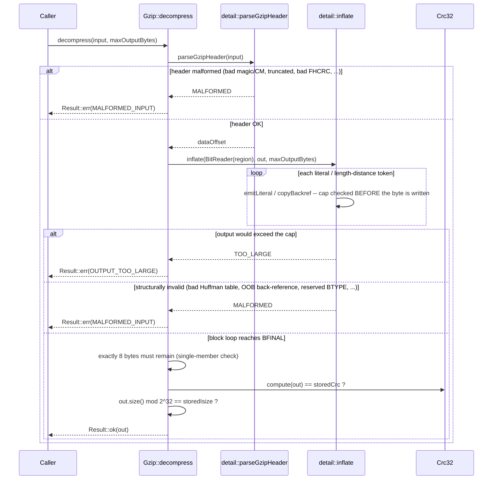

# Iora Gzip -- Architecture & Programmer's Guide

[Back to index](../../README.md)

| | |
|---|---|
| **Version** | 1.0 |
| **Date** | 2026-09-18 |
| **Status** | IMPLEMENTED |
| **Header** | `include/iora/util/gzip.hpp` |
| **Namespace** | `iora::util` (internal DEFLATE core in `iora::util::detail`, not part of the public surface) |
| **Public classes** | `Gzip` (facade), `Gzip::Encoder` (streaming), `Gzip::Level` (enum), `Gzip::DecompressError` (enum) |
| **Dependencies** | Two intra-Iora headers -- `iora/core/result.hpp` (`core::Result\<T, E\>`, the decode outcome type) and `iora/util/crc32.hpp` (`Crc32`, `Crc32::Incremental`, RFC 1952's integrity trailer). Standard library: `<algorithm>`, `<array>`, `<cassert>`, `<cstddef>`, `<cstdint>`, `<string>`, `<string_view>`, `<vector>`. No external/third-party dependencies -- no zlib, no miniz, nothing linked. |

---

## Revision History

| Version | Date | Changes |
|---|---|---|
| 1.0 | 2026-09-18 | Initial guide. Authored against `include/iora/util/gzip.hpp` (1310 lines) for the iora v1 documentation-wiki (`util` slice), and against `tests/util/iora_test_gzip.cpp` + `tests/util/iora_test_gzip_decode.cpp` (interop, determinism, malformed-input, and fuzz coverage). |

---

## 1. Executive Summary

### Problem

Iora's stated design tenet is a "zero external dependencies" microservice framework (`CLAUDE.md`'s Project Overview describes Iora as having "zero external dependencies"). Two real consumers already need gzip:

- **JSON-RPC over HTTP** negotiates and applies gzip content-coding on both ends: `iora/rpc/jsonrpc_client.hpp` compresses outgoing request bodies (`ctl.body = iora::util::Gzip::compress(dumped);`, `jsonrpc_client.hpp:2920`) and decodes gzip'd responses under a caller-configured byte cap (`jsonrpc_client.hpp:2742`); `iora/rpc/jsonrpc_http.hpp` does the mirror image on the server side (`jsonrpc_http.hpp:272`, `jsonrpc_http.hpp:538`).
- **Log rotation** in `iora/core/logger.hpp` compresses a just-rotated log file through the streaming `Gzip::Encoder` (`logger.hpp:2735`), one 64 KiB chunk at a time, so peak memory does not scale with log-file size.

Without a native codec, either of these would have to shell out to `gzip(1)`, vendor zlib, or reinvent DEFLATE badly. Reaching for a full-featured compression library for "produce and consume RFC 1952 gzip streams" would also be the wrong-sized tool: the actual requirement is a self-contained encoder/decoder pair with no build-system or licensing footprint.

### Solution

A single class, `iora::util::Gzip`, exposing three entry points backed by a from-scratch RFC 1951 DEFLATE implementation kept private in `iora::util::detail`:

- **`Gzip::compress(input, level)`** -- one-shot encode. Emits a single fixed-Huffman DEFLATE block (hash-chain LZ77 over a <=32 KB window) wrapped in a deterministic RFC 1952 gzip container.
- **`Gzip::Encoder`** -- streaming/incremental encode via `update()`/`finish()`, so a large file need not be materialized in RAM; retains only a <=32 KB back-reference window plus one pending segment.
- **`Gzip::decompress(input, maxOutputBytes)`** -- one-shot decode of *untrusted* input. Understands all three standard DEFLATE block types (stored, fixed-Huffman, dynamic-Huffman), so it decodes streams from `gunzip`/zlib/Python, not only its own encoder's output. Returns a `core::Result<std::string, Gzip::DecompressError>`.

### Technical Impact

- **Zero-dependency codec.** No zlib, no external process, no vendored C library -- ~1310 lines of self-contained C++17 in one header.
- **Zip-bomb-safe decoding.** `maxOutputBytes` is a *mandatory* parameter (no default) enforced incrementally, one literal/match at a time, before each byte is materialized -- never derived from the attacker-controlled trailer `ISIZE`. A multi-gigabyte bomb that gzips down to a few hundred bytes is rejected the moment decoded output would cross the cap, with the partial output simply discarded.
- **Bounded streaming memory.** `Gzip::Encoder` never buffers more than the 32 KB LZ77 window plus one pending (<32 KB) segment, regardless of total input size -- verified structurally by the multi-segment corpus round-trips in `tests/util/iora_test_gzip.cpp`.
- **Interop-verified, not self-certified.** Both directions are gated against an *independent* implementation: the encoder's output is validated by shelling out to `python3 gzip`/`gunzip` (never decoded by this library's own decoder, which would prove nothing), and the decoder is fed streams produced by `python3 gzip`/`gzip -c`, including dynamic-Huffman blocks this encoder never itself emits.
- **Deterministic, reproducible output.** `MTIME = 0`, `OS = 0xFF`, greedy (non-randomized) matching: `compress(x, level) == compress(x, level)` always, and a committed golden byte vector guards against silent format drift.

---

## 2. System Architecture

### 2.1 Component relationships

```
iora::util
|-- Gzip                                    (public facade; stateless statics + nested types)
|     |-- enum class Level                  FAST | DEFAULT | BEST
|     |-- static compress(view, level)      one-shot encode -> std::string
|     |-- class Encoder                     streaming encode (move-only, single-threaded use)
|     |     |-- Level _level
|     |     |-- bool _headerWritten, _finished
|     |     |-- std::string _buf            retained <=32KB window + pending (<32KB) segment
|     |     |-- std::size_t _emittedUpTo    boundary between retained history and pending data
|     |     |-- detail::BitWriter _bw       partial-block bit accumulator
|     |     |-- detail::MatchFinder _mf     reused hash-chain scratch (no per-segment realloc)
|     |     |-- Crc32::Incremental _crc     folds CRC-32 across update() calls
|     |     `-- std::uint64_t _isize        running uncompressed byte count
|     |-- enum class DecompressError        MALFORMED_INPUT | OUTPUT_TOO_LARGE
|     `-- static decompress(view, maxOutputBytes) -> core::Result<std::string, DecompressError>
|
`-- detail                                  (PRIVATE -- RFC 1951 DEFLATE core; not a supported API)
      |-- BitWriter / BitReader             LSB-first bit packing / unpacking
      |-- MatchFinder { head, prev }        hash-chain LZ77 scratch, zlib-style ring indexing
      |-- FixedHuff / HuffmanTree           canonical Huffman code tables (encode / decode sides)
      |-- fixedHuff() / fixedLitTree() / fixedDistTree()   lazily-built, process-wide read-only singletons
      |-- lz77Emit, emitMatch, emitSymbol, emitFixedBlock  encode path
      |-- inflate, inflateStored, inflateFixed, inflateDynamic, parseGzipHeader   decode path
      `-- gzipHeader, appendLE32, readLE16, readLE32       RFC 1952 container framing
```

`Gzip` itself holds no instance state -- `compress()` and `decompress()` are `static` free functions in class clothing. The **only** stateful, long-lived object in the public surface is `Gzip::Encoder`, and it owns everything it touches (`_buf`, `_bw`, `_mf`, `_crc`); it borrows nothing and is not observed by any other component.

### 2.2 Data flow -- one-shot `compress()`

```mermaid
sequenceDiagram
  participant App as Caller
  participant Gz as Gzip::compress
  participant BW as detail::BitWriter
  participant LZ as detail::lz77Emit
  participant Crc as Crc32

  App->>Gz: compress(input, level)
  Gz->>Gz: gzipHeader(xflFor(level))  [10-byte RFC 1952 header]
  Gz->>LZ: emitFixedBlock(bw, buf=input, histStart=0, 0, input.size(), bfinal=true, searchDepth(level))
  LZ->>LZ: hash3() + hash-chain search (<= searchDepth candidates, window <= 32768)
  LZ->>BW: putBits(literal / length-distance / EOB symbols)
  BW-->>Gz: buffer()  [complete bytes; header + block]
  Gz->>Crc: compute(input)
  Gz->>Gz: appendLE32(crc), appendLE32(input.size() mod 2^32)
  Gz-->>App: complete gzip stream
```

### 2.3 Data flow -- untrusted `decompress()`



### 2.4 Threading model

| Thread | Responsibility |
|---|---|
| **Any caller thread** | May call `Gzip::compress()` and `Gzip::decompress()` freely and concurrently -- both are stateless `static` functions with only function-local mutable state (`BitWriter`, `MatchFinder`, `BitReader`, the output `std::string`). The only shared state they touch is the lazily-built, read-only `fixedHuff()` / `fixedLitTree()` / `fixedDistTree()` function-local statics, whose one-time initialization is thread-safe by the C++11 "magic statics" guarantee. |
| **The thread that owns a given `Gzip::Encoder`** | Must be the *only* thread that calls `update()`/`finish()` on that instance, and must call them in that order with no external synchronization provided by the class itself. Two distinct `Encoder` instances share no state and may run on different threads simultaneously without any coordination. |

There is no background thread, no timer, and no lock anywhere in `gzip.hpp`.

---

## 3. Component Deep Dive

### 3.1 `Gzip::compress` -- one-shot encode

```cpp
static std::string compress(std::string_view input, Level level = Level::DEFAULT)
{
  std::string out = detail::gzipHeader(xflFor(level));
  detail::BitWriter bw;
  detail::MatchFinder mf;
  detail::emitFixedBlock(bw, detail::fixedHuff(), input.data(), 0, 0,
                         input.size(), true, searchDepth(level), mf);
  bw.alignToByte();
  out += bw.buffer();
  detail::appendLE32(out, Crc32::compute(input));
  detail::appendLE32(out, static_cast<std::uint32_t>(input.size() & 0xFFFFFFFFu));
  return out;
}
```

The entire input becomes **one** fixed-Huffman DEFLATE block (`bfinal = true`), with `histStart = 0` so back-references may reach anywhere already emitted, subject to the 32 KB window check inside `lz77Emit`. `level` affects only the LZ77 search depth (`searchDepth()`) and the header's `XFL` byte (`xflFor()`) -- it never changes the block structure or the container format. `Crc32::compute` and the `ISIZE` trailer are computed over the *original* input, exactly once, after the body is written.

### 3.2 `detail::lz77Emit` -- the LZ77 match finder

The heart of the encoder is a classic zlib-style hash-chain search over 3-byte prefixes:

```cpp
inline int hash3(const unsigned char *p)
{
  return ((static_cast<int>(p[0]) << 10) ^ (static_cast<int>(p[1]) << 5) ^
          static_cast<int>(p[2])) &
         GZIP_HASH_MASK;
}
```

`MatchFinder` holds two parallel arrays: `head[hash]` is the most recent position with that 3-byte hash, and `prev[pos & GZIP_WMASK]` chains backward to the previous position with the same hash. A search walks the chain up to `maxChain` (`searchDepth(level)`: 16 / 128 / 4096 for FAST / DEFAULT / BEST) candidates, rejecting any candidate farther than `GZIP_WSIZE` (32768) away, and byte-verifying every candidate before accepting it:

```cpp
while (cand >= 0 && (curRel - cand) <= GZIP_WSIZE && chain-- > 0)
{
  const std::size_t candPos = histStart + static_cast<std::size_t>(cand);
  std::size_t len = 0;
  while (len < maxLen && d[candPos + len] == d[p + len]) { ++len; }
  if (static_cast<int>(len) > bestLen) { bestLen = ...; bestDist = ...; if (len >= maxLen) break; }
  cand = prev[static_cast<std::size_t>(cand & GZIP_WMASK)];
}
```

Because every candidate is byte-verified regardless of hash-bucket aliasing, a hash collision can only cost compression ratio (a shorter match is chosen, or a literal is emitted), never correctness. Matching is **greedy** at every level: once a match of `bestLen >= GZIP_MIN_MATCH` (3) is found at the current position, it is taken immediately and the scan resumes after it. There is no one-position lookahead ("lazy matching") the way zlib's higher levels do -- `Level` only tunes how many chain candidates are examined per position (see Design Decisions D-3 and Known Limitations).

`MatchFinder`'s two vectors are allocated **once** (lazily, on first use) and merely `std::fill`-reset between blocks/segments -- the comment on the struct is explicit that re-allocating per 32 KB segment would cost a fresh malloc+zero of ~512 KB for every 32 KB of streamed input, which the design deliberately avoids by reuse.

### 3.3 `Gzip::Encoder` -- streaming encode

```cpp
std::string update(std::string_view chunk)
{
  assert(!_finished && "Gzip::Encoder::update() after finish()");
  if (_finished) { return {}; }
  std::string out;
  emitHeaderIfNeeded(out);
  _crc.update(chunk);
  _isize += chunk.size();
  _buf.append(chunk.data(), chunk.size());

  const int maxChain = searchDepth(_level);
  const detail::FixedHuff &h = detail::fixedHuff();
  while (_buf.size() - _emittedUpTo >= detail::GZIP_STREAM_SEGMENT)
  {
    const std::size_t histStart = windowStart();
    const std::size_t emitEnd = _emittedUpTo + detail::GZIP_STREAM_SEGMENT;
    detail::emitFixedBlock(_bw, h, _buf.data(), histStart, _emittedUpTo,
                           emitEnd, false, maxChain, _mf);
    _emittedUpTo = emitEnd;
    out += _bw.takeCompletedBytes();
    trimHistory();
  }
  return out;
}
```

Every full `GZIP_STREAM_SEGMENT` (32768 bytes) of newly-buffered input becomes one **non-final** fixed-Huffman block, written into the *same, continuous* `BitWriter` bit stream that spans the whole encoder lifetime -- `takeCompletedBytes()` hands out only whole bytes, leaving any partial bits in the accumulator so the bit stream is unbroken across segments and across `update()` calls. `finish()` mirrors this for the trailing partial segment, sets `bfinal = true`, byte-aligns, appends the CRC-32/`ISIZE` trailer folded incrementally by `_crc`/`_isize`, and marks the encoder `_finished`.

`windowStart()` / `trimHistory()` bound retained memory:

```cpp
std::size_t windowStart() const
{
  return (_emittedUpTo > GZIP_WSIZE) ? _emittedUpTo - GZIP_WSIZE : 0;
}

void trimHistory()
{
  const std::size_t keepFrom = windowStart();
  if (keepFrom > 0) { _buf.erase(0, keepFrom); _emittedUpTo -= keepFrom; }
}
```

After every segment flush, `_buf` retains at most the last 32 KB (the LZ77 back-reference window) plus whatever has been appended since but not yet flushed -- so `_buf.size()` never exceeds roughly `GZIP_WSIZE + GZIP_STREAM_SEGMENT` (64 KB) regardless of total stream length. This is the property `iora/core/logger.hpp`'s log-rotation compressor relies on when it feeds an arbitrarily large rotated log file through `update()` in 64 KiB reads.

The header is written **exactly once**, lazily, on whichever of `update()`/`finish()` first has bytes to emit (`emitHeaderIfNeeded`) -- so an encoder that is constructed and immediately `finish()`-ed with no `update()` calls still produces a well-formed (empty-payload) gzip member, header included.

**Copy/move.** `Encoder` is move-only:

```cpp
Encoder(Encoder &&) noexcept = default;
Encoder &operator=(Encoder &&) noexcept = default;
Encoder(const Encoder &) = delete;
Encoder &operator=(const Encoder &) = delete;
```

Copying would have to duplicate the in-flight bit accumulator, retained window, and running CRC/`ISIZE` -- two "copies" of an in-progress stream is a nonsensical concept for a container that must produce exactly one gzip member, so copy is a compile error rather than a silent trap.

### 3.4 `Gzip::decompress` -- untrusted decode

```cpp
static core::Result<std::string, DecompressError>
decompress(std::string_view input, std::size_t maxOutputBytes)
{
  using R = core::Result<std::string, DecompressError>;
  std::size_t dataOffset = 0;
  if (detail::parseGzipHeader(input, dataOffset) != detail::InflateStatus::OK)
  {
    return R::err(DecompressError::MALFORMED_INPUT);
  }
  const std::string_view region = input.substr(dataOffset);
  detail::BitReader br(region);
  std::string out;
  const detail::InflateStatus st = detail::inflate(br, out, maxOutputBytes);
  if (st == detail::InflateStatus::TOO_LARGE) { return R::err(DecompressError::OUTPUT_TOO_LARGE); }
  if (st != detail::InflateStatus::OK) { return R::err(DecompressError::MALFORMED_INPUT); }

  br.alignToByte();
  const std::size_t off = br.byteOffset();
  if (off + 8 != region.size()) { return R::err(DecompressError::MALFORMED_INPUT); }
  const std::uint32_t storedCrc = detail::readLE32(region, off);
  const std::uint32_t storedIsize = detail::readLE32(region, off + 4);
  if (Crc32::compute(out) != storedCrc) { return R::err(DecompressError::MALFORMED_INPUT); }
  if (static_cast<std::uint32_t>(out.size() & 0xFFFFFFFFu) != storedIsize)
  {
    return R::err(DecompressError::MALFORMED_INPUT);
  }
  return R::ok(std::move(out));
}
```

Five independent hardening properties, each backed by a dedicated section of `tests/util/iora_test_gzip_decode.cpp`:

1. **Header parsing bounds-checks every optional field.** `parseGzipHeader` validates the magic bytes and `CM = 8`, then walks `FEXTRA`/`FNAME`/`FCOMMENT` with explicit remaining-length checks against attacker-controlled lengths (an `FEXTRA` `XLEN` that claims more bytes than remain is rejected, not read past the end), and verifies `FHCRC` (the header's own CRC-16) when present. Reserved `FLG` bits 5-7 are ignored, matching zlib/gzip behavior.
2. **The output cap is enforced incrementally, per token, before the byte is written** -- `emitLiteral` and `copyBackref` both check `maxOutputBytes - out.size()` (in the overflow-safe subtraction form) *before* calling `out.push_back()`/copying, so decoding a gzip stream that claims (via its trailer `ISIZE`) to expand to gigabytes, but whose real decoded size would cross the cap, is aborted at the exact byte the cap is reached -- the trailer's `ISIZE` is never used to pre-size a buffer.
3. **Every back-reference distance is bounds-checked against output produced so far** -- `copyBackref` rejects `dist > out.size()` as `MALFORMED` (an out-of-bounds read on any other decoder), and overlapping copies (`length > dist`, i.e. RLE runs) are correct because each source byte is read fresh from `out` after it has already been produced by an earlier iteration of the same copy loop.
4. **The decoder always terminates.** `BitReader::getBits()` sets an internal error flag and stops advancing once it runs past the end of the finite input view; every decode function checks `br.error()` immediately after reading and returns `MALFORMED` rather than looping. Dynamic-Huffman RLE repeat codes are bounds-checked against the declared `HLIT + HDIST` total so they cannot run forever or overflow the length array.
5. **Exactly one gzip member is accepted.** After the `BFINAL` block completes and the bit position is byte-aligned, precisely 8 bytes (`CRC-32` + `ISIZE`) must remain -- fewer means a truncated stream, more means trailing data (including a second concatenated gzip member), and both are `MALFORMED_INPUT` (see Known Limitations).

### 3.5 `detail::inflateDynamic` -- decoding foreign dynamic-Huffman streams

Because the encoder only ever emits fixed-Huffman blocks, dynamic-Huffman decoding exists purely for interop: real-world producers (`gzip(1)`, zlib, Python's `gzip` module) choose dynamic-Huffman whenever it beats the fixed table, and the decoder must handle it to be usable as a general-purpose gzip reader. It reads `HLIT`/`HDIST`/`HCLEN`, builds the 19-symbol code-length Huffman table, RLE-expands it into the literal/length and distance code-length arrays (repeat codes 16/17/18 each bounds-checked against "no previous value to repeat" and "would overrun the declared total"), then builds the two decode tables via the same `buildHuffman()` used for every other Huffman table in this file. A table is accepted only if it is **complete** (every code-space slot used) or **incomplete in the single trivial way** permitted by RFC 1951 -- exactly one length-1 code and nothing else (`buildComplete`'s `left == 0 || lens.size() == count[0] + count[1]` check) -- an over-subscribed table, or an incomplete table with two or more distinct code lengths present, is rejected.

---

## 4. Usage Guide

### 4.1 One-shot round trip

```cpp
#include "iora/util/gzip.hpp"
#include <string>

using iora::util::Gzip;

std::string payload = "the quick brown fox jumps over the lazy dog";
std::string gz = Gzip::compress(payload);              // Level::DEFAULT

auto result = Gzip::decompress(gz, 1u << 20);           // 1 MiB cap
if (result.isOk())
{
  std::string recovered = std::move(result).value();
  // recovered == payload
}
```

### 4.2 Streaming a large file without loading it into memory

Mirrors `iora/core/logger.hpp`'s rotated-log compressor: read fixed-size chunks, feed each through `update()`, write out whatever bytes come back immediately.

```cpp
#include "iora/util/gzip.hpp"
#include <fstream>
#include <string>
#include <string_view>
#include <vector>

using iora::util::Gzip;

bool gzipFile(const std::string &srcPath, const std::string &dstPath)
{
  std::ifstream in(srcPath, std::ios::binary);
  std::ofstream out(dstPath, std::ios::binary);
  if (!in || !out)
  {
    return false;
  }

  Gzip::Encoder enc(Gzip::Level::DEFAULT);
  std::vector<char> buf(64 * 1024);
  while (in.good())
  {
    in.read(buf.data(), static_cast<std::streamsize>(buf.size()));
    const std::streamsize got = in.gcount();
    if (got > 0)
    {
      const std::string produced =
        enc.update(std::string_view(buf.data(), static_cast<std::size_t>(got)));
      out.write(produced.data(), static_cast<std::streamsize>(produced.size()));
    }
  }
  const std::string trailer = enc.finish();
  out.write(trailer.data(), static_cast<std::streamsize>(trailer.size()));
  return in.eof() && out.good();
}
```

Peak memory for `enc` is bounded at roughly `GZIP_WSIZE` (32 KB) plus one pending segment, independent of `srcPath`'s size.

### 4.3 Decoding an untrusted response body with a byte cap

Mirrors `iora/rpc/jsonrpc_client.hpp`'s gzip response decoding: distinguish "too large" from "corrupt" so the caller can react differently (e.g. HTTP 413 vs 400).

```cpp
#include "iora/util/gzip.hpp"
#include <stdexcept>
#include <string>

using iora::util::Gzip;

std::string decodeResponseBody(std::string_view wireBytes, std::size_t maxDecodedBytes)
{
  auto r = Gzip::decompress(wireBytes, maxDecodedBytes);
  if (!r.isOk())
  {
    if (r.error() == Gzip::DecompressError::OUTPUT_TOO_LARGE)
    {
      throw std::runtime_error("decoded response exceeds the configured byte cap");
    }
    throw std::runtime_error("response body is not a well-formed gzip stream");
  }
  return std::move(r).value();
}
```

### 4.4 Choosing a compression level

```cpp
#include "iora/util/gzip.hpp"

using iora::util::Gzip;
using Level = Gzip::Level;

// FAST:    shallow hash-chain search (depth 16)  -- lowest CPU, largest output.
// DEFAULT: moderate search (depth 128)            -- the default for compress()/Encoder.
// BEST:    deep search (depth 4096)               -- most CPU, smallest output for a
//                                                     given greedy-matching strategy.
std::string small = Gzip::compress(hotPathPayload, Level::FAST);
std::string tight = Gzip::compress(coldStorageBlob, Level::BEST);
```

### 4.5 Composing `decompress()` with `core::Result`'s monadic API

```cpp
#include "iora/util/gzip.hpp"
#include <algorithm>
#include <string>

using iora::util::Gzip;

std::size_t countLines(std::string_view gz, std::size_t maxDecodedBytes)
{
  return Gzip::decompress(gz, maxDecodedBytes)
    .map([](const std::string &text) {
      return static_cast<std::size_t>(
        std::count(text.begin(), text.end(), '\n'));
    })
    .valueOr(0);
}
```

### 4.6 Anti-Patterns

- **Do NOT pass an unbounded `maxOutputBytes` (e.g. `SIZE_MAX`) for untrusted input.** The whole point of the mandatory parameter is a real ceiling; passing the largest representable value defeats the zip-bomb guard exactly as if the cap did not exist. Size it to the protocol's actual maximum body size.
- **Do NOT call `Encoder::update()`/`finish()` after `finish()` has already been called.** A debug build `assert`s; a release build silently returns an empty string, which drops bytes without any signal -- track completion yourself (e.g. a local `bool`) rather than relying on the encoder to complain.
- **Do NOT expect `Gzip::decompress()` to read concatenated multi-member gzip streams.** It decodes exactly one member and rejects any trailing bytes as `MALFORMED_INPUT`, even though concatenated members are valid per RFC 1952 (see Known Limitations).
- **Do NOT share a single `Gzip::Encoder` instance across threads without external synchronization.** There is no internal locking; concurrent `update()`/`finish()` calls on the same instance race on `_buf`, `_bw`, `_crc`, and `_isize`.
- **Do NOT assume `Encoder`'s streamed output is byte-identical to `compress()`'s one-shot output for the same input.** They are decode-equivalent (same plaintext under any inflater) but not necessarily byte-identical, because block segmentation differs (one giant block vs. one block per 32 KB segment).
- **Do NOT expect `Level::BEST` to match a lazy-matching encoder like zlib level 9.** It only searches a deeper hash chain (4096 vs 128/16 candidates) with the same greedy algorithm; there is no one-step lookahead (see Known Limitations).

---

## 5. Call Flow / Sequence Reference

### 5.1 `Gzip::compress` -- success path

| Step | Actor | Action |
|---|---|---|
| 1 | `compress` | `out = gzipHeader(xflFor(level))` -- 10-byte RFC 1952 header, deterministic (`MTIME=0`, `OS=0xFF`). |
| 2 | `emitFixedBlock` | Write `BFINAL=1`, `BTYPE=01` (3 bits total). |
| 3 | `lz77Emit` | For the whole input: hash-chain search (<= `searchDepth(level)` candidates, window <= 32768), emit literal or length/distance symbols via the fixed-Huffman table. |
| 4 | `emitFixedBlock` | Emit the end-of-block symbol (256). |
| 5 | `compress` | `bw.alignToByte()`; append the completed bytes. |
| 6 | `compress` | `appendLE32(Crc32::compute(input))`, `appendLE32(input.size() mod 2^32)`. |
| 7 | `compress` | Return the complete gzip stream. |

### 5.2 `Gzip::Encoder::update` -- one segment flush

| Step | Actor | Action |
|---|---|---|
| 1 | `update` | `assert(!_finished)`; if already finished, return `{}` (release-safe no-op). |
| 2 | `emitHeaderIfNeeded` | Write the 10-byte header exactly once, on the first call that has bytes to emit. |
| 3 | `update` | Fold `chunk` into `_crc`, add to `_isize`, append to `_buf`. |
| 4 | `update` (loop) | While `_buf.size() - _emittedUpTo >= 32768`: compute `histStart = windowStart()`; `emitFixedBlock(..., bfinal=false, ...)` for `[_emittedUpTo, _emittedUpTo+32768)`. |
| 5 | `update` (loop) | `_emittedUpTo += 32768`; collect `_bw.takeCompletedBytes()`; `trimHistory()` drops retained history older than the 32 KB window. |
| 6 | `update` | Return whatever complete bytes were produced (may be empty if `_buf` has not yet reached a full segment). |

### 5.3 `Gzip::Encoder::finish` -- trailer

| Step | Actor | Action |
|---|---|---|
| 1 | `finish` | `assert(!_finished)`; if already finished, return `{}` (never emit a second trailer). |
| 2 | `emitHeaderIfNeeded` | Write the header if `update()` was never called with enough data to trigger it (e.g. zero-byte stream). |
| 3 | `finish` | `emitFixedBlock(..., emitStart=_emittedUpTo, emitEnd=_buf.size(), bfinal=true, ...)` for the remaining tail. |
| 4 | `finish` | `bw.alignToByte()`; collect the completed bytes. |
| 5 | `finish` | `appendLE32(_crc.value())`, `appendLE32(_isize mod 2^32)`. |
| 6 | `finish` | `_finished = true`; return the trailer bytes. |

### 5.4 `Gzip::decompress` -- success path

| Step | Actor | Action |
|---|---|---|
| 1 | `decompress` | `parseGzipHeader(input, dataOffset)` -- magic, `CM`, optional fields, `FHCRC` all validated. |
| 2 | `decompress` | `region = input.substr(dataOffset)` (DEFLATE body + 8-byte trailer). |
| 3 | `inflate` | Loop: read `BFINAL`/`BTYPE`; dispatch to `inflateStored`/`inflateFixed`/`inflateDynamic`; each token cap-checked before being written to `out`. |
| 4 | `inflate` | On the block with `BFINAL=1`, return `OK`. |
| 5 | `decompress` | `br.alignToByte()`; require exactly 8 bytes remain (single-member check). |
| 6 | `decompress` | `Crc32::compute(out) == storedCrc` and `out.size() mod 2^32 == storedIsize`. |
| 7 | `decompress` | Return `Result::ok(std::move(out))`. |

### 5.5 `Gzip::decompress` -- zip-bomb rejection (failure/cleanup path)

| Step | Actor | Action |
|---|---|---|
| 1-4 | (as above) | Header parses; `inflate` begins decoding tokens. |
| 5 | `emitLiteral` / `copyBackref` | Before writing the next literal/run, `maxOutputBytes - out.size()` would underflow (the write would exceed the cap) -> return `TOO_LARGE` immediately, with **no** further bytes written. |
| 6 | `inflate` | Propagate `TOO_LARGE` up through the block-body and block-type dispatch without further reads. |
| 7 | `decompress` | Map `TOO_LARGE` to `Result::err(DecompressError::OUTPUT_TOO_LARGE)`. The local `out` (holding only the bytes decoded up to the cap) is discarded by normal scope exit -- no explicit cleanup step exists or is needed. |

---

## 6. Thread Safety Model

| Operation | Synchronization | Notes |
|---|---|---|
| `Gzip::compress` | **None needed.** All mutable state (`BitWriter`, `MatchFinder`) is function-local. | Fully reentrant; safe to call from any number of threads concurrently with no coordination. |
| `Gzip::decompress` | **None needed.** All mutable state (`BitReader`, the output `std::string`) is function-local. | Fully reentrant, including on hostile/malformed input (see section 3.4, property 4: it always terminates). |
| `detail::fixedHuff()` / `fixedLitTree()` / `fixedDistTree()` | C++11 "magic statics" -- the function-local `static const` initializer runs exactly once even under concurrent first calls. | Read-only after construction; every `compress()`/`decompress()` call reads the same process-wide table, never mutates it. |
| `Gzip::Encoder::update` / `finish` | **None.** No mutex, no atomic, anywhere in the class. | The instance's internal state (`_buf`, `_bw`, `_mf`, `_crc`, `_isize`, `_headerWritten`, `_finished`) must be touched by exactly one thread at a time. Two distinct `Encoder` instances share no state and impose no ordering on each other. |
| `Gzip::Encoder` move construction/assignment | `= default`, not internally synchronized. | Moving an `Encoder` from one thread to another is safe only if the hand-off itself establishes a happens-before edge (e.g. via a queue, `std::future`, or a joining thread boundary) -- the move operation is not a substitute for that. |

**Mutex/atomic inventory (from source): none.** `gzip.hpp` contains zero `std::mutex`, zero `std::atomic`, and zero threads. Every safety property in this guide follows from state confinement (a caller-owned `Encoder` used by one thread) or from statelessness (`compress`/`decompress` as pure functions of their arguments plus a read-only, once-initialized table), never from locking.

---

## 7. Configuration Reference

| Parameter | Type | Default | Range / Units | Notes |
|---|---|---|---|---|
| `Gzip::compress(input, level)` -- `level` | `Gzip::Level` | `Level::DEFAULT` | `FAST` \| `DEFAULT` \| `BEST` | Tunes only LZ77 search effort and the header `XFL` byte; never changes decodability. |
| `Gzip::Encoder(level)` -- `level` | `Gzip::Level` | `Level::DEFAULT` | `FAST` \| `DEFAULT` \| `BEST` | Fixed for the lifetime of the encoder instance; cannot be changed mid-stream. |
| `Gzip::decompress(input, maxOutputBytes)` -- `maxOutputBytes` | `std::size_t` | **none -- required** | `0` .. `SIZE_MAX` bytes | `0` admits only an empty decoded payload; any other value is a hard, incrementally-enforced ceiling on decoded output size. There is no way to decode without specifying a cap. |
| `Level::FAST` -> search depth | `int` (private, `searchDepth()`) | -- | `16` chain candidates | Lowest CPU per position, largest output among the three levels. |
| `Level::DEFAULT` -> search depth | `int` (private, `searchDepth()`) | -- | `128` chain candidates | The default for both `compress()` and `Encoder`. |
| `Level::BEST` -> search depth | `int` (private, `searchDepth()`) | -- | `4096` chain candidates | Highest CPU per position; still greedy matching (see Known Limitations). |
| `Level::FAST`/`DEFAULT`/`BEST` -> `XFL` byte | `unsigned char` (private, `xflFor()`) | -- | `4` / `0` / `2` | RFC 1952 §2.3.1: `2` = compressor used maximum compression, `4` = compressor used fastest algorithm; `0` for the unspecified default case. |
| LZ77 back-reference window | `constexpr int GZIP_WSIZE` | -- | `32768` bytes, fixed | RFC 1951's maximum; not configurable (matches the format's own 15-bit distance-code ceiling of 32768). |
| Streaming flush granularity | `constexpr std::size_t GZIP_STREAM_SEGMENT` | -- | `32768` bytes, fixed | The `Encoder` flushes one non-final block per this many buffered bytes; independent of how the caller chunks `update()` calls (verified by the chunk-independence test). Not configurable. |

---

## 8. API Reference

```cpp
namespace iora
{
namespace util
{

class Gzip
{
public:
  enum class Level
  {
    FAST,
    DEFAULT,
    BEST
  };

  static std::string compress(std::string_view input, Level level = Level::DEFAULT);

  class Encoder
  {
  public:
    explicit Encoder(Level level = Level::DEFAULT);

    Encoder(Encoder &&) noexcept = default;
    Encoder &operator=(Encoder &&) noexcept = default;
    Encoder(const Encoder &) = delete;
    Encoder &operator=(const Encoder &) = delete;

    std::string update(std::string_view chunk);
    std::string finish();
  };

  enum class DecompressError
  {
    MALFORMED_INPUT,
    OUTPUT_TOO_LARGE
  };

  static core::Result<std::string, DecompressError>
  decompress(std::string_view input, std::size_t maxOutputBytes);
};

} // namespace util
} // namespace iora
```

---

## 9. Design Decisions

| ID | Decision | Rationale |
|---|---|---|
| D-1 | From-scratch RFC 1951/1952 implementation rather than linking zlib or shelling out to `gzip(1)`. | Preserves iora's zero-external-dependency posture for a capability two in-tree consumers (JSON-RPC content-coding, log rotation) already need. |
| D-2 | The encoder emits **only** fixed-Huffman blocks; dynamic-Huffman is decode-only. | A fixed-table encoder is far simpler to get right and still produces a fully RFC-1951-legal, universally decodable stream; dynamic-Huffman *decoding* is still required for interop with foreign producers (D-7). |
| D-3 | Greedy (not lazy) LZ77 matching at every `Level`; the level tunes only hash-chain search depth. | Simpler encoder with no one-step lookahead bookkeeping. Lazy matching for `BEST` is an explicitly deferred phase-3 enhancement (source comment on `Level`). |
| D-4 | The DEFLATE core lives in a private `detail` namespace; only the gzip container (`Gzip`) is public. | The internal block/bitstream format is free to change without an API break; callers depend only on "produces/consumes a standard gzip stream." |
| D-5 | `Encoder` retains only a <=32 KB window plus one pending (<32 KB) segment. | Bounds peak memory independent of total stream length -- the property `logger.hpp`'s rotated-log compressor relies on. |
| D-6 | `decompress()`'s `maxOutputBytes` parameter has **no default** and is enforced incrementally, never from the trailer `ISIZE`. | Makes the zip-bomb guard opt-out-proof: a caller cannot forget to specify a cap, and the untrusted trailer never sizes a buffer. |
| D-7 | The decoder accepts all three standard DEFLATE block types (stored/fixed/dynamic) though the encoder only ever emits fixed. | Must interoperate with `gunzip`/zlib/Python output, not merely round-trip its own encoder -- verified by cross-decoding a Python/zlib-produced corpus. |
| D-8 | Decode failures collapse to exactly two kinds, `MALFORMED_INPUT` and `OUTPUT_TOO_LARGE`. | Lets a caller map cleanly to two distinct outward responses (e.g. HTTP 400 vs 413) without over-specifying an internal failure taxonomy the caller cannot usefully act on differently. |
| D-9 | `decompress()` accepts exactly one gzip member; any trailing bytes are `MALFORMED_INPUT`. | Matches the single-response-body use case (HTTP/JSON-RPC) and lets the "no more, no less than 8 trailer bytes remain" invariant be checked exactly, rather than looping over an open-ended number of members. |
| D-10 | `Encoder` is move-only, copy-`delete`d. | A copy would have to duplicate an in-flight bit accumulator, retained window, and running CRC/`ISIZE`; two "copies" mid-stream cannot both validly finish the same conceptual gzip member, so copying is a compile error rather than a runtime footgun. |
| D-11 | `Gzip::Level` is nested inside `Gzip`, like `core::Logger::Level`. | The call site (`Gzip::Level::BEST`) names what it configures; a bare top-level `Level` enum would be ambiguous across the codebase. |
| D-12 | Fully deterministic output: `MTIME = 0`, `OS = 0xFF`, greedy (non-randomized) matching. | `compress(x, level) == compress(x, level)` always holds, which backs both a committed golden-byte-vector regression test and general reproducible-build expectations. |

---

## 10. Known Limitations

Per the project's code-defect honesty rule, every item below is reported as a finding regardless of when it was introduced or whether it is already described in a source comment; disposition is the human's call.

- **`decompress()` accepts exactly one gzip member; a concatenated multi-member stream is rejected as `MALFORMED_INPUT`.** `gzip.hpp:1262-1269`: after the `BFINAL` block completes, exactly 8 bytes must remain, or the call fails. This is a deliberate, class-doc-stated scope choice ("Reads a single RFC 1952 gzip member") that matches the class's current consumers (a single HTTP/JSON-RPC body, a single rotated log file), but a caller who assumes "decodes any standard gzip stream" (a phrase used in the class-level doc comment, `gzip.hpp:1043-1044`) at face value could be surprised that `cat a.gz b.gz | this-decoder` fails, since concatenated members are valid per RFC 1952 §2.2 ("A gzip file consists of a series of 'members'..."). Confirmed by the "trailing bytes after a valid member" test case (`tests/util/iora_test_gzip_decode.cpp:460-465`). **Impact:** low for the class's current in-tree consumers (all single-member), but worth an explicit doc-comment caveat if `Gzip` is ever reused for a context that might see concatenated streams (e.g. reading an arbitrary `.gz` file from disk).
- **`Level::BEST` does not implement lazy matching.** It only deepens the greedy hash-chain search (4096 vs. 128/16 chain candidates); a one-step lookahead ("is there a better match starting one byte later?") is not implemented. This is explicitly flagged in the source as a deferred phase-3 follow-up (`gzip.hpp:1060-1061`, `1288-1290`). **Impact:** `BEST`'s compression ratio will not match a lazy-matching encoder (e.g. zlib level 9) on inputs where deferring a match by one byte would find a longer one; it is still a correct, RFC-1951-legal, byte-reproducible encoding.
- **No raw-DEFLATE or zlib-wrapped output mode.** Only the RFC 1952 gzip container is exposed; a caller needing a bare DEFLATE stream (no 10-byte header/8-byte trailer) or a zlib stream (RFC 1950, 2-byte header + Adler-32 trailer) has no supported entry point, even though the underlying `detail::` DEFLATE core could in principle support it.
- **No incremental/streaming decompression.** `Gzip::decompress()` is one-shot only and requires the entire compressed input up front; there is no `Decoder` class mirroring `Encoder`. This is adequate for the class's current consumers (bounded-size HTTP/JSON-RPC bodies under `maxOutputBytes`) but would need new work to decode a stream larger than available memory for the *compressed* input itself.
- **`Gzip::Encoder` exposes no way to inspect pending/undelivered byte count or force an early partial-segment flush.** A caller must call `finish()` (ending the stream) to retrieve all bytes; there is no `flush()` that returns pending bytes while leaving the member open for more `update()` calls.
- **Test-coverage cross-check:** the two test files (`tests/util/iora_test_gzip.cpp`, `tests/util/iora_test_gzip_decode.cpp`) are extensive -- reference-inflater interop (Python/`gunzip`) for the encoder, reference-encoder interop (Python/`gzip -c`, including dynamic-Huffman) for the decoder, a committed golden byte vector, an exhaustive hand-built malformed-stream corpus (bad magic/CM, truncation, corrupt CRC/ISIZE, reserved `BTYPE`, over-subscribed/incomplete Huffman tables, header-field overruns), the zip-bomb/cap-boundary-exactness cases, and a 40000-iteration mutation-fuzz loop under an ASan-buildable configuration. One path is not directly exercised: an `Encoder` whose `finish()` is called with **zero** prior `update()` calls (an empty streamed member produced entirely by `finish()`'s own `emitHeaderIfNeeded`) is not asserted by name in either test file, though the one-shot `compress("")` empty-payload path is (`iora_test_gzip_decode.cpp:349-356`). **Impact:** low -- the code path (`emitHeaderIfNeeded` called from `finish()` when `_headerWritten` is still false) is straightforward and shared with the exercised `update()`-driven path, but it is currently unasserted rather than proven.

---
