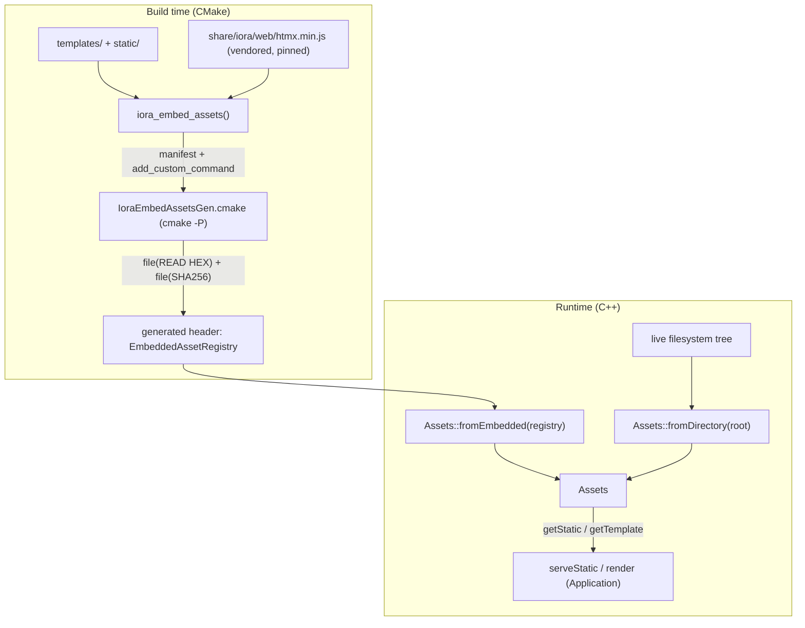

# Iora Asset Pipeline — Architecture & Programmer's Guide

[Back to index](../../README.md)

| | |
|---|---|
| **Version** | 1.0 |
| **Date** | 2026-09-22 |
| **Status** | IMPLEMENTED |
| **Header** | `include/iora/web/assets.hpp` (header-only) |
| **CMake** | `cmake/IoraEmbedAssets.cmake`, `cmake/IoraEmbedAssetsGen.cmake` |
| **Vendored** | `share/iora/web/htmx.min.js` |
| **Namespace** | `iora::web` |
| **Dependencies** | `iora::crypto::SecureRng::sha256` (OpenSSL EVP), `iora::util::Base64Url::encode`, `std::filesystem`, POSIX `open`/`read` (`O_NOFOLLOW`); CMake ≥ 3.14 |
| **Tests** | `tests/web/test_assets.cpp` (21 `TEST_CASE`s), gated by `-DIORA_BUILD_WEB_TESTS=ON` |
| **Architecture** | `architecture/iora/asset_pipeline.json` |

---

## Revision History

| Version | Date | Changes |
|---|---|---|
| 1.0 | 2026-09-22 | Guide migrated into the grouped `docs/web/` set with a full step-13 re-verify against the current `assets.hpp` and `IoraEmbedAssets.cmake`. Documents the `Assets` runtime (embedded + filesystem modes), `iora_embed_assets()` pure-CMake codegen, vendored-htmx self-hosting, the single-owned-handle blob lifetime, and the path-traversal chokepoint. |

---

## 1. Executive Summary

### Problem

iora has an HTTP server but no way to serve static assets (CSS/JS/images/fonts) or templates, and no way to ship them *inside* the binary. A daemon wanting an HTMX-style admin UI would otherwise hand-roll MIME mapping, content-hash ETags, gzip negotiation, path-traversal defense, and a byte-array codegen step — none of which had any precedent in iora.

### Solution

Two cooperating halves behind one small interface:

1. **Runtime** (`web/assets.hpp`) — the `Assets` value type with two factories. `Assets::fromEmbedded(registry)` serves assets compiled into the binary (production, single-binary deploy). `Assets::fromDirectory(root)` reads from a live filesystem tree (dev / `--asset-root`). Both expose the same `getTemplate()` / `getStatic()` / `reload()` surface; only the backing store differs.
2. **Build-time codegen** (`cmake/IoraEmbedAssets.cmake` + generator) — `iora_embed_assets()` walks a `templates/` + `static/` tree and generates a self-contained C++ header containing per-file byte arrays, build-time SHA-256 ETags, and an `EmbeddedAssetRegistry` instance that `fromEmbedded` consumes. It also self-hosts a pinned `htmx.min.js` (no CDN) and is reachable by out-of-tree `find_package(Iora)` consumers.

### Technical Impact

A consumer ships one binary with every template and asset embedded; flips to a live directory for dev iteration without a rebuild; gets correct content types, content-hash cache validators, optional precompressed gzip, and a hardened path-traversal chokepoint — in a handful of lines. `getStatic` supplies only data (bytes + MIME + raw ETags + gzip availability); all HTTP response-header policy (ETag quoting, `Vary`, `304`, `If-None-Match`, `Content-Encoding`, security headers) is owned by `serveStatic` in the [application-wiring layer](application.md) (RD-4), keeping `Assets` a pure supplier.

---

## 2. System Architecture



**Two runtime modes, one interface.**

- **Embedded mode** (`fromEmbedded`): pure map lookups over static-storage byte arrays — lock-free, zero-copy. The one exception is RD-11 *external-fallback*: paths the codegen was told to exclude (`EXTERNAL_PATTERNS`) are read per-request from a runtime `EXTERNAL_DIR`.
- **Filesystem mode** (`fromDirectory`): reads from disk into a per-path content+ETag cache guarded by a single leaf mutex, populated with double-checked locking. Intended for dev iteration; an optional per-request-read mode bypasses the cache.

**Data flow for a static GET** (in the consumer's daemon): `HttpServer` route → `serveStatic` (decodes path once, cheap pre-check) → `Assets::getStatic(pathRest)` → tri-state `GetStaticResult` → `serveStatic` maps `Rejected → 400`, `NotFound → 404`, `Found → 200 | 304` and owns all headers.

**Threading model.** Embedded mode is immutable-after-construction and fully concurrent with no locking. Filesystem mode uses one `mutable std::mutex` (a leaf lock) over the cache; `getStatic` copies the owning `shared_ptr` out under the lock and returns by value, so returned views survive a concurrent `reload()`.

`Assets` is a copyable/movable value type: embedded mode holds a non-owning registry **pointer** (never a reference member, so copy/move-assignment is not deleted); filesystem mode holds the mutable cache + leaf mutex behind a `shared_ptr`.

---

## 3. Component Deep Dive

### 3.1 `StaticCacheEntry` and `StaticBlob` (the ownership model)

`getStatic` returns a `GetStaticResult { Status status; StaticBlob blob; }`. `StaticBlob`'s public read surface is all non-owning views:

```cpp
struct StaticBlob
{
  std::string_view bytes;                     // asset content
  std::string_view mime;                      // resolved from extension (static-storage literal)
  std::string_view rawEtag;                   // identity ETag, UNQUOTED
  std::optional<std::string_view> gzipBytes;  // precompressed .gz, if present
  std::string_view gzipEtag;                  // gzip ETag, UNQUOTED (distinct from rawEtag)
  bool gzipVariantExists = false;
  std::shared_ptr<const StaticCacheEntry> _entry; // owner; LAST-declared
};
```

The lifetime contract (RD-20 / thread H-1) is the crux. A returned blob must keep `bytes`/`rawEtag`/`gzipBytes`/`gzipEtag` valid for the whole response **and across a concurrent `reload()`**.

- **Embedded (non-external):** the views point into static-storage byte arrays / registry literals, always valid; `_entry == nullptr` (zero-copy fast path).
- **Filesystem and embedded-external-fallback:** a single `std::shared_ptr<const StaticCacheEntry>` (`_entry`) owns the byte buffer, the identity ETag string, and (if present) the gzip bytes and gzip ETag — *together, in one allocation*. All four views point into that one `*_entry`, so a single `shared_ptr` copy keeps every view alive. `_entry` is the **last-declared** member so defaulted member-wise copy/assignment reseats ownership consistently with the views.

This single-handle shape replaced an earlier two-owner design (separate owners for bytes vs gzip, with a bare-view ETag) that left the ETag string in a separately-mutated cache slot — a use-after-free when a concurrent `reload()` freed it mid-response. The single handle eliminates that class of bug. `StaticCacheEntry` itself is immutable once built (`shared_ptr<const ...>`): no field is mutated after publication into the cache.

### 3.2 `mimeForExtension` — the single source of truth (RD-5)

MIME is resolved at runtime from the file extension by one table inside `Assets`, used by *both* modes. The codegen bakes **no** MIME and the registry stores **no** MIME field, so there is no second table to drift from. Notable entries: `.js`/`.mjs → text/javascript` (RFC 9239, supersedes `application/javascript`); `.json`/`.map → application/json`; `.svg → image/svg+xml`; fonts per RFC 8081; `.xml → application/xml; charset=utf-8`; unknown → `application/octet-stream` (never empty). Extension matching is case-insensitive and operates on the last dot of the last path segment (so `app.min.js → .js`; `.gitignore` and `dir.x/file → no extension → octet-stream`; `app.` → a lone `.` that matches no table entry → octet-stream). Every returned `mime` is a static-storage literal, so it is mode-independent and never dangles.

> **Security note (SVG).** `.svg → image/svg+xml` is an active-content sink — SVG can carry `<script>`, `on*` handlers, and `<foreignObject>`. The MIME decision is made here, but the mitigation (`X-Content-Type-Options: nosniff` + a restrictive CSP, or `Content-Disposition: attachment`) is owned by `serveStatic` ([application-wiring](application.md)) per RD-4. This is especially relevant for operator/tenant-supplied files reached through `EXTERNAL_DIR`.

### 3.3 `getStatic` — lookup + the path-traversal chokepoint (OQ-9)

`getStatic(path)` operates on an **already-percent-decoded** path (the caller decodes exactly once; `getStatic` never decodes — avoiding the double-decode traversal class). Steps:

1. **Lexical rejection → `Rejected`** if the path has a `..` segment, a leading `/`, a NUL byte, or a backslash.
2. **Lookup.**
   - *Embedded non-external:* binary-search the sorted `statics` table; zero-copy views, `_entry == nullptr`.
   - *Embedded external-fallback (RD-11):* if the path is in the registry's `externalPaths`, read it per-request from `EXTERNAL_DIR` (model A — fresh local handle, no shared cache, no lock).
   - *Filesystem:* the double-checked-locking cache (model B), or per-request read.
3. For filesystem/external: resolve `<root>/<path>` with `std::filesystem::weakly_canonical`, then verify **component-wise containment** under the canonical root (`lexically_relative` must not begin with `..`) — *not* a string `starts_with` (which would admit a sibling-prefix escape such as `/srv/assets` accepting `/srv/assets-evil/x`). The file is then opened with `O_NOFOLLOW` (see §3.7), and only after the open succeeds are bytes read.
4. **MIME** from the extension; **identity ETag** (embedded: build-time hex; filesystem/external: runtime Base64Url of a 16-byte SHA-256 truncation); **gzip availability** + distinct **gzipEtag** if a `.gz` variant exists.
5. Return `Found` by value (the owning `shared_ptr` travels with the result).

### 3.4 `getTemplate`

Returns an **owning** `std::optional<std::string>` of the raw template source (the input to `Mustache::render`), or `nullopt` if absent. A traversal name returns `nullopt` (template names are server-controlled, never request-derived). In filesystem mode the copy is taken **under the cache mutex**, so the returned value is reload-safe — a concurrent `reload()` that clears the template cache cannot invalidate it (the same use-after-free class that `getStatic`'s `StaticBlob` closes via shared ownership; here the small template is simply copied, since every caller renders from an owned string anyway). The `PartialResolver` bridge in the application layer returns the `std::optional<std::string>` directly.

### 3.5 `reload()`

Embedded mode: a literal no-op (touches no mutex, no state, never throws). Filesystem mode: takes the leaf mutex and clears the per-path caches so the next lookup re-reads from disk. Clearing only drops the cache's `shared_ptr` references; any `StaticBlob` already returned keeps its own `_entry`, so `reload()` never invalidates an in-flight response.

### 3.6 The build-time codegen (`iora_embed_assets()`, self-hosting, distribution)

**`iora_embed_assets()`** is a configure-time CMake function that walks `TEMPLATES_DIR` and `STATIC_DIR`, classifies each file (embed / external-pattern / template), writes a manifest, and wires an `add_custom_command` that invokes the pure-CMake generator (`IoraEmbedAssetsGen.cmake`) via `cmake -P`. The generator emits per-file `static const unsigned char[]` byte arrays (via `file(READ ... HEX)`), 32-hex-char build-time ETags (via `file(SHA256)`, 16-byte truncation), optional gzip variants (via `gzip -9 -c`) with their own ETags, and one `EmbeddedAssetRegistry` instance with flat **sorted** tables (so the runtime binary-search is correct). The `add_custom_command` DEPENDS on the explicit walked file list, so a *content* edit re-runs the codegen (a `CONFIGURE_DEPENDS` glob alone would only catch add/remove).

**Codegen safety:** asset paths containing `"`, `\`, `;`, `|`, newline, or any byte outside tab + printable ASCII (`0x09`, `0x20`–`0x7E`) are rejected at classification with `FATAL_ERROR` (they would corrupt the manifest grammar or the emitted C++ literal, or break the ASCII-sorted binary search); the generator additionally escapes emitted string literals as defense-in-depth.

**htmx self-hosting (LD-10).** iora vendors a pinned `htmx.min.js` under `share/iora/web/` and installs it. `iora_embed_assets()` **automatically** folds it into the consumer's embedded static set keyed `htmx.min.js` (the registry key; it is then served under whatever prefix the consumer passes to `serveStatic`, e.g. `/static/htmx.min.js`) unless `NO_VENDOR_HTMX` is passed. If the consumer's own `static/` already contains an `htmx.min.js`, the consumer's file wins (with a `STATUS` message). No CDN, ever — the rationale is air-gapped/firewalled appliances and the single-binary promise.

**Distribution wiring (H-6/R-14).** The top-level `CMakeLists.txt` installs `IoraEmbedAssets.cmake` + `IoraEmbedAssetsGen.cmake` to `${CMAKE_INSTALL_LIBDIR}/cmake/Iora` (alongside `IoraConfig.cmake`) and the vendored htmx to `${CMAKE_INSTALL_DATADIR}/iora/web`. `IoraConfig.cmake.in` `include()`s the module (guarded by `if(EXISTS)`), so every `find_package(Iora)` consumer gets `iora_embed_assets()` in scope. An out-of-tree consumer sub-project (`tests/web/cmake/test_embed_assets/`) proves this end-to-end against a freshly-installed package.

### 3.7 Security: path traversal and TOCTOU

`getStatic` is the canonical filesystem-read chokepoint. Defense in depth:

1. **Lexical rejection** (`..` segment, leading `/`, NUL, backslash) before any I/O → `Rejected`.
2. **Component-wise containment** after `weakly_canonical` — defeats sibling-prefix escapes and symlinks present at check time (a symlink escaping the root resolves and is rejected by containment). A *legitimate* within-root symlink still serves (it resolves to its canonical in-root target).
3. **`O_NOFOLLOW` on the canonical leaf** — closes the check-then-open TOCTOU race: a file swapped for an escaping symlink *between* the containment check and the open is refused atomically (`ELOOP` → `NotFound`). Because the path opened is the already-resolved canonical target, a legitimate within-root symlink asset is unaffected.

**Residuals (documented):** Windows lacks `O_NOFOLLOW` and falls back to an `ifstream` open under the trust-boundary contract; intermediate-component symlink swaps (not just the leaf) would require an `openat()` chain (out of v1 scope).

**Trust boundary.** The asset root and `EXTERNAL_DIR` must not be writable by principals less trusted than the daemon.

---

## 4. Usage Guide

### Production: embed assets into your binary (out-of-tree consumer)

```cmake
find_package(Iora REQUIRED)
add_executable(mydaemon main.cpp)
target_link_libraries(mydaemon PRIVATE Iora::iora_lib OpenSSL::Crypto)

iora_embed_assets(
  TARGET        mydaemon
  TEMPLATES_DIR ${CMAKE_CURRENT_SOURCE_DIR}/web/templates
  STATIC_DIR    ${CMAKE_CURRENT_SOURCE_DIR}/web/static
  HEADER_OUT    ${CMAKE_CURRENT_BINARY_DIR}/gen/embedded_assets.hpp
  PRECOMPRESS   gzip)        # optional; vendored htmx.min.js is auto-included
```

> **Note.** Link `OpenSSL::Crypto` — the runtime ETag path is header-inline `SecureRng::sha256` (OpenSSL EVP), so the consumer translation unit needs it even if it only serves embedded assets (the external-fallback branch references it).

```cpp
#include "embedded_assets.hpp"          // generated; include in EXACTLY ONE TU
#include <iora/web/assets.hpp>

iora::web::Assets assets = iora::web::Assets::fromEmbedded(kEmbeddedAssets);
auto r = assets.getStatic("app.css");
if (r.status == iora::web::GetStaticResult::Status::Found)
{
  // serve r.blob
}
```

### Dev: serve from a live tree (no rebuild on edit)

```cpp
auto assets = iora::web::Assets::fromDirectory("/path/to/web"); // expects web/static, web/templates
// ... edit files on disk ...
assets.reload();                          // drop the cache; next read re-reads disk
// or: Assets::fromDirectory(root, /*perRequestRead=*/true) to skip the cache entirely
```

### Templates (Mustache integration)

```cpp
auto src = assets.getTemplate("index.html"); // std::optional<std::string> (owning, reload-safe)
// In the application layer, the PartialResolver returns it directly:
//   [&assets](std::string_view name) -> std::optional<std::string>
//   { return assets.getTemplate(name); }
```

### Anti-patterns

- **Do NOT double-decode.** Decode `req.pathRest` exactly once before calling `getStatic`, and never rely on `getStatic` to decode.
- **Do NOT re-read a template you already hold to "refresh" it mid-request.** `getTemplate` returns an owning, reload-safe `std::optional<std::string>`; a value already returned is a stable snapshot and a concurrent `reload()` does not affect it.
- **Do NOT include the generated header in more than one translation unit** (its tables are `static`/internal-linkage by contract).
- **Do NOT construct `Assets` after starting the HTTP engine.** Construct during setup, before `http.start()` (safe publication to worker threads).
- **Do NOT place the asset root or `EXTERNAL_DIR` somewhere writable by principals less trusted than the daemon** (see §3.7 TOCTOU residual).

---

## 5. Call Flow / Sequence Reference

### Embedded static hit (zero-copy)

| Step | Action |
|---|---|
| 1 | `getStatic("css/app.css")` → lexical check passes |
| 2 | `findStatic` binary-searches the sorted table → hit |
| 3 | `embeddedBlob`: views into static storage, MIME from `.css`, registry hex ETag, `_entry = nullptr` |
| 4 | Return `Found`. No lock, no allocation |

### Filesystem cold miss (double-checked locking)

| Step | Action |
|---|---|
| 1 | Lexical check → resolve `weakly_canonical(staticsRoot/path)` → component-wise containment → `is_regular_file` |
| 2 | Lock; cache miss; **unlock** |
| 3 | `buildEntry`: `open(O_RDONLY \| O_NOFOLLOW \| O_CLOEXEC)` the canonical leaf, read bytes, `SecureRng::sha256` → Base64Url ETag; read `<path>.gz` if present |
| 4 | Re-lock; **re-check** (another thread may have inserted) → adopt existing or `emplace` the new entry; copy the `shared_ptr` out; unlock |
| 5 | `blobFromEntry` points the views into `*_entry`; return `Found` by value |

**Concurrent `reload()` during a response:** the in-flight blob holds its own `_entry`; `reload()`'s `clear()` only drops the cache's reference, so the response's bytes/ETags stay valid until the blob is destroyed.

---

## 6. Thread Safety Model

| Operation | Embedded mode | Filesystem mode |
|---|---|---|
| `getStatic` (non-external) | lock-free (immutable static-storage reads) | leaf-mutex DCL cache; copy `shared_ptr` under lock, return by value |
| `getStatic` (external-fallback / per-request) | lock-free (fresh local handle per call) | lock-free per-request mode (fresh local handle) |
| `getTemplate` | lock-free (owning copy) | leaf-mutex cache; **owning copy taken under the lock → reload-safe** |
| `reload()` | no-op (no mutex, no state) | leaf-mutex `clear()`; in-flight blobs survive |

- **One leaf lock.** `FsState::mutex` is the only synchronization primitive, documented as a leaf lock (no other lock acquired while held; `Assets` invokes no user callback, so there is no copy-then-invoke concern). Declared `mutable` so the `const` accessors can lock it.
- **Double-checked locking (cold miss).** Lookup under lock → read+hash+canonicalize **outside** the lock → re-acquire, re-check presence, then insert a fully-built immutable entry (never an empty-then-filled slot). Two readers racing the same cold path converge on one shared entry (asserted in the tests via `_entry` pointer identity).
- **RD-20 ownership.** The owning `shared_ptr` is copied out **under** the lock before unlocking; no bare view into the mutable cache crosses the return boundary.
- **Safe publication.** The lock-free embedded claim and the per-request paths assume the `Assets` instance is fully constructed before being shared with worker threads (construct during setup, then `http.start()`).

---

## 7. Configuration Reference (`iora_embed_assets()` arguments)

| Argument | Required | Default | Effect |
|---|---|---|---|
| `TARGET` | yes | — | Consumer target the generated header attaches to; generation is wired into its build. |
| `TEMPLATES_DIR` | yes | — | Template source dir. Missing → `FATAL_ERROR` at configure. |
| `STATIC_DIR` | yes | — | Static-asset source dir. Missing → `FATAL_ERROR` at configure. |
| `HEADER_OUT` | yes | — | Generated header path (under the build tree; its dir is added to the target's include path). |
| `REGISTRY_NAME` | no | `kEmbeddedAssets` | C++ identifier of the emitted registry instance (multiple registries can coexist). |
| `EXTERNAL_PATTERNS` | no | — | Globs (e.g. `*.jpg`) excluded from embedding; recorded in `externalPaths` for runtime `EXTERNAL_DIR` reads. |
| `EXTERNAL_DIR` | no | — | Runtime directory for `EXTERNAL_PATTERNS` files. |
| `MAX_EMBEDDED_SIZE` | no | — | Soft cap on total embedded bytes; exceeding it emits a `WARNING` with a per-file breakdown (does not fail the build). |
| `PRECOMPRESS` | no | — | `gzip` → emit a sibling gzip byte array + distinct `gzipEtag` per text-like asset (already-compressed formats skipped; needs `gzip` on PATH, else skipped with a `STATUS`). |
| `NO_VENDOR_HTMX` | no | (off) | Suppress the automatic vendored `htmx.min.js` injection. |

**Runtime:** `Assets::fromDirectory(root, perRequestRead = false)` — set `perRequestRead = true` to bypass the cache (read fresh per request) in dev.

---

## 8. API Reference

```cpp
namespace iora::web
{

struct StaticCacheEntry
{
  std::string bytes;
  std::string etag;
  std::optional<std::string> gzipBytes;
  std::string gzipEtag;
};

struct StaticBlob
{
  std::string_view bytes, mime, rawEtag;
  std::optional<std::string_view> gzipBytes;
  std::string_view gzipEtag;
  bool gzipVariantExists = false;
  std::shared_ptr<const StaticCacheEntry> _entry; // impl detail; LAST member
};

struct GetStaticResult
{
  enum class Status { Found, NotFound, Rejected };
  Status status = Status::NotFound;
  StaticBlob blob;
};

struct EmbeddedAsset
{
  std::string_view path, bytes, etag;
  std::optional<std::string_view> gzipBytes;
  std::string_view gzipEtag;
};

struct EmbeddedTemplate
{
  std::string_view name, bytes;
};

struct EmbeddedAssetRegistry
{
  const EmbeddedTemplate* templates = nullptr;
  std::size_t templatesCount = 0;
  const EmbeddedAsset* statics = nullptr;
  std::size_t staticsCount = 0;
  std::string_view externalDir;
  const std::string_view* externalPaths = nullptr;
  std::size_t externalPathsCount = 0;
};

class Assets
{
public:
  static Assets fromEmbedded(const EmbeddedAssetRegistry& registry);
  static Assets fromDirectory(const std::filesystem::path& root, bool perRequestRead = false);
  std::optional<std::string> getTemplate(std::string_view name) const;
  GetStaticResult getStatic(std::string_view path) const;
  void reload();
  static std::string_view mimeForExtension(std::string_view path);
};

} // namespace iora::web
```

`Assets` is a copyable/movable value type. `fromDirectory` throws `std::filesystem::filesystem_error` at construction if `root` does not exist or is not a directory.

---

## 9. Design Decisions

| Decision | Rationale |
|---|---|
| **LD-5:** single-binary embedding default; `fromDirectory` dev escape hatch | C++ daemon idiom; one interface, two backing stores. |
| **LD-9:** embed images/fonts too; `EXTERNAL_PATTERNS` escape hatch; `MAX_EMBEDDED_SIZE` warning; gzip-only precompress | Single-binary promise covers binaries; guardrails keep size sane. |
| **LD-10:** htmx strictly self-hosted (no CDN), auto-vendored with `NO_VENDOR_HTMX` opt-out | Air-gapped appliances + single-binary; automatic-with-opt-out fails safe. |
| **RD-4:** `serveStatic` owns all response headers; `Assets` supplies bytes + MIME + raw ETags + gzip availability | Single ownership of HTTP cache/encoding semantics; `Assets` stays a pure supplier. |
| **RD-5:** C++ MIME map is the single source of truth; registry stores no MIME | Eliminates dual-table drift. |
| **RD-10:** `getStatic` returns tri-state (`Found`/`NotFound`/`Rejected`) | Adversarial input (400) is first-class-distinct from a routine miss (404). |
| **RD-11:** hybrid embedded+external mode (guarded `EXTERNAL_DIR` read) | Escape hatch for large/volatile binaries. |
| **RD-20 / H-1:** one `shared_ptr<const StaticCacheEntry>` owns bytes+etags+gzip together; views alias it | Fixes the dangling-view / etag-UAF-across-reload class. |
| **M-f:** distinct `gzipEtag` per representation | RFC 9110 §8.8.1 per-representation validators; lets `serveStatic` 304 a gzip-cached client correctly. |
| **OQ-9:** path-traversal chokepoint in `getStatic` (lexical + component-wise containment + `O_NOFOLLOW`) | Enforcement at the real read site; tri-state surfaces `Rejected`. |
| **OQ-10:** build-time ETag via `file(SHA256)` (hex); runtime via `SecureRng::sha256`+Base64Url | No new hashing primitive; pure-CMake build-time path. |

---

## 10. Known Limitations

- **No runtime gzip** — only build-time-precompressed `.gz` variants are served; a client requesting gzip for an asset with no precompressed variant gets identity bytes.
- **No brotli** in v1 (`PRECOMPRESS gzip` only).
- **No filesystem watcher** — dev refresh is manual `reload()` or per-request reads (no inotify/kqueue).
- **Large-blob codegen** uses pure-CMake `file(READ HEX)`, which materializes the whole file in CMake memory — slow for multi-MB blobs; mitigated by `EXTERNAL_PATTERNS` and `MAX_EMBEDDED_SIZE`.
- **Build-time vs runtime ETag encodings differ** (hex vs Base64Url) — acceptable because embedded and filesystem modes are never mixed for one asset in one deployment.
- **`fromDirectory` is dev-oriented** — not optimized for high-concurrency production serving.
- **TOCTOU residuals** — `O_NOFOLLOW` closes the leaf race on POSIX; Windows falls back to the trust-boundary contract; intermediate-component symlink swaps need an `openat()` chain (deferred).
- **Asset paths must be tab or printable ASCII** (`0x09`, `0x20`–`0x7E`) without `" \ ; |` or newline (rejected at configure) — developer-controlled embedded asset names, not end-user uploads.
- **Generated header is single-TU** — include `embedded_assets.hpp` in exactly one translation unit.
- **`getTemplate` returns an owning copy, not a zero-copy view.** In embedded mode this copies from static storage (the sole callers render from an owned string anyway, so the copy is net-zero); a hypothetical caller wanting a zero-copy template view is not served by this API.
