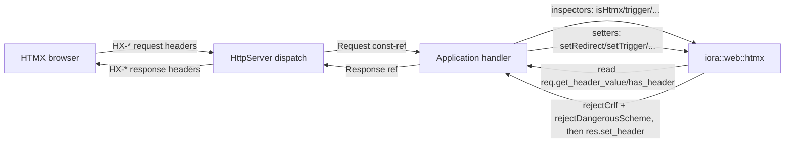

# Iora HTMX Helpers — Architecture & Programmer's Guide

[Back to index](../../README.md)

| | |
|---|---|
| **Version** | 1.0 |
| **Date** | 2026-09-22 |
| **Status** | IMPLEMENTED |
| **Header** | `include/iora/web/htmx.hpp` (header-only) |
| **Namespace** | `iora::web::htmx` (internal guards in `iora::web::htmx::detail`) |
| **Dependencies** | `iora/network/http_server.hpp` (`HttpServer::Request` / `HttpServer::Response`); `<optional>`, `<stdexcept>`, `<string>`, `<string_view>` |
| **Tests** | `tests/web/test_htmx_helpers.cpp` (27 `TEST_CASE`s), gated by `-DIORA_BUILD_WEB_TESTS=ON` |
| **Architecture** | `architecture/iora/htmx_helpers.json`, `architecture/iora/htmx_support_overview.json` |

---

## Revision History

| Version | Date | Changes |
|---|---|---|
| 1.0 | 2026-09-22 | Guide migrated into the grouped `docs/web/` set, consolidating the former `htmx_helpers` reference and the feature-context framing from `htmx_architecture`. Full step-13 re-verify against the current `htmx.hpp`: 5 request inspectors, 6 response setters, CR/LF rejection (M-8), dangerous-URL-scheme rejection (M-B). |

---

## 1. Executive Summary

### Problem

Iora's `HttpServer` has no awareness of the HTMX `HX-*` header convention. A handler cannot tell an HTMX-driven partial request apart from a full-page browser navigation, cannot read which element triggered a request or what the intended target is, and has no typed way to emit the `HX-*` response headers HTMX interprets (client redirect, full refresh, history push, retarget, swap-strategy override, client-side events). Without helpers, handlers hand-roll string reads/writes against the raw header map — repeatedly, inconsistently — and write URL-valued response headers through the *unsanitized* `Response::set_header`, opening a CR/LF header-injection hole and a dangerous-URL-scheme (navigation-XSS) hole.

### Solution

`include/iora/web/htmx.hpp` adds eleven pure free functions in `iora::web::htmx` over the *existing* `HttpServer::Request` (const ref, inspectors) and `HttpServer::Response` (non-const ref, setters). It introduces **zero new types** and makes **no change to `HttpServer`**. Five **request inspectors** read `HX-*` request headers; six **response setters** write `HX-*` response headers. The value-taking setters reject CR/LF (M-8); the two URL-valued setters additionally reject the dangerous schemes `javascript:`/`data:`/`vbscript:` (M-B).

### Technical Impact

Handlers gain a thin, faithful, opt-in HTMX surface with built-in injection protection, at the lowest possible risk: the component adds behavior over types that already exist, and an existing handler that never calls these functions sees no difference.

### Where this fits

The HTMX helpers are one tier of iora's broader HTMX-support feature — library primitives for building server-rendered web apps with no SPA and no npm toolchain. The sibling guides cover the rest of the feature: the [`Application` facade](application.md) (the coordinator that wires everything), the [asset pipeline](asset_pipeline.md) (static serving + build-time embedding), [SSE + channels](../network/sse_and_channels.md) (live updates), [Mustache templating](../parsers/mustache.md), [HTML escape / form parsing](../parsers/html_escape.md), and the [middleware interfaces](middleware_interfaces.md) (the pluggable auth seams). This guide documents the `web/htmx.hpp` layer specifically.

---

## 2. System Architecture

The helpers are a thin, stateless layer **above** `HttpServer` and **below** application handlers. They do not participate in routing, locking, or the worker pool.



**Data flow.** Inspectors call `Request::get_header_value` (returns `""` for a missing key) and `Request::has_header` on the request's header map, which is **case-insensitive** (the comparator is a locale-independent ASCII fold, *not* `std::tolower`). Setters validate the value and then call `Response::set_header`, which is the one-line, unsanitized `headers[key] = value`.

**Threading model.** None of its own. Inspectors are pure reads over a caller-owned `const Request`; setters mutate only the caller-owned `Response` passed by reference. A `Request`/`Response` is owned by a single handler invocation on a single worker thread, so the helpers are reentrant and safe to call concurrently across distinct request/response objects. There is no shared mutable state, no synchronization primitive, and no observer dispatch.

---

## 3. Component Deep Dive

### Request inspectors

All five are total and **non-throwing**.

| Function | Reads header | Returns | Semantics |
|---|---|---|---|
| `isHtmx` | `HX-Request` | `bool` | `true` iff present and value is the literal lowercase `"true"` (HTMX always sends lowercase). Missing → `""` ≠ `"true"` → `false`. |
| `isBoost` | `HX-Boosted` | `bool` | Same exact-`"true"` rule; set by HTMX for `hx-boost`'ed requests. |
| `trigger` | `HX-Trigger` | `std::optional\<std::string\>` | The triggering element **id**. Absent → `nullopt`; present-but-empty → `optional("")` (distinguished via `has_header`). |
| `triggerName` | `HX-Trigger-Name` | `std::optional\<std::string\>` | The triggering element **name**. Same present/absent semantics. |
| `target` | `HX-Target` | `std::optional\<std::string\>` | The target element id. Same present/absent semantics. |

**The id-vs-name caveat (critical, AH-9).** HTMX sends `HX-Trigger` **iff the triggering element has an `id`**, and `HX-Trigger-Name` **iff it has a `name`** — the two are **independent**, not alternatives: an element with both attributes sends **both** headers. Therefore `trigger() == nullopt` does **not** mean "no element triggered the request" — the element may simply have no `id` (it may still expose a `name`). A handler that must identify the triggering element should prefer `trigger()` (id) and **fall back to** `triggerName()` (name). This caveat is documented on both functions.

**The `HX-Trigger` overload (DD-3).** The request-side `HX-Trigger` (read by `trigger()`, an element id) and the response-side `HX-Trigger` (written by `setTrigger()`, fires client-side events) share the header name by HTMX design. The direction (request vs response) disambiguates; the two are kept as separate functions.

**Why `bool` vs `optional` (DD-4).** `isHtmx`/`isBoost` are predicates — a missing header simply means "not HTMX/boosted", so `bool` with exact-`"true"` matching suffices and a missing header naturally maps to `false`. `trigger`/`triggerName`/`target` carry an opaque string whose *absence* is meaningfully different from an *empty value*, so they return `optional` and use `has_header` to preserve that distinction.

### Response setters

All six write through `Response::set_header`. The value-taking setters validate first.

| Function | Writes header | Sanitizes | Notes |
|---|---|---|---|
| `setRedirect` | `HX-Redirect` | CR/LF + scheme | Client-side full-page navigation (`window.location.href`). |
| `setRefresh` | `HX-Refresh: true` | — (constant) | Full client-side reload. No value argument. |
| `setPushUrl` | `HX-Push-Url` | CR/LF + scheme | Pushes a URL into history/location. Literal `"false"` suppresses the history update. |
| `setRetarget` | `HX-Retarget` | CR/LF | CSS selector overriding the swap target. Not a URL → no scheme check. |
| `setReswap` | `HX-Reswap` | CR/LF | `hx-swap` strategy override; CR/LF rejection is defense-in-depth. |
| `setTrigger` | `HX-Trigger` | CR/LF | Fires client-side events. Value is an **opaque** string: a bare event name **or** pre-serialized compact JSON (this helper does not build/validate JSON). |

The setters materialize the `std::string_view` argument into a `std::string` because `set_header` takes `const std::string&`.

### Internal guard: `detail::rejectCrlf` (M-8)

Rejects a value containing CR (`0x0D`) or LF (`0x0A`) **anywhere**, throwing `std::invalid_argument` naming the offending header **before** any write. Both CR and LF are independently rejected (defends bare-LF smuggling as well as full CRLF). It inspects **raw bytes**, so a JSON-escaped `\n` (the two bytes `0x5C 0x6E`) is *not* a newline and passes. Used by all five value-taking setters; `setRefresh` (constant value) is exempt. This closes the response-splitting / header-injection hole left open by the unsanitized `set_header`.

### Internal guard: `detail::rejectDangerousScheme` (M-B)

Rejects a value whose URL scheme case-insensitively equals one of `{javascript, data, vbscript}`, throwing `std::invalid_argument` naming the offending header before any write. Used by `setRedirect` and `setPushUrl` only.

**Algorithm (mirrors WHATWG URL parsing / RFC 3986 §3.1):**

1. Skip leading C0 controls + SPACE (bytes `0x00`–`0x20`). (TAB `0x09` is in this range, so a *leading* TAB is skipped here.)
2. If the first remaining byte is **not** an ASCII letter, there is no scheme → accept (relative paths, fragments, `"false"`, bare tokens).
3. Collect scheme characters — `ALPHA / DIGIT / '+' / '-' / '.'` — **ignoring TAB (`0x09`)** within the scheme region, until a `:` terminates the run. Any **other** non-scheme byte (including NUL `0x00` and other C0 controls) terminates the run with no `:` found → no scheme → accept.
4. ASCII-fold the collected scheme to lowercase and compare **exactly** against the dangerous set.

**Boundary cases (locked by tests):**

- `javascript:`, `JavaScript:`, `JAVASCRIPT:`, `  javascript:` (leading whitespace), `\x01javascript:` (leading C0), `java\tscript:` (interior TAB), `java\tSCRIPT:` (TAB + uppercase), `data:...`, `vbscript:...` → **rejected**.
- `https://...`, `/admin/x`, `#section`, `false`, `data-driven/path` (no `:`-terminated scheme), `javascript-foo:` (folds to `javascript-foo` ≠ `javascript`), bare `javascript` (no `:`), `mailto:...`, `tel:...` → **accepted**.
- `java\x01script:`, `java\x00script:` (interior NUL / other C0) → **accepted** — the run terminates with no `:`, exactly as a browser would refuse to parse them as the `javascript` scheme.

**Byte-classification discipline.** Every byte test operates on `static_cast\<unsigned char\>` with explicit ASCII ranges (never locale `std::isalpha`/`std::tolower`; the value may contain bytes ≥ `0x80` and `char` is signed). The `string_view` is **not** NUL-terminated and may contain `0x00`; every index is bounds-checked against `size()`.

**Ordering contract.** `rejectDangerousScheme` **must** be called *after* `rejectCrlf`. On its own it does not reject CR/LF — an interior CR/LF would merely terminate the scheme run (no `:` → accepted), yet a browser strips tab/CR/LF across the whole URL before parsing, so `java\nscript:` would execute. Both current callers (`setRedirect`, `setPushUrl`) call `rejectCrlf` first, so no CR/LF ever reaches the scheme guard in practice; any future caller on a navigable-URL sink must preserve that ordering and never use `rejectDangerousScheme` as the sole guard.

**Scope.** The scheme guard rejects dangerous *schemes* only; it does **not** enforce same-origin / open-redirect policy — a scheme-clean absolute cross-origin URL is accepted, and origin policy is the handler's responsibility.

---

## 4. Usage Guide

### Quick start

```cpp
#include <iora/web/htmx.hpp>
using iora::network::HttpServer;
namespace htmx = iora::web::htmx;

server.onGet("/widgets",
             [](const HttpServer::Request& req, HttpServer::Response& res)
             {
               if (htmx::isHtmx(req))
               {
                 res.set_content(renderFragment(), "text/html"); // bare fragment for HTMX
               }
               else
               {
                 res.set_content(renderFullPage(), "text/html"); // full document for navigation
               }
             });
```

### Identifying the triggering element (id then name)

```cpp
std::string who = htmx::trigger(req).value_or(htmx::triggerName(req).value_or("(unknown)"));
```

### Driving the client from a response

```cpp
htmx::setRedirect(res, "/login");                 // client-side full-page navigation
htmx::setRefresh(res);                            // force a full reload
htmx::setPushUrl(res, "/widgets/42");             // update history; "false" suppresses it
htmx::setRetarget(res, "#error-box");             // swap into a different element
htmx::setReswap(res, "beforeend");                // override hx-swap
htmx::setTrigger(res, "saved");                   // fire a bare event
htmx::setTrigger(res, R"({"showMessage":"ok"})"); // fire an event with a JSON detail payload
```

### Anti-patterns

- **Do NOT assume `trigger() == nullopt` means "no trigger".** Check `triggerName()` too (the id-vs-name caveat).
- **Do NOT expect `isHtmx`/`isBoost` to match case-insensitively.** They match the literal lowercase `"true"`; a non-conformant client sending `"True"`/`"TRUE"` is treated as not-HTMX (deliberate fidelity to HTMX).
- **Do NOT pass request-derived URLs through `setRedirect`/`setPushUrl` expecting open-redirect protection.** They reject CR/LF and the dangerous-scheme set, but do **not** police same-origin — validate the host/scheme yourself if you need it.
- **Do NOT expect a 400 from a rejected value.** A request-derived bad value yields HTTP 500 (see Call Flow); pre-validate if you want a client-error 400.
- **Do NOT hand `setTrigger` a `Json` object.** It does not build JSON — serialize it yourself and pass the string.

---

## 5. Call Flow / Sequence Reference

### Setter happy path (`setRedirect`)

| Step | Action |
|---|---|
| 1 | `setRedirect(res, url)` → `detail::rejectCrlf("HX-Redirect", url)` — no CR/LF, returns |
| 2 | `detail::rejectDangerousScheme("HX-Redirect", url)` — scheme not dangerous, returns |
| 3 | `res.set_header("HX-Redirect", std::string(url))` — header written |

### Setter rejection → HTTP 500 (request-derived bad value)

| Step | Action |
|---|---|
| 1 | Handler passes a request-derived value containing CR/LF (or a `javascript:` scheme) to `setRedirect` |
| 2 | The guard throws `std::invalid_argument` **before** `set_header` — no `HX-Redirect` header is ever placed on the response |
| 3 | The exception propagates uncaught out of the handler into the routing safety net (`HttpServer::invokeWithSafetyNet`), which catches `std::exception` |
| 4 | The safety net sets `res.status = 500`, writes a generic body, and clears any suppression |
| 5 | The client receives **500** with **no** split/`HX-Redirect` header. The injection is blocked |

A handler wanting a client-error **400** must pre-validate the value itself; the setters cannot know the value's provenance (request-derived vs config-derived) and therefore cannot choose 400 vs 500.

### Inspector over the wire (OWS trimming)

A request line `HX-Request: true ` (trailing space) yields `isHtmx() == true`: the header parser (`parseHeaderLine` in `parsers/http_message.hpp`) trims leading/trailing SP/HTAB from the header **value** before it reaches the map, so the exact-`"true"` match succeeds. The helper itself does not trim; the parser does.

---

## 6. Thread Safety Model

| Surface | Guarantee |
|---|---|
| Request inspectors | Pure reads over a caller-owned `const Request`. No shared state. Reentrant; safe to call concurrently from any worker thread. |
| Response setters | Mutate only the caller-owned `Response` passed by reference. No shared state. Not designed for concurrent mutation of the **same** `Response` from multiple threads (no such usage exists in the single-handler-per-thread model). |
| Internal guards | Pure functions over their arguments; no state. |

There are no mutexes, atomics, condition variables, or callbacks in this component.

---

## 7. Configuration Reference

None. The component has no configurable parameters, no global state, and no build options of its own. It compiles whenever `iora/network/http_server.hpp` is available. Its test target is gated by the project-wide `-DIORA_BUILD_WEB_TESTS=ON`.

---

## 8. API Reference

```cpp
namespace iora::web::htmx
{

// Request inspectors (total, non-throwing).
bool                       isHtmx(const iora::network::HttpServer::Request& req);
std::optional<std::string> trigger(const iora::network::HttpServer::Request& req);
std::optional<std::string> triggerName(const iora::network::HttpServer::Request& req);
std::optional<std::string> target(const iora::network::HttpServer::Request& req);
bool                       isBoost(const iora::network::HttpServer::Request& req);

// Response setters.
void setRedirect(iora::network::HttpServer::Response& res, std::string_view url);        // CR/LF + scheme
void setRefresh(iora::network::HttpServer::Response& res);                               // constant "true"
void setPushUrl(iora::network::HttpServer::Response& res, std::string_view url);         // CR/LF + scheme
void setRetarget(iora::network::HttpServer::Response& res, std::string_view selector);   // CR/LF
void setReswap(iora::network::HttpServer::Response& res, std::string_view strategy);     // CR/LF
void setTrigger(iora::network::HttpServer::Response& res, std::string_view eventOrJson); // CR/LF

} // namespace iora::web::htmx
```

The value-taking setters throw `std::invalid_argument` (naming the offending `HX-*` header) on a rejected value, before any header is written.

---

## 9. Design Decisions

| Decision | Rationale |
|---|---|
| **DD-1:** Value setters reject CR/LF by throwing (not stripping); `setRefresh` exempt. The throw surfaces as a 500 via the routing safety net for request-derived values. | `set_header` is unsanitized; CR/LF enables response splitting. Throwing fails loudly and forces a clean value. Scoping the fix to the helpers avoids changing `HttpServer` behavior for all callers. |
| **DD-2:** Free functions over the existing `Request`/`Response`; zero new types. | HTMX awareness is a thin convention over standard headers; a wrapper type would add ceremony and a second representation with no safety benefit. |
| **DD-3:** Keep request-side `trigger()` and response-side `setTrigger()` as separate functions sharing the `HX-Trigger` name. | HTMX overloads the name by direction; matching it keeps the API faithful. |
| **DD-4:** `isHtmx`/`isBoost` return `bool` (exact `"true"`); `trigger`/`triggerName`/`target` return `optional` using `has_header`. | Predicates need no present/absent distinction; opaque-string inspectors do (absent ≠ empty). |
| **DD-5:** `setTrigger` takes an opaque `string_view` (event name or pre-serialized JSON), not a `Json` object. | Avoids a JSON-parser dependency and keeps the header to a pure free-function-over-Request/Response shape. |
| **DD-7:** Add `triggerName()` and document the id-vs-name caveat on both inspectors. | Without it, a handler relying on `trigger()` alone silently fails to identify any element lacking an `id`. |
| **DD-8:** `setRedirect`/`setPushUrl` reject `{javascript, data, vbscript}` after the CR/LF check; not applied to non-URL setters; same-origin/open-redirect intentionally out of scope. | `HX-Redirect`/`HX-Push-Url` are client-side navigation sinks; a scheme-clean but script-pseudo-scheme value is a DOM-XSS-via-navigation hole that CR/LF rejection does not close. Origin policy needs the caller's allow-list, which the helper cannot know. |

---

## 10. Known Limitations

- **Common HX-* set only.** v1 wraps `HX-Request`, `HX-Trigger`, `HX-Trigger-Name`, `HX-Target`, `HX-Boosted` (request) and `HX-Redirect`, `HX-Refresh`, `HX-Push-Url`, `HX-Retarget`, `HX-Reswap`, `HX-Trigger` (response). Less-common headers — request-side `HX-Current-URL`, `HX-Prompt`, `HX-History-Restore-Request`; response-side `HX-Location`, `HX-Replace-Url`, `HX-Reselect`, `HX-Trigger-After-Settle`, `HX-Trigger-After-Swap` — are not wrapped. Handlers can read/write them directly via `Request::get_header_value` / `Response::set_header`.
- **The escape hatch has no guards.** Writing a deferred `HX-*` header directly via `set_header` gets **neither** the CR/LF guard **nor** the scheme guard. Such handlers must validate request-derived values themselves. `HX-Location` is the highest-risk deferred header: it navigates via AJAX + `history.pushState` (not `window.location.href`), so it does not even benefit from the browser's top-level `data:`-navigation block — a future typed `setLocation` helper must route through both guards.
- **No open-redirect / same-origin enforcement.** The scheme guard rejects dangerous schemes only; a scheme-clean absolute cross-origin URL is accepted. Open-redirect prevention is the handler's responsibility.
- **`setTrigger` does not build or validate JSON.** It takes a pre-serialized string. A `Json`-object overload is a candidate future addition.
- **`set_header` itself remains unsanitized.** The CR/LF and scheme guards live only in these helpers; hardening `set_header` for all callers is intentionally out of scope (a separate `HttpServer` change).
- **`isHtmx`/`isBoost` match `"true"` case-sensitively.** A non-conformant client sending `"True"`/`"TRUE"` is treated as not-HTMX — a deliberate fidelity-to-HTMX choice.
- **SSE/WebSocket push is a separate subsystem.** These helpers concern only the synchronous `HX-*` request/response protocol over ordinary HTTP responses; live updates are documented in [sse_and_channels.md](../network/sse_and_channels.md).
